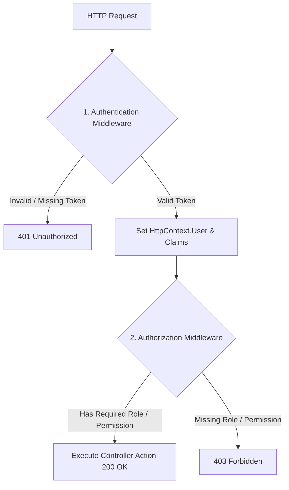
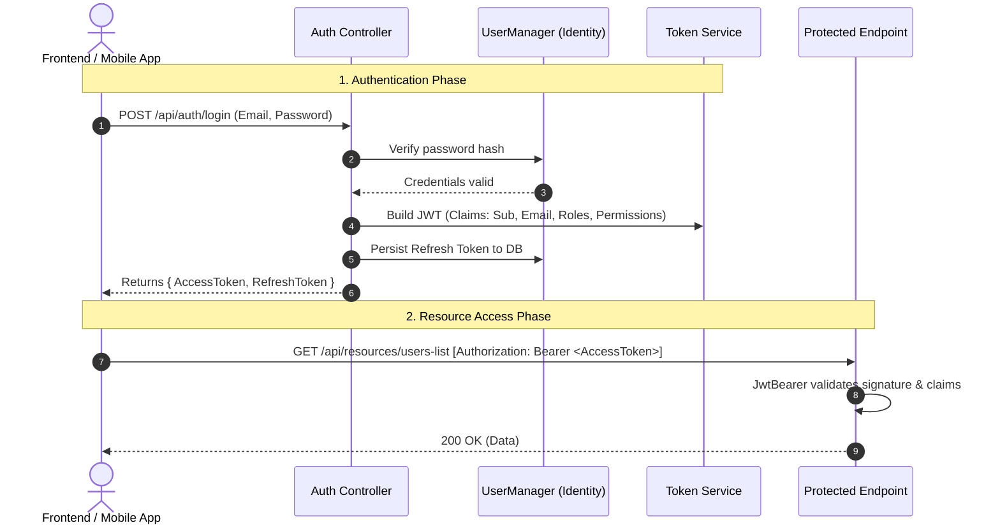

# 01 - Introduction & Tech Stack

## Overview

In modern backend architecture, securing Web APIs requires a robust authentication (who you are) and authorization (what you can do) system. This project demonstrates an enterprise-grade security architecture using **.NET 10**, **ASP.NET Core Identity**, and **JSON Web Tokens (JWT)** with dynamic policy evaluation.

---

## The Tech Stack

| Technology | Role & Purpose |
| :--- | :--- |
| **.NET 10 (C# 13)** | The latest high-performance, cross-platform framework by Microsoft. |
| **ASP.NET Core Identity** | Comprehensive membership system handling password hashing (PBKDF2 HMAC-SHA512), user records, email confirmation, security stamps, and lockout policies. |
| **Entity Framework Core 10** | Modern ORM connecting ASP.NET Core Identity to database tables. Configured with SQLite for local development and easily switchable to PostgreSQL or SQL Server. |
| **Microsoft.AspNetCore.Authentication.JwtBearer** | Middleware that validates incoming JWT tokens in the `Authorization: Bearer <token>` HTTP header. |
| **IAuthorizationPolicyProvider** | Dynamic authorization provider creating policies on the fly without hardcoded startup configurations. |
| **Scalar API Reference** | Modern, interactive API testing UI powered by OpenAPI in .NET 10. |

---

## Authentication vs. Authorization

- **Authentication (401 Unauthorized)**: Answers *"Who is making this request?"*. Checked by `UseAuthentication()` verifying the cryptographic signature and expiration of the JWT.
- **Authorization (403 Forbidden)**: Answers *"Does this authenticated user have permission to perform this action?"*. Checked by `UseAuthorization()` evaluating roles, claims, and policies.

---

## Architecture Flow

---

## What's Next?

Proceed to [02-database-and-identity-models.md](file:///C:/Users/Hoang/Desktop/clean/docs/02-database-and-identity-models.md) to learn how ASP.NET Core Identity models and Entity Framework Core work under the hood.
