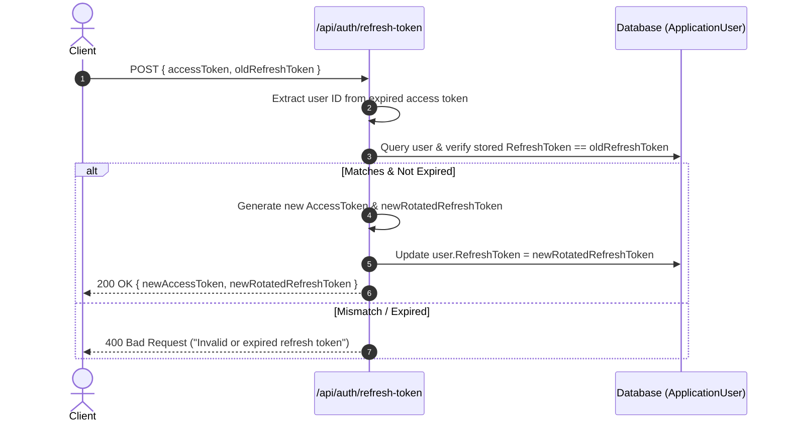

# 04 - Auth Controller & Refresh Token Rotation

## 1. Why Do We Need Refresh Tokens?

- **Stateless Access Tokens (JWT)** cannot be revoked without maintaining a centralized distributed blacklist (which removes the performance benefits of stateless JWTs).
- Therefore, **Access Tokens must expire quickly** (e.g. 15 to 30 minutes).
- To prevent users from having to log in with their password every 15 minutes, we issue a **Refresh Token** (valid for 7 days) stored in the database.
- When the Access Token expires, the client calls `/api/auth/refresh-token` to obtain a fresh pair.

---

## 2. Refresh Token Rotation Flow

To protect against stolen refresh tokens, modern security standards mandate **Refresh Token Rotation**:

1. When a client presents an old refresh token, that token is **invalidated immediately**.
2. A **brand new** refresh token is issued along with the new access token.
3. If an attacker tries to use an already-used refresh token, the server rejects the request.



---

## 3. Implementation in `AuthService.cs`

In [AuthService.cs](../Services/AuthService.cs):

### A. Login & Issuance

```csharp
public async Task<AuthResponseDto> LoginAsync(LoginDto dto)
{
    var user = await _userManager.FindByEmailAsync(dto.Email);
    if (user == null || !await _userManager.CheckPasswordAsync(user, dto.Password))
    {
        return new AuthResponseDto { IsSuccess = false, Message = "Invalid credentials." };
    }

    var roles = await _userManager.GetRolesAsync(user);
    var customClaims = await _userManager.GetClaimsAsync(user);
    var (token, expiresAt) = await _tokenService.GenerateAccessTokenAsync(user, roles, customClaims);
    var refreshToken = _tokenService.GenerateRefreshToken();

    user.RefreshToken = refreshToken;
    user.RefreshTokenExpiryTime = DateTime.UtcNow.AddDays(7);
    await _userManager.UpdateAsync(user);

    return new AuthResponseDto
    {
        IsSuccess = true,
        AccessToken = token,
        RefreshToken = refreshToken,
        ExpiresAtUtc = expiresAt,
        Email = user.Email,
        Roles = roles.ToList()
    };
}
```

### B. Token Refresh Logic

```csharp
public async Task<AuthResponseDto> RefreshTokenAsync(RefreshTokenRequestDto dto)
{
    // 1. Extract principal from expired token without rejecting expiration
    var principal = _tokenService.GetPrincipalFromExpiredToken(dto.AccessToken);
    if (principal == null) return new AuthResponseDto { IsSuccess = false, Message = "Invalid token." };

    var userId = principal.FindFirstValue(ClaimTypes.NameIdentifier);
    var user = await _userManager.FindByIdAsync(userId!);

    // 2. Validate refresh token match and expiry
    if (user == null || user.RefreshToken != dto.RefreshToken || user.RefreshTokenExpiryTime <= DateTime.UtcNow)
    {
        return new AuthResponseDto { IsSuccess = false, Message = "Invalid or expired refresh token." };
    }

    // 3. Issue new access token + ROTATE refresh token
    var roles = await _userManager.GetRolesAsync(user);
    var customClaims = await _userManager.GetClaimsAsync(user);
    var (newToken, expiresAt) = await _tokenService.GenerateAccessTokenAsync(user, roles, customClaims);
    var newRefreshToken = _tokenService.GenerateRefreshToken();

    user.RefreshToken = newRefreshToken;
    user.RefreshTokenExpiryTime = DateTime.UtcNow.AddDays(7);
    await _userManager.UpdateAsync(user);

    return new AuthResponseDto
    {
        IsSuccess = true,
        AccessToken = newToken,
        RefreshToken = newRefreshToken,
        ExpiresAtUtc = expiresAt
    };
}
```

### C. Revoking Tokens (Logout)

```csharp
public async Task<bool> RevokeTokenAsync(string email)
{
    var user = await _userManager.FindByEmailAsync(email);
    if (user == null) return false;

    user.RefreshToken = null;
    user.RefreshTokenExpiryTime = null;
    var result = await _userManager.UpdateAsync(user);
    return result.Succeeded;
}
```

---

## What's Next?

Proceed to [05-dynamic-policies-with-iauthorizationpolicyprovider.md](../docs/05-dynamic-policies-with-iauthorizationpolicyprovider.md) to learn how to build scalable, dynamic authorization policies.
