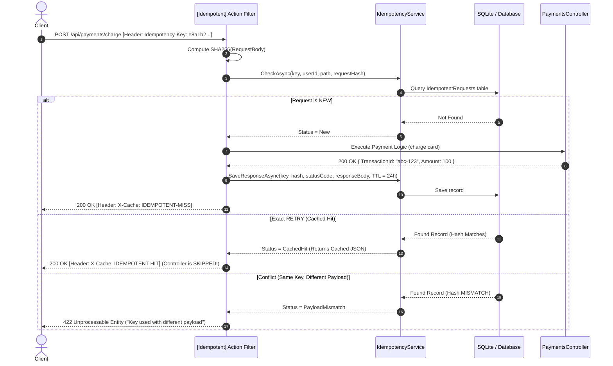

# 07 - API Idempotency Pattern

## 1. What is Idempotency & Why is it Critical?

An API operation is **idempotent** if making multiple identical requests has the same effect as making a single request.

### The Double-Charge Problem

Imagine an e-commerce checkout or payment endpoint `POST /api/payments/charge`:

1. Client submits payment of **$100**.
2. Server charges the credit card and saves the transaction.
3. Before the response reaches the client, the client's cellular/WiFi connection drops (network timeout).
4. The client's mobile app or browser automatically retries `POST /api/payments/charge`.
5. **Without Idempotency**: The customer gets charged **$100 twice ($200 total)**!
6. **With Idempotency**: The server detects the retry, skips the payment gateway, and returns the **original transaction receipt** without charging again!

---

## 2. HTTP Methods & Idempotency

| HTTP Method | Idempotent by Specification? | Description |
| :--- | :--- | :--- |
| `GET` | **YES** | Safe & idempotent (retrieves data without side effects). |
| `PUT` | **YES** | Idempotent (replaces entire resource state). |
| `DELETE` | **YES** | Idempotent (deleting already deleted resource yields 404 or same outcome). |
| `POST` | ❌ **NO** | Creates resources or triggers actions; must be made idempotent explicitly. |
| `PATCH` | ❌ **NO** | Partial modifications (e.g. `increment balance by $10` is non-idempotent). |

---

## 3. How the Idempotency Key Pattern Works (Stripe Standard)



---

## 4. Implementation in .NET 10

### 1. The Database Entity ([IdempotentRequestRecord.cs](../Idempotency/IdempotentRequestRecord.cs))

Stores the `IdempotencyKey`, `UserId`, `RequestPath`, `RequestHash` (SHA-256), `StatusCode`, `ResponseBody`, `ContentType`, and `ExpiresAt`.

### 2. The Filter Factory Attribute ([IdempotentAttribute.cs](../Idempotency/IdempotentAttribute.cs))

```csharp
[AttributeUsage(AttributeTargets.Method | AttributeTargets.Class)]
public class IdempotentAttribute : Attribute, IFilterFactory
{
    public int ExpiresInHours { get; set; } = 24;
    public string HeaderName { get; set; } = "Idempotency-Key";

    public IFilterMetadata CreateInstance(IServiceProvider serviceProvider)
    {
        var idempotencyService = serviceProvider.GetRequiredService<IIdempotencyService>();
        return new IdempotentActionFilter(idempotencyService, ExpiresInHours, HeaderName);
    }
}
```

### 3. Protecting the Endpoint ([PaymentsController.cs](../Controllers/PaymentsController.cs))

```csharp
[ApiController]
[Route("api/[controller]")]
[Authorize]
public class PaymentsController : ControllerBase
{
    [HttpPost("charge")]
    [Idempotent(ExpiresInHours = 24)]
    public async Task<IActionResult> ChargePayment([FromBody] CreatePaymentDto dto)
    {
        // This code ONLY runs on the first request!
        // Retried requests with the same Idempotency-Key are served directly from cache.
        var receipt = new PaymentReceiptDto
        {
            TransactionId = Guid.NewGuid(),
            Amount = dto.Amount,
            Currency = dto.Currency,
            OrderReference = dto.OrderReference,
            Status = "COMPLETED",
            ProcessedAtUtc = DateTime.UtcNow
        };
        return Ok(receipt);
    }
}
```

---

## 5. How to Test Idempotency

Open [IdentityJwtDemo.http](../IdentityJwtDemo.http) and execute the tests in section **4. IDEMPOTENCY TESTING**:

1. **Step 1: First Charge Request**:
   - Send `POST /api/payments/charge` with `Idempotency-Key: pay-key-001`.
   - Response header: `X-Cache: IDEMPOTENT-MISS`
   - Returns a new `TransactionId` (e.g. `e456...`).
2. **Step 2: Resend the Exact Same Request (Retry)**:
   - Send the same request with `Idempotency-Key: pay-key-001`.
   - Response header: `X-Cache: IDEMPOTENT-HIT`
   - Returns the **identical** `TransactionId` (`e456...`) and timestamp. The server did NOT charge the customer again!
3. **Step 3: Test Conflict with Mismatched Payload**:
   - Send `Idempotency-Key: pay-key-001` with an altered amount (e.g., $200 instead of $100).
   - Response: `422 Unprocessable Entity` ("Idempotency-Key was previously used with a different request payload").
