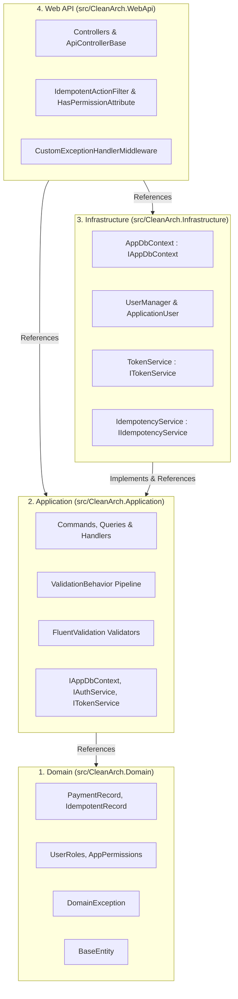
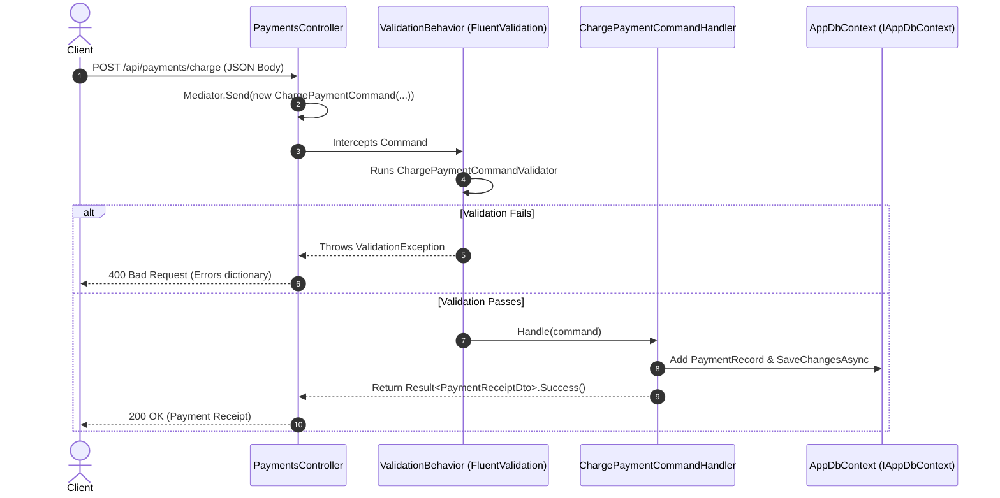

# 08 - Clean Architecture & CQRS Deep-Dive

## 1. Clean Architecture Overview

Clean Architecture (also known as Onion / Hexagonal / Ports & Adapters Architecture) organizes software around the **Domain** and **Application Business Rules**, ensuring high testability, maintainability, and independence from frameworks and databases.

---

## 2. The Dependency Rule



> **The Golden Rule**: Dependencies point **INWARD**.  
>
> - `Domain` has **0 external references**.  
> - `Application` depends only on `Domain`.  
> - `Infrastructure` implements interfaces defined in `Application`.  
> - `WebApi` is the composition root that wires up DI and exposes HTTP endpoints.

---

## 3. Project Layer Responsibilities

### Layer 1: `CleanArch.Domain`

- **Location**: `src/CleanArch.Domain/`
- **Purpose**: Pure enterprise business models and rules.
- **Components**:
  - [`BaseEntity.cs`](../src/CleanArch.Domain/Common/BaseEntity.cs)
  - [`PaymentRecord.cs`](../src/CleanArch.Domain/Entities/PaymentRecord.cs)
  - [`IdempotentRecord.cs`](../src/CleanArch.Domain/Entities/IdempotentRecord.cs)
  - [`UserRoles.cs`](../src/CleanArch.Domain/Constants/UserRoles.cs)
  - [`AppPermissions.cs`](../src/CleanArch.Domain/Constants/AppPermissions.cs)

### Layer 2: `CleanArch.Application`

- **Location**: `src/CleanArch.Application/`
- **Purpose**: Business use cases, CQRS commands/queries, validation, abstractions.
- **Components**:
  - **MediatR CQRS**:
    - `RegisterCommand` + `RegisterCommandHandler` + `RegisterCommandValidator`
    - `LoginCommand` + `LoginCommandHandler` + `LoginCommandValidator`
    - `ChargePaymentCommand` + `ChargePaymentCommandHandler` + `ChargePaymentCommandValidator`
    - `GetUserProfileQuery` + `GetUserProfileQueryHandler`
  - **Pipeline Behaviors**:
    - [`ValidationBehavior.cs`](../src/CleanArch.Application/Common/Behaviors/ValidationBehavior.cs): Automatically validates incoming requests using FluentValidation before handlers run.
  - **Interfaces (Ports)**:
    - `IAppDbContext`, `IAuthService`, `ITokenService`, `IIdempotencyService`, `ICurrentUserService`

### Layer 3: `CleanArch.Infrastructure`

- **Location**: `src/CleanArch.Infrastructure/`
- **Purpose**: Implements persistence, external identity frameworks, and token cryptographic services.
- **Components**:
  - [`AppDbContext.cs`](../src/CleanArch.Infrastructure/Persistence/AppDbContext.cs): Implements `IAppDbContext` and inherits `IdentityDbContext<ApplicationUser>`.
  - [`AuthService.cs`](../src/CleanArch.Infrastructure/Identity/AuthService.cs): Implements `IAuthService` using ASP.NET Core Identity's `UserManager`.
  - [`TokenService.cs`](../src/CleanArch.Infrastructure/Identity/TokenService.cs): Generates signed JWTs and refresh tokens.
  - [`IdempotencyService.cs`](../src/CleanArch.Infrastructure/Persistence/IdempotencyService.cs): Implements `IIdempotencyService` saving requests to database.

### Layer 4: `CleanArch.WebApi`

- **Location**: `src/CleanArch.WebApi/`
- **Purpose**: Entry point, HTTP controller routing, security filters, middleware, and OpenAPI configuration.
- **Components**:
  - [`ApiControllerBase.cs`](../src/CleanArch.WebApi/Controllers/ApiControllerBase.cs): Dispatches MediatR commands/queries.
  - [`AuthController.cs`](../src/CleanArch.WebApi/Controllers/AuthController.cs), [`PaymentsController.cs`](../src/CleanArch.WebApi/Controllers/PaymentsController.cs)
  - [`DynamicPermissionPolicyProvider.cs`](../src/CleanArch.WebApi/Authorization/DynamicPermissionPolicyProvider.cs)
  - [`IdempotentActionFilter.cs`](../src/CleanArch.WebApi/Idempotency/IdempotentActionFilter.cs)

---

## 4. How CQRS & MediatR Work in Practice

When a client calls `POST /api/payments/charge`:



---

## 5. Running the Clean Architecture Solution

To run the Web API from the root directory:

```powershell
dotnet run --project src/CleanArch.WebApi
```

Navigate to:

- **Scalar API UI**: `http://localhost:5000/scalar/v1`
