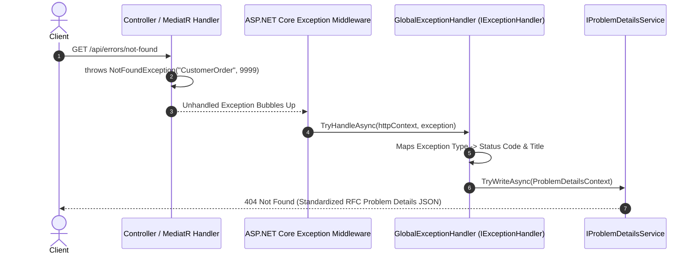

# 09 - Global Exception Handling & RFC 7807/9457 ProblemDetails

## 1. Why Global Exception Handling?

In API design, unhandled exceptions can leak dangerous server internals (stack traces, SQL queries, server paths) to clients if not properly handled. Furthermore, returning inconsistent error shapes across different controllers frustrates frontend and mobile developers.

### The RFC 7807 / RFC 9457 Standard

Modern REST APIs return errors in standard **Problem Details** JSON format:

```json
{
  "type": "https://tools.ietf.org/html/rfc9110#section-15.5.5",
  "title": "Resource Not Found",
  "status": 404,
  "detail": "Entity \"CustomerOrder\" (9999) was not found.",
  "instance": "/api/errors/not-found",
  "traceId": "00-8abf7c4..."
}
```

---

## 2. The Modern .NET 10 Approach: `IExceptionHandler`

Prior to .NET 8, developers wrote custom middleware with `try { await _next(context); } catch (Exception ex) { ... }`.

In **.NET 8, 9, and 10**, Microsoft introduced **`IExceptionHandler`** and **`IProblemDetailsService`**:

- Integrates directly with ASP.NET Core diagnostics.
- Avoids custom try/catch middleware allocations.
- Supports chaining multiple specialized exception handlers.
- Built-in support for distributed tracing (`TraceIdentifier` / `Activity.Current.Id`).



---

## 3. Exception Hierarchy in Clean Architecture

Exceptions are defined in `CleanArch.Domain` and `CleanArch.Application` so that business rules can throw domain-specific exceptions without knowing anything about HTTP status codes:

```text
Exception (System)
 ├── ValidationException (CleanArch.Application) ──> 400 Bad Request + Validation Errors
 ├── DomainException (CleanArch.Domain) ──────────> 400 Bad Request + Rule message
 ├── NotFoundException (CleanArch.Domain) ────────> 404 Not Found
 ├── ConflictException (CleanArch.Domain) ────────> 409 Conflict
 ├── ForbiddenException (CleanArch.Domain) ───────> 403 Forbidden
 └── UnauthorizedAccessException (System) ────────> 401 Unauthorized
```

---

## 4. Implementation Details

### Step 1: Create Domain & Application Exceptions

In [NotFoundException.cs](../src/CleanArch.Domain/Exceptions/NotFoundException.cs):

```csharp
public class NotFoundException : Exception
{
    public NotFoundException(string name, object key)
        : base($"Entity \"{name}\" ({key}) was not found.") {}
}
```

### Step 2: Implement `IExceptionHandler`

In [GlobalExceptionHandler.cs](../src/CleanArch.WebApi/Middleware/GlobalExceptionHandler.cs):

```csharp
public class GlobalExceptionHandler : IExceptionHandler
{
    private readonly ILogger<GlobalExceptionHandler> _logger;
    private readonly IProblemDetailsService _problemDetailsService;

    public GlobalExceptionHandler(ILogger<GlobalExceptionHandler> logger, IProblemDetailsService problemDetailsService)
    {
        _logger = logger;
        _problemDetailsService = problemDetailsService;
    }

    public async ValueTask<bool> TryHandleAsync(HttpContext httpContext, Exception exception, CancellationToken cancellationToken)
    {
        _logger.LogError(exception, "Unhandled Exception: {Message}", exception.Message);

        var (statusCode, title, detail) = exception switch
        {
            ValidationException => (StatusCodes.Status400BadRequest, "Validation Error", "One or more validation errors occurred."),
            NotFoundException => (StatusCodes.Status404NotFound, "Resource Not Found", exception.Message),
            ConflictException => (StatusCodes.Status409Conflict, "Conflict Error", exception.Message),
            ForbiddenException => (StatusCodes.Status403Forbidden, "Access Forbidden", exception.Message),
            DomainException => (StatusCodes.Status400BadRequest, "Domain Rule Violation", exception.Message),
            _ => (StatusCodes.Status500InternalServerError, "Internal Server Error", "An unexpected server error occurred.")
        };

        httpContext.Response.StatusCode = statusCode;

        var problemDetails = new ProblemDetails
        {
            Status = statusCode,
            Title = title,
            Detail = detail,
            Instance = httpContext.Request.Path
        };

        if (exception is ValidationException valEx)
        {
            problemDetails.Extensions["errors"] = valEx.Errors;
        }

        problemDetails.Extensions["traceId"] = Activity.Current?.Id ?? httpContext.TraceIdentifier;

        return await _problemDetailsService.TryWriteAsync(new ProblemDetailsContext
        {
            HttpContext = httpContext,
            ProblemDetails = problemDetails,
            Exception = exception
        });
    }
}
```

### Step 3: Register in `Program.cs`

In [Program.cs](../src/CleanArch.WebApi/Program.cs):

```csharp
builder.Services.AddExceptionHandler<GlobalExceptionHandler>();
builder.Services.AddProblemDetails();

var app = builder.Build();

app.UseExceptionHandler(); // Activates registered IExceptionHandler services
```

---

## 5. How to Test Global Exception Handling

Use the [ErrorsTestController.cs](../src/CleanArch.WebApi/Controllers/ErrorsTestController.cs) endpoints in [IdentityJwtDemo.http](../IdentityJwtDemo.http):

1. **404 Not Found**: `GET /api/errors/not-found`
2. **409 Conflict**: `GET /api/errors/conflict`
3. **400 Domain Error**: `GET /api/errors/domain-error`
4. **403 Forbidden**: `GET /api/errors/forbidden`
5. **500 Server Error**: `GET /api/errors/server-error` (Masked error message in JSON while full exception stack trace is safely logged on server).
