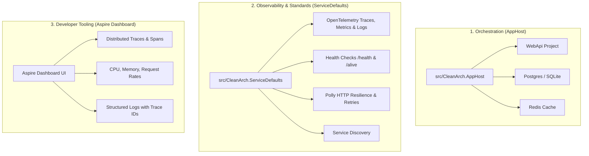

# 10 - .NET Aspire: Orchestration, Observability & Service Defaults

## 1. What is .NET Aspire?

**.NET Aspire** is Microsoft's cloud-ready stack for building observable, production-grade distributed applications. It solves the complexity of managing multiple microservices, background workers, databases, caches, and telemetry across local development and cloud environments.

---

## 2. The Three Pillars of .NET Aspire



1. **Orchestration (`AppHost`)**: Expresses your application architecture in C# code instead of complex Docker Compose or YAML files.
2. **Standardized Defaults (`ServiceDefaults`)**: Standardizes OpenTelemetry instrumentation, health checks, resilience handlers, and service discovery across every service in your solution.
3. **Aspire Dashboard**: Real-time developer dashboard showing running containers/projects, environment variables, live logs, distributed traces, and metrics.

---

## 3. Project Architecture with Aspire

Our Clean Architecture solution now contains 6 projects:

```
IdentityCleanArch/
├── src/
│   ├── CleanArch.AppHost/           # 🌟 Aspire Orchestrator (Starts APIs, DBs, Dashboard)
│   │   ├── Program.cs               # DistributedApplication.CreateBuilder(args)
│   │   └── CleanArch.AppHost.csproj
│   │
│   ├── CleanArch.ServiceDefaults/   # 🌟 Aspire Service Defaults
│   │   ├── Extensions.cs            # AddServiceDefaults(), MapDefaultEndpoints()
│   │   └── CleanArch.ServiceDefaults.csproj
│   │
│   ├── CleanArch.Domain/            # 1. Pure Enterprise Domain Models (0 dependencies)
│   ├── CleanArch.Application/       # 2. CQRS Use Cases, MediatR, FluentValidation
│   ├── CleanArch.Infrastructure/    # 3. EF Core SQLite, Identity, JWT TokenService
│   └── CleanArch.WebApi/            # 4. REST API & Controllers (Uses ServiceDefaults)
```

---

## 4. How `CleanArch.ServiceDefaults` Works

In [Extensions.cs](file:///C:/Users/Hoang/Desktop/clean/src/CleanArch.ServiceDefaults/Extensions.cs):

### A. OpenTelemetry & Structured Logging
Configures OpenTelemetry for ASP.NET Core request tracing, HTTP client calls, and runtime metrics (GC memory, threadpool starvation):

```csharp
public static TBuilder ConfigureOpenTelemetry<TBuilder>(this TBuilder builder) where TBuilder : IHostApplicationBuilder
{
    builder.Logging.AddOpenTelemetry(logging =>
    {
        logging.IncludeFormattedMessage = true;
        logging.IncludeScopes = true;
    });

    builder.Services.AddOpenTelemetry()
        .WithMetrics(metrics =>
        {
            metrics.AddAspNetCoreInstrumentation()
                   .AddHttpClientInstrumentation()
                   .AddRuntimeInstrumentation();
        })
        .WithTracing(tracing =>
        {
            tracing.AddAspNetCoreInstrumentation()
                   .AddHttpClientInstrumentation();
        });

    return builder;
}
```

### B. Standard Health Checks (`/health` & `/alive`)
```csharp
public static WebApplication MapDefaultEndpoints(this WebApplication app)
{
    if (app.Environment.IsDevelopment())
    {
        app.MapHealthChecks("/health"); // Readiness probe
        app.MapHealthChecks("/alive", new HealthCheckOptions
        {
            Predicate = r => r.Tags.Contains("live") // Liveness probe
        });
    }
    return app;
}
```

### C. Standard HTTP Resilience (Polly)
Turns on automatic retries, exponential backoffs, and circuit breakers for outgoing HTTP calls:
```csharp
builder.Services.ConfigureHttpClientDefaults(http =>
{
    http.AddStandardResilienceHandler();
    http.AddServiceDiscovery();
});
```

---

## 5. How `CleanArch.AppHost` Orchestrates the System

In [Program.cs](file:///C:/Users/Hoang/Desktop/clean/src/CleanArch.AppHost/Program.cs):

```csharp
var builder = DistributedApplication.CreateBuilder(args);

// Register our Clean Architecture Web API project
var apiService = builder.AddProject<Projects.CleanArch_WebApi>("webapi");

builder.Build().Run();
```

> [!TIP]
> If you add external services like Redis or PostgreSQL in the future, you can simply add:
> ```csharp
> var redis = builder.AddRedis("cache");
> var postgres = builder.AddPostgres("postgres").AddDatabase("cleanidentitydb");
> 
> var apiService = builder.AddProject<Projects.CleanArch_WebApi>("webapi")
>                         .WithReference(redis)
>                         .WithReference(postgres);
> ```
> Aspire will automatically spin up Docker containers for Redis & Postgres and inject the connection strings into `CleanArch.WebApi` without manual configuration!

---

## 6. How to Run with .NET Aspire

To launch the orchestrated application and Aspire Dashboard:

```powershell
dotnet run --project src/CleanArch.AppHost
```

The console will print the **Aspire Dashboard URL** (e.g., `https://localhost:17180`). Open it in your browser to inspect:
- 📊 **Resources**: Live health status of `webapi` and other services.
- 📜 **Console Logs**: Aggregated real-time logs across all services.
- 🔀 **Traces**: Full distributed waterfall traces showing how requests flow through your APIs.
- 📈 **Metrics**: Real-time request durations, failure rates, and memory allocations.
