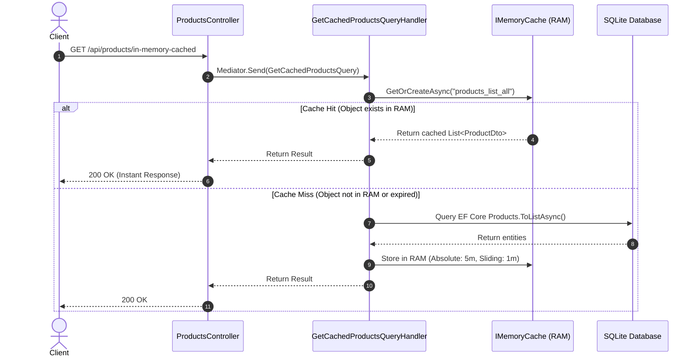
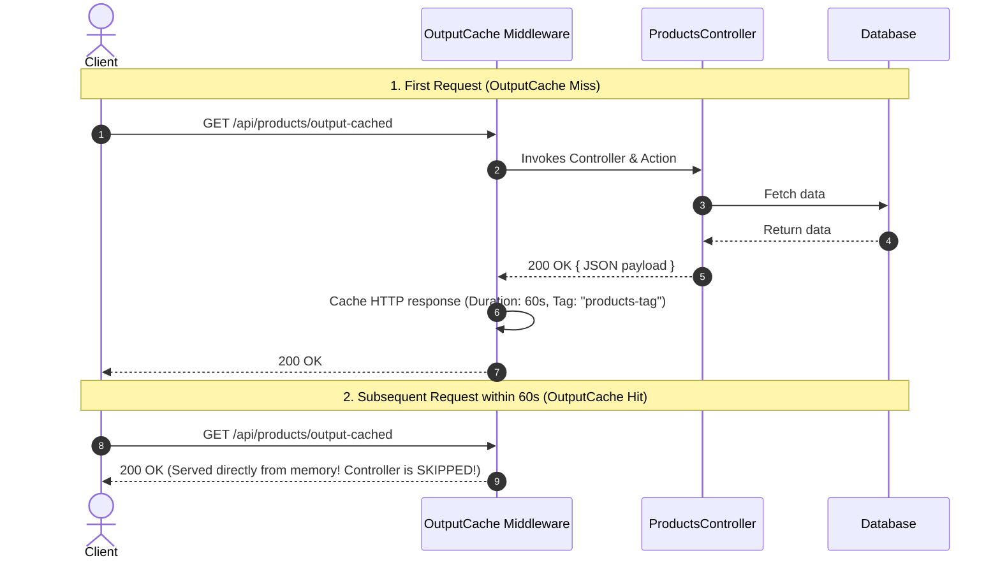

# 13 - In-Memory Cache (`IMemoryCache`) & Output Cache (`[OutputCache]`)

## 1. Overview of Caching in ASP.NET Core (.NET 10)

Caching improves application performance and scalability by storing frequently requested data in fast memory, reducing expensive database queries and CPU-heavy operations.

In modern ASP.NET Core, there are two fundamental built-in caching mechanisms:

| Feature | In-Memory Cache (`IMemoryCache`) | Output Cache (`[OutputCache]`) |
| :--- | :--- | :--- |
| **Architectural Layer** | **Application / Service / Data Layer** | **HTTP Middleware Layer** |
| **What is Cached?** | Raw C# objects, DTOs, query results, lists | Full HTTP Responses (Status, Headers, JSON Body) |
| **Execution Point** | Inside MediatR Handlers / Services | Before request reaches Controller / Handler |
| **Invalidation** | Direct Key Removal (`_cache.Remove(key)`) | **Tag-based Eviction** (`EvictByTagAsync("tag")`) |
| **Locking / Stampede** | Manual SemaphoreSlim / Factory delegate | **Built-in Resource Locking** (Automatic deduplication) |
| **Best Used For** | DB query results, permissions, calculations | Public APIs, product catalogs, report feeds |

---

## 2. In-Memory Caching (`IMemoryCache`)

`IMemoryCache` stores arbitrary C# objects in RAM within the current application process.



### Expiration Strategies:

1. **`AbsoluteExpirationRelativeToNow`**: Hard expiration time (e.g. 5 minutes). The item is evicted once this duration passes, regardless of access frequency.
2. **`SlidingExpiration`**: Rolling expiration (e.g. 1 minute). If the item is accessed within 1 minute, its expiration timer resets. To prevent an item from staying in cache forever, combine sliding expiration with an absolute expiration.

### Implementation in Application Layer:

In [GetCachedProductsQuery.cs](file:///C:/Users/Hoang/Desktop/clean/src/CleanArch.Application/Features/Products/Queries/GetCachedProducts/GetCachedProductsQuery.cs):

```csharp
var products = await _memoryCache.GetOrCreateAsync(cacheKey, async entry =>
{
    entry.AbsoluteExpirationRelativeToNow = TimeSpan.FromMinutes(5);
    entry.SlidingExpiration = TimeSpan.FromMinutes(1);
    entry.Priority = CacheItemPriority.High;

    return await _context.Products
        .AsNoTracking()
        .Select(p => new ProductDto { ... })
        .ToListAsync(cancellationToken);
});
```

---

## 3. Output Caching (`[OutputCache]`)

Introduced in modern ASP.NET Core, **Output Caching** caches the entire HTTP response at the middleware layer. When a request hits the cache, ASP.NET Core short-circuits execution and returns the response immediately without running controllers, filters, or database queries!



### Powerful Features of Output Cache:

#### A. Tag-Based Invalidation (`EvictByTagAsync`)

You can tag multiple related endpoints with a common tag (e.g. `"products-tag"`). When a mutation occurs (`POST /api/products`), a single call invalidates all related cached endpoints at once!

```csharp
// Tagging the endpoint:
[HttpGet("output-cached")]
[OutputCache(Duration = 60, Tags = ["products-tag"])]
public async Task<IActionResult> GetOutputCached() { ... }

// Invalidating when data changes:
[HttpPost]
public async Task<IActionResult> CreateProduct(...)
{
    await Mediator.Send(command);
    await _outputCacheStore.EvictByTagAsync("products-tag", HttpContext.RequestAborted);
    return Ok();
}
```

#### B. VaryBy Configurations

- **`VaryByRouteValueNames = ["category"]`**: Caches separate responses for `/category/Laptops` vs `/category/Audio`.
- **`VaryByQueryKeys = ["page", "pageSize"]`**: Caches separate responses for each pagination query.
- **`VaryByHeaderNames = ["Accept-Language"]`**: Caches localized responses based on header.

#### C. Built-in Cache Stampede Protection (Resource Locking)

If 1,000 concurrent requests hit an expired endpoint simultaneously, OutputCache **locks the key** so only **one** request executes the controller action while the other 999 wait for the response to be cached, completely preventing database thundering herd problems!

---

## 4. Configuration in `Program.cs`

In [Program.cs](file:///C:/Users/Hoang/Desktop/clean/src/CleanArch.WebApi/Program.cs):

```csharp
// 1. Register Services
builder.Services.AddMemoryCache();
builder.Services.AddOutputCache(options =>
{
    options.AddBasePolicy(b => b.Cache());
});

var app = builder.Build();

// 2. Add OutputCache Middleware (Must be before MapControllers)
app.UseOutputCache();

app.MapControllers();
```

---

## 5. How to Test Caching

Open [IdentityJwtDemo.http](file:///C:/Users/Hoang/Desktop/clean/IdentityJwtDemo.http) and execute Section **6. IN-MEMORY CACHE & OUTPUT CACHE TESTING**:

1. **Test `IMemoryCache`**:
   - Send `GET /api/products/in-memory-cached`.
   - The first request logs `[IMemoryCache MISS] Querying database`.
   - Repeated requests return instantly without database logs.
2. **Test `[OutputCache]`**:
   - Send `GET /api/products/output-cached`.
   - Check `generatedAtUtc` timestamp in the response. Repeated requests return the **exact same timestamp** for 60 seconds because the entire response is served from the middleware cache.
3. **Test Tag-Based Invalidation**:
   - Send `POST /api/products` to create a new product.
   - Send `GET /api/products/output-cached` again. Notice that `generatedAtUtc` has updated immediately with the new product included because `EvictByTagAsync("products-tag")` evicted the cache!
