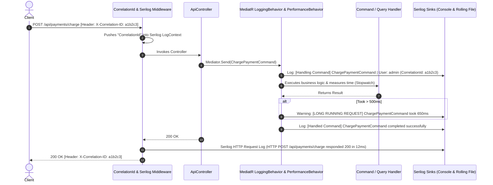

# 14 - Structured Logging with Serilog, Correlation IDs & MediatR Pipeline

## 1. Unstructured vs. Structured Logging

In production, searching through gigabytes of plaintext logs is slow and error-prone. **Structured Logging** treats logs as rich data objects with named properties instead of flat text strings.

### The Contrast:

```csharp
// ❌ UNSTRUCTURED (String Concatenation / Interpolation)
// Hard to query or filter in Seq / Elasticsearch / Datadog
_logger.LogInformation($"User {userId} charged {amount} USD on order {orderId}");

// ✅ STRUCTURED (Message Templates)
// Captured as structured properties: UserId="u1", Amount=99.99, OrderId="ord-1"
_logger.LogInformation("User {UserId} charged {Amount} {Currency} on order {OrderId}", userId, amount, "USD", orderId);
```

---

## 2. The Logging Architecture in Clean Architecture



---

## 3. The Key Logging Components

### 1. Correlation ID Middleware ([CorrelationIdMiddleware.cs](file:///C:/Users/Hoang/Desktop/clean/src/CleanArch.WebApi/Middleware/CorrelationIdMiddleware.cs))

Extracts an incoming `X-Correlation-ID` header from the client or generates a new `Guid`. It pushes the correlation ID into `Serilog.Context.LogContext` so that **every log entry** emitted during the request automatically includes the correlation ID:

```csharp
public async Task InvokeAsync(HttpContext context)
{
    var correlationId = context.Request.Headers.TryGetValue("X-Correlation-ID", out var headerValue)
        ? headerValue.ToString()
        : Guid.NewGuid().ToString();

    context.Response.Headers["X-Correlation-ID"] = correlationId;

    using (LogContext.PushProperty("CorrelationId", correlationId))
    {
        await _next(context);
    }
}
```

### 2. MediatR Request Logging Behavior ([LoggingBehavior.cs](file:///C:/Users/Hoang/Desktop/clean/src/CleanArch.Application/Common/Behaviors/LoggingBehavior.cs))

Logs the start and completion of every Command and Query automatically without writing repetitive logging code in every controller or handler:

```csharp
public async Task<TResponse> Handle(TRequest request, RequestHandlerDelegate<TResponse> next, CancellationToken cancellationToken)
{
    var requestName = typeof(TRequest).Name;
    var userId = _currentUser.UserId ?? "Anonymous";

    _logger.LogInformation("▶ [Handling Command/Query] {RequestName} | User: {UserId}", requestName, userId);
    var response = await next();
    _logger.LogInformation("✔ [Handled Command/Query] {RequestName} | User: {UserId} completed successfully", requestName, userId);

    return response;
}
```

### 3. MediatR Performance Behavior ([PerformanceBehavior.cs](file:///C:/Users/Hoang/Desktop/clean/src/CleanArch.Application/Common/Behaviors/PerformanceBehavior.cs))

Measures execution time with `Stopwatch`. If a query or command exceeds 500ms, it automatically logs a structured warning:

```csharp
if (elapsedMilliseconds > 500)
{
    _logger.LogWarning("⚠️ [LONG RUNNING REQUEST] {RequestName} took {ElapsedMilliseconds}ms (> 500ms)",
        requestName, elapsedMilliseconds);
}
```

---

## 4. Serilog Configuration in `appsettings.json`

In [appsettings.json](file:///C:/Users/Hoang/Desktop/clean/src/CleanArch.WebApi/appsettings.json):

```json
{
  "Serilog": {
    "Using": [ "Serilog.Sinks.Console", "Serilog.Sinks.File" ],
    "MinimumLevel": {
      "Default": "Information",
      "Override": {
        "Microsoft.AspNetCore": "Warning",
        "Microsoft.EntityFrameworkCore": "Warning"
      }
    },
    "WriteTo": [
      {
        "Name": "Console",
        "Args": {
          "outputTemplate": "[{Timestamp:HH:mm:ss} {Level:u3}] [{CorrelationId}] {Message:lj}{NewLine}{Exception}"
        }
      },
      {
        "Name": "File",
        "Args": {
          "path": "logs/cleanarch-.log",
          "rollingInterval": "Day",
          "retainedFileCountLimit": 7
        }
      }
    ],
    "Enrich": [ "FromLogContext", "WithMachineName", "WithThreadId" ]
  }
}
```

---

## 5. How to Inspect Logs

1. **Console Output**: Watch real-time logs with colored severity levels and correlation IDs formatted as `[20:15:30 INF] [c8a1b2...] ▶ [Handling Command/Query] LoginCommand`.
2. **Rolling File Sink**: Inspect logs saved daily in `src/CleanArch.WebApi/logs/cleanarch-YYYYMMDD.log`.
3. **Aspire Dashboard**: When running via `CleanArch.AppHost`, all structured logs are aggregated in the real-time **Structured Logs** tab with filtering by `CorrelationId`, `Level`, and `SourceContext`.
