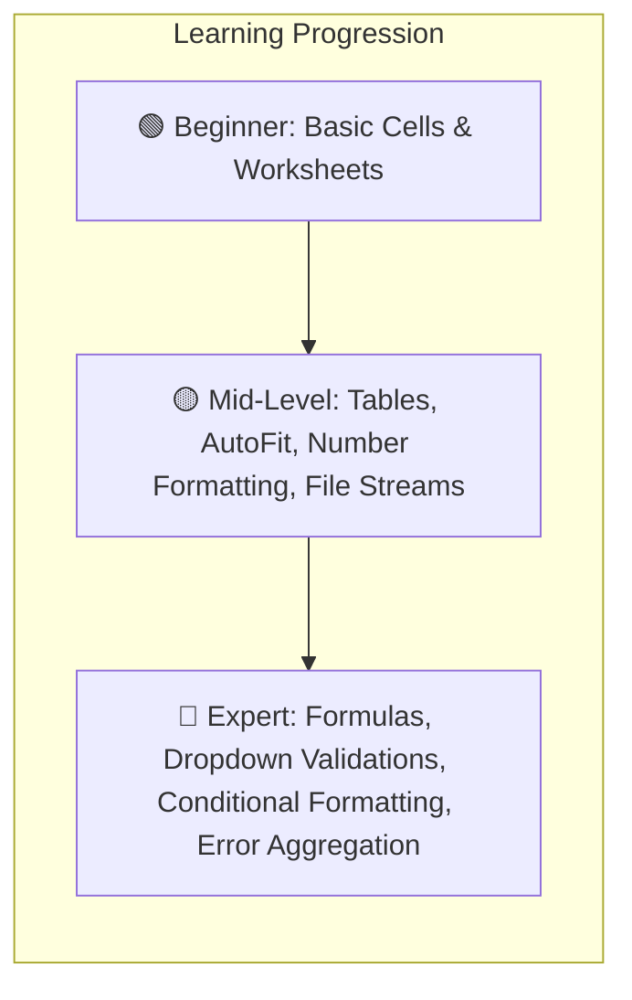

# 15 - Excel Import & Export with EPPlus (Beginner ➔ Mid ➔ Expert)

## 1. Introduction to EPPlus in Modern .NET (.NET 10)

**EPPlus** is the industry-standard library for reading and writing Microsoft Excel (`.xlsx`) OpenXML spreadsheets in .NET without requiring Microsoft Office or Excel installed on the server.



---

## 2. 🟢 Beginner Level: Setup, Worksheets & Cell Access

### Step 1: Set License Context (Mandatory in EPPlus)
In [ExcelService.cs](file:///C:/Users/Hoang/Desktop/clean/src/CleanArch.Infrastructure/Services/ExcelService.cs):
```csharp
// Set Non-Commercial License in constructor or Program.cs
ExcelPackage.License.SetNonCommercialPersonal("CleanArchitectureStudent");
```

### Step 2: Creating a Workbook & Writing Cells
```csharp
using var package = new ExcelPackage();
var worksheet = package.Workbook.Worksheets.Add("Sheet1");

// Cell coordinates are 1-indexed: ws.Cells[row, column]
worksheet.Cells[1, 1].Value = "Product Name";
worksheet.Cells[1, 2].Value = "Price";

worksheet.Cells[2, 1].Value = "MacBook Pro";
worksheet.Cells[2, 2].Value = 2499.99;

byte[] excelBytes = package.GetAsByteArray();
```

---

## 3. 🟡 Mid-Level: Production Styling, Tables & Clean Architecture

### A. Number Formatting, Styles & Colors
```csharp
// Styling headers with dark blue background and white bold font
ws.Cells["A1:D1"].Style.Font.Bold = true;
ws.Cells["A1:D1"].Style.Fill.PatternType = ExcelFillStyle.Solid;
ws.Cells["A1:D1"].Style.Fill.BackgroundColor.SetColor(Color.FromArgb(31, 78, 120));
ws.Cells["A1:D1"].Style.Font.Color.SetColor(Color.White);

// Currency and integer number formatting
ws.Cells["C2:C100"].Style.Numberformat.Format = "$#,##0.00";
ws.Cells["D2:D100"].Style.Numberformat.Format = "#,##0";
```

### B. Auto-Fit Columns & Freeze Panes
```csharp
// Freeze top header row so it stays visible while scrolling
ws.View.FreezePanes(2, 1);

// Auto-fit column widths with minimum and maximum constraints
ws.Cells[ws.Dimension.Address].AutoFitColumns(15, 45);
```

### C. Excel Table Styling
```csharp
var dataRange = ws.Cells[1, 1, lastRow, columnCount];
var table = ws.Tables.Add(dataRange, "ProductsTable");
table.TableStyle = TableStyles.Medium9;
```

### D. Returning Files from ASP.NET Core Web API
In [ExcelController.cs](file:///C:/Users/Hoang/Desktop/clean/src/CleanArch.WebApi/Controllers/ExcelController.cs):
```csharp
[HttpGet("export-products")]
public async Task<IActionResult> ExportProducts()
{
    var fileBytes = await Mediator.Send(new ExportProductsQuery());
    const string contentType = "application/vnd.openxmlformats-officedocument.spreadsheetml.sheet";
    return File(fileBytes, contentType, "Products_Export.xlsx");
}
```

---

## 4. 🔴 Expert Level: Advanced Excel Features

### 1. Summary Formulas (`SUM`, `AVERAGE`)
Write real native Excel formulas that recalculate dynamically when opened in Excel:
```csharp
ws.Cells[summaryRow, 3].Value = "Average Price:";
ws.Cells[summaryRow, 4].Formula = $"AVERAGE(D2:D{lastDataRow})";
ws.Cells[summaryRow, 4].Style.Numberformat.Format = "$#,##0.00";

ws.Cells[summaryRow + 1, 3].Value = "Total Units:";
ws.Cells[summaryRow + 1, 5].Formula = $"SUM(E2:E{lastDataRow})";
```

### 2. Conditional Formatting (Visual Alerts)
Automatically highlight low-stock products ($< 10$ units) with a light red background:
```csharp
var stockRange = ws.Cells[2, 5, lastDataRow, 5];
var condition = ws.ConditionalFormatting.AddLessThan(stockRange);
condition.Formula = "10";
condition.Style.Fill.PatternType = ExcelFillStyle.Solid;
condition.Style.Fill.BackgroundColor.Color = Color.FromArgb(255, 199, 206);
condition.Style.Font.Color.Color = Color.FromArgb(156, 0, 6);
```

### 3. Data Validation Dropdowns (Preventing Bad Imports)
Locks the Category column into a predefined dropdown list inside Excel:
```csharp
var categoryValidation = ws.DataValidations.AddListValidation("B2:B1000");
categoryValidation.ShowErrorMessage = true;
categoryValidation.ErrorTitle = "Invalid Category";
categoryValidation.Error = "Please choose a category from the dropdown.";
categoryValidation.Formula.Values.Add("Laptops");
categoryValidation.Formula.Values.Add("Smartphones");
categoryValidation.Formula.Values.Add("Audio");
categoryValidation.Formula.Values.Add("Accessories");
categoryValidation.Formula.Values.Add("Tablets");
```

### 4. Resilient Import with Row-by-Row Error Aggregation
Instead of aborting the entire upload on the first invalid cell, the parser collects all row errors, imports all valid items, and returns a detailed audit report:

```csharp
public async Task<(List<ProductItem> ValidProducts, List<string> Errors)> ImportProductsFromExcelAsync(Stream fileStream, CancellationToken ct)
{
    using var package = new ExcelPackage();
    await package.LoadAsync(fileStream, ct);
    var ws = package.Workbook.Worksheets.FirstOrDefault();

    var validProducts = new List<ProductItem>();
    var errors = new List<string>();

    for (int row = 2; row <= ws.Dimension.Rows; row++)
    {
        var name = ws.Cells[row, 1].Text.Trim();
        var priceText = ws.Cells[row, 3].Text.Trim();

        if (string.IsNullOrWhiteSpace(name))
        {
            errors.Add($"Row {row}: Product Name is required.");
            continue;
        }

        if (!decimal.TryParse(priceText.Replace("$", ""), out var price) || price <= 0)
        {
            errors.Add($"Row {row} ({name}): Invalid price '{priceText}'. Must be > 0.");
            continue;
        }

        validProducts.Add(new ProductItem { Name = name, Price = price });
    }

    return (validProducts, errors);
}
```

---

## 5. How to Test Excel Export, Templates & Import

Open [IdentityJwtDemo.http](file:///C:/Users/Hoang/Desktop/clean/IdentityJwtDemo.http) and execute Section **8. EXCEL IMPORT & EXPORT TESTING**:

1. **Export Styled Catalog**: `GET /api/excel/export-products` (Downloads styled `.xlsx` file).
2. **Download Template**: `GET /api/excel/template` (Downloads template with category dropdowns).
3. **Bulk Import**: `POST /api/excel/import-products` (Uploads `.xlsx`, imports valid items to DB, and returns error summary).
