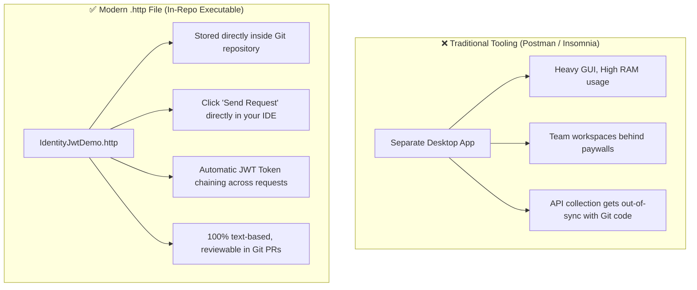

# 16 - Understanding and Mastering `.http` Files in ASP.NET Core & Modern IDEs

## 1. What is an `.http` File?

An **`.http` file** (such as [IdentityJwtDemo.http](file:///C:/Users/Hoang/Desktop/clean/IdentityJwtDemo.http)) is an executable, text-based HTTP request file format based on the RFC 7230 standard.

It is natively supported in **Visual Studio 2022/2025**, **VS Code** (via the *REST Client* extension), and **JetBrains Rider**.



---

## 2. Anatomy & Core Syntax of `.http` Files

An `.http` file consists of 5 core building blocks:

### 1. Variables (`@var = value`)
Define reusable variables at the top of the file:
```http
@HostAddress = http://localhost:5000
```

### 2. Request Delimiters (`###`)
Every HTTP request must be separated by three hash characters (`###`):
```http
### Request 1
GET {{HostAddress}}/api/products

### Request 2
GET {{HostAddress}}/api/users
```

### 3. Request Naming & Dynamic Response Chaining (`# @name`)
By naming a request with `# @name requestName`, you can extract values from its JSON response body or headers in subsequent requests!

```http
### 1. Login Request
# @name adminLogin
POST {{HostAddress}}/api/auth/login
Content-Type: application/json

{
  "email": "admin@example.com",
  "password": "Admin@123456"
}

### 2. Extract Access Token from Response Body:
@adminToken = {{adminLogin.response.body.accessToken}}

### 3. Use Extracted Token in Next Request:
GET {{HostAddress}}/api/resources/users-list
Authorization: Bearer {{adminToken}}
```

### 4. Headers
Headers follow immediately after the request URL line on separate lines:
```http
POST {{HostAddress}}/api/payments/charge
Authorization: Bearer {{userToken}}
Idempotency-Key: pay-key-001
Content-Type: application/json
```

### 5. Blank Line Before Request Body (Critical Rule!)
In the HTTP protocol, **there MUST be at least one blank line** between headers and the JSON request body:

```http
POST {{HostAddress}}/api/auth/login
Content-Type: application/json
<--- BLANK LINE HERE --->
{
  "email": "admin@example.com",
  "password": "Admin@123456"
}
```

---

## 3. Deep-Dive: How `IdentityJwtDemo.http` is Structured

Here is what each section of [IdentityJwtDemo.http](file:///C:/Users/Hoang/Desktop/clean/IdentityJwtDemo.http) accomplishes:

```
IdentityJwtDemo.http
├── 1. Authentication & Token Extraction
│   ├── adminLogin (Super Admin credentials) ──> Extracts @adminToken
│   ├── managerLogin (Manager credentials)   ──> Extracts @managerToken
│   └── userLogin (Standard User)            ──> Extracts @userToken
│
├── 2. Dynamic Policy Testing (IAuthorizationPolicyProvider)
│   ├── Users.View (Allowed for Admin, Manager, User)
│   ├── Reports.Export (Allowed for Admin & Manager, 403 Forbidden for User)
│   ├── Users.Create (Allowed for Admin, 403 Forbidden for others)
│   └── Users.Delete (Allowed for Admin only)
│
├── 3. Dynamic Permission Granting at Runtime
│   └── Admin grants 'Users.Create' to user@example.com -> User logs in -> Allowed!
│
├── 4. Idempotency Testing (Double-Charge Prevention)
│   ├── 4a. Initial Charge (Returns X-Cache: IDEMPOTENT-MISS)
│   ├── 4b. Immediate Retry with same key & body (Returns X-Cache: IDEMPOTENT-HIT)
│   └── 4c. Tampering with payload (Returns 422 Unprocessable Entity)
│
├── 5. Global Exception Handling (RFC 7807/9457 Problem Details)
│   └── Tests 404 Not Found, 409 Conflict, 400 Domain Error, 403 Forbidden, 500 Server Error
│
├── 6. In-Memory Cache & Output Cache Testing
│   ├── 6a. IMemoryCache test (RAM caching in Application layer)
│   ├── 6b. [OutputCache] test (HTTP response caching in Middleware)
│   ├── 6c & 6d. VaryByRoute test (/category/Laptops vs /category/Audio)
│   └── 6e & 6f. Tag Eviction test (POST /products purges "products-tag")
│
├── 7. Structured Logging & Distributed Correlation IDs
│   └── Custom 'X-Correlation-ID: CORR-TRACE-12345' header tracing in Serilog logs
│
└── 8. Excel Import & Export with EPPlus
    ├── 8a. Download styled product catalog .xlsx (Formulas, Table styles, Freeze panes)
    └── 8b. Download validated import template .xlsx (Dropdown list validation)
```

---

## 4. How to Execute `.http` Files in Your IDE

### In Visual Studio 2022 / 2025:
1. Open [IdentityJwtDemo.http](file:///C:/Users/Hoang/Desktop/clean/IdentityJwtDemo.http).
2. Ensure the API is running (`dotnet run --project src/CleanArch.WebApi` or `src/CleanArch.AppHost`).
3. Click the green **`Send request`** play button directly above any request.
4. The response headers and formatted JSON body appear in the right-hand panel.

### In Visual Studio Code:
1. Install the extension: **REST Client** (by *Huachao Mao*).
2. Open `IdentityJwtDemo.http`.
3. Click the blue **`Send Request`** link above any request.

---

## 5. Why Modern Teams Prefer `.http` Files over Postman

| Criteria | `.http` File | Postman / Insomnia Collections |
| :--- | :--- | :--- |
| **Storage Location** | Directly inside Git repo | External proprietary cloud or JSON exports |
| **Git Merge Conflicts** | Clean, readable plaintext diffs | Massive messy JSON export files |
| **Developer Onboarding** | Clone repository & run immediately | Import URLs, API keys, and workspace invites |
| **Memory & Performance** | Native inside IDE (0 MB extra RAM) | Separate Chromium desktop app (500MB+ RAM) |
| **CI/CD Integration** | Automated via `httpyac` / `dotnet restclient` | Requires Newman CLI / Cloud accounts |
