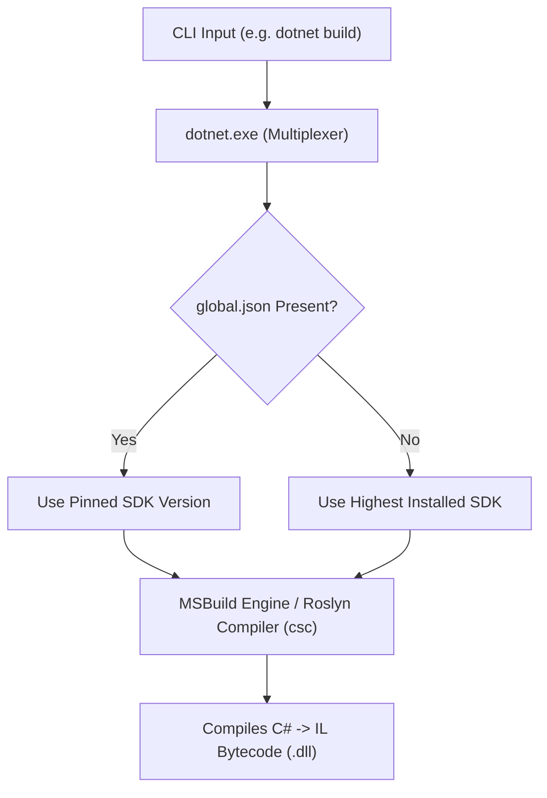

# 17 - .NET CLI Mastery & Essential Commands Cheat Sheet

## 1. How the .NET CLI Works (Under the Hood)

The **`dotnet`** executable is a **command multiplexer (driver)**. When you execute a command, `dotnet.exe` evaluates your environment, discovers installed SDKs, and routes your instruction to the appropriate tool (Roslyn compiler `csc`, MSBuild engine, or NuGet client).



---

## 2. Essential Commands by Category

### 📂 Category 1: Solution & Project Management

```powershell
# 1. Create a new Solution
dotnet new sln -n MyEnterpriseApp

# 2. Create Projects
dotnet new webapi -n MyApi -o src/MyApi
dotnet new classlib -n MyDomain -o src/MyDomain
dotnet new xunit -n MyTests -o tests/MyTests

# 3. Add Projects to Solution
dotnet sln add src/MyApi/MyApi.csproj src/MyDomain/MyDomain.csproj tests/MyTests/MyTests.csproj

# 4. Add Project-to-Project Reference
dotnet add src/MyApi/MyApi.csproj reference src/MyDomain/MyDomain.csproj

# 5. List all projects in Solution
dotnet sln list
```

---

### 📦 Category 2: NuGet Package & Security Management

```powershell
# 1. Install a NuGet Package (Latest or Specific Version)
dotnet add package Serilog.AspNetCore
dotnet add package MediatR --version 12.4.1

# 2. Remove a Package
dotnet remove package Serilog.AspNetCore

# 3. Check for OUTDATED Packages across entire solution
dotnet list package --outdated

# 4. Check for SECURITY VULNERABILITIES across all packages (Critical for CI/CD)
dotnet list package --vulnerable --include-transitive

# 5. Restore Dependencies
dotnet restore
```

---

### ⚡ Category 3: Building, Running & Hot Reload

```powershell
# 1. Build Solution (Debug or Release)
dotnet build
dotnet build -c Release

# 2. Run a specific Project
dotnet run --project src/CleanArch.WebApi

# 3. Pass CLI arguments to your app (use '--' separator)
dotnet run --project src/CleanArch.WebApi -- --urls "http://localhost:5005" --environment "Staging"

# 4. HOT RELOAD (Watches code changes and updates running app instantly without manual restart!)
dotnet watch --project src/CleanArch.WebApi

# 5. Clean build artifacts (bin/ and obj/ folders)
dotnet clean
```

---

### 🧪 Category 4: Testing & Code Formatting

```powershell
# 1. Run all unit tests
dotnet test

# 2. Run specific tests by name or filter
dotnet test --filter "FullyQualifiedName~PaymentTests"

# 3. Run tests with Code Coverage report
dotnet test --collect:"XPlat Code Coverage"

# 4. Auto-format entire codebase to match .editorconfig conventions
dotnet format

# 5. Verify formatting in CI/CD pipeline (fails if code is unformatted)
dotnet format --verify-no-changes
```

---

### 🚀 Category 5: Publishing & Production Deployment

```powershell
# 1. Standard Framework-Dependent Release Publish
dotnet publish src/CleanArch.WebApi -c Release -o ./publish

# 2. Self-Contained Single-File Executable (Runs without .NET Runtime installed on target server!)
dotnet publish src/CleanArch.WebApi -c Release -r win-x64 --self-contained true -p:PublishSingleFile=true -o ./publish/win-x64
dotnet publish src/CleanArch.WebApi -c Release -r linux-x64 --self-contained true -p:PublishSingleFile=true -o ./publish/linux-x64

# 3. Publish with IL Trimming (Cuts unused code to minimize binary size)
dotnet publish src/CleanArch.WebApi -c Release -r linux-x64 --self-contained true -p:PublishSingleFile=true -p:PublishTrimmed=true

# 4. Built-in Container Publishing (Builds Docker image directly from dotnet CLI WITHOUT a Dockerfile!)
dotnet publish src/CleanArch.WebApi -t:PublishContainer -p:ContainerImageName=cleanarch-api:latest
```

---

### 🗄️ Category 6: Entity Framework Core CLI (`dotnet-ef`)

```powershell
# Install EF Core CLI Global Tool (one-time setup)
dotnet tool install --global dotnet-ef

# 1. Add a new Migration
dotnet ef migrations add AddProductsTable --project src/CleanArch.Infrastructure --startup-project src/CleanArch.WebApi

# 2. Apply Migrations to Database
dotnet ef database update --project src/CleanArch.Infrastructure --startup-project src/CleanArch.WebApi

# 3. Revert Database to a previous migration
dotnet ef database update PreviousMigrationName --project src/CleanArch.Infrastructure --startup-project src/CleanArch.WebApi

# 4. Generate SQL Script for CI/CD deployment (Idempotent script)
dotnet ef migrations script --idempotent -o migrate.sql --project src/CleanArch.Infrastructure --startup-project src/CleanArch.WebApi
```

---

### 🔍 Category 7: Production Diagnostics & Performance Tools

Microsoft provides powerful global diagnostic CLI tools for debugging live .NET processes:

```powershell
# 1. Real-time CPU, Memory & GC Metrics Monitor
dotnet tool install -g dotnet-counters
dotnet counters monitor --process-id <PID>

# 2. Collect Performance Traces (Flamegraphs / SpeedScope)
dotnet tool install -g dotnet-trace
dotnet trace collect --process-id <PID>

# 3. Capture Process Memory Dump for Memory Leak Analysis
dotnet tool install -g dotnet-dump
dotnet dump collect --process-id <PID>
dotnet dump analyze dump_file.dmp
```

---

## 3. Top Pro-Tips for .NET Developers

1. **Pinning SDK Version with `global.json`**:
   To ensure everyone on your team and in CI uses the exact same SDK version:

   ```powershell
   dotnet new globaljson --sdk-version 10.0.100 --roll-forward latestFeature
   ```

2. **Adjusting Build Verbosity**:
   - `dotnet build -v quiet` (Silent build)
   - `dotnet build -v minimal` (Default)
   - `dotnet build -v detailed` / `diagnostic` (Debugging build failures and MSBuild targets)

3. **Clearing Local NuGet Caches**:
   When experiencing corrupted package downloads or caching issues:

   ```powershell
   dotnet nuget locals all --clear
   ```
