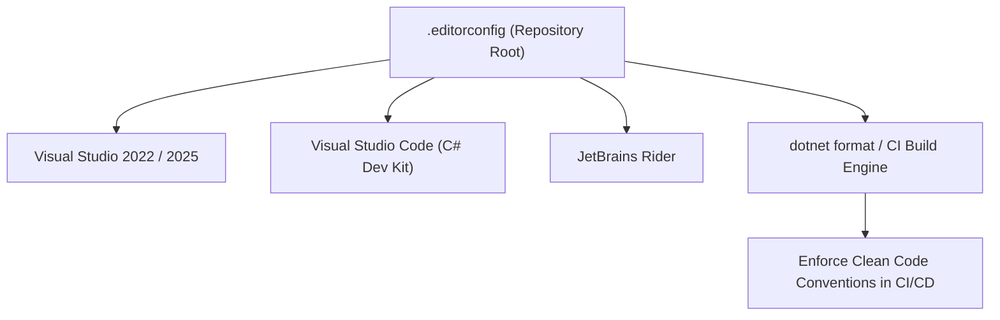

# 18 - Understanding and Configuring `.editorconfig` in .NET & `C#`

## 1. What is `.editorconfig`?

An **`.editorconfig` file** (such as [.editorconfig](file:///C:/Users/Hoang/Desktop/clean/.editorconfig) in our root directory) is a standardized configuration file that defines and enforces consistent **code style, formatting rules, naming conventions, and Roslyn static analyzer warnings** across an entire engineering team and across different IDEs (Visual Studio, VS Code, JetBrains Rider, Vim).



---

## 2. The 4 Core Sections of `.editorconfig`

### Section 1: `root = true` & Global Formatting Rules

```ini
# Top-most EditorConfig file; stops searching parent directories
root = true

[*]
indent_style = space
indent_size = 4
end_of_line = crlf
charset = utf-8
trim_trailing_whitespace = true
insert_final_newline = true

[*.{json,yml,yaml}]
indent_size = 2
```

---

### Section 2: C# Modern Language Style Rules

Controls modern C# 10/11/12/13 idioms:

```ini
[*.cs]
# File-scoped namespaces (standard in .NET 10)
csharp_style_namespace_declarations = file_scoped:warning

# Using directives placed outside namespaces
csharp_using_directive_placement = outside_namespace:warning

# Modern Pattern Matching over 'as' and null checks
csharp_style_pattern_matching_over_as_with_null_check = true:warning
csharp_style_prefer_null_coalescing_operator = true:warning

# Var preferences
csharp_style_var_when_type_is_apparent = true:suggestion
```

---

### Section 3: .NET Naming Conventions

Enforces naming standards with compiler diagnostics:

```ini
# 1. Interface Naming Rule: Must begin with 'I' (e.g. IExcelService, IAppDbContext)
dotnet_naming_rule.interface_should_be_begins_with_i.symbols = interface_symbols
dotnet_naming_rule.interface_should_be_begins_with_i.style = begins_with_i
dotnet_naming_rule.interface_should_be_begins_with_i.severity = warning

dotnet_naming_symbols.interface_symbols.applicable_kinds = interface
dotnet_naming_symbols.interface_symbols.applicable_accessibilities = *
dotnet_naming_style.begins_with_i.required_prefix = I
dotnet_naming_style.begins_with_i.capitalization = pascal_case

# 2. Private Field Naming Rule: Must begin with '_' (e.g. _logger, _context)
dotnet_naming_rule.private_fields_should_be_camel_case_with_underscore.symbols = private_field_symbols
dotnet_naming_rule.private_fields_should_be_camel_case_with_underscore.style = camel_case_with_underscore
dotnet_naming_rule.private_fields_should_be_camel_case_with_underscore.severity = suggestion

dotnet_naming_symbols.private_field_symbols.applicable_kinds = field
dotnet_naming_symbols.private_field_symbols.applicable_accessibilities = private
dotnet_naming_style.camel_case_with_underscore.required_prefix = _
dotnet_naming_style.camel_case_with_underscore.capitalization = camel_case
```

---

### Section 4: Roslyn Analyzer Rules & Severity Levels

You can adjust compiler warning levels for hundreds of Roslyn rules (`CAxxxx` and `IDExxxx`):

| Severity Level | Behavior |
| :--- | :--- |
| **`none` / `silent`** | Rule is ignored, no IDE hints or compiler messages. |
| **`suggestion`** | Shows three subtle gray dots in IDE editor; optional quick-fix available. |
| **`warning`** | Yellow underline in IDE; produces MSBuild compiler warning during build. |
| **`error`** | Red squiggly underline in IDE; **breaks the build immediately**! |

```ini
# Unused parameter -> Warning
dotnet_diagnostic.IDE0060.severity = warning

# Mark member as static if no instance state accessed -> Suggestion
dotnet_diagnostic.CA1822.severity = suggestion
```

---

## 3. How to Use `.editorconfig` in Daily Development & CI/CD

### 1. Auto-Format Codebase via CLI

Automatically formats every file in the solution according to [.editorconfig](file:///C:/Users/Hoang/Desktop/clean/.editorconfig):

```powershell
dotnet format
```

### 2. Enforce Formatting in CI/CD Pipelines

Add this step to your GitHub Actions / Azure DevOps pipeline. If any developer submits unformatted code or style violations, the pull request build fails:

```powershell
dotnet format --verify-no-changes
```

### 3. Enforce Code Style in MSBuild Build Time

To treat code style warnings as build errors automatically, enable this in `Directory.Build.props` or `.csproj`:

```xml
<PropertyGroup>
  <EnforceCodeStyleInBuild>true</EnforceCodeStyleInBuild>
  <TreatWarningsAsErrors>true</TreatWarningsAsErrors>
</PropertyGroup>
```
