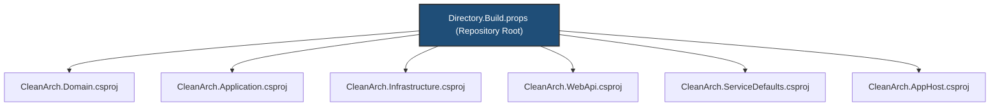

# 19 - Centralized Solution Management with `Directory.Build.props`

## 1. What is `Directory.Build.props`?

In a multi-project Clean Architecture solution (such as our 6 projects: Domain, Application, Infrastructure, WebApi, ServiceDefaults, AppHost), duplicating common build settings (`<TargetFramework>`, `<Nullable>`, `<ImplicitUsings>`, compiler flags, assembly metadata) across every `.csproj` is tedious and error-prone.

**`Directory.Build.props`** is a special MSBuild file placed in the repository root. MSBuild automatically discovers and imports it into **every `.csproj` in that directory tree before project properties are evaluated**.



---

## 2. Our Root [`Directory.Build.props`](../Directory.Build.props)

```xml
<Project>
  <PropertyGroup>
    <!-- Centralized Target Framework & C# Language Version -->
    <TargetFramework>net10.0</TargetFramework>
    <LangVersion>latest</LangVersion>
    <Nullable>enable</Nullable>
    <ImplicitUsings>enable</ImplicitUsings>

    <!-- Code Quality & Static Analysis -->
    <EnforceCodeStyleInBuild>true</EnforceCodeStyleInBuild>
    <AnalysisLevel>latest-recommended</AnalysisLevel>
    <NoWarn>$(NoWarn);CA2007;CA1062;CA1848;CA1305;CA1304;CA1309;CA1873;CA1849;CA1000;CA2016;CA1311;CA1862</NoWarn>

    <!-- Shared Metadata & Versioning -->
    <Authors>Hoang Tran</Authors>
    <Company>Clean Architecture Solutions</Company>
    <Product>Clean Architecture .NET 10 Enterprise Stack</Product>
    <Version>1.0.0</Version>
    <Deterministic>true</Deterministic>
  </PropertyGroup>
</Project>
```

---

## 3. Before vs. After in `.csproj` Files

### ❌ Before: Duplicated across 6 `.csproj` files

```xml
<Project Sdk="Microsoft.NET.Sdk">
  <PropertyGroup>
    <TargetFramework>net10.0</TargetFramework>
    <ImplicitUsings>enable</ImplicitUsings>
    <Nullable>enable</Nullable>
    <LangVersion>latest</LangVersion>
  </PropertyGroup>
  <ItemGroup>
    <!-- Dependencies -->
  </ItemGroup>
</Project>
```

### ✅ After: Ultra-Clean Project Files

In [CleanArch.Domain.csproj](../src/CleanArch.Domain/CleanArch.Domain.csproj):

```xml
<Project Sdk="Microsoft.NET.Sdk">
</Project>
```

In [CleanArch.Application.csproj](../src/CleanArch.Application/CleanArch.Application.csproj):

```xml
<Project Sdk="Microsoft.NET.Sdk">
  <ItemGroup>
    <ProjectReference Include="..\CleanArch.Domain\CleanArch.Domain.csproj" />
  </ItemGroup>

  <ItemGroup>
    <PackageReference Include="FluentValidation" Version="12.1.1" />
    <PackageReference Include="MediatR" Version="14.2.0" />
    <PackageReference Include="Microsoft.EntityFrameworkCore" Version="10.0.11" />
    <PackageReference Include="Microsoft.Extensions.Caching.Memory" Version="10.0.11" />
  </ItemGroup>
</Project>
```

---

## 4. `Directory.Build.props` vs. Related MSBuild Files

| File | When It Runs | Purpose |
| :--- | :--- | :--- |
| **`Directory.Build.props`** | **Start** of project evaluation | Set default properties (`TargetFramework`, `Nullable`, metadata). |
| **`Directory.Build.targets`** | **End** of project evaluation | Override properties or attach post-build custom MSBuild targets. |
| **`Directory.Packages.props`** | Package restore | **Central Package Management (CPM)**: Centralizes NuGet package version numbers across the entire solution. |

---

## 5. Key Benefits for Enterprise Engineering Teams

1. **Single Point of Upgrade**: When upgrading from .NET 10 to .NET 11, change `<TargetFramework>net11.0</TargetFramework>` in **one file** instead of editing 20+ `.csproj` files!
2. **Standardized Code Quality**: `<EnforceCodeStyleInBuild>true</EnforceCodeStyleInBuild>` guarantees that `.editorconfig` rules are enforced on every project during compilation.
3. **Consistent Assembly Metadata**: Version, company name, authors, and copyright are automatically embedded into all compiled `.dll` assemblies.
