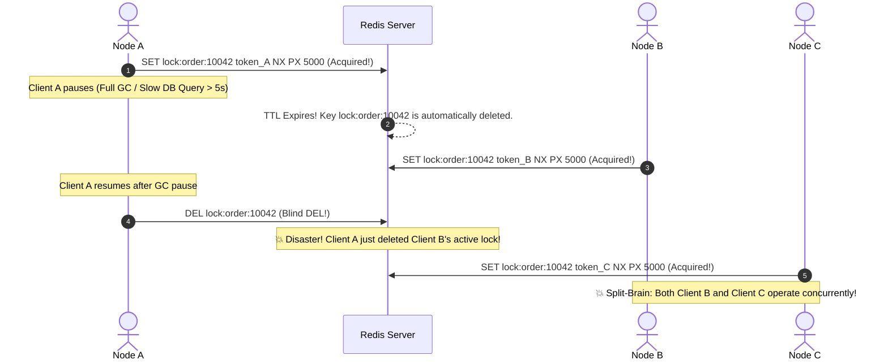
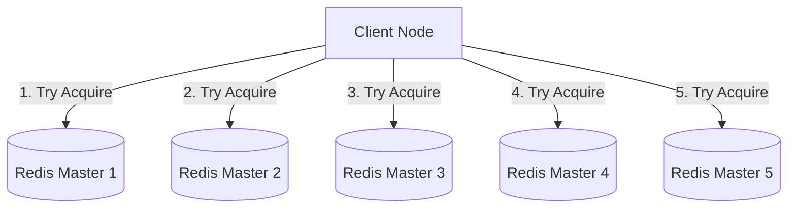
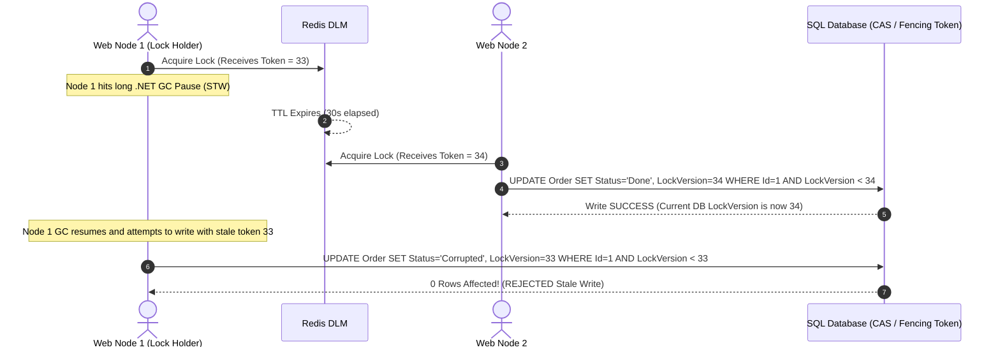

# 20 - Distributed Locking with Redis & .NET Aspire

## 1. Architectural Theory & Problem Statement

In modern cloud-native architectures, applications scale horizontally by deploying multiple container replicas across clusters (Kubernetes, Azure Container Apps, or multi-node .NET Aspire orchestrations). While horizontal scaling provides high availability and throughput, it invalidates traditional single-process concurrency controls.

---

### Why In-Process Locks Fail When Scaling Horizontally

In a single-instance .NET application, developers rely on CLR in-process synchronization primitives:

- `lock (syncRoot)` / `Monitor.Enter` / `Monitor.Exit`
- `SemaphoreSlim`
- `ReaderWriterLockSlim`
- `Mutex` (local to the operating system instance)

These primitives operate strictly within the **memory boundary of a single CLR process (`AppDomain`)**. When requests are load-balanced across multiple nodes, each container instance maintains its own isolated heap, memory allocations, and synchronization primitives.

```text
❌ In-Process Locking (Fails on Multi-Node Replicas):

         HTTP Request 1                        HTTP Request 2
         (Reserve Item 42)                    (Reserve Item 42)
                │                                    │
                ▼                                    ▼
       ┌──────────────────┐                 ┌──────────────────┐
       │   Web Node A     │                 │   Web Node B     │
       │ (Aspire Replica) │                 │ (Aspire Replica) │
       │                  │                 │                  │
       │ lock(_syncObj)   │                 │ lock(_syncObj)   │
       │ [Acquired: OK]   │                 │ [Acquired: OK]   │
       └────────┬─────────┘                 └────────┬─────────┘
                │                                    │
                │ Both acquire LOCAL locks!          │
                │ Both read stock = 1 simultaneously │
                ▼                                    ▼
       ┌───────────────────────────────────────────────────────┐
       │                Shared Database (Stock: 1)             │
       │ 💥 OVERALLOCATION: Both nodes decrement stock to 0    │
       │    Result: Stock = -1 or 2 orders for 1 physical item │
       └───────────────────────────────────────────────────────┘
```

---

### Centralized Distributed Lock Manager (DLM)

To guarantee mutual exclusion across a distributed cluster, the synchronization state must be elevated to a shared, high-performance, centralized coordinator: **Redis**.

```text
✅ Distributed Locking with Redis:

         HTTP Request 1                        HTTP Request 2
         (Reserve Item 42)                    (Reserve Item 42)
                │                                    │
                ▼                                    ▼
       ┌──────────────────┐                 ┌──────────────────┐
       │   Web Node A     │                 │   Web Node B     │
       │ (Aspire Replica) │                 │ (Aspire Replica) │
       └────────┬─────────┘                 └────────┬─────────┘
                │                                    │
                │ 1. SET lock:item:42 token_A NX     │ 2. SET lock:item:42 token_B NX
                │    ==> (1) SUCCESS                 │    ==> (nil) CONFLICT / WAIT
                ▼                                    ▼
       ┌───────────────────────────────────────────────────────┐
       │                 Redis Distributed Lock                │
       │  Key: "lock:item:42" | Value: token_A | TTL: 30s      │
       └───────────────────────────────────────────────────────┘
                │                                    │
                │ Node A processes order             │ Node B waits or retries
                │ Decrements stock (1 -> 0)          │
                │ 3. EVAL (Safe Lua Release)         │
                ▼                                    ▼
       ┌──────────────────┐                 ┌──────────────────┐
       │ Shared Database  │                 │ Node B acquires  │
       │ Stock = 0        │                 │ Stock = 0 (Fails)│
       └──────────────────┘                 └──────────────────┘
```

---

### Critical Real-World Concurrency Failure Scenarios

| Scenario | What Happens Without Distributed Lock | Financial / Operational Impact |
| :--- | :--- | :--- |
| **Flash Sale / High-Contention Inventory** | 100 concurrent requests across 5 replicas read `Stock = 1`, and all 100 write `Stock = 0`. | Physical inventory oversold by 99 items; costly customer refunds and operational damage. |
| **Double Spending / Payment Webhooks** | Stripe sends 2 duplicate webhook notifications simultaneously to different web replicas. | Customer wallet is credited twice for a single top-up or transaction. |
| **Scheduled Batch Job Race Condition** | Cron triggers on multiple container replicas simultaneously without a leader. | Database generates duplicate invoices or sends duplicate marketing emails. |
| **Third-Party API Rate Limiter / Token Refresh** | 4 nodes detect an expired OAuth2 token and all 4 trigger a refresh against an external identity provider. | Token refresh race condition invalidates tokens, breaking upstream integrations. |

---

## 2. Redis Locking Mechanics & The Redlock Algorithm

### 1. Single-Instance Atomic Primitive: `SET ... NX PX`

A production-grade distributed lock must fulfill three foundational requirements:

1. **Safety (Mutual Exclusion)**: At most one client can hold the lock at any given time.
2. **Deadlock Freedom (Liveness)**: If the lock holder crashes or suffers a network partition, the lock must automatically release after a lease expiration time (Time-To-Live / TTL).
3. **Fault Tolerance**: Clients can reliably acquire and release locks even under network jitter.

Redis provides atomic key creation with lease expiration via the `SET` command:

```redis
SET resource_key unique_owner_token NX PX 30000
```

- `resource_key`: The unique identifier of the critical section (e.g., `lock:order:10042`).
- `unique_owner_token`: A cryptographically random GUID + node identifier. **Crucial**: Never use a static string like `"1"` or `"locked"`.
- `NX`: **N**ot E**X**ists — The key is set *only* if it does not already exist. If it exists, Redis returns `(nil)` / `false`.
- `PX 30000`: Set the key expiration to 30,000 milliseconds (30 seconds).

---

### 2. The Release Hazard & Atomic Lua Script

A catastrophic bug in distributed lock implementations is **accidental lock release by an expired owner**.



#### The Safe Release Solution (Atomic Lua Script)

To prevent Node A from releasing Node B's lock, the release operation must **atomically check if the stored value matches the caller's unique token before deleting**:

```lua
-- KEYS[1] = resource key (e.g., "lock:order:10042")
-- ARGV[1] = unique token (e.g., "node-1_550e8400-e29b-41d4-a716-446655440000")
if redis.call("get", KEYS[1]) == ARGV[1] then
    return redis.call("del", KEYS[1])
else
    return 0
end
```

Because Redis executes Lua scripts **single-threaded and atomically**, no other command can run between the `GET` and the `DEL`. If the lease expired and another node acquired the lock, the tokens will not match, the delete will be aborted, and `0` will be returned.

---

### 3. The Redlock Algorithm (Multi-Master DLM)

When running a single Redis instance or a standard Master-Replica configuration, replication is **asynchronous**. If the Master node crashes after granting a lock but before the key is replicated to the Replica, the Replica is promoted to Master. A new client can now acquire the same lock, violating mutual exclusion.

To solve this in distributed topologies with $N$ independent Redis master nodes (typically $N = 5$), Salvatore Sanfilippo (antirez) designed the **Redlock Algorithm**:



#### Redlock Acquisition Steps:

1. Record the current timestamp $T_1$.
2. Sequentially attempt to acquire the lock on all $N$ instances using the same key, random token, and a small acquisition timeout (e.g., 5–50ms).
3. Record the completion timestamp $T_2$. The elapsed time is $\Delta T = T_2 - T_1$.
4. The lock is considered **successfully acquired** if and only if:
   - The lock was acquired on a majority of nodes: $\text{Quorum} \ge \lfloor N/2 \rfloor + 1$ (e.g., at least 3 out of 5).
   - The total elapsed time $\Delta T$ is strictly less than the lock validity time.
5. The remaining valid lock time is $\text{Validity Time} = \text{Initial TTL} - \Delta T - \text{Clock Drift}$.
6. If the client fails to acquire the majority, it sends the safe Lua release script to **all** instances (even those where the lock attempt timed out).

---

### 4. The Kleppmann vs. Antirez Debate: GC Pauses & Fencing Tokens

In 2016, distributed systems researcher Martin Kleppmann published a critique of Redlock. He proved that in an asynchronous network model with unbounded clock drift and process pauses (such as **.NET Garbage Collection Stop-The-World (STW)** pauses or virtual machine hypervisor pauses), no distributed lock alone can guarantee safety without storage-level verification.



#### The Solution: Monotonic Fencing Tokens

1. The lock service returns a **monotonically increasing fencing token** (a counter that increments on every successful lock acquisition).
2. The persistence layer (SQL Server / PostgreSQL / SQLite) checks that the write's fencing token is greater than the highest token recorded so far:

   ```sql
   UPDATE Orders 
   SET Status = @Status, LastFencingToken = @Token 
   WHERE Id = @OrderId AND LastFencingToken < @Token;
   ```

3. Even if Node 1 wakes up after a 60-second GC pause and attempts to execute its write, the database rejects the stale write because `33 < 34`.

---

## 3. .NET Aspire Orchestration

.NET Aspire streamlines running Redis containers locally and in staging environments.

### Step 1: Add Redis Resource in `CleanArch.AppHost`

In [Program.cs](../src/CleanArch.AppHost/Program.cs):

```csharp
var builder = DistributedApplication.CreateBuilder(args);

// 1. Spin up a managed Redis container (or connect to an existing cluster)
var redis = builder.AddRedis("redis")
                   .WithLifetime(ContainerLifetime.Persistent);

// 2. Reference Redis in the WebApi project
var webApi = builder.AddProject<Projects.CleanArch_WebApi>("webapi")
                    .WithReference(redis)
                    .WaitFor(redis);

builder.Build().Run();
```

> [!NOTE]
> Aspire automatically registers the connection string environment variable `ConnectionStrings__redis` into the `CleanArch.WebApi` container and integrates Redis health checks into the Aspire Dashboard.

---

### Step 2: Configure Service Defaults & Connection in WebApi

In `CleanArch.WebApi/Program.cs` and `CleanArch.Infrastructure/DependencyInjection.cs`:

```csharp
// CleanArch.WebApi/Program.cs
var builder = WebApplication.CreateBuilder(args);

builder.AddServiceDefaults();

// Registers IConnectionMultiplexer using the Aspire-managed connection string "redis"
builder.Services.AddSingleton<IConnectionMultiplexer>(sp =>
{
    var configuration = sp.GetRequiredService<IConfiguration>();
    var connectionString = configuration.GetConnectionString("redis") 
                           ?? "localhost:6379,abortConnect=false";
    return ConnectionMultiplexer.Connect(connectionString);
});

// Register Infrastructure services (including Distributed Lock Service)
builder.Services.AddInfrastructureServices(builder.Configuration);
```

---

## 4. Clean Architecture Implementation

We implement Distributed Locking following Clean Architecture principles:

1. **Domain / Application**: `IDistributedLockService` interface, `[DistributedLock]` attribute, and custom exception types.
2. **Infrastructure**: Production implementation using `StackExchange.Redis` with Lua script validation and automatic retry policies.
3. **Application Pipeline**: MediatR `DistributedLockBehavior<TRequest, TResponse>` that intercepts CQRS Commands before execution.

```text
CleanArch.Domain
  └── Exceptions/
        └── DistributedLockAcquisitionException.cs

CleanArch.Application
  ├── Common/
  │     ├── Attributes/
  │     │     └── DistributedLockAttribute.cs
  │     ├── Behaviors/
  │     │     └── DistributedLockBehavior.cs
  │     └── Interfaces/
  │           └── IDistributedLockService.cs
  └── Features/Orders/Commands/
        └── ReserveInventoryCommand.cs

CleanArch.Infrastructure
  └── Services/
        └── RedisDistributedLockService.cs
```

---

### 1. The Domain Exception

```csharp
namespace CleanArch.Domain.Exceptions;

public class DistributedLockAcquisitionException : Exception
{
    public string ResourceKey { get; }
    public TimeSpan Timeout { get; }

    public DistributedLockAcquisitionException(string resourceKey, TimeSpan timeout)
        : base($"Failed to acquire distributed lock on resource '{resourceKey}' within {timeout.TotalSeconds:N1}s. Another operation is currently in progress.")
    {
        ResourceKey = resourceKey;
        Timeout = timeout;
    }
}
```

---

### 2. The Abstraction: `IDistributedLockService` and `IDistributedLockHandle`

```csharp
namespace CleanArch.Application.Common.Interfaces;

public interface IDistributedLockHandle : IAsyncDisposable
{
    string ResourceKey { get; }
    string LockValue { get; }
    long FencingToken { get; }
    bool IsAcquired { get; }
}

public interface IDistributedLockService
{
    /// <summary>
    /// Attempts to acquire a distributed lock within the specified timeout.
    /// Returns an IAsyncDisposable handle that releases the lock upon disposal.
    /// </summary>
    Task<IDistributedLockHandle> AcquireLockAsync(
        string key, 
        TimeSpan expiry, 
        TimeSpan timeout, 
        CancellationToken cancellationToken = default);

    /// <summary>
    /// Non-blocking attempt to acquire a distributed lock. Returns null if lock is unavailable.
    /// </summary>
    Task<IDistributedLockHandle?> TryAcquireLockAsync(
        string key, 
        TimeSpan expiry, 
        CancellationToken cancellationToken = default);
}
```

---

### 3. The `[DistributedLock]` CQRS Attribute

```csharp
namespace CleanArch.Application.Common.Attributes;

[AttributeUsage(AttributeTargets.Class, AllowMultiple = false, Inherited = true)]
public class DistributedLockAttribute : Attribute
{
    /// <summary>
    /// Key template supporting property interpolation, e.g. "Order_{OrderId}" or "Inventory_{ProductId}".
    /// </summary>
    public string KeyTemplate { get; }

    /// <summary>
    /// Maximum duration the lock will be held before expiring (default: 30 seconds).
    /// </summary>
    public int ExpirySeconds { get; set; } = 30;

    /// <summary>
    /// Maximum time to wait/retry while attempting to acquire the lock (default: 10 seconds).
    /// </summary>
    public int WaitTimeoutSeconds { get; set; } = 10;

    public DistributedLockAttribute(string keyTemplate)
    {
        KeyTemplate = keyTemplate;
    }
}
```

---

### 4. The MediatR `DistributedLockBehavior` Pipeline

```csharp
using System.Reflection;
using System.Text.RegularExpressions;
using CleanArch.Application.Common.Attributes;
using CleanArch.Application.Common.Interfaces;
using MediatR;
using Microsoft.Extensions.Logging;

namespace CleanArch.Application.Common.Behaviors;

public class DistributedLockBehavior<TRequest, TResponse> : IPipelineBehavior<TRequest, TResponse>
    where TRequest : notnull
{
    private readonly IDistributedLockService _lockService;
    private readonly ILogger<DistributedLockBehavior<TRequest, TResponse>> _logger;

    public DistributedLockBehavior(
        IDistributedLockService lockService,
        ILogger<DistributedLockBehavior<TRequest, TResponse>> logger)
    {
        _lockService = lockService;
        _logger = logger;
    }

    public async Task<TResponse> Handle(
        TRequest request, 
        RequestHandlerDelegate<TResponse> next, 
        CancellationToken cancellationToken)
    {
        var lockAttribute = typeof(TRequest).GetCustomAttribute<DistributedLockAttribute>();
        
        // If the command is not decorated with [DistributedLock], pass through
        if (lockAttribute == null)
        {
            return await next();
        }

        // Evaluate dynamic key from request properties (e.g., "Order_{OrderId}" -> "Order_45892")
        var resolvedLockKey = FormatLockKey(lockAttribute.KeyTemplate, request);
        var expiry = TimeSpan.FromSeconds(lockAttribute.ExpirySeconds);
        var timeout = TimeSpan.FromSeconds(lockAttribute.WaitTimeoutSeconds);

        _logger.LogInformation("🔒 [DistributedLock] Attempting to acquire lock for key '{LockKey}' (Timeout: {Timeout}s, Expiry: {Expiry}s)", 
            resolvedLockKey, timeout.TotalSeconds, expiry.TotalSeconds);

        // Acquire lock with lease timeout and wait timeout
        await using var lockHandle = await _lockService.AcquireLockAsync(
            resolvedLockKey, 
            expiry, 
            timeout, 
            cancellationToken);

        _logger.LogInformation("🔓 [DistributedLock] Acquired lock '{LockKey}' with FencingToken: {FencingToken}", 
            resolvedLockKey, lockHandle.FencingToken);

        try
        {
            return await next();
        }
        finally
        {
            _logger.LogInformation("🔐 [DistributedLock] Releasing lock for key '{LockKey}'", resolvedLockKey);
        }
    }

    private static string FormatLockKey(string template, TRequest request)
    {
        return Regex.Replace(template, @"\{(\w+)\}", match =>
        {
            var propertyName = match.Groups[1].Value;
            var property = typeof(TRequest).GetProperty(propertyName, BindingFlags.Public | BindingFlags.Instance | BindingFlags.IgnoreCase);
            
            if (property == null)
            {
                throw new InvalidOperationException($"Property '{propertyName}' specified in [DistributedLock] template was not found on '{typeof(TRequest).Name}'.");
            }

            var value = property.GetValue(request)?.ToString();
            return value ?? "null";
        });
    }
}
```

---

### 5. Infrastructure Implementation: `RedisDistributedLockService`

```csharp
using System.Diagnostics;
using CleanArch.Application.Common.Interfaces;
using CleanArch.Domain.Exceptions;
using Microsoft.Extensions.Logging;
using StackExchange.Redis;

namespace CleanArch.Infrastructure.Services;

public class RedisDistributedLockService : IDistributedLockService
{
    private readonly IConnectionMultiplexer _redis;
    private readonly ILogger<RedisDistributedLockService> _logger;

    // Atomic Lua script: Releases lock ONLY if the value matches the current owner token
    private const string ReleaseLockLuaScript = @"
        if redis.call('get', KEYS[1]) == ARGV[1] then
            return redis.call('del', KEYS[1])
        else
            return 0
        end";

    public RedisDistributedLockService(
        IConnectionMultiplexer redis,
        ILogger<RedisDistributedLockService> logger)
    {
        _redis = redis;
        _logger = logger;
    }

    public async Task<IDistributedLockHandle> AcquireLockAsync(
        string key, 
        TimeSpan expiry, 
        TimeSpan timeout, 
        CancellationToken cancellationToken = default)
    {
        var db = _redis.GetDatabase();
        var lockValue = $"{Environment.MachineName}_{Guid.NewGuid():N}";
        var stopwatch = Stopwatch.StartNew();
        var retryDelay = TimeSpan.FromMilliseconds(50);
        var maxRetryDelay = TimeSpan.FromMilliseconds(500);

        while (stopwatch.Elapsed < timeout)
        {
            cancellationToken.ThrowIfCancellationRequested();

            // Atomic SET resource_key value NX PX expiry_ms
            var acquired = await db.StringSetAsync(
                key, 
                lockValue, 
                expiry, 
                When.NotExists);

            if (acquired)
            {
                // Generate monotonic fencing token via Redis INCR
                var fencingToken = await db.StringIncrementAsync($"fencing:{key}");
                
                return new RedisLockHandle(db, key, lockValue, fencingToken, _logger);
            }

            // Exponential backoff with jitter to prevent stampedes
            var jitter = Random.Shared.Next(10, 50);
            await Task.Delay(retryDelay + TimeSpan.FromMilliseconds(jitter), cancellationToken);

            retryDelay = TimeSpan.FromMilliseconds(Math.Min(retryDelay.TotalMilliseconds * 1.5, maxRetryDelay.TotalMilliseconds));
        }

        throw new DistributedLockAcquisitionException(key, timeout);
    }

    public async Task<IDistributedLockHandle?> TryAcquireLockAsync(
        string key, 
        TimeSpan expiry, 
        CancellationToken cancellationToken = default)
    {
        var db = _redis.GetDatabase();
        var lockValue = $"{Environment.MachineName}_{Guid.NewGuid():N}";

        var acquired = await db.StringSetAsync(key, lockValue, expiry, When.NotExists);
        if (!acquired)
        {
            return null;
        }

        var fencingToken = await db.StringIncrementAsync($"fencing:{key}");
        return new RedisLockHandle(db, key, lockValue, fencingToken, _logger);
    }

    private sealed class RedisLockHandle : IDistributedLockHandle
    {
        private readonly IDatabase _db;
        private readonly ILogger _logger;
        private int _isDisposed;

        public string ResourceKey { get; }
        public string LockValue { get; }
        public long FencingToken { get; }
        public bool IsAcquired => Volatile.Read(ref _isDisposed) == 0;

        public RedisLockHandle(
            IDatabase db, 
            string key, 
            string lockValue, 
            long fencingToken,
            ILogger logger)
        {
            _db = db;
            ResourceKey = key;
            LockValue = lockValue;
            FencingToken = fencingToken;
            _logger = logger;
        }

        public async ValueTask DisposeAsync()
        {
            if (Interlocked.Exchange(ref _isDisposed, 1) != 0)
            {
                return; // Already released
            }

            try
            {
                var result = (int)await _db.ScriptEvaluateAsync(
                    ReleaseLockLuaScript,
                    keys: new RedisKey[] { ResourceKey },
                    values: new RedisValue[] { LockValue });

                if (result == 1)
                {
                    _logger.LogDebug("Successfully released distributed lock for '{ResourceKey}'", ResourceKey);
                }
                else
                {
                    _logger.LogWarning("Failed to release distributed lock for '{ResourceKey}'. Lock may have expired or been acquired by another process.", ResourceKey);
                }
            }
            catch (Exception ex)
            {
                _logger.LogError(ex, "Exception occurred while releasing distributed lock for '{ResourceKey}'", ResourceKey);
            }
        }
    }
}
```

---

### 6. Using Distributed Lock in a CQRS Command

```csharp
using CleanArch.Application.Common.Attributes;
using CleanArch.Application.Common.Interfaces;
using MediatR;
using Microsoft.Extensions.Logging;

namespace CleanArch.Application.Features.Orders.Commands;

// 🎯 Decorated with [DistributedLock]: Automatically acquires lock for Order_{OrderId} before handler execution
[DistributedLock("Order_{OrderId}", ExpirySeconds = 20, WaitTimeoutSeconds = 5)]
public record ReserveInventoryCommand(
    Guid OrderId,
    Guid ProductId,
    int Quantity) : IRequest<ReserveInventoryResult>;

public record ReserveInventoryResult(bool Success, string Message, long FencingToken);

public class ReserveInventoryCommandHandler : IRequestHandler<ReserveInventoryCommand, ReserveInventoryResult>
{
    private readonly IApplicationDbContext _context;
    private readonly ILogger<ReserveInventoryCommandHandler> _logger;

    public ReserveInventoryCommandHandler(
        IApplicationDbContext context,
        ILogger<ReserveInventoryCommandHandler> logger)
    {
        _context = context;
        _logger = logger;
    }

    public async Task<ReserveInventoryResult> Handle(ReserveInventoryCommand request, CancellationToken cancellationToken)
    {
        _logger.LogInformation("Processing inventory reservation for Product: {ProductId}, Quantity: {Quantity}", 
            request.ProductId, request.Quantity);

        // Simulated business logic: Fetch product, check stock, reserve
        var product = await _context.Products.FindAsync([request.ProductId], cancellationToken);
        if (product == null)
        {
            return new ReserveInventoryResult(false, "Product not found", 0);
        }

        if (product.AvailableStock < request.Quantity)
        {
            return new ReserveInventoryResult(false, "Insufficient stock", 0);
        }

        product.AvailableStock -= request.Quantity;
        await _context.SaveChangesAsync(cancellationToken);

        return new ReserveInventoryResult(true, "Inventory reserved successfully", 0);
    }
}
```

---

## 5. Production Best Practices & Pitfalls

### 1. Lock Lease Expiration vs. Execution Duration

- **The Danger**: If business logic takes 35 seconds and the lock lease is 30 seconds, the lock will silently expire mid-execution.
- **The Remedy: Auto-Renewal / Heartbeat Watchdog**:
  For long-running tasks, run a background timer (`PeriodicTimer`) that extends the lock TTL (e.g., via `EXPIRE key 30`) every 10 seconds while the thread is still actively processing. Stop the timer when the task completes.

### 2. Redis Master-Replica Failover Split-Brain

- In a standard Redis Sentinel / Redis Cluster setup, replication between Master and Replica is **asynchronous**.
- If Client 1 writes a lock to Master, and Master crashes before replication completes, Sentinel promotes Replica to Master. Client 2 requests the lock and acquires it, causing a split-brain.
- **Guideline**: If absolute safety is required (zero probability of dual execution), combine Redis distributed locking with **Database-Level Optimistic Concurrency** (e.g. `RowVersion` / `xmin`) or use the multi-node **Redlock algorithm**.

### 3. Jittered Exponential Backoff

- When 100 threads contend for a single lock, retrying at a fixed interval (e.g., every 50ms) creates a synchronized spike of Redis traffic (**Thundering Herd problem**).
- Always introduce random jitter (`Random.Shared.Next(10, 50)`) and exponential backoff to smooth out retry contention.

### 4. Defense-in-Depth: Locking + Idempotency + Optimistic Concurrency

```text
Layer 1: [Idempotent] Filter       ──> Replay Prevention (Discards identical HTTP retries)
Layer 2: [DistributedLock] Behavior ──> Serialization (Queues concurrent requests across pods)
Layer 3: DB RowVersion / CAS       ──> Absolute Storage Integrity (Rejects stale fencing tokens)
```

---

## 6. Senior Engineering Interview Questions & Deep-Dive Answers

### Q1: Why is `lock (obj)` or `SemaphoreSlim` insufficient in a microservices / containerized architecture, and what exact failure modes occur without distributed synchronization?

**Answer:**
`lock (obj)` and `SemaphoreSlim` operate strictly within the private memory space of a single CLR process (`AppDomain`). When an application scales horizontally across multiple containers or nodes:

1. Each container instance possesses its own independent heap, thread pool, and synchronization primitives.
2. An in-process lock only synchronizes threads executing on that specific node; requests routed to other nodes bypass the lock completely.
3. Without a distributed synchronization coordinator, concurrent requests hitting different nodes trigger race conditions on shared state (e.g., inventory overselling, double wallet debits, duplicate webhook processing, and split-brain background jobs).

---

### Q2: Explain the fundamental vulnerability of single-instance Redis locking during Master-Replica failover. How does Redlock attempt to solve it, and what are its trade-offs?

**Answer:**

1. **The Failover Vulnerability**: Redis replication to read-replicas is **asynchronous** for high throughput. If Client A acquires a lock on the Master (`SET lock:order:1 NX PX 30000`), and the Master crashes before the write is replicated to the Replica, Sentinel promotes the Replica to Master. The new Master has no record of the key, allowing Client B to acquire the same lock. Both Client A and Client B now execute the critical section simultaneously.
2. **The Redlock Solution**: Redlock avoids replication lag by using $N$ independent Redis masters (no replicas needed for locking). A client attempts to acquire the lock across all $N$ masters. The lock is only considered valid if acquired on a majority ($\lfloor N/2 \rfloor + 1$) within a time window smaller than the lease duration.
3. **Trade-offs**: Redlock requires deploying and maintaining multiple independent Redis nodes, increases latency due to multiple network round trips, and remains vulnerable to severe clock drift and process pauses without storage fencing tokens.

---

### Q3: What is the "Stop-The-World (STW) GC Pause" problem in distributed locks, and how do Monotonic Fencing Tokens prevent data corruption?

**Answer:**

1. **The Problem**: Suppose Node 1 acquires a distributed lock with a 10-second TTL. Immediately after acquisition, the .NET runtime enters a Full Garbage Collection STW pause (or the hypervisor pauses the virtual machine) for 15 seconds. During this pause, the Redis TTL expires, and Node 2 acquires the lock and modifies the resource. When Node 1's GC resumes, Node 1 assumes it still owns the lock and executes its database write, overwriting Node 2's changes (**stale write / ABA problem**).
2. **The Solution (Fencing Tokens)**: Whenever a lock is acquired, the lock manager generates a monotonically increasing number (Fencing Token, e.g., via Redis `INCR`). When writing to the database, the update statement includes a conditional check:

   ```sql
   UPDATE Accounts 
   SET Balance = Balance - @Amount, LastToken = @FencingToken 
   WHERE AccountId = @Id AND LastToken < @FencingToken;
   ```

   When Node 1 attempts to write with stale token `33` after Node 2 wrote with token `34`, the database rejects Node 1's write (`33 < 34`), preserving data consistency.

---

### Q4: How would you design a distributed lock mechanism that prevents lock expiration for a long-running batch job without hardcoding an enormous lease time?

**Answer:**
Hardcoding a huge TTL (e.g., 2 hours) is dangerous because if the worker node crashes or loses power, the lock remains locked for 2 hours, blocking all subsequent operations.
The production-grade pattern is a **Lock Renewal Watchdog (Heartbeat)**:

1. Acquire the lock with a short, safe lease time (e.g., 30 seconds).
2. Spawn a background heartbeat task using `PeriodicTimer` that runs every $1/3$ of the TTL (e.g., every 10 seconds).
3. On each tick, execute an atomic Lua script that extends the TTL back to 30 seconds, but *only if the lock value still matches the worker's token*:

   ```lua
   if redis.call("get", KEYS[1]) == ARGV[1] then
       return redis.call("expire", KEYS[1], ARGV[2])
   else
       return 0
   end
   ```

4. When the main job completes, cancel the heartbeat task and execute the safe Lua release script. If the worker crashes, the heartbeat stops and Redis automatically expires the lock within 30 seconds.

---

### Q5: Compare Distributed Locking vs. Optimistic Concurrency Control (OCC) vs. Pessimistic DB Locking (`SELECT FOR UPDATE`). When should you use which?

**Answer:**

| Mechanism | How It Works | Contention Profile | Best Use Cases | Overhead & Drawbacks |
| :--- | :--- | :--- | :--- | :--- |
| **Distributed Lock (Redis)** | Shared in-memory lock manager coordinates exclusion across application instances. | **Medium to High** | Multi-step workflows, calling 3rd-party non-transactional APIs (Stripe, Twilio), cross-service operations. | Requires external infrastructure (Redis); lease expiration tuning required. |
| **Optimistic Concurrency (OCC)** | Reads without locking; verifies version column (`RowVersion`, `xmin`) during `UPDATE`. | **Low to Moderate** | Read-heavy workloads with rare concurrent edits (e.g., User Profile update). | Wasted CPU on failed retries when contention is high. |
| **Pessimistic DB Lock (`SELECT ... FOR UPDATE`)** | Database engine locks index/rows for the duration of the SQL transaction. | **High** (single DB entity) | Banking balance transfers, strictly relational atomic operations within one database. | Holds database connection open; risk of deadlocks; does not protect external API calls. |

---

## 7. Summary & Best Practice Checklist

- [x] **Never use in-process locks (`lock`, `SemaphoreSlim`) for multi-replica shared state.**
- [x] **Always set a sensible lease expiration (TTL) on Redis locks to prevent deadlocks.**
- [x] **Always release locks using atomic Lua scripts verifying the unique owner token.**
- [x] **Implement jittered exponential backoff to avoid the Thundering Herd problem during lock contention.**
- [x] **Use Monotonic Fencing Tokens at the database layer to guard against GC pauses and clock drift.**
- [x] **Combine Distributed Locking with API Idempotency and Optimistic Concurrency for true defense-in-depth.**
