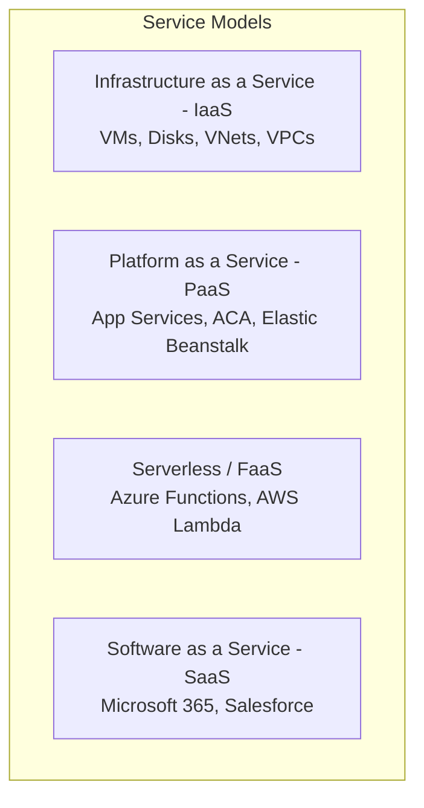

# Module 01: Cloud Fundamentals, Azure vs. AWS & Shared Responsibility

Cloud computing is the on-demand delivery of IT resources over the internet with pay-as-you-go pricing. This module examines core cloud service models, cloud economics, the architectural hierarchies of **Microsoft Azure** and **Amazon Web Services (AWS)**, and the fundamental **Shared Responsibility Model**.

---

## ☁️ 1. Cloud Service Models & Architecture

Modern cloud infrastructure is categorized into four primary service models:



### Comparative Service Model Matrix

| Service Model | You Manage (Customer) | Cloud Provider Manages (Azure / AWS) | Typical Examples |
| :--- | :--- | :--- | :--- |
| **On-Premises** | Everything (Hardware, Hypervisor, OS, Runtime, Apps) | Nothing | Private Data Centers |
| **IaaS** | OS, Patching, Runtime, Middleware, App Code, Data | Physical Hardware, Hypervisor, Storage, Datacenter Power & Network | Azure Virtual Machines, AWS EC2, EBS Disks |
| **PaaS** | Application Code, Configurations, Data, Identity | OS, Patching, Runtime Engine, Web Server, Auto-scaling Infrastructure | Azure Container Apps, Azure App Service, AWS Elastic Beanstalk |
| **Serverless (FaaS)** | Function Code, Event Trigger Mappings, Data | Server Fleet, Micro-Billing per millisecond, Automatic Zero-to-N Scaling | Azure Functions, AWS Lambda |
| **SaaS** | User Access, Tenant Configuration, Data | Application Code, Infrastructure, Databases, High Availability, Backups | Microsoft 365, Workday, Datadog |

---

## 🏢 2. Resource & Account Hierarchy: Azure vs. AWS

Enterprise organizations require structured boundaries for billing, access governance, and blast-radius isolation.

```mermaid
flowchart TD
    subgraph Sub_AzureHierarchy["Azure Resource Hierarchy"]
        AZ_Tenant["Entra ID Tenant"] --> AZ_MG["Management Groups"]
        AZ_MG --> AZ_Sub["Subscriptions / Billing Boundary"]
        AZ_Sub --> AZ_RG["Resource Groups / Lifecycle Boundary"]
        AZ_RG --> AZ_Res["Azure Resources: VMs, DBs, Storage"]
    end

    subgraph Sub_AwsHierarchy["AWS Resource Hierarchy"]
        AWS_Org["AWS Organizations"] --> AWS_Root["Root"]
        AWS_Root --> AWS_OU["Organizational Units - OUs"]
        AWS_OU --> AWS_Acc["AWS Accounts / Security & Billing Boundary"]
        AWS_Acc --> AWS_Res["AWS Resources: EC2, S3, RDS"]
    end
```



### Hierarchy Comparison Breakdown

1. **Azure Subscriptions vs. AWS Accounts**:
   - In Azure, the **Subscription** acts as the primary billing boundary and policy enforcement container under an Entra ID Tenant.
   - In AWS, the **AWS Account** is the primary blast-radius isolation and billing unit. Enterprises manage hundreds of accounts grouped into Organizational Units (OUs) via AWS Organizations.
2. **Azure Resource Groups**:
   - Azure requires every resource to reside inside exactly one **Resource Group (RG)**. RGs share a common lifecycle (creating, updating, or deleting an RG deletes all child resources simultaneously).
   - In AWS, resources reside directly in an AWS Account and Region; grouping is achieved logically using **AWS Resource Groups** or resource tags.

---

## 🛡️ 3. The Shared Responsibility Model

Security and compliance in the cloud is a shared effort between the cloud provider and the customer:

```text
┌────────────────────────────────────────────────────────────────────────┐
│                        SHARED RESPONSIBILITY MATRIX                    │
├───────────────────────┬──────────────┬──────────────┬──────────────────┤
│ Layer                 │ IaaS         │ PaaS         │ SaaS             │
├───────────────────────┼──────────────┼──────────────┼──────────────────┤
│ Customer Data         │ CUSTOMER     │ CUSTOMER     │ CUSTOMER         │
│ Identity & IAM        │ CUSTOMER     │ CUSTOMER     │ CUSTOMER         │
│ App Configuration     │ CUSTOMER     │ CUSTOMER     │ CUSTOMER         │
│ Application Code      │ CUSTOMER     │ CUSTOMER     │ PROVIDER/SHARED  │
│ OS & Patching         │ CUSTOMER     │ PROVIDER     │ PROVIDER         │
│ Network Controls      │ CUSTOMER     │ SHARED       │ PROVIDER         │
│ Hypervisor & Hardware │ PROVIDER     │ PROVIDER     │ PROVIDER         │
│ Physical Data Center  │ PROVIDER     │ PROVIDER     │ PROVIDER         │
└───────────────────────┴──────────────┴──────────────┴──────────────────┘
```

> [!IMPORTANT]
> **Zero-Trust Rule**: In all cloud models (even SaaS), **Customer Data** and **Identity/Access Governance** are ALWAYS 100% the responsibility of the customer.

---

## 💰 4. Cloud Economics & FinOps Best Practices

Migrating to the cloud transitions financial models from **CapEx** (Capital Expenditure - upfront servers, long depreciation) to **OpEx** (Operational Expenditure - pay-as-you-go elastic consumption).

### Pricing & Cost Optimization Strategies

1. **On-Demand Consumption**:
   - Highest flexibility, highest per-hour cost. Best for unpredictable or short-lived workloads.
2. **Reserved Instances (RI) & Savings Plans**:
   - Commit to a 1-year or 3-year term for predictable baseline workloads.
   - Saves up to **72%** on Azure VMs / AWS EC2 and managed databases.
3. **Spot Instances (Azure Spot / AWS Spot)**:
   - Bid on surplus datacenter capacity at up to **90% discount**.
   - Cloud provider can evict with a 30-second to 2-minute notice. Ideal for stateless batch processing, CI/CD runners, and distributed rendering.
4. **FinOps Tagging Framework**:
   - Enforce mandatory resource tags for all deployments:
     - `Environment`: `prod`, `staging`, `dev`
     - `CostCenter`: `Engineering-104`
     - `Owner`: `alice@enterprise.com`
     - `Project`: `CleanArchitecture-ERP`

---

## 🏛️ 5. Well-Architected Framework: Azure WAF vs. AWS WAF

Both Microsoft and AWS structure architectural best practices around five fundamental pillars:

| Pillar | Focus | Key Practices |
| :--- | :--- | :--- |
| **Reliability** | Ability of a system to recover from failures and dynamically acquire resources | Multi-AZ deployments, Circuit Breaker patterns, auto-healing health probes, RPO/RTO planning |
| **Security** | Protecting data, systems, and assets through defense-in-depth | Least-privilege IAM, Key Vault / KMS encryption, private networking, automated CVE patching |
| **Cost Optimization** | Eliminating unneeded expense and matching capacity with demand | Auto-scaling, FinOps tags, RI/Savings plans, storage lifecycle tiering |
| **Operational Excellence** | Running and monitoring systems to deliver business value | Infrastructure as Code (IaC), automated CI/CD, OpenTelemetry distributed tracing |
| **Performance Efficiency** | Using computing resources efficiently to meet requirements | Caching (Redis/CDN), CQRS read/write separation, asynchronous event queues, modern CPU architectures (ARM64 Graviton/Cobalt) |
