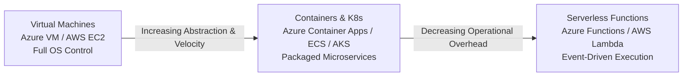
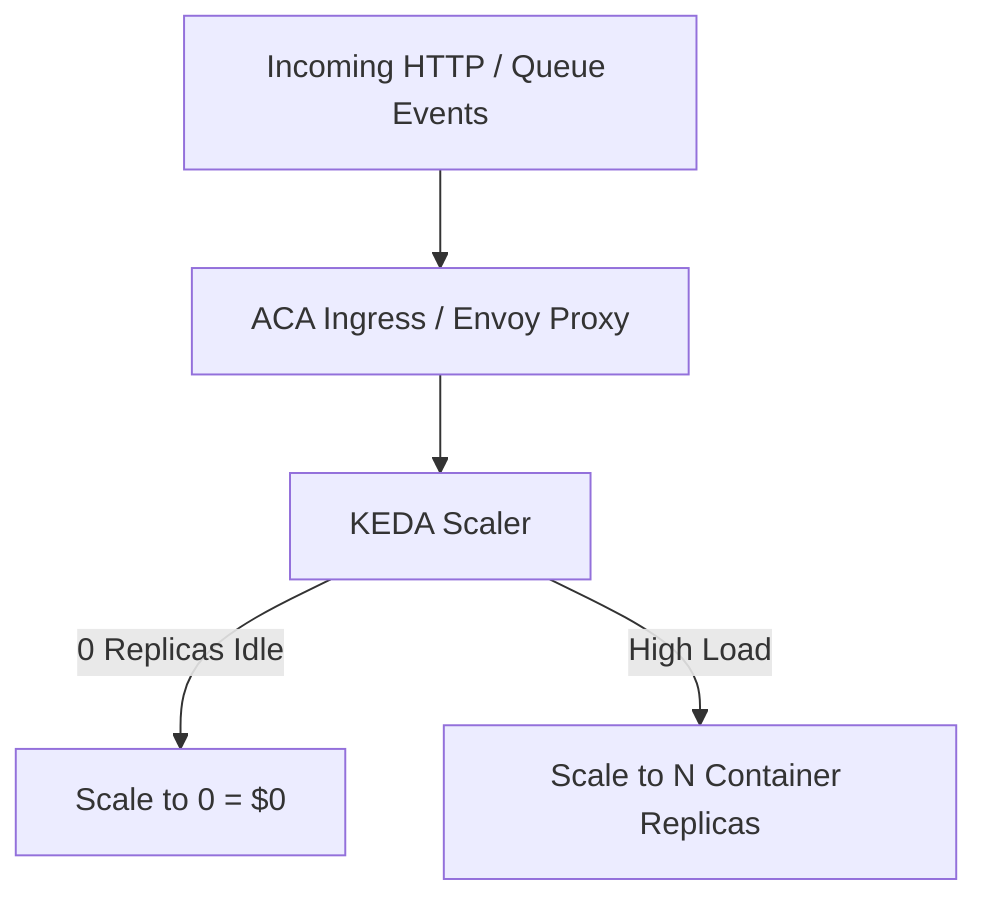

# Module 02: Cloud Compute, VMs, Containers & Serverless

Modern cloud applications leverage diverse compute execution models depending on latency requirements, orchestration complexity, and operational overhead. This module compares **Virtual Machines (IaaS)**, **Containerized Platforms (PaaS / CaaS)**, and **Serverless Functions (FaaS)** across Azure and AWS, highlighting .NET 10 optimization techniques.

---

## 💻 1. Compute Model Comparison



### Comprehensive Compute Matrix

| Feature | Azure Virtual Machines / AWS EC2 | Azure Container Apps / AWS ECS Fargate | Azure Functions / AWS Lambda |
| :--- | :--- | :--- | :--- |
| **Model** | IaaS (Dedicated OS & Kernel) | CaaS / PaaS (Serverless Containers) | FaaS (Serverless Micro-Functions) |
| **Scaling** | Scale Sets / Auto Scaling Groups (Minutes) | KEDA / Target Tracking (Seconds) | Instant event-driven concurrency (Milliseconds) |
| **Scale to Zero** | No (Hourly billing continues) | **Yes** (0 replicas = $0 compute cost) | **Yes** (Pay only per invocation/millisecond) |
| **Max Execution Duration** | Unlimited | Unlimited | 5-15 minutes (configurable in Consumption/Flex) |
| **OS Maintenance** | Customer responsibility | Managed by Cloud Provider | Managed by Cloud Provider |
| **Ideal Workloads** | Legacy software, custom kernel drivers, GPU workloads | Web APIs, Background Queue Workers, .NET 10 Clean Architecture | Webhook listeners, S3/Blob file triggers, scheduled cron jobs |

---

## ⚡ 2. High-Performance Serverless with .NET 10

In .NET 10, running on Azure Functions or AWS Lambda provides sub-millisecond startup times when combined with the **Isolated Worker Model** and **Native AOT (Ahead-of-Time)** compilation.

### Azure Function (.NET 10 Isolated Worker)

```csharp
using System.Net;
using Microsoft.Azure.Functions.Worker;
using Microsoft.Azure.Functions.Worker.Http;
using Microsoft.Extensions.Logging;

namespace CleanArch.CloudFunctions;

public class OrderProcessingFunction
{
    private readonly ILogger<OrderProcessingFunction> _logger;

    public OrderProcessingFunction(ILogger<OrderProcessingFunction> logger)
    {
        _logger = logger;
    }

    [Function("ProcessOrderQueue")]
    public async Task<HttpResponseData> Run(
        [HttpTrigger(AuthorizationLevel.Function, "post", Route = "orders/process")] HttpRequestData req,
        FunctionContext executionContext)
    {
        _logger.LogInformation("Processing incoming order via Azure Function execution...");

        var response = req.CreateResponse(HttpStatusCode.OK);
        await response.WriteAsJsonAsync(new
        {
            Status = "Accepted",
            ProcessedAtUtc = DateTime.UtcNow,
            ExecutionId = executionContext.InvocationId
        });

        return response;
    }
}
```

### AWS Lambda Function (.NET 10 Native AOT)

```csharp
using System.Text.Json.Serialization;
using Amazon.Lambda.Core;
using Amazon.Lambda.APIGatewayEvents;

[assembly: LambdaSerializer(typeof(Amazon.Lambda.Serialization.SystemTextJson.DefaultLambdaJsonSerializer))]

namespace CleanArch.AwsLambda;

public class Function
{
    public APIGatewayHttpApiV2ProxyResponse FunctionHandler(
        APIGatewayHttpApiV2ProxyRequest request, 
        ILogger logger)
    {
        logger.LogInformation($"Handling AWS Lambda event: {request.RequestContext.RequestId}");

        return new APIGatewayHttpApiV2ProxyResponse
        {
            StatusCode = 200,
            Body = "{\"status\":\"success\",\"engine\":\".NET 10 Native AOT\"}",
            Headers = new Dictionary<string, string> { { "Content-Type", "application/json" } }
        };
    }
}
```

---

## 🐳 3. Modern Container Orchestration: Azure Container Apps (ACA) & AWS ECS

For microservices and enterprise Web APIs, **Azure Container Apps (ACA)** and **AWS ECS Fargate** eliminate the operational complexity of managing full Kubernetes control planes while preserving Kubernetes features.

### Azure Container Apps (ACA) Key Capabilities

1. **Built on Kubernetes & Envoy**: Out-of-the-box ingress, mTLS, traffic splitting (Blue/Green deployments), and Dapr integration.
2. **KEDA Autoscaling (Kubernetes Event-Driven Autoscaling)**:
   - Scale containers based on HTTP concurrency, Redis queue length, Azure Service Bus topic message depth, or CPU/Memory thresholds.
   - Scale down to **0 replicas** during non-business hours to minimize cloud cost.



### KEDA Scaling Rule Example for Azure Container App

```yaml
scale:
  minReplicas: 0
  maxReplicas: 20
  rules:
    - name: queue-depth-scaler
      type: azure-servicebus
      metadata:
        queueName: order-processing-queue
        messageCount: "10"
      auth:
        - secretRef: sb-connection-string
          triggerParameter: connection
```

---

## 🚀 4. Mitigating Serverless Cold Starts in .NET

1. **Native AOT Compilation**: Produces a standalone native binary without requiring JIT compilation at runtime, slashing cold starts from ~1,500ms down to **< 50ms**.
2. **Azure Functions Flex Consumption**: Pre-warmed instances and high-concurrency scaling with reduced latency.
3. **AWS Lambda SnapStart**: Takes a memory snapshot of the initialized Firecracker microVM during deployment and restores it instantly upon execution.
