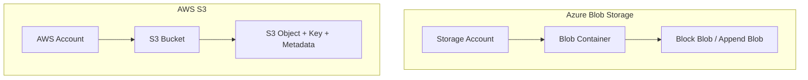

# Module 03: Cloud Storage, Blob Storage, S3 & Data Tiering

Unstructured object storage is the cornerstone of cloud-native systems for hosting media assets, documents, backups, big data analytics, and telemetry archives. This module analyzes **Azure Blob Storage** and **Amazon Simple Storage Service (S3)**, lifecycle data tiering, and security access models.

---

## 🗄️ 1. Object Storage Architecture: Azure Blob vs. AWS S3

Unlike file shares (SMB/NFS) or block storage (disks), object storage stores data as flat, addressable objects with rich custom metadata over standard HTTP/HTTPS REST APIs.



### Terminology & Architectural Mapping

| Feature | Azure Blob Storage | Amazon S3 |
| :--- | :--- | :--- |
| **Top-Level Container** | Storage Account (Flat Namespace or ADLS Gen2 Hierarchical) | S3 Bucket (Globally unique DNS name across all AWS) |
| **Sub-Container** | Blob Container | Logical Prefix (simulated folders with `/`) |
| **Object Unit** | Block Blob (files up to 190.7 TB) / Append Blob (logs) | S3 Object (files up to 5 TB per object) |
| **Redundancy Options** | LRS (Locally Redundant), ZRS (Zone Redundant), GRS (Geo-Redundant), GZRS (Geo-Zone Redundant) | S3 Standard (3 AZs), S3 One Zone-IA, CRR (Cross-Region Replication) |
| **Durability Guarantee** | 99.999999999% (11 9's) for LRS; 16 9's for GRS | 99.999999999% (11 9's) across all redundancy classes |

---

## ⏳ 2. Storage Access Tiers & Automated Lifecycle Policies

Cloud object storage offers tiered pricing to optimize costs based on data access frequency:

```text
┌────────────────────────────────────────────────────────────────────────┐
│                      STORAGE ACCESS TIER PROGRESSION                   │
├─────────────────┬──────────────────────┬──────────────┬────────────────┤
│ Access Tier     │ Azure Blob Tier      │ AWS S3 Class │ Cost Profile   │
├─────────────────┼──────────────────────┼──────────────┼────────────────┤
│ Frequently Read │ Hot                  │ S3 Standard  │ High storage,  │
│ (Daily / Real)  │                      │              │ Zero retrieval │
├─────────────────┼──────────────────────┼──────────────┼────────────────┤
│ Infrequent Read │ Cool (30-day min)    │ S3 Standard  │ Lower storage, │
│ (1x per month)  │                      │ Infrequent   │ Minor retrieval│
├─────────────────┼──────────────────────┼──────────────┼────────────────┤
│ Rare Access     │ Cold (90-day min)    │ S3 Glacier   │ Very low store,│
│ (Quarterly)     │                      │ Instant      │ Instant access │
├─────────────────┼──────────────────────┼──────────────┼────────────────┤
│ Long-Term Legal │ Archive (180-day min)│ S3 Glacier   │ Ultra-low cost,│
│ Compliance      │ (Hours rehydrate)    │ Deep Archive │ Hours to read  │
└─────────────────┴──────────────────────┴──────────────┴────────────────┘
```

### Automated Lifecycle Rule Example (Azure Bicep / ARM)

```json
{
  "rules": [
    {
      "enabled": true,
      "name": "ArchiveOldBackups",
      "type": "Lifecycle",
      "definition": {
        "actions": {
          "baseBlob": {
            "tierToCool": { "daysAfterModificationGreaterThan": 30 },
            "tierToCold": { "daysAfterModificationGreaterThan": 90 },
            "tierToArchive": { "daysAfterModificationGreaterThan": 180 },
            "delete": { "daysAfterModificationGreaterThan": 365 }
          }
        },
        "filters": { "blobTypes": [ "blockBlob" ], "prefixMatch": [ "logs/", "backups/" ] }
      }
    }
  ]
}
```

---

## 🔐 3. Secure Access: Azure SAS vs. AWS Pre-Signed URLs

Direct browser-to-cloud uploads and downloads avoid saturating application API server bandwidth. Time-limited, cryptographically signed URLs grant temporary access.

### Generating Azure Blob SAS Token in C# (.NET 10)

```csharp
using Azure.Storage.Blobs;
using Azure.Storage.Sas;

public class AzureBlobStorageService
{
    private readonly BlobServiceClient _blobServiceClient;

    public AzureBlobStorageService(BlobServiceClient blobServiceClient)
    {
        _blobServiceClient = blobServiceClient;
    }

    public Uri GenerateDownloadSasUri(string containerName, string blobName, TimeSpan expiryDuration)
    {
        var containerClient = _blobServiceClient.GetBlobContainerClient(containerName);
        var blobClient = containerClient.GetBlobClient(blobName);

        if (!blobClient.CanGenerateSasUri)
        {
            throw new InvalidOperationException("BlobClient must be authorized with Shared Key credentials.");
        }

        var sasBuilder = new BlobSasBuilder
        {
            BlobContainerName = containerName,
            BlobName = blobName,
            Resource = "b",
            ExpiresOn = DateTimeOffset.UtcNow.Add(expiryDuration)
        };
        sasBuilder.SetPermissions(BlobSasPermissions.Read);

        return blobClient.GenerateSasUri(sasBuilder);
    }
}
```

### Generating AWS S3 Pre-Signed URL in C# (.NET 10)

```csharp
using Amazon.S3;
using Amazon.S3.Model;

public class AwsS3StorageService
{
    private readonly IAmazonS3 _s3Client;

    public AwsS3StorageService(IAmazonS3 s3Client)
    {
        _s3Client = s3Client;
    }

    public string GeneratePreSignedDownloadUrl(string bucketName, string objectKey, TimeSpan expiryDuration)
    {
        var request = new GetPreSignedUrlRequest
        {
            BucketName = bucketName,
            Key = objectKey,
            Verb = HttpVerb.GET,
            Expires = DateTime.UtcNow.Add(expiryDuration)
        };

        return _s3Client.GetPreSignedURL(request);
    }
}
```

---

## 🛡️ 4. Data Protection & Immutability (WORM)

1. **Object Versioning**: Keeps historical revisions of objects. Deleting an object places a `DeleteMarker` instead of permanently destroying the payload.
2. **Soft Delete**: Retains deleted blobs or buckets in a recycle bin state for a configured retention period (e.g., 14 days), protecting against accidental administrative deletion or ransomware.
3. **Immutability / WORM (Write Once, Read Many)**: Locks objects in a non-erasable, non-modifiable state to satisfy regulatory compliance (SEC Rule 17a-4, HIPAA, FINRA).
4. **Encryption at Rest**:
   - Platform-managed keys (SSE-S3 / Microsoft-Managed Keys).
   - Customer-Managed Keys (CMK) via **Azure Key Vault** or **AWS Key Management Service (KMS)** with envelope encryption.
