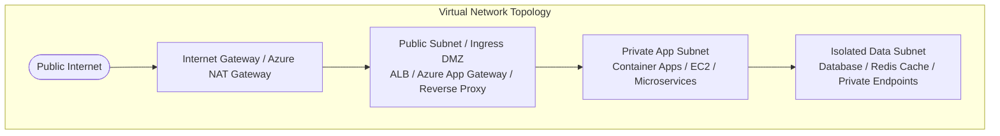
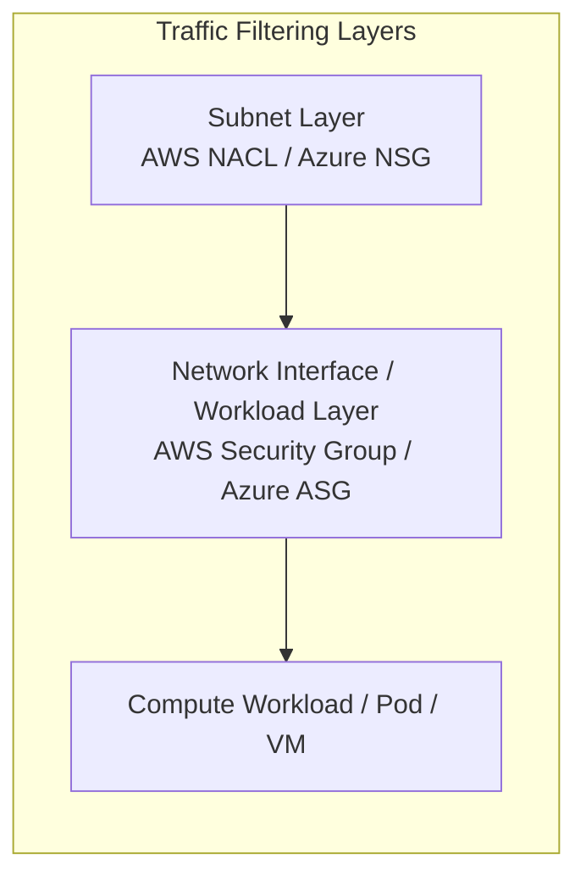
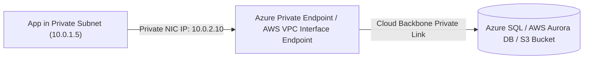
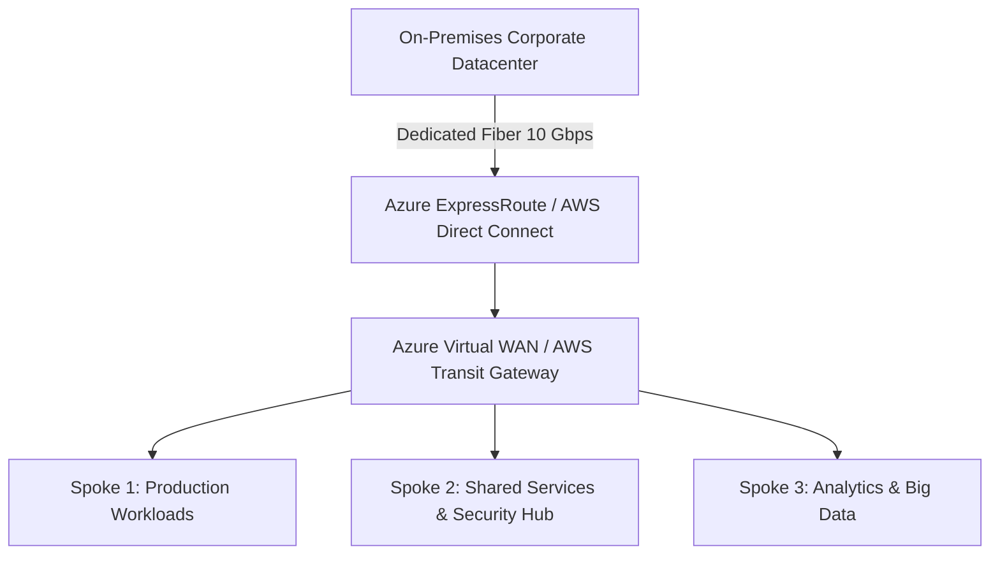

# Module 04: Cloud Networking, VNet, VPC & Hybrid Connectivity

Cloud networking establishes private, isolated virtual networks that safeguard compute resources and enterprise databases against unauthorized public internet exposure. This module explores **Azure Virtual Network (VNet)** and **AWS Virtual Private Cloud (VPC)**, private link architectures, and hybrid cloud connectivity.

---

## 🌐 1. Virtual Networks: Azure VNet vs. AWS VPC

Both Azure and AWS enable customers to define RFC 1918 private IPv4/IPv6 address spaces partitioned into dedicated subnets across Availability Zones.

### Network Component Comparison

| Network Construct | Azure Equivalent | AWS Equivalent | Purpose |
| :--- | :--- | :--- | :--- |
| **Virtual Network** | Azure Virtual Network (VNet) | Amazon VPC | Isolated software-defined network boundary |
| **Subnet Scope** | Spans all Availability Zones in a Region | Bound to a single specific Availability Zone (AZ) | Sub-allocation of CIDR address blocks |
| **Default Inbound** | Blocked by default from internet | Blocked unless public IP + IGW attached | Zero-trust perimeter |
| **Egress to Internet** | Azure NAT Gateway / Default Outbound | AWS NAT Gateway (deployed in Public Subnet) | Private subnet outbound access for OS updates |
| **VNet/VPC Peering** | VNet Peering (Global / Regional) | VPC Peering | Non-transitive private routing between virtual networks |

---

## 🛡️ 2. Security Groups: Stateful NSGs vs. Stateless NACLs

Enforcing firewall rules at the subnet and network interface (NIC) layer prevents lateral movement during a security breach.

### Comparison Matrix

| Feature | AWS Security Group | AWS Network ACL (NACL) | Azure Network Security Group (NSG) |
| :--- | :--- | :--- | :--- |
| **Layer of Operation** | Instance / ENI (NIC) layer | Subnet boundary layer | Subnet AND / OR NIC layer |
| **State Nature** | **Stateful** (Return traffic automatically permitted) | **Stateless** (Must explicitly permit inbound & outbound ports) | **Stateful** (Return traffic automatically permitted) |
| **Rule Evaluation** | All rules evaluated together; `ALLOW` rules only | Numbered order (1-32766); first match wins (`ALLOW` / `DENY`) | Priority order (100-4096); first match wins (`ALLOW` / `DENY`) |
| **Application Security Groups (ASGs)** | Not applicable (Uses security group references) | Not applicable | Logical workload grouping without hardcoding IP addresses |

---

## 🔒 3. Private Link & Private Endpoints: Eliminating Public IP Exposure

Enterprise best practices dictate that databases (SQL/PostgreSQL), cache clusters, and Key Vaults must NEVER have public IP addresses or route traffic over the public internet.

### Key Advantages of Private Link

1. **No Public IP Address**: The PaaS service receives a dedicated private IP inside your subnet (e.g., `10.0.2.10`).
2. **Private DNS Zone Resolution**: Custom DNS zones (e.g., `privatelink.database.windows.net`) seamlessly resolve the FQDN to the private IP address.
3. **Data Exfiltration Prevention**: Traffic is strictly confined to the targeted resource instance; compromised credentials cannot be used to siphon data to unauthorized accounts.

---

## 🌉 4. Hybrid Cloud & Multi-Region Transit Architectures

Enterprise applications frequently require high-bandwidth, low-latency private connectivity between on-premises datacenters and multiple cloud regions.

### Dedicated Connectivity: ExpressRoute vs. Direct Connect

- **Azure ExpressRoute**: Bypasses the public internet using private layer-3 circuits provisioned by telecom connectivity providers (Equinix, AT&T). Supports Private Peering (VNets) and Microsoft Peering (Office 365, Azure PaaS).
- **AWS Direct Connect (DX)**: Establishes a dedicated physical 1 Gbps / 10 Gbps / 100 Gbps network link into an AWS Direct Connect location linked to a Direct Connect Gateway.
- **Hub-and-Spoke Mesh with Transit Gateways**:
  - **Azure Virtual WAN**: Centralized hub orchestrating branch-to-Azure, user VPN, ExpressRoute, and VNet-to-VNet routing.
  - **AWS Transit Gateway (TGW)**: Acts as a central cloud router connecting thousands of VPCs and on-premises networks through a single gateway hub.
