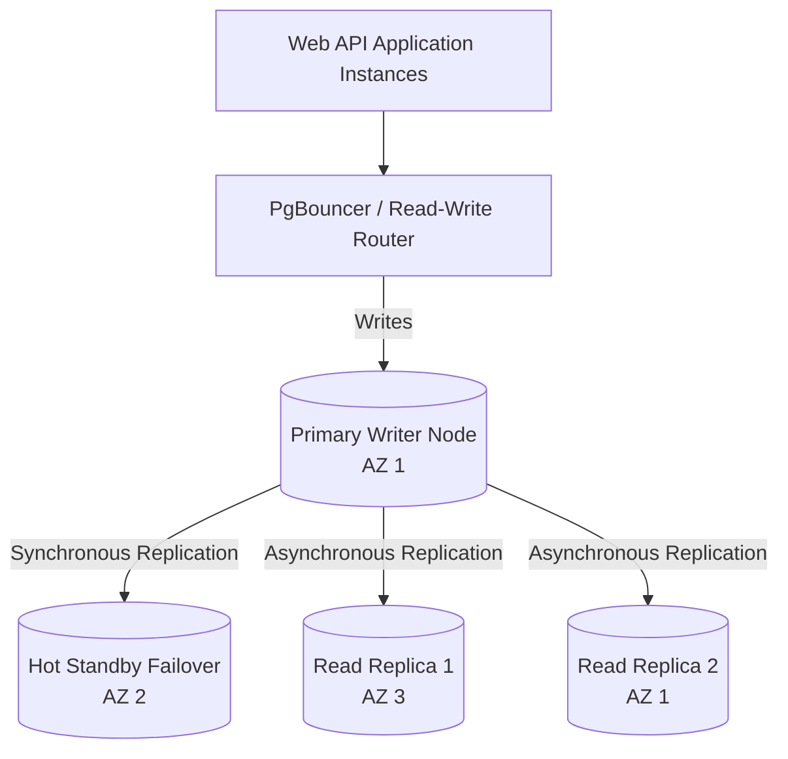
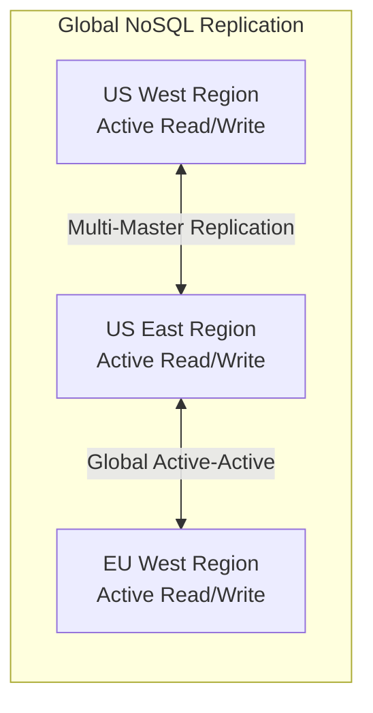
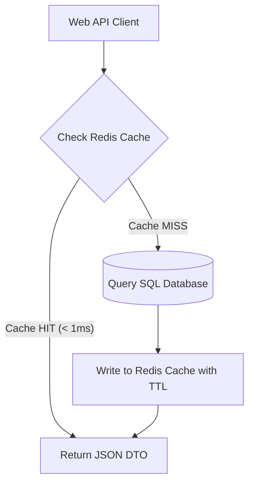

# Module 05: Managed Databases & Distributed Caching

Enterprise applications rely on managed database services to offload routine administrative tasks (automated backups, OS patching, point-in-time recovery, high-availability failover) while guaranteeing high throughput and low latency. This module compares **Relational (SQL)**, **NoSQL**, and **In-Memory Caching** engines across Azure and AWS.

---

## 🗄️ 1. Relational Databases: Azure SQL & PostgreSQL vs. AWS RDS & Aurora

Relational databases remain the primary engine for ACID-compliant transactional business domains.



### Managed Relational Database Matrix

| Feature | Azure SQL Database / Flexible PostgreSQL | Amazon RDS / Amazon Aurora |
| :--- | :--- | :--- |
| **Engines Supported** | Microsoft SQL Server, PostgreSQL, MySQL | Aurora (PostgreSQL/MySQL compatible), Postgres, MySQL, Oracle, SQL Server |
| **Aurora Architecture** | Distributed log-based storage tier; 6 copies replicated across 3 AZs | Shared distributed storage; sub-second failover, auto-scaling up to 128 TB |
| **Serverless Auto-Pause** | Azure SQL Serverless (auto-pauses when idle, scales vCores) | Aurora Serverless v2 (scales instantly in fine-grained ACUs without pausing) |
| **Automated Failover** | Zone Redundant configuration (< 30s automatic failover) | Multi-AZ with automated DNS failover (< 30s for RDS; < 15s for Aurora) |
| **Backup & Recovery** | Automated geo-redundant backups, 1-35 days PITR | Automated snapshots & transaction log backups, 1-35 days PITR |

---

## ⚡ 2. EF Core 10 Connection Resiliency in .NET

Cloud networks and managed database failovers cause transient connection drops. EF Core must be configured with execution strategies to handle transient errors automatically.

```csharp
using Microsoft.EntityFrameworkCore;
using Microsoft.Extensions.DependencyInjection;

public static class DatabaseServiceExtensions
{
    public static IServiceCollection AddCloudDatabaseContext(
        this IServiceCollection services, 
        string connectionString)
    {
        services.AddDbContext<ApplicationDbContext>(options =>
        {
            options.UseSqlServer(connectionString, sqlOptions =>
            {
                // Enable automatic retries for transient Azure SQL errors (error codes 4060, 40197, 40501, 49918)
                sqlOptions.EnableRetryOnFailure(
                    maxRetryCount: 5,
                    maxRetryDelay: TimeSpan.FromSeconds(30),
                    errorNumbersToAdd: null);
                
                sqlOptions.CommandTimeout(60);
                sqlOptions.MigrationsHistoryTable("__EFMigrationsHistory", "schema_clean");
            });
        });

        return services;
    }
}
```

---

## 🌐 3. Distributed NoSQL at Global Scale: Azure Cosmos DB vs. AWS DynamoDB

For ultra-high-throughput, horizontal write scaling, and globally distributed datasets, NoSQL databases provide single-digit millisecond latency at any scale.



### NoSQL Engine Comparison

| Architectural Aspect | Azure Cosmos DB | Amazon DynamoDB |
| :--- | :--- | :--- |
| **Primary Data Model** | Multi-Model (Core SQL API, MongoDB, Cassandra, Gremlin, Table) | Document & Key-Value (DynamoDB API) |
| **Capacity Unit** | **Request Units (RU/s)** (1 RU = reading a 1 KB item in 1 ms) | **Read/Write Capacity Units (RCUs/WCUs)** or On-Demand |
| **Consistency Levels** | 5 Tunable Levels: *Strong, Bounded Staleness, Session, Consistent Prefix, Eventual* | 2 Levels: *Strongly Consistent* ($2\times$ cost) vs. *Eventually Consistent* |
| **Global Replication** | Turnkey multi-region replication with **Multi-Master Active-Active writes** | DynamoDB Global Tables (Active-Active multi-region replication) |
| **Change Data Capture** | Cosmos DB Change Feed (triggers Azure Functions) | DynamoDB Streams / Kinesis Data Streams (triggers Lambda) |

---

## 🚀 4. Distributed Caching: Azure Managed Redis vs. AWS ElastiCache

In-memory caching absorbs heavy database read loads and coordinates distributed locks across microservices.



### Enterprise Caching Configurations

1. **Redis Cluster Mode**: Partitions data across multiple primary shards with replication replicas, supporting terabytes of in-memory data and millions of IOPS.
2. **Persistence & High Availability**:
   - Azure Managed Redis (Enterprise) with active-active geo-replication.
   - AWS ElastiCache for Redis (Valkey / Redis OSS) with Multi-AZ automated failover and read replicas.
3. **Distributed Locks**: Powering the `[DistributedLock]` attribute using Redlock or single-instance atomic Lua scripts for preventing race conditions.
