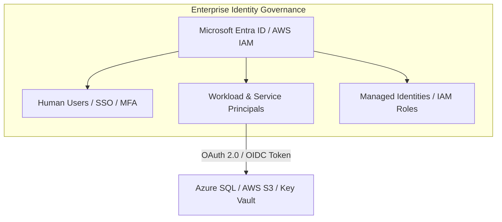
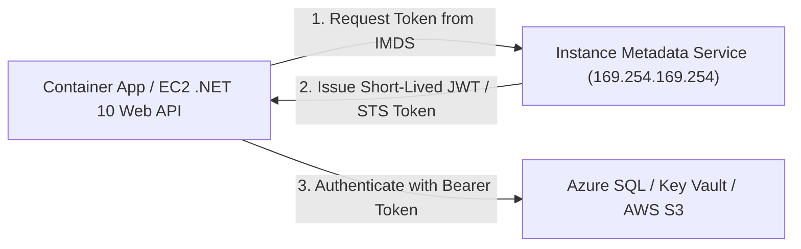
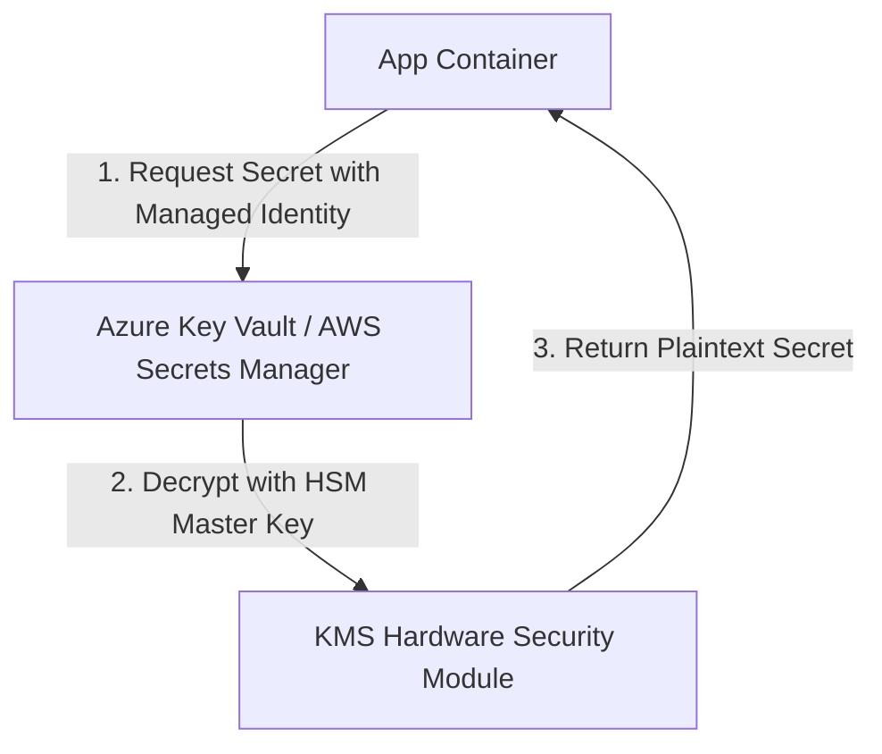
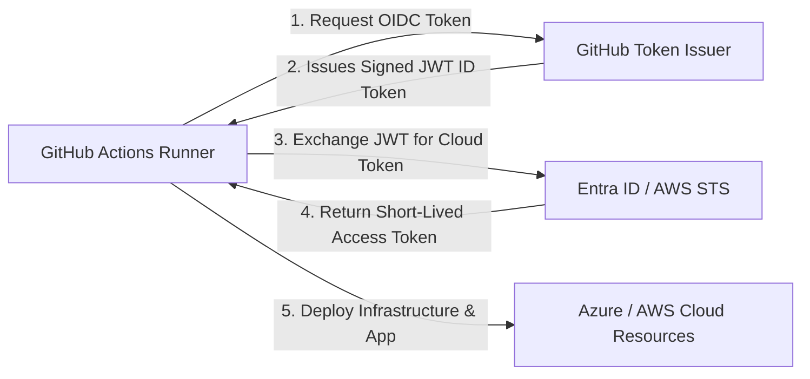

# Module 06: Cloud Identity, IAM, Entra ID & Zero Trust

Hardcoded connection strings and static API keys in source control are among the leading causes of enterprise security breaches. This module examines modern **Zero Trust Cloud Identity**, **Microsoft Entra ID**, **AWS IAM**, **Managed Identities**, and passwordless application security in .NET 10.

---

## 🔐 1. Identity Paradigms: Microsoft Entra ID vs. AWS IAM

Identity serves as the primary security perimeter in modern cloud architecture:



### Identity System Comparison

| Feature | Microsoft Entra ID | AWS Identity and Access Management (IAM) |
| :--- | :--- | :--- |
| **Scope** | Global Tenant-wide Identity Provider (IdP) for Azure, M365, & 3rd-party SaaS | Per-Account Identity service within AWS Organizations |
| **Compute Identity** | **Managed Identities** (System-Assigned & User-Assigned) | **IAM Roles** & Instance Profiles |
| **Policy Language** | Azure RBAC (Declarative Role Assignments & Actions) | IAM JSON Policies (`Effect`, `Action`, `Resource`, `Condition`) |
| **Conditional Access** | Entra ID Conditional Access (MFA, Device Compliance, IP Risk) | IAM Policy Conditions (e.g., `aws:SourceIp`, `aws:PrincipalArn`) |
| **CI/CD Federation** | Workload Identity Federation (OIDC with GitHub Actions) | OpenID Connect (OIDC) Identity Provider federation |

---

## 🛡️ 2. Passwordless Application Security with Managed Identities

With **Managed Identities** in Azure and **IAM Roles for EC2/ECS/EKS** in AWS, the cloud platform automatically manages token acquisition and rotation. Applications do not store passwords or client secrets.



### .NET 10 Passwordless Implementation with `DefaultAzureCredential`

```csharp
using Azure.Identity;
using Azure.Security.KeyVault.Secrets;
using Microsoft.Data.SqlClient;
using Microsoft.Extensions.DependencyInjection;

public static class CloudSecurityExtensions
{
    public static void ConfigureCloudServices(this IServiceCollection services, string keyVaultUri, string sqlServerFqdn)
    {
        // DefaultAzureCredential automatically probes:
        // 1. Environment variables
        // 2. Workload Identity (Kubernetes / ACA)
        // 3. Managed Identity (Azure VM / Container App)
        // 4. Azure CLI / Visual Studio (local developer machine)
        var credential = new DefaultAzureCredential();

        // 1. Connect to Azure Key Vault without storing credentials
        var secretClient = new SecretClient(new Uri(keyVaultUri), credential);
        services.AddSingleton(secretClient);

        // 2. Connect to Azure SQL using Entra ID Access Token
        var connectionStringBuilder = new SqlConnectionStringBuilder
        {
            DataSource = sqlServerFqdn,
            InitialCatalog = "CleanArchDb",
            Authentication = SqlAuthenticationMethod.ActiveDirectoryDefault,
            Encrypt = true,
            TrustServerCertificate = false
        };

        services.AddSingleton(new SqlConnection(connectionStringBuilder.ConnectionString));
    }
}
```

---

## 🔑 3. Enterprise Secrets Management: Key Vault vs. Secrets Manager

When applications require external third-party API keys (e.g., Stripe, SendGrid, Twilio), secrets management services provide envelope encryption and audit logging.



### Secrets Management Comparison

| Capability | Azure Key Vault | AWS Secrets Manager / Parameter Store |
| :--- | :--- | :--- |
| **Object Types** | Secrets (strings), Keys (RSA/ECC for signing/KMS), Certificates (X.509) | Secrets (JSON payloads) / Parameters (Standard & SecureString) |
| **Hardware Protection** | FIPS 140-2 Level 2 (Standard) / Level 3 (Premium HSM) | FIPS 140-2 Level 3 Hardware Security Modules (HSMs) |
| **Automatic Rotation** | Event Grid notifications ➔ Azure Functions rotation | Built-in Lambda function templates for RDS/Aurora/Redshift rotation |
| **Accidental Deletion** | **Soft Delete** & **Purge Protection** (Prevents permanent destruction) | Scheduled deletion window (7 to 30 days recovery period) |

---

## 🚀 4. Zero-Trust CI/CD: Passwordless GitHub Actions via OIDC

Eliminating static cloud credentials in GitHub Secrets prevents credential harvesting. GitHub Actions assumes a cloud role directly using OpenID Connect (OIDC).



### GitHub Actions OIDC Workflow Step

```yaml
permissions:
  id-token: write # Required for requesting OIDC JWT
  contents: read

jobs:
  deploy-to-azure:
    runs-on: ubuntu-latest
    steps:
      - name: Azure Login via OIDC
        uses: azure/login@v2
        with:
          client-id: ${{ secrets.AZURE_CLIENT_ID }}
          tenant-id: ${{ secrets.AZURE_TENANT_ID }}
          subscription-id: ${{ secrets.AZURE_SUBSCRIPTION_ID }}

      - name: Deploy Azure Container Apps
        run: |
          az containerapp update \
            --name cleanarch-api \
            --resource-group rg-cleanarch-prod \
            --image ghcr.io/hoangtran1411/clean-api:latest
```
