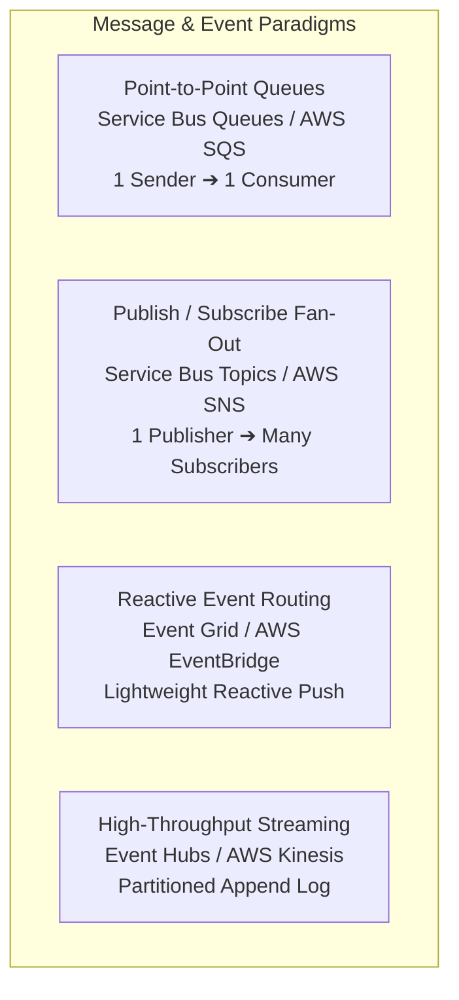
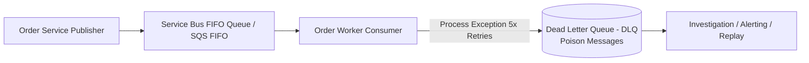
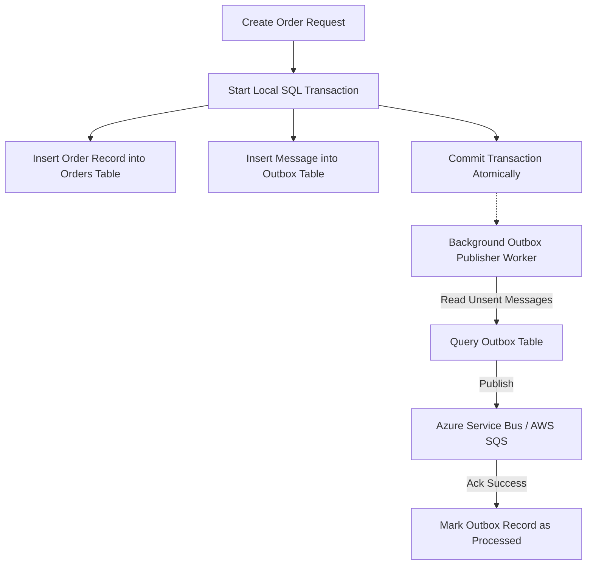

# Module 07: Cloud Messaging, Event-Driven Architecture & Queues

Asynchronous messaging decouples microservices, buffers transient load spikes, and guarantees reliable eventual consistency across distributed business workflows. This module contrasts **Azure Service Bus**, **AWS SQS / SNS**, **Event Grid / EventBridge**, and high-throughput streaming engines.

---

## 📨 1. Cloud Messaging Hierarchy: Azure vs. AWS

Cloud platforms provide three distinct messaging paradigms:



### Messaging Matrix Comparison

| Requirement | Azure Service | AWS Service | Key Characteristics |
| :--- | :--- | :--- | :--- |
| **Point-to-Point Queue** | Azure Service Bus (Queues) | Amazon SQS (Standard / FIFO) | Competing consumers, message locks, delivery retries |
| **Pub/Sub Fan-Out** | Azure Service Bus (Topics & Subscriptions) | Amazon SNS (Simple Notification Service) | 1-to-many fanout, topic filters, HTTP/Email/Queue subscribers |
| **Event Routing (EDA)** | Azure Event Grid | Amazon EventBridge | Reactive serverless push, schema registry, SaaS integrations |
| **Telemetry Streaming** | Azure Event Hubs | Amazon Kinesis Data Streams | Millions of events/sec, partitioned replay log, AMQP/Kafka API |

---

## ⚡ 2. Enterprise Queue Patterns: Standard vs. FIFO & Dead-Lettering

Enterprise financial workflows (e.g., payment processing, order invoicing) require strict message ordering and at-least-once delivery guarantees.



### Standard vs. FIFO Queues

1. **Standard Queues**:
   - **Throughput**: Unlimited messages per second.
   - **Ordering**: Best-effort ordering (messages may arrive out of order).
   - **Delivery**: At-least-once delivery (duplicates possible; consumers must be idempotent).
2. **FIFO Queues (First-In, First-Out)**:
   - **Throughput**: High throughput (partitioned via `MessageGroupId` / `SessionId`).
   - **Ordering**: Strictly preserved order within a message group.
   - **Delivery**: Exactly-once processing with deduplication IDs.
3. **Dead-Letter Queues (DLQ)**:
   - When a consumer repeatedly fails to process a poison message (exceeding `MaxDeliveryCount`), the broker moves the message to the DLQ to prevent blocking the queue.

---

## 💻 3. Publishing & Consuming Messages in .NET 10

Using the official Azure SDK to produce and consume messages with automatic retry policies:

### Azure Service Bus Producer & Consumer in C# (.NET 10)

```csharp
using System.Text.Json;
using Azure.Messaging.ServiceBus;

public record OrderPlacedEvent(Guid OrderId, decimal Amount, string CustomerEmail, DateTime CreatedAtUtc);

public class OrderEventService
{
    private readonly ServiceBusClient _client;

    public OrderEventService(ServiceBusClient client)
    {
        _client = client;
    }

    public async Task PublishOrderPlacedAsync(OrderPlacedEvent orderEvent, string queueName)
    {
        var sender = _client.CreateSender(queueName);
        var jsonPayload = JsonSerializer.Serialize(orderEvent);

        var message = new ServiceBusMessage(jsonPayload)
        {
            ContentType = "application/json",
            MessageId = orderEvent.OrderId.ToString(), // Deduplication key
            Subject = "OrderPlaced"
        };

        await sender.SendMessageAsync(message);
    }

    public async Task StartProcessingAsync(string queueName, Func<OrderPlacedEvent, Task> onProcess)
    {
        var processor = _client.CreateProcessor(queueName, new ServiceBusProcessorOptions
        {
            MaxConcurrentCalls = 8,
            AutoCompleteMessages = false // Explicit acknowledgment
        });

        processor.ProcessMessageAsync += async args =>
        {
            var body = args.Message.Body.ToString();
            var payload = JsonSerializer.Deserialize<OrderPlacedEvent>(body);

            if (payload != null)
            {
                await onProcess(payload);
                await args.CompleteMessageAsync(args.Message); // Settle message
            }
        };

        processor.ProcessErrorAsync += args =>
        {
            Console.WriteLine($"ServiceBus error: {args.Exception.Message}");
            return Task.CompletedTask;
        };

        await processor.StartProcessingAsync();
    }
}
```

---

## 🏛️ 4. The Transactional Outbox Pattern in Cloud Messaging

Dual-write operations (writing to a SQL database and publishing to a cloud message queue in the same HTTP request) introduce inconsistency if the network fails midway.



### Advantages of Transactional Outbox

1. **Atomic Guarantees**: Order data and outbox messages are committed within a single local database ACID transaction.
2. **Zero Message Loss**: If the message broker is temporarily unreachable, the outbox table buffers events until the broker recovers.
3. **Idempotent Delivery**: Consumers verify message IDs to prevent duplicate processing.
