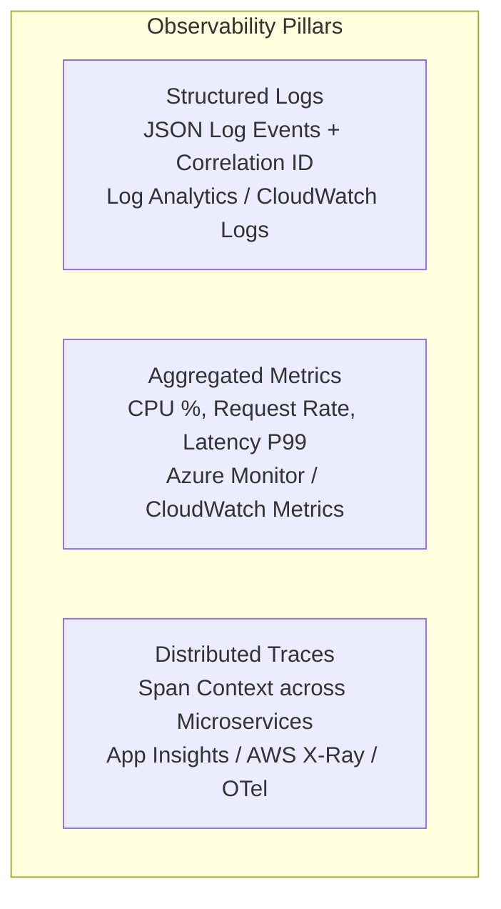
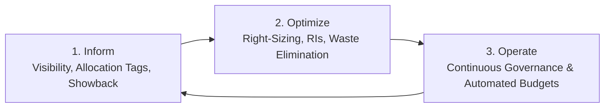

# Module 08: Cloud Observability, Monitoring & FinOps

Observability provides deep runtime visibility into distributed cloud systems, enabling engineering teams to detect bottlenecks, isolate root causes, and optimize cloud expenditures. This module explores **Azure Monitor**, **Application Insights**, **Amazon CloudWatch**, **OpenTelemetry (OTel)**, and **FinOps Cost Governance**.

---

## 📊 1. The 3 Pillars of Cloud Observability

Distributed architectures require three interconnected telemetry signals:



### Telemetry Comparison: Azure vs. AWS

| Telemetry Pillar | Azure Observability Stack | AWS Observability Stack |
| :--- | :--- | :--- |
| **Log Management** | Azure Log Analytics (Kusto Query Language - KQL) | Amazon CloudWatch Logs & CloudWatch Insights |
| **Application Performance Monitoring (APM)** | Application Insights (Live Metrics, Application Map) | Amazon CloudWatch Application Signals / AWS X-Ray |
| **Metrics & Dashboards** | Azure Monitor Metrics & Azure Managed Grafana | CloudWatch Metrics & Amazon Managed Grafana |
| **OpenTelemetry Standard** | Native OTLP ingestion in Azure Monitor | AWS Distro for OpenTelemetry (ADOT) |
| **Alerting** | Metric alerts, Log query alerts, Action Groups | CloudWatch Alarms & Amazon SNS notifications |

---

## ⚡ 2. OpenTelemetry (.NET 10) & Azure / AWS Exporters

In modern .NET 10 applications, vendor-neutral **OpenTelemetry** instrumentation streams logs, traces, and metrics to any cloud platform via OTLP exporters.

```csharp
using Azure.Monitor.OpenTelemetry.AspNetCore;
using Microsoft.Extensions.DependencyInjection;
using Microsoft.Extensions.Hosting;
using OpenTelemetry.Metrics;
using OpenTelemetry.Trace;

public static class ObservabilityExtensions
{
    public static void AddCloudObservability(this IHostApplicationBuilder builder)
    {
        // 1. Configure OpenTelemetry with Azure Monitor
        if (!string.IsNullOrEmpty(builder.Configuration["APPLICATIONINSIGHTS_CONNECTION_STRING"]))
        {
            builder.Services.AddOpenTelemetry()
                .UseAzureMonitor(); // Auto-instruments ASP.NET Core, HttpClient, SQL, and OTel Tracing
        }

        // 2. Configure Vendor-Neutral OTLP Exporter (for AWS ADOT / Jaeger / Aspire)
        builder.Services.AddOpenTelemetry()
            .WithTracing(tracing =>
            {
                tracing.AddAspNetCoreInstrumentation()
                       .AddHttpClientInstrumentation()
                       .AddEntityFrameworkCoreInstrumentation()
                       .AddOtlpExporter();
            })
            .WithMetrics(metrics =>
            {
                metrics.AddAspNetCoreInstrumentation()
                       .AddHttpClientInstrumentation()
                       .AddRuntimeInstrumentation()
                       .AddOtlpExporter();
            });
    }
}
```

---

## 🔍 3. Diagnostic Queries: KQL (Azure) vs. CloudWatch Insights (AWS)

Investigating production incidents requires querying petabytes of distributed log streams within seconds.

### KQL Query (Azure Log Analytics) for 5xx API Errors

```kql
requests
| where timestamp > ago(1h)
| where resultCode >= 500
| summarize FailureCount = count(), LatencyP95 = percentile(duration, 95) by operation_Name, resultCode
| order by FailureCount desc
```

### CloudWatch Insights Query (AWS) for Slow API Requests

```text
fields @timestamp, @message, duration
| filter duration > 1000
| sort duration desc
| limit 50
```

---

## 💰 4. Cloud FinOps & Cost Governance

FinOps (Financial Operations) bridges engineering, finance, and operations to maximize cloud business value and eliminate wasteful spending.



### 5 Essential Cloud Cost Optimization Strategies

1. **Enforce Mandatory Cost Allocation Tags**:
   - Every resource must have `Environment` (`prod`/`dev`), `CostCenter`, and `Owner` tags to track spending by team.
2. **Right-Sizing Compute & Memory**:
   - Profile historical CPU and RAM utilization; downgrade over-provisioned VMs and container memory allocations.
3. **Storage Lifecycle Tiering**:
   - Automatically transition blobs/objects from Hot to Cool after 30 days, Cold after 90 days, and Archive after 180 days.
4. **Automated Budget Alerts & Action Groups**:
   - Trigger email notifications when forecasted monthly spending exceeds 80%, and automatically scale down non-production resources at 100%.
5. **Idle Resource Cleanup**:
   - Detect and delete unattached disks (EBS/Managed Disks), orphan IP addresses, and idle load balancers.
