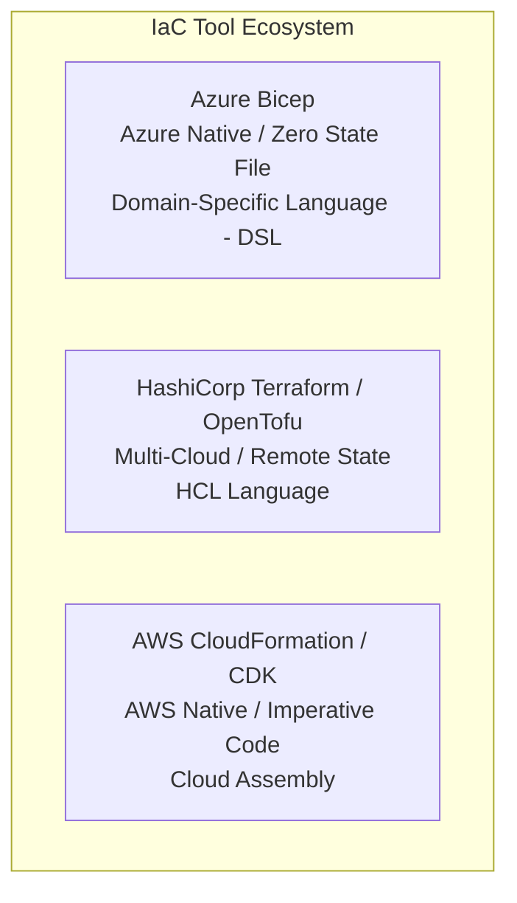
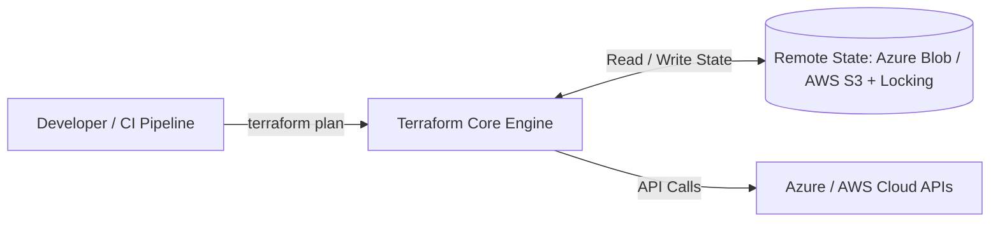

# Module 09: Infrastructure as Code (IaC): Bicep, Terraform & CloudFormation

Infrastructure as Code (IaC) treats cloud infrastructure with the same rigor as application source code—enabling version control, automated testing, peer review, and reproducible deployments. This module compares **Azure Bicep**, **HashiCorp Terraform**, and **AWS CloudFormation / CDK**.

---

## 🏗️ 1. Declarative IaC Tool Comparison



### IaC Matrix Comparison

| Characteristic | Azure Bicep | HashiCorp Terraform | AWS CloudFormation / CDK |
| :--- | :--- | :--- | :--- |
| **Cloud Target** | Microsoft Azure | Multi-Cloud (Azure, AWS, GCP, Cloudflare) | Amazon Web Services (AWS) |
| **State Management** | **Stateless** (Azure ARM engine queries live state) | **Stateful** (Requires remote state file + state locking) | **Stateful** (Managed by AWS CloudFormation engine) |
| **Syntax** | Clean DSL (Compiles to JSON ARM templates) | HashiCorp Configuration Language (HCL) | JSON/YAML or imperative TypeScript/C# (CDK) |
| **Drift Detection** | What-If Analysis (`az deployment ... --what-if`) | `terraform plan` / `terraform refresh` | CloudFormation Drift Detection |
| **Day-0 Support** | Immediate support for all Azure preview features | Depends on AzureRM provider releases | Immediate support for all AWS features |

---

## ⚡ 2. Azure Bicep: Provisioning Clean Architecture Stack

Azure Bicep offers concise syntax, type safety, and automatic dependency resolution for Azure deployments.

### `main.bicep` for Azure Container Apps & SQL

```bicep
targetScope = 'resourceGroup'

@description('Environment name prefix')
param envName string = 'prod'

@description('Primary deployment location')
param location string = resourceGroup().location

// 1. Create Azure Log Analytics Workspace
resource logAnalytics 'Microsoft.OperationalInsights/workspaces@2023-09-01' = {
  name: 'log-cleanarch-${envName}'
  location: location
  properties: {
    sku: { name: 'PerGB2018' }
    retentionInDays: 30
  }
}

// 2. Create Azure Container Apps Managed Environment
resource containerEnv 'Microsoft.App/managedEnvironments@2024-03-01' = {
  name: 'cae-cleanarch-${envName}'
  location: location
  properties: {
    appLogsConfiguration: {
      destination: 'log-analytics'
      logAnalyticsConfiguration: {
        customerId: logAnalytics.properties.customerId
        sharedKey: logAnalytics.listKeys().primarySharedKey
      }
    }
  }
}

// 3. Create Azure Container App
resource containerApp 'Microsoft.App/containerApps@2024-03-01' = {
  name: 'app-cleanarch-api-${envName}'
  location: location
  identity: {
    type: 'SystemAssigned'
  }
  properties: {
    managedEnvironmentId: containerEnv.id
    configuration: {
      ingress: {
        external: true
        targetPort: 8080
        transport: 'auto'
      }
    }
    template: {
      containers: [
        {
          name: 'cleanarch-api'
          image: 'ghcr.io/hoangtran1411/clean-api:latest'
          resources: {
            cpu: json('0.5')
            memory: '1.0Gi'
          }
        }
      ]
      scale: {
        minReplicas: 1
        maxReplicas: 10
      }
    }
  }
}

output apiUrl string = containerApp.properties.configuration.ingress.fqdn
```

---

## 🌐 3. Multi-Cloud HashiCorp Terraform

Terraform manages heterogeneous infrastructure across cloud providers using declarative HCL blocks and state backends.



### `main.tf` with Remote Backend & AWS S3 Bucket

```hcl
terraform {
  required_version = ">= 1.8.0"
  required_providers {
    aws = {
      source  = "hashicorp/aws"
      version = "~> 5.0"
    }
  }
  backend "s3" {
    bucket         = "tfstate-enterprise-cleanarch"
    key            = "prod/terraform.tfstate"
    region         = "us-east-1"
    dynamodb_table = "terraform-state-lock"
    encrypt        = true
  }
}

provider "aws" {
  region = var.aws_region
  default_tags {
    tags = {
      Project     = "CleanArchitecture"
      Environment = var.environment
      ManagedBy   = "Terraform"
    }
  }
}

resource "aws_s3_bucket" "app_storage" {
  bucket        = "cleanarch-storage-${var.environment}"
  force_destroy = false
}

resource "aws_s3_bucket_versioning" "versioning" {
  bucket = aws_s3_bucket.app_storage.id
  versioning_configuration {
    status = "Enabled"
  }
}
```

---

## 🚀 4. Automated IaC CI/CD Pipeline Best Practices

1. **State File Protection**: Never commit `.tfstate` files to Git. Encrypt state files in S3/Blob storage with strict IAM access policies.
2. **Automated Pull Request Checks**: Run `terraform plan` or `az deployment group what-if` on every pull request to preview changes before merging.
3. **Immutability & Zero Manual Edits**: Disable manual portal edits in production. Any infrastructure modification must originate from version-controlled IaC code.
