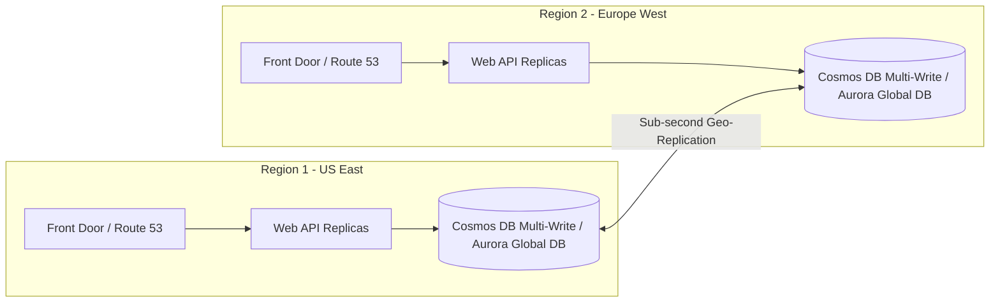
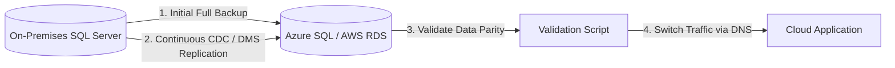

# Module 10: Top 30 Cloud (Azure & AWS) Interview Questions & Deep Dives

This module provides 30 in-depth cloud architecture and engineering interview questions categorized across Foundational (Junior), Intermediate (Mid-Level), and Advanced (Senior/Architect) levels.

---

## 🟢 Part 1: Foundational & Junior Questions (1–10)

### 1. What is the fundamental difference between IaaS, PaaS, and SaaS?

- **IaaS (Infrastructure as a Service)**: The cloud provider manages the physical hardware, datacenter, and hypervisor. You manage the guest operating system, runtime, networking configuration, and application code (e.g., Azure VM, AWS EC2).
- **PaaS (Platform as a Service)**: The provider manages the OS, patching, scaling, and runtime environment. You focus strictly on deploying application code and configuring databases/integrations (e.g., Azure Container Apps, AWS App Runner).
- **SaaS (Software as a Service)**: A complete, fully managed software application consumed over the web (e.g., Microsoft 365, Salesforce).

---

### 2. What is the difference between a Cloud Region and an Availability Zone (AZ)?

- **Region**: A geographical area containing one or more datacenters connected via a dedicated low-latency private network (e.g., `East US`, `us-east-1`).
- **Availability Zone (AZ)**: One or more discrete datacenters within a Region with independent power, cooling, and networking. Deploying across multiple AZs ensures high availability ($99.99\%$) even if an entire datacenter fails.

---

### 3. How do Azure Managed Identities and AWS IAM Roles eliminate credentials from code?

Instead of storing database passwords or API keys in configuration files:

1. The cloud platform injects a secure local endpoint (Instance Metadata Service - `http://169.254.169.254`).
2. The application requests a short-lived OAuth token from IMDS.
3. The token is passed as a Bearer token to services like Azure SQL, Key Vault, AWS S3, or DynamoDB without needing static passwords.

---

### 4. What are the key differences between Azure Blob Storage and AWS S3?

| Aspect | Azure Blob Storage | AWS S3 |
| :--- | :--- | :--- |
| **Top Container** | Storage Account | S3 Bucket (Globally unique namespace) |
| **Hierarchy** | Flat by default; ADLS Gen2 Hierarchical Namespace optional | Flat; prefixes simulate directory paths |
| **Access Tiers** | Hot, Cool, Cold, Archive | S3 Standard, S3 Standard-IA, S3 Glacier, Deep Archive |

---

### 5. What is the purpose of a Network Security Group (NSG) in Azure and a Security Group in AWS?

Both act as virtual firewalls controlling inbound and outbound traffic at the network interface (NIC) or instance level. They are **stateful**—meaning if an inbound request is permitted on port 443, the response traffic is automatically allowed outbound regardless of outbound rules.

---

### 6. What is the difference between Vertical Scaling (Scale-Up) and Horizontal Scaling (Scale-Out)?

- **Scale-Up (Vertical)**: Increasing CPU, RAM, or IOPS on an existing instance (e.g., moving from 4 vCPUs to 16 vCPUs). Incurs brief downtime and has physical hardware limits.
- **Scale-Out (Horizontal)**: Adding more independent stateless application instances behind a load balancer (e.g., scaling from 2 to 20 container replicas). Provides elasticity and high fault tolerance.

---

### 7. What is the difference between Azure Service Bus Queues and Topics?

- **Queues**: 1-to-1 point-to-point delivery. Each message is processed by exactly one competing consumer.
- **Topics & Subscriptions**: 1-to-many publish/subscribe fan-out. Each subscription can receive a copy of the message or apply SQL-like filter rules.

---

### 8. What is the difference between Azure Key Vault and AWS Secrets Manager?

- **Azure Key Vault**: Stores Secrets (text strings), Keys (cryptographic RSA/ECC keys for HSM envelope encryption), and Certificates (X.509 SSL).
- **AWS Secrets Manager**: Specialized for storing database credentials and API keys with built-in automated rotation scripts via AWS Lambda.

---

### 9. What is the purpose of Infrastructure as Code (IaC)?

IaC replaces manual portal clicks with version-controlled, declarative templates (Bicep, Terraform, CloudFormation). This prevents configuration drift, enables code review for infrastructure changes, and guarantees reproducible environments (Dev, Staging, Prod).

---

### 10. What is the difference between CloudWatch Metrics and CloudWatch Logs in AWS?

- **Metrics**: Numerical time-series data aggregated over intervals (e.g., CPU utilization %, request count, latency) used for graphs and auto-scaling alarms.
- **Logs**: Textual/JSON event streams generated by applications and operating systems (e.g., stack traces, HTTP access logs).

---

## 🟡 Part 2: Intermediate & Mid-Level Questions (11–20)

### 11. When would you choose Azure Container Apps (ACA) over Azure Kubernetes Service (AKS)?

- **Choose ACA**: When building microservices, background queue workers, and Web APIs where you want serverless scale-to-zero, KEDA event-driven autoscaling, and Dapr integration without the overhead of managing Kubernetes control planes, cluster upgrades, or ingress controllers.
- **Choose AKS**: When you require full control over the Kubernetes API, custom CRDs, service mesh customization (Istio/Linkerd), daemonsets, or complex network plugins.

---

### 12. How does AWS SQS Standard differ from SQS FIFO?

| Feature | SQS Standard | SQS FIFO |
| :--- | :--- | :--- |
| **Throughput** | Unlimited transactions/sec | Up to 3,000 msgs/sec with batching (or 70k with high throughput mode) |
| **Ordering** | Best-effort (can be delivered out of order) | Strictly First-In-First-Out within a `MessageGroupId` |
| **Duplicates** | At-least-once delivery (duplicates possible) | Exactly-once processing with 5-minute deduplication window |

---

### 13. How do Azure Private Endpoints differ from Service Endpoints?

- **Service Endpoints**: Optimizes routing by keeping traffic on the Azure backbone, but the PaaS resource still retains a public IP address.
- **Private Endpoints (Private Link)**: Assigns a private IP from your VNet directly to the PaaS resource, completely disabling public internet routing and preventing data exfiltration.

---

### 14. What are Cosmos DB Request Units (RUs) and how do they scale?

A **Request Unit (RU)** is a normalized measure of compute, memory, and IOPS. Reading a 1 KB item via point-read costs exactly 1 RU. Cosmos DB supports:

- **Provisioned Throughput**: Pre-allocated RUs (e.g., 4,000 RU/s) for predictable workloads.
- **Autoscale Throughput**: Dynamically scales between $10\%$ and $100\%$ of max RUs based on traffic spikes.
- **Serverless**: Pay strictly per RU consumed (ideal for development and low-traffic workloads).

---

### 15. How do you resolve serverless cold starts in .NET 10 on Azure Functions or AWS Lambda?

1. **Enable Native AOT compilation**: Cuts runtime initialization by avoiding JIT compilation.
2. **Use Isolated Worker Model**: Decouples function execution from the host process.
3. **Use Pre-Warmed Capacity**: Azure Functions Flex Consumption or AWS Lambda Provisioned Concurrency / SnapStart.

---

### 16. What is the difference between Azure Front Door and Azure Application Gateway?

- **Azure Front Door**: Global layer-7 load balancer and CDN operating at Microsoft's global edge locations (Anycast DNS, SSL termination, DDoS protection).
- **Azure Application Gateway**: Regional layer-7 load balancer operating within a specific VNet (URL path-based routing, Web Application Firewall - WAF).

---

### 17. How does the Transactional Outbox pattern prevent distributed data loss?

Instead of performing dual writes to SQL and a message queue:

1. The application inserts the business entity and the event payload into an `Outbox` table within the same local database transaction.
2. A separate background worker reads unprocessed outbox records and publishes them to Azure Service Bus / AWS SQS.
3. Upon confirmation from the broker, the outbox record is marked as sent.

---

### 18. What is the difference between AWS DynamoDB Partition Keys and Sort Keys?

- **Partition Key (Hash)**: Determines the physical storage partition where the item is stored.
- **Composite Key (Partition + Sort Key)**: Items with the same partition key are stored together in sorted order by the sort key, enabling range queries (`BETWEEN`, `>`, `BEGINS_WITH`).

---

### 19. How does Azure Key Vault Soft Delete and Purge Protection work?

- **Soft Delete**: When a secret or key is deleted, it is retained in a recoverable state for 7–90 days rather than permanently destroyed.
- **Purge Protection**: Enforces an un-overrideable mandatory retention window, preventing even subscription owners or compromised administrator credentials from immediately purging deleted keys (essential defense against ransomware).

---

### 20. What is OpenTelemetry (OTel) and why is it preferred over proprietary SDKs?

OpenTelemetry provides vendor-neutral APIs and SDKs for instrumenting metrics, logs, and distributed traces. It decouples application code from specific cloud vendors, allowing telemetry data to be routed simultaneously to Azure Application Insights, AWS CloudWatch, Datadog, or local Aspire dashboards via standard OTLP exporters.

---

## 🔴 Part 3: Advanced & Senior Architect Questions (21–30)

### 21. How do you architect a Multi-Region Active-Active system with Cosmos DB or AWS Aurora?

1. **Global Traffic Management**: Azure Front Door or AWS Route 53 latency-based routing directs users to the geographically closest healthy region.
2. **Active-Active Database Writes**: Enable Cosmos DB Multi-Region Writes with conflict resolution policies (Last-Writer-Wins or Custom Merge Procedures). For relational systems, use Amazon Aurora Global Database (1 writer region, up to 5 read regions with < 1s replication latency).
3. **Stateless Compute**: Container apps in each region read and write to the local database replica.

---

### 22. How do you design a Zero-Trust network perimeter connecting on-prem to multi-cloud?

1. **Dedicated Hybrid Layer**: Azure ExpressRoute / AWS Direct Connect connected into a centralized **Azure Virtual WAN** or **AWS Transit Gateway**.
2. **Hub-and-Spoke Topology**: All spoke VNets/VPCs route egress traffic through a centralized Next-Generation Firewall (Azure Firewall / AWS Network Firewall) for deep packet inspection.
3. **No Public IP Addresses**: All cloud PaaS services communicate exclusively over **Private Link / Private Endpoints**.
4. **Mutual TLS (mTLS)**: Enforce mTLS encryption between all microservice pods via Dapr or Envoy sidecars.

---

### 23. What are the trade-offs of the 5 Cosmos DB Consistency Levels?

1. **Strong**: Linearizable consistency. Guarantees reads always return the latest committed write. Highest latency, writes cannot span across multiple regions.
2. **Bounded Staleness**: Reads lag behind writes by at most $K$ versions or $T$ seconds.
3. **Session (Default)**: Consistent reads within a single client session (Read-Your-Own-Writes). Optimal balance of speed and consistency.
4. **Consistent Prefix**: Guarantees reads never see out-of-order writes.
5. **Eventual**: Lowest latency, highest throughput. Replicas eventually converge.

---

### 24. How do you design a resilient FinOps governance policy for an enterprise spending $500k/month?

1. **Cost Allocation Tagging Gate**: Use Azure Policy / AWS SCPs to deny the creation of any resource lacking mandatory tags (`Environment`, `CostCenter`, `Owner`, `ApplicationID`).
2. **Capacity Optimization**:
   - Cover 60–75% of steady-state compute with 3-year Compute Savings Plans.
   - Utilize Spot Instances for asynchronous background batch jobs and CI/CD pipelines.
3. **Automated Data Tiering**: Automatically transition S3/Blob storage to Cool/Glacier based on access patterns.
4. **Anomaly Alerts**: Deploy automated machine learning anomaly detection to trigger PagerDuty alerts when hourly spending spikes by $> 25\%$.

---

### 25. How do you implement Cross-Account / Cross-Subscription IAM Governance using OIDC?

Instead of maintaining static Service Principal passwords or IAM access keys:

1. Configure an OIDC Identity Provider in AWS IAM / Microsoft Entra ID pointing to `https://token.actions.githubusercontent.com`.
2. Configure trust policies matching the exact repository and branch (e.g., `repo:hoangtran1411/clean:ref:refs/heads/main`).
3. The GitHub Actions runner dynamically exchanges its ephemeral JWT for a 1-hour cloud session token with scoped permissions.

---

### 26. How do you handle Poison Messages and Infinite Retry Loops in Cloud Message Queues?

1. **Max Delivery Count**: Configure a threshold (e.g., 5 attempts) on the primary queue.
2. **Dead-Letter Queue (DLQ)**: When message processing exceeds the delivery count, the broker atomically moves the payload to the DLQ.
3. **Exponential Backoff with Jitter**: Avoid thundering herd problems during database outages by applying exponential backoff retry policies (via Polly / Azure SDK).
4. **DLQ Monitoring & Poison Message Alarms**: Trigger CloudWatch/Azure Monitor alarms on `DeadLetterQueueLength > 0` to notify engineers.

---

### 27. What are the key differences between Terraform State Locking with DynamoDB vs. Azure Blob Leases?

- **AWS (S3 + DynamoDB)**: Terraform writes the state file to S3 and uses a DynamoDB table with a `LockID` primary key to acquire an atomic lock before running `plan` or `apply`.
- **Azure (Blob Storage)**: Terraform acquires a native blob lease (`Infinite` duration) on the `.tfstate` blob. The Azure Storage service engine guarantees that no concurrent process can modify the blob until the lease is released.

---

### 28. How do you architect a Disaster Recovery (DR) plan with RPO < 1 minute and RTO < 15 minutes?

- **RPO (Recovery Point Objective)**: Maximum acceptable data loss duration.
- **RTO (Recovery Time Objective)**: Maximum acceptable downtime before service restoration.
- **Architecture Strategy**:
  - **Data Layer**: Active-Active multi-region database replication (Cosmos DB Multi-Master or Aurora Global DB) with sub-second replication latency ($\text{RPO} < 1\text{s}$).
  - **Compute Layer**: Warm-Standby or Pilot Light deployment in secondary region. Azure Container Apps / ECS configured with minimum 1 replica.
  - **DNS Failover**: Global health probes on Azure Front Door / Route 53 with automated traffic rerouting within 10 seconds ($\text{RTO} < 1\text{m}$).

---

### 29. How do you defend against DDoS attacks targeting cloud APIs?

1. **Edge Mitigation (Layer 3/4)**: Azure DDoS Protection / AWS Shield Standard & Advanced absorb volumetric SYN floods and UDP reflection attacks at global Edge PoPs.
2. **Web Application Firewall (Layer 7)**: Azure WAF / AWS WAF inspecting HTTP headers, rate-limiting IPs with $> 500$ requests/minute, and blocking known OWASP Top 10 injection patterns.
3. **API Gateway Throttling**: Enforcing per-client token bucket rate limiting on authenticated API keys.

---

### 30. How do you migrate a monolithic on-prem SQL database to cloud-native with zero downtime?

1. **Data Migration Service (DMS)**: Use Azure DMS or AWS DMS to establish continuous Change Data Capture (CDC) replication from the on-prem database to the cloud database.
2. **Schema & Index Sync**: Pre-deploy matching indexes and constraints on the target database.
3. **Cutover Window**: When replication lag reaches 0 milliseconds, set the source database to read-only, perform final sync, and switch DNS/connection strings to the cloud instance with zero data loss.
