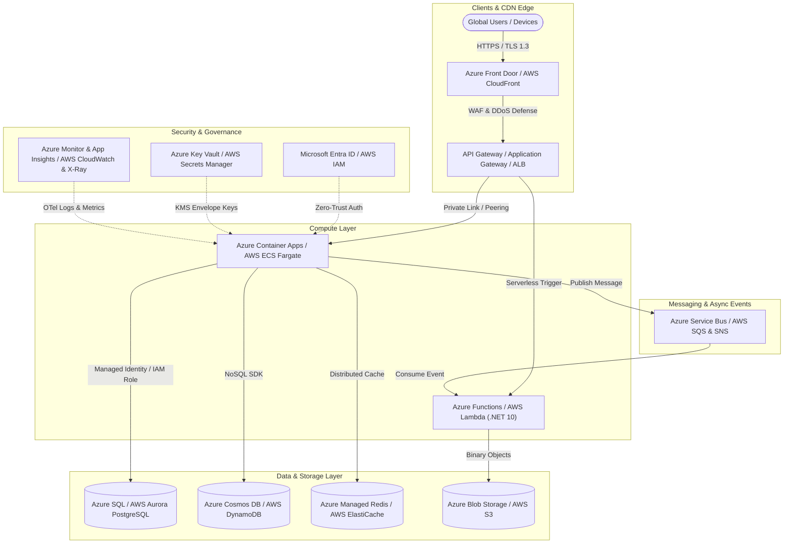

# Cloud Architecture, Azure & AWS Engineering - Learning Path

Welcome to the comprehensive **Cloud Architecture & Engineering Curriculum** covering **Azure & AWS Cloud Fundamentals**, **Compute & Serverless (Azure Container Apps / Lambda / ECS)**, **Object Storage & Lifecycle Tiering (Blob vs. S3)**, **Virtual Networks & Hybrid Connectivity (VNet vs. VPC)**, **Managed Databases & Caching (Azure SQL, Cosmos DB, RDS, DynamoDB)**, **Cloud Identity & Zero Trust (Entra ID vs. IAM)**, **Event-Driven Messaging (Service Bus vs. SQS/SNS/EventBridge)**, **Cloud Observability & FinOps**, **Infrastructure as Code (Bicep, Terraform, CloudFormation)**, and **Top 30 Cloud Interview Questions**.

---

## 🏛️ Multi-Cloud & Enterprise Cloud Topology

---

## 📚 Cloud Curriculum Modules

1. [**01 - Cloud Fundamentals, Azure vs. AWS & Shared Responsibility**](./01-cloud-fundamentals-azure-vs-aws-and-shared-responsibility.md)
   - Cloud Service Models: IaaS vs. PaaS vs. SaaS vs. Serverless (FaaS)
   - Cloud Economics: CapEx vs. OpEx, TCO, FinOps, Reserved Instances & Spot Pricing
   - Azure vs. AWS Core Architecture Mapping Matrix (Subscriptions/Resource Groups vs. Accounts/OUs, Regions, AZs)
   - The Shared Responsibility Model & Well-Architected Framework (WAF)

2. [**02 - Cloud Compute: VMs, Containers & Serverless**](./02-cloud-compute-vms-containers-and-serverless.md)
   - Compute Models: Virtual Machines (Azure VM / EC2), Container Apps (ACA / ECS Fargate), Kubernetes (AKS / EKS)
   - Serverless .NET 10: Cold starts, Native AOT compilation, isolated worker model, and Flex Consumption / SnapStart
   - Event-Driven Autoscaling with KEDA and Target Tracking Policies

3. [**03 - Cloud Storage: Blob Storage, S3 & Data Tiering**](./03-cloud-storage-blob-s3-and-data-tiering.md)
   - Object Storage Architecture: Azure Blob Storage vs. AWS S3
   - Storage Access Tiers & Automated Lifecycle Policies (Hot / Cool / Cold / Archive / Glacier)
   - Secure Access: Shared Access Signatures (SAS) & Azure RBAC vs. Pre-Signed URLs & Bucket Policies
   - Data Protection: Customer-Managed Keys (CMK), Object Versioning, Immutability (WORM), and Geo-Replication (GZRS / CRR)

4. [**04 - Cloud Networking: VNet, VPC & Hybrid Connectivity**](./04-cloud-networking-vnet-vpc-and-hybrid-connectivity.md)
   - Virtual Networks: Azure VNet vs. AWS VPC, Subnetting, CIDR block allocation
   - Network Security: Network Security Groups (NSGs) & ASGs vs. Stateful Security Groups & Stateless NACLs
   - Private Connectivity: Azure Private Link / Private Endpoints vs. AWS VPC Endpoints (Interface & Gateway)
   - Hybrid Cloud & Multi-Cloud: Azure ExpressRoute vs. AWS Direct Connect, Virtual WAN vs. Transit Gateway

5. [**05 - Managed Databases & Distributed Caching**](./05-managed-databases-and-distributed-caching.md)
   - Relational OLTP: Azure SQL Database & Azure PostgreSQL vs. AWS RDS & Aurora PostgreSQL Serverless v2
   - Distributed NoSQL at Scale: Azure Cosmos DB (Request Units - RUs, multi-master writes) vs. AWS DynamoDB (Partition Keys, Streams, Global Tables)
   - In-Memory Caching: Azure Managed Redis vs. AWS ElastiCache / MemoryDB
   - Read Replicas, Automated Failover, and Connection Resiliency

6. [**06 - Cloud Identity, IAM, Entra ID & Zero Trust**](./06-cloud-identity-iam-entra-id-and-zero-trust.md)
   - Enterprise Identity: Microsoft Entra ID vs. AWS IAM
   - Passwordless Compute Security: Azure Managed Identities (System & User Assigned) vs. AWS IAM Roles & Instance Profiles
   - Role-Based Access Control (RBAC) & Fine-Grained Policy Conditions (JSON Statements)
   - Secrets Management: Azure Key Vault vs. AWS Secrets Manager & SSM Parameter Store
   - Workload Identity Federation with GitHub Actions for Secure OIDC CI/CD Deployments

7. [**07 - Cloud Messaging, Event-Driven Architecture & Queues**](./07-cloud-messaging-event-driven-architecture-and-queues.md)
   - Message Queuing: Azure Service Bus (Queues & Topics) vs. AWS SQS (Standard & FIFO) & SNS (Fan-out)
   - Reactive Event Routing: Azure Event Grid vs. AWS EventBridge
   - High-Throughput Streaming: Azure Event Hubs vs. AWS Kinesis Data Streams
   - Enterprise Patterns: Transactional Outbox, Competing Consumers, and Dead-Letter Queue (DLQ) Poison Message Handling

8. [**08 - Cloud Observability, Monitoring & FinOps**](./08-cloud-observability-monitoring-and-finops.md)
   - The 3 Pillars: Metrics, Distributed Tracing, and Structured Logging
   - Azure Monitor, Log Analytics, Application Insights & OpenTelemetry (.NET 10)
   - AWS CloudWatch Logs, Metrics, Alarms & AWS X-Ray Trace Maps
   - Cloud FinOps: Cost Allocation Tags, Anomaly Detection, Budgets, and Workload Right-Sizing

9. [**09 - Infrastructure as Code (IaC): Bicep, Terraform & CloudFormation**](./09-infrastructure-as-code-bicep-terraform-and-cloudformation.md)
   - Declarative IaC Concepts: State Management, Drift Detection, and Idempotency
   - Azure Bicep: Modules, Parameters, Outputs, and Deployment Scopes
   - AWS CloudFormation & AWS CDK (Cloud Development Kit)
   - Multi-Cloud Terraform / OpenTofu: Remote State in Blob/S3 with DynamoDB/Blob State Locking
   - Automated IaC CI/CD Pipelines in GitHub Actions

10. [**10 - Top 30 Cloud (Azure & AWS) Interview Questions**](./10-top-30-cloud-azure-and-aws-interview-questions.md)
    - 30 Comprehensive Cloud Architecture questions categorized into Easy, Medium, and Advanced levels with deep technical explanations, comparative tables, and real-world architectures.

---

## ⚡ Azure vs. AWS Architecture Mapping Matrix

| Category | Azure Service | AWS Service | Core Purpose |
| :--- | :--- | :--- | :--- |
| **Account Hierarchy** | Tenant ➔ Management Group ➔ Subscription ➔ Resource Group | AWS Organization ➔ Organizational Unit (OU) ➔ Account | Governance & billing boundary |
| **Compute (VM)** | Azure Virtual Machines | Amazon Elastic Compute Cloud (EC2) | Infrastructure-as-a-Service virtual servers |
| **Containers (PaaS)** | Azure Container Apps (ACA) | AWS ECS (Fargate) / App Runner | Serverless container hosting |
| **Kubernetes** | Azure Kubernetes Service (AKS) | Amazon Elastic Kubernetes Service (EKS) | Managed Kubernetes cluster orchestration |
| **Serverless (FaaS)** | Azure Functions | AWS Lambda | Event-driven on-demand code execution |
| **Object Storage** | Azure Blob Storage | Amazon Simple Storage Service (S3) | Unstructured object storage |
| **Networking** | Azure Virtual Network (VNet) | Amazon Virtual Private Cloud (VPC) | Isolated private cloud networking |
| **Relational DB** | Azure SQL / Azure DB for PostgreSQL | Amazon RDS / Amazon Aurora | Managed SQL database engines |
| **NoSQL DB** | Azure Cosmos DB | Amazon DynamoDB | Globally distributed NoSQL database |
| **Distributed Cache** | Azure Managed Redis | Amazon ElastiCache / MemoryDB | In-memory key-value cache |
| **Identity & IAM** | Microsoft Entra ID / Managed Identities | AWS IAM / IAM Roles | Identity, authentication & authorization |
| **Secrets & Keys** | Azure Key Vault | AWS Secrets Manager & KMS | Secrets, keys, and certificates management |
| **Message Queue** | Azure Service Bus (Queues) | Amazon Simple Queue Service (SQS) | Decoupled asynchronous message queues |
| **Pub/Sub Topic** | Azure Service Bus (Topics) | Amazon Simple Notification Service (SNS) | 1-to-many fan-out messaging |
| **Event Routing** | Azure Event Grid | Amazon EventBridge | Reactive serverless event routing |
| **Telemetry & Log** | Azure Monitor / Application Insights | Amazon CloudWatch / AWS X-Ray | Centralized observability & tracing |
| **IaC Native** | Azure Bicep / ARM Templates | AWS CloudFormation / AWS CDK | Declarative infrastructure as code |
