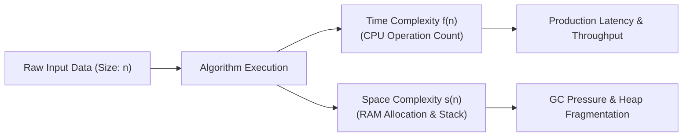
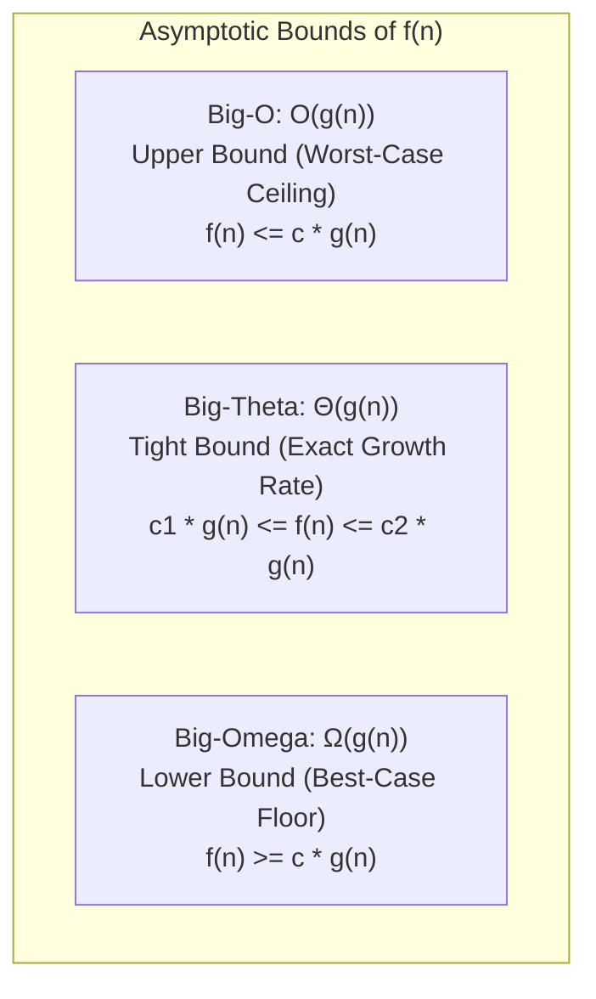
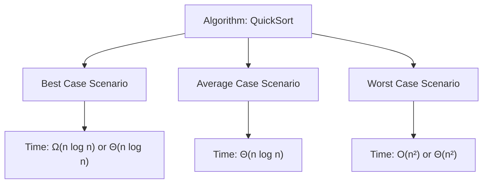
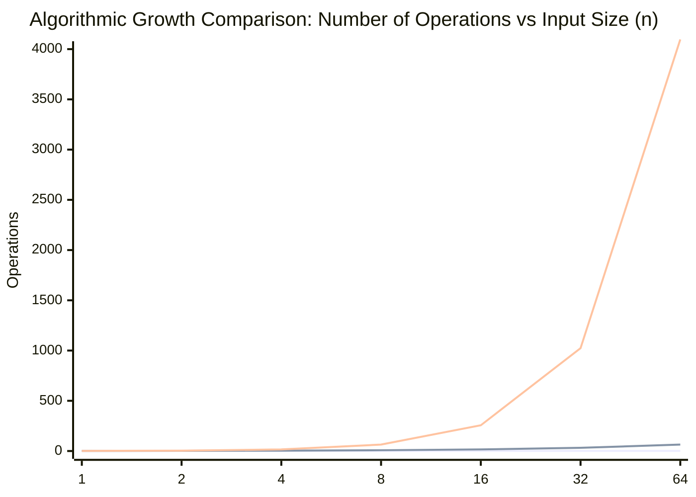
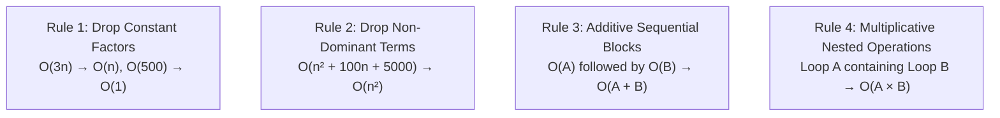
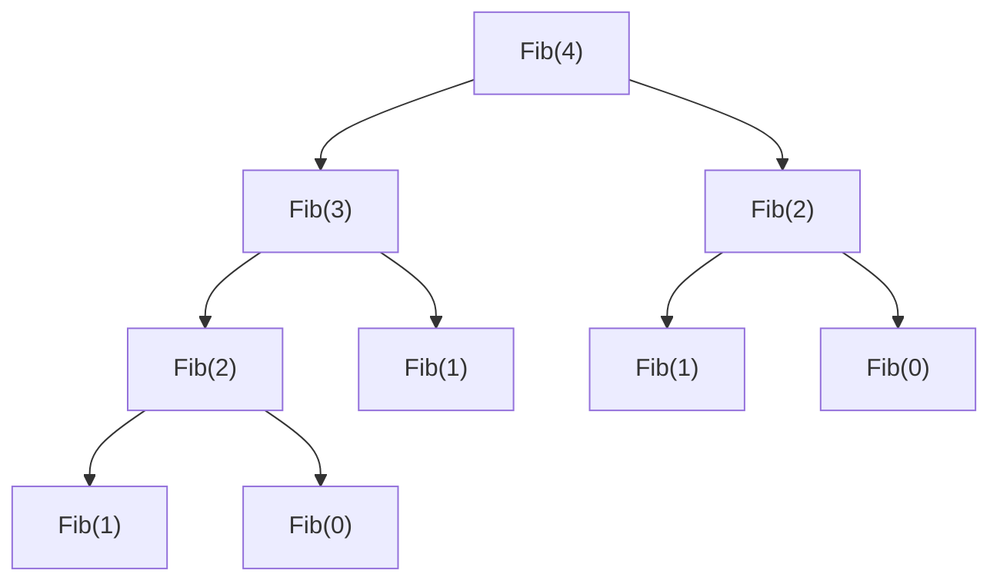
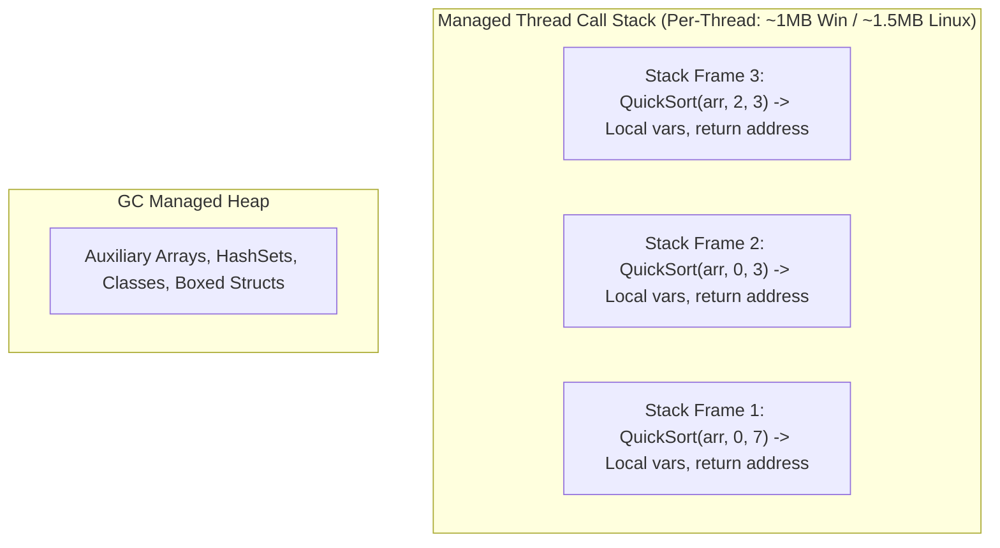
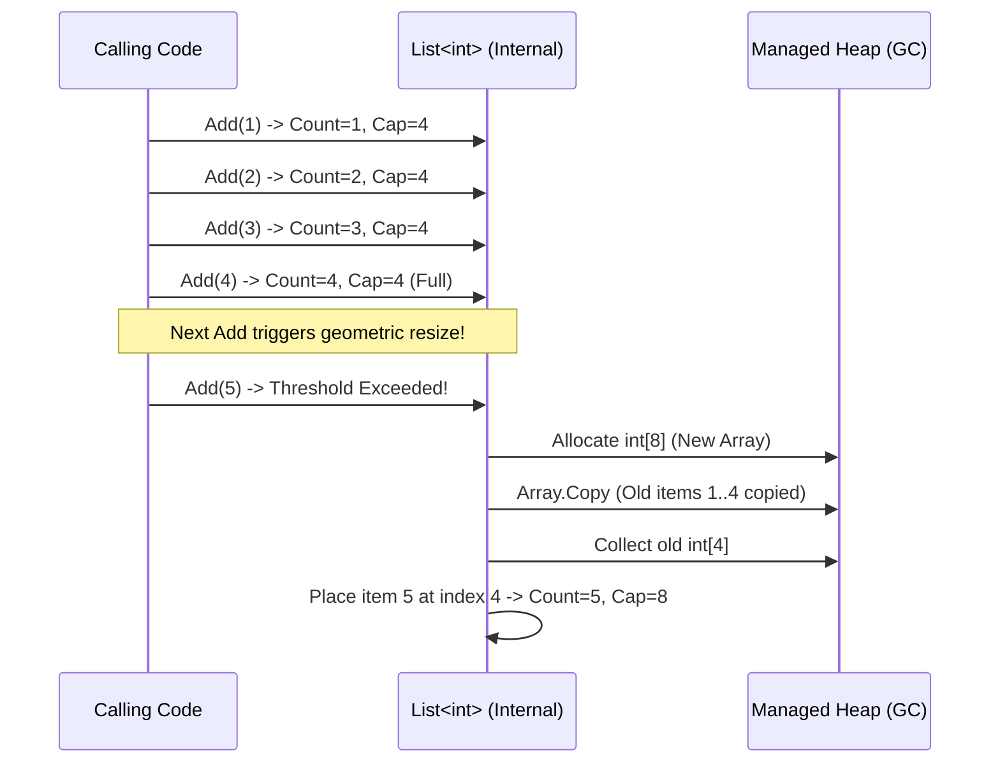

# 01 - Big-O Notation & Complexity Analysis

Algorithmic complexity analysis is the foundational science of measuring and predicting software resource consumption—specifically **CPU time** and **RAM allocation**—as input volume scales toward infinity.

For a senior .NET software engineer, asymptotic analysis is not merely an interview filter; it is the primary framework for preventing production performance regressions, optimizing cloud infrastructure costs, avoiding thread pool starvation, and architecting low-latency microservices.

---

## 1. 📚 What is Algorithmic Complexity & Why It Matters

Algorithmic complexity measures how an algorithm's execution time and memory footprint scale relative to input size $n$. Rather than measuring raw execution time in milliseconds—which varies across CPU architectures, JIT compilation tiers, operating systems, and garbage collection pauses—asymptotic analysis provides a **hardware-independent** mathematical characterization.



### Why Complexity Analysis Matters in Production .NET Systems

| Production Dimension | Algorithmic Impact | .NET Engineering Consequence |
| :--- | :--- | :--- |
| **CPU Saturation** | An $O(n^2)$ algorithm processing $100{,}000$ records executes $10^{10}$ operations. | Thread pool starvation, HTTP request queuing, request timeout exceptions (`504 Gateway Timeout`). |
| **Garbage Collection (GC)** | High auxiliary space $O(n)$ allocations in the hot path. | Frequent Gen 0/1 GC sweeps, Gen 2 pauses, Large Object Heap (LOH) fragmentation (>85,000 bytes). |
| **Cloud Hosting Costs** | Sub-optimal $O(n \log n)$ vs $O(n)$ data processing in microservices. | Unnecessary horizontal auto-scaling, higher Azure/AWS container compute bills. |
| **P99 / P99.9 Latency** | Non-linear algorithms cause severe latency spikes at high percentiles. | Breached Service Level Agreements (SLAs), client retries causing cascading system failures. |

---

## 2. 🔍 Asymptotic Notations: Big-O, Big-$\Omega$, and Big-$\Theta$

In computer science, asymptotic notations describe the limiting behavior of functions as input size $n \to \infty$.



### Mathematical Definitions

```text
┌──────────────────────────────────────────────────────────────────────────────────────────────────┐
│ 1. Big-O Notation (Asymptotic Upper Bound):                                                      │
│    f(n) = O(g(n))  iff  ∃ c > 0, n₀ > 0  such that  0 ≤ f(n) ≤ c · g(n)  ∀ n ≥ n₀                │
│    Meaning: "The algorithm will run AT MOST this slow; it provides a worst-case guarantee."     │
├──────────────────────────────────────────────────────────────────────────────────────────────────┤
│ 2. Big-Omega Notation (Asymptotic Lower Bound):                                                  │
│    f(n) = Ω(g(n))  iff  ∃ c > 0, n₀ > 0  such that  0 ≤ c · g(n) ≤ f(n)  ∀ n ≥ n₀                │
│    Meaning: "The algorithm requires AT LEAST this many steps; it represents the best-case floor."│
├──────────────────────────────────────────────────────────────────────────────────────────────────┤
│ 3. Big-Theta Notation (Asymptotic Tight Bound):                                                  │
│    f(n) = Θ(g(n))  iff  f(n) = O(g(n))  AND  f(n) = Ω(g(n))                                      │
│    Meaning: "The algorithm grows at PRECISELY this rate across all cases."                       │
└──────────────────────────────────────────────────────────────────────────────────────────────────┘
```

### Distinction: Bound Type vs Case Analysis

A common interview confusion is conflating **Notation Type** (Upper/Lower/Tight) with **Execution Scenario** (Best/Average/Worst case).



- **Linear Search on `List<T>`**:
  - **Best Case**: Item is at index 0 $\to \Theta(1)$ / $\Omega(1)$.
  - **Average Case**: Item is near index $n/2 \to \Theta(n)$.
  - **Worst Case**: Item is at index $n-1$ or absent $\to \Theta(n)$ / $O(n)$.
- In industry discourse, when engineers say "Big-O", they almost always refer to the **Upper Bound of the Worst-Case Scenario** ($O(g(n))$).

---

## 3. ⏱️ Common Time Complexities & Growth Hierarchy

The standard asymptotic hierarchy ordered from most efficient to least efficient:

$$O(1) < O(\log n) < O(\sqrt{n}) < O(n) < O(n \log n) < O(n^2) < O(2^n) < O(n!)$$



### Visual Growth Metrics Table

| Complexity | Common Name | $n = 10$ | $n = 100$ | $n = 1{,}000$ | $n = 1{,}000{,}000$ | Practical Scalability | Canonical .NET Example |
| :--- | :--- | :--- | :--- | :--- | :--- | :--- | :--- |
| **$O(1)$** | Constant | 1 | 1 | 1 | 1 | Instant / Ideal | Array indexing `arr[i]`, `Dictionary.TryGetValue` |
| **$O(\log n)$** | Logarithmic | ~3.3 | ~6.6 | ~10 | ~20 | Extremely Scalable | `BinarySearch`, `SortedSet<T>.Contains` |
| **$O(n)$** | Linear | 10 | 100 | 1,000 | 1,000,000 | Predictable / Standard | `foreach` loop, `List<T>.Find`, `LINQ .Where()` |
| **$O(n \log n)$** | Linearithmic | ~33 | ~664 | ~9,965 | ~19,931,568 | Efficient Sorting | `Array.Sort` (Introsort), `OrderBy()` (QuickSort/Timsort) |
| **$O(n^2)$** | Quadratic | 100 | 10,000 | 1,000,000 | $10^{12}$ (1 Trillion) | Slow / Non-scalable | Nested loops, Bubble Sort, pairwise cross-join |
| **$O(2^n)$** | Exponential | 1,024 | $1.26 \times 10^{30}$ | Incalculable | Incalculable | Impractical ($n > 30$) | Naive recursive Fibonacci, subsets generation |
| **$O(n!)$** | Factorial | 3,628,800 | $9.33 \times 10^{157}$ | Incalculable | Incalculable | Catastrophic ($n > 12$) | Traveling Salesperson brute force, all permutations |

---

## 4. 🧮 How to Analyze Code: Step-by-Step Methodology

To determine the Big-O complexity of any method or routine, follow four fundamental algebraic reduction rules.

### The 4 Algebraic Rules of Big-O Analysis



---

### Step 1: Analyzing Single & Independent Loops

```csharp
// Example 1: Constant Time O(1)
public void PrintFirstThree(ReadOnlySpan<int> numbers)
{
    int limit = Math.Min(3, numbers.Length);
    for (int i = 0; i < limit; i++) // Constant iterations (max 3), independent of n
    {
        Console.WriteLine(numbers[i]);
    }
}

// Example 2: Linear Time O(n)
public int ComputeSum(ReadOnlySpan<int> numbers)
{
    int sum = 0;
    for (int i = 0; i < numbers.Length; i++) // Runs exactly n times
    {
        sum += numbers[i]; // O(1) operation
    }
    return sum;
}

// Example 3: Logarithmic Time O(log n)
public int CountHalvings(int n)
{
    int count = 0;
    while (n > 1) // Loop counter divides by 2 in each iteration
    {
        n /= 2;
        count++;
    }
    return count;
}
```

---

### Step 2: Analyzing Nested Loops & Variable Bounds

```csharp
// Independent Nested Loops: O(n * m)
public void ProcessGrid(int[] rowItems, int[] colItems)
{
    // Outer loop runs n times, inner loop runs m times -> O(n * m)
    for (int i = 0; i < rowItems.Length; i++)
    {
        for (int j = 0; j < colItems.Length; j++)
        {
            DoWork(rowItems[i], colItems[j]); // O(1)
        }
    }
}

// Dependent Triangular Nested Loops: O(n²)
public void FindPairs(ReadOnlySpan<int> items)
{
    int n = items.Length;
    // Iterations: (n - 1) + (n - 2) + ... + 2 + 1 + 0 = n * (n - 1) / 2
    // Algebraic Expansion: (n² - n) / 2 = 0.5n² - 0.5n
    // Dropping constants and non-dominant terms -> O(n²)
    for (int i = 0; i < n; i++)
    {
        for (int j = i + 1; j < n; j++)
        {
            EvaluatePair(items[i], items[j]);
        }
    }
}
```

---

### Step 3: Analyzing Recursive Algorithms & Call Trees

For recursive algorithms, time complexity is governed by:

$$\text{Total Time} = \text{Total Recursive Nodes in Call Tree} \times \text{Work Per Node}$$



```csharp
// Naive Recursive Fibonacci: O(2ⁿ) Time, O(n) Space
// Each call branches into 2 recursive sub-calls.
// Tree height = n. Number of nodes = 2⁰ + 2¹ + 2² + ... + 2ⁿ ≈ 2ⁿ⁺¹ - 1 -> O(2ⁿ)
public int NaiveFibonacci(int n)
{
    if (n <= 1) return n;
    return NaiveFibonacci(n - 1) + NaiveFibonacci(n - 2);
}

// Optimized Linear Fibonacci (Bottom-Up DP): O(n) Time, O(1) Space
public int IterativeFibonacci(int n)
{
    if (n <= 1) return n;
    int prev2 = 0, prev1 = 1;
    for (int i = 2; i <= n; i++)
    {
        int current = prev1 + prev2;
        prev2 = prev1;
        prev1 = current;
    }
    return prev1;
}
```

---

## 5. 💾 Space Complexity: Auxiliary Space & Call Stacks

Space complexity evaluates total memory required by an algorithm as a function of input size $n$.

$$\text{Total Space} = \text{Input Space} + \text{Auxiliary Space}$$

- **Input Space**: Memory consumed by input parameters (e.g., array of size $n$).
- **Auxiliary Space**: Extra or temporary memory allocated by the algorithm during execution (e.g., temporary buffers, hash sets, recursion stack frames).



### Recursion Call Stack & `StackOverflowException`

Every recursive call creates a new **Stack Frame** storing method arguments, local variables, and the return instruction pointer.

```csharp
// Space Complexity: O(n) Auxiliary Call Stack Space
public int RecursiveSum(int[] arr, int index)
{
    if (index >= arr.Length) return 0;
    // Pushes 'n' frames onto the thread stack before unwinding.
    // If n > ~15,000-50,000 (depending on frame size), throws StackOverflowException.
    return arr[index] + RecursiveSum(arr, index + 1);
}

// Space Complexity: O(1) Auxiliary Space
public int IterativeSum(ReadOnlySpan<int> arr)
{
    int total = 0;
    for (int i = 0; i < arr.Length; i++)
    {
        total += arr[i];
    }
    return total;
}
```

> [!WARNING]
> The C# Roslyn compiler does **not** guarantee Tail Call Optimization (TCO) even in release builds. Deeply recursive methods must be rewritten iteratively or use explicit stack data structures on the heap (`Stack<T>`) to prevent uncatchable `StackOverflowException` crashes.

---

## 6. 🔄 Amortized Analysis & Dynamic Array Resizing

**Amortized Analysis** assesses the average cost of an operation over a sequence of operations, guaranteeing that even if an individual operation occasionally incurs a high cost, the average per-operation cost across $N$ operations remains low.

### The Mechanics of .NET `List<T>`

`System.Collections.Generic.List<T>` is backed by an internal array `T[] _items`. When the array fills up:

1. A new array of double the capacity is allocated ($2 \times \text{Capacity}$).
2. Existing elements are copied to the new array (`Array.Copy` or memory block copy).
3. The old array is released for Garbage Collection.



### Mathematical Proof of $O(1)$ Amortized Append

Assume an initial capacity of 1 and an operation sequence inserting $N = 2^k$ items:

1. **Copy Costs at Resizes**: $1 + 2 + 4 + 8 + 16 + \dots + \frac{N}{2} = \sum_{i=0}^{k-1} 2^i = 2^k - 1 = N - 1$ copy operations.
2. **Direct Insertion Costs**: $N$ insertions of 1 step each.
3. **Total Work**: $(N - 1) + N = 2N - 1$ operations.
4. **Amortized Work per Item**:

$$\text{Amortized Cost} = \frac{\text{Total Operations}}{N} = \frac{2N - 1}{N} \approx 2 = O(1)$$

```csharp
// ❌ Sub-optimal: Multiple array allocations & GC copying overhead
var dynamicList = new List<int>();
for (int i = 0; i < 1_000_000; i++)
{
    dynamicList.Add(i); // Resizes ~20 times (allocates sizes 4, 8, 16, 32... 1,048,576)
}

// ✅ High-Performance Senior Pattern: Pre-allocate capacity
// Single allocation, 0 reallocations, 0 Array.Copy overhead, O(1) strict time.
var optimizedList = new List<int>(capacity: 1_000_000);
for (int i = 0; i < 1_000_000; i++)
{
    optimizedList.Add(i);
}
```

---

## 7. 🛠️ Practical .NET Collections: Complexity Reference & Code Examples

### Comprehensive .NET Collection Complexity Matrix

| Collection Type | Access via Index | Lookup via Value / Key | Insertion (End) | Insertion (Start/Middle) | Deletion | Primary Memory Overhead |
| :--- | :--- | :--- | :--- | :--- | :--- | :--- |
| **`T[]` (Array)** | $O(1)$ | $O(n)$ | N/A | N/A | N/A | Lowest (Contiguous block) |
| **`List<T>`** | $O(1)$ | $O(n)$ | $O(1)$ Amortized | $O(n)$ | $O(n)$ | Array buffer + count/capacity |
| **`LinkedList<T>`** | $O(n)$ | $O(n)$ | $O(1)$ | $O(1)$ (with node reference) | $O(1)$ | 24 bytes per node (Prev/Next pointers) |
| **`Dictionary<TKey, TVal>`** | N/A | $O(1)$ Avg / $O(n)$ Worst | $O(1)$ Avg | N/A | $O(1)$ Avg | 3 internal arrays (`buckets`, `entries`, hash codes) |
| **`HashSet<T>`** | N/A | $O(1)$ Avg / $O(n)$ Worst | $O(1)$ Avg | N/A | $O(1)$ Avg | Bucket arrays + hash table overhead |
| **`SortedDictionary<K, V>`** | N/A | $O(\log n)$ | $O(\log n)$ | N/A | $O(\log n)$ | Red-Black Tree node pointers |
| **`SortedSet<T>`** | N/A | $O(\log n)$ | $O(\log n)$ | N/A | $O(\log n)$ | Red-Black Tree node pointers |
| **`Queue<T>` / `Stack<T>`** | N/A | $O(n)$ | $O(1)$ Amortized | N/A | $O(1)$ | Circular array buffer (`Queue<T>`) |

---

### Concrete C# Comparative Code Walkthrough

```csharp
using System.Diagnostics.CodeAnalysis;

public sealed class CollectionComplexityBenchmarks
{
    // =========================================================================
    // 1. List<T> Operations
    // =========================================================================
    public void ListOperations(List<int> list, int target)
    {
        // O(1) Indexer Access: Direct pointer arithmetic -> BaseAddress + (index * sizeof(T))
        int item = list[500];

        // O(n) Linear Search: Iterates over elements until found or end reached
        bool found = list.Contains(target);

        // O(1) Amortized Append: Inserts at list.Count
        list.Add(42);

        // O(n) Shift Insertion: Copies and shifts all subsequent elements right by 1
        list.Insert(0, 999);

        // O(n) Shift Removal: Copies and shifts all elements left by 1
        list.RemoveAt(0);
    }

    // =========================================================================
    // 2. Dictionary<TKey, TValue> Operations
    // =========================================================================
    public void DictionaryOperations(Dictionary<string, int> dict, string key)
    {
        // O(1) Average Case Lookup:
        // Step 1: int hash = key.GetHashCode()
        // Step 2: int bucketIndex = hash % buckets.Length
        // Step 3: Traverse short collision linked chain in entries array
        if (dict.TryGetValue(key, out int value))
        {
            // Found in ~1-2 memory hops
        }

        // O(1) Average Insertion / O(n) Worst Case (if all keys collide on 1 bucket)
        dict[key] = 100;

        // O(1) Average Removal
        dict.Remove(key);
    }

    // =========================================================================
    // 3. HashSet<T> Operations
    // =========================================================================
    public void HashSetOperations(HashSet<int> set, int target)
    {
        // O(1) Average Membership Test
        bool exists = set.Contains(target);

        // O(1) Average Add
        set.Add(target);
    }
}
```

---

## 8. ⚠️ Common .NET Interview Traps & Hidden Complexity Gotchas

Senior technical interviews frequently test candidates on hidden algorithmic complexities that appear harmless in C# syntax but degrade performance in production.

---

### Trap 1: Repeated String Concatenation in Loops ($O(n^2)$ vs $O(n)$)

In .NET, `System.String` is **immutable**. Every string concatenation creates a brand-new heap object and copies all previous characters.

```csharp
// ❌ WRONG: O(n²) Time & O(n²) Memory Pressure (Gen 0/LOH GC Thrashing)
public string BuildCsvWrong(string[] items)
{
    string result = string.Empty;
    // Step 1 copies 1 char, step 2 copies 2 chars ... step n copies n chars
    // Total character copies = n * (n + 1) / 2 -> O(n²)
    foreach (var item in items)
    {
        result += item + ",";
    }
    return result;
}

// ✅ CORRECT: O(n) Time & O(n) Auxiliary Memory using StringBuilder
public string BuildCsvCorrect(string[] items)
{
    var sb = new System.Text.StringBuilder(capacity: items.Length * 16);
    foreach (var item in items)
    {
        sb.Append(item).Append(',');
    }
    return sb.ToString();
}
```

---

### Trap 2: LINQ `.Contains()` on `List<T>` vs `HashSet<T>` inside Loops ($O(n \times m)$ vs $O(n + m)$)

```csharp
// Scenario: Match 50,000 order IDs against 50,000 target blacklist IDs

// ❌ WRONG: O(n * m) Quadratic Complexity (~2,500,000,000 comparisons)
public List<Order> FilterOrdersWrong(List<Order> orders, List<Guid> blacklistedIds)
{
    // For each order (n), list.Contains() performs a linear scan of m elements
    return orders.Where(o => blacklistedIds.Contains(o.Id)).ToList();
}

// ✅ CORRECT: O(n + m) Linear Complexity (~100,000 operations)
public List<Order> FilterOrdersCorrect(List<Order> orders, IEnumerable<Guid> blacklistedIds)
{
    // O(m) to build the hash lookup table
    var blacklistSet = new HashSet<Guid>(blacklistedIds);

    // O(n * 1) = O(n) filtering with O(1) hash lookups
    return orders.Where(o => blacklistSet.Contains(o.Id)).ToList();
}
```

---

### Trap 3: `IEnumerable<T>.Count()` vs Property `.Count` & Multiple Enumerations

```csharp
// ❌ TRAP: LINQ Count() iterates the entire sequence if underlying type is not ICollection<T>
public void ProcessData(IEnumerable<int> stream)
{
    // Count() executes an O(n) traversal
    if (stream.Count() > 0)
    {
        // Iterates stream a second time -> Multiple Enumeration bug & double latency
        foreach (var item in stream)
        {
            Process(item);
        }
    }
}

// ✅ CORRECT: O(1) check with Any() or concrete collection property
public void ProcessDataOptimized(IEnumerable<int> stream)
{
    using var enumerator = stream.GetEnumerator();
    if (enumerator.MoveNext()) // O(1) check
    {
        do
        {
            Process(enumerator.Current);
        } while (enumerator.MoveNext());
    }
}
```

---

### Trap 4: `List<T>.RemoveAt(0)` / `Insert(0, item)` Used as a Queue ($O(n)$ vs $O(1)$)

```csharp
// ❌ WRONG: Simulating FIFO Queue using List<T> -> O(n) per dequeue operation
var listQueue = new List<int>();
listQueue.Add(1);
int nextItem = listQueue[0];
listQueue.RemoveAt(0); // O(n) memory shift of all remaining items

// ✅ CORRECT: Circular buffer backed System.Collections.Generic.Queue<T> -> O(1)
var properQueue = new Queue<int>();
properQueue.Enqueue(1); // O(1) Amortized
int processed = properQueue.Dequeue(); // O(1) head pointer increment
```

---

### Trap 5: `.OrderBy().First()` ($O(n \log n)$) vs `.MinBy()` ($O(n)$)

```csharp
// ❌ WRONG: Sorts the entire collection before taking the first element
var topStudentWrong = students.OrderBy(s => s.Gpa).First(); // O(n log n)

// ✅ CORRECT: Performs a single linear scan maintaining the minimum reference
var topStudentCorrect = students.MinBy(s => s.Gpa); // O(n) Time, O(1) Space
```

---

## 9. 🎯 Senior Developer Cheat Sheet & Interview Summary

```text
┌──────────────────────────────────────────────────────────────────────────────────────────────────┐
│                         ALGORITHMIC COMPLEXITY INTERVIEW CHEAT SHEET                            │
├────────────────────────────────┬───────────────────────────┬─────────────────────────────────────┤
│ Problem / Use Case             │ Recommended Data Structure│ Target Complexity                   │
├────────────────────────────────┼───────────────────────────┼─────────────────────────────────────┤
│ Key-Value Fast Lookup          │ Dictionary<TKey, TValue>  │ O(1) Avg Time, O(n) Space           │
│ Unique Items Membership Test   │ HashSet<T>                │ O(1) Avg Time, O(n) Space           │
│ FIFO Processing                │ Queue<T>                  │ O(1) Time, O(n) Space               │
│ LIFO Processing                │ Stack<T>                  │ O(1) Time, O(n) Space               │
│ Sorted Traversal & Range Query │ SortedSet<T> / SortedDict │ O(log n) Lookup/Insert, O(n) Space  │
│ Contiguous Memory Iteration    │ Memory<T> / ReadOnlySpan<T>│ O(1) Slicing, 0 Heap Allocations    │
│ Priority Queue / Min-Max Heap  │ PriorityQueue<TElement, P>│ O(log n) Enqueue/Dequeue            │
└────────────────────────────────┴───────────────────────────┴─────────────────────────────────────┘
```

### Top 5 Interview Takeaways

1. **Always Specify Best/Average/Worst**: When asked for the complexity of a hash table lookup, distinguish between $O(1)$ average (uniform hash distribution) and $O(n)$ worst-case (hash collision degradation).
2. **Space Matters as Much as Time**: An algorithm running in $O(n)$ time but consuming $O(n^2)$ auxiliary memory will crash server nodes via `OutOfMemoryException` or trigger severe Gen 2 GC pauses.
3. **Be Vigilant About Hidden LINQ Costs**: LINQ queries abstract away complexity. Always evaluate if a chained LINQ query introduces nested enumeration ($O(n \times m)$) or unnecessary sorting ($O(n \log n)$).
4. **Pre-Size Collections When Possible**: Always pass estimated `capacity` to `List<T>`, `Dictionary<K,V>`, `HashSet<T>`, and `StringBuilder` constructors to avoid amortized resize overhead and GC allocation churn.
5. **Modern .NET Zero-Allocation Primitives**: For high-throughput systems, leverage `ReadOnlySpan<T>`, `Memory<T>`, and `ArrayPool<T>.Shared` to achieve $O(1)$ auxiliary heap allocation.
