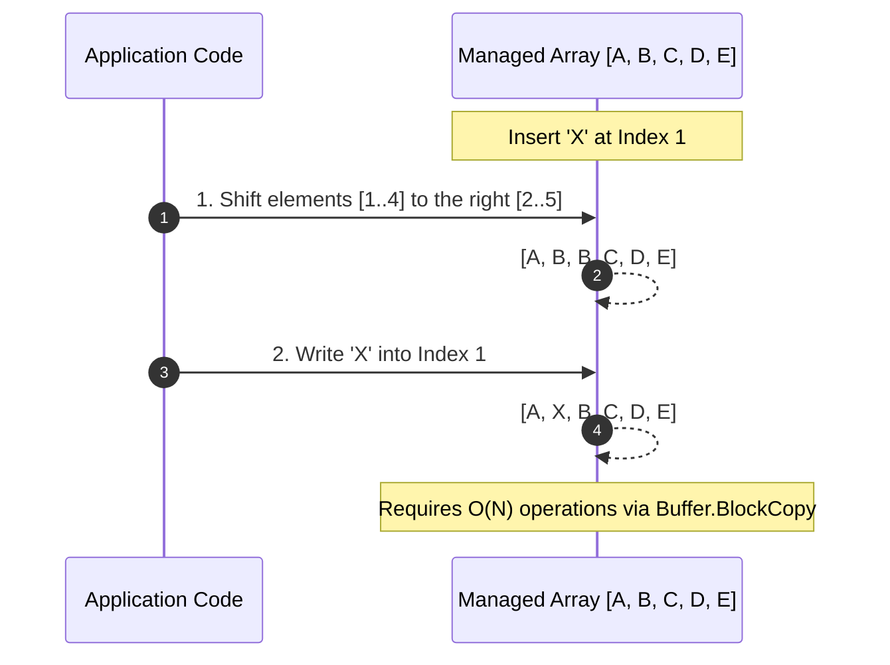
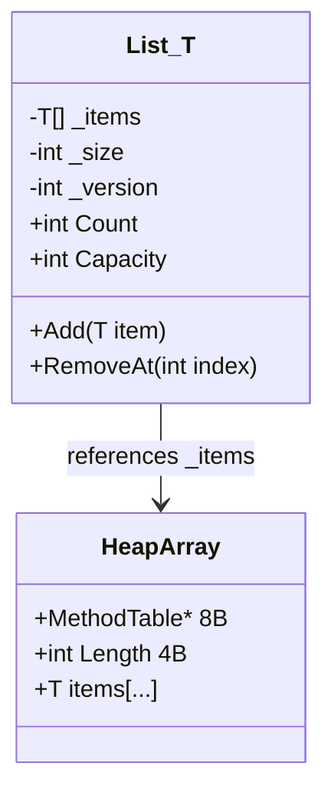
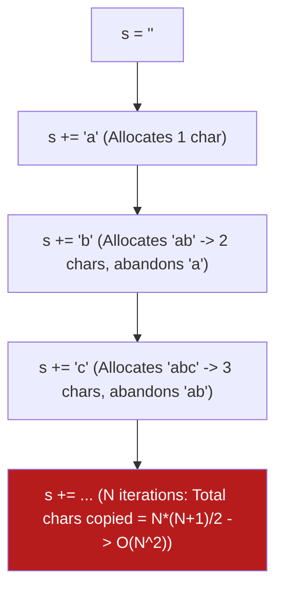
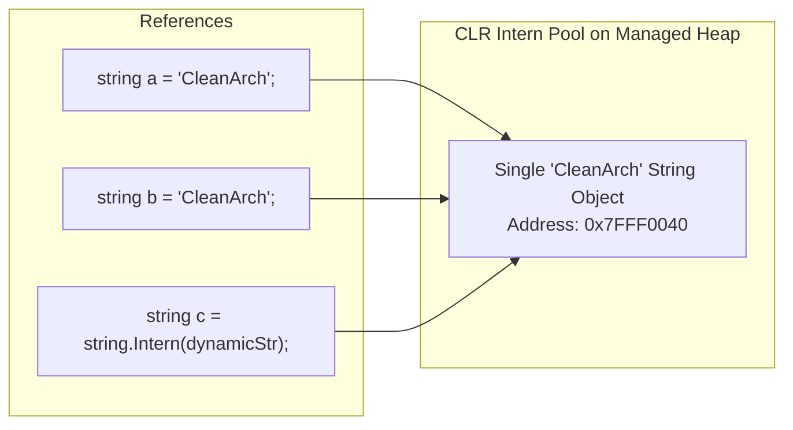
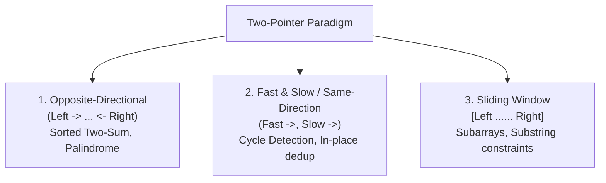
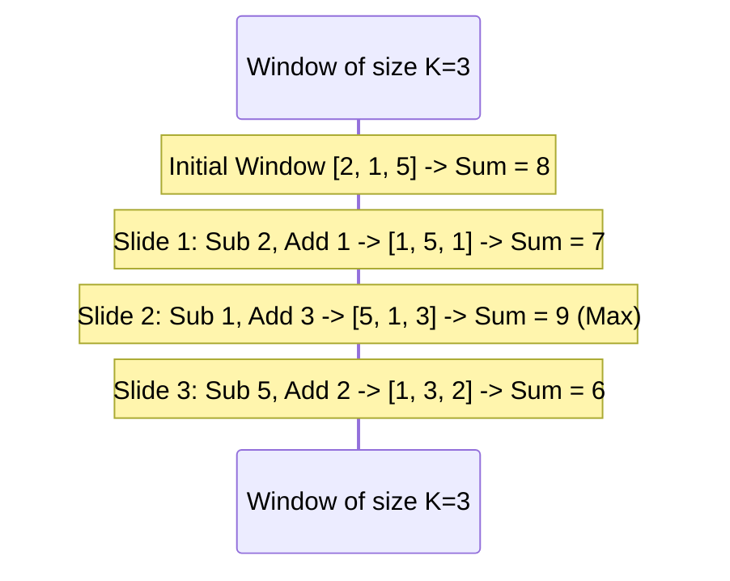
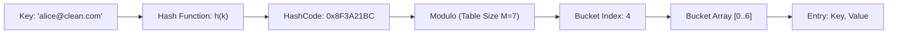
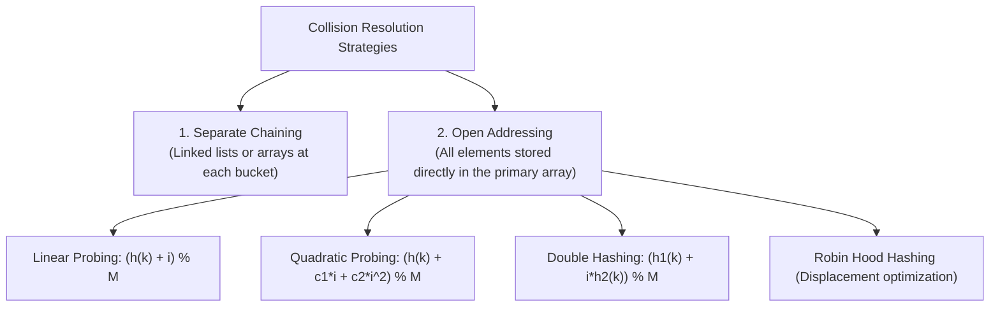
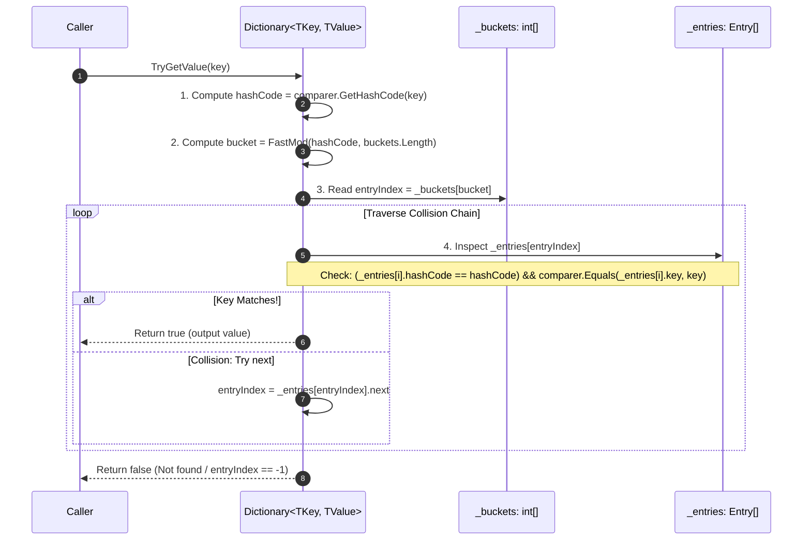
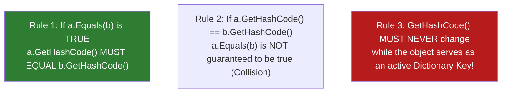

# 02 - Arrays, Strings & Hash Tables: Memory Layouts, Runtime Internals & High-Performance Patterns

Modern .NET applications operate under high throughput and tight latency budgets. Choosing the right collection and understanding how the Common Language Runtime (CoreCLR) manages memory on the heap and stack is what distinguishes mid-level engineers from senior architects.

This module explores the computer science fundamentals, memory representations, algorithmic complexities, and CoreCLR implementations of **Arrays**, **Strings**, and **Hash Tables**, complete with modern C# (.NET 8/9/10) performance optimizations.

---

## 1. 📚 Arrays: Contiguous Memory & Mechanical Sympathy

### 1.1 Memory Layout & $O(1)$ Direct Addressing

An array is a data structure consisting of a collection of elements of the same type, placed in **contiguous (adjacent) memory locations**.

Because memory is contiguous and each element has a fixed size, the CPU can compute the memory address of any element in $O(1)$ constant time using a simple arithmetic formula:

$$\text{Address}(A[i]) = \text{BaseAddress} + (i \times \text{ElementSize})$$

```mermaid
graph LR
    subgraph Managed Heap: int[4] Array
        B["Base Address: 0x1000<br/>(MethodTable: 8B + Length: 4B + Padding: 4B)"]
        E0["Index 0: 0x1010<br/>Value: 42 (4B)"]
        E1["Index 1: 0x1014<br/>Value: 87 (4B)"]
        E2["Index 2: 0x1018<br/>Value: 19 (4B)"]
        E3["Index 3: 0x101C<br/>Value: 99 (4B)"]
    end
    B --> E0 --> E1 --> E2 --> E3
```

#### Why Direct Addressing is $O(1)$

1. **No pointer chasing**: The CPU does not traverse intermediate nodes (unlike linked lists).
2. **Single instruction arithmetic**: On x64 architectures, address calculation is performed in a single CPU instruction using base-plus-scaled-index addressing:

   ```nasm
   ; Address calculation: [rax + rcx*4 + 16]
   ; rax = Base array object reference
   ; rcx = Index (i)
   ; 4   = Size of int32 (sizeof(int))
   ; 16  = Object header offset (MethodTable + Length)
   mov edx, dword ptr [rax + rcx*4 + 16]
   ```

---

### 1.2 Mechanical Sympathy: CPU Caching & Spatial Locality

Modern CPUs are orders of magnitude faster than main memory (RAM). To bridge this latency gap, CPUs employ hierarchical caches (L1, L2, L3).

```text
┌──────────────────────────────────────────────────────────┐
│ CPU Core                                                 │
│  ├── Registers        (~0.5 ns, 64-128 bytes per reg)    │
│  ├── L1 Cache         (~1.0 ns, 32-64 KB per core)       │
│  └── L2 Cache         (~4.0 ns, 512 KB - 1 MB per core)  │
└──────────────────────────────────────────────────────────┘
             │
┌────────────▼─────────────────────────────────────────────┐
│ Shared L3 Cache       (~15-20 ns, 16-64 MB shared)       │
└──────────────────────────────────────────────────────────┘
             │
┌────────────▼─────────────────────────────────────────────┐
│ Main RAM (DDR4/DDR5)  (~60-100 ns, 16-128 GB)            │
└──────────────────────────────────────────────────────────┘
```

When a thread reads a single element from memory, the CPU hardware prefetcher does not fetch only that element; it fetches an entire **Cache Line** (typically **64 bytes**).

- **Spatial Locality**: Accessing index `i` loads indices `i+1`, `i+2`, etc., into the L1 cache. Iterating linearly over an array results in cache hits on almost every subsequent element.
- **Pointer-based structures (e.g., `LinkedList<T>`)**: Nodes are scattered across the managed heap. Every node access risks an L1/L2/L3 **cache miss**, stalling the CPU pipeline for up to 100ns.

---

### 1.3 Insertion, Deletion & Shifting Costs

While reading by index is $O(1)$, inserting or removing elements at arbitrary positions requires shifting elements to preserve contiguity:



- **Insertion at start/middle**: $O(N)$ time — $N - i$ elements must be shifted right.
- **Deletion at start/middle**: $O(N)$ time — $N - i - 1$ elements must be shifted left.
- **Append at end**: $O(1)$ if static capacity allows; $O(N)$ if reallocation is required.

---

### 1.4 Static Arrays (`T[]`) vs. Dynamic Arrays (`List<T>`)

| Feature | Static Array (`T[]`) | Dynamic Array (`List<T>`) |
| :--- | :--- | :--- |
| **Size / Length** | Fixed at allocation time (`Length`) | Dynamic, resizes automatically (`Count`, `Capacity`) |
| **Heap Representation** | Single continuous managed object | Class holding `_items` array, `_size`, and `_version` |
| **Memory Overhead** | 24 bytes (Header + Length) + items | `List<T>` object (32 bytes) + inner `_items[]` heap array |
| **Element Modification** | In-place | In-place; insertions trigger resizing if `Count == Capacity` |
| **Allocation Source** | Heap (`new T[]`), Stack (`stackalloc`), Pool | Heap only |



#### How `List<T>` Resizing Works Under the Hood

When `list.Add(item)` is called and `_size == _items.Length`:

1. A new array of size `Capacity * 2` (or default `4` if empty) is allocated on the Managed Heap.
2. `Array.Copy(_items, newItems, _size)` copies all previous elements.
3. The old array reference is abandoned, creating Garbage Collection (GC) pressure.
4. The internal reference `_items` is pointed to the new array.

```csharp
// High-Performance Tip: Pre-allocate capacity when known!
// Bad: Triggers 10 reallocations and copies for 1,000 items (4->8->16->32->64->128->256->512->1024)
var listBad = new List<int>();
for (int i = 0; i < 1_000; i++) listBad.Add(i);

// Good: Single allocation, zero array re-copies, zero GC churn
var listGood = new List<int>(capacity: 1_000);
for (int i = 0; i < 1_000; i++) listGood.Add(i);
```

#### Zero-Allocation Iteration via `CollectionsMarshal` (.NET 6+)

```csharp
using System.Runtime.InteropServices;

public static long SumList(List<int> numbers)
{
    // CollectionsMarshal.AsSpan provides direct Span<T> access to the internal _items array
    // Eliminates index bounds checking overhead per iteration
    Span<int> span = CollectionsMarshal.AsSpan(numbers);
    long sum = 0;
    foreach (int val in span)
    {
        sum += val;
    }
    return sum;
}
```

---

## 2. 🔤 Strings: Immutability, Memory Layout & Zero-Allocation Slicing

### 2.1 Why Strings are Immutable in .NET

In .NET, a `System.String` object cannot be modified after creation. Immutability provides key architectural benefits:

1. **Thread Safety**: Multiple threads can read the exact same string instance simultaneously without locks.
2. **Hash Code Stability**: Because the content never changes, `GetHashCode()` is deterministic and safe for use as a `Dictionary` key.
3. **Security**: Sensitive data passed across application domains or security boundaries cannot be altered maliciously after validation.
4. **String Interning**: Multiple identical string literals share the exact same reference in memory.

### 2.2 In-Memory Layout of `System.String` on x64

```text
┌──────────────────────────┬──────────────────────────┬──────────────────────────┬──────────────────────┐
│ MethodTable Pointer (8B) │ String Length (4 Bytes)  │ UTF-16 Chars (Length*2B) │ Null Terminator (2B) │
└──────────────────────────┴──────────────────────────┴──────────────────────────┴──────────────────────┘
```

- Strings in .NET are encoded in **UTF-16** (each character is 2 bytes `System.Char`).
- The string object contains an embedded length header, allowing `str.Length` to be evaluated in $O(1)$ without scanning for the null terminator.

---

### 2.3 The $O(N^2)$ String Concatenation Trap

Because strings are immutable, modifying or concatenating a string creates an entirely new string on the heap and copies every single character from both inputs.



```csharp
// ANTI-PATTERN: O(N^2) Time Complexity + Massive GC Allocation
public string BuildCsvAntiPattern(string[] items)
{
    string result = string.Empty;
    foreach (var item in items)
    {
        result += item + ","; // Allocates a new string on every single iteration!
    }
    return result;
}
```

---

### 2.4 `StringBuilder` & `DefaultInterpolatedStringHandler`

`StringBuilder` avoids repeated allocations by maintaining an internal mutable buffer chunk structure:

```csharp
// StringBuilder maintains a linked list of character chunks
public class StringBuilder
{
    internal char[] m_ChunkChars;      // Current buffer
    internal StringBuilder? m_ChunkPrevious; // Pointer to previous chunk if capacity exceeded
    internal int m_ChunkLength;        // Characters used in current chunk
    internal int m_ChunkOffset;        // Total characters in prior chunks
}
```

```csharp
// EFFICIENT PATTERN: O(N) Time, amortized buffer growth
public string BuildCsvEfficient(string[] items)
{
    var sb = new System.Text.StringBuilder(capacity: items.Length * 16);
    for (int i = 0; i < items.Length; i++)
    {
        if (i > 0) sb.Append(',');
        sb.Append(items[i]);
    }
    return sb.ToString();
}
```

> [!NOTE]
> **C# 10+ Interpolated String Handlers**: In modern .NET, string interpolation (`$"User: {id}, Name: {name}"`) is transformed by the Roslyn compiler into `DefaultInterpolatedStringHandler`, which calculates exact character buffer sizes at compile time and writes directly into a stack-allocated buffer without intermediate allocations!

---

### 2.5 String Interning & The CLR Intern Pool

The CLR maintains an internal hash table called the **Intern Pool**. When an assembly is loaded, literal strings are automatically registered in the pool so that duplicate literals share a single heap address.



```csharp
string str1 = "CleanArchitecture";
string str2 = "CleanArchitecture";
Console.WriteLine(object.ReferenceEquals(str1, str2)); // True (both point to the intern pool)

string str3 = new string("CleanArchitecture".ToCharArray());
Console.WriteLine(object.ReferenceEquals(str1, str3)); // False (str3 is a new heap instance)

string str4 = string.Intern(str3);
Console.WriteLine(object.ReferenceEquals(str1, str4)); // True (resolved back to intern pool)
```

> [!WARNING]
> **Interning Danger**: Strings added to the intern pool with `string.Intern()` remain in memory for the lifetime of the process (`AppDomain`) and are **never collected by the Garbage Collector**. Never intern untrusted or dynamic user inputs (e.g., JWT IDs, user-submitted usernames) as this causes permanent memory leaks.

---

### 2.6 High-Performance Zero-Allocation Slicing: `ReadOnlySpan<char>`

Traditionally, extracting a substring via `str.Substring(start, length)` allocates a new string on the heap and copies the characters. `ReadOnlySpan<char>` represents a contiguous view of arbitrary memory (stack, heap, or unmanaged) with **zero memory allocation**.

```mermaid
graph TD
    subgraph Original String on Heap (0x2000)
        Full["'Authorization: Bearer eyJhbGciOi...' (Length: 128)"]
    end
    subgraph Span View on Stack
        SpanRef["ReadOnlySpan<char><br/>Pointer: 0x202C (Offset 22)<br/>Length: 106"]
    end
    SpanRef -.->|Direct Pointer View (Zero Allocations)| Full
```

```csharp
// Traditional Substring: Allocates a new 106-character string on the heap
public string ExtractTokenLegacy(string authHeader)
{
    if (authHeader.StartsWith("Bearer ", StringComparison.Ordinal))
    {
        return authHeader.Substring(7); // Heap allocation!
    }
    return string.Empty;
}

// Modern .NET 10 Zero-Allocation: Zero heap allocations, direct slice
public ReadOnlySpan<char> ExtractTokenHighPerformance(ReadOnlySpan<char> authHeader)
{
    const string prefix = "Bearer ";
    if (authHeader.StartsWith(prefix.AsSpan(), StringComparison.Ordinal))
    {
        return authHeader.Slice(prefix.Length); // 0 bytes allocated!
    }
    return ReadOnlySpan<char>.Empty;
}
```

---

## 3. ⚡ Two-Pointer & Sliding Window Techniques

The Two-Pointer and Sliding Window techniques reduce time complexity from naive brute force $O(N^2)$ or $O(N^3)$ down to linear $O(N)$ by maintaining state across dynamic subarray or substring boundaries.



---

### 3.1 Pattern A: Opposite-Directional Pointers (Sorted Two-Sum)

**Problem**: Given a **1-indexed sorted array** of integers `numbers`, find two numbers such that they add up to a specific `target`. Return their indices.

```csharp
public static int[] TwoSumSorted(int[] numbers, int target)
{
    int left = 0;
    int right = numbers.Length - 1;

    while (left < right)
    {
        int sum = numbers[left] + numbers[right];

        if (sum == target)
        {
            return [left + 1, right + 1]; // Found
        }
        
        if (sum < target)
        {
            left++; // Need a larger sum, move left pointer right
        }
        else
        {
            right--; // Need a smaller sum, move right pointer left
        }
    }

    return [];
}
```

- **Time Complexity**: $O(N)$ — each element is inspected at most once.
- **Space Complexity**: $O(1)$ — auxiliary space is constant.

---

### 3.2 Pattern B: Fixed-Size Sliding Window (Maximum Subarray Sum of Size $K$)

**Problem**: Given an array of integers and an integer $k$, find the maximum sum of any contiguous subarray of size $k$.



```csharp
public static int MaxSubarraySumFixed(ReadOnlySpan<int> nums, int k)
{
    if (nums.Length < k || k <= 0) return 0;

    int windowSum = 0;
    for (int i = 0; i < k; i++)
    {
        windowSum += nums[i];
    }

    int maxSum = windowSum;

    for (int i = k; i < nums.Length; i++)
    {
        // Add new incoming element, remove outgoing element
        windowSum += nums[i] - nums[i - k];
        if (windowSum > maxSum)
        {
            maxSum = windowSum;
        }
    }

    return maxSum;
}
```

- **Time Complexity**: $O(N)$
- **Space Complexity**: $O(1)$

---

### 3.3 Pattern C: Variable-Size Sliding Window (Longest Substring Without Repeating Characters)

**Problem**: Given a string `s`, find the length of the longest substring without duplicate characters.

```csharp
public static int LengthOfLongestSubstring(string s)
{
    if (string.IsNullOrEmpty(s)) return 0;

    // Use an array as a direct-mapped ASCII/UTF-16 lookup for ultimate speed
    Span<int> lastSeenIndex = stackalloc int[256];
    lastSeenIndex.Fill(-1);

    int maxLength = 0;
    int windowStart = 0;

    for (int windowEnd = 0; windowEnd < s.Length; windowEnd++)
    {
        char currentChar = s[windowEnd];

        // If character was seen inside the current window, shrink window from left
        if (currentChar < 256 && lastSeenIndex[currentChar] >= windowStart)
        {
            windowStart = lastSeenIndex[currentChar] + 1;
        }

        if (currentChar < 256)
        {
            lastSeenIndex[currentChar] = windowEnd;
        }

        int currentWindowSize = windowEnd - windowStart + 1;
        if (currentWindowSize > maxLength)
        {
            maxLength = currentWindowSize;
        }
    }

    return maxLength;
}
```

- **Time Complexity**: $O(N)$ — `windowEnd` advances $N$ times, `windowStart` monotonically advances.
- **Space Complexity**: $O(1)$ — fixed 256-element stack allocation.

---

## 4. 🗄️ Hash Tables: Theory, Collision Resolution & Mathematical Foundations

A Hash Table is an associative data structure that maps **Keys** to **Values** using a mathematical **Hash Function**.



---

### 4.1 Properties of an Ideal Hash Function

1. **Determinism**: Given identical key data $k$, $h(k)$ must always return the exact same integer hash code.
2. **Uniform Distribution**: Keys must be evenly dispersed across all available bucket indices to minimize clustering.
3. **Avalanche Effect**: Flipping a single bit in the input key should alter roughly 50% of the bits in the output hash code.
4. **Efficiency**: Calculation must be computationally fast ($O(1)$ relative to key size).

---

### 4.2 The Pigeonhole Principle & Collisions

The **Pigeonhole Principle** states that if $n$ items are put into $m$ containers, and $n > m$, at least one container must contain more than one item.

Because integer hash codes are 32-bit (`int.MinValue` to `int.MaxValue` $\approx 4.29 \times 10^9$ possibilities) while potential keys (strings, objects) are infinite, **collisions are mathematically guaranteed**.

---

### 4.3 Collision Resolution Strategies



| Strategy | Mechanism | Pros | Cons |
| :--- | :--- | :--- | :--- |
| **Separate Chaining** | Each bucket points to a linked list of conflicting entries. | Simple deletion; degrades gracefully under high load factor ($\alpha > 1$). | Poor CPU cache locality (pointer chasing); pointer overhead. |
| **Linear Probing** | If slot `idx` is full, check `(idx + 1) % M`, `(idx + 2) % M`. | Excellent CPU cache locality; compact memory layout. | **Primary Clustering**: Long consecutive blocks form, degrading lookup to $O(N)$. |
| **Quadratic Probing** | Check `(idx + i^2) % M`. | Eliminates primary clustering. | **Secondary Clustering**: Keys with same initial hash follow identical probe sequences. |
| **Double Hashing** | Check `(h1(k) + i * h2(k)) % M`. | Uniform probing distribution; avoids all clustering. | Requires calculating two distinct hash functions. |

---

### 4.4 Load Factor ($\alpha$) & Dynamic Rehashing

The **Load Factor** measures how full a hash table is:

$$\alpha = \frac{N}{M} = \frac{\text{Number of Stored Elements}}{\text{Total Bucket Array Capacity}}$$

- As $\alpha$ approaches `1.0` (or `0.75`), collision probability rises exponentially.
- When $\alpha \ge \text{Threshold}$, the table initiates **Rehashing**:
  1. A new bucket array is allocated with roughly double the size (often the next prime number).
  2. Every existing entry is re-hashed to its new bucket index via `newIndex = hash % newCapacity`.
  3. Cost: $O(N)$ single-operation latency spike.

---

## 5. 🔬 C# `Dictionary<TKey, TValue>` & `HashSet<T>` Internals

The .NET CoreCLR `Dictionary<TKey, TValue>` is one of the most sophisticated, cache-friendly hash table implementations in modern computer science.

Rather than traditional node-allocated linked lists, .NET uses an **Array-Based Chaining** strategy that guarantees contiguous memory storage for entries!

```mermaid
graph TD
    subgraph CoreCLR Dictionary Memory Architecture
        Buckets["_buckets (int[] array of primes, e.g., size 7)<br/>Stores index into _entries (+1 based or -1 for empty)"]
        
        subgraph _entries Entry Struct Array (Contiguous Heap Array)
            E0["Entry 0:<br/>uint hashCode<br/>int next (-1)<br/>TKey key<br/>TValue value"]
            E1["Entry 1:<br/>uint hashCode<br/>int next (0) -- Chain!<br/>TKey key<br/>TValue value"]
            E2["Entry 2:<br/>uint hashCode<br/>int next (-1)<br/>TKey key<br/>TValue value"]
        end
    end

    Buckets -->|Bucket 3 points to Entry 1| E1
    E1 -->|Collision: next points to Entry 0| E0
```

### 5.1 Internal Data Structures of `Dictionary<TKey, TValue>`

Under the hood in `System.Collections.Generic`, `Dictionary` contains two primary arrays:

```csharp
public class Dictionary<TKey, TValue>
{
    private int[]? _buckets;          // Maps hash bucket to index in _entries
    private Entry[]? _entries;        // Contiguous flat array storing actual items
    private int _count;               // Total valid items
    private int _freeList;            // Head of linked list of deleted slots
    private int _freeCount;           // Number of deleted slots available for reuse
    private IEqualityComparer<TKey>? _comparer;
    private int _version;

    private struct Entry
    {
        public uint hashCode;        // 31-bit positive hash code (high bit masked)
        public int next;             // 0-based index of next entry in collision chain (-1 if end)
        public TKey key;             // The key
        public TValue value;         // The associated value
    }
}
```

#### Why Struct Arrays are a Masterclass in .NET Architecture:

1. **Zero Node Allocations**: Adding an entry does not allocate a `Node<T>` object on the heap.
2. **Dense Cache Layout**: `Entry[]` is a single contiguous array in memory. Iterating through the dictionary exhibits near-array spatial cache locality.
3. **Recycling via `_freeList`**: When an entry is removed, its slot in `_entries` is placed on a free list linked through the `next` field, allowing $O(1)$ zero-allocation reuse on subsequent additions.

---

### 5.2 The Lookup Algorithm Step-by-Step

When `dictionary.TryGetValue(key, out var value)` is called:



#### FastMod Optimization (.NET 7/8/9/10)

Traditional modulo arithmetic (`hash % capacity`) compiles to the x86 `idiv` instruction, which takes **10-40 CPU clock cycles**. Modern .NET uses `HashHelpers.FastMod`, multiplying by a precalculated 64-bit inverse factor:

$$\text{FastMod}(x, N, \text{multiplier}) = \frac{x \times N}{2^{32}}$$

This reduces index calculation to a single-cycle 64-bit integer multiplication!

---

### 5.3 The `Equals()` and `GetHashCode()` Contract

To use a custom type as a key in `Dictionary<TKey, TValue>` or `HashSet<T>`, you **must** strictly adhere to the .NET Object Contract:



#### Correct Implementation for Custom Keys (Value Object Pattern)

```csharp
public sealed class CustomerId : IEquatable<CustomerId>
{
    public Guid Value { get; }

    public CustomerId(Guid value)
    {
        Value = value;
    }

    public bool Equals(CustomerId? other)
    {
        if (other is null) return false;
        if (ReferenceEquals(this, other)) return true;
        return Value.Equals(other.Value);
    }

    public override bool Equals(object? obj) =>
        obj is CustomerId other && Equals(other);

    public override int GetHashCode() =>
        HashCode.Combine(Value);

    public static bool operator ==(CustomerId? left, CustomerId? right) =>
        left?.Equals(right) ?? right is null;

    public static bool operator !=(CustomerId? left, CustomerId? right) =>
        !(left == right);
}

// In Modern C#, use positional record types for automatic, perfect Equality/GetHashCode generation:
public sealed record ProductSku(string Category, int Code);
```

---

### 5.4 High-Throughput Mutation via `CollectionsMarshal` (.NET 6+)

In standard C#, incrementing a counter or updating a struct value in a Dictionary causes **two lookups**:

1. First lookup in `ContainsKey()` or `TryGetValue()`
2. Second lookup in `dict[key] = updatedValue`

`CollectionsMarshal.GetValueRefOrAddDefault` returns a `ref TValue` directly into the internal `_entries` struct array, cutting lookup overhead in half:

```csharp
using System.Runtime.InteropServices;

public static void IncrementFrequency(Dictionary<string, int> freqMap, string word)
{
    // Single lookup: retrieves ref to the value in the array, or initializes to default(0)
    ref int count = ref CollectionsMarshal.GetValueRefOrAddDefault(freqMap, word, out bool exists);
    count++; // Mutates directly in-place!
}
```

---

## 6. 🛠️ Common Algorithmic Patterns in C# (.NET)

### 6.1 Pattern 1: Frequency Counting (Histogram)

**Problem**: Count word frequencies in a large text dataset.

```csharp
public static Dictionary<string, int> BuildWordFrequencies(IEnumerable<string> words)
{
    var frequencies = new Dictionary<string, int>(StringComparer.OrdinalIgnoreCase);

    foreach (var word in words)
    {
        ref int count = ref CollectionsMarshal.GetValueRefOrAddDefault(frequencies, word, out _);
        count++;
    }

    return frequencies;
}
```

---

### 6.2 Pattern 2: Two-Sum (Unsorted Array via Hash Map)

**Problem**: Given an unsorted array of integers, return the indices of the two numbers such that they add up to `target`.

```csharp
public static int[] TwoSumUnsorted(int[] nums, int target)
{
    // Key: number value, Value: index in array
    var seen = new Dictionary<int, int>(capacity: nums.Length);

    for (int i = 0; i < nums.Length; i++)
    {
        int complement = target - nums[i];

        if (seen.TryGetValue(complement, out int complementIndex))
        {
            return [complementIndex, i];
        }

        seen[nums[i]] = i;
    }

    return [];
}
```

- **Time Complexity**: $O(N)$ single pass.
- **Space Complexity**: $O(N)$ auxiliary hash map.

---

### 6.3 Pattern 3: Valid Anagram Detection

**Problem**: Given two strings `s` and `t`, return `true` if `t` is an anagram of `s`, and `false` otherwise.

```csharp
public static bool IsAnagram(string s, string t)
{
    if (s.Length != t.Length) return false;

    // Use a fixed 26-element stack-allocated buffer for ASCII lowercase
    Span<int> charCounts = stackalloc int[26];

    for (int i = 0; i < s.Length; i++)
    {
        charCounts[s[i] - 'a']++;
        charCounts[t[i] - 'a']--;
    }

    foreach (int count in charCounts)
    {
        if (count != 0) return false;
    }

    return true;
}
```

- **Time Complexity**: $O(N)$
- **Space Complexity**: $O(1)$ zero heap allocation.

---

### 6.4 Pattern 4: Group Anagrams (Group by Hash Signature)

**Problem**: Group an array of strings such that all anagrams are clustered together.

```csharp
public static IList<IList<string>> GroupAnagrams(string[] strs)
{
    if (strs.Length == 0) return [];

    var grouped = new Dictionary<string, List<string>>();

    foreach (var str in strs)
    {
        // Generate canonical key by sorting characters
        char[] chars = str.ToCharArray();
        Array.Sort(chars);
        string key = new string(chars);

        if (!grouped.TryGetValue(key, out var list))
        {
            list = new List<string>();
            grouped[key] = list;
        }

        list.Add(str);
    }

    return grouped.Values.Cast<IList<string>>().ToList();
}
```

- **Time Complexity**: $O(N \cdot K \log K)$ where $N$ is number of strings, $K$ is max string length.
- **Space Complexity**: $O(N \cdot K)$.

---

## 7. 📊 Master Time & Space Complexity Matrix

| Data Structure / Operation | Access by Index | Search by Value / Key | Insertion (End) | Insertion (Start/Mid) | Deletion | Space Overhead / Locality |
| :--- | :--- | :--- | :--- | :--- | :--- | :--- |
| **`T[]` (Array)** | $\Theta(1)$ / $O(1)$ | $\Theta(N)$ / $O(N)$ | N/A (Fixed) | N/A (Fixed) | N/A (Fixed) | **Minimum** (24B header + items). Optimal CPU L1 cache locality. |
| **`List<T>`** | $\Theta(1)$ / $O(1)$ | $\Theta(N)$ / $O(N)$ | $\Theta(1)$ amortized / $O(N)$ worst | $\Theta(N)$ / $O(N)$ | $\Theta(N)$ / $O(N)$ | **Low** (32B class + internal `_items[]` capacity buffer). High cache locality. |
| **`Dictionary<K, V>`** | N/A | $\Theta(1)$ avg / $O(N)$ worst | $\Theta(1)$ avg / $O(N)$ worst | N/A | $\Theta(1)$ avg / $O(N)$ worst | **Moderate** (`_buckets[]` + `Entry[]` structs $\approx 24-32\text{ bytes/item}$). High cache locality. |
| **`HashSet<T>`** | N/A | $\Theta(1)$ avg / $O(N)$ worst | $\Theta(1)$ avg / $O(N)$ worst | N/A | $\Theta(1)$ avg / $O(N)$ worst | **Moderate** (`_buckets[]` + `Entry[]` without value payload). |
| **`ReadOnlySpan<T>`** | $\Theta(1)$ / $O(1)$ | $\Theta(N)$ / $O(N)$ | N/A (Read-Only) | N/A | N/A | **Zero Heap Overhead** (16B ref struct on Stack: `ref byte` + `int Length`). |
| **`SortedDictionary<K,V>`** | N/A | $\Theta(\log N)$ / $O(\log N)$ | $\Theta(\log N)$ / $O(\log N)$ | $\Theta(\log N)$ | $\Theta(\log N)$ | **High** (Red-Black Tree node per item = 32B pointer overhead). Poor cache locality. |
| **`SortedList<K,V>`** | $\Theta(1)$ | $\Theta(\log N)$ (Binary search) | $\Theta(N)$ / $O(N)$ | $\Theta(N)$ | $\Theta(N)$ | **Low** (Two parallel arrays `keys[]` and `values[]`). Great for small, read-heavy sets. |
| **`ConcurrentDictionary`** | N/A | $\Theta(1)$ lock-free read | $\Theta(1)$ fine-grained lock | N/A | $\Theta(1)$ fine-grained lock | **High** (Node-based bucket tables + lock objects per segment). |

---

## 8. 🎯 Senior .NET Interview Questions & Real-World Scenarios

### Q1: Why should mutable structs or classes NEVER be used as Dictionary keys?

**Answer**:
A Hash Table maps keys to buckets based on the return value of `key.GetHashCode()` at the moment of insertion.

If a key's state changes while inside the Dictionary:

1. Its hash code changes.
2. When you subsequently call `dictionary.TryGetValue(key, out var val)`, the dictionary computes the *new* hash code and looks in the *new* bucket.
3. The entry is physically located in the *old* bucket.
4. The key becomes an "invisible ghost entry": it cannot be found, updated, or removed, creating a silent memory leak and application corruption.

```csharp
// DANGEROUS MUTABLE KEY EXAMPLE:
public class MutableKey
{
    public int Id { get; set; }
    public override int GetHashCode() => Id;
    public override bool Equals(object? obj) => obj is MutableKey mk && mk.Id == Id;
}

var dict = new Dictionary<MutableKey, string>();
var key = new MutableKey { Id = 101 };
dict[key] = "OrderData";

key.Id = 202; // MUTATED AFTER INSERTION!

Console.WriteLine(dict.ContainsKey(key)); // Prints FALSE! Entry is permanently lost!
```

---

### Q2: What is Hash DoS (Denial of Service), and how does .NET protect against it?

**Answer**:
**Hash DoS** is an attack where a malicious client crafts thousands of HTTP request parameters, headers, or JSON keys specifically engineered to have identical hash codes (`hashCode % capacity == identical_bucket`).

- In an unprotected hash table, $N$ colliding keys transform average $O(1)$ operations into $O(N)$ worst-case linked list traversals.
- Processing $N = 100,000$ items escalates from $\approx 100,000$ instructions to $10,000,000,000$ CPU instructions, causing 100% CPU starvation and crashing the server.

#### How .NET Mitigates Hash DoS:

1. **Marvin32 / Randomized String Hashing**: In modern .NET, string hash codes are non-deterministic across processes. Every time an application process starts, the CoreCLR initializes a randomized global secret seed (`Marvin32` algorithm).
2. The exact same string `"Authorization"` yields completely different hash codes in different process instances, making collision pre-calculation mathematically impossible for attackers.

---

### Q3: When should you use `ArrayPool<T>.Shared` instead of allocating arrays or `List<T>`?

**Answer**:
In high-throughput microservices (e.g., handling 20,000 req/sec in ASP.NET Core), allocating short-lived byte or character arrays for buffer serialization (e.g., `byte[] buffer = new byte[8192]`) floods **Gen 0 / Gen 1 Garbage Collection**. If buffers exceed 85,000 bytes, they enter the **Large Object Heap (LOH)**, triggering expensive Gen 2 collections and memory fragmentation.

`ArrayPool<T>.Shared` provides a thread-safe, pre-allocated pool of reusable arrays:

```csharp
public async Task ProcessPayloadAsync(Stream networkStream, int payloadLength)
{
    // Rent a buffer from the pool (Zero Gen 0 allocation!)
    byte[] buffer = ArrayPool<byte>.Shared.Rent(payloadLength);
    try
    {
        int bytesRead = await networkStream.ReadAsync(buffer.AsMemory(0, payloadLength));
        await ProcessBytesAsync(buffer.AsSpan(0, bytesRead));
    }
    finally
    {
        // CRITICAL: Always return rented arrays in a finally block!
        ArrayPool<byte>.Shared.Return(buffer, clearArray: true);
    }
}
```

---

## 9. 🧠 Summary & Senior Engineering Checklist

When designing data structures and processing pipelines in Clean Architecture applications:

1. **Prefer `List<T>(capacity)`**: Always specify initial capacity when the collection size is known or estimable to eliminate intermediate array reallocations.
2. **Never concatenate strings in loops**: Use `StringBuilder`, `DefaultInterpolatedStringHandler`, or `string.Create()`.
3. **Use `ReadOnlySpan<char>` for parsing**: Slicing strings with spans produces $0$ heap allocations and cuts GC pressure to zero.
4. **Enforce key immutability**: Always use C# `record` or immutable classes/structs with value equality semantics for `Dictionary` and `HashSet` keys.
5. **Optimize Dictionary lookups**: Use `CollectionsMarshal.GetValueRefOrAddDefault` to eliminate double-lookup overhead in high-throughput loops.
6. **Apply sliding windows**: For subarray/substring problems, sliding windows convert $O(N^2)$ brute-force solutions to optimal $O(N)$ linear algorithms.
