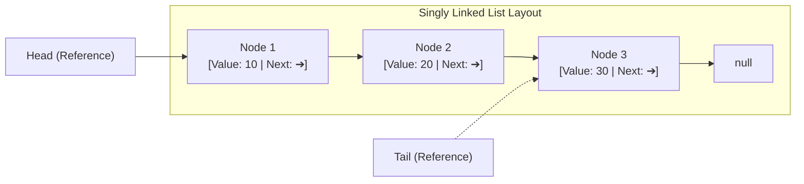
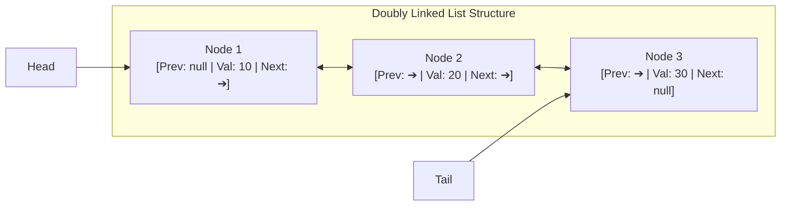
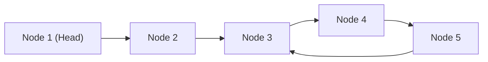
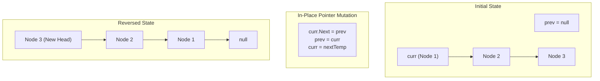
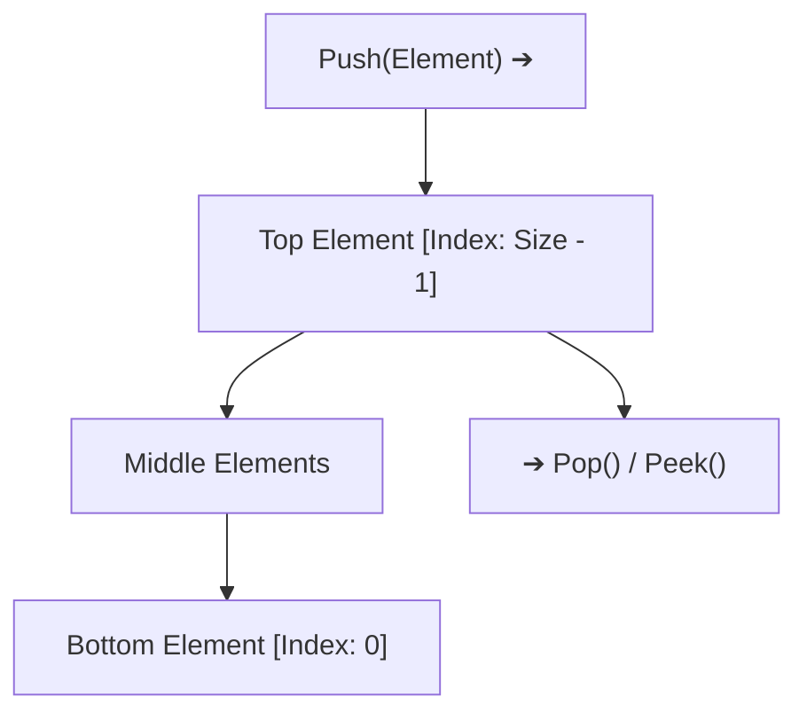
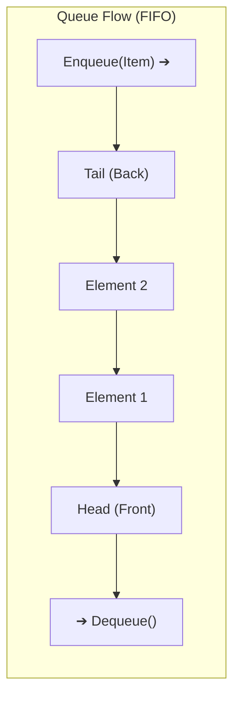
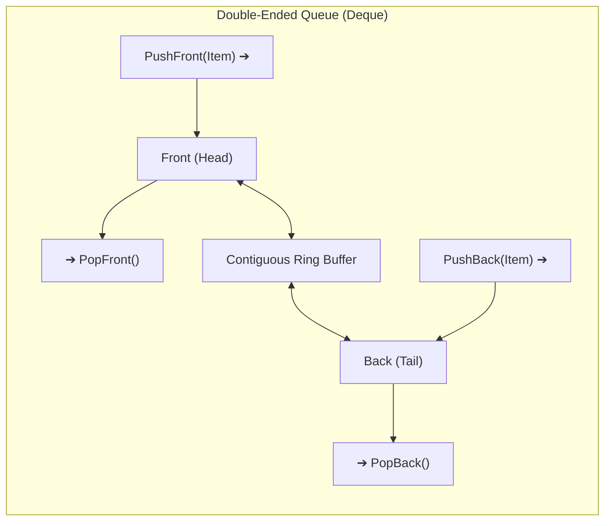

# 03 - Linked Lists, Stacks & Queues

Linear data structures are the foundational building blocks of computer science. While high-level frameworks like .NET provide rich collection abstractions (`List<T>`, `LinkedList<T>`, `Stack<T>`, `Queue<T>`), mastering their internal mechanics, memory layouts, algorithmic patterns, and CPU cache interactions is critical for writing high-performance backend systems and passing senior technical interviews.

---

## 📚 1. Singly Linked List Architecture & Mechanics

A **Singly Linked List** is a linear collection of data elements whose order is not given by their physical placement in memory. Instead, each element (node) contains data and a reference (pointer) to the next node in the sequence.



### 1.1 Node Anatomy & Memory Footprint in .NET

In a 64-bit .NET runtime (CoreCLR), a class-based node incurs object header overhead:

```csharp
public sealed class ListNode<T>
{
    public T Value { get; set; }
    public ListNode<T>? Next { get; set; }

    public ListNode(T value, ListNode<T>? next = null)
    {
        Value = value;
        Next = next;
    }
}
```

```text
64-Bit Heap Layout for ListNode<int> (Total: 32 bytes on SOH):
┌─────────────────────────┬─────────────────────────┬───────────────┬─────────────────────────┬───────────────────┐
│ SyncBlock Index         │ MethodTable Pointer     │ Value (int32) │ Next Pointer (Ref)      │ Alignment Padding │
│ (8 bytes)               │ (8 bytes)               │ (4 bytes)     │ (8 bytes)               │ (4 bytes)         │
└─────────────────────────┴─────────────────────────┴───────────────┴─────────────────────────┴───────────────────┘
```

> [!WARNING]
> Storing 1,000,000 `int` values in a contiguous `int[]` consumes ~4 MB of memory. Storing the same 1,000,000 integers in individual `ListNode<int>` objects consumes **32 MB** of heap memory and creates 1,000,000 independent GC heap allocations, resulting in significant GC pause times and cache thrashing.

---

### 1.2 Complete Generic Singly Linked List Implementation

```csharp
namespace CsFundamentals.LinkedLists;

using System.Collections;

public sealed class SinglyLinkedList<T> : IEnumerable<T>
{
    public sealed class Node
    {
        public T Value { get; set; }
        public Node? Next { get; set; }

        public Node(T value, Node? next = null)
        {
            Value = value;
            Next = next;
        }
    }

    public Node? Head { get; private set; }
    public Node? Tail { get; private set; }
    public int Count { get; private set; }

    public bool IsEmpty => Count == 0;

    /// <summary>
    /// Inserts a new element at the beginning of the list. O(1) Time.
    /// </summary>
    public void AddFirst(T value)
    {
        var newNode = new Node(value, Head);
        Head = newNode;

        if (Tail is null)
        {
            Tail = newNode;
        }

        Count++;
    }

    /// <summary>
    /// Appends a new element to the end of the list. O(1) Time with Tail pointer.
    /// </summary>
    public void AddLast(T value)
    {
        var newNode = new Node(value);

        if (Tail is null)
        {
            Head = newNode;
            Tail = newNode;
        }
        else
        {
            Tail.Next = newNode;
            Tail = newNode;
        }

        Count++;
    }

    /// <summary>
    /// Inserts a value after a specified existing node. O(1) Time.
    /// </summary>
    public void InsertAfter(Node existingNode, T value)
    {
        ArgumentNullException.ThrowIfNull(existingNode);

        var newNode = new Node(value, existingNode.Next);
        existingNode.Next = newNode;

        if (existingNode == Tail)
        {
            Tail = newNode;
        }

        Count++;
    }

    /// <summary>
    /// Removes the first element from the list. O(1) Time.
    /// </summary>
    public bool RemoveFirst()
    {
        if (Head is null)
        {
            return false;
        }

        Head = Head.Next;
        Count--;

        if (Head is null)
        {
            Tail = null;
        }

        return true;
    }

    /// <summary>
    /// Removes the first occurrence of a specific value. O(N) Time.
    /// </summary>
    public bool Remove(T value)
    {
        if (Head is null)
        {
            return false;
        }

        // Case 1: Value is at Head
        if (EqualityComparer<T>.Default.Equals(Head.Value, value))
        {
            return RemoveFirst();
        }

        // Case 2: Value is in middle or tail
        var current = Head;
        while (current.Next is not null)
        {
            if (EqualityComparer<T>.Default.Equals(current.Next.Value, value))
            {
                if (current.Next == Tail)
                {
                    Tail = current;
                }

                current.Next = current.Next.Next;
                Count--;
                return true;
            }

            current = current.Next;
        }

        return false;
    }

    /// <summary>
    /// Searches for a node matching the predicate. O(N) Time.
    /// </summary>
    public Node? Find(Func<T, bool> predicate)
    {
        var current = Head;
        while (current is not null)
        {
            if (predicate(current.Value))
            {
                return current;
            }

            current = current.Next;
        }

        return null;
    }

    public IEnumerator<T> GetEnumerator()
    {
        var current = Head;
        while (current is not null)
        {
            yield return current.Value;
            current = current.Next;
        }
    }

    IEnumerator IEnumerable.GetEnumerator() => GetEnumerator();
}
```

---

## 🔗 2. Doubly Linked List & C# `LinkedList<T>` Deep Dive

A **Doubly Linked List** stores two pointers per node: one pointing forward to `Next`, and one pointing backward to `Previous`.



### 2.1 Advantages & Trade-Offs

| Metric | Singly Linked List | Doubly Linked List |
| :--- | :--- | :--- |
| **Node Memory Overhead** | 8 bytes (`Next` ptr) | 16 bytes (`Prev` + `Next` ptrs) |
| **Traversal Direction** | Forward only | Bidirectional (Forward & Backward) |
| **Delete Given a Node Ref** | $O(N)$ (Must find predecessor) | **$O(1)$** (Direct pointer rewiring) |
| **Insert Before Node Ref** | $O(N)$ (Must find predecessor) | **$O(1)$** (`node.Previous` accessible) |

---

### 2.2 C# `System.Collections.Generic.LinkedList<T>`

In .NET, `LinkedList<T>` is a built-in circular doubly linked list that maintains internal references to `First` and `Last` `LinkedListNode<T>`.

```csharp
using System;
using System.Collections.Generic;

public class LinkedListDemo
{
    public static void Run()
    {
        var list = new LinkedList<string>();

        // O(1) Operations
        LinkedListNode<string> nodeAlice = list.AddFirst("Alice");
        LinkedListNode<string> nodeCharlie = list.AddLast("Charlie");
        
        // O(1) Insertion relative to node
        LinkedListNode<string> nodeBob = list.AddAfter(nodeAlice, "Bob");
        LinkedListNode<string> nodeZack = list.AddBefore(nodeAlice, "Zack");

        // Forward Traversal: Zack -> Alice -> Bob -> Charlie
        foreach (var name in list)
        {
            Console.WriteLine(name);
        }

        // Backward Traversal via LinkedListNode
        var current = list.Last;
        while (current is not null)
        {
            Console.WriteLine($"Reverse: {current.Value}");
            current = current.Previous;
        }

        // O(1) Node Removal when holding node reference
        list.Remove(nodeBob); // Rewires pointers in O(1)

        // O(N) Value Removal (requires linear scan to locate node)
        list.Remove("Alice");
    }
}
```

> [!IMPORTANT]
> A common interview trap: `LinkedList<T>.Remove(T value)` is **$O(N)$** because it must perform an equality scan. However, `LinkedList<T>.Remove(LinkedListNode<T> node)` is **$O(1)$** because both `Previous` and `Next` pointers are immediately known.

---

## 🔍 3. Classic Linked List Algorithms & Patterns

### 3.1 Pattern 1: Fast & Slow Pointer (Floyd's Cycle Detection)

Floyd's Cycle-Finding Algorithm (Tortoise and Hare) uses two pointers moving at different speeds (Slow moves 1 step, Fast moves 2 steps) to detect loops in $O(N)$ time and $O(1)$ space.



```csharp
public static class CycleDetection
{
    public sealed class Node(int val, Node? next = null)
    {
        public int Val { get; set; } = val;
        public Node? Next { get; set; } = next;
    }

    /// <summary>
    /// Detects if a cycle exists in the linked list. O(N) Time, O(1) Space.
    /// </summary>
    public static bool HasCycle(Node? head)
    {
        if (head?.Next is null) return false;

        var slow = head;
        var fast = head;

        while (fast?.Next is not null)
        {
            slow = slow!.Next;
            fast = fast.Next.Next;

            if (ReferenceEquals(slow, fast))
            {
                return true; // Cycle detected
            }
        }

        return false;
    }

    /// <summary>
    /// Finds the starting node of the cycle. O(N) Time, O(1) Space.
    /// </summary>
    public static Node? DetectCycleEntry(Node? head)
    {
        if (head?.Next is null) return null;

        var slow = head;
        var fast = head;
        var hasCycle = false;

        while (fast?.Next is not null)
        {
            slow = slow!.Next;
            fast = fast.Next.Next;

            if (ReferenceEquals(slow, fast))
            {
                hasCycle = true;
                break;
            }
        }

        if (!hasCycle) return null;

        // Reset pointer to head. Move both pointers at 1 step/iteration.
        // They will meet at the cycle entry node.
        var entry = head;
        while (!ReferenceEquals(entry, slow))
        {
            entry = entry!.Next;
            slow = slow!.Next;
        }

        return entry;
    }

    /// <summary>
    /// Finds the middle node of a linked list in a single pass.
    /// </summary>
    public static Node? FindMiddle(Node? head)
    {
        var slow = head;
        var fast = head;

        while (fast?.Next is not null)
        {
            slow = slow!.Next;
            fast = fast.Next.Next;
        }

        return slow;
    }
}
```

---

### 3.2 Pattern 2: In-Place Linked List Reversal

Reversing a singly linked list in-place requires iteratively shifting three pointers: `prev`, `curr`, and `nextTemp`.



```csharp
public static class ListReverser
{
    public sealed class Node(int val, Node? next = null)
    {
        public int Val { get; set; } = val;
        public Node? Next { get; set; } = next;
    }

    /// <summary>
    /// Reverses the singly linked list in-place. O(N) Time, O(1) Space.
    /// </summary>
    public static Node? ReverseListIterative(Node? head)
    {
        Node? prev = null;
        var current = head;

        while (current is not null)
        {
            var nextTemp = current.Next; // 1. Save next node
            current.Next = prev;         // 2. Reverse pointer
            prev = current;              // 3. Step prev forward
            current = nextTemp;          // 4. Step current forward
        }

        return prev; // New head of reversed list
    }

    /// <summary>
    /// Reverses list recursively. O(N) Time, O(N) Call Stack Space.
    /// </summary>
    public static Node? ReverseListRecursive(Node? head)
    {
        if (head?.Next is null)
        {
            return head;
        }

        var newHead = ReverseListRecursive(head.Next);
        head.Next.Next = head;
        head.Next = null;

        return newHead;
    }
}
```

---

### 3.3 Pattern 3: Merging Two Sorted Linked Lists

The **Dummy Head Pattern** simplifies linked list construction by removing special-case logic for initializing the new head.

```csharp
public static class ListMerger
{
    public sealed class Node(int val, Node? next = null)
    {
        public int Val { get; set; } = val;
        public Node? Next { get; set; } = next;
    }

    /// <summary>
    /// Merges two sorted lists into one sorted list. O(N + M) Time, O(1) Space.
    /// </summary>
    public static Node? MergeTwoLists(Node? l1, Node? l2)
    {
        var dummy = new Node(0);
        var tail = dummy;

        while (l1 is not null && l2 is not null)
        {
            if (l1.Val <= l2.Val)
            {
                tail.Next = l1;
                l1 = l1.Next;
            }
            else
            {
                tail.Next = l2;
                l2 = l2.Next;
            }

            tail = tail.Next;
        }

        // Attach remaining nodes
        tail.Next = l1 ?? l2;

        return dummy.Next;
    }
}
```

---

## 🥞 4. Stacks: LIFO Mechanics & C# `Stack<T>`

A **Stack** is a Last-In, First-Out (**LIFO**) linear data structure. Elements are added and removed exclusively from the **Top**.



### 4.1 Array-Backed Stack vs. Linked-List Stack

| Metric | Array-Backed Stack (`System.Collections.Generic.Stack<T>`) | Node-Based Stack |
| :--- | :--- | :--- |
| **Push Complexity** | **Amortized $O(1)$** ($O(N)$ when doubling array) | **Strict $O(1)$** |
| **Pop / Peek Complexity** | **$O(1)$** | **$O(1)$** |
| **Memory Allocation** | Contiguous chunk; minimal GC overhead | 1 object allocation per push |
| **CPU Cache Locality** | **High** (L1/L2 cache pre-fetching friendly) | **Low** (Pointer indirection / cache misses) |

---

### 4.2 C# `Stack<T>` Internal Mechanics

`System.Collections.Generic.Stack<T>` is implemented using a dynamically resizing array `T[] _array`:

```csharp
// Simplified representation of CoreCLR Stack<T> internals
public class CustomStack<T>
{
    private T[] _array;
    private int _size;
    private int _version; // Incremented on every mutation for fail-fast enumerators

    private const int DefaultCapacity = 4;

    public CustomStack(int initialCapacity = DefaultCapacity)
    {
        _array = new T[initialCapacity];
        _size = 0;
    }

    public int Count => _size;

    public void Push(T item)
    {
        if (_size == _array.Length)
        {
            Array.Resize(ref _array, _array.Length == 0 ? DefaultCapacity : 2 * _array.Length);
        }

        _array[_size] = item;
        _size++;
        _version++;
    }

    public T Pop()
    {
        if (_size == 0)
        {
            throw new InvalidOperationException("Stack is empty.");
        }

        _version++;
        _size--;
        T item = _array[_size];
        _array[_size] = default!; // Clear reference to allow GC collection

        return item;
    }

    public T Peek()
    {
        if (_size == 0)
        {
            throw new InvalidOperationException("Stack is empty.");
        }

        return _array[_size - 1];
    }
}
```

---

### 4.3 Practical Stack Applications

#### Application 1: Undo / Redo Command History

```csharp
public interface ICommand
{
    void Execute();
    void Undo();
}

public sealed class UndoRedoManager
{
    private readonly Stack<ICommand> _undoStack = new();
    private readonly Stack<ICommand> _redoStack = new();

    public void ExecuteCommand(ICommand command)
    {
        command.Execute();
        _undoStack.Push(command);
        _redoStack.Clear(); // Executing a new action clears redo branch
    }

    public bool CanUndo => _undoStack.Count > 0;
    public bool CanRedo => _redoStack.Count > 0;

    public void Undo()
    {
        if (!CanUndo) return;

        var command = _undoStack.Pop();
        command.Undo();
        _redoStack.Push(command);
    }

    public void Redo()
    {
        if (!CanRedo) return;

        var command = _redoStack.Pop();
        command.Execute();
        _undoStack.Push(command);
    }
}
```

#### Application 2: Balanced Parentheses / Delimiter Validator

```csharp
public static class ParenthesesValidator
{
    private static readonly Dictionary<char, char> Pairs = new()
    {
        { ')', '(' },
        { '}', '{' },
        { ']', '[' }
    };

    public static bool IsValid(string input)
    {
        var stack = new Stack<char>();

        foreach (var ch in input)
        {
            if (ch is '(' or '{' or '[')
            {
                stack.Push(ch);
            }
            else if (Pairs.TryGetValue(ch, out var matchingOpen))
            {
                if (stack.Count == 0 || stack.Pop() != matchingOpen)
                {
                    return false;
                }
            }
        }

        return stack.Count == 0;
    }
}
```

#### Application 3: Arithmetic Expression Evaluation (RPN / Postfix)

```csharp
public static class ExpressionEvaluator
{
    public static double EvaluatePostfix(IEnumerable<string> tokens)
    {
        var stack = new Stack<double>();

        foreach (var token in tokens)
        {
            if (double.TryParse(token, out var number))
            {
                stack.Push(number);
            }
            else
            {
                if (stack.Count < 2)
                    throw new InvalidOperationException("Malformed expression.");

                double right = stack.Pop();
                double left = stack.Pop();

                double result = token switch
                {
                    "+" => left + right,
                    "-" => left - right,
                    "*" => left * right,
                    "/" => left / right,
                    "^" => Math.Pow(left, right),
                    _ => throw new NotSupportedException($"Operator {token} is not supported.")
                };

                stack.Push(result);
            }
        }

        return stack.Pop();
    }
}
```

---

## 🚶 5. Queues: FIFO Mechanics & C# `Queue<T>`

A **Queue** is a First-In, First-Out (**FIFO**) linear data structure. Elements enter at the **Tail (Enqueue)** and exit at the **Head (Dequeue)**.



### 5.1 Circular Buffer (Ring Buffer) Mechanics

In .NET, `System.Collections.Generic.Queue<T>` does not shift elements in memory when dequeuing (which would be $O(N)$). Instead, it implements a **Circular Array Buffer** using `_head` and `_tail` indices wrapped modulo array capacity.

```text
Circular Array State (Capacity = 8, Elements = 4):
Index:     0      1      2      3      4      5      6      7
Data:   [ D ]  [   ]  [   ]  [   ]  [   ]  [ A ]  [ B ]  [ C ]
                 ▲                             ▲
                 │                             │
              _tail (1)                     _head (5)

• Enqueue: _array[_tail] = item; _tail = (_tail + 1) % _capacity;
• Dequeue: item = _array[_head]; _head = (_head + 1) % _capacity;
• Both operations are strictly O(1) Time!
```

---

### 5.2 Circular Queue Implementation in C# (.NET)

```csharp
namespace CsFundamentals.Queues;

public sealed class CircularQueue<T>
{
    private T[] _array;
    private int _head;
    private int _tail;
    private int _size;
    private const int DefaultCapacity = 4;

    public CircularQueue(int initialCapacity = DefaultCapacity)
    {
        _array = new T[initialCapacity];
    }

    public int Count => _size;
    public bool IsEmpty => _size == 0;

    public void Enqueue(T item)
    {
        if (_size == _array.Length)
        {
            GrowCapacity();
        }

        _array[_tail] = item;
        _tail = (_tail + 1) % _array.Length;
        _size++;
    }

    public T Dequeue()
    {
        if (_size == 0)
        {
            throw new InvalidOperationException("Queue is empty.");
        }

        T removed = _array[_head];
        _array[_head] = default!; // Avoid memory leaks for reference types
        _head = (_head + 1) % _array.Length;
        _size--;

        return removed;
    }

    public T Peek()
    {
        if (_size == 0)
        {
            throw new InvalidOperationException("Queue is empty.");
        }

        return _array[_head];
    }

    private void GrowCapacity()
    {
        int newCapacity = _array.Length == 0 ? DefaultCapacity : _array.Length * 2;
        var newArray = new T[newCapacity];

        if (_size > 0)
        {
            if (_head < _tail)
            {
                Array.Copy(_array, _head, newArray, 0, _size);
            }
            else
            {
                // Elements are wrapped around the end of the array
                int elementsToEnd = _array.Length - _head;
                Array.Copy(_array, _head, newArray, 0, elementsToEnd);
                Array.Copy(_array, 0, newArray, elementsToEnd, _tail);
            }
        }

        _array = newArray;
        _head = 0;
        _tail = _size == newCapacity ? 0 : _size;
    }
}
```

---

### 5.3 Practical Queue Applications

#### Application 1: Breadth-First Search (BFS) Traversal

```csharp
public sealed class TreeNode(int val, List<TreeNode>? children = null)
{
    public int Val { get; set; } = val;
    public List<TreeNode> Children { get; } = children ?? [];
}

public static class TreeAlgorithms
{
    public static List<List<int>> LevelOrderTraversal(TreeNode? root)
    {
        var result = new List<List<int>>();
        if (root is null) return result;

        var queue = new Queue<TreeNode>();
        queue.Enqueue(root);

        while (queue.Count > 0)
        {
            int levelSize = queue.Count;
            var currentLevel = new List<int>(levelSize);

            for (int i = 0; i < levelSize; i++)
            {
                var node = queue.Dequeue();
                currentLevel.Add(node.Val);

                foreach (var child in node.Children)
                {
                    queue.Enqueue(child);
                }
            }

            result.Add(currentLevel);
        }

        return result;
    }
}
```

#### Application 2: Sliding Window Rate Limiter

```csharp
using System.Collections.Concurrent;

public sealed class SlidingWindowRateLimiter
{
    private readonly int _maxRequests;
    private readonly TimeSpan _window;
    private readonly ConcurrentDictionary<string, Queue<DateTimeOffset>> _userLogs = new();

    public SlidingWindowRateLimiter(int maxRequests, TimeSpan window)
    {
        _maxRequests = maxRequests;
        _window = window;
    }

    public bool AllowRequest(string clientId)
    {
        var now = DateTimeOffset.UtcNow;
        var cutoff = now - _window;

        var queue = _userLogs.GetOrAdd(clientId, _ => new Queue<DateTimeOffset>());

        lock (queue)
        {
            // Evict outdated timestamps from the head of the queue
            while (queue.Count > 0 && queue.Peek() <= cutoff)
            {
                queue.Dequeue();
            }

            if (queue.Count < _maxRequests)
            {
                queue.Enqueue(now);
                return true;
            }

            return false;
        }
    }
}
```

---

## 🔄 6. Deque (Double-Ended Queue): Concepts & .NET Implementations

A **Deque** (Double-Ended Queue, pronounced *"deck"*) allows $O(1)$ insertion and deletion at both ends (**Front** and **Back**).



### 6.1 Why Doesn't .NET Have a Built-In `Deque<T>`?

While Java has `ArrayDeque<E>` and C++ has `std::deque`, .NET does not ship with a standalone `System.Collections.Generic.Deque<T>`:

1. `LinkedList<T>` can fulfill Deque requirements (`AddFirst`, `AddLast`, `RemoveFirst`, `RemoveLast`), but causes GC overhead.
2. For high-throughput scenarios, developers implement an Array-backed circular Deque.

---

### 6.2 High-Performance Dynamic Array `Deque<T>` Implementation

```csharp
namespace CsFundamentals.Deques;

public sealed class Deque<T>
{
    private T[] _buffer;
    private int _head; // Points to the index of the first element
    private int _tail; // Points to the index where the next back element will be placed
    private int _count;
    private const int DefaultCapacity = 8;

    public Deque(int capacity = DefaultCapacity)
    {
        _buffer = new T[capacity];
        _head = 0;
        _tail = 0;
        _count = 0;
    }

    public int Count => _count;
    public bool IsEmpty => _count == 0;

    public void PushFront(T item)
    {
        if (_count == _buffer.Length)
        {
            EnsureCapacity();
        }

        // Decrement head circularly
        _head = (_head - 1 + _buffer.Length) % _buffer.Length;
        _buffer[_head] = item;
        _count++;
    }

    public void PushBack(T item)
    {
        if (_count == _buffer.Length)
        {
            EnsureCapacity();
        }

        _buffer[_tail] = item;
        _tail = (_tail + 1) % _buffer.Length;
        _count++;
    }

    public T PopFront()
    {
        if (_count == 0)
        {
            throw new InvalidOperationException("Deque is empty.");
        }

        T item = _buffer[_head];
        _buffer[_head] = default!;
        _head = (_head + 1) % _buffer.Length;
        _count--;

        return item;
    }

    public T PopBack()
    {
        if (_count == 0)
        {
            throw new InvalidOperationException("Deque is empty.");
        }

        _tail = (_tail - 1 + _buffer.Length) % _buffer.Length;
        T item = _buffer[_tail];
        _buffer[_tail] = default!;
        _count--;

        return item;
    }

    public T PeekFront()
    {
        if (_count == 0) throw new InvalidOperationException("Deque is empty.");
        return _buffer[_head];
    }

    public T PeekBack()
    {
        if (_count == 0) throw new InvalidOperationException("Deque is empty.");
        int lastIndex = (_tail - 1 + _buffer.Length) % _buffer.Length;
        return _buffer[lastIndex];
    }

    private void EnsureCapacity()
    {
        int newCapacity = _buffer.Length * 2;
        var newBuffer = new T[newCapacity];

        for (int i = 0; i < _count; i++)
        {
            newBuffer[i] = _buffer[(_head + i) % _buffer.Length];
        }

        _buffer = newBuffer;
        _head = 0;
        _tail = _count;
    }
}
```

---

## ⚡ 7. Comprehensive Complexity Comparison Matrix

| Data Structure | Access `[i]` | Search (Val) | Prepend (Front) | Append (Back) | Insertion (Middle) | Deletion (Front) | Deletion (Back) | Deletion (Middle) | Space Complexity |
| :--- | :--- | :--- | :--- | :--- | :--- | :--- | :--- | :--- | :--- |
| **Array (`T[]`)** | **$O(1)$** | $O(N)$ | $O(N)$ | $O(1)^*$ | $O(N)$ | $O(N)$ | $O(1)$ | $O(N)$ | $O(N)$ |
| **`List<T>`** | **$O(1)$** | $O(N)$ | $O(N)$ | **$O(1)$ amortized** | $O(N)$ | $O(N)$ | **$O(1)$** | $O(N)$ | $O(N)$ |
| **Singly Linked List** | $O(N)$ | $O(N)$ | **$O(1)$** | **$O(1)$ (with Tail)** | $O(1)^{\dagger}$ | **$O(1)$** | $O(N)$ | $O(1)^{\dagger}$ | $O(N) + \text{ptrs}$ |
| **Doubly Linked List** | $O(N)$ | $O(N)$ | **$O(1)$** | **$O(1)$** | **$O(1)^{\dagger}$** | **$O(1)$** | **$O(1)$** | **$O(1)^{\dagger}$** | $O(N) + 2\times\text{ptrs}$ |
| **Stack (`Stack<T>`)** | N/A | $O(N)$ | N/A | **$O(1)$ (Push)** | N/A | N/A | **$O(1)$ (Pop)** | N/A | $O(N)$ |
| **Queue (`Queue<T>`)** | N/A | $O(N)$ | N/A | **$O(1)$ (Enqueue)** | N/A | **$O(1)$ (Dequeue)** | N/A | N/A | $O(N)$ |
| **Deque (`Deque<T>`)** | $O(1)^{\ddagger}$ | $O(N)$ | **$O(1)$** | **$O(1)$** | $O(N)$ | **$O(1)$** | **$O(1)$** | $O(N)$ | $O(N)$ |

- $^*$ *Fixed size array requires allocation and copying for resize.*
- $^{\dagger}$ *Assuming a direct reference to the target node is already held.*
- $^{\ddagger}$ *If implemented using a circular array with index arithmetic `(_head + i) % capacity`.*

---

## 🎯 8. Senior .NET Technical Interview Q&A

### Q1: Why does `List<T>` almost always outperform `LinkedList<T>` in real-world C# applications, even for insertions?

**Answer:**

1. **CPU Cache Locality**: `List<T>` uses contiguous array storage. When the CPU reads an element, modern hardware pre-fetches the entire cache line (typically 64 bytes) into L1/L2 cache. Iterating over an array is nearly instantaneous. `LinkedList<T>` stores each node independently on the managed heap; chasing pointers causes frequent CPU cache misses.
2. **GC & Memory Overhead**: Each `LinkedListNode<T>` in a 64-bit CLR requires 40+ bytes (16B header + 8B `Value` + 8B `Next` + 8B `Prev`). For 1 million items, `LinkedList<T>` creates 1 million individual objects on Gen 0, dramatically increasing GC collection latency.

---

### Q2: How does `System.Collections.Generic.Queue<T>` achieve $O(1)$ dequeue without leaving memory holes or shifting array elements?

**Answer:**
`Queue<T>` implements a **circular array ring buffer**. It tracks `_head`, `_tail`, and `_size`.

- When dequeuing, the element at `_array[_head]` is set to `default!`, and `_head` is advanced via `_head = (_head + 1) % _array.Length`.
- No array elements are shifted, resulting in a strict $O(1)$ time complexity.
- Array resizing only occurs when `_size == _array.Length`, at which point elements are copied into a contiguous unwrapped order in the new buffer.

---

### Q3: When should you use `Channel<T>` or `ConcurrentQueue<T>` instead of `Queue<T>` in .NET?

**Answer:**

- **`Queue<T>`**: Non-thread-safe. Fast for single-threaded workflows.
- **`ConcurrentQueue<T>`**: Lock-free, multi-producer multi-consumer thread-safe collection utilizing linked segment ring buffers (`ConcurrentQueueSegment<T>`).
- **`System.Threading.Channels.Channel<T>`**: High-performance asynchronous producer-consumer queue designed for `async`/`await` pipelines. Unlike `ConcurrentQueue<T>`, `Channel<T>` natively supports backpressure (`BoundedChannelOptions`), non-blocking asynchronous reads (`await reader.ReadAsync()`), and cancellation tokens without thread spinning.

---

### Q4: What is the fail-fast behavior in `Stack<T>` and `LinkedList<T>` enumerators?

**Answer:**
Every standard generic collection maintains an internal integer `_version`.

- Any mutating operation (`Push`, `Pop`, `AddFirst`, `Remove`) increments `_version++`.
- When `GetEnumerator()` is called, the enumerator captures the current version.
- On each `MoveNext()`, it verifies `if (version != _currentCollectionVersion) throw new InvalidOperationException("Collection was modified; enumeration operation may not execute.")`.

---

## 🗺️ What's Next?

Proceed to the next module in the CS Fundamentals track:

- [04-trees-and-binary-search-trees.md](./04-trees-and-binary-search-trees.md) — Binary Search Trees, AVL Trees, Red-Black Trees, and Trie data structures in .NET.
