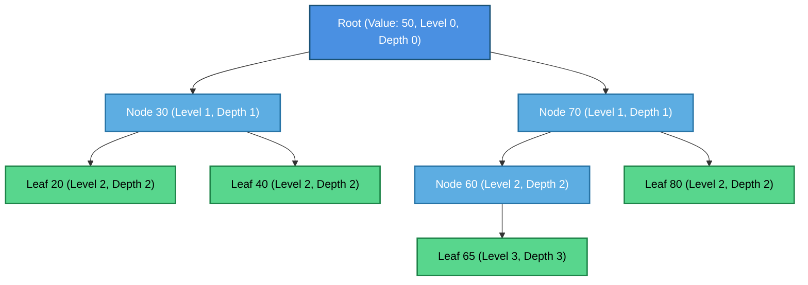
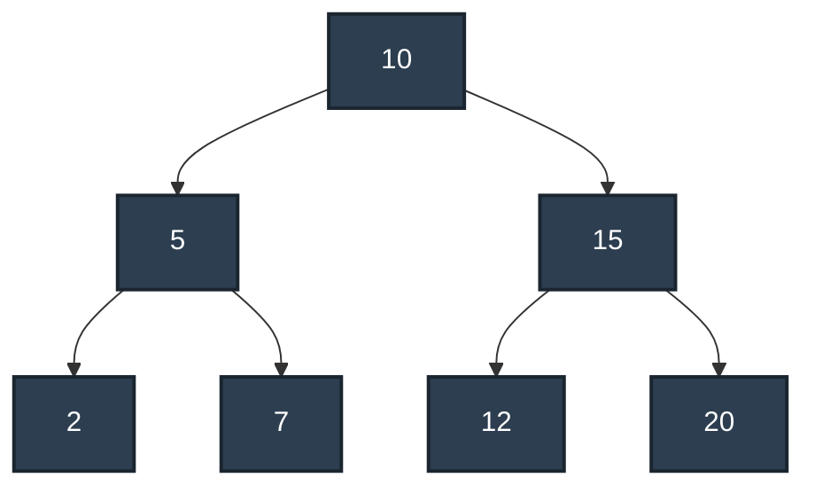
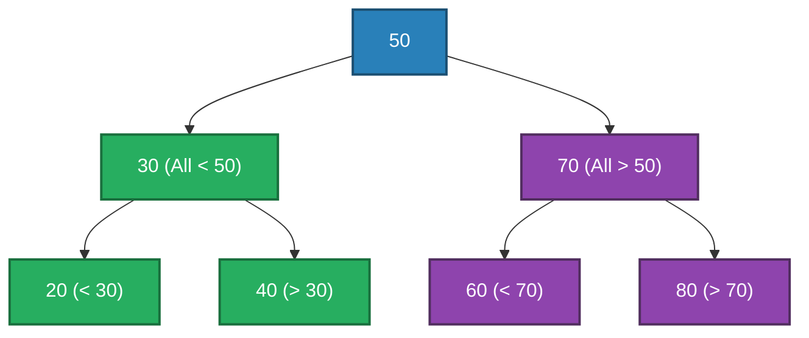
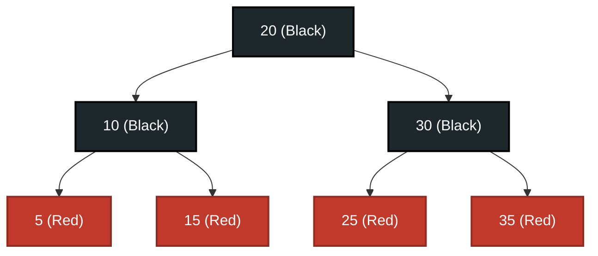
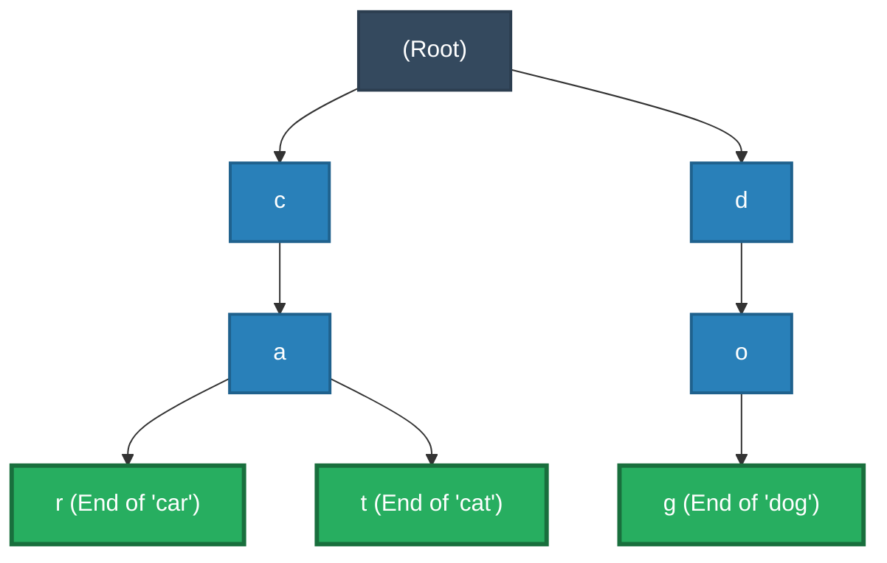

# 04 - Trees & Binary Search Trees (BST): Architecture, Traversals, Self-Balancing & Interview Mastery

Trees are non-linear, hierarchical data structures fundamental to computer science and enterprise software engineering. From the **Roslyn C# compiler's Abstract Syntax Trees (AST)** and **ASP.NET Core's Trie-based route matching** to **SQL Server / PostgreSQL B+ Tree database indexes** and **CoreCLR's Red-Black tree collections (`SortedDictionary<TKey, TValue>`)**, trees are ubiquitous across the modern .NET ecosystem.

This module provides an in-depth exploration of tree terminology, binary tree variations, tree traversals, binary search tree mechanics, self-balancing architectures (AVL & Red-Black), Prefix Trees (Trie), and high-frequency technical interview patterns implemented in modern C# (.NET 10).

---

## 📚 1. Tree Terminology & Hierarchical Anatomy

Unlike linear data structures (arrays, linked lists, stacks, queues) where elements are arranged sequentially, a **Tree** organizes data in a hierarchical parent-child relationship.



### Core Terminology Definitions

| Term | Definition | Example from Diagram |
| :--- | :--- | :--- |
| **Node** | A data container storing a value and references/pointers to child nodes. | Node `50`, Node `30`, Node `65` |
| **Edge** | The directional link connecting a parent node to a child node. | Link between `50` and `30` |
| **Root** | The topmost node in a tree with no incoming edges (no parent). | Node `50` |
| **Parent** | A node that has one or more outgoing links to subordinate nodes. | `70` is the parent of `60` and `80` |
| **Child** | A node directly connected to a predecessor node when moving away from root. | `60` is a child of `70` |
| **Sibling** | Nodes that share the exact same immediate parent node. | `20` and `40` (both children of `30`) |
| **Leaf (External Node)** | A terminal node having **0** children. | Nodes `20`, `40`, `65`, `80` |
| **Internal Node** | A non-leaf node with at least **1** child. | Nodes `50`, `30`, `70`, `60` |
| **Subtree** | Any node together with all of its descendants, forming a valid tree itself. | Subtree rooted at `30` (`{30, 20, 40}`) |
| **Depth of a Node** | Number of edges on the path from the **Root** to that specific node. | Depth of `50` = 0; Depth of `65` = 3 |
| **Height of a Node** | Number of edges on the longest downward path from that node to a **Leaf**. | Height of `70` = 2; Height of `65` = 0 |
| **Height of a Tree** | The height of the Root node (longest path from root to any leaf). | Height of tree = 3 |
| **Level** | Position in hierarchy, typically defined as $\text{Depth} + 1$ (or 0-indexed as Depth). | Level 0 (`50`), Level 1 (`30`, `70`), etc. |
| **Degree of a Node** | The number of direct children the node possesses. | Degree of `30` = 2; Degree of `60` = 1 |
| **Degree of a Tree** | The maximum degree of any node in the tree. | Degree = 2 (Binary Tree) |

> [!NOTE]
> **Depth vs. Height Confusion**:
>
> - **Depth** is measured **top-down** (from Root $\to$ Node). The Root has Depth = 0.
> - **Height** is measured **bottom-up** (from Node $\to$ Deepest Leaf). Leaves have Height = 0.

---

## 🌲 2. Binary Trees: Architectures & Classifications

A **Binary Tree** is a tree data structure in which each node has **at most two children**, referred to as the `Left` child and `Right` child.

### Generic Binary Tree Node Representation in C# (.NET 10)

```csharp
namespace DataStructures.Trees;

/// <summary>
/// Represents a strongly-typed node in a binary tree hierarchy.
/// </summary>
/// <typeparam name="T">The payload data type.</typeparam>
public sealed class TreeNode<T>
{
    public T Value { get; set; }
    public TreeNode<T>? Left { get; set; }
    public TreeNode<T>? Right { get; set; }

    public TreeNode(T value, TreeNode<T>? left = null, TreeNode<T>? right = null)
    {
        Value = value;
        Left = left;
        Right = right;
    }

    public bool IsLeaf => Left is null && Right is null;
}
```

### Binary Tree Classifications

```text
┌─────────────────────────┬─────────────────────────┬─────────────────────────┬─────────────────────────┐
│     Full Binary Tree    │  Complete Binary Tree   │   Perfect Binary Tree   │   Balanced Binary Tree  │
├─────────────────────────┼─────────────────────────┼─────────────────────────┼─────────────────────────┤
│           (1)           │           (1)           │           (1)           │           (1)           │
│          /   \          │          /   \          │          /   \          │          /   \          │
│        (2)   (3)        │        (2)   (3)        │        (2)   (3)        │        (2)   (3)        │
│             /   \       │       /   \  /          │       / \   / \         │       /                 │
│           (4)   (5)     │     (4)  (5)(6)         │     (4) (5)(6) (7)      │     (4)                 │
│                         │                         │                         │                         │
│ Every node has 0 or 2   │ All levels full except  │ All interior nodes have │ |Height(L) - Height(R)| │
│ children (strictly no   │ last, which is filled   │ 2 children; all leaves  │ <= 1 for EVERY node in  │
│ 1-child nodes).         │ from left to right.     │ are at the same depth.  │ the entire tree.        │
└─────────────────────────┴─────────────────────────┴─────────────────────────┴─────────────────────────┘
```

### Detailed Structural Properties

1. **Full Binary Tree (Strict / Proper)**:
   - Every node has either **0** or **2** children.
   - If a full binary tree has $L$ leaves, it has $I = L - 1$ internal nodes and $N = 2L - 1$ total nodes.

2. **Complete Binary Tree**:
   - Every level, except possibly the last, is completely filled.
   - All nodes in the last level are positioned as far left as possible.
   - **Critical Engineering Application**: This layout allows complete binary trees to be represented compactly as contiguous flat arrays without pointers (e.g., in `System.Collections.Generic.PriorityQueue<TElement, TPriority>` and Binary Heaps).
     - Node at index $i$: Left child at $2i + 1$, Right child at $2i + 2$, Parent at $\lfloor (i - 1) / 2 \rfloor$.

3. **Perfect Binary Tree**:
   - Both full and complete where all leaf nodes reside at the exact same lowest level.
   - For height $h$, total nodes $N = 2^{h+1} - 1$ and total leaves $L = 2^h$.

4. **Balanced Binary Tree (AVL / Red-Black condition)**:
   - For every node in the tree, the absolute difference between the height of the left subtree and right subtree is at most 1 ($\text{Balance Factor} \in \{-1, 0, 1\}$).
   - Guarantees $O(\log n)$ maximum height and prevents worst-case linear degradation.

5. **Degenerate (Pathological) Tree**:
   - Each internal node has only one child. Structurally identical to a singly linked list with $O(n)$ access time.

---

## 🔄 3. Tree Traversals (DFS & BFS) with C# Implementations

Unlike linear arrays traversed sequentially, hierarchical tree traversal requires systematic algorithms to visit every node exactly once. Traversals fall into two major categories: **Depth-First Search (DFS)** and **Breadth-First Search (BFS)**.



For the tree above:

- **Pre-Order (Root $\to$ Left $\to$ Right)**: `[10, 5, 2, 7, 15, 12, 20]`
- **In-Order (Left $\to$ Root $\to$ Right)**: `[2, 5, 7, 10, 12, 15, 20]` *(Sorted order in a BST!)*
- **Post-Order (Left $\to$ Right $\to$ Root)**: `[2, 7, 5, 12, 20, 15, 10]`
- **Level-Order (BFS Top-to-Bottom)**: `[10, 5, 15, 2, 7, 12, 20]`

---

### A. Depth-First Search (DFS)

#### 1. Pre-Order Traversal (`Root -> Left -> Right`)

- **Primary Use Cases**: Creating a deep copy/clone of a tree, serializing/deserializing tree structures, prefix expression evaluation.

```csharp
public static class TreeTraversals
{
    // Recursive Pre-Order
    public static void PreOrderRecursive<T>(TreeNode<T>? root, Action<T> visit)
    {
        if (root is null) return;

        visit(root.Value);                     // 1. Process Root
        PreOrderRecursive(root.Left, visit);   // 2. Traverse Left Subtree
        PreOrderRecursive(root.Right, visit);  // 3. Traverse Right Subtree
    }

    // Iterative Pre-Order using explicit Stack (Prevents StackOverflowException on deep trees)
    public static IEnumerable<T> PreOrderIterative<T>(TreeNode<T>? root)
    {
        if (root is null) yield break;

        var stack = new Stack<TreeNode<T>>();
        stack.Push(root);

        while (stack.Count > 0)
        {
            var current = stack.Pop();
            yield return current.Value;

            // Push Right child first so Left child is popped and processed first (LIFO)
            if (current.Right is not null)
                stack.Push(current.Right);

            if (current.Left is not null)
                stack.Push(current.Left);
        }
    }
}
```

#### 2. In-Order Traversal (`Left -> Root -> Right`)

- **Primary Use Cases**: Retrieves all elements of a Binary Search Tree (BST) in **strictly ascending sorted order**. Used extensively in BST validation and k-th smallest element retrieval.

```csharp
// Recursive In-Order
public static void InOrderRecursive<T>(TreeNode<T>? root, Action<T> visit)
{
    if (root is null) return;

    InOrderRecursive(root.Left, visit);    // 1. Traverse Left Subtree
    visit(root.Value);                     // 2. Process Root
    InOrderRecursive(root.Right, visit);   // 3. Traverse Right Subtree
}

// Iterative In-Order using Stack (Emulates Call Stack)
public static IEnumerable<T> InOrderIterative<T>(TreeNode<T>? root)
{
    var stack = new Stack<TreeNode<T>>();
    var current = root;

    while (current is not null || stack.Count > 0)
    {
        // Reach the leftmost node of the current subtree
        while (current is not null)
        {
            stack.Push(current);
            current = current.Left;
        }

        current = stack.Pop();
        yield return current.Value;

        // Shift focus to right subtree
        current = current.Right;
    }
}
```

#### 3. Post-Order Traversal (`Left -> Right -> Root`)

- **Primary Use Cases**: Deleting/disposing nodes in bottom-up order, calculating disk directory sizes, Postfix (Reverse Polish Notation) expressions.

```csharp
// Recursive Post-Order
public static void PostOrderRecursive<T>(TreeNode<T>? root, Action<T> visit)
{
    if (root is null) return;

    PostOrderRecursive(root.Left, visit);   // 1. Traverse Left Subtree
    PostOrderRecursive(root.Right, visit);  // 2. Traverse Right Subtree
    visit(root.Value);                      // 3. Process Root
}

// Iterative Post-Order using Two Stacks (or One Stack with reverse post-order)
public static IEnumerable<T> PostOrderIterative<T>(TreeNode<T>? root)
{
    if (root is null) yield break;

    var traversalStack = new Stack<TreeNode<T>>();
    var outputStack = new Stack<T>();
    traversalStack.Push(root);

    while (traversalStack.Count > 0)
    {
        var current = traversalStack.Pop();
        outputStack.Push(current.Value);

        // Push Left first, then Right, so Right is popped first into outputStack
        if (current.Left is not null)
            traversalStack.Push(current.Left);

        if (current.Right is not null)
            traversalStack.Push(current.Right);
    }

    while (outputStack.Count > 0)
    {
        yield return outputStack.Pop();
    }
}
```

---

### B. Breadth-First Search (BFS) / Level-Order Traversal

BFS explores the tree level by level, from left to right, utilizing a **First-In, First-Out (`Queue<T>`)** data structure.

- **Primary Use Cases**: Finding the shortest path in unweighted graphs/trees, tree level-by-level printing, serialization.

```csharp
// Standard Level-Order Traversal (BFS)
public static IEnumerable<T> LevelOrder<T>(TreeNode<T>? root)
{
    if (root is null) yield break;

    var queue = new Queue<TreeNode<T>>();
    queue.Enqueue(root);

    while (queue.Count > 0)
    {
        var current = queue.Dequeue();
        yield return current.Value;

        if (current.Left is not null)
            queue.Enqueue(current.Left);

        if (current.Right is not null)
            queue.Enqueue(current.Right);
    }
}

// Level-by-Level Grouping (Returns List of elements for each depth level)
public static List<List<T>> LevelOrderGrouped<T>(TreeNode<T>? root)
{
    var result = new List<List<T>>();
    if (root is null) return result;

    var queue = new Queue<TreeNode<T>>();
    queue.Enqueue(root);

    while (queue.Count > 0)
    {
        int levelSize = queue.Count; // Snapshot current level node count
        var currentLevel = new List<T>(capacity: levelSize);

        for (int i = 0; i < levelSize; i++)
        {
            var node = queue.Dequeue();
            currentLevel.Add(node.Value);

            if (node.Left is not null)
                queue.Enqueue(node.Left);
            if (node.Right is not null)
                queue.Enqueue(node.Right);
        }

        result.Add(currentLevel);
    }

    return result;
}
```

### Traversal Performance Matrix

| Traversal Strategy | Mechanism | Time Complexity | Space Complexity (Balanced) | Space Complexity (Worst/Skewed) |
| :--- | :--- | :--- | :--- | :--- |
| **Pre-Order (DFS)** | Stack / LIFO | $O(n)$ | $O(\log n)$ | $O(n)$ |
| **In-Order (DFS)** | Stack / LIFO | $O(n)$ | $O(\log n)$ | $O(n)$ |
| **Post-Order (DFS)** | Stack / LIFO | $O(n)$ | $O(\log n)$ | $O(n)$ |
| **Level-Order (BFS)** | Queue / FIFO | $O(n)$ | $O(w) \approx O(n/2)$ | $O(1)$ (for a linked list) |

*(Where $n$ = total nodes, $h$ = tree height, $w$ = maximum tree width).*

---

## ⚡ 4. Binary Search Tree (BST): The Invariant & CRUD Mechanics

A **Binary Search Tree (BST)** is a binary tree with an ordering property that enables binary search operations.

### The BST Invariant Rule

For every node $X$ in the tree:

1. All values in the **Left Subtree** of $X$ are **strictly less than** $X.\text{Value}$ ($\text{Left}.v < X.v$).
2. All values in the **Right Subtree** of $X$ are **strictly greater than** $X.\text{Value}$ ($\text{Right}.v > X.v$).
3. Both left and right subtrees must also be valid Binary Search Trees.



---

### Complete Production-Ready C# BST Implementation

```csharp
namespace DataStructures.Trees;

/// <summary>
/// High-performance generic Binary Search Tree implementation with full CRUD capabilities.
/// </summary>
public sealed class BinarySearchTree<T> where T : IComparable<T>
{
    public TreeNode<T>? Root { get; private set; }
    public int Count { get; private set; }

    // 1. SEARCH: O(log n) average, O(n) worst-case
    public bool Contains(T value)
    {
        var current = Root;
        while (current is not null)
        {
            int comparison = value.CompareTo(current.Value);
            if (comparison == 0)
                return true;

            current = comparison < 0 ? current.Left : current.Right;
        }

        return false;
    }

    // 2. INSERT: O(log n) average, O(n) worst-case
    public bool Insert(T value)
    {
        if (Root is null)
        {
            Root = new TreeNode<T>(value);
            Count++;
            return true;
        }

        var current = Root;
        while (true)
        {
            int comparison = value.CompareTo(current.Value);
            if (comparison == 0)
            {
                // Duplicate values are rejected (or updated depending on use-case)
                return false;
            }

            if (comparison < 0)
            {
                if (current.Left is null)
                {
                    current.Left = new TreeNode<T>(value);
                    Count++;
                    return true;
                }
                current = current.Left;
            }
            else
            {
                if (current.Right is null)
                {
                    current.Right = new TreeNode<T>(value);
                    Count++;
                    return true;
                }
                current = current.Right;
            }
        }
    }

    // 3. DELETE: O(log n) average, O(n) worst-case
    public bool Delete(T value)
    {
        int initialCount = Count;
        Root = DeleteRecursive(Root, value);
        return Count < initialCount;
    }

    private TreeNode<T>? DeleteRecursive(TreeNode<T>? node, T value)
    {
        if (node is null) return null;

        int comparison = value.CompareTo(node.Value);

        if (comparison < 0)
        {
            node.Left = DeleteRecursive(node.Left, value);
        }
        else if (comparison > 0)
        {
            node.Right = DeleteRecursive(node.Right, value);
        }
        else
        {
            // Match found! Handle the 3 deletion cases:
            Count--;

            // Case 1: Node is a leaf (no children)
            if (node.Left is null && node.Right is null)
            {
                return null;
            }

            // Case 2: Node has only one child
            if (node.Left is null) return node.Right;
            if (node.Right is null) return node.Left;

            // Case 3: Node has two children
            // Find In-Order Successor (smallest node in Right subtree)
            var successor = FindMinNode(node.Right);

            // Copy successor's value into current node
            node.Value = successor.Value;

            // Increment count temporarily as DeleteRecursive will decrement it
            Count++;

            // Recursively delete the in-order successor from the right subtree
            node.Right = DeleteRecursive(node.Right, successor.Value);
        }

        return node;
    }

    private static TreeNode<T> FindMinNode(TreeNode<T> node)
    {
        var current = node;
        while (current.Left is not null)
        {
            current = current.Left;
        }
        return current;
    }
}
```

### The 3 Node Deletion Cases Visualized

```text
CASE 1: Delete Leaf Node (e.g., Delete 20)
Before:   30                After:   30
         /  \                         \
       (20)  40                        40
Action: Set Parent.Left = null.

CASE 2: Delete Node with One Child (e.g., Delete 60)
Before:   70                After:   70
         /  \                       /  \
       (60)  80                    65   80
         \
          65
Action: Link Parent (70) directly to Grandchild (65), bypassing 60.

CASE 3: Delete Node with Two Children (e.g., Delete 50)
Before:        (50) [Target]
              /    \
            30      70
                   /  \
                 [60]  80  <-- In-Order Successor is 60 (Min node in Right Subtree)
                   \
                    65

Step 1: Replace Target value (50) with Successor value (60).
Step 2: Recursively delete 60 from Right Subtree (reduces to Case 1 or 2).

After:          60
              /    \
            30      70
                   /  \
                  65   80
```

---

## ⚠️ 5. BST Degeneracy: The $O(n)$ Skew Problem

A major weakness of a naive Binary Search Tree is its vulnerability to insertion order.

When sequentially ordered data is inserted into an unbalance-aware BST (e.g., `1, 2, 3, 4, 5` or `5, 4, 3, 2, 1`), the tree degenerates into a **Pathological / Skewed Tree**.

```text
Balanced BST (Optimal Insert Order: 3, 1, 5, 0, 2, 4, 6)
                  (3)             Height: h = floor(log2(7)) = 2
                /     \           Search Time: O(log n)
              (1)     (5)
             /   \   /   \
           (0)  (2) (4)  (6)

Degenerate BST (Skewed Insert Order: 0, 1, 2, 3, 4, 5, 6)
           (0)
             \
             (1)                  Height: h = n - 1 = 6
               \                  Search Time: O(n) (Linked List!)
               (2)                Risk: StackOverflowException on recursion
                 \
                 (3)
                   \
                   (4)
                     \
                     (5)
                       \
                       (6)
```

### Complexity Comparison

| Operation | Balanced BST ($h = \log n$) | Degenerate BST ($h = n$) |
| :--- | :--- | :--- |
| **Search** | $O(\log n)$ | $O(n)$ |
| **Insert** | $O(\log n)$ | $O(n)$ |
| **Delete** | $O(\log n)$ | $O(n)$ |
| **Space (Recursion Stack)** | $O(\log n)$ | $O(n)$ |

To prevent this catastrophic degradation in production systems, **Self-Balancing Binary Search Trees** dynamically rebalance during mutations.

---

## ⚖️ 6. Self-Balancing Trees: AVL & Red-Black Trees

Self-balancing trees automatically perform local pointer reorganizations (**Tree Rotations**) during insert and delete operations to keep the height strictly $O(\log n)$.

### Tree Rotations (The Fundamental Primitives)

```text
       RIGHT ROTATION (Rotates node Y clockwise)
             Y                             X
            / \                           / \
           X   C   ──Right Rotate(Y)──►  A   Y
          / \      ◄──Left Rotate(X)───     / \
         A   B                             B   C
       LEFT ROTATION (Rotates node X counter-clockwise)
```

```csharp
private static TreeNode<T> RotateRight(TreeNode<T> y)
{
    var x = y.Left!;
    var tempB = x.Right;

    // Perform rotation
    x.Right = y;
    y.Left = tempB;

    return x; // New root of subtree
}

private static TreeNode<T> RotateLeft(TreeNode<T> x)
{
    var y = x.Right!;
    var tempB = y.Left;

    // Perform rotation
    y.Left = x;
    x.Right = tempB;

    return y; // New root of subtree
}
```

---

### A. AVL Trees (Strict Balance)

Invented in 1962 by Adelson-Velsky and Landis, AVL trees enforce that for **every node**, the height difference between left and right subtrees (Balance Factor) must be $\in \{-1, 0, +1\}$:

$$\text{BalanceFactor}(N) = \text{Height}(N.\text{Left}) - \text{Height}(N.\text{Right})$$

If $|\text{BalanceFactor}| > 1$, one of 4 rotation cases is triggered:

1. **Left-Left (LL) Heavy**: Single Right Rotation.
2. **Right-Right (RR) Heavy**: Single Left Rotation.
3. **Left-Right (LR) Heavy**: Left Rotate Left Child $\to$ Right Rotate Root.
4. **Right-Left (RL) Heavy**: Right Rotate Right Child $\to$ Left Rotate Root.

---

### B. Red-Black Trees (Relaxed Balance & Industry Standard)

A **Red-Black Tree** is a self-balancing binary search tree where each node stores an extra bit representing **Color (Red or Black)**.

#### The 5 Invariant Properties of Red-Black Trees

1. **Node Color**: Every node is either **Red** or **Black**.
2. **Root Property**: The root node is always **Black**.
3. **Leaf Property**: Every `null` leaf is treated as **Black**.
4. **Red Property**: If a node is **Red**, both of its children must be **Black** (No two consecutive red nodes on any path).
5. **Black Height Property**: Every path from a node to any of its descendant `null` leaves contains the exact same number of Black nodes.



> [!IMPORTANT]
> **Why Red-Black Trees over AVL in Standard Libraries?**
>
> - **AVL Trees** are strictly balanced ($h \approx 1.44 \log_2 n$). They offer slightly faster lookups.
> - **Red-Black Trees** are more relaxed ($h \le 2 \log_2(n + 1)$). They require fewer rotations on inserts/deletions ($O(1)$ rotations on insert).
> - Because real-world applications mix insertions, updates, and reads, **Red-Black Trees provide superior overall throughput**.

---

### .NET Collection Internals: Red-Black Trees in CoreCLR

In modern .NET (.NET 8, 9, 10), two core collections in `System.Collections.Generic` are implemented directly as Red-Black Trees:

1. `SortedDictionary<TKey, TValue>`
2. `SortedSet<T>`

### Comparison of Sorted & Keyed Collections in .NET

| Collection | Underlying Data Structure | Lookup Time | Insert / Delete | Memory Overhead | Maintains Sorted Order |
| :--- | :--- | :--- | :--- | :--- | :--- |
| `Dictionary<TKey, TValue>` | Hash Table (Buckets & Entries) | $O(1)$ avg | $O(1)$ avg | Medium | ❌ No |
| `SortedDictionary<TKey, TValue>` | **Red-Black Tree** | $O(\log n)$ | $O(\log n)$ | High (Node Pointers) | ✅ Yes |
| `SortedList<TKey, TValue>` | Two Sorted Arrays (Keys/Values) | $O(\log n)$ (Binary Search) | $O(n)$ (Array Shift) | Low (Contiguous Array) | ✅ Yes |

> [!TIP]
> **When to use what in .NET**:
>
> - Use `Dictionary<TKey, TValue>` when key ordering does not matter (maximum raw throughput).
> - Use `SortedDictionary<TKey, TValue>` when you need continuous sorted keys with frequent insertions and deletions ($O(\log n)$ mutations).
> - Use `SortedList<TKey, TValue>` when data is populated once and rarely modified, but requires sorted indexed access with minimal memory footprint.

---

## 🔤 7. Trie (Prefix Tree): Architectural Deep-Dive

A **Trie** (derived from re**TRIE**val) is an $m$-ary tree data structure optimized for string search, prefix matching, and lexicographical operations.

Instead of storing entire keys inside each node, the path from the root down to a node defines the associated string prefix.



### Complete High-Performance C# Trie Implementation

```csharp
namespace DataStructures.Trees;

public sealed class TrieNode
{
    public Dictionary<char, TrieNode> Children { get; } = new();
    public bool IsEndOfWord { get; set; }
    public int WordCount { get; set; } // Tracks frequency for autocomplete ranking
}

public sealed class Trie
{
    private readonly TrieNode _root = new();

    // 1. INSERT: O(L) where L is string length
    public void Insert(string word)
    {
        ArgumentException.ThrowIfNullOrWhiteSpace(word);

        var current = _root;
        foreach (char c in word.ToLowerInvariant())
        {
            if (!current.Children.TryGetValue(c, out var nextNode))
            {
                nextNode = new TrieNode();
                current.Children[c] = nextNode;
            }
            current = nextNode;
        }

        current.IsEndOfWord = true;
        current.WordCount++;
    }

    // 2. SEARCH: O(L) exact match
    public bool Search(string word)
    {
        if (string.IsNullOrWhiteSpace(word)) return false;

        var node = TraverseToNode(word.ToLowerInvariant());
        return node is not null && node.IsEndOfWord;
    }

    // 3. STARTS WITH: O(L) prefix check
    public bool StartsWith(string prefix)
    {
        if (string.IsNullOrWhiteSpace(prefix)) return false;

        return TraverseToNode(prefix.ToLowerInvariant()) is not null;
    }

    // 4. AUTOCOMPLETE: Returns all words matching a given prefix
    public List<string> GetWordsWithPrefix(string prefix)
    {
        var results = new List<string>();
        if (string.IsNullOrWhiteSpace(prefix)) return results;

        string normalizedPrefix = prefix.ToLowerInvariant();
        var prefixNode = TraverseToNode(normalizedPrefix);

        if (prefixNode is null) return results;

        // DFS to collect all words starting from prefix node
        CollectWords(prefixNode, new System.Text.StringBuilder(normalizedPrefix), results);
        return results;
    }

    private TrieNode? TraverseToNode(string query)
    {
        var current = _root;
        foreach (char c in query)
        {
            if (!current.Children.TryGetValue(c, out var nextNode))
                return null;

            current = nextNode;
        }
        return current;
    }

    private static void CollectWords(TrieNode node, System.Text.StringBuilder currentPath, List<string> results)
    {
        if (node.IsEndOfWord)
        {
            results.Add(currentPath.ToString());
        }

        foreach (var (ch, childNode) in node.Children)
        {
            currentPath.Append(ch);
            CollectWords(childNode, currentPath, results);
            currentPath.Length--; // Backtrack
        }
    }
}
```

### Real-World Use Cases of Tries in .NET

1. **ASP.NET Core Routing Engine**: Route templates (e.g., `/api/v1/users/{id}`) are parsed into trie-based decision trees for fast endpoint resolution.
2. **Search Autocomplete & Typeahead**: Typeahead microservices index search terms into a Trie with frequency counters to deliver instant top-10 completions.
3. **Spell Checking & IP Route Lookups**: Longest Prefix Matching (LPM) in network routers and dictionary lookup validation.

---

## 🧩 8. High-Frequency Technical Interview Patterns

Mastering tree algorithms for technical interviews requires recognizing recursive invariant boundaries, bottom-up divide-and-conquer, and serialization mechanics.

---

### Pattern 1: Validate Binary Search Tree (LeetCode 98)

> **Problem**: Given the root of a binary tree, determine if it is a valid Binary Search Tree (BST).

```text
CRITICAL PITFALL:
Checking only immediate parent-child validity (node.Left.Val < node.Val) is WRONG!
        10
       /  \
      5   (15)
          /  \
        (6)   20  <-- Node 6 is < 15 (locally valid), but < 10 (globally INVALID)!
```

#### The Range-Bound Solution ($O(n)$ Time, $O(h)$ Space)

```csharp
public static class BstValidator
{
    public static bool IsValidBST(TreeNode<int>? root)
    {
        // Use long? to avoid integer overflow edge-cases when node contains int.MinValue or int.MaxValue
        return Validate(root, min: null, max: null);
    }

    private static bool Validate(TreeNode<int>? node, long? min, long? max)
    {
        if (node is null) return true;

        if ((min.HasValue && node.Value <= min.Value) ||
            (max.HasValue && node.Value >= max.Value))
        {
            return false;
        }

        // Left subtree values must be < node.Value; Right subtree values must be > node.Value
        return Validate(node.Left, min, node.Value) &&
               Validate(node.Right, node.Value, max);
    }
}
```

---

### Pattern 2: Lowest Common Ancestor (LCA) (LeetCode 235 & 236)

> **Problem**: Find the Lowest Common Ancestor node of two given nodes $P$ and $Q$.

#### Approach A: In a Binary Search Tree ($O(h)$ Time, $O(1)$ Space Iterative)

```csharp
public static class LowestCommonAncestorBST
{
    public static TreeNode<int>? FindLCA(TreeNode<int>? root, TreeNode<int> p, TreeNode<int> q)
    {
        var current = root;
        while (current is not null)
        {
            // If both targets are smaller, LCA must reside in left subtree
            if (p.Value < current.Value && q.Value < current.Value)
            {
                current = current.Left;
            }
            // If both targets are greater, LCA must reside in right subtree
            else if (p.Value > current.Value && q.Value > current.Value)
            {
                current = current.Right;
            }
            // Split point found! Current node is the lowest common ancestor
            else
            {
                return current;
            }
        }

        return null;
    }
}
```

#### Approach B: In a General Binary Tree (Divide & Conquer Post-Order: $O(n)$ Time, $O(h)$ Space)

```csharp
public static class LowestCommonAncestorGeneral
{
    public static TreeNode<T>? FindLCA<T>(TreeNode<T>? root, TreeNode<T> p, TreeNode<T> q) where T : class
    {
        if (root is null || root == p || root == q)
            return root;

        var left = FindLCA(root.Left, p, q);
        var right = FindLCA(root.Right, p, q);

        // If p and q are found in separate subtrees, root is the LCA
        if (left is not null && right is not null)
            return root;

        // Otherwise return the non-null subtree result
        return left ?? right;
    }
}
```

---

### Pattern 3: Maximum Depth & Tree Diameter (LeetCode 104 & 543)

> **Problem**: Calculate the maximum depth of a binary tree, and its diameter (the length of the longest path between any two nodes).

```csharp
public static class TreeMetrics
{
    public static int MaxDepth<T>(TreeNode<T>? root)
    {
        if (root is null) return 0;
        return 1 + Math.Max(MaxDepth(root.Left), MaxDepth(root.Right));
    }

    public static int DiameterOfBinaryTree<T>(TreeNode<T>? root)
    {
        int maxDiameter = 0;
        CalculateHeight(root, ref maxDiameter);
        return maxDiameter;
    }

    private static int CalculateHeight<T>(TreeNode<T>? node, ref int maxDiameter)
    {
        if (node is null) return 0;

        int leftHeight = CalculateHeight(node.Left, ref maxDiameter);
        int rightHeight = CalculateHeight(node.Right, ref maxDiameter);

        // Longest path passing through this node is leftHeight + rightHeight
        maxDiameter = Math.Max(maxDiameter, leftHeight + rightHeight);

        return 1 + Math.Max(leftHeight, rightHeight);
    }
}
```

---

### Pattern 4: Serialize and Deserialize Binary Tree (LeetCode 297)

> **Problem**: Design an algorithm to serialize a binary tree to a string and deserialize that string back to the original tree structure.

```csharp
public sealed class TreeCodec
{
    private const string NullMarker = "#";
    private const char Delimiter = ',';

    // Encodes a tree to a single string using Pre-Order DFS
    public string Serialize(TreeNode<int>? root)
    {
        var sb = new System.Text.StringBuilder();
        BuildString(root, sb);
        return sb.ToString();
    }

    private void BuildString(TreeNode<int>? node, System.Text.StringBuilder sb)
    {
        if (node is null)
        {
            sb.Append(NullMarker).Append(Delimiter);
            return;
        }

        sb.Append(node.Value).Append(Delimiter);
        BuildString(node.Left, sb);
        BuildString(node.Right, sb);
    }

    // Decodes the encoded string data back to a tree
    public TreeNode<int>? Deserialize(string data)
    {
        if (string.IsNullOrEmpty(data)) return null;

        var tokens = new Queue<string>(data.Split(Delimiter, StringSplitOptions.RemoveEmptyEntries));
        return BuildTree(tokens);
    }

    private TreeNode<int>? BuildTree(Queue<string> tokens)
    {
        if (tokens.Count == 0) return null;

        string token = tokens.Dequeue();
        if (token == NullMarker) return null;

        var node = new TreeNode<int>(int.Parse(token));
        node.Left = BuildTree(tokens);
        node.Right = BuildTree(tokens);

        return node;
    }
}
```

---

## 🚀 9. Senior .NET Architecture & Memory Considerations

### Managed Memory Footprint of Node-Based Trees

In 64-bit CoreCLR, every `TreeNode<T>` class instance carries GC heap overhead:

- **Object Header (SyncBlock)**: 8 bytes
- **MethodTable Pointer**: 8 bytes
- **Left Reference**: 8 bytes
- **Right Reference**: 8 bytes
- **Payload Value (`T`)**: 4 to 8 bytes (e.g., `int` + padding = 8 bytes)
- **Total Heap Allocation per Node**: **40 bytes**!

For a tree with 1,000,000 nodes, node references alone consume ~40 MB of heap memory with scattered cache locality (pointer chasing).

### Zero-Allocation Flat Array Trees (Memory Cache Friendly)

For high-throughput, latency-critical systems (e.g., order book matchers, game physics), complete binary trees are implemented using **flat value-type spans / arrays**:

```csharp
public readonly struct ArrayBinaryTree<T> where T : struct
{
    private readonly T[] _nodes;

    public ArrayBinaryTree(int capacity) => _nodes = new T[capacity];

    public static int GetLeftChildIndex(int i) => (2 * i) + 1;
    public static int GetRightChildIndex(int i) => (2 * i) + 2;
    public static int GetParentIndex(int i) => (i - 1) / 2;
}
```

- **Benefits**:
  - Continuous memory layout (Zero GC pointer overhead).
  - Maximizes CPU L1/L2/L3 hardware cache line prefetching.
  - Zero reference chasing.

---

## 🎯 Summary & Key Takeaways

1. **Tree Anatomy**: Hierarchical structure defined by Root, Height (bottom-up), Depth (top-down), and Leaves.
2. **Traversals**: In-order traversal of a BST yields elements in sorted order. Level-order uses BFS with `Queue<T>`.
3. **BST CRUD**: Search, Insert, and Delete operate in $O(\log n)$ average time. Deletion with two children uses the in-order successor.
4. **Degeneracy**: Unbalanced BSTs degenerate to $O(n)$ linked lists when fed sorted input.
5. **Self-Balancing**: AVL trees maintain strict height balance ($|\text{BF}| \le 1$). Red-Black trees use color rules and are the foundation of .NET's `SortedDictionary<TKey, TValue>` and `SortedSet<T>`.
6. **Trie**: Character-by-character prefix trees enabling $O(L)$ search and autocomplete across large string dictionaries.
7. **Interview Mastery**: Always validate BST using range bounds `(min, max)`, leverage BST order for $O(1)$ space LCA, and use Pre-order DFS with delimiters for tree serialization.
