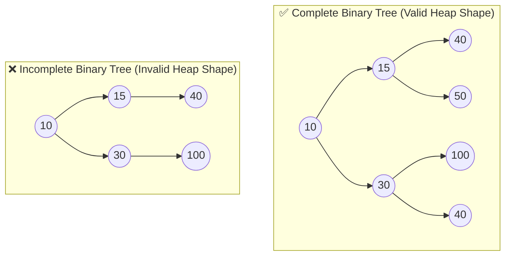
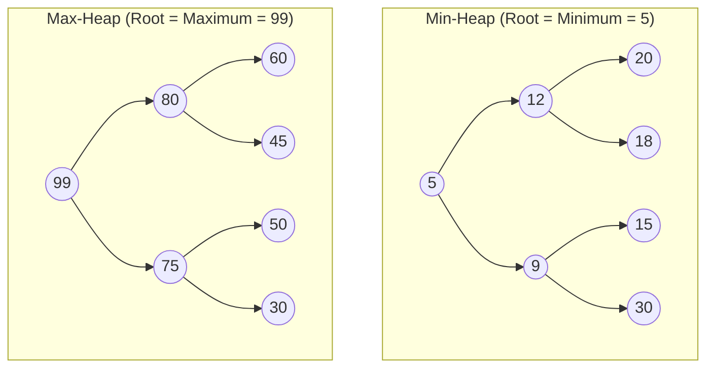
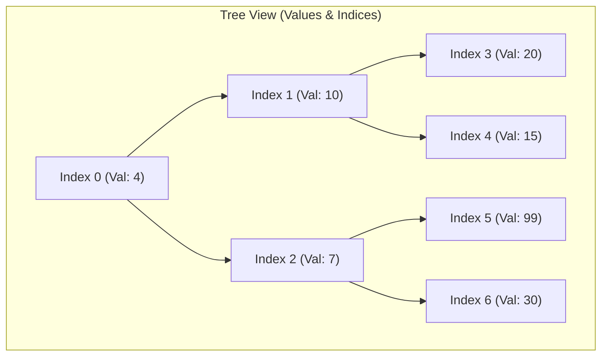
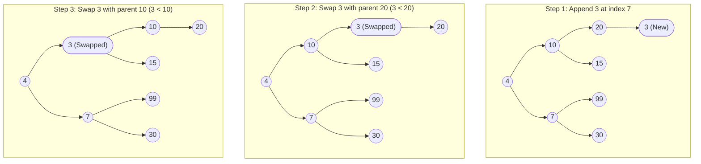
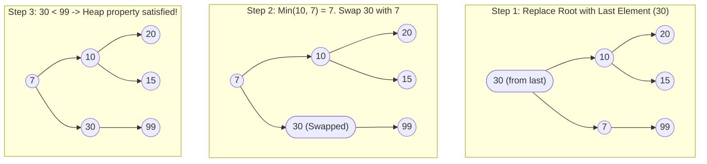
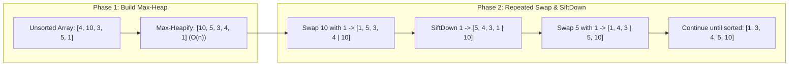
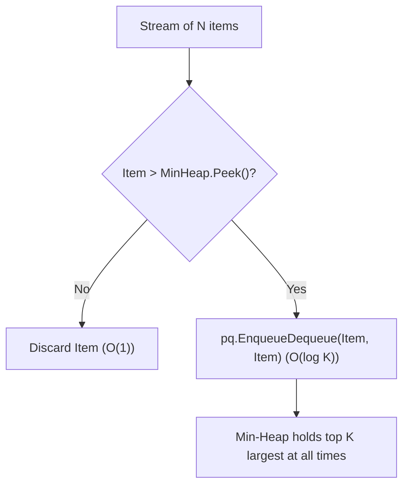
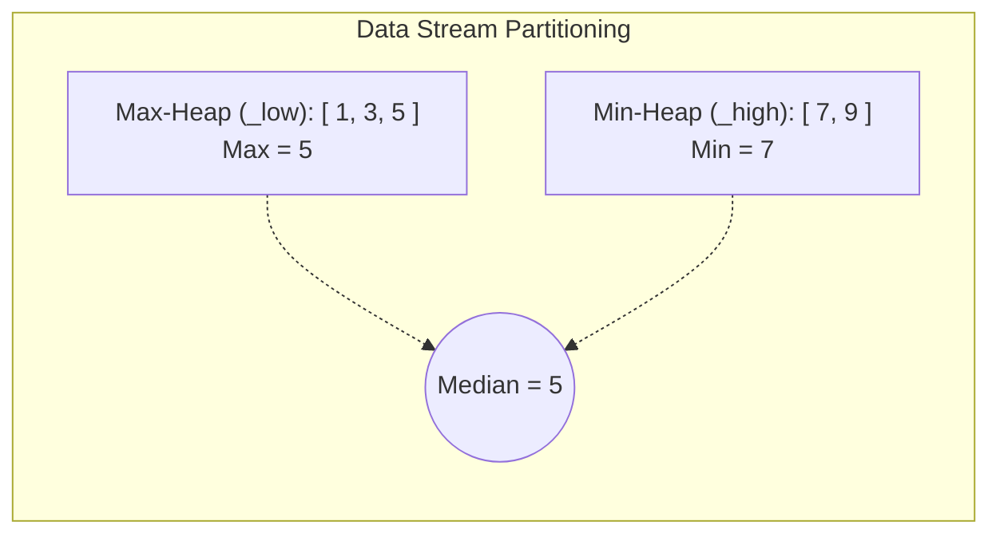

# 05 - Heaps & Priority Queues: Deep Dive & .NET Engineering

A **Heap** is a specialized tree-based data structure that satisfies the **Heap Property**. It is the gold standard underlying implementation for **Priority Queues**, efficient graph algorithms (like Dijkstra and Prim), top-K ranking, stream median calculation, and external sorting.

In modern .NET development (especially starting from **.NET 6+** with `PriorityQueue<TElement, TPriority>`), understanding the memory mechanics, cache behavior, and algorithmic bounds of heaps is vital for designing high-throughput background processors, schedulers, and zero-allocation pipelines.

---

## 📚 1. What is a Heap?

A **Binary Heap** is conceptually a **Complete Binary Tree** stored contiguously in an array.

### Complete Binary Tree Property

A binary tree is **complete** if:

1. Every level is completely filled, except possibly the last level.
2. All nodes in the bottom level are as far **left** as possible.



> [!NOTE]
> Because complete binary trees have no "holes" in their sequence of nodes, they can be stored in a flat array without allocating separate node objects or storing left/right child pointers. This saves $16\text{ bytes} + 16\text{ bytes}$ of pointer overhead per node on 64-bit .NET.

---

### The Heap Order Property

Unlike Binary Search Trees (BSTs), where left child $<$ parent $<$ right child, heaps only enforce a vertical order relationship between parents and children:

| Characteristic | Min-Heap | Max-Heap |
| :--- | :--- | :--- |
| **Heap Property** | $\text{Parent} \le \text{Children}$ ($A[\text{parent}] \le A[\text{child}]$) | $\text{Parent} \ge \text{Children}$ ($A[\text{parent}] \ge A[\text{child}]$) |
| **Root Element** | Always the **Global Minimum** ($O(1)$ access) | Always the **Global Maximum** ($O(1)$ access) |
| **Sibling Ordering** | **None** (Left child can be $>$ or $<$ Right child) | **None** (Left child can be $>$ or $<$ Right child) |
| **Default in .NET** | `PriorityQueue<TElement, TPriority>` is a **Min-Heap** | Requires custom descending comparer |



---

### Heap vs. Binary Search Tree (BST)

| Feature | Binary Heap | Self-Balancing BST (`SortedSet<T>`, Red-Black) |
| :--- | :--- | :--- |
| **Primary Purpose** | Fast Min/Max extraction and priority scheduling | Sorted lookups, range queries, full in-order traversal |
| **Find Min / Max** | $\mathcal{O}(1)$ for Root | $\mathcal{O}(\log n)$ or $\mathcal{O}(1)$ with cached pointers |
| **Search Arbitrary Key** | $\mathcal{O}(n)$ (unstructured search) | $\mathcal{O}(\log n)$ |
| **Insert** | $\mathcal{O}(\log n)$ (amortized $\mathcal{O}(1)$ average) | $\mathcal{O}(\log n)$ |
| **Extract Min / Max** | $\mathcal{O}(\log n)$ | $\mathcal{O}(\log n)$ |
| **Build from $N$ items** | $\mathcal{O}(n)$ via Floyd's Heapify | $\mathcal{O}(n \log n)$ |
| **Memory Structure** | Compact contiguous array (zero per-node pointer overhead) | Pointer-heavy linked nodes ($24\text{B} - 40\text{B}$ per node overhead) |
| **CPU Cache Locality** | **Excellent** (Sequential array access) | **Poor** (Pointer chasing across GC heap) |

---

## 🔍 2. Array Representation & Index Arithmetic

Because a binary heap is a complete binary tree, mapping between parent and children nodes is performed entirely using **integer arithmetic** on array indices.



### 0-Based Index Formulas (C# Standard)

Given an element at index $i$:

| Target Relationship | Formula | Bitwise Optimization in C# |
| :--- | :--- | :--- |
| **Parent Index** | $\text{Parent}(i) = \lfloor \frac{i - 1}{2} \rfloor$ | `(i - 1) >> 1` |
| **Left Child Index** | $\text{Left}(i) = 2i + 1$ | `(i << 1) + 1` |
| **Right Child Index** | $\text{Right}(i) = 2i + 2$ | `(i << 1) + 2` |
| **Is Leaf Node?** | $i \ge \lfloor \frac{n}{2} \rfloor$ (where $n$ is total count) | `i >= (count >> 1)` |
| **Last Non-Leaf Node** | $\text{LastNonLeaf} = \lfloor \frac{n - 2}{2} \rfloor$ | `(count - 2) >> 1` |

### Memory Layout Visualization

```text
Array Index:   [ 0 ]   [ 1 ]   [ 2 ]   [ 3 ]   [ 4 ]   [ 5 ]   [ 6 ]
Node Value:    |  4  | | 10  | |  7  | | 20  | | 15  | | 99  | | 30  |
                ──┬──   ──┬──   ──┬──   ──┬──   ──┬──   ──┬──   ──┬──
                  │       │       │       │       │       │       │
                Root      ├───────┴───────┤       ├───────┴───────┘
                       Left & Right of [0]     Left & Right of [1] & [2]
```

> [!TIP]
> In high-performance C# (e.g. game loops, high-frequency trading), replacing division `/ 2` with bitwise shift `>> 1` and multiplication `* 2` with `<< 1` generates direct assembly opcodes (`sar`, `shl`) without branch overhead.

---

## ⚡ 3. Core Heap Operations Step-by-Step

A binary heap maintains its invariant through two foundational repair operations: **Sift-Up (Bubble-Up)** and **Sift-Down (Bubble-Down)**.

---

### 1. Insert (`Enqueue` / `Push`) — Sift-Up

When inserting a new element:

1. **Append**: Place the new element at the very end of the array (preserving the complete tree shape).
2. **Sift-Up**: Compare the inserted element with its parent. If the heap invariant is violated (e.g., in a Min-Heap, child $<$ parent), swap them.
3. **Repeat**: Move up the tree until the root is reached or the parent is smaller/equal.

#### Sift-Up Walkthrough: Inserting `3` into Min-Heap `[4, 10, 7, 20, 15, 99, 30]`



*Final comparison*: Parent of index 1 is `4` (index 0). Since $3 < 4$, `3` swaps with `4` to become the new root `[3, 4, 7, 10, 15, 99, 30, 20]`.

- **Time Complexity**: $\mathcal{O}(\log n)$ worst case (height of tree $h = \lfloor \log_2 n \rfloor$). $\mathcal{O}(1)$ average for random inserts.

---

### 2. Extract Min/Max (`Dequeue` / `Pop`) — Sift-Down

When extracting the root element:

1. **Extract Root**: Save `array[0]` (minimum/maximum).
2. **Move Last to Root**: Replace `array[0]` with the last element in the array (`array[count - 1]`) and decrement `count`.
3. **Sift-Down**: Compare the new root with its children:
   - For Min-Heap: Find the **smaller** of the two children. If `root > smaller_child`, swap them.
   - For Max-Heap: Find the **larger** of the two children. If `root < larger_child`, swap them.
4. **Repeat**: Continue down the tree until both children are valid or a leaf is reached.

#### Sift-Down Walkthrough: Extracting `4` from Min-Heap `[4, 10, 7, 20, 15, 99, 30]`



- **Time Complexity**: $\mathcal{O}(\log n)$ — tree depth is traversed at most once.

---

### 3. Production-Ready C# Min-Heap Implementation

Here is an optimized generic Min-Heap implementation written in modern C#:

```csharp
namespace CleanArch.Fundamentals.Heaps;

public sealed class MinHeap<T>
{
    private T[] _items;
    private int _count;
    private readonly IComparer<T> _comparer;
    private const int DefaultCapacity = 8;

    public int Count => _count;
    public bool IsEmpty => _count == 0;
    public int Capacity => _items.Length;

    public MinHeap(int capacity = DefaultCapacity, IComparer<T>? comparer = null)
    {
        _items = new T[Math.Max(capacity, DefaultCapacity)];
        _comparer = comparer ?? Comparer<T>.Default;
        _count = 0;
    }

    /// <summary>
    /// Returns the smallest element without removing it. O(1)
    /// </summary>
    public T Peek()
    {
        if (_count == 0)
            throw new InvalidOperationException("Heap is empty.");

        return _items[0];
    }

    /// <summary>
    /// Inserts a new element into the heap. O(log n)
    /// </summary>
    public void Push(T value)
    {
        EnsureCapacity(_count + 1);
        _items[_count] = value;
        SiftUp(_count);
        _count++;
    }

    /// <summary>
    /// Removes and returns the smallest element. O(log n)
    /// </summary>
    public T Pop()
    {
        if (_count == 0)
            throw new InvalidOperationException("Heap is empty.");

        T min = _items[0];
        _count--;

        if (_count > 0)
        {
            _items[0] = _items[_count];
            _items[_count] = default!; // Avoid memory leak / retain GC reference
            SiftDown(0);
        }
        else
        {
            _items[0] = default!;
        }

        return min;
    }

    private void SiftUp(int index)
    {
        T item = _items[index];

        while (index > 0)
        {
            int parentIndex = (index - 1) >> 1;
            T parent = _items[parentIndex];

            // If item >= parent, Min-Heap property is satisfied
            if (_comparer.Compare(item, parent) >= 0)
                break;

            _items[index] = parent;
            index = parentIndex;
        }

        _items[index] = item;
    }

    private void SiftDown(int index)
    {
        T item = _items[index];
        int half = _count >> 1; // Nodes >= half are leaves

        while (index < half)
        {
            int leftChild = (index << 1) + 1;
            int rightChild = leftChild + 1;
            int smallestChild = leftChild;

            // Check if right child exists and is smaller than left child
            if (rightChild < _count && _comparer.Compare(_items[rightChild], _items[leftChild]) < 0)
            {
                smallestChild = rightChild;
            }

            // If item <= smallest child, Min-Heap property is satisfied
            if (_comparer.Compare(item, _items[smallestChild]) <= 0)
                break;

            _items[index] = _items[smallestChild];
            index = smallestChild;
        }

        _items[index] = item;
    }

    private void EnsureCapacity(int min)
    {
        if (_items.Length < min)
        {
            int newCapacity = _items.Length * 2;
            Array.Resize(ref _items, newCapacity);
        }
    }
}
```

---

## 🏗️ 4. Building a Heap: $\mathcal{O}(n)$ Heapify vs. $\mathcal{O}(n \log n)$ Insertion

When you are given an unsorted array of $n$ elements, there are two ways to turn it into a valid heap:

### Method A: Repeated Insertion ($\mathcal{O}(n \log n)$)

Start with an empty heap and call `Push()` $n$ times.
Each insertion takes $\mathcal{O}(\log k)$ where $k$ is the current size:

$$\sum_{k=1}^n \log k = \log(n!) = \Theta(n \log n)$$

---

### Method B: Floyd's Bottom-Up Heapify ($\mathcal{O}(n)$)

Floyd's algorithm treats the array as a complete binary tree and calls **Sift-Down** in reverse order, starting from the **last non-leaf node** up to the root (index 0).

```csharp
public static void Heapify<T>(T[] array, IComparer<T>? comparer = null)
{
    comparer ??= Comparer<T>.Default;
    int n = array.Length;

    // Start from the last non-leaf node: (n - 2) / 2
    for (int i = (n - 2) >> 1; i >= 0; i--)
    {
        SiftDown(array, i, n, comparer);
    }
}

private static void SiftDown<T>(T[] array, int index, int count, IComparer<T> comparer)
{
    T item = array[index];
    int half = count >> 1;

    while (index < half)
    {
        int left = (index << 1) + 1;
        int right = left + 1;
        int best = (right < count && comparer.Compare(array[right], array[left]) < 0) ? right : left;

        if (comparer.Compare(item, array[best]) <= 0)
            break;

        array[index] = array[best];
        index = best;
    }

    array[index] = item;
}
```

---

### Mathematical Proof: Why Floyd's Heapify is $\mathcal{O}(n)$

In a complete binary tree of $n$ nodes:

- Height of tree $H = \lfloor \log_2 n \rfloor$.
- Number of nodes at height $h$ from the bottom is at most $\lceil \frac{n}{2^{h+1}} \rceil$.
- Sifting down a node at height $h$ takes at most $h$ operations.

The total work $S$ is:

$$S = \sum_{h=0}^{\lfloor \log_2 n \rfloor} \left( \frac{n}{2^{h+1}} \cdot h \right) = \frac{n}{2} \sum_{h=0}^{\infty} \frac{h}{2^h}$$

Let $T = \sum_{h=0}^{\infty} \frac{h}{2^h}$:

$$T = \frac{1}{2} + \frac{2}{4} + \frac{3}{8} + \frac{4}{16} + \dots$$

$$\frac{1}{2}T = \frac{1}{4} + \frac{2}{8} + \frac{3}{16} + \dots$$

Subtracting the two equations:

$$T - \frac{1}{2}T = \frac{1}{2} + \frac{1}{4} + \frac{1}{8} + \frac{1}{16} + \dots = 1 \implies \frac{1}{2}T = 1 \implies T = 2$$

Substituting back:

$$S = \frac{n}{2} \cdot 2 = \mathbf{\mathcal{O}(n)}$$

> [!IMPORTANT]
> **Key Intuition**: Most nodes in a tree are at the bottom (leaves). Leaves have height $h=0$ and require **0 work** during Sift-Down. Only the single root node requires the maximum $\mathcal{O}(\log n)$ steps. In contrast, repeated insertion does $\mathcal{O}(\log n)$ work for every single leaf!

---

## 🔄 5. Heap Sort Algorithm

**Heap Sort** is a comparison-based sorting algorithm with a guaranteed $\mathcal{O}(n \log n)$ running time and $\mathcal{O}(1)$ auxiliary memory.

### How It Works (Ascending Sort using Max-Heap)

1. **Build Max-Heap**: Convert the unsorted array into a Max-Heap in $\mathcal{O}(n)$ time using Floyd's algorithm.
2. **Extract & Swap**:
   - The maximum element is at `array[0]`.
   - Swap `array[0]` with `array[end]` (placing the max in its final sorted position).
   - Reduce the active heap size by 1 (`end--`).
   - Call `SiftDown(0)` on the reduced heap to restore the Max-Heap property.
3. **Repeat**: Continue until the active heap size becomes 1.



### Complete C# In-Place HeapSort Implementation

```csharp
namespace CleanArch.Fundamentals.Heaps;

public static class HeapSorter
{
    public static void Sort<T>(Span<T> span) where T : IComparable<T>
    {
        int n = span.Length;
        if (n <= 1) return;

        // Step 1: Build Max-Heap in O(n)
        for (int i = (n - 2) >> 1; i >= 0; i--)
        {
            SiftDown(span, i, n);
        }

        // Step 2: Extract maximum one-by-one in O(n log n)
        for (int end = n - 1; end > 0; end--)
        {
            // Swap root (maximum) to the end
            (span[0], span[end]) = (span[end], span[0]);

            // Restore Max-Heap on remaining elements [0..end-1]
            SiftDown(span, 0, end);
        }
    }

    private static void SiftDown<T>(Span<T> span, int index, int count) where T : IComparable<T>
    {
        T item = span[index];
        int half = count >> 1;

        while (index < half)
        {
            int left = (index << 1) + 1;
            int right = left + 1;
            int largest = (right < count && span[right].CompareTo(span[left]) > 0) ? right : left;

            if (item.CompareTo(span[largest]) >= 0)
                break;

            span[index] = span[largest];
            index = largest;
        }

        span[index] = item;
    }
}
```

### Sorting Algorithm Comparison

| Algorithm | Best Time | Average Time | Worst Time | Space | Stable? | Real-World Cache Performance |
| :--- | :--- | :--- | :--- | :--- | :--- | :--- |
| **Heap Sort** | $\mathcal{O}(n \log n)$ | $\mathcal{O}(n \log n)$ | $\mathcal{O}(n \log n)$ | $\mathcal{O}(1)$ | ❌ **No** | Moderate (jumps through array indices) |
| **Quick Sort (Dual-Pivot)** | $\mathcal{O}(n \log n)$ | $\mathcal{O}(n \log n)$ | $\mathcal{O}(n^2)$ | $\mathcal{O}(\log n)$ | ❌ **No** | **Optimal** (sequential cache lines) |
| **Merge Sort / TimSort** | $\mathcal{O}(n)$ | $\mathcal{O}(n \log n)$ | $\mathcal{O}(n \log n)$ | $\mathcal{O}(n)$ | ✅ **Yes** | Good |
| **IntroSort (.NET Array.Sort)** | $\mathcal{O}(n \log n)$ | $\mathcal{O}(n \log n)$ | $\mathcal{O}(n \log n)$ | $\mathcal{O}(\log n)$ | ❌ **No** | **Optimal** (QuickSort $\to$ HeapSort fallback) |

> [!NOTE]
> In .NET Core / .NET 10, `Array.Sort<T>()` uses **IntroSort**: it starts with QuickSort, but if recursion depth exceeds $2 \log_2 n$, it switches to **HeapSort** to avoid QuickSort's $\mathcal{O}(n^2)$ degradation.

---

## 📦 6. Priority Queue in .NET: `PriorityQueue<TElement, TPriority>` (.NET 6+)

Starting in **.NET 6**, the BCL provides a high-performance generic `PriorityQueue<TElement, TPriority>` in `System.Collections.Generic`.

### Key Characteristics

1. **Min-Heap by Default**: The element with the **lowest priority value** is dequeued first.
2. **Separation of Element and Priority**: Unlike custom heaps where `T` must implement `IComparable`, .NET allows separate `TElement` (payload) and `TPriority` (scheduling weight).
3. **Unstable Tie-Breaking**: Elements with equal priority are not guaranteed FIFO order.

### Basic Usage & Custom Max-Heap Comparer

```csharp
using System.Collections.Generic;

// 1. Default Min-Priority Queue (Lower integer = Higher priority)
var minPq = new PriorityQueue<string, int>();

minPq.Enqueue("HealthCheckJob", priority: 3);
minPq.Enqueue("CriticalSecurityAlert", priority: 1);
minPq.Enqueue("SendMarketingEmail", priority: 5);

// Dequeues: "CriticalSecurityAlert" (priority 1)
string first = minPq.Dequeue(); 

// 2. Custom Max-Priority Queue (Higher integer = Higher priority)
var maxPq = new PriorityQueue<string, int>(Comparer<int>.Create((a, b) => b.CompareTo(a)));

maxPq.Enqueue("LowTask", 10);
maxPq.Enqueue("VIPPayment", 100);
maxPq.Enqueue("StandardOrder", 50);

// Dequeues: "VIPPayment" (priority 100)
string vip = maxPq.Dequeue();
```

---

### The `EnqueueDequeue` Optimization

.NET `PriorityQueue<TElement, TPriority>` includes high-efficiency combined methods:

```csharp
var pq = new PriorityQueue<int, int>();
// Fill with items...

// ❌ Naive approach: 2 full traversals (SiftUp + SiftDown) -> 2 * O(log n)
pq.Enqueue(newElement, newPriority);
int minVal = pq.Dequeue();

// ✅ Optimized approach: Replaces root directly and executes exactly 1 SiftDown -> 1 * O(log n)
int replaced = pq.EnqueueDequeue(newElement, newPriority);
```

| Method | Operations Performed | Tree Traversals | Time Complexity |
| :--- | :--- | :--- | :--- |
| `Enqueue(item, p)` | Append + `SiftUp` | 1 upward | $\mathcal{O}(\log n)$ |
| `Dequeue()` | Remove root + Move last + `SiftDown` | 1 downward | $\mathcal{O}(\log n)$ |
| `EnqueueDequeue(item, p)` | Compare with root $\to$ replace root $\to$ `SiftDown` | **1 downward** | $\mathcal{O}(\log n)$ (50% faster) |
| `DequeueEnqueue(item, p)` | Remove root $\to$ insert new at root $\to$ `SiftDown` | **1 downward** | $\mathcal{O}(\log n)$ |

---

## 🚀 7. Real-World Applications & Classic Patterns

### Pattern 1: Top-K Frequent / Largest Elements

**Problem**: Find the $K$ largest elements in an unbounded stream or large dataset of $N$ items.

**Optimal Strategy**: Maintain a **Min-Heap of size $K$**.



```csharp
public static int[] FindKLargest(IEnumerable<int> numbers, int k)
{
    if (k <= 0) return [];

    // Min-Heap of capacity k
    var minHeap = new PriorityQueue<int, int>(k);

    foreach (int num in numbers)
    {
        if (minHeap.Count < k)
        {
            minHeap.Enqueue(num, num);
        }
        else if (num > minHeap.Peek())
        {
            // Replace smallest of the top-k in O(log k)
            minHeap.EnqueueDequeue(num, num);
        }
    }

    var result = new int[minHeap.Count];
    int idx = 0;
    while (minHeap.Count > 0)
    {
        result[idx++] = minHeap.Dequeue();
    }

    return result; // Contains k largest items
}
```

- **Time Complexity**: $\mathcal{O}(N \log K)$ vs $\mathcal{O}(N \log N)$ for full sorting.
- **Space Complexity**: $\mathcal{O}(K)$ — ideal for memory-constrained streaming!

---

### Pattern 2: Merge $K$ Sorted Streams / Lists

**Problem**: Merge $K$ pre-sorted enumerables into one single sorted stream.

```csharp
public sealed record StreamNode(int Value, int StreamIndex, IEnumerator<int> Enumerator);

public static IEnumerable<int> MergeKSortedStreams(List<IEnumerable<int>> streams)
{
    var minHeap = new PriorityQueue<StreamNode, int>();

    // Step 1: Initialize heap with the first element of each stream (O(K log K))
    for (int i = 0; i < streams.Count; i++)
    {
        var enumerator = streams[i].GetEnumerator();
        if (enumerator.MoveNext())
        {
            var node = new StreamNode(enumerator.Current, i, enumerator);
            minHeap.Enqueue(node, node.Value);
        }
    }

    // Step 2: Continuously extract min and advance that stream (O(N log K))
    while (minHeap.Count > 0)
    {
        StreamNode current = minHeap.Dequeue();
        yield return current.Value;

        if (current.Enumerator.MoveNext())
        {
            var nextNode = new StreamNode(current.Enumerator.Current, current.StreamIndex, current.Enumerator);
            minHeap.Enqueue(nextNode, nextNode.Value);
        }
        else
        {
            current.Enumerator.Dispose();
        }
    }
}
```

- **Time Complexity**: $\mathcal{O}(N \log K)$ where $N$ is total elements across all $K$ streams.
- **Auxiliary Space**: $\mathcal{O}(K)$ nodes stored in the heap.

---

### Pattern 3: Find Median from Data Stream (Two-Heap Technique)

**Problem**: Continuously ingest numbers and provide the current median in $\mathcal{O}(1)$ time.

**Design**:

1. **Max-Heap (`_low`)**: Stores the smaller half of numbers.
2. **Min-Heap (`_high`)**: Stores the larger half of numbers.
3. **Invariant**: `_low.Count` is either equal to `_high.Count` or `_high.Count + 1`.



```csharp
public sealed class MedianFinder
{
    // Max-Heap stores smaller half
    private readonly PriorityQueue<int, int> _low = new(Comparer<int>.Create((a, b) => b.CompareTo(a)));
    // Min-Heap stores larger half
    private readonly PriorityQueue<int, int> _high = new();

    public void AddNum(int num)
    {
        // 1. Add to max-heap
        _low.Enqueue(num, num);

        // 2. Balancing step: Ensure highest of low <= lowest of high
        int maxLow = _low.Dequeue();
        _high.Enqueue(maxLow, maxLow);

        // 3. Maintain size invariant: _low can have at most 1 more item than _high
        if (_low.Count < _high.Count)
        {
            int minHigh = _high.Dequeue();
            _low.Enqueue(minHigh, minHigh);
        }
    }

    public double FindMedian()
    {
        if (_low.Count == 0)
            throw new InvalidOperationException("No elements registered.");

        if (_low.Count > _high.Count)
            return _low.Peek();

        return (_low.Peek() + _high.Peek()) / 2.0;
    }
}
```

- **AddNum Complexity**: $\mathcal{O}(\log n)$
- **FindMedian Complexity**: $\mathcal{O}(1)$

---

### Pattern 4: Dijkstra’s Shortest Path Algorithm

In network routing, microservice latency calculation, or map routing, Dijkstra's algorithm uses a Min-Priority Queue to greedily expand the shortest known path.

```csharp
public sealed record Edge(int Target, int Weight);

public static int[] Dijkstra(int startNode, int vertexCount, List<Edge>[] graph)
{
    int[] distances = new int[vertexCount];
    Array.Fill(distances, int.MaxValue);
    distances[startNode] = 0;

    var priorityQueue = new PriorityQueue<int, int>();
    priorityQueue.Enqueue(startNode, 0);

    while (priorityQueue.Count > 0)
    {
        priorityQueue.TryDequeue(out int u, out int currentDist);

        // Stale entry check (Lazy Deletion optimization)
        if (currentDist > distances[u])
            continue;

        foreach (var edge in graph[u])
        {
            int newDist = currentDist + edge.Weight;
            if (newDist < distances[edge.Target])
            {
                distances[edge.Target] = newDist;
                priorityQueue.Enqueue(edge.Target, newDist);
            }
        }
    }

    return distances;
}
```

- **Time Complexity**: $\mathcal{O}((V + E) \log V)$ with adjacency list and binary heap.

---

## 📊 8. Comprehensive Complexity Reference Table

| Operation | Binary Min/Max Heap | Fibonacci Heap | Self-Balancing BST (AVL/Red-Black) | Sorted Array | Unsorted Array |
| :--- | :--- | :--- | :--- | :--- | :--- |
| **Peek (Find Min/Max)** | $\mathcal{O}(1)$ | $\mathcal{O}(1)$ | $\mathcal{O}(1)$ (cached) or $\mathcal{O}(\log n)$ | $\mathcal{O}(1)$ | $\mathcal{O}(n)$ |
| **Insert (`Push`)** | $\mathcal{O}(\log n)$ (avg $\mathcal{O}(1)$) | $\mathcal{O}(1)$ (amortized) | $\mathcal{O}(\log n)$ | $\mathcal{O}(n)$ | $\mathcal{O}(1)$ |
| **Extract Min/Max** | $\mathcal{O}(\log n)$ | $\mathcal{O}(\log n)$ (amortized) | $\mathcal{O}(\log n)$ | $\mathcal{O}(1)$ (at end) | $\mathcal{O}(n)$ |
| **Delete Arbitrary Node** | $\mathcal{O}(\log n)^*$ | $\mathcal{O}(\log n)$ (amortized) | $\mathcal{O}(\log n)$ | $\mathcal{O}(n)$ | $\mathcal{O}(1)^*$ |
| **Decrease-Key** | $\mathcal{O}(\log n)^*$ | $\mathbf{\mathcal{O}(1)}$ (amortized) | $\mathcal{O}(\log n)$ | $\mathcal{O}(n)$ | $\mathcal{O}(1)$ |
| **Build Heap (`Heapify`)** | $\mathbf{\mathcal{O}(n)}$ | $\mathcal{O}(n)$ | $\mathcal{O}(n \log n)$ | $\mathcal{O}(n \log n)$ | $\mathcal{O}(1)$ |
| **Merge Two Heaps** | $\mathcal{O}(n)$ | $\mathbf{\mathcal{O}(1)}$ | $\mathcal{O}(n \log n)$ | $\mathcal{O}(n)$ | $\mathcal{O}(1)$ |
| **Space Overhead** | $\mathbf{\mathcal{O}(1)}$ per item (Array) | High pointer overhead | $24\text{B}-32\text{B}$ per node | $\mathcal{O}(1)$ per item | $\mathcal{O}(1)$ per item |

$^*$ *Assuming index/pointer of target node is already known.*

---

## 🎯 9. Senior .NET Technical Interview Q&A

### Q1: Why is .NET `PriorityQueue<TElement, TPriority>` designed as a Min-Heap by default, and how do you implement a Max-Heap?

**Answer**:
In systems engineering and operating systems (e.g., job scheduling, Dijkstra's algorithm, event loops), smaller numerical values typically represent higher precedence (e.g., Priority 0 is critical/real-time, Priority 10 is background).

To configure a Max-Heap in C#:

1. Pass an inverted comparer to the constructor:

   ```csharp
   var maxPq = new PriorityQueue<TElement, int>(Comparer<int>.Create((a, b) => b.CompareTo(a)));
   ```

2. Or use custom struct/record types that implement `IComparable<T>` with inverted comparisons.

---

### Q2: Why does Floyd's Heapify run in $\mathcal{O}(n)$ while inserting $n$ elements takes $\mathcal{O}(n \log n)$?

**Answer**:
The difference lies in where the heaviest work is performed:

- **Repeated Insertion** does Sift-Up on each new node added at the bottom. Since $\approx 50\%$ of all nodes are leaves at the deepest level, half the nodes perform the maximum height $\mathcal{O}(\log n)$ sift-ups.
- **Floyd's Heapify** operates bottom-up using Sift-Down. The leaves ($n/2$ nodes) require **0 swaps**. Nodes at height 1 ($n/4$ nodes) require at most 1 swap. The sum converges to $\frac{n}{2} \sum \frac{h}{2^h} = 2 \cdot \frac{n}{2} = \mathcal{O}(n)$.

---

### Q3: Is `PriorityQueue<TElement, TPriority>` thread-safe in .NET? How do you coordinate background task scheduling across multiple threads?

**Answer**:
No, `PriorityQueue<TElement, TPriority>` is **not thread-safe**. Concurrent reads and writes can corrupt the internal array and violate heap invariants.

For multithreaded task scheduling:

1. **Monitor/Locking**: Wrap operations inside a dedicated `lock` object.
2. **`Channel<T>` with Prioritization**: In Clean Architecture services, background workers typically consume prioritized work via `System.Threading.Channels` or actor mailboxes.
3. **`Monitor.Pulse` / `Monitor.Wait`**: For low-latency custom priority queues that block on empty dequeue:

```csharp
public sealed class ConcurrentBlockingPriorityQueue<TElement, TPriority>
{
    private readonly PriorityQueue<TElement, TPriority> _pq = new();
    private readonly Lock _lock = new(); // .NET 9+ System.Threading.Lock

    public void Enqueue(TElement item, TPriority priority)
    {
        lock (_lock)
        {
            _pq.Enqueue(item, priority);
            Monitor.Pulse(_lock);
        }
    }

    public TElement Dequeue(CancellationToken cancellationToken = default)
    {
        lock (_lock)
        {
            while (_pq.Count == 0)
            {
                cancellationToken.ThrowIfCancellationRequested();
                Monitor.Wait(_lock);
            }
            return _pq.Dequeue();
        }
    }
}
```

---

### Q4: When would you use a `SortedSet<T>` (Red-Black Tree) instead of a `PriorityQueue<TElement, TPriority>` (Heap)?

**Answer**:

| Requirement | Choose `PriorityQueue<TElement, TPriority>` | Choose `SortedSet<T>` |
| :--- | :--- | :--- |
| **Duplicates** | Fully supported | Disallowed (Set semantics) |
| **Peek Min/Max** | $\mathcal{O}(1)$ for Root | $\mathcal{O}(1)$ (`Min` / `Max`) |
| **Lookup Arbitrary Item** | ❌ $\mathcal{O}(n)$ | ✅ $\mathcal{O}(\log n)$ |
| **Delete Specific Item** | ❌ $\mathcal{O}(n)$ search + $\mathcal{O}(\log n)$ | ✅ $\mathcal{O}(\log n)$ |
| **Range Queries (`GetViewBetween`)** | ❌ Not supported | ✅ $\mathcal{O}(\log n + m)$ |
| **Memory Footprint** | ✅ Minimal (contiguous array) | ❌ High ($32\text{B}$ per node overhead) |

---

### Q5: How does `EnqueueDequeue` provide a performance advantage over sequential `Enqueue()` and `Dequeue()`?

**Answer**:

- Calling `Enqueue()` places an element at index `count` and executes **Sift-Up** ($\mathcal{O}(\log n)$).
- Calling `Dequeue()` removes index 0, moves the last element to index 0, and executes **Sift-Down** ($\mathcal{O}(\log n)$).
- **Total Work**: 2 tree traversals, array resizes if near capacity, and extra memory writes.
- `EnqueueDequeue()` directly compares the candidate element with `array[0]`. If smaller/greater, it replaces `array[0]` in-place and triggers exactly **1 Sift-Down**.
- **Benefit**: 50% fewer tree traversals, 0 allocations, and superior CPU L1/L2 cache line hits.
