# 06 - Graphs & Graph Algorithms: Deep Dive & .NET Engineering

A **Graph** is a non-linear data structure consisting of a set of **vertices** (or nodes) and a set of **edges** (or arcs) connecting pairs of vertices. Graphs represent the most expressive and versatile data structure in computer science, capable of modeling arbitrary networks, hierarchical dependencies, state machines, distributed topologies, and object reference graphs.

In modern enterprise .NET engineering, graph algorithms are at the heart of critical infrastructure:

- **Dependency Injection (DI)**: Building and validating the service dependency tree in `Microsoft.Extensions.DependencyInjection` to prevent circular dependencies.
- **Build Systems**: MSBuild / NuGet resolving package dependency DAGs (Directed Acyclic Graphs) and parallel build orders.
- **Garbage Collection (GC)**: The .NET CLR Mark-and-Sweep collector tracing the root object reference graph to reclaim unreachable heap memory.
- **Distributed Systems**: Service mesh routing, circuit breaker cascading failure mitigation, and distributed transaction workflows (Saga orchestrators).

---

## 📚 1. Graph Fundamentals & Terminology

Formally, a graph is defined as an ordered pair $G = (V, E)$, where:

- $V$ is a finite, non-empty set of **vertices** (nodes). $|V|$ denotes the number of vertices.
- $E$ is a set of **edges** (links), where each edge connects a pair of vertices $(u, v) \in V \times V$. $|E|$ denotes the number of edges.

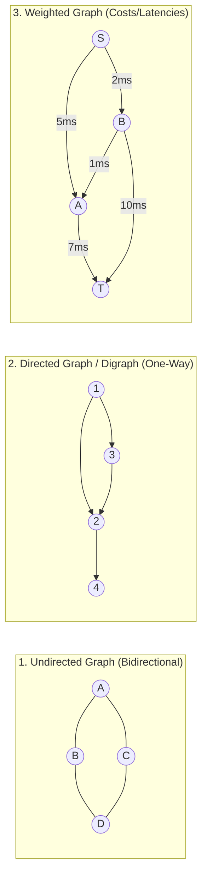

### Core Terminology Reference

| Term | Definition | Mathematical / Engineering Context |
| :--- | :--- | :--- |
| **Vertex / Node** | An individual entity or data point in the graph. | Represents an entity (e.g., Microservice, User, City, Class). |
| **Edge / Arc** | A connection or relationship between two vertices. | $e = (u, v)$. Can be directed or undirected, weighted or unweighted. |
| **Directed Graph (Digraph)** | Edges have a specific direction: $(u, v) \neq (v, u)$. | Models one-way dependencies (e.g., Class `A` depends on `B`, Twitter followers). |
| **Undirected Graph** | Edges are bidirectional: $(u, v) \equiv (v, u)$. | Models mutual relationships (e.g., Facebook friendship, network cable). |
| **Weighted Graph** | Each edge carries a numerical weight/cost/capacity $w(u, v)$. | Represents latency, distance, monetary cost, or network bandwidth. |
| **Unweighted Graph** | All edges have uniform unit cost ($1$). | Shortest path can be found via simple BFS instead of Dijkstra. |
| **Self-Loop** | An edge connecting a vertex to itself: $(u, u)$. | Often invalid in DAGs and dependency trees. |
| **Multigraph** | A graph containing multiple edges between the same vertex pair. | Models multiple communication channels or alternative transport routes. |
| **Simple Graph** | A graph with no self-loops and no parallel edges. | Standard assumption for most classical graph algorithms. |

---

### Degree Concepts

The **Degree** of a vertex is the count of edges incident to it.

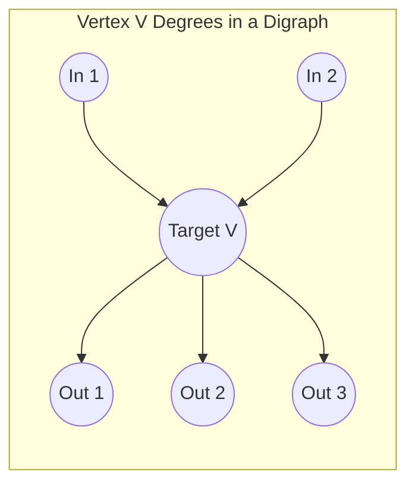

- **Undirected Graph Degree ($\deg(v)$)**: Number of edges connected to vertex $v$.
  - **Handshaking Lemma**: $\sum_{v \in V} \deg(v) = 2|E|$. The sum of degrees across all vertices is always even and equals twice the number of edges.
- **Directed Graph In-Degree ($\deg^-(v)$)**: Number of edges pointing *into* $v$. Indicates how many prerequisites or dependents point to $v$.
- **Directed Graph Out-Degree ($\deg^+(v)$)**: Number of edges pointing *out of* $v$. Indicates how many downstream nodes $v$ directly links to.
  - $\sum_{v \in V} \deg^-(v) = \sum_{v \in V} \deg^+(v) = |E|$.

---

### Paths, Cycles, and Connectivity

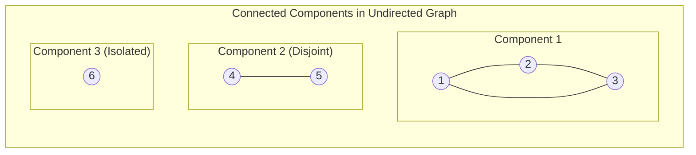

- **Path**: A sequence of vertices $(v_0, v_1, \dots, v_k)$ where $(v_i, v_{i+1}) \in E$ for all $0 \le i < k$.
- **Simple Path**: A path where all vertices are distinct.
- **Cycle**: A path of length $\ge 1$ starting and ending at the same vertex $(v_0 = v_k)$ with distinct intermediate vertices.
- **Acyclic Graph**: A graph containing zero cycles. A **Directed Acyclic Graph (DAG)** is the standard representation for schedulable workflows.
- **Connected Graph (Undirected)**: Every pair of vertices has a path connecting them.
- **Connected Components**: Maximal connected subgraphs in an undirected graph.
- **Strongly Connected Component (SCC - Directed)**: A maximal subgraph where every vertex is reachable from every other vertex within the subgraph.
- **Weakly Connected (Directed)**: The graph is connected if all directed edges are replaced with undirected edges.

---

## 🔍 2. Graph Representations & Memory Layout in .NET

Choosing the correct memory representation for a graph directly influences cache efficiency, memory allocations on the .NET Garbage Collector (GC) heap, and algorithmic time complexity.

The three primary representations are:

1. **Adjacency Matrix**
2. **Adjacency List**
3. **Edge List**

---

### 1. Adjacency Matrix

A 2D array of size $|V| \times |V|$ where `matrix[u, v]` stores `1` (or edge weight $w$) if edge $(u, v)$ exists, and `0` (or $\infty$) otherwise.

```csharp
// Unweighted adjacency matrix for V vertices
bool[,] matrix = new bool[V, V];

// Add directed edge u -> v
matrix[u, v] = true;

// Add undirected edge u <-> v
matrix[u, v] = true;
matrix[v, u] = true;
```

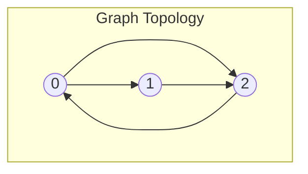

| | 0 | 1 | 2 |
| :--- | :--- | :--- | :--- |
| **0** | 0 | 1 | 1 |
| **1** | 0 | 0 | 1 |
| **2** | 1 | 0 | 0 |

- **Pros**:
  - $O(1)$ edge existence lookup (`matrix[u, v]`).
  - $O(1)$ edge addition and deletion.
  - Very simple implementation, cache-friendly flat memory layout.
- **Cons**:
  - $\mathcal{O}(V^2)$ space complexity, regardless of the number of edges $|E|$.
  - $\mathcal{O}(V)$ time to iterate over the neighbors of a vertex, even if the vertex has only 1 neighbor.
  - Horrible memory waste for **sparse graphs** (where $|E| \ll |V|^2$).

---

### 2. Adjacency List

An array, list, or dictionary where each vertex $u$ maps to a collection of its adjacent neighbors (and edge weights).

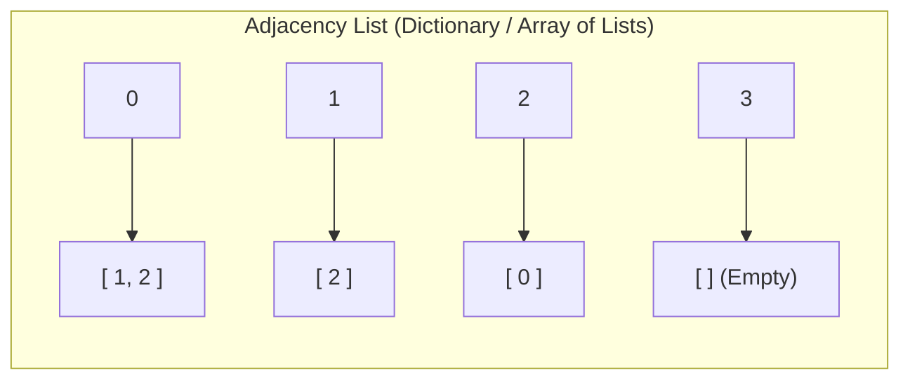

In modern C#, adjacency lists can be represented in multiple ways depending on vertex identifiers:

#### A. Array of Lists (when vertices are contiguous integers $0 \le v < V$)

```csharp
// Zero-allocation overhead on key lookups
List<int>[] adj = new List<int>[V];
for (int i = 0; i < V; i++)
{
    adj[i] = [];
}

// Add edge u -> v
adj[u].Add(v);
```

#### B. Dictionary of Lists (when vertices are arbitrary strings, GUIDs, or objects)

```csharp
public sealed class AdjacencyGraph<TNode> where TNode : notnull
{
    private readonly Dictionary<TNode, List<TNode>> _adjacencyList = new();

    public void AddVertex(TNode node)
    {
        _adjacencyList.TryAdd(node, []);
    }

    public void AddEdge(TNode from, TNode to, bool bidirectional = false)
    {
        AddVertex(from);
        AddVertex(to);
        _adjacencyList[from].Add(to);

        if (bidirectional)
        {
            _adjacencyList[to].Add(from);
        }
    }

    public IReadOnlyList<TNode> GetNeighbors(TNode node)
    {
        return _adjacencyList.TryGetValue(node, out var neighbors) 
            ? neighbors 
            : [];
    }
}
```

- **Pros**:
  - $\mathcal{O}(V + E)$ optimal space complexity.
  - $\mathcal{O}(\deg(u))$ optimal iteration over outgoing neighbors.
  - Perfect for **sparse graphs**, which account for $>99\%$ of real-world graphs (web links, social networks, DI containers).
- **Cons**:
  - $\mathcal{O}(\deg(u))$ edge existence check (or $\mathcal{O}(1)$ average if using `HashSet<T>` per vertex).
  - Pointer chasing and reference dereferencing across the GC heap.

---

### 3. Edge List

An array or collection of triplets `(u, v, weight)`.

```csharp
public readonly record struct Edge<TNode>(TNode Source, TNode Target, int Weight);

List<Edge<int>> edgeList = new();
edgeList.Add(new Edge<int>(0, 1, 10));
edgeList.Add(new Edge<int>(1, 2, 5));
```

- **Pros**:
  - $\mathcal{O}(E)$ minimal space.
  - Extremely fast iteration over all edges.
  - Ideal for edge-centric algorithms such as **Kruskal's MST** and **Bellman-Ford**.
- **Cons**:
  - $\mathcal{O}(E)$ neighbor lookup.
  - $\mathcal{O}(E)$ edge existence check.

---

### Comparison of Graph Representations

| Operation | Adjacency Matrix | Adjacency List (`List<int>[]`) | Adjacency List (`Dictionary<T, HashSet<T>>`) | Edge List |
| :--- | :--- | :--- | :--- | :--- |
| **Space Complexity** | $\mathcal{O}(V^2)$ | $\mathbf{\mathcal{O}(V + E)}$ | $\mathcal{O}(V + E)$ | $\mathbf{\mathcal{O}(E)}$ |
| **Add Vertex** | $\mathcal{O}(V^2)$ (realloc array) | $\mathcal{O}(1)$ amortized | $\mathcal{O}(1)$ amortized | $\mathcal{O}(1)$ |
| **Add Edge** | $\mathbf{\mathcal{O}(1)}$ | $\mathbf{\mathcal{O}(1)}$ | $\mathbf{\mathcal{O}(1)}$ | $\mathbf{\mathcal{O}(1)}$ |
| **Remove Edge** | $\mathbf{\mathcal{O}(1)}$ | $\mathcal{O}(\deg(u))$ | $\mathbf{\mathcal{O}(1)}$ | $\mathcal{O}(E)$ |
| **Check Edge $(u, v)$** | $\mathbf{\mathcal{O}(1)}$ | $\mathcal{O}(\deg(u))$ | $\mathbf{\mathcal{O}(1)}$ | $\mathcal{O}(E)$ |
| **Iterate Neighbors of $u$** | $\mathcal{O}(V)$ | $\mathbf{\mathcal{O}(\deg(u))}$ | $\mathbf{\mathcal{O}(\deg(u))}$ | $\mathcal{O}(E)$ |
| **Memory Locality (CPU Cache)** | **High** (flat buffer) | **Medium** (pointer array) | **Low** (hash table + node chains) | **High** (contiguous struct array) |
| **Ideal Use Case** | Dense graphs ($E \approx V^2$), small $V \le 500$ | Standard general-purpose graph traversal | Dynamic graphs with frequent lookups | Kruskal MST, Bellman-Ford |

> [!TIP]
> **High-Performance .NET Tip**: If vertices are $0 \dots V-1$ and the graph is static after construction, use **Compressed Sparse Row (CSR)** format or flat arrays `int[] offsets` and `int[] edges` to achieve zero pointer dereferences and maximum L1/L2 cache line utilization.

---

## ⚡ 3. Breadth-First Search (BFS): Exploration & Shortest Path

### Concept & Intuition

**Breadth-First Search (BFS)** explores a graph level by level, starting from a source node. It visits all immediate neighbors (distance 1) before visiting neighbors of neighbors (distance 2), using a **FIFO (First-In, First-Out) Queue** (`Queue<T>`).

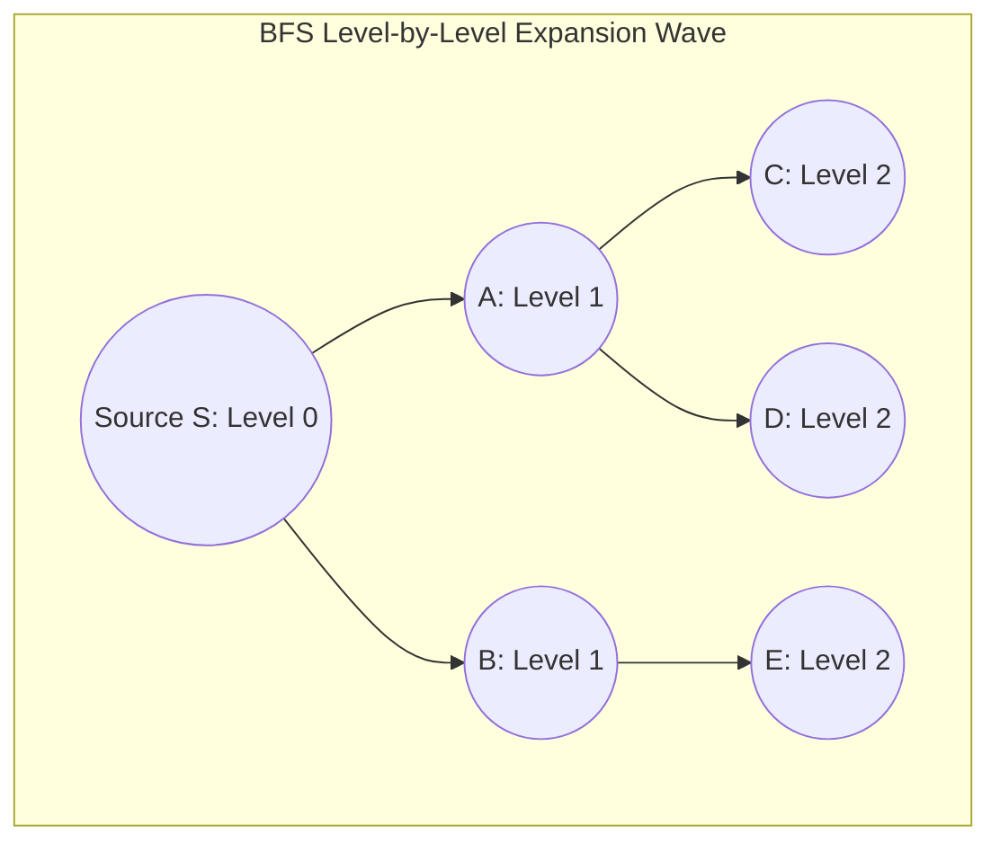

### Key Invariant of BFS

In an **unweighted graph** (or graph where all edge weights are equal), BFS is guaranteed to discover the **shortest path** (minimum number of edges) from the source to any reachable vertex. The first time a node is popped/visited, the recorded distance is optimal.

---

### Generic C# BFS Implementation with Shortest Path Reconstruction

```csharp
using System.Collections.Generic;

public sealed class BreadthFirstSearch
{
    /// <summary>
    /// Executes a standard level-order BFS traversal starting from source.
    /// </summary>
    public static List<TNode> Traverse<TNode>(
        TNode source, 
        IReadOnlyDictionary<TNode, List<TNode>> graph) where TNode : notnull
    {
        List<TNode> visitedOrder = [];
        HashSet<TNode> visited = [];
        Queue<TNode> queue = [];

        visited.Add(source);
        queue.Enqueue(source);

        while (queue.Count > 0)
        {
            TNode current = queue.Dequeue();
            visitedOrder.Add(current);

            if (!graph.TryGetValue(current, out var neighbors))
            {
                continue;
            }

            foreach (TNode neighbor in neighbors)
            {
                // Enqueue neighbor only if not previously encountered
                if (visited.Add(neighbor))
                {
                    queue.Enqueue(neighbor);
                }
            }
        }

        return visitedOrder;
    }

    /// <summary>
    /// Computes the unweighted shortest path from source to target.
    /// Returns the ordered list of vertices along the path, or empty if unreachable.
    /// </summary>
    public static List<TNode> FindShortestPath<TNode>(
        TNode source, 
        TNode target, 
        IReadOnlyDictionary<TNode, List<TNode>> graph) where TNode : notnull
    {
        if (EqualityComparer<TNode>.Default.Equals(source, target))
        {
            return [source];
        }

        HashSet<TNode> visited = [source];
        Queue<TNode> queue = [];
        Dictionary<TNode, TNode> parentMap = []; // Tracks edge used to reach each node

        queue.Enqueue(source);
        bool found = false;

        while (queue.Count > 0)
        {
            TNode current = queue.Dequeue();

            if (EqualityComparer<TNode>.Default.Equals(current, target))
            {
                found = true;
                break;
            }

            if (!graph.TryGetValue(current, out var neighbors))
            {
                continue;
            }

            foreach (TNode neighbor in neighbors)
            {
                if (visited.Add(neighbor))
                {
                    parentMap[neighbor] = current;
                    queue.Enqueue(neighbor);
                }
            }
        }

        if (!found)
        {
            return []; // Target is unreachable
        }

        // Reconstruct path backward from target to source
        List<TNode> path = [];
        TNode curr = target;
        while (!EqualityComparer<TNode>.Default.Equals(curr, source))
        {
            path.Add(curr);
            curr = parentMap[curr];
        }
        path.Add(source);
        path.Reverse();

        return path;
    }
}
```

### Complexity Analysis

- **Time Complexity**: $\mathcal{O}(V + E)$
  - Every vertex is enqueued and dequeued at most once: $\mathcal{O}(V)$.
  - Every outgoing edge is examined exactly once in directed graphs (twice in undirected): $\mathcal{O}(E)$.
- **Space Complexity**: $\mathcal{O}(V)$
  - `Queue<TNode>` stores at most $\mathcal{O}(V)$ nodes in the worst case (e.g., star graph where source links to all nodes).
  - `visited` and `parentMap` store $\mathcal{O}(V)$ elements.

---

## 🌲 4. Depth-First Search (DFS): Traversal & Cycle Detection

### Concept & Intuition

**Depth-First Search (DFS)** explores as deeply as possible along each branch before **backtracking**. It behaves identically to a pre-order/post-order tree traversal, utilizing either the runtime **call stack** (recursion) or an explicit **LIFO Stack** (`Stack<T>`).

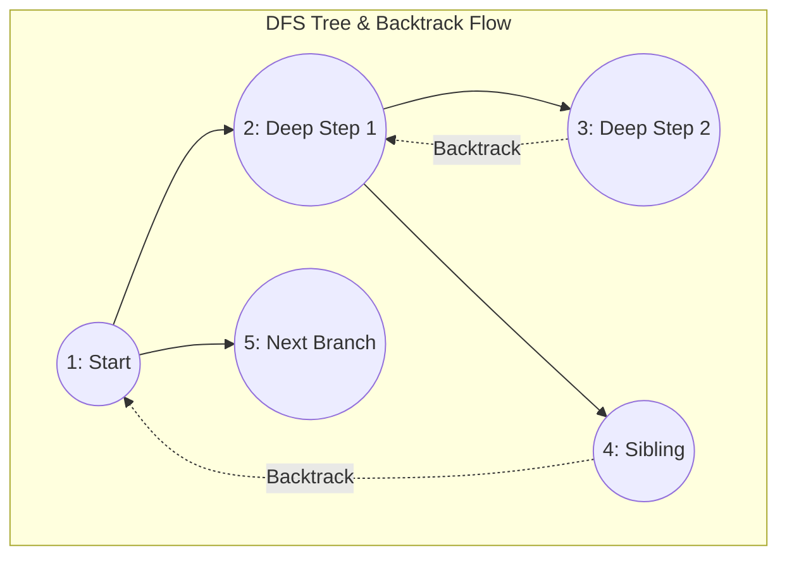

---

### Recursive vs. Iterative DFS

```csharp
public sealed class DepthFirstSearch
{
    // --- 1. Recursive DFS ---
    public static void TraverseRecursive<TNode>(
        TNode node, 
        IReadOnlyDictionary<TNode, List<TNode>> graph, 
        HashSet<TNode> visited, 
        Action<TNode> visitAction) where TNode : notnull
    {
        visited.Add(node);
        visitAction(node);

        if (graph.TryGetValue(node, out var neighbors))
        {
            foreach (TNode neighbor in neighbors)
            {
                if (!visited.Contains(neighbor))
                {
                    TraverseRecursive(neighbor, graph, visited, visitAction);
                }
            }
        }
    }

    // --- 2. Iterative DFS (Protects against StackOverflowException on deep graphs) ---
    public static List<TNode> TraverseIterative<TNode>(
        TNode source, 
        IReadOnlyDictionary<TNode, List<TNode>> graph) where TNode : notnull
    {
        List<TNode> result = [];
        HashSet<TNode> visited = [];
        Stack<TNode> stack = [];

        stack.Push(source);

        while (stack.Count > 0)
        {
            TNode current = stack.Pop();

            if (!visited.Add(current))
            {
                continue;
            }

            result.Add(current);

            if (graph.TryGetValue(current, out var neighbors))
            {
                // Push in reverse order if you want left-to-right visitation matching recursion
                for (int i = neighbors.Count - 1; i >= 0; i--)
                {
                    TNode neighbor = neighbors[i];
                    if (!visited.Contains(neighbor))
                    {
                        stack.Push(neighbor);
                    }
                }
            }
        }

        return result;
    }
}
```

---

### Cycle Detection in Directed Graphs (3-Color State Machine)

Detecting a cycle in a **directed graph** requires distinguishing between:

1. An edge pointing to a node currently in the **current recursion stack** (**Back Edge** $\rightarrow$ **Cycle Detected!**).
2. An edge pointing to a node already fully processed and completed in a previously explored branch (**Cross / Forward Edge** $\rightarrow$ **No Cycle**).

We use a 3-state (3-color) marking system:

- `White` (0): **Unvisited** — Not yet touched.
- `Gray` (1): **Visiting** — Currently on the active DFS recursion stack.
- `Black` (2): **Visited** — Fully explored, all descendants visited and popped.

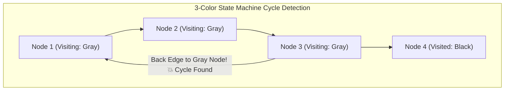

```csharp
public enum NodeState
{
    Unvisited = 0, // White
    Visiting = 1,  // Gray (On active recursion stack)
    Visited = 2    // Black (Fully processed)
}

public sealed class DirectedCycleDetector
{
    public static bool HasCycle(int numVertices, IReadOnlyDictionary<int, List<int>> graph)
    {
        NodeState[] states = new NodeState[numVertices];

        for (int i = 0; i < numVertices; i++)
        {
            if (states[i] == NodeState.Unvisited)
            {
                if (DfsCheckCycle(i, graph, states))
                {
                    return true;
                }
            }
        }

        return false;
    }

    private static bool DfsCheckCycle(
        int current, 
        IReadOnlyDictionary<int, List<int>> graph, 
        NodeState[] states)
    {
        states[current] = NodeState.Visiting; // Enter active stack (Gray)

        if (graph.TryGetValue(current, out var neighbors))
        {
            foreach (int neighbor in neighbors)
            {
                if (states[neighbor] == NodeState.Visiting)
                {
                    // Found a back-edge to an ancestor currently on the stack!
                    return true;
                }

                if (states[neighbor] == NodeState.Unvisited)
                {
                    if (DfsCheckCycle(neighbor, graph, states))
                    {
                        return true;
                    }
                }
            }
        }

        states[current] = NodeState.Visited; // Exit active stack (Black)
        return false;
    }
}
```

---

### Cycle Detection in Undirected Graphs

In an **undirected graph**, an edge back to the immediate `parent` node is simply traversing the bidirectional edge in reverse, not a cycle. A cycle exists if and only if we encounter an already-visited neighbor that is **not** the immediate parent.

```csharp
public static bool HasCycleUndirected(int numVertices, List<int>[] adj)
{
    bool[] visited = new bool[numVertices];

    for (int i = 0; i < numVertices; i++)
    {
        if (!visited[i])
        {
            if (DfsUndirected(i, -1, adj, visited))
            {
                return true;
            }
        }
    }

    return false;
}

private static bool DfsUndirected(int current, int parent, List<int>[] adj, bool[] visited)
{
    visited[current] = true;

    foreach (int neighbor in adj[current])
    {
        if (!visited[neighbor])
        {
            if (DfsUndirected(neighbor, current, adj, visited))
            {
                return true;
            }
        }
        else if (neighbor != parent)
        {
            // Visited neighbor that is not the direct parent -> Cycle found!
            return true;
        }
    }

    return false;
}
```

---

## 🔄 5. Directed Acyclic Graphs (DAGs) & Topological Sort

A **Directed Acyclic Graph (DAG)** is a directed graph containing no directed cycles.

### What is Topological Sort?

A **Topological Sort** of a DAG is a linear ordering of its vertices $v_1, v_2, \dots, v_n$ such that for every directed edge $(u, v)$, vertex $u$ appears **before** vertex $v$ in the ordering.

> [!IMPORTANT]
>
> - A topological ordering exists **if and only if** the graph is a **DAG**.
> - If a graph contains even a single cycle, topological sort is impossible.
> - A DAG may have multiple valid topological orderings.

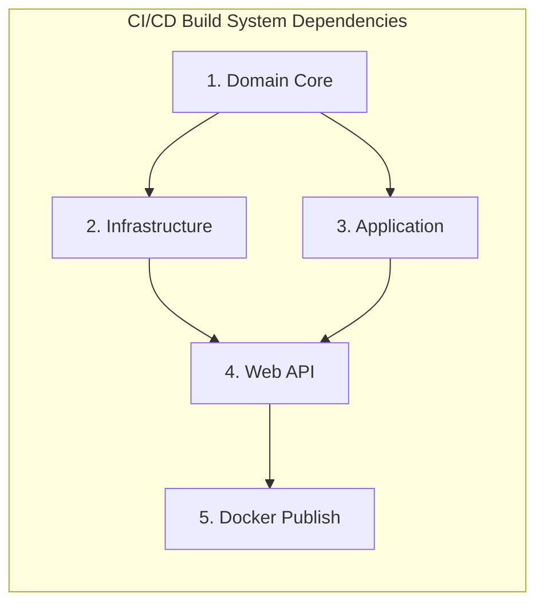

*Valid Topological Orders for above*:

1. `[Domain Core, Application, Infrastructure, Web API, Docker Publish]`
2. `[Domain Core, Infrastructure, Application, Web API, Docker Publish]`

---

### Algorithm 1: Kahn's Algorithm (BFS-based with In-Degrees)

Kahn's algorithm simulates dependency resolution by repeatedly stripping away nodes that have zero remaining prerequisites ($\text{In-Degree} = 0$).

#### Step-by-Step Mechanics

1. Compute the **In-Degree** of every vertex.
2. Enqueue all vertices with $\text{In-Degree} = 0$ into a `Queue<int>`.
3. While the queue is not empty:
   - Dequeue vertex $u$, append $u$ to the topological order list.
   - For each neighbor $v$ of $u$, decrement $\text{In-Degree}(v)$ by 1.
   - If $\text{In-Degree}(v) == 0$, enqueue $v$.
4. **Cycle Validation**: If `order.Count != |V|`, the graph has a cycle (unresolved dependencies remaining).

```csharp
public sealed class KahnTopologicalSort
{
    public static (bool Success, List<int> Order) Sort(
        int numVertices, 
        IReadOnlyDictionary<int, List<int>> graph)
    {
        int[] inDegree = new int[numVertices];

        // Step 1: Calculate In-Degrees
        foreach (var (u, neighbors) in graph)
        {
            foreach (int v in neighbors)
            {
                inDegree[v]++;
            }
        }

        // Step 2: Enqueue all vertices with 0 in-degree
        Queue<int> zeroInDegreeQueue = new();
        for (int i = 0; i < numVertices; i++)
        {
            if (inDegree[i] == 0)
            {
                zeroInDegreeQueue.Enqueue(i);
            }
        }

        List<int> sortedOrder = new(capacity: numVertices);

        // Step 3: Process queue
        while (zeroInDegreeQueue.Count > 0)
        {
            int current = zeroInDegreeQueue.Dequeue();
            sortedOrder.Add(current);

            if (graph.TryGetValue(current, out var neighbors))
            {
                foreach (int neighbor in neighbors)
                {
                    inDegree[neighbor]--;
                    if (inDegree[neighbor] == 0)
                    {
                        zeroInDegreeQueue.Enqueue(neighbor);
                    }
                }
            }
        }

        // Step 4: Cycle check
        if (sortedOrder.Count != numVertices)
        {
            return (Success: false, Order: []); // Cycle detected!
        }

        return (Success: true, Order: sortedOrder);
    }
}
```

---

### Algorithm 2: DFS-Based Topological Sort (Post-Order Reversal)

A node is pushed to a result stack **after** all of its downstream dependencies have been completely explored. Reversing the post-order sequence yields the topological sort.

```csharp
public sealed class DfsTopologicalSort
{
    public static (bool Success, List<int> Order) Sort(
        int numVertices, 
        IReadOnlyDictionary<int, List<int>> graph)
    {
        NodeState[] states = new NodeState[numVertices];
        Stack<int> finishStack = new();

        for (int i = 0; i < numVertices; i++)
        {
            if (states[i] == NodeState.Unvisited)
            {
                if (!Dfs(i, graph, states, finishStack))
                {
                    return (Success: false, Order: []); // Cycle detected!
                }
            }
        }

        List<int> result = new(capacity: numVertices);
        while (finishStack.Count > 0)
        {
            result.Add(finishStack.Pop());
        }

        return (Success: true, Order: result);
    }

    private static bool Dfs(
        int current, 
        IReadOnlyDictionary<int, List<int>> graph, 
        NodeState[] states, 
        Stack<int> finishStack)
    {
        states[current] = NodeState.Visiting;

        if (graph.TryGetValue(current, out var neighbors))
        {
            foreach (int neighbor in neighbors)
            {
                if (states[neighbor] == NodeState.Visiting)
                {
                    return false; // Cycle detected
                }

                if (states[neighbor] == NodeState.Unvisited)
                {
                    if (!Dfs(neighbor, graph, states, finishStack))
                    {
                        return false;
                    }
                }
            }
        }

        states[current] = NodeState.Visited;
        finishStack.Push(current); // Post-order insertion
        return true;
    }
}
```

### Real-World .NET Application: Clean Architecture Dependency Resolver

In Clean Architecture, layers must strictly depend inward (`Presentation` $\rightarrow$ `Infrastructure` $\rightarrow$ `Application` $\rightarrow$ `Domain`). Kahn's algorithm is used by project orchestrators to compute parallel compilation batches:

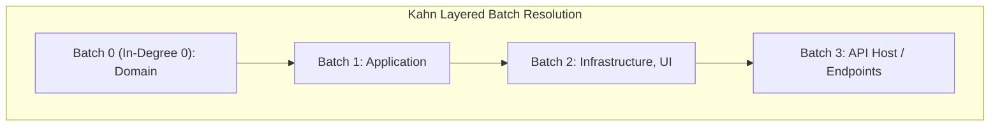

---

## 🚀 6. Single-Source & All-Pairs Shortest Path Algorithms

Finding the shortest path in **weighted graphs** depends fundamentally on whether edge weights can be **negative**.

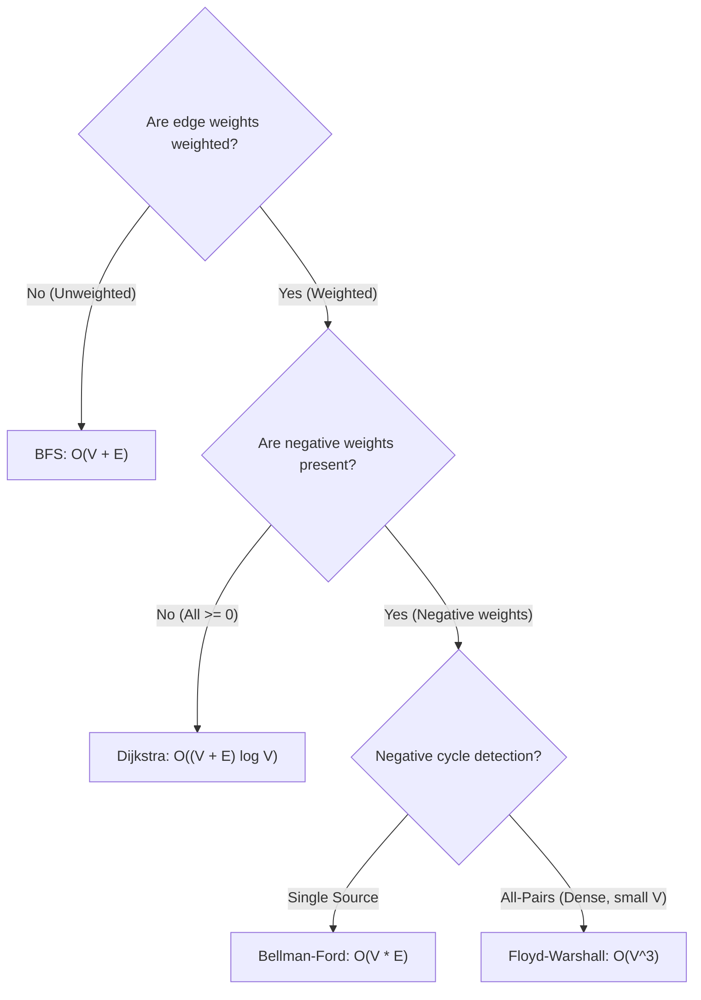

---

### 1. Dijkstra's Algorithm (Non-Negative Weights)

Dijkstra's algorithm uses a **Greedy strategy**. It maintains a tentative distance to every node and greedily extracts the unvisited vertex with the **minimum current distance** using a **Min-Priority Queue**.

Starting in **.NET 6+**, C# provides `System.Collections.Generic.PriorityQueue<TElement, TPriority>`, eliminating the need for third-party heap packages.

#### Algorithm Invariant

Because all edge weights are $\ge 0$, when a node $u$ is dequeued from the min-heap, its tentative distance `dist[u]` is mathematically guaranteed to be the final, optimal shortest path distance.

```csharp
using System;
using System.Collections.Generic;

public readonly record struct WeightedEdge(int Target, int Weight);

public sealed class DijkstraShortestPath
{
    public static (int[] Distances, int[] Parents) Compute(
        int numVertices, 
        IReadOnlyDictionary<int, List<WeightedEdge>> graph, 
        int source)
    {
        int[] distances = new int[numVertices];
        int[] parents = new int[numVertices];
        Array.Fill(distances, int.MaxValue);
        Array.Fill(parents, -1);

        // Min-Priority Queue where Priority = Tentative Distance
        PriorityQueue<int, int> pq = new();

        distances[source] = 0;
        pq.Enqueue(source, 0);

        while (pq.Count > 0)
        {
            pq.TryDequeue(out int u, out int currentDist);

            // Stale entry check: if priority queue contained an older, longer path
            if (currentDist > distances[u])
            {
                continue;
            }

            if (!graph.TryGetValue(u, out var edges))
            {
                continue;
            }

            foreach (var edge in edges)
            {
                int v = edge.Target;
                int weight = edge.Weight;

                if (weight < 0)
                {
                    throw new InvalidOperationException("Dijkstra does not support negative edge weights.");
                }

                // Relaxation Step
                if (distances[u] != int.MaxValue && distances[u] + weight < distances[v])
                {
                    distances[v] = distances[u] + weight;
                    parents[v] = u;
                    pq.Enqueue(v, distances[v]);
                }
            }
        }

        return (distances, parents);
    }

    public static List<int> ReconstructPath(int source, int target, int[] parents)
    {
        List<int> path = [];
        int curr = target;

        while (curr != -1)
        {
            path.Add(curr);
            if (curr == source) break;
            curr = parents[curr];
        }

        if (path.Count == 0 || path[^1] != source)
        {
            return []; // Unreachable
        }

        path.Reverse();
        return path;
    }
}
```

- **Time Complexity**: $\mathcal{O}((V + E) \log V)$ using binary heap (`PriorityQueue`).
- **Space Complexity**: $\mathcal{O}(V + E)$ to store distances, parents, and queue items.

---

### 2. Bellman-Ford Algorithm (Handles Negative Weights & Cycle Detection)

Why does Dijkstra fail on negative edges?
Dijkstra permanently marks a node as "visited/finalized" upon extraction from the queue. If a subsequent negative edge provides a cheaper route to that node later, Dijkstra cannot re-evaluate it without infinite loops or invalid complexity.

**Bellman-Ford** resolves this using **Dynamic Programming**:

- In a simple graph with $|V|$ vertices, the shortest path without cycles contains at most $|V| - 1$ edges.
- Bellman-Ford relaxes **all $|E|$ edges** systematically $|V| - 1$ times.
- A **$|V|$-th relaxation pass** is executed: if any edge can still be relaxed, a **Negative Weight Cycle** exists (cost can decrease to $-\infty$).

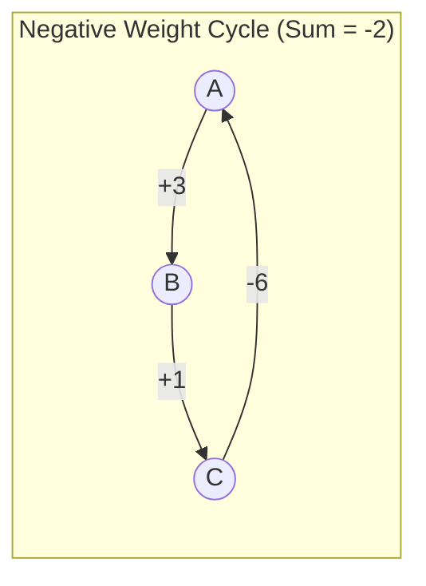

```csharp
public readonly record struct DirectedEdge(int Source, int Target, int Weight);

public sealed class BellmanFord
{
    public static (bool HasNegativeCycle, int[] Distances) Compute(
        int numVertices, 
        IReadOnlyList<DirectedEdge> edges, 
        int source)
    {
        int[] distances = new int[numVertices];
        Array.Fill(distances, int.MaxValue);
        distances[source] = 0;

        // Step 1: Relax all edges |V| - 1 times
        for (int i = 1; i <= numVertices - 1; i++)
        {
            bool anyChange = false;

            foreach (var edge in edges)
            {
                if (distances[edge.Source] != int.MaxValue &&
                    distances[edge.Source] + edge.Weight < distances[edge.Target])
                {
                    distances[edge.Target] = distances[edge.Source] + edge.Weight;
                    anyChange = true;
                }
            }

            // Early exit optimization if distances converged
            if (!anyChange)
            {
                break;
            }
        }

        // Step 2: Check for negative-weight cycles (V-th iteration)
        foreach (var edge in edges)
        {
            if (distances[edge.Source] != int.MaxValue &&
                distances[edge.Source] + edge.Weight < distances[edge.Target])
            {
                return (HasNegativeCycle: true, Distances: []);
            }
        }

        return (HasNegativeCycle: false, Distances: distances);
    }
}
```

- **Time Complexity**: $\mathcal{O}(V \times E)$
- **Space Complexity**: $\mathcal{O}(V)$

---

### 3. Floyd-Warshall Algorithm (All-Pairs Shortest Path)

The **Floyd-Warshall** algorithm computes the shortest path between **all pairs of vertices** $(u, v)$ simultaneously using dynamic programming.

#### Core Recurrence Relation

Let $D^{(k)}[i, j]$ be the shortest path from $i$ to $j$ using only intermediate vertices from $\{0, 1, \dots, k\}$:
$$D^{(k)}[i, j] = \min\left( D^{(k-1)}[i, j], \; D^{(k-1)}[i, k] + D^{(k-1)}[k, j] \right)$$

```csharp
public sealed class FloydWarshall
{
    public const int Infinity = 1_000_000_000; // Avoid integer overflow

    public static int[,] ComputeAllPairs(int numVertices, int[,] initialMatrix)
    {
        int[,] dist = new int[numVertices, numVertices];
        Array.Copy(initialMatrix, dist, initialMatrix.Length);

        // k = intermediate vertex pivot
        for (int k = 0; k < numVertices; k++)
        {
            for (int i = 0; i < numVertices; i++)
            {
                for (int j = 0; j < numVertices; j++)
                {
                    if (dist[i, k] != Infinity && dist[k, j] != Infinity)
                    {
                        dist[i, j] = Math.Min(dist[i, j], dist[i, k] + dist[k, j]);
                    }
                }
            }
        }

        return dist;
    }
}
```

- **Time Complexity**: $\mathcal{O}(V^3)$ (3 nested loops).
- **Space Complexity**: $\mathcal{O}(V^2)$ (distance matrix).
- **Best Use Case**: Dense graphs with small $V \le 400$ (e.g., routing tables in a localized datacenter cluster).

---

## 🌐 7. Minimum Spanning Tree (MST)

For a **connected, undirected, weighted graph**, a **Spanning Tree** is a subgraph that connects all $|V|$ vertices with exactly $|V| - 1$ edges and no cycles.

A **Minimum Spanning Tree (MST)** is a spanning tree whose sum of edge weights is minimized.

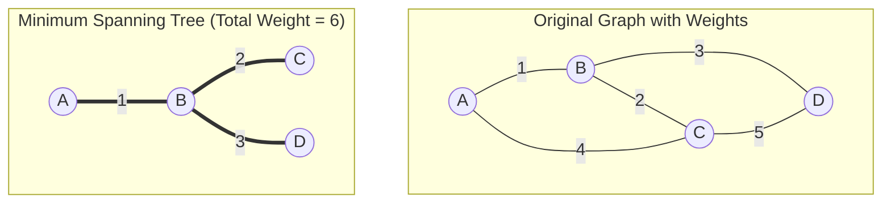

---

### Prim's vs. Kruskal's Algorithms

| Feature | Prim's Algorithm | Kruskal's Algorithm |
| :--- | :--- | :--- |
| **Strategy** | **Vertex-centric** (Grows a single tree from a starting root) | **Edge-centric** (Merges disjoint forests globally) |
| **Core Data Structure** | `PriorityQueue<TNode, TWeight>` | **Disjoint Set Union (DSU / Union-Find)** + Sorted Edges |
| **Time Complexity** | $\mathcal{O}((V + E) \log V)$ | $\mathcal{O}(E \log E)$ |
| **Graph Suitability** | **Dense graphs** ($E \approx V^2$) | **Sparse graphs** ($E \ll V^2$) |

---

### Kruskal's Algorithm with Disjoint Set Union (DSU / Union-Find)

Kruskal's sorts all edges in ascending order of weight, and greedily adds the next smallest edge if and only if it does not form a cycle (checked via Union-Find in near $\mathcal{O}(1)$ time).

```csharp
public sealed class DisjointSetUnion
{
    private readonly int[] _parent;
    private readonly int[] _rank;

    public DisjointSetUnion(int size)
    {
        _parent = new int[size];
        _rank = new int[size];
        for (int i = 0; i < size; i++)
        {
            _parent[i] = i;
            _rank[i] = 0;
        }
    }

    /// <summary>
    /// Finds the representative root of node with Path Compression.
    /// </summary>
    public int Find(int node)
    {
        if (_parent[node] != node)
        {
            _parent[node] = Find(_parent[node]); // Path compression
        }
        return _parent[node];
    }

    /// <summary>
    /// Merges sets containing u and v with Union by Rank.
    /// Returns false if u and v were already in the same set (cycle).
    /// </summary>
    public bool Union(int u, int v)
    {
        int rootU = Find(u);
        int rootV = Find(v);

        if (rootU == rootV)
        {
            return false; // Cycle detected
        }

        // Attach smaller rank tree under larger rank tree
        if (_rank[rootU] < _rank[rootV])
        {
            _parent[rootU] = rootV;
        }
        else if (_rank[rootU] > _rank[rootV])
        {
            _parent[rootV] = rootU;
        }
        else
        {
            _parent[rootV] = rootU;
            _rank[rootU]++;
        }

        return true;
    }
}

public sealed class KruskalMst
{
    public static (int TotalCost, List<Edge<int>> MstEdges) Compute(
        int numVertices, 
        List<Edge<int>> edges)
    {
        // Step 1: Sort edges by ascending weight
        edges.Sort((a, b) => a.Weight.CompareTo(b.Weight));

        DisjointSetUnion dsu = new(numVertices);
        List<Edge<int>> mst = [];
        int totalCost = 0;

        foreach (var edge in edges)
        {
            if (dsu.Union(edge.Source, edge.Target))
            {
                mst.Add(edge);
                totalCost += edge.Weight;

                if (mst.Count == numVertices - 1)
                {
                    break; // Spanning tree complete
                }
            }
        }

        return (totalCost, mst);
    }
}
```

---

## 💡 8. Essential Graph Interview Patterns & LeetCode Classics

---

### Pattern 1: Grid BFS / DFS — "Number of Islands" (LeetCode 200)

**Problem**: Given an $m \times n$ 2D binary grid where `'1'` represents land and `'0'` represents water, return the number of islands.

**Approach**: Iterate through each cell. When a `'1'` is encountered, increment island count and trigger a BFS/DFS to sink the island (mark all 4-directionally connected `'1'`s as `'0'`).

```csharp
public sealed class NumberOfIslandsSolution
{
    private static readonly (int Row, int Col)[] Directions = 
    [
        (-1, 0), (1, 0), (0, -1), (0, 1)
    ];

    public int NumIslands(char[][] grid)
    {
        if (grid == null || grid.Length == 0) return 0;

        int rows = grid.Length;
        int cols = grid[0].Length;
        int islandCount = 0;

        for (int r = 0; r < rows; r++)
        {
            for (int c = 0; c < cols; c++)
            {
                if (grid[r][c] == '1')
                {
                    islandCount++;
                    DfsSink(grid, r, c, rows, cols);
                }
            }
        }

        return islandCount;
    }

    private static void DfsSink(char[][] grid, int r, int c, int rows, int cols)
    {
        // Boundary checks and water check
        if (r < 0 || r >= rows || c < 0 || c >= cols || grid[r][c] != '1')
        {
            return;
        }

        grid[r][c] = '0'; // Mutate in-place to avoid extra visited matrix

        foreach (var (dr, dc) in Directions)
        {
            DfsSink(grid, r + dr, c + dc, rows, cols);
        }
    }
}
```

- **Time Complexity**: $\mathcal{O}(M \times N)$
- **Space Complexity**: $\mathcal{O}(M \times N)$ worst-case call stack (e.g. grid completely filled with land).

---

### Pattern 2: Deep Copy / Graph Cloning — "Clone Graph" (LeetCode 133)

**Problem**: Given a reference of a node in a connected undirected graph, return a **deep copy** (clone) of the graph.

**Approach**: Maintain a `Dictionary<Node, Node>` mapping `originalNode -> clonedNode`. Use DFS or BFS to traverse the graph, creating clones on demand and wiring neighbor references.

```csharp
public class Node
{
    public int val;
    public IList<Node> neighbors;

    public Node()
    {
        val = 0;
        neighbors = [];
    }

    public Node(int _val)
    {
        val = _val;
        neighbors = [];
    }

    public Node(int _val, List<Node> _neighbors)
    {
        val = _val;
        neighbors = _neighbors;
    }
}

public sealed class CloneGraphSolution
{
    private readonly Dictionary<Node, Node> _visitedMap = new();

    public Node? CloneGraph(Node? node)
    {
        if (node == null) return null;

        if (_visitedMap.TryGetValue(node, out var clonedExisting))
        {
            return clonedExisting;
        }

        Node clone = new(node.val);
        _visitedMap[node] = clone;

        foreach (Node neighbor in node.neighbors)
        {
            clone.neighbors.Add(CloneGraph(neighbor)!);
        }

        return clone;
    }
}
```

- **Time Complexity**: $\mathcal{O}(V + E)$
- **Space Complexity**: $\mathcal{O}(V)$ for the visited dictionary and recursion stack.

---

### Pattern 3: Dependency Resolution — "Course Schedule I & II" (LeetCode 207 & 210)

**Problem**: You must take $N$ courses labeled $0 \dots N-1$. Prerequisites are given as pairs $[a, b]$ meaning you must take course $b$ before course $a$.

- Course Schedule I: Return `true` if you can finish all courses.
- Course Schedule II: Return the ordering of courses you should take.

**Approach**: Kahn's algorithm (BFS with In-Degrees) solves both simultaneously.

```csharp
public sealed class CourseScheduleSolution
{
    public int[] FindOrder(int numCourses, int[][] prerequisites)
    {
        List<int>[] graph = new List<int>[numCourses];
        int[] inDegree = new int[numCourses];

        for (int i = 0; i < numCourses; i++)
        {
            graph[i] = [];
        }

        foreach (var prereq in prerequisites)
        {
            int course = prereq[0];
            int dependency = prereq[1];
            graph[dependency].Add(course); // dependency -> course
            inDegree[course]++;
        }

        Queue<int> queue = new();
        for (int i = 0; i < numCourses; i++)
        {
            if (inDegree[i] == 0)
            {
                queue.Enqueue(i);
            }
        }

        int[] order = new int[numCourses];
        int index = 0;

        while (queue.Count > 0)
        {
            int current = queue.Dequeue();
            order[index++] = current;

            foreach (int neighbor in graph[current])
            {
                inDegree[neighbor]--;
                if (inDegree[neighbor] == 0)
                {
                    queue.Enqueue(neighbor);
                }
            }
        }

        return index == numCourses ? order : []; // Empty array if cycle detected
    }
}
```

---

### Pattern 4: Shortest Word Transformation — "Word Ladder" (LeetCode 127)

**Problem**: Given two words `beginWord` and `endWord`, and a dictionary `wordList`, return the length of the shortest transformation sequence such that each adjacent pair differs by exactly one letter.

**Approach**: Unweighted shortest path on an implicit graph $\rightarrow$ **BFS with level tracking**.

```csharp
public sealed class WordLadderSolution
{
    public int LadderLength(string beginWord, string endWord, IList<string> wordList)
    {
        HashSet<string> wordSet = new(wordList);
        if (!wordSet.Contains(endWord))
        {
            return 0;
        }

        Queue<string> queue = new();
        queue.Enqueue(beginWord);
        wordSet.Remove(beginWord);

        int level = 1;

        while (queue.Count > 0)
        {
            int levelSize = queue.Count;

            for (int i = 0; i < levelSize; i++)
            {
                string current = queue.Dequeue();

                if (current == endWord)
                {
                    return level;
                }

                char[] chars = current.ToCharArray();
                for (int c = 0; c < chars.Length; c++)
                {
                    char originalChar = chars[c];

                    for (char ch = 'a'; ch <= 'z'; ch++)
                    {
                        if (ch == originalChar) continue;

                        chars[c] = ch;
                        string transformed = new(chars);

                        if (wordSet.Remove(transformed)) // O(1) contains + remove
                        {
                            queue.Enqueue(transformed);
                        }
                    }

                    chars[c] = originalChar; // Backtrack character
                }
            }

            level++;
        }

        return 0;
    }
}
```

- **Time Complexity**: $\mathcal{O}(N \times L^2)$ where $N$ is number of words, and $L$ is word length.
- **Space Complexity**: $\mathcal{O}(N \times L)$.

---

## 📊 9. Comprehensive Complexity Reference Table

| Algorithm / Problem | Graph Type | Time Complexity | Space Complexity | Key Invariant / Data Structure |
| :--- | :--- | :--- | :--- | :--- |
| **BFS** | Unweighted | $\mathbf{\mathcal{O}(V + E)}$ | $\mathcal{O}(V)$ | Queue (FIFO), guarantees shortest path in unweighted graphs |
| **DFS** | General | $\mathbf{\mathcal{O}(V + E)}$ | $\mathcal{O}(V)$ | Call Stack / LIFO Stack, connectivity, path existence |
| **Cycle Detection (Directed)** | Directed | $\mathbf{\mathcal{O}(V + E)}$ | $\mathcal{O}(V)$ | 3-Color State Machine (`White`/`Gray`/`Black`), detects back-edges |
| **Topological Sort (Kahn's)** | DAG | $\mathbf{\mathcal{O}(V + E)}$ | $\mathcal{O}(V)$ | In-degree array + Queue, fails if cycle exists |
| **Topological Sort (DFS)** | DAG | $\mathbf{\mathcal{O}(V + E)}$ | $\mathcal{O}(V)$ | Post-order reversal via Stack |
| **Dijkstra** | Non-negative weights | $\mathbf{\mathcal{O}((V + E) \log V)}$ | $\mathcal{O}(V)$ | Greedy with Min-`PriorityQueue<TNode, TPriority>` |
| **Bellman-Ford** | Negative weights allowed | $\mathcal{O}(V \times E)$ | $\mathcal{O}(V)$ | DP edge relaxation $(V - 1)$ times; detects negative cycles |
| **Floyd-Warshall** | All-pairs, no neg cycles | $\mathcal{O}(V^3)$ | $\mathcal{O}(V^2)$ | 3-loop DP matrix formulation; ideal for small dense graphs ($V \le 400$) |
| **Prim's MST** | Connected Undirected | $\mathbf{\mathcal{O}((V + E) \log V)}$ | $\mathcal{O}(V)$ | Vertex-growing greedy cut using Min-Priority Queue |
| **Kruskal's MST** | Connected Undirected | $\mathbf{\mathcal{O}(E \log E)}$ | $\mathcal{O}(V)$ | Edge-sorting greedy with Disjoint Set Union (Union-Find) |

---

## 🎯 10. Senior .NET Technical Interview Q&A

### Q1: How does the .NET Garbage Collector (GC) Mark-and-Sweep phase utilize graph algorithms?

**Answer**:
The .NET CLR Garbage Collector models all managed objects on the GC heap as a **Directed Object Reference Graph**:

- **Roots**: Static variables, local variables currently on thread stack frames, CPU registers, pinned handles (`GCHandle`), and finalization queues.
- **Edges**: Reference fields (`class` pointers) inside objects pointing to other objects.

During the **Mark Phase**:

1. The GC pauses application threads (during blocking GC) or takes a snapshot.
2. It initiates a **Graph Traversal (optimized iterative DFS/BFS)** starting from all active **GC Roots**.
3. Every reachable object has its sync block header / mark bit set to `1`.
4. Any object not marked at the end of the traversal represents an **unreachable disconnected component** and is reclaimed during the **Sweep/Compact Phase**.

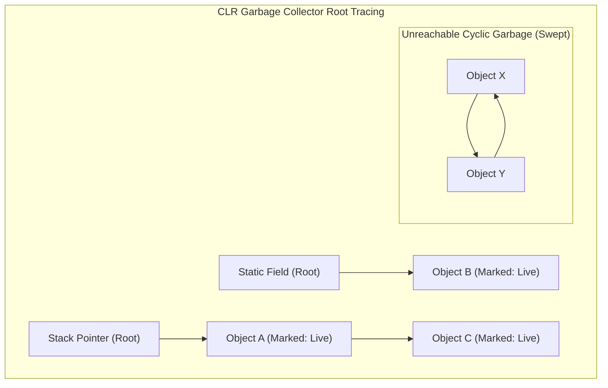

Notice that reference counting (like COM or Swift ARC) leaks on cyclic structures (`ObjX <-> ObjY`), whereas graph reachability traversal safely sweeps cyclic garbage.

---

### Q2: How does `Microsoft.Extensions.DependencyInjection` detect circular dependencies, and what happens at runtime?

**Answer**:
When `IServiceProvider` builds an object graph (e.g., resolving `ServiceA` which injects `ServiceB` which injects `ServiceA`), it traverses a **Directed Service Graph**.

1. **At Registration Time**: Services are registered in `IServiceCollection` as `ServiceDescriptor` entries.
2. **At Build/Verification Time**: When `ValidateOnBuild = true` or `ValidateScopes = true` is enabled in `ServiceProviderOptions`, the container builds the dependency tree for each singleton and scoped service.
3. **Detection Mechanism**: The DI engine tracks an active resolution chain (effectively the **Gray/Visiting stack in a 3-color DFS**). If a constructor parameter requires a service type that is currently in the active instantiation call stack, an `InvalidOperationException` is thrown:

```text
System.InvalidOperationException: A circular dependency was detected for the service of type 'ServiceA'.
ServiceA -> ServiceB -> ServiceA
```

---

### Q3: Why does Dijkstra's algorithm fail on graphs with negative edge weights, while Bellman-Ford succeeds?

**Answer**:

- **Dijkstra's Invariant**: Dijkstra operates under the greedy assumption that adding an edge to a path always increases (or keeps identical) the path's total cost ($w(e) \ge 0$). Once a vertex $u$ is extracted from the min-priority queue, its tentative distance is finalized and will never be updated.
- **Failure Mode with Negative Edges**: If a negative edge later provides a shorter route to an already-finalized vertex, Dijkstra will not update the downstream nodes that were already computed from the old, higher distance.
- **Bellman-Ford Solution**: Bellman-Ford makes no greedy finality assumptions. It relaxes every edge $|V|-1$ times, propagating negative edge benefits through all paths up to length $|V|-1$. Furthermore, its $|V|$-th iteration detects if a negative cycle permits an infinite loop of reductions.

---

### Q4: What are the GC allocation and cache performance implications of `Dictionary<int, List<int>>` vs. Compressed Sparse Row (CSR) in high-throughput .NET services?

**Answer**:
For large graphs ($V > 100,000$):

1. **`Dictionary<int, List<int>>`**:
   - Every dictionary entry allocates a hash bucket entry + `List<int>` object + internal `int[]` buffer.
   - For $100,000$ vertices, this causes $>200,000$ individual objects on the GC heap, triggering high GC Gen 1/Gen 2 overhead and heap fragmentation.
   - Traversing neighbors causes severe **CPU cache misses** due to pointer chasing across fragmented memory addresses.

2. **Compressed Sparse Row (CSR)**:
   - Uses exactly **two flat contiguous arrays**: `int[] nodeOffsets` of size $|V|+1$ and `int[] edgeTargets` of size $|E|$.
   - Neighbors of node $u$ reside contiguously between `edgeTargets[nodeOffsets[u]]` and `edgeTargets[nodeOffsets[u + 1] - 1]`.
   - **Benefits**: Exactly 2 heap objects, zero GC fragmentation, and maximum **CPU L1/L2 data cache prefetching efficiency**.

```csharp
// Compressed Sparse Row (CSR) representation for maximum performance
public readonly struct CsrGraph
{
    private readonly int[] _offsets;
    private readonly int[] _edges;

    public CsrGraph(int[] offsets, int[] edges)
    {
        _offsets = offsets;
        _edges = edges;
    }

    public ReadOnlySpan<int> GetNeighbors(int u)
    {
        int start = _offsets[u];
        int length = _offsets[u + 1] - start;
        return _edges.AsSpan(start, length);
    }
}
```

---

### Q5: How do you implement parallel or multi-threaded graph traversal in C# without race conditions?

**Answer**:
Parallelizing graph traversal (e.g. Level-Synchronous Parallel BFS) is typically achieved via **batch level-synchronous processing**:

1. **Level-Synchronous Parallel BFS**:
   - Keep current level frontier in a concurrent bag or array slice.
   - Use `Parallel.ForEach` over the current level's nodes to explore outgoing edges.
   - Atomically mark visited status using `Interlocked.CompareExchange` or thread-safe bitsets.
   - Collect the next level's frontier into a `ConcurrentBag<T>` or thread-local lists merged at a barrier.

```csharp
public static void ParallelBfsLevel(
    int[] currentFrontier, 
    List<int>[] adj, 
    int[] visited, 
    ConcurrentBag<int> nextFrontier)
{
    Parallel.ForEach(currentFrontier, u =>
    {
        foreach (int v in adj[u])
        {
            // Atomically mark visited (0 -> 1)
            if (Interlocked.CompareExchange(ref visited[v], 1, 0) == 0)
            {
                nextFrontier.Add(v);
            }
        }
    });
}
```
