# 07 - Sorting & Searching Algorithms: Deep Dive & .NET Engineering

Sorting and searching are the foundational pillars of computer science and systems engineering. Whether optimizing database query plans with merge joins, accelerating lookups from $\mathcal{O}(n)$ to $\mathcal{O}(\log n)$ via binary search, or processing millions of events per second in zero-allocation .NET pipelines, selecting and understanding the right algorithm is essential for building high-performance software.

In modern .NET (including **.NET 10**), sorting is not a one-size-fits-all problem. The runtime employs sophisticated hybrid algorithms like **IntroSort** for `Array.Sort<T>()` and `Span<T>.Sort()`, while providing stable key-extraction sorting via LINQ's `Enumerable.OrderBy()`.

---

## 📚 1. Why Sorting Matters in Modern Software Engineering

Sorting rearranges a collection of items into a monotonic order (ascending or descending) based on one or more keys. While often taught as an academic exercise, sorting plays a critical role across the entire software stack.

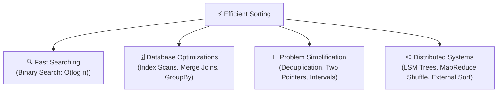

### 1.1 Enabling Logarithmic Search

On an unsorted collection of size $n$, finding an arbitrary element requires a linear scan with **$\mathcal{O}(n)$** time complexity. Once sorted, we can use **Binary Search** to locate any key in **$\mathcal{O}(\log n)$** time.

| Collection Size ($n$) | Linear Search ($\mathcal{O}(n)$ Operations) | Binary Search ($\mathcal{O}(\log_2 n)$ Operations) | Speedup Factor |
| :--- | :--- | :--- | :--- |
| $1,000$ | $1,000$ | $\approx 10$ | $100\times$ |
| $1,000,000$ | $1,000,000$ | $\approx 20$ | $50,000\times$ |
| $1,000,000,000$ | $1,000,000,000$ | $\approx 30$ | $33,333,333\times$ |

### 1.2 Algorithmic Simplification

Sorting transforms unstructured data into structured data, simplifying many complex problems:

- **Duplicate Detection**: In an unsorted array, finding duplicates naively takes $\mathcal{O}(n^2)$ or requires $\mathcal{O}(n)$ hash set memory. Once sorted, duplicates sit adjacent to each other, discoverable in a single $\mathcal{O}(n)$ pass with $\mathcal{O}(1)$ extra space.
- **Interval Merging**: Merging overlapping time windows (e.g., booking schedules) becomes trivial once intervals are sorted by start time.
- **Two-Pointer Technique**: Problems like Two-Sum, Three-Sum, and Container With Most Water run in linear or quadratic time after an initial sort.
- **Greedy Algorithms**: Activity selection, fractional knapsack, and task scheduling require sorting items by cost, deadline, or value ratio.

### 1.3 Database Query Engine Optimization

Relational database engines (SQL Server, PostgreSQL) and storage engines rely heavily on sorted structures:

- **Clustered Indexes & B+ Trees**: Data pages are physically ordered by the clustered key, allowing lightning-fast range scans (`BETWEEN '2026-01-01' AND '2026-01-31'`).
- **Merge Joins**: If both joined tables are sorted on the join key, the database engine joins them in $\mathcal{O}(n + m)$ time via a single synchronized cursor pass, avoiding expensive $\mathcal{O}(n \cdot m)$ nested loops or hash table builds.
- **`GROUP BY` & `DISTINCT` Aggregations**: Pre-sorted streams allow stream aggregators to compute sums and distinct counts without holding states in memory.

### 1.4 Distributed Systems & Storage Engines

- **Log-Structured Merge-Trees (LSM Trees)**: Storage engines like RocksDB, Cassandra, and Azure Cosmos DB write sorted tables (**SSTables**) to disk, merging them in background compaction cycles using multi-way Merge Sort.
- **External Sorting**: When datasets (e.g., 100 GB of telemetry logs) exceed physical RAM, external multi-way merge sort enables chunk-by-chunk sorting and merging.

---

## 🔍 2. Fundamental Comparison-Based Sorts ($\mathcal{O}(n^2)$)

Comparison-based sorting algorithms determine the order of elements solely by comparing pairs using operators ($<$, $>$, $\le$, $\ge$) or `IComparable<T>.CompareTo()`.

### 2.1 Bubble Sort: Simple but Slow

#### How It Works

Bubble Sort repeatedly steps through the list, compares adjacent elements, and swaps them if they are in the wrong order. After the $k$-th pass, the $k$-th largest element "bubbles up" to its final position at the end of the array.

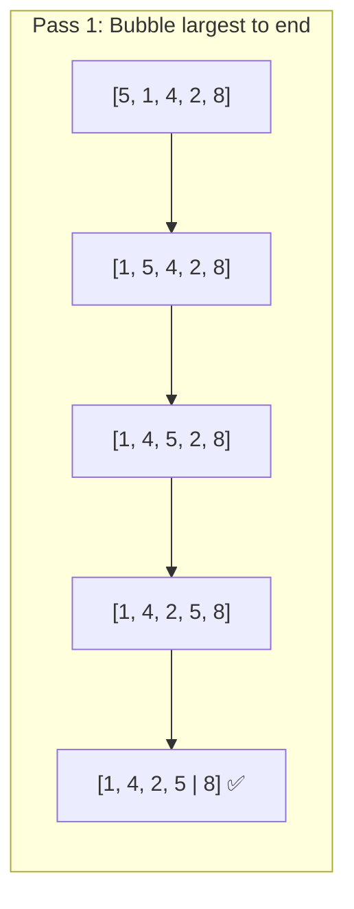

#### C# Implementation with Early Exit Optimization

```csharp
public static class BubbleSort
{
    public static void Sort<T>(Span<T> span) where T : IComparable<T>
    {
        int n = span.Length;
        for (int i = 0; i < n - 1; i++)
        {
            bool swapped = false;
            for (int j = 0; j < n - 1 - i; j++)
            {
                if (span[j].CompareTo(span[j + 1]) > 0)
                {
                    (span[j], span[j + 1]) = (span[j + 1], span[j]);
                    swapped = true;
                }
            }

            // Early exit if no swaps occurred: array is already sorted
            if (!swapped)
            {
                break;
            }
        }
    }
}
```

#### Complexity Analysis

- **Best Case**: $\mathcal{O}(n)$ when array is already sorted (due to the `swapped` flag).
- **Average Case**: $\mathcal{O}(n^2)$ comparisons and swaps.
- **Worst Case**: $\mathcal{O}(n^2)$ when array is reversed.
- **Space Complexity**: $\mathcal{O}(1)$ auxiliary (in-place).
- **Stability**: **Stable** (adjacent equal elements are never swapped).

> [!WARNING]
> Bubble Sort is almost never used in production software due to excessive memory writes and poor cache line utilization. It serves primarily as an educational introduction to sorting.

---

### 2.2 Selection Sort: Minimum Memory Swaps

#### How It Works

Selection Sort divides the array into a sorted prefix and an unsorted suffix. In each iteration, it finds the absolute minimum element in the unsorted suffix and swaps it with the first element of that suffix.

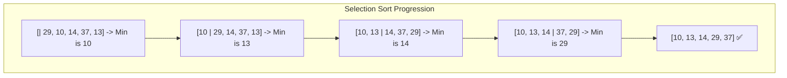

#### C# Implementation

```csharp
public static class SelectionSort
{
    public static void Sort<T>(Span<T> span) where T : IComparable<T>
    {
        int n = span.Length;
        for (int i = 0; i < n - 1; i++)
        {
            int minIndex = i;
            for (int j = i + 1; j < n; j++)
            {
                if (span[j].CompareTo(span[minIndex]) < 0)
                {
                    minIndex = j;
                }
            }

            if (minIndex != i)
            {
                (span[i], span[minIndex]) = (span[minIndex], span[i]);
            }
        }
    }
}
```

#### Complexity Analysis

- **Best / Average / Worst Time**: $\mathcal{O}(n^2)$ comparisons regardless of input distribution.
- **Swaps**: Exactly $\mathcal{O}(n)$ swaps (at most $n - 1$ swaps total).
- **Space Complexity**: $\mathcal{O}(1)$ auxiliary (in-place).
- **Stability**: **Unstable** (long-distance swaps can reorder identical elements across intervening items).

> [!TIP]
> Selection Sort is useful when **write operations are extremely expensive** compared to read operations (e.g., writing to legacy EEPROM / Flash memory cells where write cycles degrade hardware lifespan).

---

### 2.3 Insertion Sort: Fast for Small & Nearly-Sorted Data

#### How It Works

Insertion Sort builds the final sorted array one item at a time. For each element, it shifts all larger elements in the sorted prefix to the right and inserts the element into its correct position.

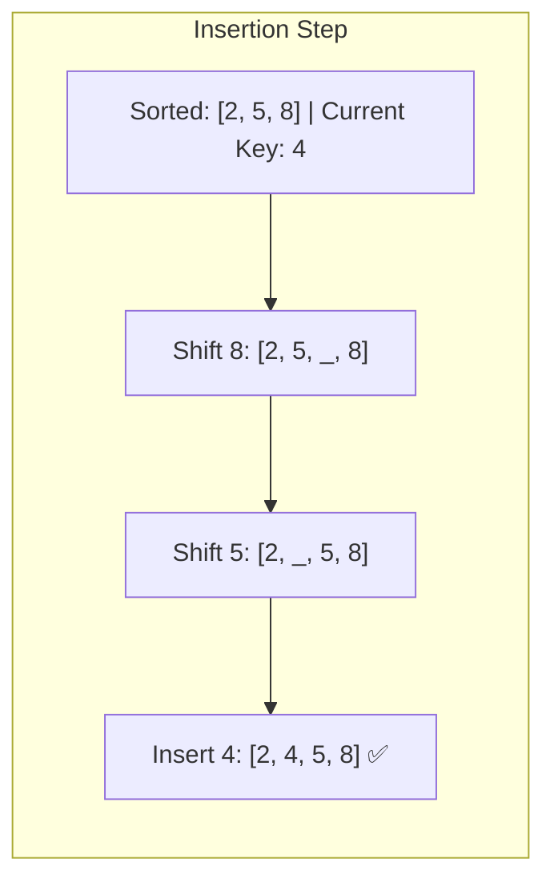

#### C# Implementation

```csharp
public static class InsertionSort
{
    public static void Sort<T>(Span<T> span) where T : IComparable<T>
    {
        int n = span.Length;
        for (int i = 1; i < n; i++)
        {
            T key = span[i];
            int j = i - 1;

            // Shift elements of span[0..i-1] that are greater than key to the right
            while (j >= 0 && span[j].CompareTo(key) > 0)
            {
                span[j + 1] = span[j];
                j--;
            }

            span[j + 1] = key;
        }
    }
}
```

#### Why Insertion Sort is Essential in Modern Runtimes

Despite its quadratic worst-case time, Insertion Sort has several powerful characteristics:

1. **Adaptive**: On nearly-sorted arrays (where elements are at most $k$ positions away from their sorted index), it runs in $\mathcal{O}(n \cdot k)$ time. If already sorted, it runs in $\mathcal{O}(n)$ with $0$ shifts.
2. **Low Constant Overhead**: Minimal branch mispredictions and direct CPU register caching.
3. **Online Sorting**: Can sort a stream as elements arrive.
4. **Hybrid Subroutine**: Both **IntroSort** (.NET `Array.Sort`) and **Timsort** (Python/Java) switch to Insertion Sort for partitions smaller than 16–32 elements.

#### Complexity Analysis

- **Best Case**: $\mathcal{O}(n)$ comparisons, $\mathcal{O}(1)$ swaps when already sorted.
- **Average Case**: $\mathcal{O}(n^2)$ comparisons and shifts.
- **Worst Case**: $\mathcal{O}(n^2)$ when array is reverse sorted.
- **Space Complexity**: $\mathcal{O}(1)$ auxiliary.
- **Stability**: **Stable**.

---

## ⚡ 3. Advanced Comparison-Based Sorts ($\mathcal{O}(n \log n)$)

Comparison-based sorting has a mathematical lower bound of **$\Omega(n \log n)$** in the worst and average case (proved via decision trees). The following three algorithms achieve this bound.

### 3.1 Merge Sort: Stable, Divide & Conquer

#### How It Works

Merge Sort divides the array into two halves, recursively sorts both halves, and merges the two sorted subarrays into a single sorted array.

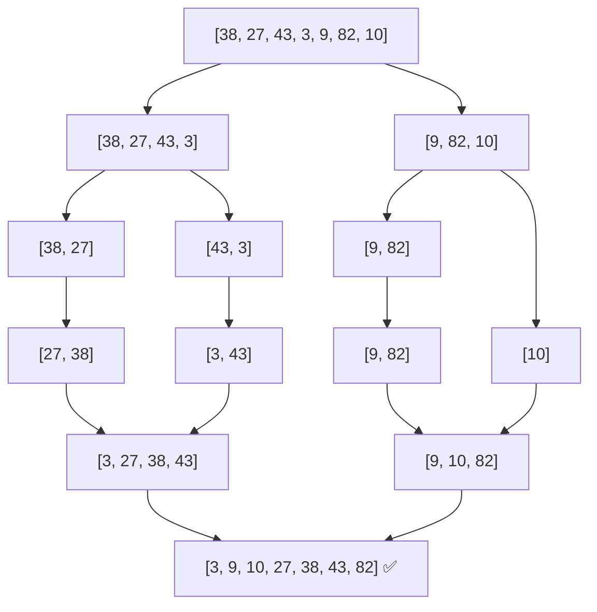

#### High-Performance C# Implementation using `ArrayPool<T>`

```csharp
using System.Buffers;

public static class MergeSort
{
    public static void Sort<T>(Span<T> span) where T : IComparable<T>
    {
        if (span.Length <= 1) return;

        // Rent auxiliary buffer to avoid GC allocations per recursion frame
        T[] buffer = ArrayPool<T>.Shared.Rent(span.Length);
        try
        {
            SortInternal(span, buffer.AsSpan(0, span.Length));
        }
        finally
        {
            ArrayPool<T>.Shared.Return(buffer);
        }
    }

    private static void SortInternal<T>(Span<T> span, Span<T> temp) where T : IComparable<T>
    {
        if (span.Length <= 1) return;

        int mid = span.Length / 2;
        Span<T> left = span[..mid];
        Span<T> right = span[mid..];
        Span<T> tempLeft = temp[..mid];
        Span<T> tempRight = temp[mid..];

        SortInternal(left, tempLeft);
        SortInternal(right, tempRight);

        Merge(left, right, span, temp);
    }

    private static void Merge<T>(ReadOnlySpan<T> left, ReadOnlySpan<T> right, Span<T> target, Span<T> temp) 
        where T : IComparable<T>
    {
        int i = 0, j = 0, k = 0;

        while (i < left.Length && j < right.Length)
        {
            // Use <= to preserve stability (left element preferred on equality)
            if (left[i].CompareTo(right[j]) <= 0)
            {
                temp[k++] = left[i++];
            }
            else
            {
                temp[k++] = right[j++];
            }
        }

        while (i < left.Length) temp[k++] = left[i++];
        while (j < right.Length) temp[k++] = right[j++];

        // Copy merged elements back to target span
        temp[..k].CopyTo(target);
    }
}
```

#### Complexity & Characteristics

- **Time Complexity**: Guaranteed **$\mathcal{O}(n \log n)$** across Best, Average, and Worst cases.
- **Space Complexity**: **$\mathcal{O}(n)$** auxiliary memory for temporary buffers during merge.
- **Stability**: **Stable**.
- **Best Use Cases**:
  - Sorting linked lists (requires $\mathcal{O}(1)$ extra space as only pointer rewrites are needed).
  - External sorting of multi-gigabyte files that do not fit in RAM.
  - Multi-threaded parallel sorting (easy divide-and-conquer distribution across CPU cores).

---

### 3.2 Quick Sort: Fast In-Place Partitioning

#### How It Works

Quick Sort chooses a **pivot** element, partitions the array such that all elements smaller than the pivot precede it and all elements larger follow it, and then recursively sorts the left and right partitions.

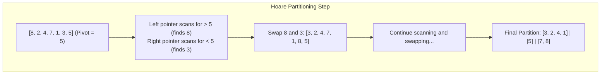

#### Partitioning Schemes: Lomuto vs. Hoare

- **Lomuto Partitioning**: Easier to understand; scans with one pointer and swaps with a boundary pointer. Performs $\approx 3\times$ more swaps on average.
- **Hoare Partitioning**: Uses two pointers advancing from both ends inward. Performs significantly fewer swaps and handles duplicate values more efficiently.

#### Pivot Selection Strategies

1. **First / Last Element**: Degrades to $\mathcal{O}(n^2)$ when array is already sorted or reverse sorted.
2. **Random Pivot**: Eliminates predictable pathological inputs.
3. **Median-of-Three**: Takes the median of `span[low]`, `span[mid]`, and `span[high]`. Best compromise between speed and worst-case avoidance.

#### C# Implementation (Hoare Partition with Median-of-Three)

```csharp
public static class QuickSort
{
    public static void Sort<T>(Span<T> span) where T : IComparable<T>
    {
        SortInternal(span, 0, span.Length - 1);
    }

    private static void SortInternal<T>(Span<T> span, int low, int high) where T : IComparable<T>
    {
        while (low < high)
        {
            // Small arrays optimization
            if (high - low < 16)
            {
                InsertionSort(span.Slice(low, high - low + 1));
                return;
            }

            int p = Partition(span, low, high);

            // Tail recursion elimination: recurse on smaller partition, loop on larger
            if (p - low < high - p)
            {
                SortInternal(span, low, p);
                low = p + 1;
            }
            else
            {
                SortInternal(span, p + 1, high);
                high = p;
            }
        }
    }

    private static int Partition<T>(Span<T> span, int low, int high) where T : IComparable<T>
    {
        // Median-of-Three pivot selection
        int mid = low + ((high - low) >> 1);
        if (span[low].CompareTo(span[mid]) > 0) (span[low], span[mid]) = (span[mid], span[low]);
        if (span[low].CompareTo(span[high]) > 0) (span[low], span[high]) = (span[high], span[low]);
        if (span[mid].CompareTo(span[high]) > 0) (span[mid], span[high]) = (span[high], span[mid]);

        T pivot = span[mid];
        int i = low - 1;
        int j = high + 1;

        while (true)
        {
            do { i++; } while (span[i].CompareTo(pivot) < 0);
            do { j--; } while (span[j].CompareTo(pivot) > 0);

            if (i >= j) return j;

            (span[i], span[j]) = (span[j], span[i]);
        }
    }

    private static void InsertionSort<T>(Span<T> span) where T : IComparable<T>
    {
        for (int i = 1; i < span.Length; i++)
        {
            T key = span[i];
            int j = i - 1;
            while (j >= 0 && span[j].CompareTo(key) > 0)
            {
                span[j + 1] = span[j];
                j--;
            }
            span[j + 1] = key;
        }
    }
}
```

#### Complexity & Characteristics

- **Best / Average Time**: $\mathcal{O}(n \log n)$ with very small constant factors (superb CPU cache locality).
- **Worst Time**: $\mathcal{O}(n^2)$ if pivot selection repeatedly splits into $1$ and $n-1$ elements.
- **Space Complexity**: $\mathcal{O}(\log n)$ call stack space (with tail-call optimization).
- **Stability**: **Unstable**.

---

### 3.3 Heap Sort: In-Place $\mathcal{O}(n \log n)$ Guarantee

#### How It Works

Heap Sort converts the array into a **Max-Heap** in $\mathcal{O}(n)$ time using Floyd's bottom-up heapify algorithm. It then repeatedly swaps the root (the maximum element) with the last unsorted element, reduces the heap size by 1, and sifts down the new root.

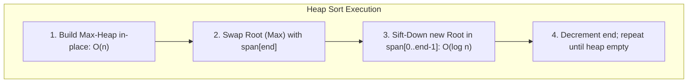

#### C# Implementation

```csharp
public static class HeapSort
{
    public static void Sort<T>(Span<T> span) where T : IComparable<T>
    {
        int n = span.Length;

        // Step 1: Build Max-Heap bottom-up (Floyd's Heapify: O(n))
        for (int i = (n >> 1) - 1; i >= 0; i--)
        {
            SiftDown(span, i, n);
        }

        // Step 2: Repeatedly extract max element to back of span
        for (int i = n - 1; i > 0; i--)
        {
            (span[0], span[i]) = (span[i], span[0]); // Move current max to sorted tail
            SiftDown(span, 0, i);                    // Restore heap property for remaining elements
        }
    }

    private static void SiftDown<T>(Span<T> span, int root, int length) where T : IComparable<T>
    {
        while (true)
        {
            int largest = root;
            int left = (root << 1) + 1;
            int right = left + 1;

            if (left < length && span[left].CompareTo(span[largest]) > 0)
            {
                largest = left;
            }

            if (right < length && span[right].CompareTo(span[largest]) > 0)
            {
                largest = right;
            }

            if (largest == root)
            {
                break;
            }

            (span[root], span[largest]) = (span[largest], span[root]);
            root = largest;
        }
    }
}
```

#### Complexity & Characteristics

- **Time Complexity**: Strictly **$\mathcal{O}(n \log n)$** across Best, Average, and Worst cases.
- **Space Complexity**: **$\mathcal{O}(1)$** auxiliary (strictly in-place, no recursion stack).
- **Stability**: **Unstable**.
- **CPU Cache Caveat**: Heap Sort exhibits poor cache locality because child indices (`2i + 1`, `2i + 2`) jump across memory pages as tree depth increases. In practice, QuickSort is $2\times - 3\times$ faster on modern hardware despite having the same theoretical asymptotic bounds.

---

## 🧮 4. Non-Comparison Sorts ($\mathcal{O}(n + k)$)

When we make assumptions about the data (e.g., small integer ranges or fixed-length strings), we can break the $\Omega(n \log n)$ comparison barrier.

### 4.1 Counting Sort

Counting Sort tallies the occurrences of each distinct key value in a frequency array, computes prefix sums to determine exact output positions, and writes items into an output array.

```csharp
public static class CountingSort
{
    public static void Sort(Span<int> span, int minVal, int maxVal)
    {
        int range = maxVal - minVal + 1;
        int[] count = new int[range];
        int[] output = new int[span.Length];

        // 1. Frequency histogram
        for (int i = 0; i < span.Length; i++)
        {
            count[span[i] - minVal]++;
        }

        // 2. Prefix sums (cumulative counts)
        for (int i = 1; i < range; i++)
        {
            count[i] += count[i - 1];
        }

        // 3. Build output array backwards to preserve stability
        for (int i = span.Length - 1; i >= 0; i--)
        {
            int val = span[i];
            int index = count[val - minVal] - 1;
            output[index] = val;
            count[val - minVal]--;
        }

        // 4. Copy back
        output.CopyTo(span);
    }
}
```

- **Time Complexity**: $\mathcal{O}(n + k)$ where $k = \text{maxVal} - \text{minVal} + 1$.
- **Space Complexity**: $\mathcal{O}(n + k)$.
- **Stability**: **Stable** (when traversed backwards during placement).

---

### 4.2 Radix Sort

Radix Sort sorts data by processing individual digits or bit chunks, typically from Least Significant Digit (**LSD**) to Most Significant Digit (**MSD**), using a stable sub-sort (like Counting Sort) on each digit.

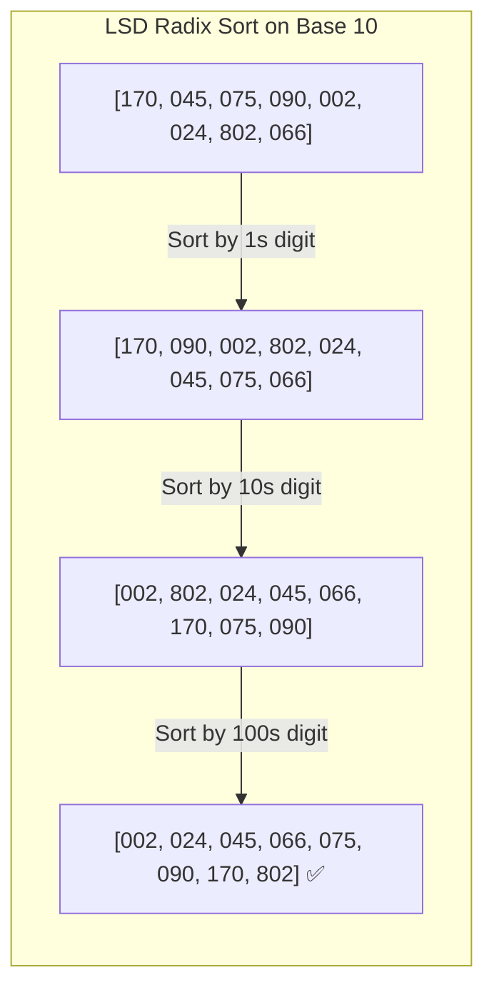

#### High-Speed Bitwise LSD Radix Sort (32-bit Integers)

```csharp
public static class RadixSort
{
    private const int BITS_PER_BYTE = 8;
    private const int BUCKET_COUNT = 1 << BITS_PER_BYTE; // 256
    private const int MASK = BUCKET_COUNT - 1;           // 0xFF

    public static void Sort(uint[] array)
    {
        uint[] buffer = new uint[array.Length];

        // 4 passes for 32-bit unsigned integers (8 bits per pass)
        for (int shift = 0; shift < 32; shift += BITS_PER_BYTE)
        {
            int[] count = new int[BUCKET_COUNT];

            for (int i = 0; i < array.Length; i++)
            {
                uint bucket = (array[i] >> shift) & MASK;
                count[bucket]++;
            }

            for (int i = 1; i < BUCKET_COUNT; i++)
            {
                count[i] += count[i - 1];
            }

            for (int i = array.Length - 1; i >= 0; i--)
            {
                uint bucket = (array[i] >> shift) & MASK;
                buffer[--count[bucket]] = array[i];
            }

            Array.Copy(buffer, array, array.Length);
        }
    }
}
```

- **Time Complexity**: $\mathcal{O}(d \cdot (n + k))$ where $d$ is the number of digit passes (4 passes for 32-bit uints).
- **Space Complexity**: $\mathcal{O}(n + k)$.
- **Use Cases**: Sorting millions of integer IDs, phone numbers, network IP addresses, or fixed-length keys.

---

## 🎯 5. Sorting Stability: Principles & Multi-Key Sorting

### 5.1 What is Stability?

A sorting algorithm is **stable** if two objects with equal keys appear in the same relative order in the sorted output as they appeared in the input.

$$\text{If } A[i] = A[j] \text{ and } i < j, \text{ then after sorting, } \text{Index}(A[i]) < \text{Index}(A[j]).$$

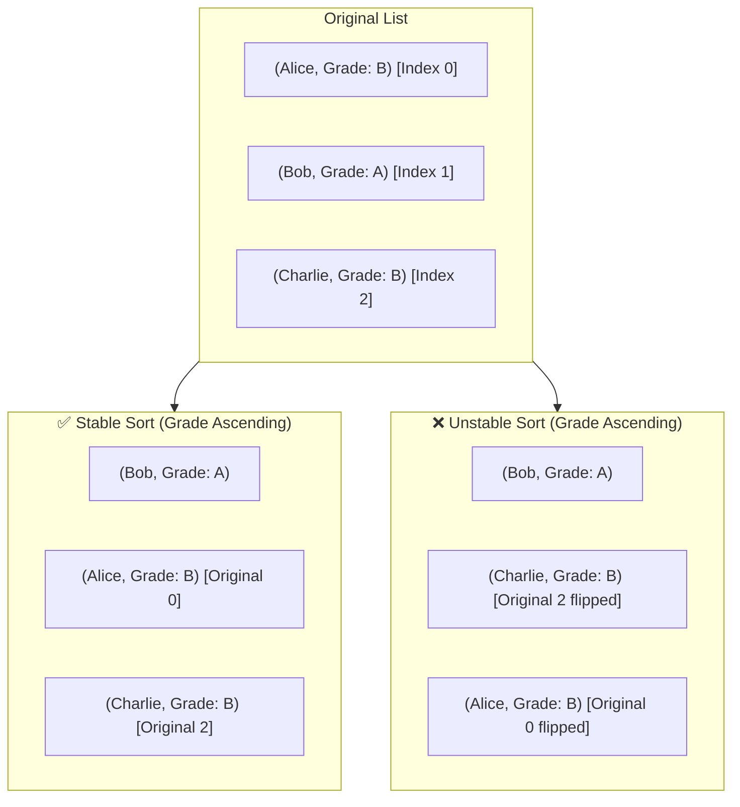

### 5.2 Why Stability Matters in Practice

1. **Multi-Column Sorting in User Interfaces**:
   When a user clicks "Sort by Date", then clicks "Sort by Priority", a stable sort guarantees that within the same priority level, items remain ordered by Date.
2. **Multi-Pass Business Logic**:

   ```csharp
   // With a stable sort, items retain previous ordering for equal keys
   var sortedOrders = orders
       .OrderBy(o => o.OrderDate)
       .OrderBy(o => o.CustomerId); // Customers sorted, and each customer's orders are by date
   ```

### 5.3 Algorithmic Stability Summary

| Stable Algorithms | Unstable Algorithms |
| :--- | :--- |
| **Merge Sort** | **Quick Sort** (long-range swaps bypass equals) |
| **Insertion Sort** | **Heap Sort** (heap structure destroys insertion order) |
| **Bubble Sort** | **Selection Sort** (swapping min element jumps over equals) |
| **Counting Sort** (with backwards pass) | **IntroSort** (.NET `Array.Sort`) |
| **Radix Sort** | |
| **Timsort** | |

---

## ⚙️ 6. Sorting in the .NET Runtime & BCL Internals

### 6.1 `Array.Sort<T>()` and `Span<T>.Sort()`: The IntroSort Engine

Under the hood, .NET's `Array.Sort<T>()` and `MemoryExtensions.Sort<T>(Span<T>)` implement **IntroSort** (Introspective Sort, invented by David Musser). IntroSort combines the raw speed of QuickSort, the worst-case guarantee of HeapSort, and the low overhead of InsertionSort.

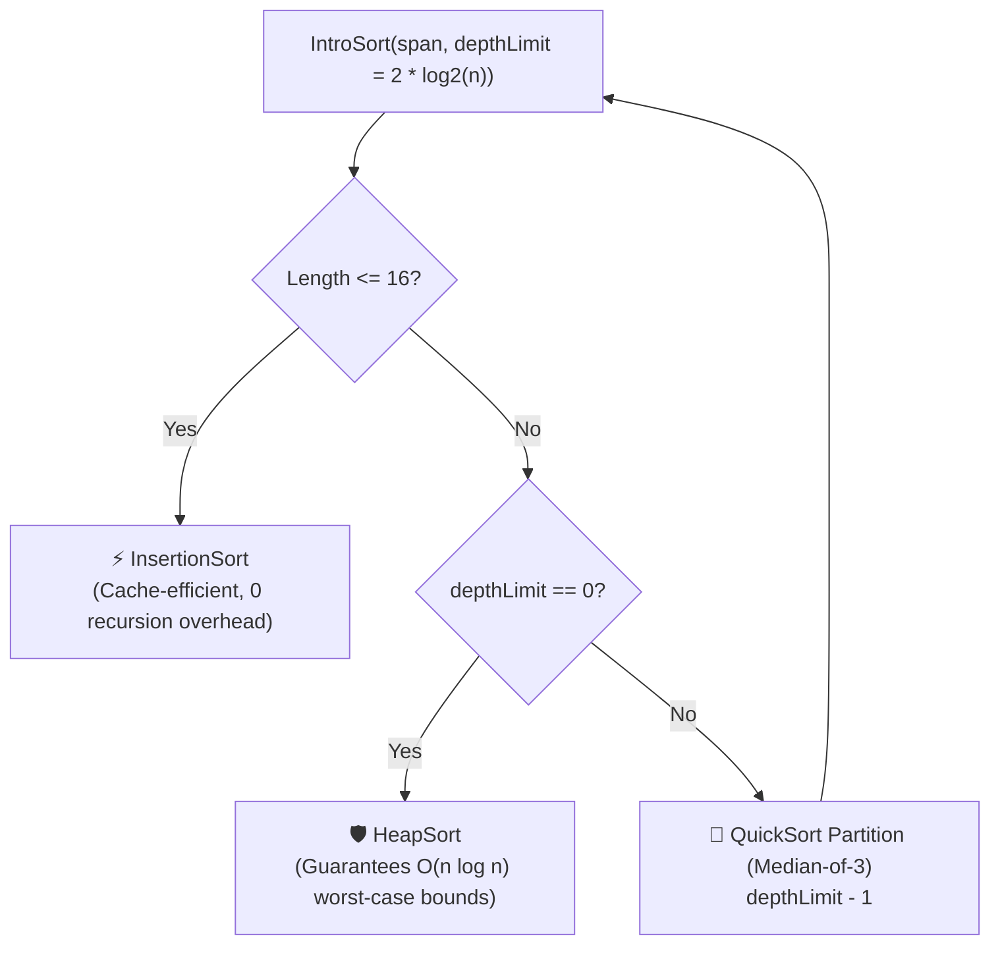

#### Why IntroSort is Used

1. **QuickSort Default**: For normal data distributions, QuickSort delivers optimal cache line utilization and CPU branch prediction.
2. **HeapSort Fallback**: If QuickSort's recursion depth exceeds $2 \lfloor \log_2 n \rfloor$ (indicating a pathological pivot distribution), it switches to HeapSort to prevent $\mathcal{O}(n^2)$ degradation and StackOverflowExceptions. This defends against **Algorithmic Complexity Attacks** (Denial of Service).
3. **InsertionSort Base Case**: For partitions $\le 16$ items, recursive overhead outweighs quadratic comparisons; InsertionSort finishes the leaf partitions.

> [!NOTE]
> `Array.Sort<T>()` and `Span<T>.Sort()` are **unstable**. If two elements compare equal, their final relative order is undefined.

---

### 6.2 LINQ `Enumerable.OrderBy()`: Stable Sorting via Key Extraction

When you execute LINQ's `.OrderBy(x => x.Key)` or `.OrderByDescending()`, .NET uses an internal stable sort implementation (`OrderedEnumerable<TElement, TKey>`).

#### How LINQ `OrderBy` Works Internally

1. **Deferred Execution**: No sorting occurs until the sequence is enumerated (`ToList()`, `foreach`).
2. **Buffer Allocation**: It copies all elements into a temporary buffer array of length $N$.
3. **Key Pre-computation**: It evaluates the `keySelector` lambda once per element and caches the keys in a parallel array to avoid repeated selector invocations during comparisons.
4. **Map Indexing**: It initializes an integer index array `[0, 1, 2, ..., N-1]`.
5. **Stable Sort on Indices**: It sorts the integer indices using the cached keys. In case of key equality, the tie-breaker is the original index `i < j`, ensuring **strict stability**.

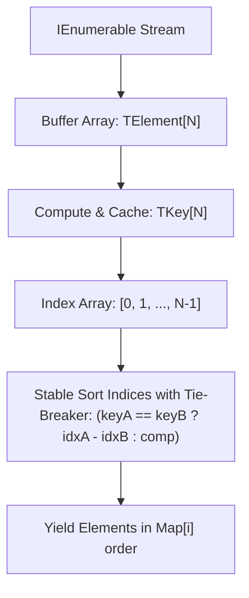

---

### 6.3 Performance & Allocation Comparison

| Feature | `Span<T>.Sort()` / `Array.Sort()` | `Enumerable.OrderBy()` |
| :--- | :--- | :--- |
| **Algorithm** | Hybrid IntroSort | Stable Index-Map Sort |
| **Stability** | ❌ **Unstable** | ✅ **Stable** |
| **Heap Allocations** | **$0$ bytes** (for Span/unmanaged) | **$\mathcal{O}(n)$** (Buffers, Key cache, Lambdas) |
| **Execution** | Eager (In-Place mutation) | Deferred (Returns new `IOrderedEnumerable<T>`) |
| **Throughput** | **$5\times - 20\times$ faster** | Slower (delegate invocations, indexing indirection) |
| **Multi-Key Syntax** | Custom `IComparer<T>` | `.OrderBy().ThenBy()` |

#### High-Performance Custom Comparison Example

```csharp
public readonly record struct Order(int CustomerId, decimal Amount, DateTime CreatedAt);

public static class SortingExamples
{
    // Fast, zero-allocation multi-key sort in-place using Span<T>
    public static void SortOrdersInPlace(Span<Order> orders)
    {
        orders.Sort((x, y) =>
        {
            int custCmp = x.CustomerId.CompareTo(y.CustomerId);
            if (custCmp != 0) return custCmp;

            int amountCmp = y.Amount.CompareTo(x.Amount); // Descending amount
            if (amountCmp != 0) return amountCmp;

            return x.CreatedAt.CompareTo(y.CreatedAt);    // Ascending date
        });
    }
}
```

---

## 🔎 7. Binary Search & Advanced Boundary Searching

Binary search is an efficient algorithm for finding the position of a target value within a **sorted array** using the divide-and-conquer strategy.

### 7.1 Arithmetic Overflow Bug & Modern Fix

In many classical textbooks, the middle index calculation was written as:

```csharp
int mid = (low + high) / 2; // ❌ BUG: Integer Overflow when low + high > int.MaxValue
```

In modern C#, always compute `mid` using subtraction or unsigned bit shifts:

```csharp
int mid = low + ((high - low) >> 1); // ✅ SAFE: No overflow possible, fast bit shift
```

---

### 7.2 Iterative & Recursive Implementations

#### Iterative Binary Search

```csharp
public static class BinarySearch
{
    public static int SearchIterative<T>(ReadOnlySpan<T> span, T target) where T : IComparable<T>
    {
        int low = 0;
        int high = span.Length - 1;

        while (low <= high)
        {
            int mid = low + ((high - low) >> 1);
            int cmp = span[mid].CompareTo(target);

            if (cmp == 0)
            {
                return mid; // Target found
            }
            else if (cmp < 0)
            {
                low = mid + 1; // Target is in right half
            }
            else
            {
                high = mid - 1; // Target is in left half
            }
        }

        return -1; // Target not found
    }

    public static int SearchRecursive<T>(ReadOnlySpan<T> span, T target) where T : IComparable<T>
    {
        return SearchRecursiveInternal(span, target, 0, span.Length - 1);
    }

    private static int SearchRecursiveInternal<T>(ReadOnlySpan<T> span, T target, int low, int high) 
        where T : IComparable<T>
    {
        if (low > high) return -1;

        int mid = low + ((high - low) >> 1);
        int cmp = span[mid].CompareTo(target);

        if (cmp == 0) return mid;
        if (cmp < 0) return SearchRecursiveInternal(span, target, mid + 1, high);
        return SearchRecursiveInternal(span, target, low, mid - 1);
    }
}
```

---

### 7.3 Boundary Searching: `LowerBound` & `UpperBound`

Standard binary search returns *an* arbitrary matching index when duplicates exist. In production scenarios (like range queries and histogram bucketing), we need to find the **first** or **last** occurrence.

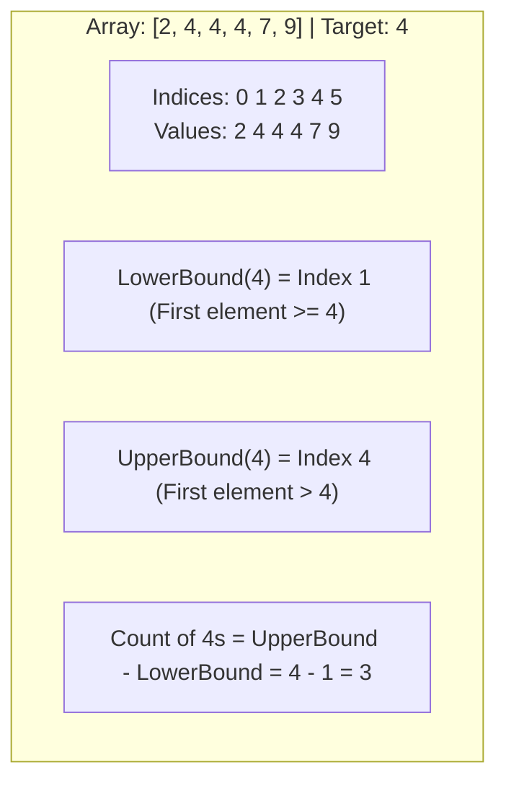

#### C# Implementation

```csharp
public static class BoundarySearch
{
    /// <summary>
    /// Returns the first index where span[index] >= target.
    /// Returns span.Length if all elements are strictly less than target.
    /// </summary>
    public static int LowerBound<T>(ReadOnlySpan<T> span, T target) where T : IComparable<T>
    {
        int low = 0;
        int high = span.Length;

        while (low < high)
        {
            int mid = low + ((high - low) >> 1);
            if (span[mid].CompareTo(target) < 0)
            {
                low = mid + 1;
            }
            else
            {
                high = mid; // Narrow window to left half including mid
            }
        }

        return low;
    }

    /// <summary>
    /// Returns the first index where span[index] > target.
    /// Returns span.Length if no elements are strictly greater than target.
    /// </summary>
    public static int UpperBound<T>(ReadOnlySpan<T> span, T target) where T : IComparable<T>
    {
        int low = 0;
        int high = span.Length;

        while (low < high)
        {
            int mid = low + ((high - low) >> 1);
            if (span[mid].CompareTo(target) <= 0)
            {
                low = mid + 1;
            }
            else
            {
                high = mid; // Narrow window to left half including mid
            }
        }

        return low;
    }

    /// <summary>
    /// Counts occurrences of target in a sorted span in O(log n) time.
    /// </summary>
    public static int CountOccurrences<T>(ReadOnlySpan<T> span, T target) where T : IComparable<T>
    {
        return UpperBound(span, target) - LowerBound(span, target);
    }
}
```

---

### 7.4 Searching in Rotated Sorted Arrays

A common senior interview problem involves finding a target in an array that was sorted, then rotated at an unknown pivot point (e.g., `[4, 5, 6, 7, 0, 1, 2]`).

#### Key Invariant

In any rotated sorted array, splitting at `mid` always produces **at least one strictly sorted half**. We identify which half is sorted and check if `target` lies within its bounds.

```csharp
public static class RotatedArraySearch
{
    public static int Search(ReadOnlySpan<int> nums, int target)
    {
        int low = 0;
        int high = nums.Length - 1;

        while (low <= high)
        {
            int mid = low + ((high - low) >> 1);

            if (nums[mid] == target)
            {
                return mid;
            }

            // Check if left half is normally sorted
            if (nums[low] <= nums[mid])
            {
                if (nums[low] <= target && target < nums[mid])
                {
                    high = mid - 1; // Target lies within left half
                }
                else
                {
                    low = mid + 1;  // Target lies in right half
                }
            }
            // Otherwise, right half must be normally sorted
            else
            {
                if (nums[mid] < target && target <= nums[high])
                {
                    low = mid + 1;  // Target lies within right half
                }
                else
                {
                    high = mid - 1; // Target lies in left half
                }
            }
        }

        return -1;
    }
}
```

- **Time Complexity**: $\mathcal{O}(\log n)$.
- **Space Complexity**: $\mathcal{O}(1)$.

---

### 7.5 .NET Native Binary Search Semantics

The BCL provides binary search via `Array.BinarySearch<T>()` and `MemoryExtensions.BinarySearch<T>(ReadOnlySpan<T>, T)`.

#### Bitwise Complement Return Semantics

- If found: Returns the non-negative zero-based `index` ($\ge 0$).
- If not found: Returns a **negative integer** which is the **bitwise complement (`~index`)** of the index of the first element larger than target (the insertion point).

```csharp
int[] numbers = [10, 20, 30, 40, 50];

int foundIndex = Array.BinarySearch(numbers, 30);
Console.WriteLine(foundIndex); // Output: 2

int missingIndex = Array.BinarySearch(numbers, 25);
Console.WriteLine(missingIndex); // Output: -3 (~2)

// Extract the insertion index to maintain sorted order
int insertionPoint = ~missingIndex;
Console.WriteLine(insertionPoint); // Output: 2 (25 belongs before 30 at index 2)
```

---

## 📊 8. Comprehensive Sorting Algorithm Complexity Matrix

| Algorithm | Best Time | Average Time | Worst Time | Auxiliary Space | Stability | In-Place? | Best Use Cases |
| :--- | :--- | :--- | :--- | :--- | :--- | :--- | :--- |
| **Bubble Sort** | $\mathcal{O}(n)$ | $\mathcal{O}(n^2)$ | $\mathcal{O}(n^2)$ | $\mathcal{O}(1)$ | **Stable** | Yes | Educational concepts; tiny nearly-sorted checks. |
| **Selection Sort** | $\mathcal{O}(n^2)$ | $\mathcal{O}(n^2)$ | $\mathcal{O}(n^2)$ | $\mathcal{O}(1)$ | **Unstable** | Yes | Systems where memory write cycles are costly (Flash memory). |
| **Insertion Sort** | $\mathcal{O}(n)$ | $\mathcal{O}(n^2)$ | $\mathcal{O}(n^2)$ | $\mathcal{O}(1)$ | **Stable** | Yes | Small datasets ($n \le 16$); nearly-sorted streams; IntroSort leaf base case. |
| **Merge Sort** | $\mathcal{O}(n \log n)$ | $\mathcal{O}(n \log n)$ | $\mathcal{O}(n \log n)$ | $\mathcal{O}(n)$ | **Stable** | No | Guaranteed predictable timing; linked lists; external disk sorting. |
| **Quick Sort** | $\mathcal{O}(n \log n)$ | $\mathcal{O}(n \log n)$ | $\mathcal{O}(n^2)$ | $\mathcal{O}(\log n)$ | **Unstable** | Yes | General-purpose in-memory sorting; maximum CPU cache utilization. |
| **Heap Sort** | $\mathcal{O}(n \log n)$ | $\mathcal{O}(n \log n)$ | $\mathcal{O}(n \log n)$ | $\mathcal{O}(1)$ | **Unstable** | Yes | Hard real-time systems needing strict $\mathcal{O}(n \log n)$ and $\mathcal{O}(1)$ RAM. |
| **IntroSort (.NET)** | $\mathcal{O}(n \log n)$ | $\mathcal{O}(n \log n)$ | $\mathcal{O}(n \log n)$ | $\mathcal{O}(\log n)$ | **Unstable** | Yes | Default for `Array.Sort` & `Span.Sort`; immune to $\mathcal{O}(n^2)$ attacks. |
| **Counting Sort** | $\mathcal{O}(n + k)$ | $\mathcal{O}(n + k)$ | $\mathcal{O}(n + k)$ | $\mathcal{O}(n + k)$ | **Stable** | No | Small integer ranges (e.g., sorting ages $0-120$, bytes $0-255$). |
| **Radix Sort** | $\mathcal{O}(d \cdot (n + k))$ | $\mathcal{O}(d \cdot (n + k))$ | $\mathcal{O}(d \cdot (n + k))$ | $\mathcal{O}(n + k)$ | **Stable** | No | Millions of fixed-width integers, IP addresses, or fixed-length strings. |
| **Timsort** | $\mathcal{O}(n)$ | $\mathcal{O}(n \log n)$ | $\mathcal{O}(n \log n)$ | $\mathcal{O}(n)$ | **Stable** | No | Real-world data with natural ordered runs (Python, Java collections). |

---

## 💡 9. Senior .NET Technical Interview & Engineering Q&A

### Q1: Why does .NET's `Array.Sort<T>()` use IntroSort instead of standard QuickSort or MergeSort?

**Answer**:

- **Why not pure QuickSort?** QuickSort suffers from an $\mathcal{O}(n^2)$ worst-case complexity when pathological pivot sequences occur. Attackers can exploit this by crafting malicious inputs that cause CPU starvation (Denial of Service). IntroSort mitigates this by tracking recursion depth: if depth exceeds $2 \log_2 n$, it switches to HeapSort, guaranteeing $\mathcal{O}(n \log n)$ worst-case performance.
- **Why not MergeSort?** MergeSort requires $\mathcal{O}(n)$ auxiliary memory allocation, which triggers GC pressure on the managed heap. IntroSort is an in-place sort requiring only $\mathcal{O}(\log n)$ stack space and zero GC allocations.
- **Why the InsertionSort leaf?** When partitions become smaller than 16 elements, CPU register caching and direct instruction pipelining make InsertionSort faster than continuing QuickSort recursion frames.

---

### Q2: Why is LINQ `OrderBy()` stable while `Array.Sort()` is unstable? How do you choose between them in production?

**Answer**:

1. **LINQ `OrderBy()`** is designed for high-level data querying where multi-key ordering is common:

   ```csharp
   // Relies on stability so that customers with identical registration dates retain their name order
   var result = users.OrderBy(u => u.Name).OrderBy(u => u.RegistrationDate);
   ```

   It preserves stability by mapping indices and evaluating `keySelector` expressions once, at the cost of $\mathcal{O}(n)$ memory allocation and delegate invocation overhead.

2. **`Array.Sort()` and `Span<T>.Sort()`** are designed for raw throughput and zero memory allocations. They mutate the underlying memory in-place using IntroSort, which performs non-adjacent swaps that do not preserve duplicate stability.

**Selection Rule**:

- Use `Span<T>.Sort()` or `Array.Sort()` in performance-critical paths, background batch processors, and high-throughput web request pipelines where zero allocation is paramount.
- Use `LINQ OrderBy()` when working with deferred execution, complex multi-key entity pipelines, or where stability across queries is required.

---

### Q3: How do you sort a 100 GB log file on a server with only 4 GB of available RAM in C#?

**Answer**:

Use **External K-Way Merge Sort**:

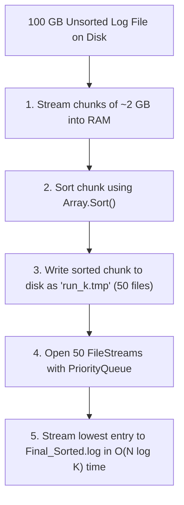

1. **Phase 1 (Chunk Sorting)**: Read the 100 GB file in sequential 2 GB chunks. Sort each chunk in memory using `Array.Sort()` / `Span.Sort()`, and write each sorted run to temporary files on disk (`run_0.tmp` through `run_49.tmp`).
2. **Phase 2 (K-Way Merge)**:
   - Open a buffered `StreamReader` for each of the 50 temporary run files.
   - Insert the first record of each stream into a `PriorityQueue<(LogEntry Record, int StreamIndex), DateTime>`.
   - In a loop, dequeue the minimum log entry, write it directly to the final sorted output stream, read the next line from that specific `StreamIndex`, and enqueue it back into the priority queue.
3. **Complexity**: $\mathcal{O}(N \log K)$ comparisons where $N$ is total records and $K = 50$ streams, consuming less than 100 MB of working RAM.

---

### Q4: Why is HeapSort rarely used as the primary general-purpose sorting algorithm despite having $\mathcal{O}(n \log n)$ worst-case time and $\mathcal{O}(1)$ space?

**Answer**:

The primary reason is **CPU Cache Locality and Branch Predictability**:

- **Cache Misses**: HeapSort's index arithmetic (`2i + 1`, `2i + 2`) causes pointer jumps across distant array locations. As the heap grows, parent and child nodes reside on completely different memory pages and CPU cache lines (L1/L2/L3), causing constant cache misses.
- **QuickSort Locality**: QuickSort sequentially scans elements from left to right and right to left during partitioning. Modern CPU hardware prefetchers load adjacent array elements into L1 cache lines automatically, making QuickSort up to $3\times$ faster in wall-clock time on real hardware despite having the same Big-O bound.

---

### Q5: How does `Span<T>.Sort()` avoid boxing allocations when sorting value types with custom comparers?

**Answer**:

In .NET, passing a custom comparer struct to `Span<T>.Sort()` uses generic constraint specialization:

```csharp
public readonly struct FastOrderComparer : IComparer<Order>
{
    [MethodImpl(MethodImplOptions.AggressiveInlining)]
    public int Compare(Order x, Order y) => x.Amount.CompareTo(y.Amount);
}

// In invocation:
Span<Order> orders = stackalloc Order[100];
orders.Sort(new FastOrderComparer()); // 0 boxing allocations!
```

When a **struct** implements `IComparer<T>`, the JIT compiler generates specialized native machine code for that struct type. The JIT inlines the `Compare()` call directly into the partition loop, completely avoiding the interface virtual dispatch table (`vtable`) and eliminating all object heap allocations and GC pressure.
