# 08 - Recursion & Dynamic Programming: Architecture, Call Stacks, Memoization, Tabulation & Interview Mastery

Recursion and Dynamic Programming (DP) represent two of the most powerful problem-solving paradigms in computer science. For senior software engineers and .NET architects, mastering recursion and DP is not merely an interview rite of passage—it is essential for understanding compiler parsing, Roslyn AST analyzers, expression tree evaluation, combinatorial optimization, graph traversal, and high-performance workflow engines.

This module explores the mechanics of recursion from the perspective of the **Common Language Runtime (CLR)** and hardware CPU stack frames, analyzes the risks of stack exhaustion and the nuances of Tail Call Optimization (TCO) in RyuJIT, and breaks down Dynamic Programming into systematic top-down and bottom-up engineering patterns using modern C# (.NET 10).

---

## 📚 1. Recursion Fundamentals & CLR Stack Frame Architecture

### 1.1 The Anatomy of Recursion

A recursive function is a routine that solves a problem by calling one or more sub-instances of itself with smaller or simplified inputs. Every valid recursive algorithm must satisfy two invariant conditions:

1. **Base Case (Termination Condition)**: The simplest, irreducible instance of the problem that returns a direct value without triggering further recursive calls. Without a base case, recursion runs infinitely until the execution stack is exhausted.
2. **Recursive Step (Inductive Transition)**: The logic that breaks the primary input down, invokes the method on the reduced input, and aggregates the sub-results to construct the final solution.

```csharp
namespace Fundamentals.Recursion;

public static class RecursionAnatomy
{
    public static long Factorial(int n)
    {
        // 1. Base Case: 0! = 1 and 1! = 1
        if (n <= 1)
        {
            return 1;
        }

        // 2. Recursive Case: n! = n * (n - 1)!
        return n * Factorial(n - 1);
    }
}
```

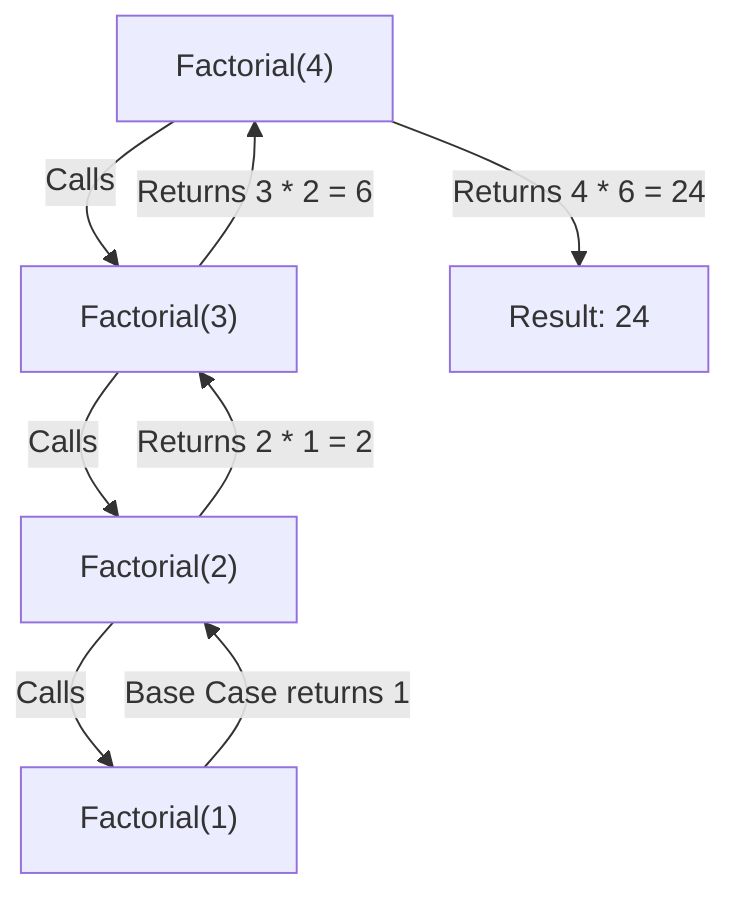

---

### 1.2 Mathematical Induction Connection

Recursive programming is the computational realization of **Mathematical Induction**:

- **Base Step**: Prove that the proposition $P(0)$ or $P(1)$ is true.
- **Inductive Step**: Assume $P(k)$ is true for all $k < n$ (Inductive Hypothesis), and prove that $P(n)$ is true using $P(n-1)$.

When designing recursive algorithms in C#, assume your recursive call **already works correctly for all smaller inputs** (the "recursive leap of faith"), and focus solely on how to combine those sub-results to solve the current input $n$.

---

### 1.3 Under the Hood: The Operating System & CoreCLR Execution Stack

To understand why recursion has a memory cost and why deep recursion fails, we must examine how the CPU and the .NET runtime manage execution memory.

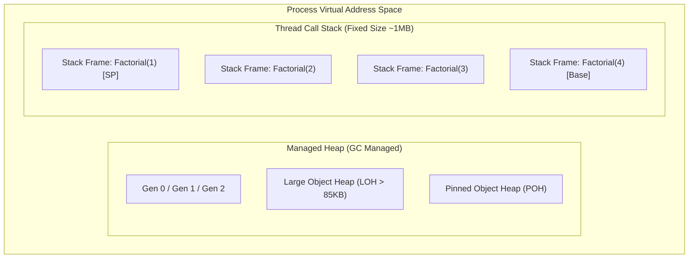

#### Thread Stack Allocation in .NET

- When a new thread is spawned in Windows x64 .NET applications, the operating system reserves a contiguous **1 MB of virtual stack memory** (Linux default is typically 2 MB to 8 MB depending on `ulimit -s`).
- The stack grows **downward** in memory (from high memory addresses to low memory addresses).
- Memory allocation on the stack is nearly instantaneous: the CPU simply decrements the Stack Pointer (`RSP` register on x64).

#### Anatomy of a Stack Frame (Activation Record)

Each invocation of a C# method creates a dedicated **Stack Frame** on the thread stack. A stack frame contains:

| Stack Frame Component | Architectural Purpose |
| :--- | :--- |
| **Return Address** | The instruction pointer (`RIP`) to jump back to after the callee completes execution. |
| **Previous Frame Pointer (`RBP`)** | Pointer to the base of the caller's stack frame (used for stack unwinding and debugging). |
| **Method Parameters** | Arguments passed to the function (if not passed via CPU registers `RCX`, `RDX`, `R8`, `R9`). |
| **Local Variables** | Value-type variables (`int`, `struct`, `Span<T>`) declared within the method body. |
| **Saved CPU Registers** | Non-volatile registers preserved across method calls (`RBX`, `RSI`, `RDI`, `R12-R15`). |
| **Evaluation Stack / Spill Area** | Scratch memory used by the JIT compiler to evaluate intermediate expressions. |

```text
High Memory Address
┌────────────────────────────────────────────────────────┐
│ Caller Frame                                           │
├────────────────────────────────────────────────────────┤
│ Return Address (Instruction to resume after call)      │
├────────────────────────────────────────────────────────┤
│ Saved Frame Pointer (RBP of caller)                    │ <-- RBP (Current Frame Base)
├────────────────────────────────────────────────────────┤
│ Local Variables & Spilled Registers                    │
├────────────────────────────────────────────────────────┤
│ Outgoing Arguments for Callee                          │
└────────────────────────────────────────────────────────┘ <-- RSP (Stack Pointer)
Low Memory Address (Grows Downward)
```

---

### 1.4 Visualizing Call Stack Push and Pop During Recursion

Let us trace `Factorial(3)`.

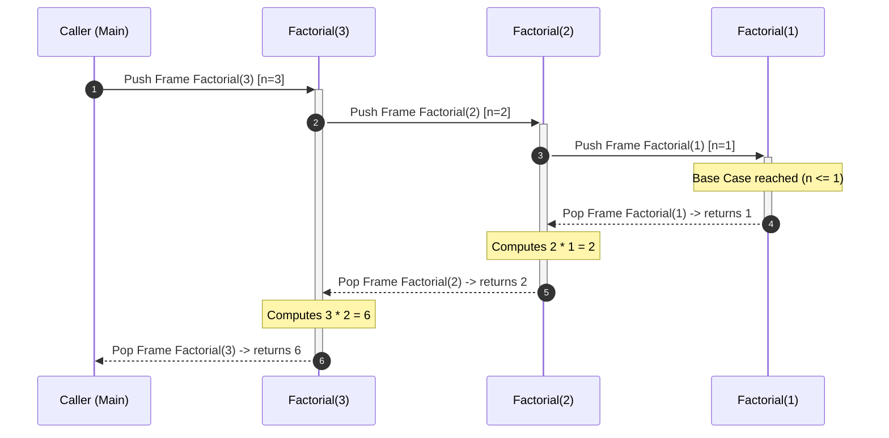

Each frame remains pinned in memory until all deeper recursive frames complete their execution and unwind. Thus, a recursive depth of $D$ requires $O(D)$ auxiliary stack space.

---

## 🔄 2. Common Recursive Patterns & C# Implementations

### 2.1 Pattern 1: Direct Linear Recursion

Linear recursion makes exactly one recursive call per invocation step. The time complexity is $O(n)$, and the auxiliary stack space is $O(n)$.

```csharp
namespace Fundamentals.Recursion;

public static class LinearRecursion
{
    /// <summary>
    /// Computes the sum of elements in an array slice using recursion.
    /// </summary>
    public static long SumArray(ReadOnlySpan<int> numbers)
    {
        // Base case: empty span has sum 0
        if (numbers.IsEmpty)
        {
            return 0;
        }

        // Recursive case: head + sum(tail)
        return numbers[0] + SumArray(numbers[1..]);
    }

    /// <summary>
    /// Computes x raised to the power n in O(log n) using binary exponentiation recursion.
    /// </summary>
    public static double FastPower(double x, int n)
    {
        if (n == 0) return 1.0;
        if (n < 0) return 1.0 / FastPower(x, -n);

        double half = FastPower(x, n / 2);
        
        return (n % 2 == 0) ? half * half : half * half * x;
    }
}
```

---

### 2.2 Pattern 2: Branching / Tree Recursion (Divide & Conquer)

Tree recursion occurs when a function invokes itself multiple times within a single execution frame. This generates a **Recursion Tree** where the number of operations grows exponentially unless optimized.

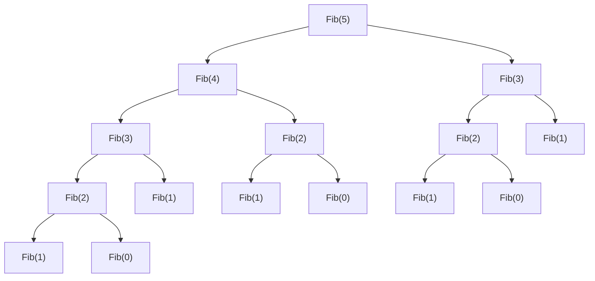

> [!WARNING]
> **Exponential Explosion**: In naive Fibonacci recursion (`Fib(n) = Fib(n-1) + Fib(n-2)`), the recursion tree has height $n$. The total number of nodes is $2^0 + 2^1 + 2^2 + \dots + 2^n \approx O(2^n)$. Computing `Fib(50)` executes over $1.12 \times 10^{15}$ function calls!

---

### 2.3 Pattern 3: Tree & Hierarchical Traversals

Hierarchical structures (DOM trees, JSON documents, Expression Trees, File Systems) are inherently recursive.

```csharp
namespace Fundamentals.Recursion;

public sealed class TreeNode<T>
{
    public T Value { get; set; }
    public TreeNode<T>? Left { get; set; }
    public TreeNode<T>? Right { get; set; }

    public TreeNode(T value, TreeNode<T>? left = null, TreeNode<T>? right = null)
    {
        Value = value;
        Left = left;
        Right = right;
    }
}

public static class TreeTraversals
{
    public static void PreOrder<T>(TreeNode<T>? root, Action<T> visit)
    {
        if (root is null) return;
        visit(root.Value);
        PreOrder(root.Left, visit);
        PreOrder(root.Right, visit);
    }

    public static void InOrder<T>(TreeNode<T>? root, Action<T> visit)
    {
        if (root is null) return;
        InOrder(root.Left, visit);
        visit(root.Value);
        InOrder(root.Right, visit);
    }

    public static void PostOrder<T>(TreeNode<T>? root, Action<T> visit)
    {
        if (root is null) return;
        PostOrder(root.Left, visit);
        PostOrder(root.Right, visit);
        visit(root.Value);
    }

    public static int GetMaxDepth<T>(TreeNode<T>? root)
    {
        if (root is null) return 0;
        return 1 + Math.Max(GetMaxDepth(root.Left), GetMaxDepth(root.Right));
    }
}
```

---

### 2.4 Pattern 4: Combinatorial Backtracking (Permutations & Combinations)

Backtracking is a systematic recursive search strategy that explores all potential candidate solutions and abandons ("backtracks") a path as soon as it determines the candidate cannot yield a valid solution.

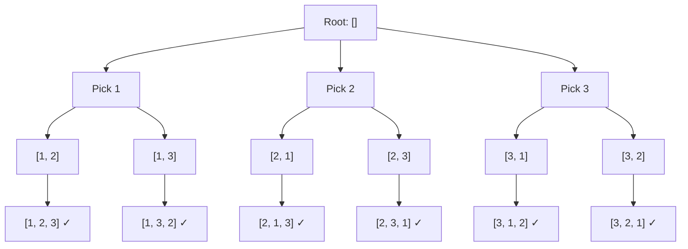

#### Canonical Backtracking Template in C# (.NET 10)

```csharp
namespace Fundamentals.Recursion;

public static class CombinatorialBacktracking
{
    /// <summary>
    /// Generates all unique permutations of a collection of distinct integers.
    /// Time Complexity: O(N * N!), Space Complexity: O(N) auxiliary recursion stack.
    /// </summary>
    public static List<List<int>> Permute(int[] nums)
    {
        List<List<int>> result = [];
        List<int> currentPath = [];
        bool[] used = new bool[nums.Length];

        BacktrackPermutations(nums, currentPath, used, result);
        return result;
    }

    private static void BacktrackPermutations(
        int[] nums, 
        List<int> currentPath, 
        bool[] used, 
        List<List<int>> result)
    {
        // 1. Goal Reached
        if (currentPath.Count == nums.Length)
        {
            result.Add([.. currentPath]); // Create a shallow copy snapshot
            return;
        }

        for (int i = 0; i < nums.Length; i++)
        {
            // 2. Constraint Check
            if (used[i]) continue;

            // 3. Make Choice
            used[i] = true;
            currentPath.Add(nums[i]);

            // 4. Explore Recursively
            BacktrackPermutations(nums, currentPath, used, result);

            // 5. Backtrack (Undo Choice)
            currentPath.RemoveAt(currentPath.Count - 1);
            used[i] = false;
        }
    }

    /// <summary>
    /// Generates the Power Set (all subsets) of a collection of distinct integers.
    /// Time Complexity: O(N * 2^N), Space Complexity: O(N).
    /// </summary>
    public static List<List<int>> Subsets(int[] nums)
    {
        List<List<int>> result = [];
        List<int> currentSubset = [];

        BacktrackSubsets(nums, startIndex: 0, currentSubset, result);
        return result;
    }

    private static void BacktrackSubsets(
        int[] nums, 
        int startIndex, 
        List<int> currentSubset, 
        List<List<int>> result)
    {
        // Every state in the decision tree is a valid subset
        result.Add([.. currentSubset]);

        for (int i = startIndex; i < nums.Length; i++)
        {
            // Choose
            currentSubset.Add(nums[i]);
            // Explore
            BacktrackSubsets(nums, i + 1, currentSubset, result);
            // Un-choose
            currentSubset.RemoveAt(currentSubset.Count - 1);
        }
    }
}
```

---

## ⚖️ 3. Recursion vs. Iteration: Trade-offs, Stack Overflow & Tail Call Optimization in .NET

### 3.1 Comparative Analysis Matrix

| Dimension | Recursion | Iteration |
| :--- | :--- | :--- |
| **Execution Mechanism** | Repeated method invocations creating stack frames. | Control flow loop instructions (`jmp`, `loop`, `cmp`). |
| **Memory Overhead** | $O(D)$ auxiliary stack space ($D$ = recursion depth). | $O(1)$ stack space (reuses the same local variables). |
| **CPU Instruction Overhead** | Function prologue/epilogue, register spill, cache line misses. | Tight CPU register reuse, branch prediction optimization. |
| **Risk of Fatal Crash** | **High** (`StackOverflowException` if depth exceeds stack limit). | **Zero** stack exhaustion risk (can loop indefinitely). |
| **Code Expressiveness** | Exceptional for trees, graphs, grammar parsing, and backtracking. | Better for linear sequential scans, array transformations. |
| **State Management** | State is maintained implicitly across stack frames. | State must be managed explicitly in local variables or heap stacks. |

---

### 3.2 The Reality of `StackOverflowException` in CoreCLR

When recursive calls exceed the physical thread stack memory (typically between $15{,}000$ and $30{,}000$ nested frames depending on local variable size and debug/release compilation), the OS triggers a **Stack Guard Page Violation**.

> [!CAUTION]
> **Uncatchable Exception in .NET**:
> In CoreCLR, `StackOverflowException` **cannot be caught** with a standard `try-catch` block. When a stack overflow occurs, the CLR runtime engine immediately terminates the entire process with exit code `0xC00000FD` (STATUS_STACK_OVERFLOW) to prevent arbitrary memory corruption.

```csharp
// FATAL: This will crash the entire ASP.NET Core process!
public static void CrashServer(int counter)
{
    CrashServer(counter + 1); // No base case -> immediate process termination
}
```

#### Safe Stack Probe Pattern in .NET

In mission-critical recursive engines (such as recursive AST visitors or JSON deserializers), you can use `RuntimeHelpers.EnsureSufficientExecutionStack()` to gracefully throw an exception before the OS stack limit is breached:

```csharp
using System.Runtime.CompilerServices;

public static void SafeRecursiveWalk(int depth)
{
    try
    {
        // Probes the stack; throws InsufficientExecutionStackException if near limit
        RuntimeHelpers.EnsureSufficientExecutionStack();
    }
    catch (InsufficientExecutionStackException)
    {
        throw new InvalidOperationException($"Recursion limit exceeded at depth {depth}. Switch to iterative traversal.");
    }

    SafeRecursiveWalk(depth + 1);
}
```

---

### 3.3 Tail Call Optimization (TCO) in C# and CoreCLR

A **Tail Call** occurs when the very last operation of a function is the recursive invocation itself, meaning the function returns the direct result of the recursive call without performing any further arithmetic or transformations.

```csharp
// NOT Tail-Recursive: Must wait for Factorial(n-1) to finish, then multiply by n
public static long NonTailFactorial(int n) =>
    n <= 1 ? 1 : n * NonTailFactorial(n - 1);

// Tail-Recursive: The recursive call is the final expression (accumulator pattern)
public static long TailFactorial(int n, long accumulator = 1) =>
    n <= 1 ? accumulator : TailFactorial(n - 1, n * accumulator);
```

#### Does C# and RyuJIT Perform Tail Call Optimization?

1. **The C# Compiler (`csc`)**: The C# compiler **never** automatically emits the IL `.tailcall` prefix opcode for recursive methods.
2. **The 64-bit JIT Compiler (RyuJIT)**: RyuJIT can perform tail call elimination under specific conditions in `Release` mode (converting the `call` into a `jmp` and reusing the current stack frame), but you **must never rely on it for safety** because RyuJIT disables TCO under numerous common conditions:
   - When running under a debugger attached.
   - When methods contain `try-catch-finally` blocks.
   - When arguments require complex struct copies.
   - When inlining thresholds are reached.

#### Manual Tail Call Elimination (The Iterative While Loop)

To guarantee $O(1)$ stack space in high-throughput enterprise .NET code, always manually convert tail-recursive algorithms to iterative `while` loops:

```csharp
public static long IterativeFactorial(int n)
{
    long accumulator = 1;
    while (n > 1)
    {
        accumulator *= n;
        n--;
    }
    return accumulator;
}
```

---

### 3.4 Simulating Deep Recursion with an Explicit Managed Stack

When a tree or graph problem naturally fits recursion but the depth can exceed thousands of levels (e.g., parsing deep organizational hierarchies or large graphs), replace the thread call stack with a heap-allocated `Stack<T>`:

```csharp
namespace Fundamentals.Recursion;

public static class IterativeTreeEngine
{
    /// <summary>
    /// Traverses an arbitrarily deep binary tree without risk of StackOverflowException.
    /// Memory is allocated on the GC Managed Heap instead of the fixed Thread Stack.
    /// </summary>
    public static List<T> DepthFirstSearchIterative<T>(TreeNode<T>? root)
    {
        if (root is null) return [];

        List<T> result = [];
        Stack<TreeNode<T>> stack = new();
        stack.Push(root);

        while (stack.Count > 0)
        {
            var current = stack.Pop();
            result.Add(current.Value);

            // Push right child first so left child is processed first (LIFO order)
            if (current.Right is not null) stack.Push(current.Right);
            if (current.Left is not null) stack.Push(current.Left);
        }

        return result;
    }
}
```

---

## 🧠 4. Introduction to Dynamic Programming (DP)

### 4.1 What is Dynamic Programming?

Dynamic Programming (invented by mathematician Richard Bellman in the 1950s) is an algorithmic optimization technique that solves complex problems by breaking them down into **simpler, overlapping subproblems**, solving each subproblem **exactly once**, and storing the solutions in a lookup table to avoid redundant recomputations.

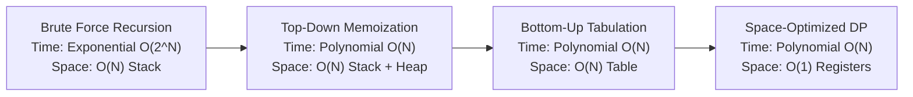

---

### 4.2 The Two Essential Preconditions for DP

An algorithmic problem can be solved using Dynamic Programming if and only if it exhibits two core mathematical properties:

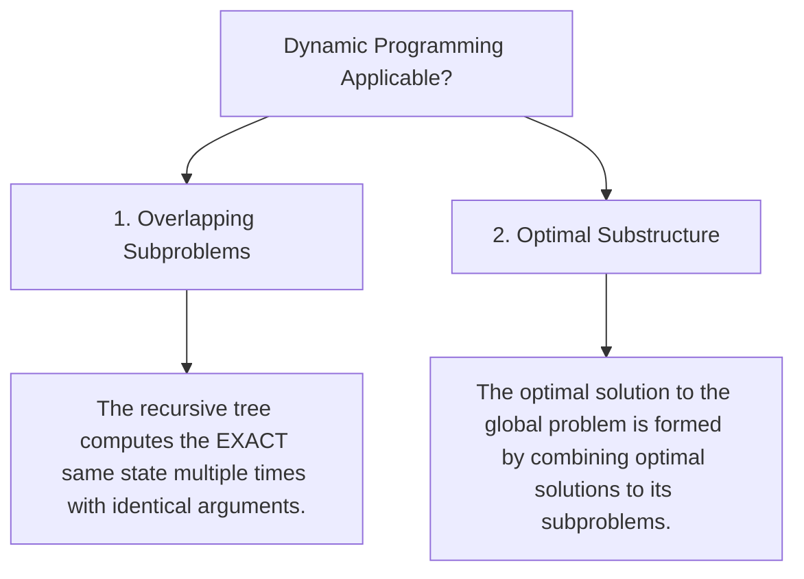

#### 1. Overlapping Subproblems

In contrast to **Divide and Conquer** algorithms (like Merge Sort or QuickSort) where subproblems are completely independent and disjoint, DP problems evaluate the exact same sub-states repeatedly.

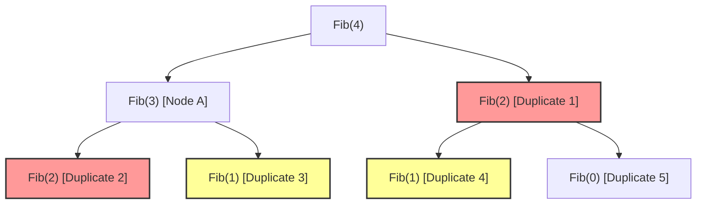

#### 2. Optimal Substructure

A problem has optimal substructure if the optimal solution to the problem of size $n$ can be constructed directly from the optimal solutions to subproblems of size $< n$.

For example, in the Shortest Path problem: If the shortest path from Seattle to Miami passes through Denver, then the sub-path from Denver to Miami must also be the shortest path between Denver and Miami.

---

### 4.3 Recursion Tree vs. Directed Acyclic Graph (DAG)

When we cache subproblem results, the exponential recursion tree collapses into a compact **Directed Acyclic Graph (DAG)** of states:

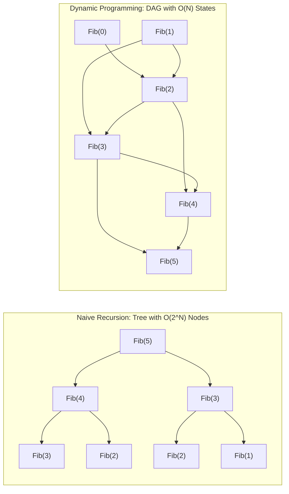

---

## ⚡ 5. Top-Down Dynamic Programming (Memoization)

### 5.1 The Top-Down Mental Model

Top-Down DP preserves the natural recursive thought process. You write the naive recursive solution first, and then add a caching layer (a "memo") that intercepts recursive calls before they execute.

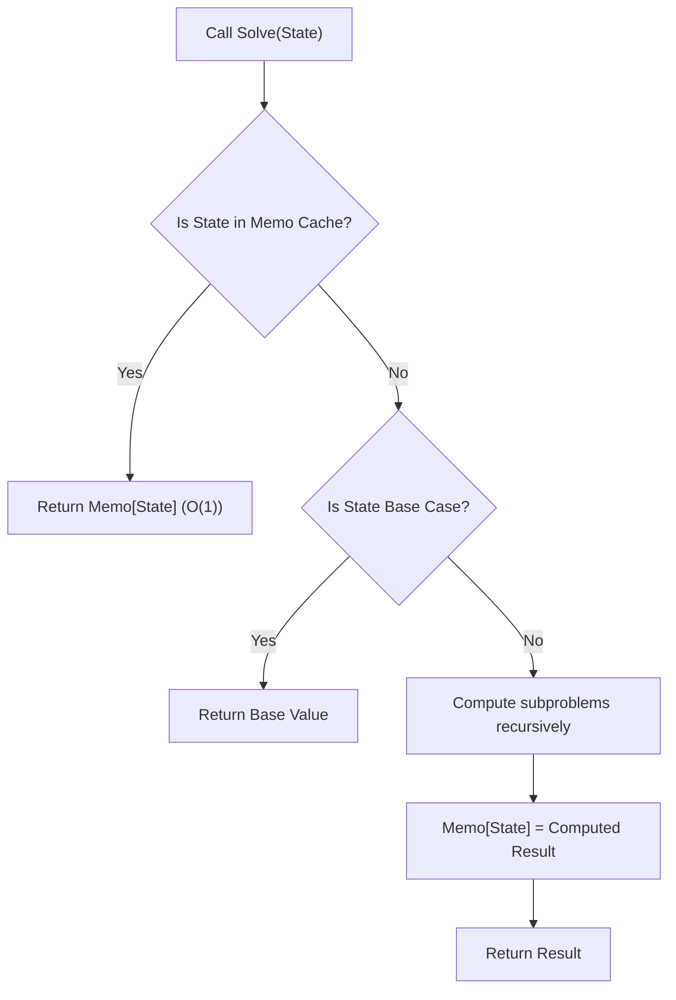

---

### 5.2 C# Memoization Patterns & Data Structures

In .NET, selecting the appropriate data structure for your memoization cache has profound performance and memory allocations implications:

| Cache Mechanism | When to Use | Time Complexity | Allocation Overhead |
| :--- | :--- | :--- | :--- |
| **`int[]` or `long[]`** | 1D discrete integer state ($0 \le n \le 10^6$). | $O(1)$ direct array index. | Minimal (single flat heap array). |
| **`int[,]` (2D Array)** | Multi-variable state bounded by known matrix limits. | $O(1)$ index lookup. | Contiguous heap memory, cache-friendly. |
| **`Dictionary<TKey, TVal>`** | Sparse states, string keys, negative numbers, or large gaps. | $O(1)$ average hash table lookup. | Higher (Hash buckets + Entry array allocations). |
| **`Dictionary<(int, int), TVal>`** | Composite tuple states in sparse domains. | $O(1)$ average (struct tuple has built-in `IEquatable`). | Moderate GC allocations. |

#### High-Performance Memoization Pattern in C# (.NET 10)

```csharp
namespace Fundamentals.DynamicProgramming;

public sealed class TopDownMemoization
{
    /// <summary>
    /// Computes Fibonacci using an array-based memo cache.
    /// Time Complexity: O(N), Space Complexity: O(N) Heap + O(N) Stack.
    /// </summary>
    public static long FibonacciArrayMemo(int n)
    {
        if (n < 0) throw new ArgumentOutOfRangeException(nameof(n));
        long[] memo = new long[n + 1];
        Array.Fill(memo, -1); // -1 indicates uncomputed state
        return Solve(n, memo);

        static long Solve(int i, long[] memo)
        {
            if (i <= 1) return i;
            if (memo[i] != -1) return memo[i]; // Cache Hit

            memo[i] = Solve(i - 1, memo) + Solve(i - 2, memo); // Cache Miss
            return memo[i];
        }
    }

    /// <summary>
    /// Generic Reusable Memoizer for pure recursive functions.
    /// </summary>
    public static Func<TInput, TOutput> CreateMemoizer<TInput, TOutput>(
        Func<Func<TInput, TOutput>, TInput, TOutput> functionFactory) 
        where TInput : notnull
    {
        Dictionary<TInput, TOutput> cache = [];
        Func<TInput, TOutput>? recursiveFunc = null;

        recursiveFunc = input =>
        {
            if (cache.TryGetValue(input, out var cachedValue))
            {
                return cachedValue;
            }

            var computed = functionFactory(recursiveFunc!, input);
            cache[input] = computed;
            return computed;
        };

        return recursiveFunc;
    }
}
```

---

## 📊 6. Bottom-Up Dynamic Programming (Tabulation)

### 6.1 The Bottom-Up Mental Model

Bottom-Up DP completely eliminates recursion and call stack overhead. It starts by populating the base cases in a table (array) and iteratively computes subsequent states in topological order until the final target state is reached.

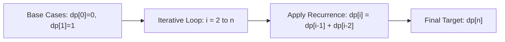

---

### 6.2 Top-Down vs. Bottom-Up Comparison

| Evaluation Metric | Top-Down (Memoization) | Bottom-Up (Tabulation) |
| :--- | :--- | :--- |
| **Approach** | Recursive (Starts at target $N$ and moves down to base cases). | Iterative (Starts at base case $0$ and builds up to $N$). |
| **Subproblem Evaluation** | **Lazy**: Computes *only* the subproblems strictly needed. | **Eager**: Computes *all* table states in sequential order. |
| **Call Stack Usage** | Consumes $O(\text{Depth})$ thread stack memory. | **$O(1)$** stack space (zero recursion). |
| **Space Optimization** | Difficult to optimize space beyond cache table. | Very easy to optimize ($O(N^2) \to O(N)$ or $O(N) \to O(1)$). |
| **Cognitive Load** | Easy to design (natural translation of recursive relation). | Requires identifying the correct topological evaluation order. |

---

### 6.3 State Transition / Recurrence Relations

Every DP problem is fundamentally defined by its **Recurrence Relation**—a mathematical formula that expresses $dp[state]$ in terms of smaller sub-states:

$$\text{State Transition Formula: } dp[i] = f(dp[i-1], dp[i-2], \dots, dp[i-k])$$

To construct any bottom-up DP table:

1. **Define Table Dimensions**: What do the indices $i$ and $j$ represent? (e.g., $dp[i]$ = min coins to make amount $i$).
2. **Initialize Base Cases**: Pre-fill known trivial values (e.g., $dp[0] = 0$).
3. **Formulate Iteration Direction**: Ensure states depended on are calculated *before* states that depend on them.
4. **Extract Target Result**: Read the answer from the designated cell (e.g., $dp[n]$ or $dp[n, w]$).

---

### 6.4 Space Optimization (The Rolling Array Technique)

If a state $dp[i]$ depends only on a fixed number of immediately preceding states (e.g., $dp[i-1]$ and $dp[i-2]$), we do not need to preserve the entire array of size $N$. We can reduce space complexity from **$O(N) \to O(1)$** using simple rolling scalar variables:

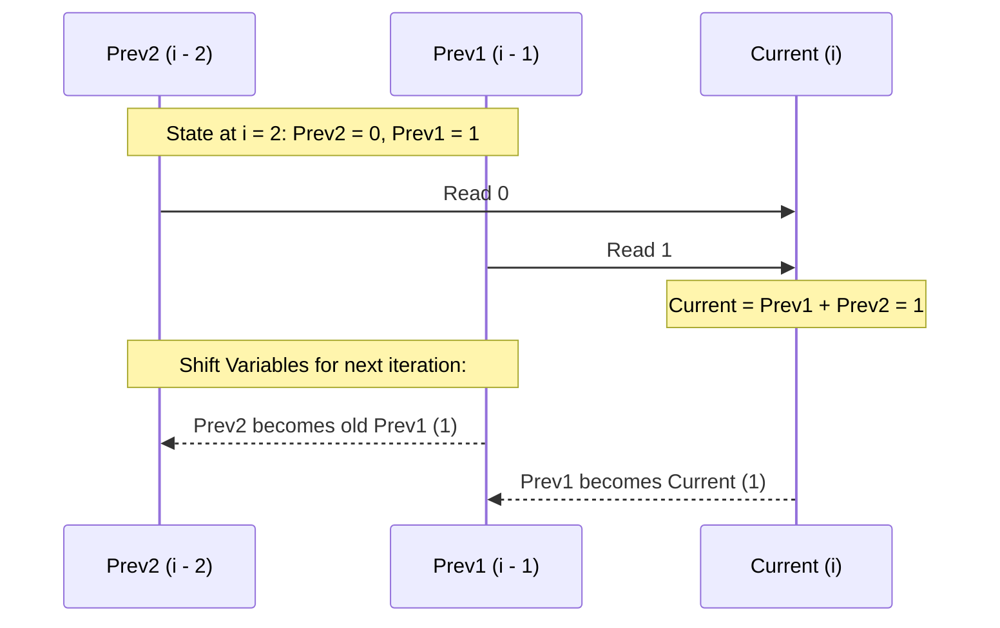

For 2D grid DP problems where row $i$ depends only on row $i-1$, we can compress the $N \times M$ matrix into two rows of size $M$ ($O(M)$ space) or a single row updated in-place.

---

## 💻 7. Classic DP Problems with Production-Grade C# Solutions

### 7.1 Fibonacci Sequence

$$\text{Recurrence: } F(0) = 0, \quad F(1) = 1, \quad F(n) = F(n-1) + F(n-2)$$

```csharp
namespace Fundamentals.DynamicProgramming;

public static class Fibonacci
{
    // 1. Memoization: O(N) Time, O(N) Space (Stack + Heap)
    public static long FibonacciTopDown(int n)
    {
        long[] memo = new long[n + 1];
        Array.Fill(memo, -1);
        return Helper(n, memo);

        static long Helper(int i, long[] memo)
        {
            if (i <= 1) return i;
            if (memo[i] != -1) return memo[i];
            return memo[i] = Helper(i - 1, memo) + Helper(i - 2, memo);
        }
    }

    // 2. Tabulation: O(N) Time, O(N) Space (Zero Stack)
    public static long FibonacciBottomUp(int n)
    {
        if (n <= 1) return n;
        long[] dp = new long[n + 1];
        dp[0] = 0;
        dp[1] = 1;

        for (int i = 2; i <= n; i++)
        {
            dp[i] = dp[i - 1] + dp[i - 2];
        }

        return dp[n];
    }

    // 3. Space-Optimized: O(N) Time, O(1) Space (Registers Only)
    public static long FibonacciConstantSpace(int n)
    {
        if (n <= 1) return n;

        long prev2 = 0;
        long prev1 = 1;

        for (int i = 2; i <= n; i++)
        {
            long current = prev1 + prev2;
            prev2 = prev1;
            prev1 = current;
        }

        return prev1;
    }
}
```

---

### 7.2 Climbing Stairs

**Problem**: You are climbing a staircase with $n$ steps. Each time you can climb either $1$ or $2$ steps. In how many distinct ways can you reach the top?

- **State Definition**: $dp[i]$ = number of distinct ways to reach step $i$.
- **Base Cases**: $dp[1] = 1$, $dp[2] = 2$.
- **Recurrence Relation**: $dp[i] = dp[i-1] + dp[i-2]$ (To land on step $i$, you must have jumped from step $i-1$ or step $i-2$).

```csharp
namespace Fundamentals.DynamicProgramming;

public static class ClimbingStairs
{
    public static int ClimbStairs(int n)
    {
        if (n <= 2) return n;

        int step1 = 1; // ways to reach step i - 2
        int step2 = 2; // ways to reach step i - 1

        for (int i = 3; i <= n; i++)
        {
            int current = step1 + step2;
            step1 = step2;
            step2 = current;
        }

        return step2;
    }

    /// <summary>
    /// Variation: Min Cost Climbing Stairs.
    /// cost[i] is the cost of step i. You can start at index 0 or 1.
    /// </summary>
    public static int MinCostClimbingStairs(int[] cost)
    {
        int n = cost.Length;
        int prev2 = cost[0];
        int prev1 = cost[1];

        for (int i = 2; i < n; i++)
        {
            int current = cost[i] + Math.Min(prev1, prev2);
            prev2 = prev1;
            prev1 = current;
        }

        return Math.Min(prev1, prev2);
    }
}
```

---

### 7.3 The 0/1 Knapsack Problem

**Problem**: Given $N$ items, each with a weight $W[i]$ and value $V[i]$, and a knapsack of maximum capacity $C$. Determine the maximum total value you can carry without exceeding capacity $C$. Each item can either be taken ($1$) or left behind ($0$).

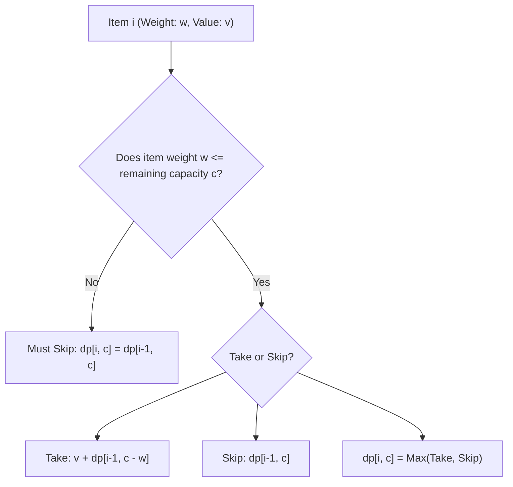

#### Recurrence Relation

$$dp[i, c] = \begin{cases} dp[i-1, c] & \text{if } W[i-1] > c \\ \max(dp[i-1, c], \; V[i-1] + dp[i-1, c - W[i-1]]) & \text{if } W[i-1] \le c \end{cases}$$

```csharp
namespace Fundamentals.DynamicProgramming;

public static class Knapsack01
{
    /// <summary>
    /// 2D Tabulation Solution.
    /// Time Complexity: O(N * C), Space Complexity: O(N * C).
    /// </summary>
    public static int Solve2D(int capacity, int[] weights, int[] values)
    {
        int n = weights.Length;
        int[,] dp = new int[n + 1, capacity + 1];

        for (int i = 1; i <= n; i++)
        {
            int currentWeight = weights[i - 1];
            int currentValue = values[i - 1];

            for (int c = 0; c <= capacity; c++)
            {
                if (currentWeight > c)
                {
                    dp[i, c] = dp[i - 1, c]; // Cannot include item
                }
                else
                {
                    dp[i, c] = Math.Max(
                        dp[i - 1, c], // Exclude
                        currentValue + dp[i - 1, c - currentWeight] // Include
                    );
                }
            }
        }

        return dp[n, capacity];
    }

    /// <summary>
    /// Space-Optimized 1D Array Solution.
    /// Time Complexity: O(N * C), Space Complexity: O(C).
    /// </summary>
    public static int Solve1DSpaceOptimized(int capacity, int[] weights, int[] values)
    {
        int n = weights.Length;
        int[] dp = new int[capacity + 1];

        for (int i = 0; i < n; i++)
        {
            int weight = weights[i];
            int value = values[i];

            // CRITICAL: Iterate backwards from capacity down to weight!
            // Backward traversal ensures that values from the current item
            // do not overwrite and contaminate the sub-states needed for the same row.
            for (int c = capacity; c >= weight; c--)
            {
                dp[c] = Math.Max(dp[c], value + dp[c - weight]);
            }
        }

        return dp[capacity];
    }
}
```

> [!IMPORTANT]
> **Why Reverse Iteration in 1D 0/1 Knapsack?**
> When iterating forwards ($c = weight \dots capacity$), $dp[c - weight]$ would represent the state where the **current item has already been included**, effectively turning the problem into the *Unbounded Knapsack* (infinite copies of an item). Iterating backwards ensures $dp[c - weight]$ holds the value from the **previous item**, enforcing the 0/1 constraint.

---

### 7.4 Longest Common Subsequence (LCS)

**Problem**: Given two strings `text1` and `text2`, return the length of their longest common subsequence. A subsequence is a sequence that can be derived from another string by deleting some or no characters without changing the relative order of the remaining characters.

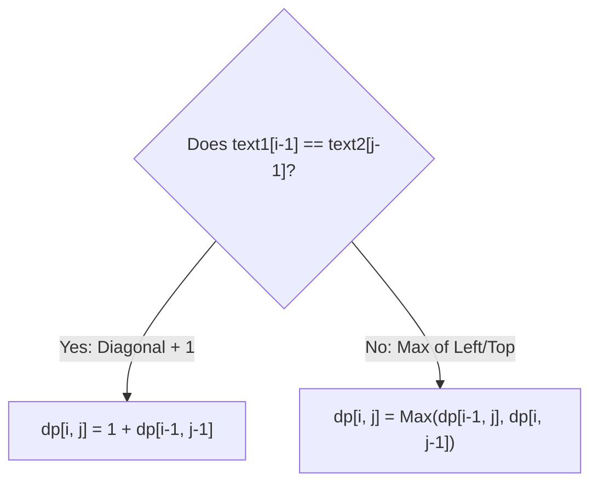

```csharp
namespace Fundamentals.DynamicProgramming;

public static class LongestCommonSubsequenceEngine
{
    public static int LongestCommonSubsequence(string text1, string text2)
    {
        int m = text1.Length;
        int n = text2.Length;
        int[,] dp = new int[m + 1, n + 1];

        for (int i = 1; i <= m; i++)
        {
            for (int j = 1; j <= n; j++)
            {
                if (text1[i - 1] == text2[j - 1])
                {
                    dp[i, j] = 1 + dp[i - 1, j - 1];
                }
                else
                {
                    dp[i, j] = Math.Max(dp[i - 1, j], dp[i, j - 1]);
                }
            }
        }

        return dp[m, n];
    }

    /// <summary>
    /// Reconstructs the actual LCS string by backtracking through the DP table.
    /// </summary>
    public static string ReconstructLCS(string text1, string text2)
    {
        int m = text1.Length;
        int n = text2.Length;
        int[,] dp = new int[m + 1, n + 1];

        for (int i = 1; i <= m; i++)
        {
            for (int j = 1; j <= n; j++)
            {
                dp[i, j] = (text1[i - 1] == text2[j - 1])
                    ? 1 + dp[i - 1, j - 1]
                    : Math.Max(dp[i - 1, j], dp[i, j - 1]);
            }
        }

        // Backtrack from dp[m, n] to dp[0, 0]
        List<char> lcsChars = [];
        int r = m, c = n;

        while (r > 0 && c > 0)
        {
            if (text1[r - 1] == text2[c - 1])
            {
                lcsChars.Add(text1[r - 1]);
                r--;
                c--;
            }
            else if (dp[r - 1, c] >= dp[r, c - 1])
            {
                r--;
            }
            else
            {
                c--;
            }
        }

        lcsChars.Reverse();
        return new string([.. lcsChars]);
    }
}
```

---

### 7.5 Coin Change Problems

#### Problem A: Coin Change 1 (Fewest Coins to Make Amount)

**Goal**: Find the minimum number of coins needed to make up target `amount`.

- **State**: $dp[i]$ = minimum coins needed for amount $i$.
- **Base Case**: $dp[0] = 0$, all other $dp[i] = \infty$.
- **Recurrence**: $dp[i] = \min_{coin \in coins}(dp[i - coin] + 1)$.

```csharp
namespace Fundamentals.DynamicProgramming;

public static class CoinChangeEngine
{
    public static int CoinChangeMinCoins(int[] coins, int amount)
    {
        if (amount < 0) return -1;
        if (amount == 0) return 0;

        int[] dp = new int[amount + 1];
        // Use amount + 1 as sentinel for infinity
        Array.Fill(dp, amount + 1);
        dp[0] = 0;

        for (int i = 1; i <= amount; i++)
        {
            foreach (int coin in coins)
            {
                if (i - coin >= 0)
                {
                    dp[i] = Math.Min(dp[i], dp[i - coin] + 1);
                }
            }
        }

        return dp[amount] > amount ? -1 : dp[amount];
    }

    /// <summary>
    /// Problem B: Coin Change 2 (Number of Combinations / Ways).
    /// Order of coins does not matter (Combinations, not Permutations).
    /// </summary>
    public static int CoinChangeWays(int amount, int[] coins)
    {
        int[] dp = new int[amount + 1];
        dp[0] = 1; // 1 way to make amount 0 (choose no coins)

        // Outer loop over COINS ensures combinations (no duplicate permutations like [1,2] and [2,1])
        foreach (int coin in coins)
        {
            for (int i = coin; i <= amount; i++)
            {
                dp[i] += dp[i - coin];
            }
        }

        return dp[amount];
    }
}
```

> [!TIP]
> **Permutations vs. Combinations Loop Order**:
>
> - **Combinations (Coin Change 2)**: Outer loop over `coins`, inner loop over `amount`. Each coin is considered sequentially, preventing ordered duplicates.
> - **Permutations (e.g., Combination Sum IV)**: Outer loop over `amount`, inner loop over `coins`. Every coin is re-tested at every step, counting order differences.

---

## 🎯 8. Recognizing & Formulating DP in Technical Interviews

### 8.1 The DP Identification Checklist

When presented with an unseen problem in an interview, evaluate these 4 triggers:

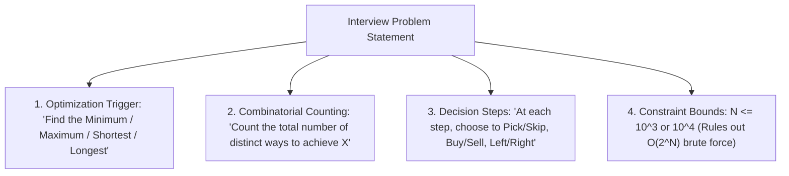

---

### 8.2 The 5-Step Systematic DP Framework (The "FAST" Method)

To systematically solve any DP question during an interview under pressure:

```text
┌──────────────────────────────────────────────────────────────────────────────────────────────────┐
│ Step 1: Define the State (Table Representation)                                                  │
│         State precisely what dp[i] or dp[i, j] represents in plain English.                     │
│         e.g., "dp[i] is the maximum profit achievable considering the first i days."             │
├──────────────────────────────────────────────────────────────────────────────────────────────────┤
│ Step 2: Establish the Base Cases                                                                 │
│         Identify the smallest irreducible subproblems (i = 0, empty string, capacity = 0).       │
├──────────────────────────────────────────────────────────────────────────────────────────────────┤
│ Step 3: Derive the State Transition Equation (Recurrence Relation)                               │
│         Formulate choices available at state i: dp[i] = max(Choice A, Choice B).                 │
├──────────────────────────────────────────────────────────────────────────────────────────────────┤
│ Step 4: Determine the Iteration Order (Topological Sort)                                         │
│         Ensure prerequisites are computed before dependent states (left-to-right, row-by-row).   │
├──────────────────────────────────────────────────────────────────────────────────────────────────┤
│ Step 5: Optimize Auxiliary Space                                                                 │
│         Analyze state dependencies: Does dp[i] only need dp[i-1]? If so, reduce to O(1) space.  │
└──────────────────────────────────────────────────────────────────────────────────────────────────┘
```

---

### 8.3 Algorithmic Paradigm Decision Matrix

| Paradigm | When to Use | Typical Subproblem Structure | Backtracking / Re-evaluation |
| :--- | :--- | :--- | :--- |
| **Greedy** | A locally optimal choice at each step is proven to yield a globally optimal solution. | Disjoint / Independent. | Never looks back. |
| **Divide & Conquer** | Problem divides into independent sub-instances (Merge Sort, Binary Search). | Disjoint / Non-overlapping. | Combines independent results. |
| **Dynamic Programming** | Optimal substructure with heavily **overlapping** sub-states. | Overlapping / Interdependent. | Table lookup avoids re-evaluation. |
| **Backtracking (DFS)** | Need to generate **all** valid configurations, paths, or permutations. | Tree branch exploration. | Un-chooses state when dead end reached. |

---

## 🏛️ 9. Canonical DP Pattern Taxonomy

Understanding standard DP archetypes allows you to classify 95% of technical interview problems into known models.

### 9.1 Pattern 1: 1D Linear State (Fibonacci / House Robber / LIS)

- **Characteristics**: Single index state `dp[i]` representing the answer up to index `i`.
- **Archetype Problem**: Longest Increasing Subsequence (LIS).

```csharp
namespace Fundamentals.DynamicProgramming;

public static class LinearDPPatterns
{
    /// <summary>
    /// House Robber: Cannot rob two adjacent houses. Maximize money.
    /// Recurrence: dp[i] = Max(dp[i-1], nums[i] + dp[i-2])
    /// </summary>
    public static int Rob(int[] nums)
    {
        int prev2 = 0;
        int prev1 = 0;

        foreach (int num in nums)
        {
            int current = Math.Max(prev1, num + prev2);
            prev2 = prev1;
            prev1 = current;
        }

        return prev1;
    }

    /// <summary>
    /// Longest Increasing Subsequence (LIS) - O(N^2) Tabulation.
    /// </summary>
    public static int LengthOfLIS(int[] nums)
    {
        if (nums.Length == 0) return 0;
        int[] dp = new int[nums.Length];
        Array.Fill(dp, 1);
        int maxLIS = 1;

        for (int i = 1; i < nums.Length; i++)
        {
            for (int j = 0; j < i; j++)
            {
                if (nums[i] > nums[j])
                {
                    dp[i] = Math.Max(dp[i], dp[j] + 1);
                }
            }
            maxLIS = Math.Max(maxLIS, dp[i]);
        }

        return maxLIS;
    }
}
```

---

### 9.2 Pattern 2: 2D Grid / Matrix DP (Unique Paths & Minimum Path Sum)

- **Characteristics**: State `dp[r, c]` represents the optimal cost/paths to reach cell `(r, c)` from top-left `(0, 0)`.
- **Transitions**: Typically moves only **Down** and **Right**.

```csharp
namespace Fundamentals.DynamicProgramming;

public static class GridDPPatterns
{
    /// <summary>
    /// Minimum Path Sum in an M x N grid.
    /// Recurrence: dp[r, c] = grid[r, c] + Min(dp[r-1, c], dp[r, c-1])
    /// Space Optimized: O(N) single row.
    /// </summary>
    public static int MinPathSum(int[][] grid)
    {
        int rows = grid.Length;
        int cols = grid[0].Length;
        int[] dp = new int[cols];

        // Base case: origin
        dp[0] = grid[0][0];

        // Initialize first row
        for (int c = 1; c < cols; c++)
        {
            dp[c] = dp[c - 1] + grid[0][c];
        }

        for (int r = 1; r < rows; r++)
        {
            dp[0] += grid[r][0]; // First column transition (only from top)
            for (int c = 1; c < cols; c++)
            {
                dp[c] = grid[r][c] + Math.Min(dp[c], dp[c - 1]);
            }
        }

        return dp[cols - 1];
    }
}
```

---

### 9.3 Pattern 3: String Matching DP (Edit Distance / Levenshtein)

- **Characteristics**: Two string indices `dp[i, j]` matching `word1[0..i]` to `word2[0..j]`.
- **Archetype**: Edit Distance (Insert, Delete, Replace).

```csharp
namespace Fundamentals.DynamicProgramming;

public static class StringDPPatterns
{
    /// <summary>
    /// Computes Levenshtein Edit Distance between two strings.
    /// Operations: Insert, Delete, Replace.
    /// </summary>
    public static int MinDistance(string word1, string word2)
    {
        int m = word1.Length;
        int n = word2.Length;
        int[,] dp = new int[m + 1, n + 1];

        for (int i = 0; i <= m; i++) dp[i, 0] = i; // Delete all chars
        for (int j = 0; j <= n; j++) dp[0, j] = j; // Insert all chars

        for (int i = 1; i <= m; i++)
        {
            for (int j = 1; j <= n; j++)
            {
                if (word1[i - 1] == word2[j - 1])
                {
                    dp[i, j] = dp[i - 1, j - 1]; // Characters match, no cost
                }
                else
                {
                    dp[i, j] = 1 + Math.Min(
                        dp[i - 1, j - 1], // Replace
                        Math.Min(
                            dp[i - 1, j],  // Delete
                            dp[i, j - 1]   // Insert
                        )
                    );
                }
            }
        }

        return dp[m, n];
    }
}
```

---

### 9.4 Pattern 4: Interval DP (Matrix Chain Multiplication / Burst Balloons)

- **Characteristics**: State `dp[i, j]` represents the optimal cost of the sub-array slice from index `i` to index `j`.
- **Loop Strategy**: Iterate by interval **length** $L = 2 \dots N$, testing all partition pivot points $k \in [i, j)$.

```csharp
namespace Fundamentals.DynamicProgramming;

public static class IntervalDPPatterns
{
    /// <summary>
    /// Longest Palindromic Subsequence length using Interval DP.
    /// State: dp[i, j] = length of LPS in substring s[i..j].
    /// </summary>
    public static int LongestPalindromeSubseq(string s)
    {
        int n = s.Length;
        int[,] dp = new int[n, n];

        // Base case: every single character is a palindrome of length 1
        for (int i = 0; i < n; i++)
        {
            dp[i, i] = 1;
        }

        // Iterate over substring lengths from 2 to n
        for (int len = 2; len <= n; len++)
        {
            for (int i = 0; i <= n - len; i++)
            {
                int j = i + len - 1;

                if (s[i] == s[j])
                {
                    dp[i, j] = 2 + (len == 2 ? 0 : dp[i + 1, j - 1]);
                }
                else
                {
                    dp[i, j] = Math.Max(dp[i + 1, j], dp[i, j - 1]);
                }
            }
        }

        return dp[0, n - 1];
    }
}
```

---

### 9.5 Pattern Summary Cheat Sheet Table

| DP Pattern Family | Canonical Problem | State Representation | Typical Transition Formula | Time / Space Complexity |
| :--- | :--- | :--- | :--- | :--- |
| **1D Linear State** | Climbing Stairs, House Robber | `dp[i]` | $dp[i] = \max(dp[i-1], \text{val} + dp[i-2])$ | $O(N)$ Time / $O(1)$ Space |
| **Knapsack (0/1)** | Subset Sum, Partition Equal Sum | `dp[i, w]` or `dp[w]` | $dp[w] = \max(dp[w], v + dp[w - weight])$ | $O(N \cdot W)$ Time / $O(W)$ Space |
| **Knapsack (Unbounded)** | Coin Change, Rod Cutting | `dp[w]` | $dp[w] = \min(dp[w], 1 + dp[w - coin])$ | $O(N \cdot W)$ Time / $O(W)$ Space |
| **2D Grid Path** | Unique Paths, Min Path Sum | `dp[r, c]` | $dp[r, c] = \text{grid}[r, c] + \min(dp[r-1, c], dp[r, c-1])$ | $O(M \cdot N)$ Time / $O(N)$ Space |
| **Two-String Alignment** | LCS, Edit Distance | `dp[i, j]` | $dp[i, j] = 1 + dp[i-1, j-1] \text{ or } \min(\text{ops})$ | $O(M \cdot N)$ Time / $O(\min(M, N))$ Space |
| **Interval DP** | Burst Balloons, LPS | `dp[i, j]` | $dp[i, j] = \max_{k}(dp[i, k] + dp[k+1, j] + \text{cost})$ | $O(N^3)$ Time / $O(N^2)$ Space |

---

## 🚀 10. Production .NET Considerations & Senior Interview Summary

### 10.1 High-Performance Memory Engineering for DP in .NET 10

When implementing Dynamic Programming in high-throughput production .NET services (e.g., order pricing rules, rate limiters, route planners):

1. **Avoid Large Object Heap (LOH) Allocations**:
   Any array exceeding **85,000 bytes** (e.g., `int[22000]` on x64) is directly allocated on the LOH, leading to Gen 2 GC pauses and fragmentation.
2. **Use `ArrayPool<T>.Shared` for Temporary DP Tables**:
   Instead of allocating new arrays per request, borrow memory from the runtime pool and return it in a `finally` block:

```csharp
using System.Buffers;

public static int HighThroughputKnapsack(int capacity, int[] weights, int[] values)
{
    int[] dp = ArrayPool<int>.Shared.Rent(capacity + 1);
    try
    {
        Array.Clear(dp, 0, capacity + 1);

        for (int i = 0; i < weights.Length; i++)
        {
            int weight = weights[i];
            int value = values[i];
            for (int c = capacity; c >= weight; c--)
            {
                dp[c] = Math.Max(dp[c], value + dp[c - weight]);
            }
        }

        return dp[capacity];
    }
    finally
    {
        ArrayPool<int>.Shared.Return(dp);
    }
}
```

1. **Prefer Flat 1D Arrays Over Jagged Arrays (`int[][]`)**:
   A jagged array `new int[1000][]` creates 1,001 separate heap objects, causing pointer indirection and cache line misses. A 2D array `int[1000, 1000]` or a 1D flat array `int[1000 * 1000]` indexed via `i * cols + j` is a single contiguous block of memory with optimal CPU L1/L2 cache locality.

---

### 10.2 Senior Engineering Summary Checklist

- [x] **Recursion Fundamentals**: Every recursive method requires a well-defined base case and inductive transition.
- [x] **CLR Stack Safety**: The Windows thread stack is fixed (1 MB). Recursion beyond stack capacity causes an uncatchable fatal `StackOverflowException`.
- [x] **Tail Call Reality**: C# does not emit tail calls by default; eliminate deep recursion with iterative loops or heap `Stack<T>`.
- [x] **DP Core Identity**: Dynamic Programming applies when problems exhibit **Overlapping Subproblems** and **Optimal Substructure**.
- [x] **Top-Down vs. Bottom-Up**: Top-Down uses recursion + memoization (lazy); Bottom-Up uses iteration + tabulation (eager, stack-safe, space-optimizable).
- [x] **Space Reduction**: If state $i$ only depends on state $i-1$, reduce space to $O(1)$ scalar variables or rolling arrays.
- [x] **Knapsack Rule**: Iterate backwards in 1D array for 0/1 knapsack (single item use); iterate forwards for unbounded knapsack (reusable items).
