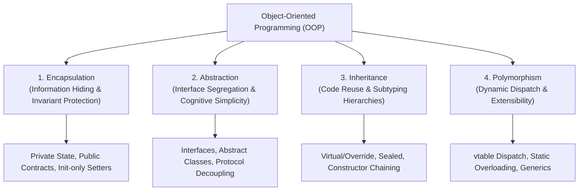
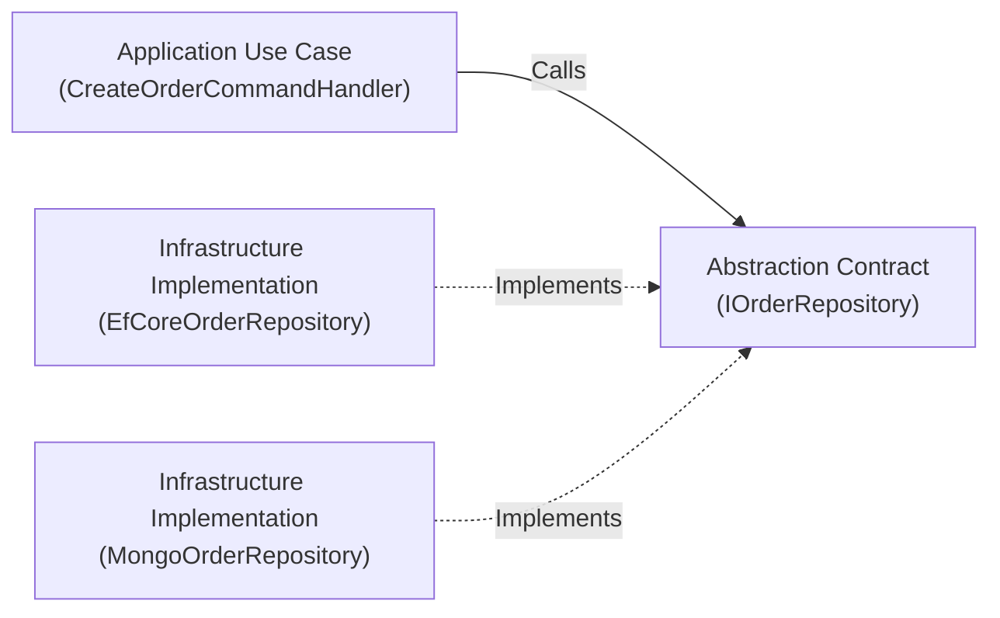
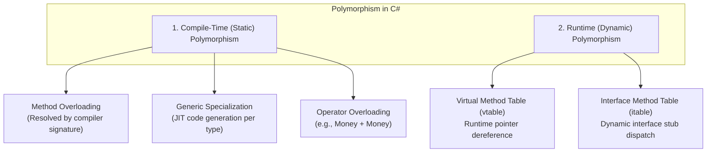
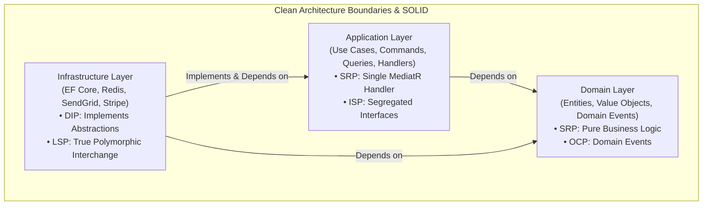
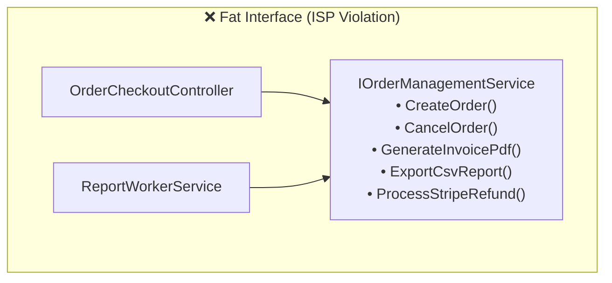
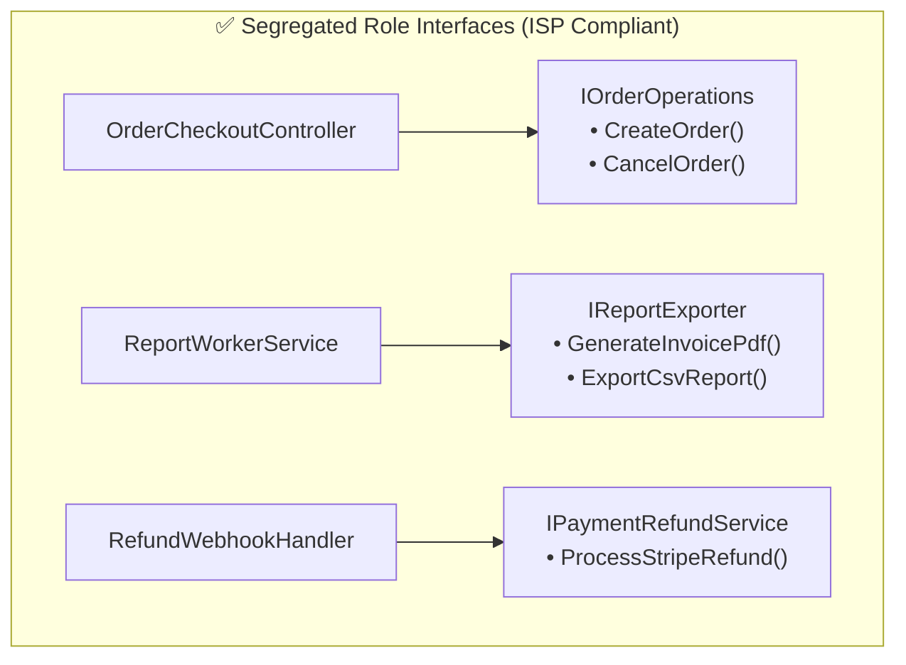
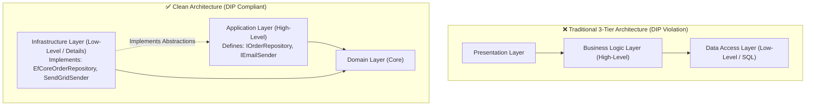
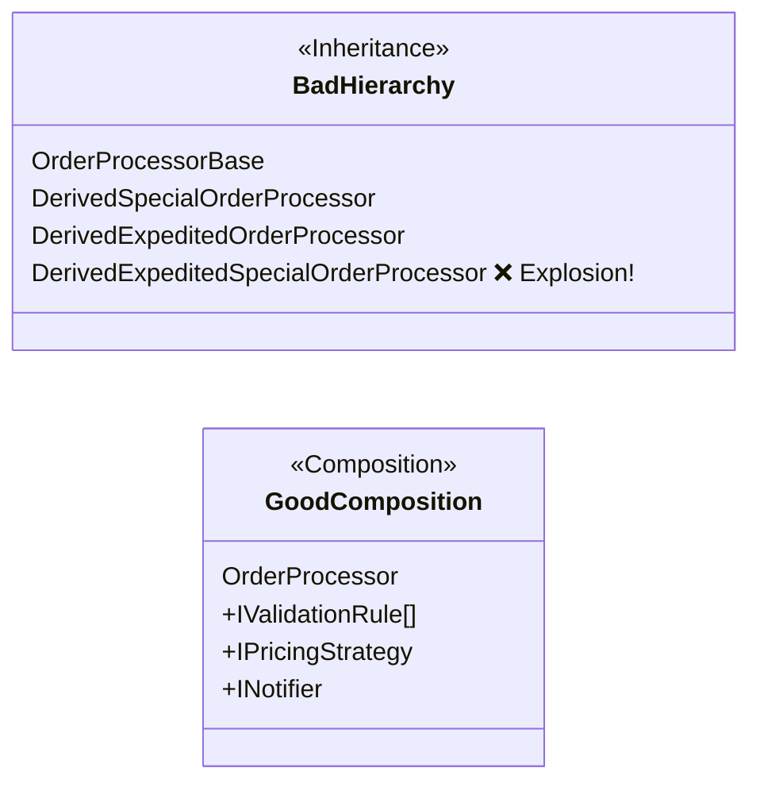
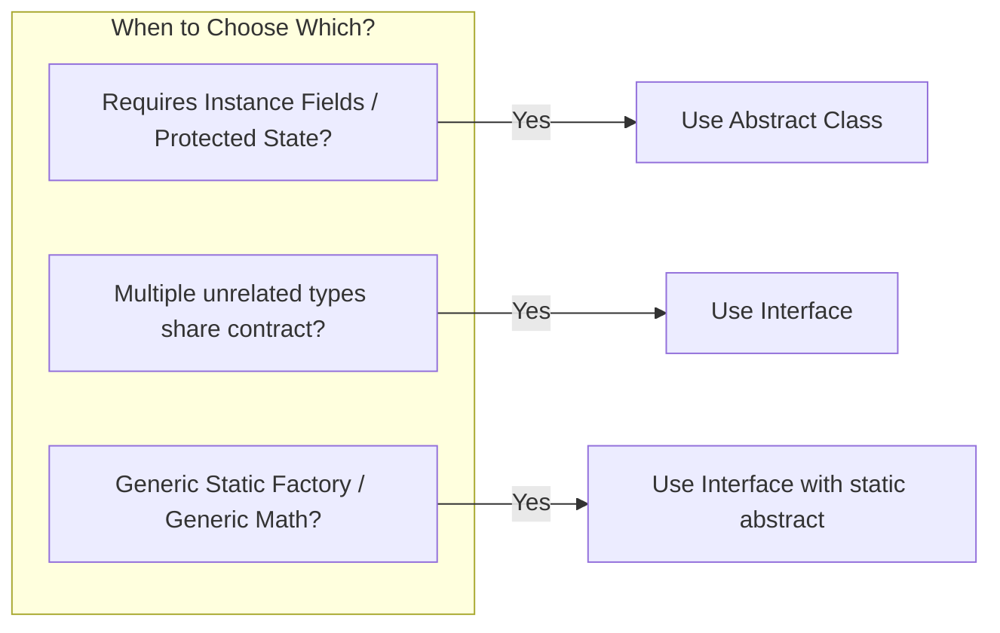
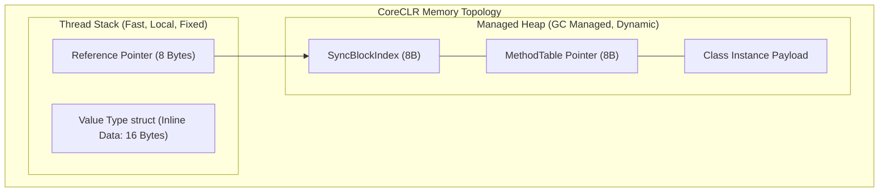

# 09 - Object-Oriented Programming (OOP) & SOLID Principles: Architecture, Runtime Mechanics & Senior .NET Patterns

Object-Oriented Programming (OOP) and the SOLID design principles form the foundational bedrock of enterprise software architecture in .NET. While junior developers often treat these concepts as academic checklists, senior .NET engineers and software architects understand them as **trade-off management systems**—frameworks for controlling coupling, maximizing cohesion, protecting domain invariants, and ensuring long-term maintainability.

This module provides a comprehensive, deep-dive examination of OOP pillars, CoreCLR runtime mechanics, SOLID principles in Clean Architecture, modern C# (.NET 8/9/10) features, and high-performance design patterns.

---

## 1. 📚 The 4 Pillars of Object-Oriented Programming (OOP)



---

### 1.1 Encapsulation: Access Modifiers, State Protection & Invariants

Encapsulation is not merely bundling data and methods into a single class; it is the **strict enforcement of boundaries** and **protection of business invariants**. A well-encapsulated object guarantees that it can never enter an invalid state, regardless of how external consumers invoke its members.

#### C# Access Modifiers: Scope and Boundary Matrix

C# provides a rich set of access modifiers that allow developers to control visibility across assemblies, types, and inheritance hierarchies.

| Access Modifier | Accessibility Scope | Common Clean Architecture Use Case |
| :--- | :--- | :--- |
| `public` | Accessible anywhere in any assembly referencing the project. | Public Application APIs, DTOs, Domain Entities, Interface contracts. |
| `private` | Accessible only within the containing `class` or `struct`. | Backing fields, private helper methods, internal state mutations. |
| `protected` | Accessible within the containing class and derived classes. | Base entity template methods, base repository EF Core DbSets. |
| `internal` | Accessible only within the same compiled assembly (`.dll`). | Domain services, internal infrastructure handlers, mapper profiles. |
| `protected internal` | Accessible within the same assembly **OR** any derived class in any assembly. | Framework base classes designed for cross-assembly extension. |
| `private protected` | Accessible within the containing class **AND** derived classes within the **same assembly only**. | Restricting polymorphic extensions strictly to internal assembly types. |
| `file` (C# 11+) | Accessible only within the exact physical source file. | Source generators, file-scoped helper classes, local DTOs. |

```mermaid
graph TD
    subgraph Assembly A
        TypeA["Base Type"]
        TypeA_Derived["Derived Type in Same Assembly"]
        TypeA_Other["Unrelated Type in Same Assembly"]
    end

    subgraph Assembly B (References Assembly A)
        TypeB_Derived["Derived Type in Other Assembly"]
        TypeB_Other["Unrelated Type in Other Assembly"]
    end

    TypeA -- "private" --> TypeA
    TypeA -- "private protected" --> TypeA_Derived
    TypeA -- "internal" --> TypeA_Derived & TypeA_Other
    TypeA -- "protected" --> TypeA_Derived & TypeB_Derived
    TypeA -- "protected internal" --> TypeA_Derived & TypeA_Other & TypeB_Derived
    TypeA -- "public" --> TypeA_Derived & TypeA_Other & TypeB_Derived & TypeB_Other
```

#### Encapsulation in Domain-Driven Design (DDD) vs Anemic Domain Models

In Clean Architecture, domain entities must reject the **Anemic Domain Model** antipattern (classes with public getters and setters) in favor of **Rich Domain Models** with encapsulated invariants.

```csharp
// ❌ ANEMIC DOMAIN MODEL: Invariants are violated externally
public class AnemicOrder
{
    public Guid Id { get; set; }
    public decimal TotalAmount { get; set; } // Can be set to -500.00m directly!
    public string Status { get; set; } = string.Empty; // Can be set to invalid strings
    public List<OrderItem> Items { get; set; } = new(); // External callers can Clear() without checks
}

// ✅ ENCAPSULATED RICH DOMAIN MODEL: Invariants guaranteed by compiler and runtime
public sealed class Order
{
    private readonly List<OrderItem> _items = new();

    public Guid Id { get; init; }
    public CustomerId CustomerId { get; init; }
    public OrderStatus Status { get; private set; }
    public Money TotalAmount => _items.Aggregate(Money.Zero, (acc, item) => acc + item.Price);
    
    // ReadOnly collection prevents external callers from bypassing AddItem invariant logic
    public IReadOnlyCollection<OrderItem> Items => _items.AsReadOnly();

    // Private constructor enforces creation through factory method
    private Order(Guid id, CustomerId customerId)
    {
        Id = id;
        CustomerId = customerId;
        Status = OrderStatus.Draft;
    }

    public static Order Create(CustomerId customerId)
    {
        ArgumentNullException.ThrowIfNull(customerId);
        return new Order(Guid.NewGuid(), customerId);
    }

    public Result AddItem(ProductId productId, Money price, int quantity)
    {
        if (Status != OrderStatus.Draft)
            return Result.Failure("Cannot add items to an order that is not in Draft status.");

        if (quantity <= 0)
            return Result.Failure("Quantity must be greater than zero.");

        _items.Add(new OrderItem(productId, price, quantity));
        return Result.Success();
    }

    public Result Submit()
    {
        if (_items.Count == 0)
            return Result.Failure("Cannot submit an empty order.");

        Status = OrderStatus.Submitted;
        return Result.Success();
    }
}
```

---

### 1.2 Abstraction: Managing Complexity & Hiding Volatile Details

Abstraction hides the internal implementation mechanics and exposes only the semantic contract required by consumers. It allows high-level business policies to operate independently of low-level infrastructure (databases, message brokers, external APIs).



#### Abstract Classes vs Interfaces in C# (.NET)

```csharp
// Abstract Class: Defines an identity, shared lifecycle, and base reusable behavior
public abstract class AggregateRoot<TId>
{
    private readonly List<IDomainEvent> _domainEvents = new();

    public TId Id { get; protected set; } = default!;
    public IReadOnlyCollection<IDomainEvent> DomainEvents => _domainEvents.AsReadOnly();

    protected void RaiseDomainEvent(IDomainEvent domainEvent)
    {
        _domainEvents.Add(domainEvent);
    }

    public void ClearDomainEvents() => _domainEvents.Clear();
}

// Interface: Pure behavioral contract (capabilities and roles)
public interface IOrderRepository
{
    Task<Order?> GetByIdAsync(Guid id, CancellationToken cancellationToken = default);
    Task AddAsync(Order order, CancellationToken cancellationToken = default);
    Task UpdateAsync(Order order, CancellationToken cancellationToken = default);
}
```

---

### 1.3 Inheritance: Subtyping, Polymorphism & Virtual Dispatch

Inheritance allows a derived type to inherit state and behavior from a base class. In modern C#, inheritance is primarily used for **subtyping polymorphism** (IS-A relationships) and architectural frameworks (e.g., base controllers, base entity types).

#### Virtual, Override, Sealed, and Method Hiding (`new`)

- `virtual`: Marks a method in a base class as open for dynamic runtime polymorphism.
- `override`: Provides a new implementation of a virtual/abstract method in a derived class.
- `sealed`: Prevents further inheritance of a class or further overriding of a virtual method. Sealing classes is a best practice in .NET for performance because it allows the JIT compiler to **devirtualize** method calls into direct jumps.
- `new`: Method hiding (shadowing). It creates an entirely independent method with the same name, breaking runtime polymorphism. **Avoid `new` in enterprise domain models.**

```csharp
public class BaseProcessor
{
    public virtual string Process() => "Base Processing";
    public string NonVirtualProcess() => "Base Static";
}

public class DerivedProcessor : BaseProcessor
{
    // Runtime polymorphism: overrides base behavior in the MethodTable (vtable)
    public override string Process() => "Derived Dynamic Processing";

    // Method hiding: breaks polymorphic dispatch!
    public new string NonVirtualProcess() => "Derived Shadowed Processing";
}

// Runtime Execution Demonstration:
BaseProcessor instance = new DerivedProcessor();

// Outputs: "Derived Dynamic Processing" (Dispatched through vtable)
Console.WriteLine(instance.Process());

// Outputs: "Base Static" (Resolved at compile time based on reference type BaseProcessor!)
Console.WriteLine(instance.NonVirtualProcess());
```

#### Constructor Chaining in C# (.NET)

Constructors in derived classes must chain to their base constructor via `base(...)` before executing their own constructor body.

```csharp
public abstract class Entity<TId>
{
    public TId Id { get; }
    public DateTime CreatedAtUtc { get; }

    protected Entity(TId id)
    {
        Id = id;
        CreatedAtUtc = DateTime.UtcNow;
    }
}

public sealed class Customer : Entity<CustomerId>
{
    public string FullName { get; private set; }
    public string Email { get; private set; }

    // Chaining to base class constructor
    public Customer(CustomerId id, string fullName, string email)
        : base(id)
    {
        FullName = fullName;
        Email = email;
    }

    // Constructor overloading with 'this' chaining
    public Customer(string fullName, string email)
        : this(new CustomerId(Guid.NewGuid()), fullName, email)
    {
    }
}
```

---

### 1.4 Polymorphism: Compile-Time vs Runtime Dispatch

Polymorphism allows objects of different concrete types to be treated uniformly through a shared abstraction.



#### Runtime Polymorphism & CoreCLR `MethodTable` Mechanics

Every object instance allocated on the managed heap contains an 8-byte (on 64-bit systems) pointer to its type's `MethodTable`.

```text
Managed Heap Object (Instance of DerivedProcessor)
┌────────────────────────────────────────────────────────┐
│ Object Header (SyncBlockIndex)                 [8 Bytes]│
├────────────────────────────────────────────────────────┤
│ MethodTable Pointer (Point to Derived Type MT) [8 Bytes]│ ───► MethodTable (DerivedProcessor)
├────────────────────────────────────────────────────────┤       ┌───────────────────────────┐
│ Instance Field: _id                            [8 Bytes]│       │ Parent Type: BaseProcessor│
├────────────────────────────────────────────────────────┤       ├───────────────────────────┤
│ Instance Field: _status                        [4 Bytes]│       │ Virtual Method Slot Table │
└────────────────────────────────────────────────────────┘       │  Slot 0: Process() ───────┼──► DerivedProcessor.Process()
                                                                 └───────────────────────────┘
```

When invoking `instance.Process()`, the CPU executes the following steps:

1. Dereference the object pointer to read the `MethodTable` pointer.
2. Index into the `MethodTable` slot for `Process()` (Slot index known at compile-time).
3. Read the function address and jump (`call [rax + offset]`).

> [!TIP]
> **Performance Tip**: When a class is marked `sealed`, the .NET JIT compiler can analyze call sites and perform **Devirtualization**. It replaces the indirect `vtable` pointer lookup with a direct non-virtual `call`, enabling aggressive **Inlining** and eliminating CPU branch mispredictions.

---

## 2. ⚡ SOLID Principles in Modern C# & Clean Architecture

The SOLID principles provide actionable guidelines for structuring classes, modules, and boundaries. In Clean Architecture, SOLID principles dictate how dependencies flow across domain, application, and infrastructure layers.



---

### 2.1 S: Single Responsibility Principle (SRP)

> **Definition**: *"A class should have one, and only one, reason to change."* — Robert C. Martin.

SRP is about **cohesion and actor boundaries**. A class should only be responsible to a single business stakeholder or actor.

#### ❌ SRP Violation: The "God Service"

```csharp
// ❌ VIOLATION: Has 5 distinct reasons to change (Persistence, Validation, Email, Logging, Domain Logic)
public class OrderProcessingService
{
    public async Task ProcessOrderAsync(Guid orderId, string email, decimal amount)
    {
        // 1. Validation Logic (Changes if validation rules change)
        if (amount <= 0) throw new ArgumentException("Invalid amount");

        // 2. Database Persistence Logic (Changes if EF Core / SQL schema changes)
        using var connection = new SqlConnection("Server=...;");
        await connection.ExecuteAsync("UPDATE Orders SET Status = 'Paid' WHERE Id = @Id", new { Id = orderId });

        // 3. Third-party Payment Gateway (Changes if Stripe API changes)
        var client = new HttpClient();
        await client.PostAsync("https://api.stripe.com/v1/charges", null);

        // 4. Notification Logic (Changes if switching from SendGrid to SES)
        using var smtp = new SmtpClient("smtp.mail.com");
        await smtp.SendMailAsync(new MailMessage("noreply@store.com", email, "Order Paid", "Thank you!"));

        // 5. File System Audit Logging (Changes if logging format changes)
        await File.AppendAllTextAsync("C:\\logs\\audit.log", $"Order {orderId} processed.");
    }
}
```

#### ✅ Clean Architecture SRP Fix: Vertical Slice / CQRS Handler

In Clean Architecture with CQRS (Command Query Responsibility Segregation), each use case is encapsulated in a dedicated handler with single responsibility:

```csharp
// Application Command: Data contract only
public sealed record ProcessOrderCommand(Guid OrderId, CustomerId CustomerId, Money Amount) : IRequest<Result>;

// Application Validator: Validation rules only
public sealed class ProcessOrderCommandValidator : AbstractValidator<ProcessOrderCommand>
{
    public ProcessOrderCommandValidator()
    {
        RuleFor(x => x.OrderId).NotEmpty();
        RuleFor(x => x.Amount.Amount).GreaterThan(0);
    }
}

// Application Use Case Handler: Orchestrates the business transaction only
public sealed class ProcessOrderCommandHandler : IRequestHandler<ProcessOrderCommand, Result>
{
    private readonly IOrderRepository _orderRepository;
    private readonly IPaymentGateway _paymentGateway;
    private readonly IUnitOfWork _unitOfWork;

    public ProcessOrderCommandHandler(
        IOrderRepository orderRepository,
        IPaymentGateway paymentGateway,
        IUnitOfWork unitOfWork)
    {
        _orderRepository = orderRepository;
        _paymentGateway = paymentGateway;
        _unitOfWork = unitOfWork;
    }

    public async Task<Result> Handle(ProcessOrderCommand request, CancellationToken cancellationToken)
    {
        var order = await _orderRepository.GetByIdAsync(request.OrderId, cancellationToken);
        if (order is null)
            return Result.Failure("Order not found.");

        var paymentResult = await _paymentGateway.ChargeAsync(request.CustomerId, request.Amount, cancellationToken);
        if (!paymentResult.IsSuccess)
            return Result.Failure(paymentResult.Error);

        var markPaidResult = order.MarkAsPaid();
        if (!markPaidResult.IsSuccess)
            return markPaidResult;

        await _unitOfWork.SaveChangesAsync(cancellationToken);
        return Result.Success();
    }
}
```

---

### 2.2 O: Open/Closed Principle (OCP)

> **Definition**: *"Software entities (classes, modules, functions) should be open for extension, but closed for modification."*

You should be able to introduce new functionality into the system without altering existing, tested code.

#### ❌ OCP Violation: Switch Statements on Types

```csharp
// ❌ VIOLATION: Adding a new customer tier requires modifying this class and risking regressions
public class DiscountCalculator
{
    public decimal CalculateDiscount(CustomerType type, decimal orderTotal)
    {
        return type switch
        {
            CustomerType.Regular => orderTotal * 0.0m,
            CustomerType.Silver => orderTotal * 0.05m,
            CustomerType.Gold => orderTotal * 0.10m,
            CustomerType.Platinum => orderTotal * 0.20m,
            _ => throw new ArgumentOutOfRangeException(nameof(type))
        };
    }
}
```

#### ✅ Clean Architecture OCP Fix: Strategy Pattern & DI Auto-Discovery

```csharp
// 1. Behavioral abstraction
public interface IDiscountStrategy
{
    bool IsApplicable(Customer customer, Order order);
    Money CalculateDiscount(Order order);
}

// 2. Concrete extensions (New strategies added in isolated files without editing existing code)
public sealed class GoldCustomerDiscountStrategy : IDiscountStrategy
{
    public bool IsApplicable(Customer customer, Order order) => customer.Tier == CustomerTier.Gold;
    public Money CalculateDiscount(Order order) => order.TotalAmount * 0.10m;
}

public sealed class BlackFridayDiscountStrategy : IDiscountStrategy
{
    public bool IsApplicable(Customer customer, Order order) => DateTime.UtcNow.Month == 11 && DateTime.UtcNow.Day >= 25;
    public Money CalculateDiscount(Order order) => order.TotalAmount * 0.30m;
}

// 3. Calculator is closed for modification, open for extension via IEnumerable<IDiscountStrategy>
public sealed class DiscountService
{
    private readonly IEnumerable<IDiscountStrategy> _strategies;

    public DiscountService(IEnumerable<IDiscountStrategy> strategies)
    {
        _strategies = strategies;
    }

    public Money DetermineBestDiscount(Customer customer, Order order)
    {
        var applicableStrategies = _strategies.Where(s => s.IsApplicable(customer, order));
        
        Money highestDiscount = Money.Zero;
        foreach (var strategy in applicableStrategies)
        {
            var discount = strategy.CalculateDiscount(order);
            if (discount > highestDiscount)
            {
                highestDiscount = discount;
            }
        }

        return highestDiscount;
    }
}
```

#### ✅ OCP in Application Layer: MediatR Pipeline Behaviors

Cross-cutting concerns (logging, metrics, caching, validation) extend request handling pipelines without modifying the handler itself:

```csharp
public sealed class LoggingBehavior<TRequest, TResponse> : IPipelineBehavior<TRequest, TResponse>
    where TRequest : notnull
{
    private readonly ILogger<LoggingBehavior<TRequest, TResponse>> _logger;

    public LoggingBehavior(ILogger<LoggingBehavior<TRequest, TResponse>> logger) => _logger = logger;

    public async Task<TResponse> Handle(
        TRequest request, 
        RequestHandlerDelegate<TResponse> next, 
        CancellationToken cancellationToken)
    {
        var requestName = typeof(TRequest).Name;
        _logger.LogInformation("Processing command {RequestName}: {@Request}", requestName, request);

        var stopwatch = Stopwatch.StartNew();
        var response = await next();
        stopwatch.Stop();

        _logger.LogInformation("Completed command {RequestName} in {ElapsedMs}ms", requestName, stopwatch.ElapsedMilliseconds);
        return response;
    }
}
```

---

### 2.3 L: Liskov Substitution Principle (LSP)

> **Definition**: *"Let $\phi(x)$ be a property provable about objects $x$ of type $T$. Then $\phi(y)$ should be true for objects $y$ of type $S$ where $S$ is a subtype of $T$."* — Barbara Liskov.

In plain English: **Subtypes must be fully substitutable for their base types without breaking client expectations, throwing unexpected exceptions, or weakening invariants.**

#### ❌ LSP Violation: The Classic ReadOnly Repository Throwing Exceptions

```csharp
public interface IRepository<T>
{
    Task<T?> GetByIdAsync(Guid id);
    Task AddAsync(T entity);
    Task DeleteAsync(Guid id);
}

// ❌ VIOLATION: ReadOnlyAuditRepository throws NotSupportedException for write methods!
// Clients expecting an IRepository<T> will experience unexpected runtime crashes.
public class ReadOnlyAuditRepository : IRepository<AuditLog>
{
    public Task<AuditLog?> GetByIdAsync(Guid id) => /* query DB */ Task.FromResult<AuditLog?>(null);

    public Task AddAsync(AuditLog entity) => throw new NotSupportedException("Audit logs are read-only!");
    public Task DeleteAsync(Guid id) => throw new NotSupportedException("Audit logs cannot be deleted!");
}
```

#### ✅ Clean Architecture LSP Fix: Segregated Contracts

```csharp
// Split contracts so derived implementations never throw NotSupportedException
public interface IReadRepository<T>
{
    Task<T?> GetByIdAsync(Guid id, CancellationToken cancellationToken = default);
}

public interface IWriteRepository<T>
{
    Task AddAsync(T entity, CancellationToken cancellationToken = default);
    Task DeleteAsync(Guid id, CancellationToken cancellationToken = default);
}

// Clean and fully substitutable
public sealed class ReadOnlyAuditRepository : IReadRepository<AuditLog>
{
    public async Task<AuditLog?> GetByIdAsync(Guid id, CancellationToken cancellationToken = default)
    {
        // Query read-only replica
        return await Task.FromResult<AuditLog?>(null);
    }
}
```

#### LSP Rules Checklist

```text
┌────────────────────────────────────────────────────────────────────────────────────────┐
│                                LISKOV SUBSTITUTION RULES                               │
├────────────────────────────────────────────────────────────────────────────────────────┤
│ 1. Preconditions cannot be strengthened in a subtype:                                  │
│    Derived classes cannot require stricter input validation than base contracts.       │
├────────────────────────────────────────────────────────────────────────────────────────┤
│ 2. Postconditions cannot be weakened in a subtype:                                     │
│    Derived classes must return valid, non-corrupted state conforming to base guarantees│
├────────────────────────────────────────────────────────────────────────────────────────┤
│ 3. Invariants of the supertype must be preserved in a subtype:                         │
│    Internal invariants established by the base class must remain intact.               │
├────────────────────────────────────────────────────────────────────────────────────────┤
│ 4. History constraint:                                                                 │
│    Subtypes cannot introduce mutations to state that the supertype treats as immutable.│
└────────────────────────────────────────────────────────────────────────────────────────┘
```

---

### 2.4 I: Interface Segregation Principle (ISP)

> **Definition**: *"Clients should not be forced to depend upon interfaces that they do not use."*

Large, bloated ("fat") interfaces create tight coupling and force implementers to write dummy or throwing methods.





#### ISP in C# Clean Architecture

```csharp
// Granular, role-focused interfaces in Core/Application layer
public interface IOrderReader
{
    Task<OrderDto?> GetOrderSummaryAsync(Guid orderId, CancellationToken ct = default);
}

public interface IInvoiceGenerator
{
    Task<byte[]> GenerateInvoicePdfAsync(Guid orderId, CancellationToken ct = default);
}

public interface IPaymentGateway
{
    Task<PaymentResult> ChargeAsync(CustomerId customerId, Money amount, CancellationToken ct = default);
}
```

---

### 2.5 D: Dependency Inversion Principle (DIP)

> **Definition**:
>
> 1. *"High-level modules should not depend on low-level modules. Both should depend on abstractions."*
> 2. *"Abstractions should not depend on details. Details (concrete implementations) should depend on abstractions."*

DIP is the architectural linchpin of Clean Architecture. In traditional tiered architectures, the business layer depends directly on the database access layer. DIP **inverts this control direction**.



#### DIP Code Implementation & IoC Container Wireup

```csharp
// 1. High-Level Application Layer: Defines the contract it needs
namespace CleanArchitecture.Application.Common.Interfaces;

public interface IDateTimeProvider
{
    DateTime UtcNow { get; }
}

public interface IEmailSender
{
    Task SendEmailAsync(string to, string subject, string body, CancellationToken ct = default);
}

// 2. Low-Level Infrastructure Layer: Implements the abstractions
namespace CleanArchitecture.Infrastructure.Services;

public sealed class SystemDateTimeProvider : IDateTimeProvider
{
    public DateTime UtcNow => DateTime.UtcNow;
}

public sealed class SendGridEmailSender : IEmailSender
{
    private readonly SendGridClient _client;
    public SendGridEmailSender(IOptions<SendGridOptions> options) => _client = new SendGridClient(options.Value.ApiKey);

    public async Task SendEmailAsync(string to, string subject, string body, CancellationToken ct = default)
    {
        var msg = MailHelper.CreateSingleEmail(new EmailAddress("system@store.com"), new EmailAddress(to), subject, body, body);
        await _client.SendEmailAsync(msg, ct);
    }
}

// 3. Composition Root (Dependency Injection Registration in Infrastructure)
public static class DependencyInjection
{
    public static IServiceCollection AddInfrastructure(this IServiceCollection services, IConfiguration configuration)
    {
        services.AddSingleton<IDateTimeProvider, SystemDateTimeProvider>();
        services.AddScoped<IEmailSender, SendGridEmailSender>();
        services.AddScoped<IOrderRepository, EfCoreOrderRepository>();

        return services;
    }
}
```

---

## 3. 🏗️ Composition over Inheritance: Modern .NET Architecture

The principle of **"Favor Object Composition over Class Inheritance"** (from the Gang of Four) addresses fundamental flaws in deep class inheritance hierarchies:

1. **The Fragile Base Class Problem**: Changes to a base class unintentionally break derived subclasses across multiple projects.
2. **Encapsulation Breakdown**: Derived classes often depend on internal protected state of base classes.
3. **Compile-Time Rigidity**: Class inheritance is fixed at compile time and cannot be altered during runtime.
4. **Multiple Inheritance Limitations**: C# does not permit inheriting implementation from multiple classes.



### Practical Example: Composable Notification Engine

```csharp
// Abstractions for swappable components
public interface IMessageFormatter
{
    string Format(string message);
}

public interface IMessageDeliveryChannel
{
    Task DeliverAsync(string recipient, string formattedMessage);
}

// Concrete behavioral components
public sealed class MarkdownFormatter : IMessageFormatter
{
    public string Format(string message) => $"**Notification:** {message}";
}

public sealed class HtmlFormatter : IMessageFormatter
{
    public string Format(string message) => $"<div class='alert'>{message}</div>";
}

public sealed class SmsDeliveryChannel : IMessageDeliveryChannel
{
    public Task DeliverAsync(string recipient, string formattedMessage) => Task.CompletedTask; // SMS API
}

public sealed class EmailDeliveryChannel : IMessageDeliveryChannel
{
    public Task DeliverAsync(string recipient, string formattedMessage) => Task.CompletedTask; // Email API
}

// Composed Service: Behaves dynamically based on injected strategy components
public sealed class NotificationService
{
    private readonly IMessageFormatter _formatter;
    private readonly IEnumerable<IMessageDeliveryChannel> _channels;

    public NotificationService(
        IMessageFormatter formatter,
        IEnumerable<IMessageDeliveryChannel> channels)
    {
        _formatter = formatter;
        _channels = channels;
    }

    public async Task BroadcastAsync(string recipient, string rawMessage)
    {
        var formatted = _formatter.Format(rawMessage);
        
        var deliveryTasks = _channels.Select(c => c.DeliverAsync(recipient, formatted));
        await Task.WhenAll(deliveryTasks);
    }
}
```

---

## 4. 🧩 Common Design Patterns in C# & Clean Architecture

| Pattern | Category | Clean Architecture Role | Modern .NET Idiom |
| :--- | :--- | :--- | :--- |
| **Repository & Unit of Work** | Structural / Data | Mediates between domain and data mapping layers. | EF Core `DbContext` + `DbSet<T>` abstractions. |
| **Strategy** | Behavioral | Encapsulates swappable algorithms. | Keyed Services (`[FromKeyedServices]`) / `IEnumerable<IStrategy>`. |
| **Factory Method** | Creational | Encapsulates complex creation & invariant enforcement. | `static Order Create(...)` on DDD Aggregate Roots. |
| **Observer** | Behavioral | Publishes domain events to side-effect listeners. | `INotification` & `INotificationHandler<T>` in MediatR. |
| **Decorator** | Structural | Adds cross-cutting behavior dynamically (caching, logging). | Scrutor `services.Decorate<TInterface, TDecorator>()`. |

---

### 4.1 Repository & Specification Pattern

```csharp
public interface ISpecification<T>
{
    Expression<Func<T, bool>> Criteria { get; }
    List<Expression<Func<T, object>>> Includes { get; }
}

public sealed class ActiveOrdersWithItemsSpecification : ISpecification<Order>
{
    public Expression<Func<Order, bool>> Criteria => o => o.Status == OrderStatus.Submitted;
    public List<Expression<Func<Order, object>>> Includes { get; } = new() { o => o.Items };
}

public class EfRepository<T> : IRepository<T> where T : class
{
    protected readonly ApplicationDbContext Context;
    public EfRepository(ApplicationDbContext context) => Context = context;

    public async Task<List<T>> ListAsync(ISpecification<T> spec, CancellationToken ct = default)
    {
        IQueryable<T> query = Context.Set<T>().AsNoTracking();
        query = query.Where(spec.Criteria);
        query = spec.Includes.Aggregate(query, (current, include) => current.Include(include));
        return await query.ToListAsync(ct);
    }
}
```

---

### 4.2 Modern Strategy Pattern with .NET Keyed Services

In .NET 8/9/10, the built-in DI container supports **Keyed Services**, eliminating manual factory dictionaries.

```csharp
// Strategy Interface
public interface IPaymentProvider
{
    Task<PaymentResult> ProcessPaymentAsync(Money amount);
}

// Concrete Strategies
public sealed class StripePaymentProvider : IPaymentProvider
{
    public Task<PaymentResult> ProcessPaymentAsync(Money amount) => Task.FromResult(PaymentResult.Success());
}

public sealed class PayPalPaymentProvider : IPaymentProvider
{
    public Task<PaymentResult> ProcessPaymentAsync(Money amount) => Task.FromResult(PaymentResult.Success());
}

// DI Registration
builder.Services.AddKeyedScoped<IPaymentProvider, StripePaymentProvider>("Stripe");
builder.Services.AddKeyedScoped<IPaymentProvider, PayPalPaymentProvider>("PayPal");

// Consumer injecting dynamic strategy via key
public sealed class CheckoutService
{
    private readonly IServiceProvider _serviceProvider;

    public CheckoutService(IServiceProvider serviceProvider) => _serviceProvider = serviceProvider;

    public async Task<PaymentResult> CheckoutAsync(string providerKey, Money amount)
    {
        var provider = _serviceProvider.GetRequiredKeyedService<IPaymentProvider>(providerKey);
        return await provider.ProcessPaymentAsync(amount);
    }
}
```

---

### 4.3 Static Factory Method on Domain Aggregates

```csharp
public sealed class User : AggregateRoot<UserId>
{
    public string Email { get; private set; }
    public PasswordHash PasswordHash { get; private set; }
    public bool IsEmailVerified { get; private set; }

    private User(UserId id, string email, PasswordHash passwordHash)
    {
        Id = id;
        Email = email;
        PasswordHash = passwordHash;
        IsEmailVerified = false;
    }

    // Static Factory Method: Guarantees complete initialization and triggers Domain Events
    public static Result<User> Register(string email, string rawPassword, IPasswordHasher hasher)
    {
        if (string.IsNullOrWhiteSpace(email) || !email.Contains('@'))
            return Result.Failure<User>("Invalid email address format.");

        if (string.IsNullOrWhiteSpace(rawPassword) || rawPassword.Length < 8)
            return Result.Failure<User>("Password must be at least 8 characters.");

        var user = new User(new UserId(Guid.NewGuid()), email.ToLowerInvariant(), hasher.Hash(rawPassword));
        user.RaiseDomainEvent(new UserRegisteredDomainEvent(user.Id, user.Email));

        return Result.Success(user);
    }
}
```

---

### 4.4 Observer Pattern via Domain Events & MediatR

```csharp
// 1. Domain Event (Observer Event Data)
public sealed record OrderPaidDomainEvent(Guid OrderId, CustomerId CustomerId, Money Amount) : IDomainEvent, INotification;

// 2. Observer A: Sends confirmation email
public sealed class SendOrderConfirmationEmailHandler : INotificationHandler<OrderPaidDomainEvent>
{
    private readonly IEmailSender _emailSender;
    public SendOrderConfirmationEmailHandler(IEmailSender emailSender) => _emailSender = emailSender;

    public async Task Handle(OrderPaidDomainEvent notification, CancellationToken cancellationToken)
    {
        await _emailSender.SendEmailAsync("customer@mail.com", "Order Paid", $"Order {notification.OrderId} confirmed.", cancellationToken);
    }
}

// 3. Observer B: Updates warehouse inventory
public sealed class ReserveInventoryOnOrderPaidHandler : INotificationHandler<OrderPaidDomainEvent>
{
    private readonly IWarehouseService _warehouseService;
    public ReserveInventoryOnOrderPaidHandler(IWarehouseService warehouseService) => _warehouseService = warehouseService;

    public async Task Handle(OrderPaidDomainEvent notification, CancellationToken cancellationToken)
    {
        await _warehouseService.AllocateStockForOrderAsync(notification.OrderId, cancellationToken);
    }
}
```

---

### 4.5 Decorator Pattern for Transparent Caching

```csharp
// Base Repository Interface
public interface ICachedUserRepository
{
    Task<User?> GetByIdAsync(Guid id, CancellationToken ct = default);
}

// 1. Core EF Core Implementation
public sealed class SqlUserRepository : ICachedUserRepository
{
    private readonly ApplicationDbContext _db;
    public SqlUserRepository(ApplicationDbContext db) => _db = db;

    public async Task<User?> GetByIdAsync(Guid id, CancellationToken ct = default)
        => await _db.Users.FindAsync(new object[] { id }, ct);
}

// 2. Decorator: Wraps repository transparently adding Redis distributed cache
public sealed class DistributedCacheUserRepositoryDecorator : ICachedUserRepository
{
    private readonly ICachedUserRepository _inner;
    private readonly IDistributedCache _cache;

    public DistributedCacheUserRepositoryDecorator(ICachedUserRepository inner, IDistributedCache cache)
    {
        _inner = inner;
        _cache = cache;
    }

    public async Task<User?> GetByIdAsync(Guid id, CancellationToken ct = default)
    {
        var cacheKey = $"users:{id}";
        var cachedJson = await _cache.GetStringAsync(cacheKey, ct);
        if (!string.IsNullOrEmpty(cachedJson))
        {
            return JsonSerializer.Deserialize<User>(cachedJson);
        }

        var user = await _inner.GetByIdAsync(id, ct);
        if (user is not null)
        {
            await _cache.SetStringAsync(cacheKey, JsonSerializer.Serialize(user), new DistributedCacheEntryOptions
            {
                AbsoluteExpirationRelativeToNow = TimeSpan.FromMinutes(10)
            }, ct);
        }

        return user;
    }
}
```

---

## 5. ⚖️ Abstract Class vs Interface in Modern C# (.NET 8/9/10)

With the introduction of **Default Interface Methods (DIM)** in C# 8, **static abstract members in interfaces** in C# 11, and further refinements in .NET 10, the gap between abstract classes and interfaces has shifted significantly.



### Comprehensive Comparison Matrix

| Feature | Interface (C# 10+) | Abstract Class |
| :--- | :--- | :--- |
| **Multiple Inheritance** | ✅ A class can implement infinite interfaces. | ❌ Single class inheritance only. |
| **Instance Fields (State)** | ❌ Cannot declare instance fields (`int _count;`). | ✅ Can declare private/protected state fields. |
| **Constructors & Destructors** | ❌ No instance constructors or finalizers. | ✅ Full constructor hierarchies and finalizers. |
| **Default Implementations** | ✅ Yes (Default Interface Methods - DIM). | ✅ Yes (Standard virtual/abstract methods). |
| **Static Abstract Members** | ✅ Yes (C# 11+ `static abstract T Create(...)`). | ❌ Cannot enforce static polymorphic members. |
| **Access Modifiers** | `public`, `internal`, `private`, `protected` (DIM). | `public`, `private`, `protected`, `internal`, etc. |
| **CoreCLR Method Dispatch** | Dispatched via `itable` (Interface Method Table). | Dispatched via `vtable` (Virtual Method Table). |
| **Runtime Performance** | Minor overhead for interface stub dispatch unless devirtualized. | Direct slot lookup on `MethodTable`. Slightly faster raw call. |

---

### Modern C# Feature: `static abstract` Members in Interfaces

C# 11+ allows interfaces to define static abstract contracts, enabling **Generic Math** and **Static Factory Method contracts** in generic types:

```csharp
// Static Factory Contract enforced across disparate types
public interface IEntityFactory<TSelf, TId> where TSelf : IEntityFactory<TSelf, TId>
{
    static abstract TSelf Create(TId id);
    static abstract string GetEntityName();
}

public sealed class Product : IEntityFactory<Product, Guid>
{
    public Guid Id { get; init; }
    
    public static Product Create(Guid id) => new() { Id = id };
    public static string GetEntityName() => "Product Catalog Item";
}

// Generic creation method operating purely on abstract static interfaces
public static class EntityCreator
{
    public static T CreateNew<T, TId>(TId id) where T : IEntityFactory<T, TId>
    {
        Console.WriteLine($"Instantiating: {T.GetEntityName()}");
        return T.Create(id);
    }
}
```

---

## 6. 🧱 Value Types vs Reference Types in CoreCLR & C# (.NET)

Understanding the distinction between Value Types and Reference Types is critical for architecting high-throughput, low-latency .NET applications without triggering excessive Garbage Collection (GC) pauses.



---

### 6.1 Value Types (`struct`) vs Reference Types (`class`)

| Dimension | Value Type (`struct`) | Reference Type (`class`) |
| :--- | :--- | :--- |
| **CoreCLR Memory Location** | Stored inline where declared (on the stack for local variables, or embedded in containing class on heap). | Stored on the Managed Heap. Variable holds an 8-byte pointer on the stack. |
| **Assignment Semantics** | **Copy-by-value**: Copies the entire bitwise memory payload. | **Copy-by-reference**: Copies only the 8-byte heap address pointer. |
| **Object Header Overhead** | **0 Bytes**. No `SyncBlockIndex` and no `MethodTable` pointer. | **16 Bytes overhead** on x64 (8B SyncBlock + 8B MethodTable pointer). |
| **Garbage Collector (GC)** | Zero GC overhead when allocated on stack. | Tracked by GC. Requires Gen 0/1/2 collection and compaction. |
| **Inheritance** | Cannot inherit classes (implicitly inherits `System.ValueType`). | Supports full single-class inheritance hierarchy. |
| **Default Equality** | Value equality (reflection-based `ValueType.Equals` unless overridden). | Reference equality (identity pointer comparison by default). |

---

### 6.2 Boxing and Unboxing Mechanics

**Boxing** is the implicit conversion of a value type to type `object` or any interface it implements. CoreCLR performs boxing by:

1. Allocating a new object on the Managed Heap (with 16-byte object header).
2. Copying the raw bytes of the struct into the new heap memory payload.
3. Returning the 8-byte pointer to the newly allocated heap object.

**Unboxing** is the explicit conversion back to the value type, requiring a type check and memory read.

```mermaid
sequenceDiagram
    participant Stack as Thread Stack
    participant Heap as Managed Heap
    participant GC as Garbage Collector

    Note over Stack: int x = 42; (Value on stack)
    Stack->>Heap: Boxing: object boxed = x;
    Heap-->>Heap: 1. Allocate 24 Bytes (8B SyncBlock + 8B MT + 4B Int + 4B Pad)
    Heap-->>Heap: 2. Copy bitwise value 42
    Heap-->>Stack: 3. Return Heap Address Pointer
    Note over GC: Heap pressure increases (Gen 0 allocation)

    Stack->>Heap: Unboxing: int y = (int)boxed;
    Heap-->>Stack: Verify MethodTable & Copy 4 bytes value 42 back to Stack
```

```csharp
// ❌ BOXING TRAP: Interface dispatch on unconstrained structs causes boxing heap allocations!
public interface IIdentifiable { Guid Id { get; } }
public struct ReadOnlyUserId : IIdentifiable
{
    public Guid Id { get; init; }
}

public void ProcessUser(IIdentifiable identifiable) // ❌ Boxes the struct to heap!
{
    Console.WriteLine(identifiable.Id);
}

// ✅ FIX: Use generic constraints to avoid boxing allocations
public void ProcessUserOptimized<T>(T identifiable) where T : struct, IIdentifiable // ✅ Zero allocations!
{
    Console.WriteLine(identifiable.Id);
}
```

---

### 6.3 Modern C# Record Types: `record class` vs `record struct`

C# 9+ introduced `record` types to simplify immutable value-based data structures.

```csharp
// 1. Reference Type Record (Allocated on heap, value equality, immutable)
public sealed record CustomerDto(Guid Id, string Name, string Email);

// 2. Value Type Record (Allocated on stack/inline, value equality, zero heap allocations)
public readonly record struct Money(decimal Amount, string Currency)
{
    public static Money Zero => new(0m, "USD");

    public static Money operator +(Money a, Money b)
    {
        if (a.Currency != b.Currency)
            throw new InvalidOperationException("Currency mismatch");
        return new Money(a.Amount + b.Amount, a.Currency);
    }
}

// Non-destructive mutation using the 'with' keyword
var usd100 = new Money(100m, "USD");
var usd150 = usd100 with { Amount = 150m }; // Creates a new immutable copy
```

#### When to Use What?

```text
┌───────────────────────────────┬─────────────────────────────────────────────────────────────┐
│ Type                          │ Ideal Use Case                                              │
├───────────────────────────────┼─────────────────────────────────────────────────────────────┤
│ record class                  │ DTOs, API Requests/Responses, CQRS Commands/Queries, Events │
│ class                         │ Rich DDD Entities, Aggregate Roots, EF Core Models, Services│
│ readonly record struct        │ Micro-Value Objects (Money, Coordinates, DateRange, Id types│
│ ref struct (e.g., Span<T>)    │ High-performance stack-only parsers, zero-allocation buffers│
└───────────────────────────────┴─────────────────────────────────────────────────────────────┘
```

---

## 7. 🛡️ Senior .NET Anti-Patterns & Architecture Traps

---

### Trap 1: Anemic Domain Model vs Rich Domain Model

```csharp
// ❌ WRONG: Business logic leaked across UI and service layers
public class AnemicBankAccount
{
    public decimal Balance { get; set; }
}

// In Controller:
if (account.Balance >= withdrawal)
    account.Balance -= withdrawal; // Invariant violation risk!

// ✅ CORRECT: Business logic encapsulated inside the entity
public sealed class BankAccount
{
    public decimal Balance { get; private set; }

    public Result Withdraw(decimal amount)
    {
        if (amount <= 0)
            return Result.Failure("Withdrawal must be positive.");
        if (Balance < amount)
            return Result.Failure("Insufficient funds.");

        Balance -= amount;
        return Result.Success();
    }
}
```

---

### Trap 2: Interface Soup (1:1 Meaningless Abstractions)

Creating an interface for every single concrete class (`IUserService` for `UserService`, `IAddressService` for `AddressService`) when there is only ever one implementation and no polymorphic need adds maintenance friction.

> [!TIP]
> **Architectural Rule of Thumb**:
>
> - Create interfaces at **architectural boundaries** (I/O, Repositories, Third-party APIs, Message Brokers).
> - Create interfaces when **multiple polymorphic implementations** exist (Strategy pattern, multi-provider).
> - Do not create interfaces for internal private domain helper logic unless strictly required for unit test isolation.

---

### Trap 3: Leaky Abstractions with `IQueryable<T>`

```csharp
// ❌ TRAP: Leaking IQueryable outside the repository breaks Clean Architecture boundaries.
// Domain/Application handlers now dictate SQL query generation and can trigger N+1 queries.
public interface IOrderRepository
{
    IQueryable<Order> GetAll(); // Leaks EF Core LINQ provider to Application layer!
}

// ✅ CORRECT: Repositories return domain entities, Tasks, or Specifications
public interface IOrderRepository
{
    Task<IReadOnlyList<Order>> GetRecentOrdersAsync(int count, CancellationToken ct = default);
}
```

---

### Trap 4: Struct Mutation & Defensive Copying

When a `struct` is marked as a `readonly` field or passed with the `in` modifier, invoking a mutating method causes CoreCLR to create an invisible **defensive copy** of the struct to guarantee immutability, causing hidden CPU penalties.

```csharp
// ❌ WRONG: Mutable struct causes hidden defensive copies
public struct MutablePoint
{
    public int X;
    public void SetX(int x) => X = x;
}

public class Renderer
{
    private readonly MutablePoint _point = new();

    public void Render()
    {
        // CoreCLR makes a silent defensive COPY of _point before calling SetX!
        // The original _point.X remains unchanged!
        _point.SetX(100); 
    }
}

// ✅ CORRECT: Always declare structs as 'readonly struct'
public readonly struct ImmutablePoint
{
    public int X { get; init; }
    public ImmutablePoint(int x) => X = x;
}
```

---

## 8. 🎯 Senior Developer Cheat Sheet & Technical Interview Summary

```text
┌──────────────────────────────────────────────────────────────────────────────────────────────────┐
│                             OOP & SOLID ARCHITECTURE CHEAT SHEET                                 │
├───────────────┬──────────────────────────────────────────┬───────────────────────────────────────┤
│ Principle     │ Core Objective                           │ Clean Architecture Implementation     │
├───────────────┼──────────────────────────────────────────┼───────────────────────────────────────┤
│ Encapsulation │ Invariant protection & state hiding      │ Rich domain entities, private setters │
│ Abstraction   │ Decoupling contracts from implementation │ Application layer interfaces (I/O)    │
│ Inheritance   │ IS-A subtyping & code reuse              │ AggregateRoot<T>, DomainEvent base    │
│ Polymorphism  │ Dynamic runtime behavior via abstractions│ Strategy pattern, MediatR dispatch    │
│ S - SRP       │ One reason to change / Single actor      │ MediatR Request Handlers, Validators  │
│ O - OCP       │ Open for extension, closed for edit      │ Pipeline Behaviors, Strategy list     │
│ L - LSP       │ True subtype substitutability            │ Segregated repository contracts       │
│ I - ISP       │ Client-specific granular interfaces      │ Role interfaces (IReader, IWriter)    │
│ D - DIP       │ Invert dependencies towards abstractions │ Core defines contracts, Infra binds   │
└───────────────┴──────────────────────────────────────────┴───────────────────────────────────────┘
```

### Top 5 Interview Questions & Architectural Answers

#### 1. How does Dependency Inversion differ from Dependency Injection and Inversion of Control?

- **Inversion of Control (IoC)** is a broad architectural design pattern where the control flow of a program is inverted (the framework calls your code, rather than your code calling the framework).
- **Dependency Inversion Principle (DIP)** is a high-level architectural principle stating that high-level business policies should not depend on low-level details; both should depend on abstractions.
- **Dependency Injection (DI)** is a concrete software pattern/mechanism used to satisfy DIP by passing dependencies into a class (via constructor, property, or method) rather than the class constructing them directly.

#### 2. Why does modern C# prefer composition over class inheritance?

Class inheritance introduces the **fragile base class problem**, tightly couples derived classes to base class internal state, and is limited to single inheritance. Composition allows assembling swappable, independently testable behaviors at runtime via interfaces and dependency injection, supporting dynamic reconfiguration and adherence to the Single Responsibility Principle.

#### 3. What is the difference between Virtual Method Table (`vtable`) and Interface Method Table (`itable`) dispatch?

- `vtable` dispatch occurs when calling virtual methods on classes. The offset into the class's `MethodTable` is fixed and known at compile time, requiring a direct pointer dereference (`[rax + offset]`).
- `itable` dispatch occurs when calling a method through an interface reference. Because different classes can implement the same interface at different slot offsets, CoreCLR utilizes **Virtual Stub Dispatch (VSD)** (caching the target address in polymorphic call stubs) which introduces a slight runtime overhead if the call site is highly polymorphic (megamorphic).

#### 4. How does the JIT compiler optimize virtual method calls on `sealed` classes?

When a class is marked `sealed`, no derived classes can exist. The JIT compiler performs **Devirtualization**, converting an indirect virtual table pointer lookup into a direct CPU jump (`call`). This enables **Inlining**, where the method body is directly embedded into the caller, eliminating call overhead and opening further CPU register optimizations.

#### 5. When should you use `record struct` over `record class` in enterprise .NET applications?

Use `record struct` (specifically `readonly record struct`) for lightweight, high-throughput value objects (e.g., `Money`, `Coordinates`, `ProductId`) that have short lifecycles and small memory footprints ($\le 16$ bytes). This eliminates Managed Heap allocations and garbage collection pauses. Use `record class` for larger DTOs, API payloads, and MediatR commands/queries that cross async method boundaries.
