# 10 - Operating Systems Fundamentals

Operating systems (OS) constitute the foundational abstraction layer bridging software applications and physical computing hardware. For a senior .NET engineer, a comprehensive understanding of OS architecture—from CPU privilege rings and system calls to virtual memory paging, thread pool scheduling, and kernel I/O completion ports (IOCP)—is essential for architecting high-throughput, low-latency enterprise distributed systems.

---

## 1. 📚 What is an Operating System? Kernel vs User Space & System Calls

An Operating System serves two primary functions:

1. **Resource Manager**: Arbitrates and allocates CPU time, physical memory, storage channels, and network bandwidth among competing processes.
2. **Extended Machine (Abstraction Layer)**: Provides high-level, uniform APIs (files, sockets, processes, virtual address spaces) that hide the disparate intricacies of underlying hardware architectures.

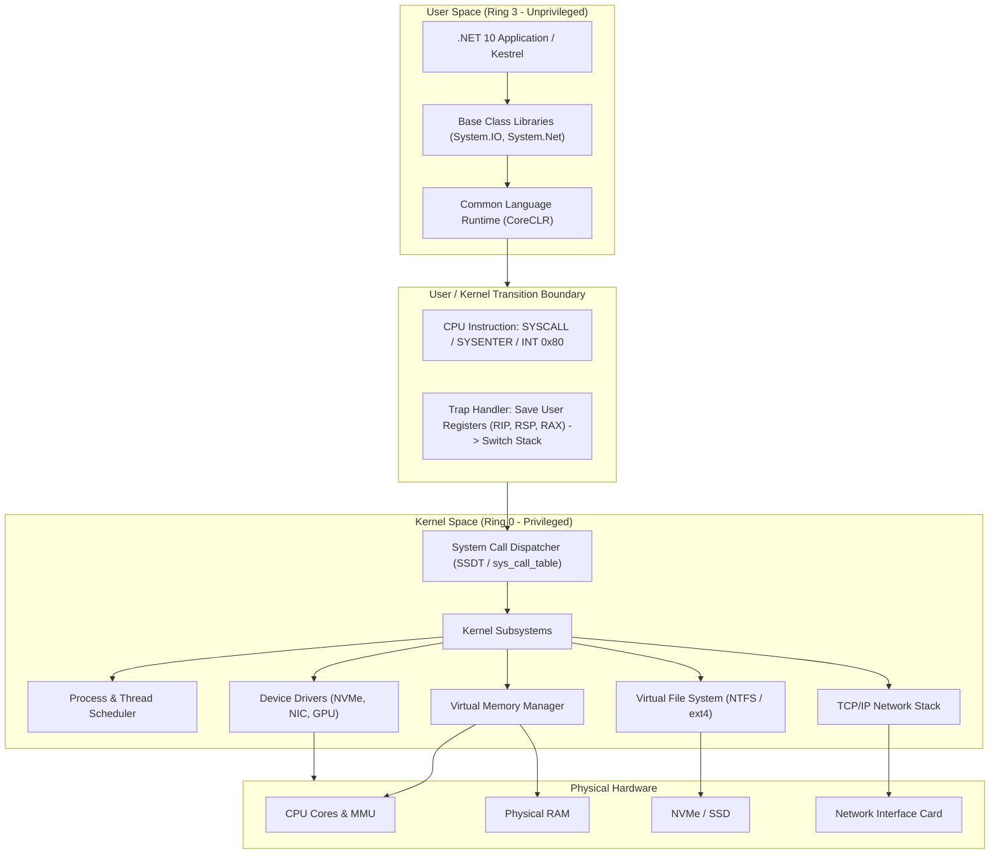

### CPU Privilege Rings & Dual-Mode Operation

Modern CPUs enforce hardware-level privilege separation through execution rings (typically Ring 0 through Ring 3 on x86/x64 architectures):

| Privilege Level | Execution Mode | Permissions | Managed Code / OS Component |
| :--- | :--- | :--- | :--- |
| **Ring 0** | **Kernel Mode / Supervisor** | Unrestricted access to hardware, all CPU instructions (e.g., `HLT`, `LIDT`, `MOV CR3`), unrestricted physical memory access. | OS Kernel, Device Drivers, CoreCLR native runtime hooks when calling kernel APIs. |
| **Ring 1 & 2** | **Device / Hypervisor Mode** | Historically designated for device drivers or hypervisors; rarely used in modern monolithic OS kernels (Windows and Linux only use Ring 0 and Ring 3). | Virtualization hypervisors (Type-1 / KVM / Hyper-V). |
| **Ring 3** | **User Mode** | Restricted instruction set. Memory access constrained strictly to the process's assigned virtual address space. Direct hardware access triggers an invalid opcode or General Protection Fault (`#GP`). | .NET Managed Applications, ASP.NET Core, Nginx, PostgreSQL, CLR JIT-compiled IL code. |

```text
┌──────────────────────────────────────────────────────────────────────────┐
│                            Ring 3: User Space                            │
│  [ ASP.NET Core Web API ]   [ Worker Services ]   [ CoreCLR Managed Heap ]│
│  ──────────────────────────────────────────────────────────────────────  │
│                            Ring 1 & 2: (Unused)                          │
│  ──────────────────────────────────────────────────────────────────────  │
│                            Ring 0: Kernel Space                          │
│  [ Thread Scheduler ] [ Virtual Memory / Paging ] [ Drivers ] [ IOCP ]   │
└──────────────────────────────────────────────────────────────────────────┘
```

### The System Call (Syscall) Lifecycle

When user code requires an OS resource (allocating committed memory, reading a file from NVMe, or establishing a TCP connection), it must transition across the user-kernel boundary via a **System Call**.

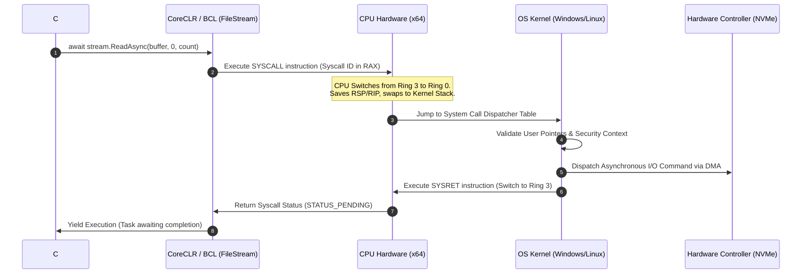

#### Low-Level Syscall Mechanics

1. **Parameter Marshaling**: Arguments are placed in specific CPU registers (x64 Windows uses `RCX`, `RDX`, `R8`, `R9`; Linux x86-64 uses `RDI`, `RSI`, `RDX`, `R10`, `R8`, `R9`). The Syscall Number is loaded into `RAX`.
2. **Instruction Invocation**: The CPU executes the `SYSCALL` (x64) or `SYSENTER` (x86) instruction. The CPU hardware:
   - Sets the instruction pointer (`RIP`) to the kernel entry point stored in the `IA32_LSTAR` Model-Specific Register (MSR).
   - Switches the stack pointer (`RSP`) to the kernel-mode stack.
   - Clears the interrupt flag and elevates the privilege level to Ring 0.
3. **Dispatching**: The kernel reads `RAX` and queries the **System Service Descriptor Table (SSDT)** on Windows or `sys_call_table` on Linux.
4. **Execution & Return**: The kernel executes the driver/subsystem code, loads the return status into `RAX`, and invokes `SYSRET` / `SYSEXIT` to restore user-mode registers and lower the CPU privilege back to Ring 3.

### How .NET 10 Maps to Native OS System Calls

```csharp
// High-Level .NET Managed Code to Low-Level Kernel Syscall Mapping
using System.Runtime.InteropServices;

public static class SyscallInspection
{
    public static async Task ExecuteSyscallDemonstrationAsync()
    {
        // 1. Memory Allocation:
        // CoreCLR calls VirtualAlloc (Windows) or mmap (Linux)
        byte[] buffer = new byte[4096];

        // 2. File I/O Syscall:
        // Windows: NtCreateFile -> NtReadFile -> IOCP notification
        // Linux: openat -> pread64 / io_uring_enter
        await using var fileStream = new FileStream(
            "telemetry.log",
            FileMode.OpenOrCreate,
            FileAccess.ReadWrite,
            FileShare.None,
            bufferSize: 4096,
            useAsync: true);

        // 3. Socket / Network Syscall:
        // Windows: WSASocketW -> WSARecv (Overlapped)
        // Linux: socket -> epoll_ctl -> epoll_wait -> sys_recvmsg
        using var client = new HttpClient();
        var response = await client.GetStringAsync("https://api.github.com");
    }
}
```

---

## 2. ⚙️ Processes: Architecture, Lifecycle, PCB, and Context Switching

A **Process** is an instance of an executing program in its own isolated virtual address space. It owns system resources, security descriptors, environment variables, handle tables, and at least one execution thread (the main thread).

```mermaid
flowchart TD
    subgraph ProcessStructure ["Anatomy of a Running Process"]
        subgraph AddressSpace ["Virtual Address Space (4GB on 32-bit / 128TB on 64-bit)"]
            CodeSeg["Text / Code Segment (Read-Only)"]
            DataSeg["Data Segment (Initialized Global/Static vars)"]
            BSSSeg["BSS Segment (Uninitialized Static vars)"]
            HeapSeg["Managed Heap (CoreCLR Gen0/1/2/LOH/POH)"]
            StackSeg1["Thread 1 User Stack (1 MB)"]
            StackSeg2["Thread 2 User Stack (1 MB)"]
        end

        subgraph PCB ["Process Control Block (PCB / EPROCESS)"]
            PID["Process Identifier (PID)"]
            State["Current State (Ready/Running/Waiting)"]
            Context["CPU Register Context (RIP, RSP, RAX...)"]
            MMU_Info["Memory Info (CR3 Register / Page Directory)"]
            Handles["Handle Table (Open Files, Sockets, Mutexes)"]
            Security["Security Token (User SID, Privileges)"]
        end
    end

    PCB -.-> AddressSpace
```

### Process Creation: POSIX vs Windows

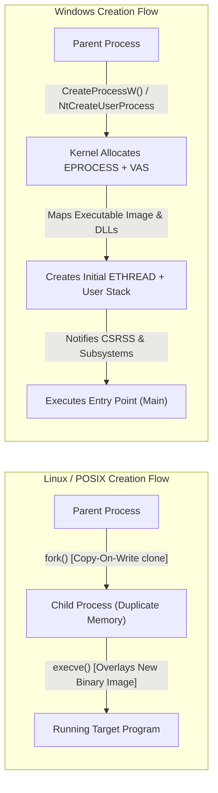

1. **POSIX (`fork` + `exec`)**:
   - `fork()` clones the parent process via **Copy-On-Write (COW)**. Pages are marked read-only; physical pages are only duplicated when either process writes to them.
   - `execve()` replaces the virtual address space with a new executable binary, resetting the stack and heap while retaining inherited file descriptors.
2. **Windows (`CreateProcess`)**:
   - Monolithic creation model. Allocates the kernel `EPROCESS` block, creates a clean virtual address space, loads the Portable Executable (PE) headers, initializes DLL dependencies, creates the initial thread (`ETHREAD`), and starts execution at the entry point.
3. **.NET `Process.Start`**:
   - Internally invokes `CreateProcessW` on Windows or `fork()`/`execve()` (via `posix_spawn`) on Linux/Unix systems.

### Process State Machine

An operating system process traverses distinct lifecycle states managed by the kernel scheduler:

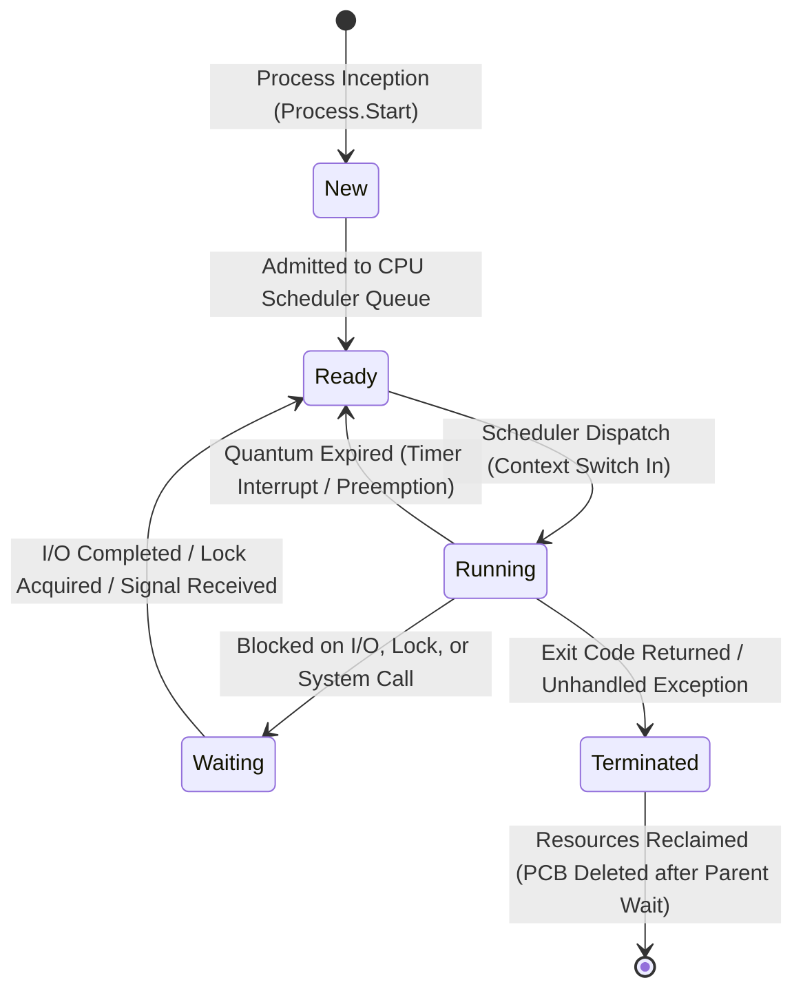

| Process State | Description | CPU Execution Status | Next Possible States |
| :--- | :--- | :--- | :--- |
| **New** | Process is being instantiated; PCB allocated, address space mapped. | Not executing | `Ready` |
| **Ready** | Resides in the scheduler's run queue, ready to execute as soon as a CPU core is allocated. | Waiting for CPU core | `Running` |
| **Running** | Actively executing instructions on a physical/logical CPU core. | Executing in User/Kernel mode | `Ready` (preemption), `Waiting` (I/O), `Terminated` |
| **Waiting (Blocked)** | Suspended awaiting an asynchronous event (file I/O, network packet, lock release, hardware timer). | Not consuming CPU | `Ready` |
| **Terminated (Zombie)** | Execution completed; memory freed, but PCB remains until parent process reads exit code via `waitpid()`. | Dead | `[*] Reclaimed` |

### Context Switching: Costs and Hidden Mechanics

A **Context Switch** is the computational procedure of saving the execution state of the currently executing process/thread and restoring the state of another thread.

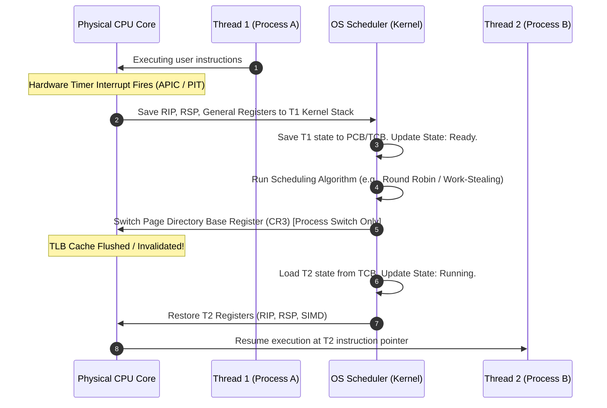

#### The True Cost of Context Switching

| Cost Category | Mechanism | Latency Impact |
| :--- | :--- | :--- |
| **Direct Overhead** | Saving/restoring ~30+ CPU registers, swapping kernel stacks, executing kernel scheduler logic. | ~1.0 – 3.0 microseconds ($\mu s$). |
| **TLB Invalidation** | Switching `CR3` (Page Directory) invalidates the Translation Lookaside Buffer. Subsequent memory reads cause hardware page table walks. | ~50 – 200 nanoseconds per memory access. |
| **CPU Cache Pollution** | Thread B replaces Thread A's data in L1/L2/L3 hardware caches. When Thread A resumes, it incurs cold cache misses. | Tens of thousands of CPU cycles wasted reloading cache lines from main RAM. |
| **Pipeline Stalls** | Instruction pipelines are flushed due to the branch target change. | Complete CPU pipeline reset (~15-20 cycles). |

> [!WARNING]
> High thread contention in .NET (e.g., spawning 1,000 raw `Thread` instances performing synchronous blocking operations) degrades throughput primarily due to **CPU cache thrashing and context-switch overhead**, consuming up to 80% of total CPU cycles solely in the kernel scheduler.

---

## 3. 🧵 Threads: Models, Thread Pools, and the .NET Execution Engine

A **Thread** is the smallest unit of execution scheduled by the OS kernel. While a process owns the address space and resources, all threads within a process share the same virtual address space, heap, file handles, and static variables, but retain their own **private call stack** and **CPU register context**.

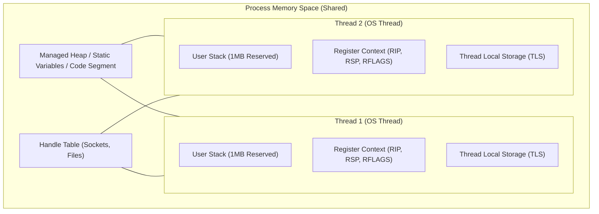

### Threading Models: 1:1, 1:N, and M:N

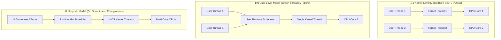

| Metric | 1:1 Kernel Model (.NET Standard) | 1:N User Model (Fibers) | M:N Model (Go / Erlang) |
| :--- | :--- | :--- | :--- |
| **Context Switch Cost** | Moderate (Traverses Kernel Boundary, ~1–3 $\mu s$). | Ultra-fast (User space only, ~10–50 $ns$). | Fast (User space multiplexing). |
| **True Parallelism** | **Yes** (OS schedules threads across distinct CPU cores). | **No** (Single kernel thread bound to 1 core). | **Yes** (M user threads mapped onto N OS threads). |
| **Blocking Syscall Behavior** | Only the calling thread blocks; other threads continue running. | **Entire process blocks** unless wrapped in non-blocking I/O. | Runtime shifts blocked thread; other threads continue on worker threads. |
| **Memory Footprint** | ~1 MB reserved virtual memory stack per thread. | ~2–4 KB per stack. | ~2–8 KB per stack (resizable). |

### .NET Threading Abstractions: `Thread`, `Task`, and `ThreadPool`

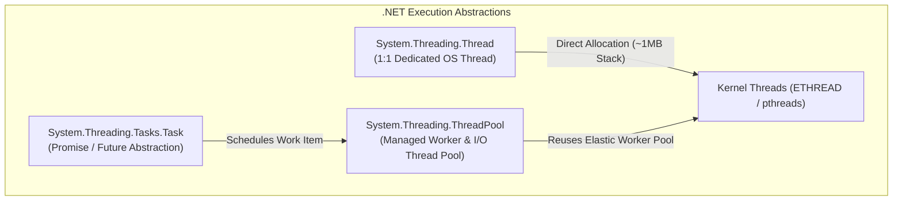

#### Why Raw `Thread` Instances Are Expensive in .NET

```csharp
// ANTI-PATTERN: Spawning raw threads in high-load backend services
public void BadConcurrencyPattern()
{
    for (int i = 0; i < 1000; i++)
    {
        // Allocates 1MB stack memory per thread = 1GB Virtual Memory!
        // Causes intense OS context-switch churn.
        var thread = new Thread(() => 
        {
            Thread.Sleep(5000); // Blocks kernel thread completely
        });
        thread.IsBackground = true;
        thread.Start();
    }
}

// PRODUCTION PATTERN: Task-based ThreadPool utilization
public async Task ProductionConcurrencyPatternAsync()
{
    var tasks = new List<Task>();
    for (int i = 0; i < 1000; i++)
    {
        // Zero dedicated OS threads created.
        // Uses managed ThreadPool workers and IOCP timers.
        tasks.Add(Task.Delay(5000));
    }
    await Task.WhenAll(tasks);
}
```

### Why `async` / `await` Does NOT Create New Threads

One of the most persistent misconceptions in modern software engineering is that `await Task.Delay()` or `await httpClient.GetAsync()` spawns a background thread to wait for the result. **It does not.**

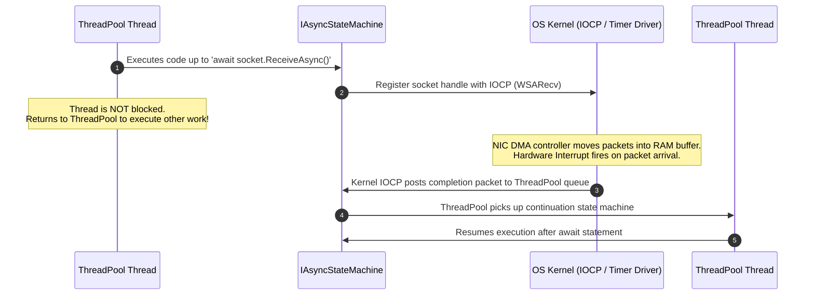

#### The Under-the-Hood State Machine

When you compile an `async` method, the Roslyn compiler transforms it into an `IAsyncStateMachine` struct:

```csharp
// Developer Written Code:
public async Task<int> FetchDataLengthAsync(string url)
{
    using var client = new HttpClient();
    string content = await client.GetStringAsync(url);
    return content.Length;
}

// Conceptual Roslyn Compiler Generated State Machine:
[StructLayout(LayoutKind.Auto)]
private struct FetchDataLengthStateMachine : IAsyncStateMachine
{
    public int State;
    public AsyncTaskMethodBuilder<int> Builder;
    public string Url;
    
    private HttpClient _client;
    private TaskAwaiter<string> _awaiter;

    public void MoveNext()
    {
        int num = State;
        try
        {
            if (num != 0)
            {
                _client = new HttpClient();
                _awaiter = _client.GetStringAsync(Url).GetAwaiter();
                
                if (!_awaiter.IsCompleted)
                {
                    State = 0; // Set state to resume point
                    // Wire continuation callback WITHOUT blocking any thread
                    Builder.AwaitUnsafeOnCompleted(ref _awaiter, ref this);
                    return; // THREAD EXITS AND RETURNS TO THREADPOOL!
                }
            }
            else
            {
                _awaiter = default;
                State = -1;
            }

            string result = _awaiter.GetResult();
            Builder.SetResult(result.Length);
        }
        catch (Exception ex)
        {
            State = -1;
            Builder.SetException(ex);
        }
        finally
        {
            _client?.Dispose();
        }
    }

    public void SetStateMachine(IAsyncStateMachine stateMachine) => 
        Builder.SetStateMachine(stateMachine);
}
```

> [!NOTE]
> During an asynchronous I/O operation (`await stream.ReadAsync()`), **zero CPU threads are executing or waiting for that operation**. The OS hardware controller (e.g., NVMe or NIC) performs the work via Direct Memory Access (DMA) and notifies the OS via a hardware interrupt.

---

## 4. 🔀 Concurrency vs Parallelism: Foundations and Performance Laws

While frequently conflated, **Concurrency** and **Parallelism** address fundamentally distinct dimensions of software architecture:

- **Concurrency is about structure and composition**: The composition of independently executing processes/tasks. It is about **dealing with** lots of things at once (e.g., handling 10,000 active web socket connections via asynchronous interleaving).
- **Parallelism is about simultaneous execution**: The simultaneous execution of multiple computations on multiple physical CPU cores. It is about **doing** lots of things at once (e.g., rendering video frames across 16 CPU cores).

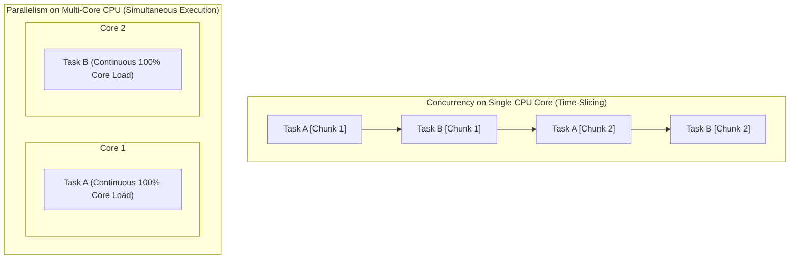

### Amdahl's Law vs Gustafson's Law

The theoretical speedup of an application when adding physical CPU cores is bounded by mathematical laws of scaling.

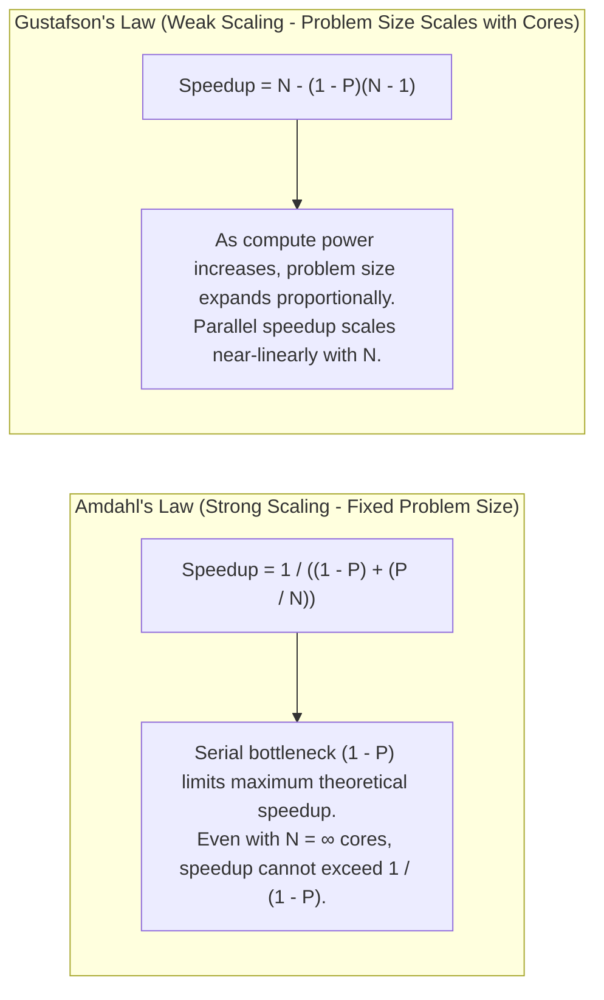

#### Amdahl's Law Formula

$$S_{\text{latency}}(s) = \frac{1}{(1 - p) + \frac{p}{s}}$$

Where:

- $p$ = The proportion of the program that can be parallelized ($0 \le p \le 1$).
- $(1 - p)$ = The strictly sequential (serial) fraction of the program (e.g., lock acquisition, database commit).
- $s$ = Number of physical CPU cores.

```text
┌────────────────────────────────────────────────────────────────────────────┐
│ If 90% of your C# algorithm is parallelizable (p = 0.90):                  │
│                                                                            │
│ Cores (s)       Theoretical Speedup (Amdahl's Law)                         │
│ 1 core   ─────> 1.0x                                                       │
│ 2 cores  ─────> 1.82x                                                      │
│ 4 cores  ─────> 3.08x                                                      │
│ 16 cores ─────> 6.40x                                                      │
│ 64 cores ─────> 8.77x                                                      │
│ ∞ cores  ─────> 10.0x  <── Strict Maximum Limit (1 / 0.10)                 │
└────────────────────────────────────────────────────────────────────────────┘
```

### Concurrency vs Parallelism in C# Code

```csharp
public class ConcurrencyVsParallelism
{
    // CONCURRENCY: 1-2 ThreadPool threads handle 500 concurrent I/O requests
    public async Task ConcurrentNetworkFetchAsync(IEnumerable<string> urls)
    {
        using var client = new HttpClient();
        
        // Concurrency achieved via Task interleaving without thread multiplication
        var downloadTasks = urls.Select(async url => 
        {
            var data = await client.GetByteArrayAsync(url);
            return data.Length;
        });

        int[] lengths = await Task.WhenAll(downloadTasks);
        Console.WriteLine($"Fetched {lengths.Length} payloads concurrently.");
    }

    // PARALLELISM: Saturates all available physical CPU cores for heavy computation
    public void ParallelMatrixComputation(double[][] matrixA, double[][] matrixB, double[][] result)
    {
        int rows = matrixA.Length;
        int cols = matrixB[0].Length;
        int common = matrixA[0].Length;

        // Parallel.For automatically partitions iterations across all CPU cores
        Parallel.For(0, rows, new ParallelOptions { MaxDegreeOfParallelism = Environment.ProcessorCount }, i =>
        {
            for (int j = 0; j < cols; j++)
            {
                double sum = 0;
                for (int k = 0; k < common; k++)
                {
                    sum += matrixA[i][k] * matrixB[k][j];
                }
                result[i][j] = sum;
            }
        });
    }
}
```

---

## 5. 🔒 Synchronization: Race Conditions, Critical Sections & Primitives

When multiple threads concurrently read and write shared memory without synchronization, non-deterministic bugs arise due to **Race Conditions**, **Out-of-Order CPU Instruction Execution**, and **CPU Cache Inconsistency (MESI protocol)**.

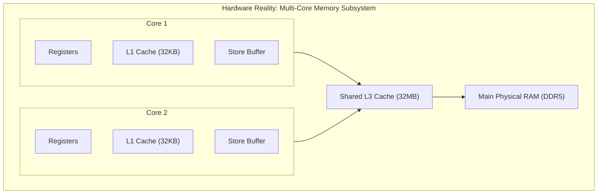

### The Critical Section Problem

A **Critical Section** is a segment of code accessing shared resources that must not be concurrently executed by more than one thread. Any valid synchronization solution must satisfy three criteria:

1. **Mutual Exclusion**: If thread $T_1$ is executing in its critical section, no other threads can execute in that critical section.
2. **Progress**: If no thread is executing in the critical section and some threads wish to enter, only those threads not in their remainder section can participate in deciding who enters next.
3. **Bounded Waiting**: There must be a bound on the number of times other threads are allowed to enter their critical sections after a thread has requested entry, preventing starvation.

### Synchronization Primitives Hierarchy

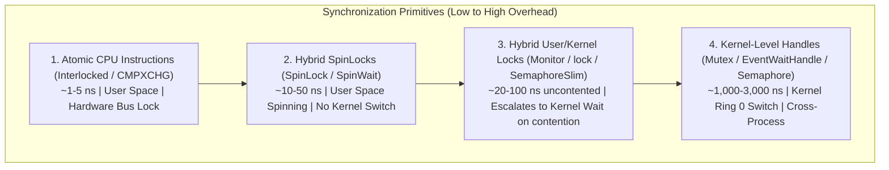

| Primitive | Synchronization Scope | Kernel Transition? | Async Compatible? | Ideal Use Case |
| :--- | :--- | :--- | :--- | :--- |
| **`Interlocked`** | Intra-process (CPU register) | **No** (Direct CPU Instruction) | **Yes** (Non-blocking) | High-performance counters, lock-free queues, atomic flags. |
| **`SpinLock`** | Intra-process (Thread) | **No** (Spins in User Mode) | **No** (Blocks thread) | Ultra-short critical sections (< 100 CPU cycles), non-allocating structs. |
| **`lock` (`Monitor`)** | Intra-process (Thread) | **Hybrid** (Spins briefly, then escalates to OS wait event) | **No** (Cannot `await` inside `lock`) | Standard thread-safety for in-memory object graphs. |
| **`SemaphoreSlim`** | Intra-process (Counting) | **Hybrid** (User-mode fast path + kernel event) | **Yes** (`WaitAsync()`) | Rate-limiting async operations, throttling database connections. |
| **`Mutex`** | **Cross-process / OS-wide** | **Yes** (Always transitions to Ring 0) | **No** (Blocks thread) | Single-instance application enforcement across OS processes. |
| **`ReaderWriterLockSlim`** | Intra-process (Multiple R / Single W) | **Hybrid** | **No** (Blocks thread) | High read-to-write ratio in-memory caches. |

### Deep Dive: How C# `lock` Statement Works Internally

In .NET, every heap-allocated object has an **Object Header** (located 8 bytes prior to the MethodTable pointer on x64). The Object Header stores a 32-bit integer called the **SyncBlockIndex**.

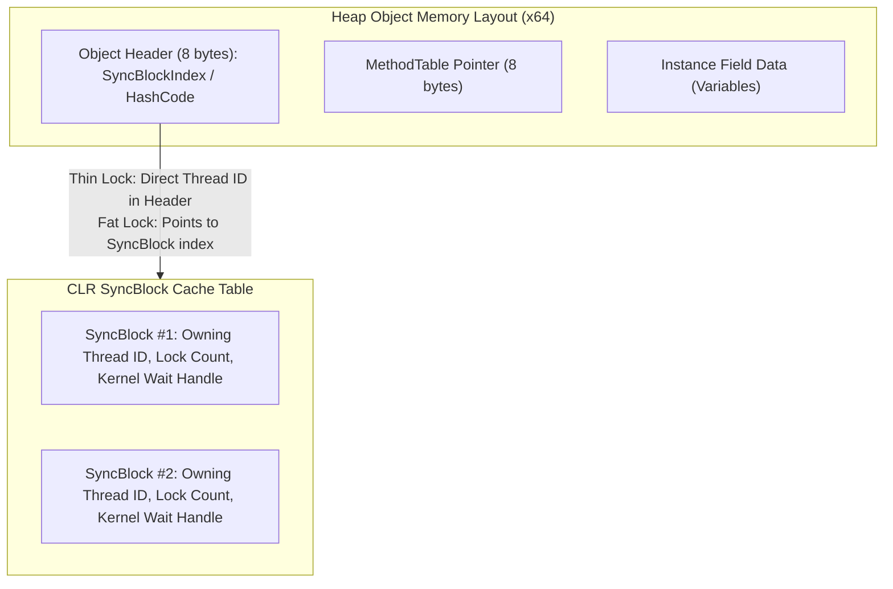

1. **Thin Lock Phase**: When a thread first enters `lock(obj)`, the CLR atomically compares and exchanges the object header bits with the current thread ID (zero allocation, no kernel transition).
2. **Fat Lock Escalation**: If multiple threads contend for the lock, the CLR allocates a full `SyncBlock` from the CLR SyncBlock Table, associates the object header with the SyncBlock index, and transitions contending threads into kernel-mode wait states (`AutoResetEvent`).

```csharp
// Developer Written C# Code:
public class BankAccount
{
    private readonly object _syncRoot = new();
    private decimal _balance;

    public void Deposit(decimal amount)
    {
        lock (_syncRoot)
        {
            _balance += amount;
        }
    }
}

// Equivalent Roslyn Compiler Lowered IL Code:
public void LoweredDeposit(decimal amount)
{
    bool lockTaken = false;
    object obj = _syncRoot;
    try
    {
        // Monitor.Enter atomically performs thin-lock check and registers ownership
        Monitor.Enter(obj, ref lockTaken);
        _balance += amount;
    }
    finally
    {
        if (lockTaken)
        {
            Monitor.Exit(obj);
        }
    }
}
```

### High-Performance Lock-Free Programming with `Interlocked`

Atomic instructions execute in hardware via the x86 `LOCK` bus prefix or ARM Load-Linked/Store-Conditional (`LDREX`/`STREX`), guaranteeing that read-modify-write operations occur without thread interruption:

```csharp
public class LockFreeStack<T>
{
    private class Node
    {
        public T Value;
        public Node Next;
    }

    private Node _head;

    public void Push(T item)
    {
        var newNode = new Node { Value = item };
        SpinWait spin = new();
        
        while (true)
        {
            Node currentHead = _head;
            newNode.Next = currentHead;

            // Atomic Compare-And-Swap (CAS) mapped to CPU CMPXCHG instruction:
            // If _head still equals currentHead, update _head to newNode and return currentHead.
            if (Interlocked.CompareExchange(ref _head, newNode, currentHead) == currentHead)
            {
                return; // Successfully pushed without locks!
            }

            spin.SpinOnce(); // Backoff strategy to prevent CPU bus saturation
        }
    }
}
```

---

## 6. 🛑 Deadlocks: The Coffman Conditions, Prevention, and Diagnostics

A **Deadlock** is a state where a set of concurrent threads or processes are permanently blocked because each thread holds a resource that another thread needs, and none can proceed.

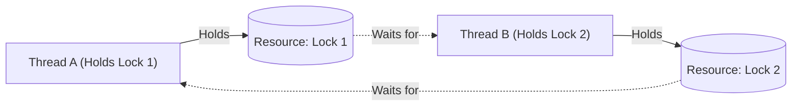

### The 4 Coffman Conditions

A deadlock can occur **if and only if** all four of the following conditions hold simultaneously:

```text
┌────────────────────────────────────────────────────────────────────────────────────────┐
│                                 THE 4 COFFMAN CONDITIONS                               │
├──────────────────────┬─────────────────────────────────────────────────────────────────┤
│ 1. Mutual Exclusion  │ At least one resource must be held in a non-shareable mode.     │
│ 2. Hold and Wait     │ A thread holds ≥1 resource while waiting to acquire others.     │
│ 3. No Preemption     │ Resources cannot be forcibly seized; only released voluntarily. │
│ 4. Circular Wait     │ A closed chain: T1 waits for T2, T2 waits for T3 ... Tn waits   │
│                      │ for T1.                                                         │
└──────────────────────┴─────────────────────────────────────────────────────────────────┘
```

### Deadlock Handling Strategies

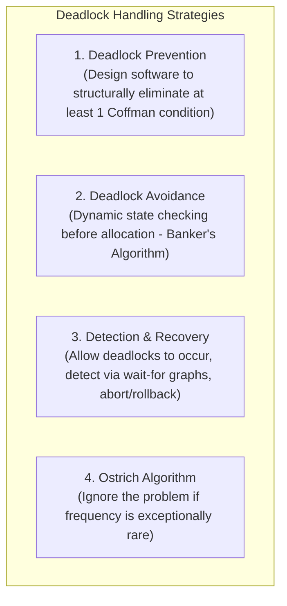

#### Breaking Coffman Conditions in .NET

1. **Eliminate Circular Wait via Strict Global Lock Ordering**:
   - Always acquire locks in a globally defined, consistent hierarchical order (e.g., sort by Resource ID or memory address before locking).
2. **Eliminate Hold and Wait**:
   - Acquire all required resources simultaneously via a composite lock or allocate resources upfront.
3. **Eliminate No Preemption via Timeouts**:
   - Never wait indefinitely for a lock. Use timeout-based acquisition with `Monitor.TryEnter` or `SemaphoreSlim.WaitAsync(TimeSpan)`.

```csharp
// PRODUCTION PATTERN: Deadlock-Free Lock Ordering Strategy
public class AccountTransferService
{
    public void Transfer(Account from, Account to, decimal amount)
    {
        // Break Circular Wait: Determine strict acquisition order using Unique ID
        Account firstLock = from.Id < to.Id ? from : to;
        Account secondLock = from.Id < to.Id ? to : from;

        lock (firstLock)
        {
            lock (secondLock)
            {
                from.Debit(amount);
                to.Credit(amount);
            }
        }
    }

    // Break No-Preemption: Timeout-based Acquisition
    public async Task<bool> TryTransferWithTimeoutAsync(
        SemaphoreSlim lockA, 
        SemaphoreSlim lockB, 
        CancellationToken ct)
    {
        TimeSpan timeout = TimeSpan.FromSeconds(5);

        // Attempt acquiring lock A with timeout
        if (!await lockA.WaitAsync(timeout, ct))
            return false;

        try
        {
            // Attempt acquiring lock B with timeout
            if (!await lockB.WaitAsync(timeout, ct))
                return false; // Backoff and release lockA in finally block

            try
            {
                // Perform critical operations
                return true;
            }
            finally
            {
                lockB.Release();
            }
        }
        finally
        {
            lockA.Release();
        }
    }
}
```

### The Infamous .NET Async-Over-Sync Deadlock

In legacy ASP.NET (System.Web) or UI frameworks (WPF/WinForms) possessing a single-threaded `SynchronizationContext`, calling `.Result` or `.Wait()` on an uncompleted Task causes an immediate, unrecoverable deadlock:

```csharp
// DEADLOCK SCENARIO (Legacy ASP.NET / WPF):
public ActionResult GetData()
{
    // Deadlock! UI/Request thread blocks synchronously waiting for Task to finish.
    // When HttpClient completes, it posts its continuation to the SynchronizationContext.
    // But the SynchronizationContext thread is blocked waiting at .Result!
    string json = FetchDataFromApiAsync().Result; 
    return Content(json);
}

private async Task<string> FetchDataFromApiAsync()
{
    using var client = new HttpClient();
    // Awaited task attempts to post continuation back to the blocked request thread
    var response = await client.GetStringAsync("https://api.example.com");
    return response;
}
```

---

## 7. ⏱️ CPU Scheduling Algorithms & .NET ThreadPool Internals

The OS **CPU Scheduler** decides which thread in the `Ready` queue is assigned to an available CPU core when a scheduling event occurs (quantum expiration, I/O block, process yield).

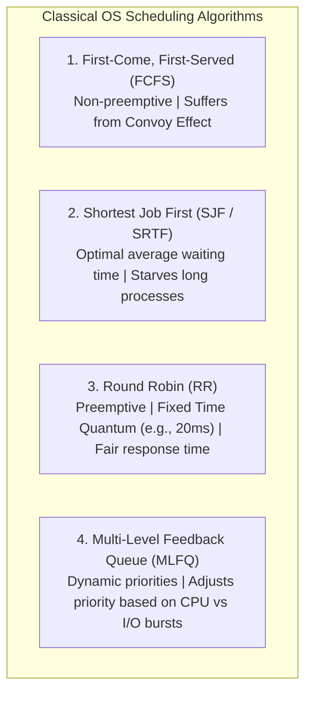

### Comparative Summary of Scheduling Algorithms

| Algorithm | Preemptive? | Throughput | Response Time | Starvation Risk? | Primary Bottleneck |
| :--- | :--- | :--- | :--- | :--- | :--- |
| **FCFS** | No | Low | Poor | No | **Convoy Effect**: Short processes queue behind massive CPU-bound jobs. |
| **SJF / SRTF** | Both | High | High | **Yes** | Requires clairvoyance of future CPU burst duration. |
| **Round Robin** | Yes | Moderate | **Optimal** | No | Quantum tuning: Too small $\to$ context switch storm; too large $\to$ degrades to FCFS. |
| **MLFQ** | Yes | **High** | **Optimal** | Solved via Aging | Complex priority decay tuning. |

### Deep Dive: .NET ThreadPool Scheduling Engine

The .NET CLR ThreadPool is not a simplistic single FIFO queue; it is an ultra-optimized, two-tier scheduling engine built with **Work-Stealing Queues** and the **Hill-Climbing Algorithm**.

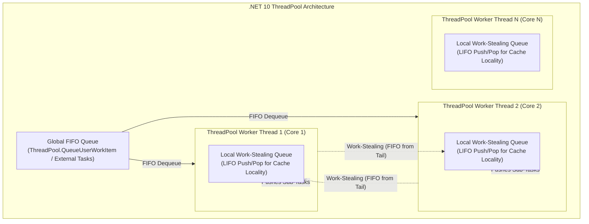

#### 1. Dual-Queue Architecture & Work-Stealing

- **Global Queue (FIFO)**: Work queued from non-ThreadPool threads (or via `ThreadPool.QueueUserWorkItem`) enters the global queue, protected by a global lock.
- **Local Queues (LIFO for Owner, FIFO for Thieves)**: Each worker thread owns a dedicated local queue. When a running task spawns sub-tasks (`Task.Run` or nested async calls), they are pushed to the thread's local queue.
  - **LIFO for the Owner**: The owning thread pops its own most recently pushed tasks (LIFO) to maximize **L1/L2 CPU cache hotness**.
  - **FIFO for Thieves**: When an idle worker thread runs out of work, it steals tasks from the **tail (oldest items)** of another thread's local queue (FIFO), minimizing contention with the owner thread.

#### 2. The Hill-Climbing Heuristic

The .NET ThreadPool dynamically calculates the optimal number of active worker threads using a mathematical feedback loop called **Hill Climbing**:

- It monitors system throughput (measured in task completions per millisecond).
- Periodically, it injects or retires threads and observes if throughput increases or decreases.
- If adding a thread increases throughput, it continues adding threads until throughput plateaus or drops (detecting CPU saturation and context-switch churn).
- **Starvation Mitigation**: If worker threads are blocked by synchronous code (`Thread.Sleep` or synchronous file reads), the ThreadPool injects roughly 1-2 new threads every 500ms to unblock the pipeline.

---

## 8. 💾 Memory Management: Virtual Memory, Paging, TLB & .NET GC

Operating systems provide processes with **Virtual Memory**, decoupling application memory addressing from physical DRAM chips.

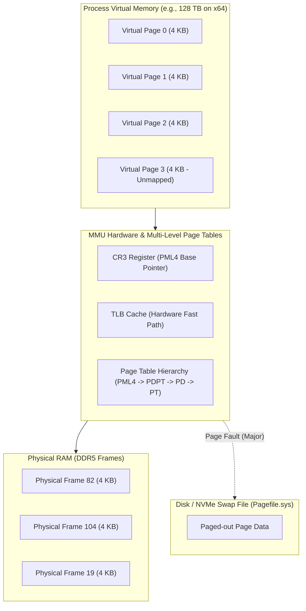

### Multi-Level Page Tables & The TLB

On x86-64 architectures, virtual addresses are translated into physical addresses using 4-level (or 5-level) page table paging:

```text
64-Bit Virtual Address Breakdown (4-Level Paging with 4KB Pages):
┌──────────┬──────────────┬──────────────┬──────────────┬──────────────┬──────────────┐
│ Sign Ext │ PML4 Index   │ PDPT Index   │ PD Index     │ PT Index     │ Page Offset  │
│ (16 bits)│ (9 bits)     │ (9 bits)     │ (9 bits)     │ (9 bits)     │ (12 bits)    │
└──────────┴──────────────┴──────────────┴──────────────┴──────────────┴──────────────┘
```

1. **Hardware MMU Translation**:
   - The CPU's Memory Management Unit (MMU) extracts indices to traverse: `PML4` $\to$ `Page Directory Pointer Table` $\to$ `Page Directory` $\to$ `Page Table` $\to$ `Physical Frame Number (PFN)`.
   - The 12-bit offset is added to the PFN to pinpoint the exact physical byte in RAM.
2. **Translation Lookaside Buffer (TLB)**:
   - Traversing 4 levels of page tables for every single memory read would quadruple memory access latency.
   - The **TLB** is a high-speed, on-chip associative hardware cache that stores recent Virtual-to-Physical page translations (~0.5 - 1 ns lookup).
   - **TLB Miss**: Causes a hardware page table walk (10–50 ns).

### Page Faults: Minor vs Major

```mermaid
flowchart TD
    Access["CPU Accesses Virtual Address"] --> InTLB{"Is translation in TLB?"}
    InTLB -- Yes --> DirectAccess["Instant Physical RAM Access (~1ns)"]
    InTLB -- No --> PageTableWalk["Walk Page Tables"]
    
    PageTableWalk --> IsValid{"Present Bit == 1?"}
    IsValid -- Yes --> CacheTLB["Populate TLB -> Read RAM (~15ns)"]
    IsValid -- No --> PageFault["Hardware Interrupt: Page Fault (#PF)"]
    
    PageFault --> FaultType{"Page in RAM Standby / Zero List?"}
    FaultType -- Minor Fault --> MapPage["Allocate Frame & Update Page Table (Microseconds)"]
    FaultType -- Major Fault --> ReadDisk["Read Page from NVMe/SSD Swap File (Milliseconds - 10,000x Slower!)"]
```

### How Virtual Memory Connects to .NET Garbage Collection

The .NET Garbage Collector (GC) manages heap memory by interacting directly with the OS Virtual Memory Manager via `VirtualAlloc` (Windows) or `mmap` (Linux).

```mermaid
flowchart TD
    subgraph OS_VirtualAlloc ["OS Virtual Memory Allocator"]
        Reserved["1. MEM_RESERVE: Allocates Virtual Address Space Range (No physical RAM assigned)"]
        Committed["2. MEM_COMMIT: Binds Physical RAM Pages / Pagefile backing to reserved range"]
    end

    subgraph DotNetGCHeap [".NET 10 Managed Heap Segments"]
        SOH["Small Object Heap (SOH)<br/>Gen 0 (Allocations) -> Gen 1 (Survivors) -> Gen 2 (Long-Lived)"]
        LOH["Large Object Heap (LOH)<br/>Objects >= 85,000 bytes (Not compacted by default)"]
        POH["Pinned Object Heap (POH)<br/>Fixed address objects for native interop (No GC movement)"]
    end

    Reserved --> DotNetGCHeap
    Committed --> DotNetGCHeap
```

#### GC Memory Management Under the Hood

| GC Subsystem | OS Memory Interaction | Low-Level Mechanism |
| :--- | :--- | :--- |
| **Segment Allocation** | `VirtualAlloc(MEM_RESERVE)` | Reserves large contiguous address ranges (e.g., 256MB–1GB) without consuming physical RAM. |
| **Commit on Demand** | `VirtualAlloc(MEM_COMMIT)` | Commits pages in 4KB/64KB chunks as application objects are instantiated. |
| **Card Table & Write Barrier** | JIT-Injected Bitmap | The CLR maintains a byte-array **Card Table** where 1 byte represents a 512-byte range of heap. When an object reference is modified, the JIT injects a **Write Barrier** instruction to mark the card dirty, enabling Gen 2 collections to scan only modified ranges rather than the entire heap. |
| **Decommit & Trim** | `VirtualAlloc(MEM_DECOMMIT)` | After a Gen 2 sweep, unoccupied pages are decommitted to return physical memory frames to the OS working set. |

```csharp
// Diagnostic Inspection of Process Memory Metrics
using System.Diagnostics;

public class MemoryDiagnostics
{
    public static void LogMemoryMetrics()
    {
        using var currentProcess = Process.GetCurrentProcess();
        currentProcess.Refresh();

        // Working Set = Physical RAM pages currently resident in hardware frames
        long workingSet = currentProcess.WorkingSet64;
        
        // Private Memory = Committed virtual memory private to this process (RAM + Swap)
        long privateBytes = currentProcess.PrivateMemorySize64;
        
        // GC Total Memory = Active managed objects on the GC heap
        long gcHeapBytes = GC.GetTotalMemory(forceFullCollection: false);

        Console.WriteLine($"Working Set (Physical RAM): {workingSet / (1024 * 1024)} MB");
        Console.WriteLine($"Private Committed Bytes:    {privateBytes / (1024 * 1024)} MB");
        Console.WriteLine($"GC Managed Heap:            {gcHeapBytes / (1024 * 1024)} MB");
    }
}
```

---

## 9. ⚡ File Systems & I/O: Async I/O, Interrupts, IOCP & Web Server Scale

Traditional synchronous I/O forces CPU execution threads into a kernel `WAITING` state, idling while mechanical or solid-state storage completes physical sector reads. High-performance .NET servers achieve astronomical scale via **Hardware Interrupts, Direct Memory Access (DMA), and I/O Completion Ports (IOCP)**.

```mermaid
flowchart TD
    subgraph SyncIO ["Synchronous I/O (Thread-Per-Connection)"]
        T_Sync["OS Thread"] -->|"ReadFile() Syscall"| K_Sync["Kernel Blocks Thread"]
        K_Sync -->|"Wait 10ms for Disk"| D_Sync["Disk Reads Data"]
        D_Sync -->|"Wakeup Thread"| T_Sync
        Note1["10,000 Connections = 10,000 Threads = System Crash!"]
    end

    subgraph AsyncIOCP ["Asynchronous IOCP (Zero Thread Blocking)"]
        T_Async["Worker Thread"] -->|"WSARecv() / ReadFile(Overlapped)"| K_Async["Kernel Initiates DMA Transfer"]
        K_Async -->|"Thread Immediately Free!"| T_Async
        HW_NIC["NIC / NVMe DMA"] -->|"Transfers Packets to RAM"| RAM["RAM Buffer"]
        HW_NIC -->|"Hardware Interrupt (IRQ)"| CPU_ISR["Interrupt Service Routine"]
        CPU_ISR -->|"Posts Completion Packet"| IOCP_Queue["Kernel IOCP Queue"]
        IOCP_Queue -->|"Dispatches to ThreadPool Worker"| T_Worker["Any Free ThreadPool Worker"]
    end
```

### Windows I/O Completion Ports (IOCP) vs Linux `io_uring`

```mermaid
flowchart LR
    subgraph WindowsIOCP ["Windows Architecture: IOCP"]
        W_Handle["Socket / File Handle"] -->|"Bind to Port"| IOCP_Kernel["Kernel Completion Port"]
        ThreadPoolThreads["ThreadPool Worker Threads"] -->|"GetQueuedCompletionStatus()"| IOCP_Kernel
    end

    subgraph LinuxIOUring ["Linux Architecture: io_uring"]
        AppSpace["Application Space"]
        KernelSpace["Kernel Space"]
        SQ["Submission Queue (Lockless Ring Buffer in Shared Memory)"]
        CQ["Completion Queue (Lockless Ring Buffer in Shared Memory)"]
        
        AppSpace -->|"Writes SQE (No Syscall!)"| SQ
        KernelSpace -->|"Consumes SQE & Executes"| SQ
        KernelSpace -->|"Writes CQE Result"| CQ
        AppSpace -->|"Reads CQE (No Syscall!)"| CQ
    end
```

| Dimension | Windows I/O Completion Ports (IOCP) | Linux `epoll` | Linux `io_uring` (Modern Kernel $\ge 5.1$) |
| :--- | :--- | :--- | :--- |
| **Paradigm** | **Completion Model** (Notifies when I/O data is already in user buffer). | **Readiness Model** (Notifies when socket is ready to read/write). | **True Async Completion Model** (Shared ring buffers). |
| **Syscall Overhead** | 1 syscall to initiate (`WSARecv`), 0 syscalls for thread pool dequeue. | Requires `epoll_wait` followed by `read()` / `write()` syscalls. | **Zero Syscall Mode** via kernel polling thread (`IORING_SETUP_SQPOLL`). |
| **Kernel Boundary Crossings** | Minimal. | Moderate (Syscall required per ready descriptor). | Virtually eliminated for high-throughput batching. |
| **.NET Integration** | Native IOCP thread pool binding. | System.Net epoll event loop multiplexer. | Available via native transport pipelines in ASP.NET Core (.NET 8/9/10). |

### Why Async I/O is Critical for Web Servers (The C10K / C10M Problem)

```text
┌────────────────────────────────────────────────────────────────────────────┐
│                    THE C100K PROBLEM: 100,000 ACTIVE CLIENTS               │
├────────────────────────────────────────────────────────────────────────────┤
│ 1. Synchronous Blocking Model:                                             │
│    - 100,000 OS Threads Required                                          │
│    - Memory Cost: 100,000 * 1 MB Stack = ~100 GB RAM purely for stacks!    │
│    - Context Switching: CPU spends 99% of cycles in scheduler thrashing.   │
│    - Result: Server crashes with OutOfMemoryException or 100% CPU lock.    │
├────────────────────────────────────────────────────────────────────────────┤
│ 2. Asynchronous Non-Blocking IOCP Model (Kestrel / ASP.NET Core):          │
│    - 100,000 Open TCP Sockets bound to IOCP kernel queue                   │
│    - Thread Count: Exactly Environment.ProcessorCount (e.g., 16-32 threads)│
│    - Memory Cost: ~4 KB per socket buffer = ~400 MB RAM                    │
│    - Context Switching: Minimal. CPU runs at 100% pure application logic.  │
│    - Result: Millions of requests/second throughput with sub-ms latency.   │
└────────────────────────────────────────────────────────────────────────────┘
```

---

## 10. 🎯 Senior .NET Technical Interview Mastery & Diagnostic Guide

### High-Yield Technical Interview Questions & Answers

#### Q1: What happens at the CPU and OS level when a thread context switch occurs?

**Senior Answer:**
When the hardware timer interrupt fires, the CPU transitions from Ring 3 to Ring 0. The kernel trap handler saves the current thread's instruction pointer (`RIP`), stack pointer (`RSP`), and general-purpose registers onto its kernel-mode stack and updates its Thread Control Block (TCB). The scheduler selects the next thread.

If the new thread belongs to a different process, the CPU switches the `CR3` register (Page Directory Base), which **flushes the TLB cache**. The CPU then loads the target thread's saved register context, swaps the stack pointer, and executes `SYSRET` to resume execution in Ring 3. The primary performance penalty is indirect: **TLB cache misses and CPU L1/L2/L3 cache pollution**.

#### Q2: What is the exact difference between `Thread.Sleep(0)`, `Thread.Yield()`, and `Task.Delay()`?

**Senior Answer:**

- `Thread.Sleep(0)`: Relinquishes the remainder of the current thread's time slice to any `Ready` thread of **equal or higher priority**. If no equal/higher priority thread exists, execution resumes immediately without yielding.
- `Thread.Yield()`: Relinquishes execution to any `Ready` thread **scheduled on the current processor core**, regardless of priority.
- `Task.Delay(ms)`: **Does not block any thread**. It registers an asynchronous timer with the runtime timer queue (managed by the OS timer wheel / IOCP). The calling thread returns immediately to the ThreadPool. When the timer expires, a ThreadPool worker resumes the continuation state machine.

#### Q3: How does the .NET CLR implement the `lock` statement, and what is thin lock vs fat lock escalation?

**Senior Answer:**
The `lock(obj)` statement compiles to `Monitor.Enter(obj, ref lockTaken)` wrapped in a `try/finally` with `Monitor.Exit(obj)`. The CLR uses the target object's **Object Header** (8 bytes preceding the MethodTable).

- In the **Thin Lock** phase, the CLR uses an atomic Compare-And-Swap (`Interlocked.CompareExchange`) to place the current thread ID directly into the object header without allocating kernel objects.
- If another thread contends for the lock, the lock escalates to a **Fat Lock**: the CLR allocates a `SyncBlock` from the CLR SyncBlock table, stores its index in the object header, and associates an OS kernel event (`AutoResetEvent`), transitioning contending threads into a kernel wait state.

#### Q4: Explain the difference between VirtualAlloc `MEM_RESERVE` and `MEM_COMMIT`, and how .NET GC utilizes them.

**Senior Answer:**
`MEM_RESERVE` reserves a contiguous range of the process's 128TB virtual address space without allocating physical RAM or swap file space. `MEM_COMMIT` allocates physical memory pages (or pagefile backing) to the reserved virtual pages.

The .NET GC uses `MEM_RESERVE` to claim large segment blocks (e.g., 256MB to several gigabytes) upfront to guarantee contiguous address space for the Managed Heap, and uses `MEM_COMMIT` incrementally on-demand as applications allocate objects in Gen 0/LOH. During GC trimming, it calls `MEM_DECOMMIT` to return unused physical RAM to the OS working set while preserving the virtual address space layout.

---

### Production Diagnostics CLI Cheat Sheet

When diagnosing OS-level bottlenecks, lock contention, or thread pool starvation in production .NET systems, use these specialized diagnostic tools:

```bash
# 1. Capture Process Memory Dump on Crash / Deadlock
dotnet-dump collect --process-id <PID> --type Full --output /dumps/deadlock.dmp

# 2. Analyze Dump with SOS Debugger Extensions
dotnet-dump analyze /dumps/deadlock.dmp

# Inside SOS Debugger:
# View all threads and their execution states
> threads

# Inspect SyncBlocks to identify which thread holds a contested lock
> syncblk

# Print managed stack trace of the deadlocked thread
> clrstack -all

# 3. Real-Time Lock Contention & ThreadPool Starvation Tracing
dotnet-trace collect --process-id <PID> --providers Microsoft-Windows-DotNETRuntime:0x4c14f:5

# 4. Monitor OS Working Set vs Committed Bytes in Real-Time
dotnet-counters monitor System.Runtime --process-id <PID>
```

---

## 11. 🧭 Learning Roadmap & References

- **Next CS Fundamentals Modules**:
  - [01 - Big-O Notation & Complexity Analysis](./01-big-o-notation-and-complexity-analysis.md)
  - [02 - Arrays, Strings, and Hash Tables](./02-arrays-strings-and-hash-tables.md)
  - [03 - Linked Lists, Stacks, and Queues](./03-linked-lists-stacks-and-queues.md)
- **Classic Academic Texts**:
  - *Operating System Concepts* (Silberschatz, Galvin, Gagne - "The Dinosaur Book")
  - *Modern Operating Systems* (Andrew S. Tanenbaum)
  - *Windows Internals, Part 1 & Part 2* (Pavel Yosifovich, Mark Russinovich, David Solomon)
- **.NET Runtime Architecture**:
  - *Pro .NET Memory Management* (Konrad Kokosa)
  - *CLR via C#* (Jeffrey Richter)
