# 11 - Top 30 CS Fundamentals Interview Questions (.NET Senior Edition)

Technical interviewers evaluating mid-level .NET engineers (2–4 years experience) for Senior and Lead roles look beyond syntax fluency. They assess **systems thinking**, **algorithmic intuition**, **memory architecture awareness**, and the ability to articulate **engineering trade-offs** under pressure.

This guide compiles the top 30 Computer Science fundamentals interview questions divided into three distinct tiers: **🟢 Easy Fundamentals (1–10)**, **🟡 Medium Depth (11–20)**, and **🔴 Advanced & Systems Architecture (21–30)**. Every answer is structured with core principles, mathematical complexities, .NET runtime internals, architectural diagrams, and production-ready C# code.

---

## 📚 Question Navigation Matrix

| # | Question Title | Tier | Core CS Domain | Primary .NET / Systems Focus |
| :- | :--- | :--- | :--- | :--- |
| **01** | [Array vs Linked List](#1-what-is-the-difference-between-an-array-and-a-linked-list) | 🟢 Easy | Data Structures | Cache Locality, `Span<T>`, `List<T>` |
| **02** | [Hash Table & Collision Resolution](#2-what-is-a-hash-table-and-how-does-it-handle-collisions) | 🟢 Easy | Data Structures | Chaining vs Open Addressing, `Dictionary<TKey, TValue>` |
| **03** | [Stack vs Queue](#3-what-is-the-difference-between-a-stack-and-a-queue) | 🟢 Easy | Data Structures | LIFO vs FIFO, Circular Buffers, Work Queues |
| **04** | [Big-O Notation & O(n log n)](#4-explain-big-o-notation-what-is-on-log-n) | 🟢 Easy | Complexity Analysis | Asymptotic Bounds, Divide & Conquer |
| **05** | [Binary Search Tree](#5-what-is-a-binary-search-tree) | 🟢 Easy | Trees & Graphs | Invariant Property, Self-Balancing Trees |
| **06** | [BFS vs DFS](#6-what-is-the-difference-between-bfs-and-dfs) | 🟢 Easy | Algorithms | Traversal Order, Queue vs Stack, Shortest Path |
| **07** | [4 Pillars of OOP](#7-what-are-the-4-pillars-of-oop) | 🟢 Easy | Software Design | Polymorphism, VTables, Composition over Inheritance |
| **08** | [Process vs Thread](#8-what-is-the-difference-between-a-process-and-a-thread) | 🟢 Easy | Operating Systems | Virtual Address Space, Stack vs Heap, Context Switches |
| **09** | [Deadlock Fundamentals](#9-what-is-a-deadlock) | 🟢 Easy | Concurrency | Lock Ordering, Sync-over-Async, Synchronization |
| **10** | [Merge Sort vs Quick Sort](#10-what-is-the-difference-between-merge-sort-and-quick-sort) | 🟢 Easy | Sorting Algorithms | Stability, Space Complexity, .NET Introsort |
| **11** | [Hash Map O(1) Lookup & Degradation](#11-how-does-a-hash-map-achieve-o1-lookup-when-does-it-degrade) | 🟡 Medium | Data Structures | Hash DoS, Load Factors, .NET `Marvin32` |
| **12** | [Dynamic Programming vs Recursion](#12-explain-dynamic-programming-how-is-it-different-from-recursion) | 🟡 Medium | Algorithms | Memoization vs Tabulation, State Compression |
| **13** | [Heap & Priority Queue](#13-what-is-a-heap-and-how-is-it-used-as-a-priority-queue) | 🟡 Medium | Data Structures | Complete Binary Tree, Array Indexing, `PriorityQueue<T, P>` |
| **14** | [Topological Sort & Dependency Resolution](#14-what-is-topological-sort-and-when-would-you-use-it) | 🟡 Medium | Graph Algorithms | Kahn's Algorithm, Cycle Detection, DI Containers |
| **15** | [SOLID Principles with Examples](#15-explain-the-solid-principles-with-examples) | 🟡 Medium | Software Architecture | Clean Code, LSP, Interface Segregation |
| **16** | [Concurrency vs Parallelism](#16-what-is-the-difference-between-concurrency-and-parallelism) | 🟡 Medium | Concurrency | Async/Await, Non-blocking I/O, SIMD, PLINQ |
| **17** | [Virtual Memory Architecture](#17-how-does-virtual-memory-work) | 🟡 Medium | Operating Systems | Paging, MMU, TLB, Page Faults, Working Set |
| **18** | [Amortized Complexity Analysis](#18-what-is-amortized-analysis-give-an-example) | 🟡 Medium | Complexity Analysis | Aggregate/Potential Method, `List<T>` Geometric Growth |
| **19** | [Adjacency Matrix vs Adjacency List](#19-compare-adjacency-matrix-vs-adjacency-list-for-graph-representation) | 🟡 Medium | Graph Theory | Density Trade-offs, Sparse Graphs, Memory Bounds |
| **20** | [Trie (Prefix Tree) Data Structure](#20-what-is-a-trie-when-would-you-use-one) | 🟡 Medium | Data Structures | Autocomplete, String Search, Radix Trees |
| **21** | [Dijkstra's Shortest Path & Limitations](#21-explain-dijkstras-algorithm-what-are-its-limitations) | 🔴 Advanced | Graph Algorithms | Greedy Relaxation, Negative Weight Cycles, A* Search |
| **22** | [Coffman Conditions for Deadlock](#22-what-are-the-4-conditions-for-deadlock-coffman-conditions) | 🔴 Advanced | Operating Systems | Prevention, Avoidance, Lock Hierarchies |
| **23** | [Stable vs Unstable Sorting & Impact](#23-compare-stable-vs-unstable-sorting-algorithms-why-does-stability-matter) | 🔴 Advanced | Sorting Algorithms | Multi-key Sorts, LINQ `OrderBy().ThenBy()` |
| **24** | [0/1 Knapsack Problem & DP Optimization](#24-explain-the-knapsack-problem-and-its-dp-solution) | 🔴 Advanced | Algorithms | 2D State Table, 1D In-Place Memory Optimization |
| **25** | [CPU Cache Locality & Performance](#25-how-does-cpu-cache-locality-affect-algorithm-performance) | 🔴 Advanced | Computer Architecture | Cache Lines, False Sharing, Row vs Column Major |
| **26** | [Tail Recursion & .NET RyuJIT TCO](#26-what-is-tail-recursion-does-c-support-tail-call-optimization) | 🔴 Advanced | Compilers & Runtimes | Stack Frames, IL `tail.`, RyuJIT Constraints |
| **27** | [Prim's vs Kruskal's MST Algorithms](#27-explain-the-difference-between-prims-and-kruskals-mst-algorithms) | 🔴 Advanced | Graph Algorithms | Union-Find (DSU), Path Compression, Greedy Choice |
| **28** | [.NET ThreadPool Hill Climbing Scheduler](#28-how-does-the-net-threadpool-scheduler-decide-thread-allocation) | 🔴 Advanced | .NET Runtime | Work-Stealing, Starvation, IOCP vs Worker Threads |
| **29** | [O(n) Heap Construction Proof](#29-what-is-the-time-complexity-of-building-a-heap-prove-why-its-on-not-on-log-n) | 🔴 Advanced | Mathematical Proofs | Floyd's Heapify, Arithmetico-Geometric Series |
| **30** | [LRU Cache O(1) Design & Implementation](#30-design-a-lru-cache-with-o1-get-and-put-operations) | 🔴 Advanced | System Design / Data Structures | Hash Table + Doubly Linked List, Eviction Policy |

---

## 🟢 Easy Fundamentals (Questions 1–10)

### 1. What is the difference between an Array and a Linked List?

#### Conceptual Foundation

An **Array** is a collection of contiguous memory blocks holding elements of homogeneous type. A **Linked List** is a linear collection of independent nodes allocated non-contiguously on the managed heap, where each node stores data and a reference pointer (`Next`/`Prev`) to adjacent nodes.

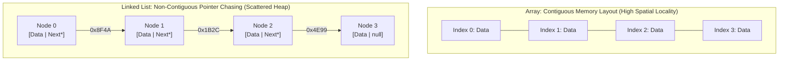

#### Time & Space Complexity Comparison

| Operation | Array (`T[]`) | Singly Linked List | Doubly Linked List (`LinkedList<T>`) |
| :--- | :--- | :--- | :--- |
| **Random Access (`Get[i]`)** | $O(1)$ (Direct pointer offset) | $O(n)$ (Sequential traversal) | $O(n)$ (Sequential traversal) |
| **Insert / Delete at Head** | $O(n)$ (Shift elements) | $O(1)$ | $O(1)$ |
| **Insert / Delete at Tail** | $O(1)$ amortized (if capacity exists) | $O(n)$ without tail pointer; $O(1)$ with tail | $O(1)$ |
| **Insert / Delete at Index $k$** | $O(n)$ (Shifting remaining elements) | $O(n)$ (Traverse to $k$) | $O(n)$ (Traverse to $k$) |
| **Memory Overhead** | $0$ auxiliary bytes per element | 8 bytes pointer (64-bit) per node | 16 bytes pointers (`Next` + `Prev`) + object header |
| **CPU Cache Locality** | **Optimal**: Sequential cache line prefetching | **Poor**: Pointer chasing incurs L1/L2/L3 cache misses | **Poor**: High GC memory fragmentation |

#### .NET Runtime Perspective

In .NET, arrays (`T[]`) are zero-indexed, type-safe, contiguous objects allocated directly on the Managed Heap (or on the stack via `stackalloc Span<T>`). Iterating an array takes advantage of hardware L1/L2 CPU cache prefetching because elements reside in sequential 64-byte cache lines. In contrast, `LinkedList<T>` allocates a `LinkedListNode<T>` object for every single element, introducing 24 bytes of object header/pointer overhead per entry on 64-bit runtimes and putting significant pressure on the Garbage Collector (GC).

```csharp
// High-performance contiguous stack allocation in C#
Span<int> stackArray = stackalloc int[4] { 10, 20, 30, 40 };

// Standard .NET Generic Collections
List<int> dynamicArray = new() { 10, 20, 30, 40 }; // Backed by contiguous T[]
LinkedList<int> linkedList = new();
linkedList.AddLast(10);
linkedList.AddLast(20);
```

---

### 2. What is a Hash Table and how does it handle collisions?

#### Conceptual Foundation

A **Hash Table** is an associative data structure that maps keys to values using a mathematical **Hash Function** $h(k) \pmod M$ to compute an index into an array of buckets, targeting $O(1)$ average time complexity for lookups, insertions, and deletions.

A **Collision** occurs when two distinct keys $k_1 \neq k_2$ produce identical bucket indices: $h(k_1) \pmod M = h(k_2) \pmod M$.

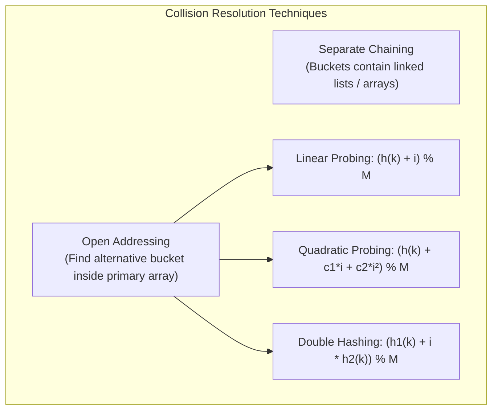

#### Collision Resolution Strategies

1. **Separate Chaining**: Each bucket maintains a linked list, balanced tree, or secondary array of entries that share the same hash index.
   - *Pros*: Simple deletion; degrades gracefully under high load factors ($\alpha > 1$).
   - *Cons*: Additional pointer memory; pointer chasing degrades cache locality.
2. **Open Addressing**: All elements reside directly within the bucket array. When a collision occurs, alternative slots are probed:
   - **Linear Probing**: Inspects index $(h(k) + i) \pmod M$. Prone to *primary clustering* (long contiguous occupied blocks).
   - **Quadratic Probing**: Inspects index $(h(k) + c_1 i + c_2 i^2) \pmod M$. Eliminates primary clustering; susceptible to *secondary clustering*.
   - **Double Hashing**: Inspects index $(h_1(k) + i \cdot h_2(k)) \pmod M$. Minimizes clustering across all open addressing strategies.

#### .NET Runtime Implementation: `Dictionary<TKey, TValue>`

In .NET Core / .NET 5+, `Dictionary<TKey, TValue>` uses a **hybrid chaining without node allocation** approach. It maintains two contiguous internal arrays:

1. `int[] _buckets`: Stores 1-based indices pointing to the first entry in each bucket chain.
2. `Entry[] _entries`: A compact contiguous array of structs (`struct Entry { uint hashCode; int next; TKey key; TValue value; }`).

Collisions are chained via the `next` integer index inside `_entries`. This eliminates individual heap node allocations and provides superior CPU cache performance.

---

### 3. What is the difference between a Stack and a Queue?

#### Conceptual Foundation

- **Stack**: A **LIFO** (Last-In, First-Out) data structure. The last element pushed is the first element popped.
- **Queue**: A **FIFO** (First-In, First-Out) data structure. The first element enqueued is the first element dequeued.

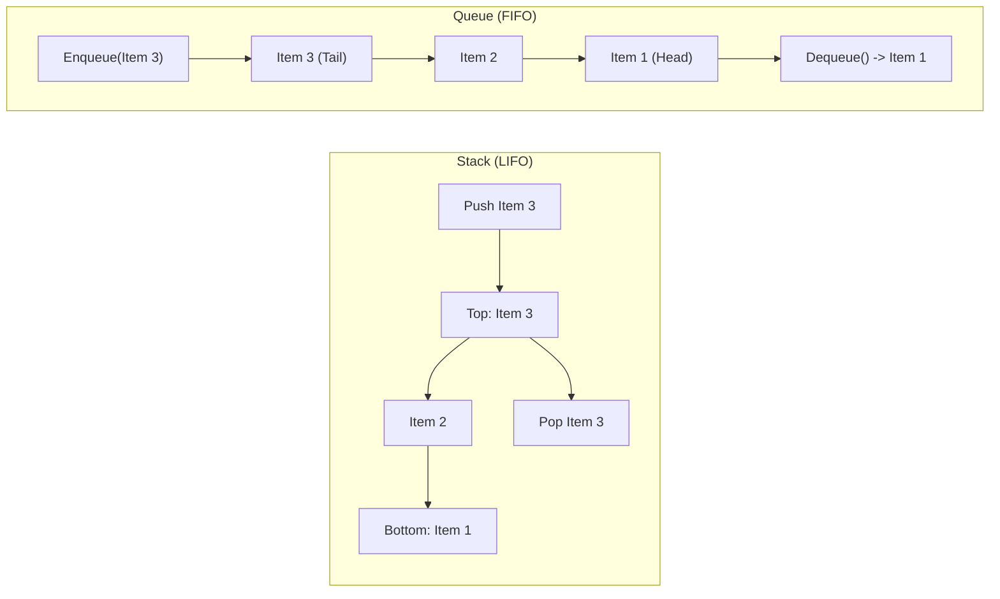

#### Comparison Matrix

| Dimension | Stack (`Stack<T>`) | Queue (`Queue<T>`) |
| :--- | :--- | :--- |
| **Order of Access** | LIFO (Last-In, First-Out) | FIFO (First-In, First-Out) |
| **Primary Operations** | `Push(item)`, `Pop()`, `Peek()` ($O(1)$) | `Enqueue(item)`, `Dequeue()`, `Peek()` ($O(1)$) |
| **Internal .NET Implementation** | Flat dynamically resizing `T[]` array. | Array-based **Circular Buffer** (`T[]` with `_head` and `_tail` indices). |
| **Classic Applications** | Undo/Redo operations, Expression parsing, Call stack execution, DFS. | Asynchronous message queues, ThreadPool work dispatching, BFS, Rate limiting. |

```csharp
// Balanced Parentheses Validation using Stack<T>
public static bool IsValidParentheses(string s)
{
    var stack = new Stack<char>();
    foreach (char c in s)
    {
        if (c is '(' or '{' or '[') stack.Push(c);
        else if (stack.Count == 0) return false;
        else if (c == ')' && stack.Pop() != '(') return false;
        else if (c == '}' && stack.Pop() != '{') return false;
        else if (c == ']' && stack.Pop() != '[') return false;
    }
    return stack.Count == 0;
}
```

---

### 4. Explain Big-O notation. What is O(n log n)?

#### Conceptual Foundation

**Big-O notation** ($O(g(n))$) characterizes the asymptotic **upper bound** of an algorithm's execution time or memory space as the input size $n$ approaches infinity. It formalizes the worst-case performance guarantee independent of CPU clock speeds, compiler optimizations, or hardware architectures.

$$\exists c > 0, n_0 > 0 \quad \text{such that} \quad 0 \le f(n) \le c \cdot g(n) \quad \forall n \ge n_0$$

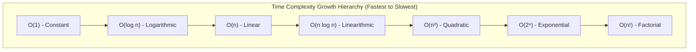

#### What is $O(n \log n)$?

$O(n \log n)$ (Linearithmic time) represents algorithms that combine linear work with logarithmic tree depth, typically via **Divide and Conquer**:

1. **Divide**: A problem of size $n$ is partitioned into balanced subproblems of size $n/2$ ($\log_2 n$ recursive levels).
2. **Conquer / Combine**: At each of the $\log_2 n$ levels, every element is inspected or merged once, requiring $O(n)$ work per level.

Total Operations: $\text{Depth} \times \text{Work per level} = \log_2 n \times O(n) = O(n \log n)$.

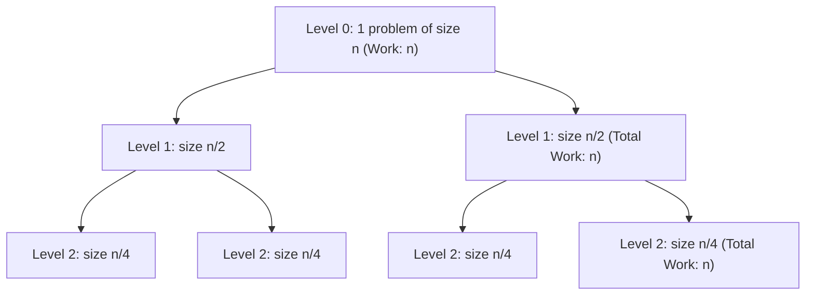

> [!NOTE]
> **Information-Theoretic Lower Bound**: Any comparison-based sorting algorithm requires at least $\Omega(n \log n)$ comparisons in the worst case because sorting $n$ elements corresponds to distinguishing between $n!$ possible permutations: $\log_2(n!) \approx n \log_2 n - n \log_2 e = \Omega(n \log n)$ (by Stirling's approximation).

---

### 5. What is a Binary Search Tree?

#### Conceptual Foundation

A **Binary Search Tree (BST)** is a node-based binary tree data structure with the **BST Invariant Property**:

- For every node $X$, all keys in its left subtree are strictly **less than** $X.\text{Key}$ ($\text{Left.Key} < X.\text{Key}$).
- All keys in its right subtree are strictly **greater than** $X.\text{Key}$ ($\text{Right.Key} > X.\text{Key}$).
- Both left and right subtrees must also be valid Binary Search Trees.

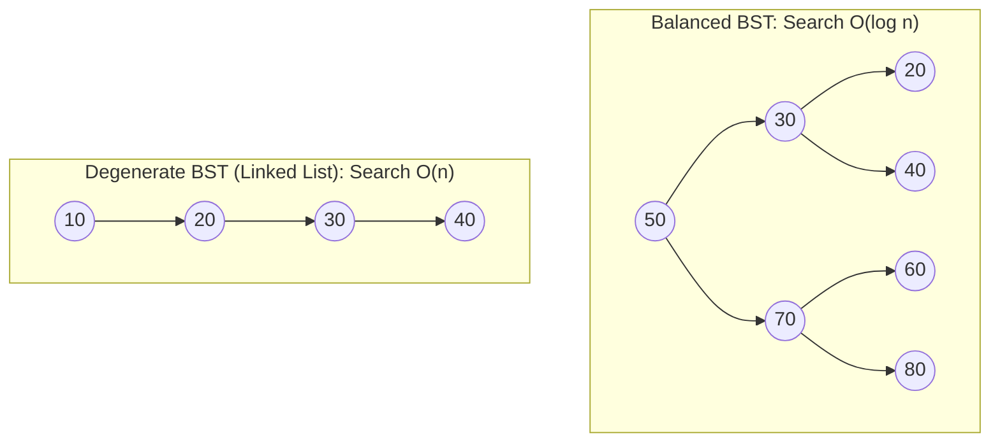

#### Time Complexity: Balanced vs Degenerate

| Operation | Average Case (Balanced BST) | Worst Case (Degenerate BST) | Self-Balancing Guarantee (AVL / Red-Black) |
| :--- | :--- | :--- | :--- |
| **Search** | $O(\log n)$ | $O(n)$ | $O(\log n)$ |
| **Insert** | $O(\log n)$ | $O(n)$ | $O(\log n)$ |
| **Delete** | $O(\log n)$ | $O(n)$ | $O(\log n)$ |
| **In-Order Traversal** | $O(n)$ (Yields sorted order) | $O(n)$ (Yields sorted order) | $O(n)$ |

In .NET, `SortedDictionary<TKey, TValue>` and `SortedSet<T>` are implemented as **Red-Black Trees**, guaranteeing worst-case $O(\log n)$ operations by enforcing structural balance constraints during insertions and deletions.

---

### 6. What is the difference between BFS and DFS?

#### Conceptual Foundation

**Breadth-First Search (BFS)** and **Depth-First Search (DFS)** are foundational graph and tree traversal algorithms that explore nodes in fundamentally different orders.

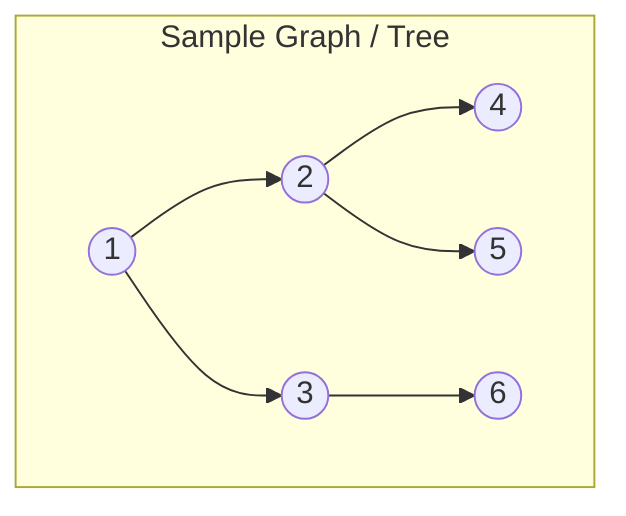

- **BFS Visit Sequence**: `1 -> 2 -> 3 -> 4 -> 5 -> 6` (Level by level).
- **DFS Visit Sequence**: `1 -> 2 -> 4 -> 5 -> 3 -> 6` (Branch by branch to leaf).

#### Comparison Matrix

| Dimension | Breadth-First Search (BFS) | Depth-First Search (DFS) |
| :--- | :--- | :--- |
| **Underlying Data Structure** | `Queue<T>` (FIFO) | `Stack<T>` (LIFO) or Recursion |
| **Time Complexity** | $O(V + E)$ for graphs; $O(n)$ for trees | $O(V + E)$ for graphs; $O(n)$ for trees |
| **Space Complexity** | $O(W)$ where $W$ is maximum width of graph | $O(H)$ where $H$ is maximum depth/height |
| **Shortest Path** | Guarantees **shortest path** on unweighted graphs. | Does **not** guarantee shortest path. |
| **Memory Footprint** | Can consume vast memory on wide graphs ($2^d$ nodes). | Memory-efficient on deep, narrow graphs ($O(d)$ stack). |
| **Typical Use Cases** | Shortest path, peer-to-peer discovery, garbage collection roots scanning. | Topological sorting, cycle detection, maze solving, connected components. |

```csharp
// Iterative BFS Traversal
public static void TraverseBFS(TreeNode root)
{
    if (root == null) return;
    var queue = new Queue<TreeNode>();
    queue.Enqueue(root);

    while (queue.Count > 0)
    {
        var current = queue.Dequeue();
        Console.Write($"{current.Val} ");
        if (current.Left != null) queue.Enqueue(current.Left);
        if (current.Right != null) queue.Enqueue(current.Right);
    }
}
```

---

### 7. What are the 4 pillars of OOP?

#### Conceptual Foundation

Object-Oriented Programming (OOP) is structured around 4 core principles:

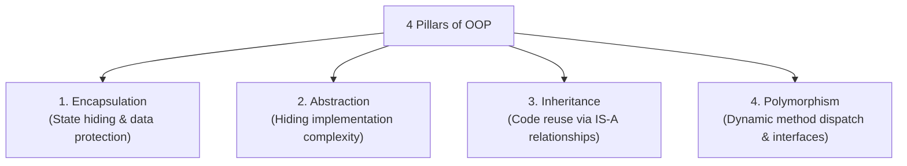

1. **Encapsulation**: Bundling state and behaviors within a single cohesive unit while restricting direct external access to internal representation (using access modifiers `private`, `protected`, `internal`).
2. **Abstraction**: Exposing only essential interface contracts while concealing low-level mechanics (e.g., using `interface` and `abstract class`).
3. **Inheritance**: Enabling a derived type to inherit fields, methods, and properties from a base class to foster code reuse.
4. **Polymorphism**: The ability of different types to respond to the same message/method call in distinct ways.
   - **Static (Compile-time)**: Method overloading, generic constraints, C# 11 static abstract interface methods.
   - **Dynamic (Runtime)**: Virtual method invocation dispatched via a Virtual Method Table (**VTable**).

```csharp
// Practical Clean Architecture OOP Example
public interface IPaymentGateway // Abstraction
{
    Task<PaymentResult> ProcessAsync(decimal amount);
}

public abstract class BasePaymentGateway : IPaymentGateway
{
    private readonly string _apiKey; // Encapsulation

    protected BasePaymentGateway(string apiKey) => _apiKey = apiKey;

    public abstract Task<PaymentResult> ProcessAsync(decimal amount); // Polymorphic contract
}

public class StripePaymentGateway : BasePaymentGateway // Inheritance
{
    public StripePaymentGateway(string apiKey) : base(apiKey) { }

    public override async Task<PaymentResult> ProcessAsync(decimal amount) // Dynamic Polymorphism
    {
        // Stripe-specific API execution
        return new PaymentResult(Success: true, TransactionId: Guid.NewGuid().ToString());
    }
}
```

---

### 8. What is the difference between a Process and a Thread?

#### Conceptual Foundation

- **Process**: An isolated execution environment created by the operating system. It possesses its own private **Virtual Address Space**, page tables, file descriptors, security context, and environment variables.
- **Thread**: The smallest schedulable unit of execution within a process. Multiple threads within the same process **share** the process's heap, static memory, and open file handles, but each maintains its own private **Call Stack**, Program Counter (PC), and CPU register state.

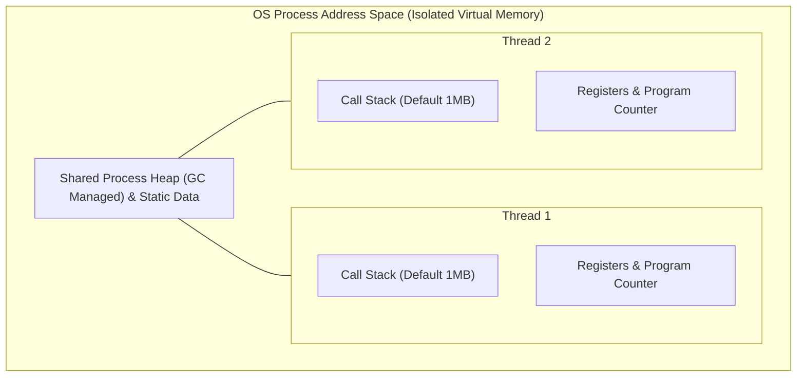

#### Comparison Matrix

| Metric | Process | Thread |
| :--- | :--- | :--- |
| **Address Space** | Completely isolated virtual address space. | Shares address space with peer threads in process. |
| **Communication (IPC)** | Slow IPC required (Named Pipes, Sockets, Shared Memory, gRPC). | Fast direct memory access (requires synchronization locks/atomics). |
| **Creation & Switch Cost** | Heavyweight ($O(\text{milliseconds})$), flushes Translation Lookaside Buffer (TLB). | Lightweight ($O(\text{microseconds})$), preserves shared cache and TLB pages. |
| **Failure Impact** | Process crash does not affect other processes. | Unhandled exception in one thread terminates entire host process. |
| **Default Stack Size** | N/A | Windows .NET: 1 MB default reserve per OS thread. |

---

### 9. What is a Deadlock?

#### Conceptual Foundation

A **Deadlock** is an execution state where two or more threads are permanently blocked because each holds a lock on a shared resource and is indefinitely waiting to acquire a lock held by another thread in the group.

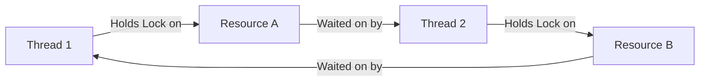

#### Deadlock in .NET: Classic Lock Ordering vs Sync-Over-Async

1. **Lock Ordering Deadlock**:
   - Thread 1 locks `LockA`, attempts to acquire `LockB`.
   - Thread 2 locks `LockB`, attempts to acquire `LockA`.
2. **Sync-Over-Async Deadlock**:
   - Calling `.Result` or `.Wait()` on an uncompleted `Task` from a thread governed by a single-threaded `SynchronizationContext` (e.g., WPF, WinForms, legacy ASP.NET). The asynchronous continuation cannot be dispatched back onto the blocked synchronization thread.

```csharp
// Deadlock Prevention via Global Lock Ordering
public class AccountTransferService
{
    private readonly object _lockA = new();
    private readonly object _lockB = new();

    public void SafeTransfer(int fromAccountId, int toAccountId, decimal amount)
    {
        // Enforce strict global lock acquisition ordering by Unique Identifier
        object firstLock = fromAccountId < toAccountId ? _lockA : _lockB;
        object secondLock = fromAccountId < toAccountId ? _lockB : _lockA;

        lock (firstLock)
        {
            lock (secondLock)
            {
                // Critical Section: Transfer funds safely without circular wait
            }
        }
    }
}
```

---

### 10. What is the difference between Merge Sort and Quick Sort?

#### Conceptual Foundation

Both **Merge Sort** and **Quick Sort** are classic $O(n \log n)$ divide-and-conquer sorting algorithms, but they differ fundamentally in where the computational heavy lifting occurs.

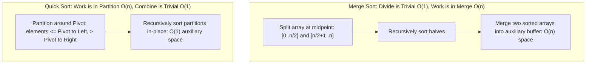

#### Comparison Matrix

| Metric | Merge Sort | Quick Sort |
| :--- | :--- | :--- |
| **Best Case Time** | $O(n \log n)$ | $O(n \log n)$ |
| **Average Case Time** | $O(n \log n)$ | $O(n \log n)$ |
| **Worst Case Time** | $O(n \log n)$ (Guaranteed) | $O(n^2)$ (When bad pivots produce unbalanced splits) |
| **Auxiliary Space** | $O(n)$ (Requires auxiliary buffer for merge) | $O(\log n)$ call stack (In-place data swap) |
| **Stability** | **Stable** (Preserves relative order of duplicates) | **Unstable** (Long-distance swaps break order) |
| **Cache Performance** | Moderate (Merges across different buffers) | **Superior** (Sequential in-place partition scanning) |

> [!TIP]
> **.NET `Array.Sort<T>()` Internals**: .NET uses **Introsort** (Introspective Sort)—a hybrid algorithm that begins with QuickSort, switches to HeapSort if the recursion depth exceeds $2 \log_2 n$ (preventing $O(n^2)$ worst-case degradation), and switches to InsertionSort for small sub-arrays ($n \le 16$).

---

## 🟡 Medium Depth (Questions 11–20)

### 11. How does a Hash Map achieve O(1) lookup? When does it degrade?

#### The Mathematics of $O(1)$ Lookup

A hash map achieves average $O(1)$ time complexity through direct array indexing:

1. **Hash Generation**: The key's 32-bit integer hash code is computed: $h = \text{key}.\text{GetHashCode}()$.
2. **Bucket Index Reduction**: The index is derived via modulo reduction over prime array length $M$: $\text{index} = (uint)h \pmod M$.
3. **Direct Memory Addressing**: Memory offset is calculated in constant CPU cycles: $\text{Address} = \text{Base} + (\text{index} \times \text{SizeOf}(\text{Bucket}))$.

Under the **Uniform Hashing Assumption** (keys are uniformly distributed across buckets) and a controlled **Load Factor** ($\alpha = \frac{N}{M} \le 0.75$), the average number of items inspected per lookup is $1 + \frac{\alpha}{2} = O(1)$.

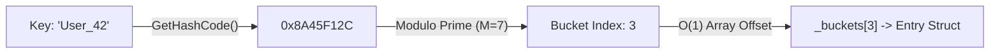

#### Failure Modes: Degradation to $O(n)$

1. **Hash Flooding DoS Attacks**: Malicious actors deliberately submit millions of distinct keys tailored to produce the exact same `GetHashCode()` value, collapsing the hash map into a single $O(n)$ linked list.
   - *.NET Defense*: In .NET Core / 6+, string hash codes are randomized per application domain using the `Marvin32` algorithm (`string.GetHashCode()` produces different values across separate process executions).
2. **Poor Custom Hash Code Implementation**: Returning a static constant (e.g., `public override int GetHashCode() => 42;`) forces all entries into bucket 0, causing $O(n)$ search and insertion times.
3. **Severe Memory Load Factor Degradation**: If rehashing/resizing fails or is suppressed, chaining depths grow proportionally with $N$.

---

### 12. Explain Dynamic Programming. How is it different from recursion?

#### Conceptual Foundation

**Dynamic Programming (DP)** is an algorithmic optimization technique for solving complex problems by decomposing them into smaller subproblems, solving each subproblem exactly once, and storing their solutions to eliminate redundant computations.

A problem can be solved using Dynamic Programming if and only if it exhibits two properties:

1. **Optimal Substructure**: An optimal solution to the global problem contains within it optimal solutions to its subproblems.
2. **Overlapping Subproblems**: The recursive solution solves the exact same subproblems repeatedly.

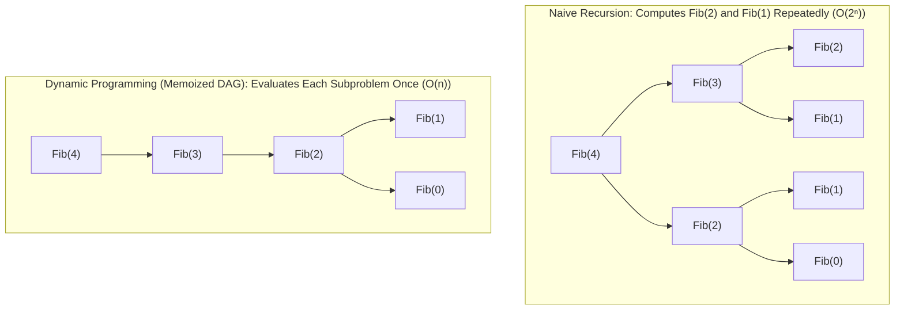

#### Comparison: Recursion vs Memoization vs Tabulation

| Metric | Pure Recursion | Top-Down DP (Memoization) | Bottom-Up DP (Tabulation) |
| :--- | :--- | :--- | :--- |
| **Execution Flow** | Top-down tree traversal | Top-down with lookup cache | Bottom-up iterative table construction |
| **Time Complexity (Fibonacci)** | $O(2^n)$ Exponential | $O(n)$ Linear | $O(n)$ Linear |
| **Space Complexity** | $O(n)$ Call stack | $O(n)$ Call stack + $O(n)$ Cache | $O(1)$ with state-variable reduction |
| **Stack Overflow Risk** | High | High (if recursion exceeds stack limit) | **Zero** (Iterative loop) |

```csharp
// Space-Optimized Bottom-Up Dynamic Programming: O(n) Time, O(1) Space
public static long Fibonacci(int n)
{
    if (n <= 1) return n;
    long prev2 = 0, prev1 = 1;
    for (int i = 2; i <= n; i++)
    {
        long current = prev1 + prev2;
        prev2 = prev1;
        prev1 = current;
    }
    return prev1;
}
```

---

### 13. What is a Heap and how is it used as a Priority Queue?

#### Conceptual Foundation

A **Heap** is a specialized tree-based data structure that satisfies two invariants:

1. **Shape Property**: It is a **Complete Binary Tree** (every level is completely filled, except possibly the last level which is filled from left to right).
2. **Heap Invariant**:
   - **Min-Heap**: $\text{Key}(\text{Parent}) \le \text{Key}(\text{Children})$ for all nodes. Root holds minimum.
   - **Max-Heap**: $\text{Key}(\text{Parent}) \ge \text{Key}(\text{Children})$ for all nodes. Root holds maximum.

Because a complete binary tree has no structural holes, it is mapped into a contiguous 1D array without child/parent pointers:

$$\text{Parent}(i) = \left\lfloor \frac{i - 1}{2} \right\rfloor, \quad \text{Left}(i) = 2i + 1, \quad \text{Right}(i) = 2i + 2$$

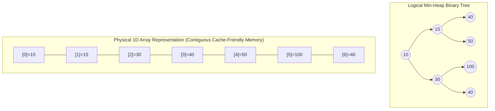

#### How a Priority Queue Uses a Heap

A Priority Queue serves elements based on priority rather than arrival order:

- **Enqueue (`Insert`)**: Append element at array end, then execute **Sift-Up** ($O(\log n)$) by repeatedly swapping with parent until heap invariant is restored.
- **Dequeue (`Extract-Min`)**: Swap root with last element, decrement size, then execute **Sift-Down** ($O(\log n)$) by swapping parent with its smallest child until restored.
- **Peek**: Return array element at index 0 ($O(1)$).

In .NET 6+, Microsoft introduced `PriorityQueue<TElement, TPriority>`, implementing a quaternary (4-ary) min-heap for improved cache line utilization during sift-down operations.

---

### 14. What is Topological Sort and when would you use it?

#### Conceptual Foundation

A **Topological Sort** of a **Directed Acyclic Graph (DAG)** is a linear ordering of all vertices such that for every directed edge $u \to v$, vertex $u$ appears before vertex $v$ in the ordering.

If the graph contains a **directed cycle** ($A \to B \to C \to A$), a valid topological sort is mathematically impossible.

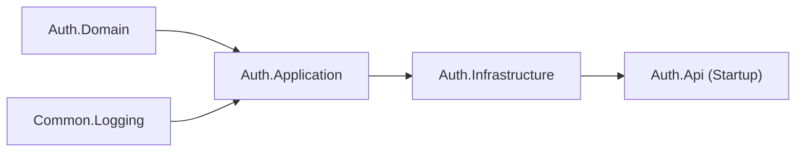

*Valid Linear Build Order*: `Common.Logging -> Auth.Domain -> Auth.Application -> Auth.Infrastructure -> Auth.Api`.

#### Algorithms for Topological Sorting

1. **Kahn's Algorithm (BFS In-Degree Tracking)**:
   - Compute in-degree (number of incoming edges) for all vertices.
   - Enqueue all vertices with $\text{in-degree} = 0$.
   - While queue is not empty: Dequeue vertex $u$, append to result list, decrement in-degree of all neighbors $v$. If $v$'s in-degree becomes 0, enqueue $v$.
   - **Cycle Detection**: If processed vertex count $< |V|$, the graph contains a cycle.
2. **Tarjan's Algorithm (DFS Post-Order Reversal)**:
   - Perform DFS traversal, tracking node visit states (`Unvisited`, `Visiting`, `Visited`).
   - If an edge leads to a `Visiting` node, a back-edge (cycle) is detected.
   - Push node to result stack upon finishing recursion; reverse stack at the end.

#### Real-World .NET Applications

- **Dependency Injection (DI) Containers**: Resolving service constructor registration dependencies (e.g., ASP.NET Core DI, Autofac).
- **Build Systems**: MSBuild project dependency compilation sequencing.
- **Database Migrations**: Ordering Entity Framework Core migration foreign key constraints.

---

### 15. Explain the SOLID principles with examples.

#### Conceptual Foundation

The SOLID principles are 5 object-oriented design tenets formulated by Robert C. Martin to enhance maintainability, testability, and extensibility in enterprise architectures.

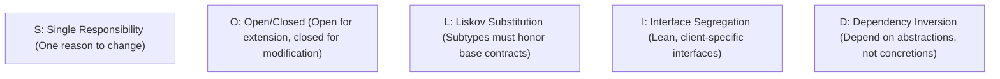

#### Detailed Breakdown with C# Examples

1. **Single Responsibility Principle (SRP)**: A class should have one, and only one, reason to change.

   ```csharp
   // Violation: OrderService handles business logic, database persistence, and email dispatching
   // Adherence: Separate into OrderProcessor, IOrderRepository, and IEmailNotificationService
   ```

2. **Open/Closed Principle (OCP)**: Software entities should be open for extension, but closed for modification.

   ```csharp
   public interface IDiscountStrategy { decimal ApplyDiscount(decimal total); }
   public class VipDiscount : IDiscountStrategy { public decimal ApplyDiscount(decimal t) => t * 0.80m; }
   public class OrderCalculator
   {
       public decimal Calculate(decimal total, IDiscountStrategy strategy) => strategy.ApplyDiscount(total);
   }
   ```

3. **Liskov Substitution Principle (LSP)**: Objects of a superclass should be replaceable with objects of its subclasses without breaking application correctness.

   ```csharp
   // Violation: Square inheriting from Rectangle and throwing in Width setter
   // Adherence: Both implement IShape with area calculation
   ```

4. **Interface Segregation Principle (ISP)**: Clients should not be forced to depend upon interfaces they do not use.

   ```csharp
   // Split bloated ICrudRepository into IReadOnlyRepository<T> and IWriteOnlyRepository<T>
   ```

5. **Dependency Inversion Principle (DIP)**: High-level modules should not depend on low-level modules. Both should depend on abstractions.

   ```csharp
   public class InvoiceService
   {
       private readonly IPaymentProcessor _processor;
       public InvoiceService(IPaymentProcessor processor) => _processor = processor; // Injected abstraction
   }
   ```

---

### 16. What is the difference between Concurrency and Parallelism?

#### Conceptual Foundation

- **Concurrency** is about **structure**. It is the composition of independently executing processes/tasks. Concurrency is dealing with lots of things at once (e.g., interleaving asynchronous I/O operations on a single CPU core via an event loop or task scheduler).
- **Parallelism** is about **execution**. It is the simultaneous physical execution of multiple computations on multiple physical CPU cores or execution units. Parallelism is doing lots of things at once.

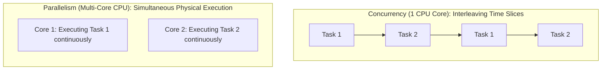

#### .NET Ecosystem Manifestation

| Dimension | Concurrency (`async` / `await`) | Parallelism (`Parallel.For` / PLINQ) |
| :--- | :--- | :--- |
| **Primary Workload** | **I/O-Bound**: Sockets, Databases, Disk, HTTP requests. | **CPU-Bound**: Image processing, Cryptography, Matrix math. |
| **Thread Utilization** | Yields thread back to ThreadPool during I/O wait (0 active threads). | Actively saturates multiple OS worker threads on physical cores. |
| **Core Primitive** | `Task`, `ValueTask`, `IAsyncEnumerable<T>`, `Channel<T>`. | `Parallel.ForEachAsync`, `PLINQ`, SIMD (`Vector<T>`). |
| **Context Switching** | Minimal OS context switching; managed by Task continuations. | High OS thread scheduling and hardware cache synchronization. |

---

### 17. How does Virtual Memory work?

#### Conceptual Foundation

**Virtual Memory** is an operating system memory management architecture that creates an abstracted, uniform address space for each process (e.g., 128 TB of user-mode virtual addresses on 64-bit Windows), decoupling the application from physical RAM hardware addresses.

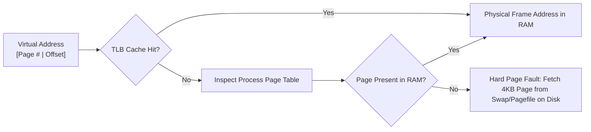

#### Key Architectural Components

1. **Pages and Page Frames**: Virtual memory is partitioned into uniform blocks called **Pages** (standard 4 KB on x86/x64). Physical RAM is divided into matching **Page Frames**.
2. **Page Tables**: The OS kernel maintains a multi-level tree of page tables per process that translates virtual page numbers into physical RAM frame addresses.
3. **Memory Management Unit (MMU)**: A dedicated hardware component within the CPU that intercepts every memory reference and performs hardware-level address translation.
4. **Translation Lookaside Buffer (TLB)**: An on-die high-speed hardware associative cache within the CPU that caches recent virtual-to-physical address mappings. TLB misses add memory bus lookup penalties.
5. **Page Faults**:
   - **Soft Page Fault**: Page resides in physical RAM but lacks active MMU mapping (fast resolution).
   - **Hard Page Fault**: Page has been paged out to disk (`pagefile.sys`). The CPU halts thread execution while the storage controller reads the 4 KB page into RAM.

---

### 18. What is amortized analysis? Give an example.

#### Conceptual Foundation

**Amortized Analysis** evaluates the average performance of an operation over a worst-case sequence of operations. Unlike average-case analysis (which assumes an input probability distribution), amortized analysis guarantees the average cost per operation in the worst-case scenario.

#### Canonical Example: Dynamic Array (`List<T>`) Growth

When appending $N$ consecutive elements to an initially empty `List<T>`:

- Most insertions execute in $O(1)$ time by writing directly to available capacity.
- When capacity is exhausted (at powers of 2: $1, 2, 4, 8, \dots, N$), the list allocates a new array of double the size and copies all existing elements over, costing $O(K)$ time.

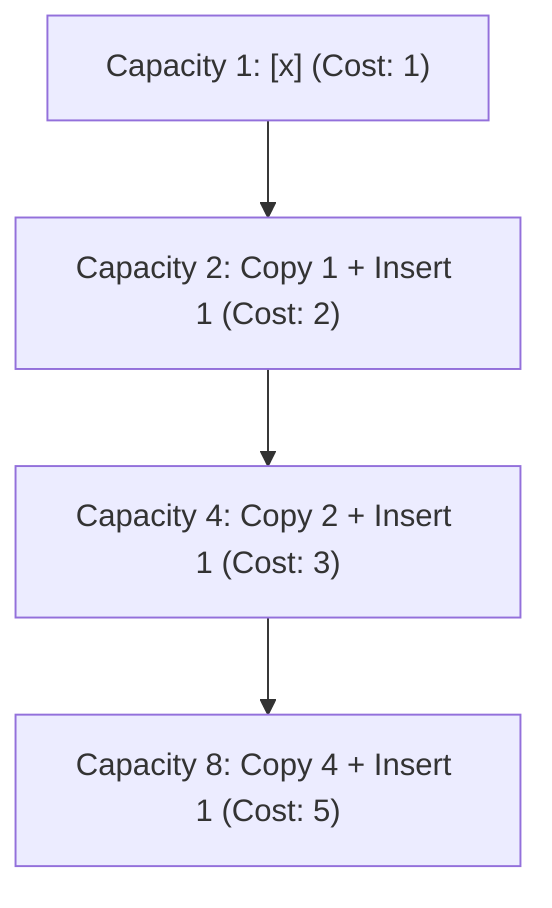

#### Mathematical Proof using the Aggregate Method

Total copy operations across $N$ insertions:

$$\text{Total Copies} = 1 + 2 + 4 + 8 + \dots + \frac{N}{2} = \sum_{j=0}^{\log_2 N - 1} 2^j = N - 1$$

Total work across all $N$ insertions $= N \text{ (direct writes)} + (N - 1) \text{ (copies)} = 2N - 1 = O(N)$.

$$\text{Amortized Cost per Insertion} = \frac{\text{Total Work}}{N} = \frac{2N - 1}{N} \approx 2 = O(1)$$

While a single resizing insertion incurs $O(N)$ worst-case time, its cost is amortized across all preceding $O(1)$ operations, guaranteeing $O(1)$ amortized insertion time.

---

### 19. Compare Adjacency Matrix vs Adjacency List for graph representation.

#### Conceptual Foundation

Graphs $G = (V, E)$ are primarily represented using either a 2D Boolean/Weight Matrix or an Array of Neighbor Lists.

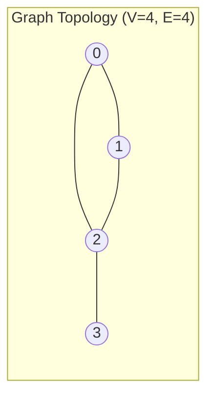

#### Detailed Comparison Matrix

| Property | Adjacency Matrix (`bool[V, V]`) | Adjacency List (`List<int>[V]`) |
| :--- | :--- | :--- |
| **Space Complexity** | $O(V^2)$ (Heavy, independent of edges) | $O(V + E)$ (Optimal for sparse graphs) |
| **Edge Existence Query $(u, v)$** | $O(1)$ (Direct array index `matrix[u, v]`) | $O(\text{deg}(u))$ (Scan adjacency list) |
| **Iterate All Neighbors of $u$** | $O(V)$ (Must scan entire row of length $V$) | $O(\text{deg}(u))$ (Iterate existing edges) |
| **Add / Remove Edge** | $O(1)$ | $O(1)$ add; $O(\text{deg}(u))$ remove |
| **Add Vertex** | $O(V^2)$ (Requires matrix reallocation) | $O(1)$ (Append list to collection) |
| **Optimal Graph Density** | **Dense Graphs** ($E \approx V^2$) | **Sparse Graphs** ($E \ll V^2$, e.g., web networks, road maps) |

```csharp
// Modern Memory-Efficient Adjacency List in C#
public class Graph
{
    private readonly List<int>[] _adjacencyList;

    public Graph(int vertices)
    {
        _adjacencyList = new List<int>[vertices];
        for (int i = 0; i < vertices; i++)
            _adjacencyList[i] = new List<int>();
    }

    public void AddEdge(int u, int v)
    {
        _adjacencyList[u].Add(v);
        _adjacencyList[v].Add(u); // Undirected graph
    }
}
```

---

### 20. What is a Trie? When would you use one?

#### Conceptual Foundation

A **Trie** (derived from re**TRIE**val), or **Prefix Tree**, is a tree data structure used to store associative arrays where keys are strings. Unlike binary trees, nodes in a Trie do not store their entire key string; instead, a node's position in the tree defines the key with which it is associated, and edges represent characters.

```mermaid
flowchart TD
    Root["Root: ''"] --> B["b"]
    Root --> C["c"]
    B --> A1["a"]
    A1 --> T1["t (isTerminal=true: 'bat')"]
    T1 --> S["s (isTerminal=true: 'bats')"]
    C --> A2["a"]
    A2 --> T2["t (isTerminal=true: 'cat')"]
```

#### Complexity Analysis & Use Cases

- **Search / Insert / Delete Time**: $O(L)$ where $L$ is the string length. Crucially, lookup speed is **independent of the total number of keys $N$** in the database.
- **Space Complexity**: $O(\Sigma \cdot L \cdot N)$ where $\Sigma$ is alphabet size.

#### Practical Industry Use Cases

1. **Autocomplete & Typeahead Suggestions**: Fast retrieval of all keys sharing prefix $P$ in $O(|P| + K)$ time.
2. **IP Routing (Longest Prefix Match)**: Hardware routing tables match CIDR network masks using binary bitwise Tries.
3. **Spell Checkers & Dictionaries**: Rapid lexical validation and string distance matching.

```csharp
public class TrieNode
{
    public Dictionary<char, TrieNode> Children { get; } = new();
    public bool IsEndOfWord { get; set; }
}

public class Trie
{
    private readonly TrieNode _root = new();

    public void Insert(string word)
    {
        var current = _root;
        foreach (char c in word)
        {
            if (!current.Children.TryGetValue(c, out var next))
            {
                next = new TrieNode();
                current.Children[c] = next;
            }
            current = next;
        }
        current.IsEndOfWord = true;
    }

    public bool StartsWith(string prefix)
    {
        var current = _root;
        foreach (char c in prefix)
        {
            if (!current.Children.TryGetValue(c, out var next)) return false;
            current = next;
        }
        return true;
    }
}
```

---

## 🔴 Advanced & Systems Architecture (Questions 21–30)

### 21. Explain Dijkstra's algorithm. What are its limitations?

#### Conceptual Foundation

**Dijkstra's Algorithm** is a greedy algorithm that computes the Single-Source Shortest Path (SSSP) on a weighted directed or undirected graph with **non-negative edge weights** ($w(u, v) \ge 0$).

It maintains a tentative distance array `dist[]` initialized to $\infty$ (with $\text{dist}[\text{source}] = 0$) and iteratively extracts the unvisited vertex $u$ with the minimum tentative distance using a Min-Priority Queue, relaxing all outgoing edges $(u, v)$:

$$\text{If } \text{dist}[u] + w(u, v) < \text{dist}[v] \implies \text{dist}[v] = \text{dist}[u] + w(u, v)$$

```mermaid
flowchart LR
    S((Source: 0)) -->|"w = 4"| A((A: 4))
    S -->|"w = 2"| B((B: 2))
    B -->|"w = 1"| A
    A -->|"Relaxed Path: S->B->A (dist=3)"| Dest((Target))
```

#### Time Complexity

- With **Binary Min-Heap / PriorityQueue**: $O((V + E) \log V)$.
- With **Fibonacci Heap**: $O(E + V \log V)$.

#### Fundamental Limitations

1. **Failure with Negative Edge Weights**: Dijkstra's greedy invariant assumes that once a vertex is extracted from the Priority Queue, its shortest path is permanently finalized. A negative edge encountered later can invalidate this assumption, yielding incorrect results or triggering infinite loops.
   - *Solution*: Use the **Bellman-Ford Algorithm** ($O(V \cdot E)$) or **Johnson's Algorithm**.
2. **Inefficient for Point-to-Point Pathfinding**: Dijkstra expands search frontiers uniformly in all geometric directions. For targeted navigation (e.g., GPS mapping), the **A\* Algorithm** improves efficiency by augmenting edge weights with an admissible heuristic distance function $h(u)$.

```csharp
public static int[] Dijkstra(int vertices, List<(int to, int weight)>[] graph, int source)
{
    var dist = new int[vertices];
    Array.Fill(dist, int.MaxValue);
    dist[source] = 0;

    var pq = new PriorityQueue<int, int>(); // Node, Distance
    pq.Enqueue(source, 0);

    while (pq.Count > 0)
    {
        pq.TryDequeue(out int u, out int d);
        if (d > dist[u]) continue; // Stale priority queue entry

        foreach (var (v, weight) in graph[u])
        {
            if (dist[u] + weight < dist[v])
            {
                dist[v] = dist[u] + weight;
                pq.Enqueue(v, dist[v]);
            }
        }
    }
    return dist;
}
```

---

### 22. What are the 4 conditions for Deadlock (Coffman conditions)?

#### The 4 Coffman Conditions

A deadlock can occur if and only if all 4 of the following conditions hold simultaneously within a concurrent system:

```mermaid
flowchart TD
    C1["1. Mutual Exclusion<br/>Resources cannot be shared simultaneously"] --- C2["2. Hold and Wait<br/>Thread holds resource while waiting for another"]
    C2 --- C3["3. No Preemption<br/>Resources cannot be forcibly confiscated"]
    C3 --- C4["4. Circular Wait<br/>Closed circular chain of dependency exists"]
```

1. **Mutual Exclusion**: At least one resource must be held in a non-shareable mode (only one thread can access it at any given time).
2. **Hold and Wait**: A process/thread currently holds at least one resource while waiting to acquire additional resources held by other processes.
3. **No Preemption**: Resources cannot be forcibly taken away from a holding thread; they can only be released voluntarily after task completion.
4. **Circular Wait**: A closed chain of threads $\{T_1, T_2, \dots, T_n\}$ exists such that $T_1$ waits for a resource held by $T_2$, $T_2$ waits for $T_3$, and $T_n$ waits for a resource held by $T_1$.

#### Deadlock Prevention Strategies

| Broken Condition | Architectural Strategy | .NET Implementation Technique |
| :--- | :--- | :--- |
| **Eliminate Mutual Exclusion** | Make resources shareable or lock-free. | Use `ReaderWriterLockSlim`, immutable record types, or atomic `Interlocked` operations. |
| **Eliminate Hold & Wait** | Acquire all required resources atomically upfront. | Request all locks in a single atomic transaction block before execution. |
| **Allow Preemption** | Confiscate resources if allocation fails. | Use `Monitor.TryEnter(lockObj, timeout)` or `SemaphoreSlim.WaitAsync(timeout)`. If timeout expires, release all held locks and retry. |
| **Eliminate Circular Wait** | Enforce a strict global **Lock Acquisition Hierarchy**. | Assign unique integer IDs to lockable resources and always acquire locks in ascending ID order. |

---

### 23. Compare stable vs unstable sorting algorithms. Why does stability matter?

#### Conceptual Foundation

A sorting algorithm is **Stable** if it preserves the relative original input order of records that have identical sort keys. An algorithm is **Unstable** if records with equal keys can be transposed during partitioning or swapping.

```mermaid
flowchart LR
    Input["Input: [3_a, 5, 3_b, 1]"] --> Stable["Stable Sort -> [1, 3_a, 3_b, 5]<br/>(Order of 3_a and 3_b preserved)"]
    Input --> Unstable["Unstable Sort -> [1, 3_b, 3_a, 5]<br/>(Order of 3_a and 3_b inverted)"]
```

#### Classification Matrix

| Category | Algorithms | Characteristics |
| :--- | :--- | :--- |
| **Stable Sorts** | **Merge Sort**, **Timsort**, **Insertion Sort**, **Counting Sort**, **Radix Sort** | Relies on localized adjacent comparisons or separate auxiliary buffers. |
| **Unstable Sorts** | **QuickSort**, **HeapSort**, **Selection Sort**, **ShellSort** | Incurs long-distance non-adjacent swaps that violate original sequence ordering. |

#### Why Stability Matters in Enterprise Systems

1. **Multi-Key / Multi-Pass Sorting**: Consider sorting an e-commerce catalog first by `ProductName` (Alphabetical), and subsequently by `DepartmentName`. A stable sort guarantees that within each Department, products remain alphabetized.
2. **UI Data Grid Interactivity**: When users click a column header to sort by "Date", then click "Status", stability ensures rows with identical status remain ordered by their previous date selection.

```csharp
// LINQ OrderBy followed by ThenBy guarantees Stable Sorting
var sortedEmployees = employees
    .OrderBy(e => e.Department)   // Primary Key (Preserved)
    .ThenBy(e => e.Salary);        // Secondary Key
```

---

### 24. Explain the Knapsack problem and its DP solution.

#### Problem Formulation (0/1 Knapsack)

Given $N$ items, each having a weight $w_i$ and value $v_i$, and a knapsack with maximum weight capacity $W$, determine the maximum total value attainable such that the total weight does not exceed $W$. Each item can be chosen at most once (**0/1 decision**).

#### Dynamic Programming State Transition

Let $dp[i, w]$ be the maximum value attainable using a subset of the first $i$ items with total weight limit $w$:

```text
dp[i, w] = dp[i-1, w]                                   if w_i > w (Skip item)
dp[i, w] = max(dp[i-1, w], dp[i-1, w - w_i] + v_i)     if w_i <= w (Max of skip vs take)
```

```mermaid
flowchart TD
    State["dp[i, w]"] --> OptionA["Exclude item i: dp[i-1, w]"]
    State --> OptionB["Include item i: dp[i-1, w - w_i] + v_i"]
```

#### Space Optimization: Reducing $O(N \cdot W)$ to $O(W)$

Notice that computing $dp[i, w]$ only requires values from the previous row $dp[i-1, \dots]$. We can reduce memory from a 2D matrix to a single 1D array by iterating the weight capacity $w$ **backwards** from $W$ down to $w_i$. Backwards traversal ensures that each item is used at most once per iteration.

```csharp
// Space-Optimized 0/1 Knapsack: O(N * W) Time, O(W) Space
public static int Knapsack01(int[] weights, int[] values, int capacity)
{
    int n = weights.Length;
    int[] dp = new int[capacity + 1];

    for (int i = 0; i < n; i++)
    {
        int w = weights[i];
        int v = values[i];

        // Traverse backwards to prevent using the current item multiple times
        for (int cap = capacity; cap >= w; cap--)
        {
            dp[cap] = Math.Max(dp[cap], dp[cap - w] + v);
        }
    }
    return dp[capacity];
}
```

---

### 25. How does CPU cache locality affect algorithm performance?

#### Computer Architecture & The Memory Wall

Modern CPUs operate at clock cycles under 0.3 ns, while accessing main system memory (DRAM) requires 50–100 ns (~200–300 stalled clock cycles). To bridge this gap, modern CPUs utilize hierarchical on-die SRAM caches (**L1, L2, L3**).

Memory is transferred between RAM and CPU caches in fixed chunks of **64 bytes**, termed a **Cache Line**.

```mermaid
flowchart LR
    CPU["CPU Registers<br/>(0.5 ns)"] --- L1["L1 Cache (32KB)<br/>(1 ns)"]
    L1 --- L2["L2 Cache (512KB)<br/>(3-5 ns)"]
    L2 --- L3["L3 Cache (16-64MB)<br/>(15-20 ns)"]
    L3 --- RAM["Main RAM (DRAM)<br/>(60-100 ns: Stalled cycles)"]
```

#### Principles of Locality

1. **Spatial Locality**: If a memory address is accessed, nearby memory locations within the same 64-byte cache line are automatically fetched by hardware prefetchers.
2. **Temporal Locality**: Memory accessed recently is likely to be accessed again soon and remains in L1/L2 caches.

#### Cache Locality Benchmark: Row-Major vs Column-Major Matrix Traversal

C# multi-dimensional and jagged arrays allocate elements in **Row-Major** contiguous sequence.

- **Row-Major Traversal (`matrix[row, col]`)**: Accesses contiguous memory addresses sequentially, yielding a near 100% L1 cache hit rate.
- **Column-Major Traversal (`matrix[col, row]`)**: Jumps across memory by strides of $N \times 4$ bytes on every iteration, causing cache misses on every access.

```csharp
const int Size = 4096;
int[,] matrix = new int[Size, Size];

// FAST: Sequential Spatial Locality (Loads 16 integers per 64-byte Cache Line)
for (int r = 0; r < Size; r++)
    for (int c = 0; c < Size; c++)
        matrix[r, c] += 1;

// SLOW (~10x-20x slower): Cache Thrashing (Continuous L1/L2 Cache Misses)
for (int c = 0; c < Size; c++)
    for (int r = 0; r < Size; r++)
        matrix[r, c] += 1;
```

---

### 26. What is tail recursion? Does C# support tail call optimization?

#### Conceptual Foundation

A recursive function call is **Tail-Recursive** if the recursive invocation is the **absolute final operation** performed before returning. No pending computations (e.g., additions or multiplications) can remain on the call stack.

```csharp
// NOT Tail Recursive: Multiplication must wait for recursive call to return
public int Factorial(int n) => n <= 1 ? 1 : n * Factorial(n - 1);

// TAIL Recursive: Result accumulated in parameter; nothing pending after return
public int FactorialTail(int n, int accumulator = 1) =>
    n <= 1 ? accumulator : FactorialTail(n - 1, n * accumulator);
```

#### Tail Call Optimization (TCO) Mechanics

Under TCO, the compiler/JIT replaces the stack-allocating `CALL` instruction with an in-place `JMP` instruction, reusing the caller's existing stack frame. This reduces stack space complexity from $O(n)$ to $O(1)$, completely eliminating `StackOverflowException`.

```mermaid
flowchart LR
    subgraph StandardRecursion ["Standard Recursion Stack Growth (O(n) Frames)"]
        direction TB
        F3["Frame: Factorial(3)"] --> F2["Frame: Factorial(2)"] --> F1["Frame: Factorial(1)"]
    end

    subgraph TailOptimized ["Tail Call Optimization (O(1) Frame Reused via JMP)"]
        direction TB
        FReused["Single Stack Frame Reused Across All Iterations"]
    end
```

#### Does C# / .NET Support TCO?

- **C# Compiler (`csc`)**: Does **not** guarantee TCO and generally does not emit the IL `tail.` prefix instruction for recursive functions.
- **.NET RyuJIT Compiler (64-bit)**: Performs opportunistic tail-call elimination in Release mode under specific conditions (e.g., arguments match caller's signature, no structs exceeding register sizes, no `try/catch` blocks, no debugging symbols attached).
- **Senior Engineering Takeaway**: Because TCO is **not guaranteed** by the C# language specification, recursion should be converted to an **iterative `while` loop** in high-throughput .NET production systems.

---

### 27. Explain the difference between Prim's and Kruskal's MST algorithms.

#### Conceptual Foundation

A **Minimum Spanning Tree (MST)** of an undirected weighted graph $G = (V, E)$ is an acyclic tree subgraph connecting all $|V|$ vertices with the minimum possible total edge weight using exactly $|V| - 1$ edges.

```mermaid
flowchart TD
    subgraph PrimsApproach ["Prim's Algorithm (Vertex-Centric)"]
        P1["Start at arbitrary root vertex"] --> P2["Maintain PriorityQueue of cut-crossing edges"]
        P2 --> P3["Grow single connected tree outward until all vertices included"]
    end

    subgraph KruskalsApproach ["Kruskal's Algorithm (Edge-Centric)"]
        K1["Sort ALL edges globally by weight: O(E log E)"] --> K2["Iterate sorted edges and add via Disjoint Set Union (DSU)"]
        K2 --> K3["Merge independent forest components; skip edges causing cycles"]
    end
```

#### Comparison Matrix

| Dimension | Prim's Algorithm | Kruskal's Algorithm |
| :--- | :--- | :--- |
| **Paradigm** | **Vertex-Centric**: Grows a single connected tree component. | **Edge-Centric**: Merges disjoint forest components. |
| **Core Data Structure** | Min-Priority Queue (`PriorityQueue<Node, Weight>`) | **Disjoint Set Union (DSU / Union-Find)** |
| **Time Complexity** | $O(E \log V)$ with binary heap; $O(E + V \log V)$ with Fibonacci heap | $O(E \log E) = O(E \log V)$ (dominated by edge sorting) |
| **Optimal Graph Type** | **Dense Graphs** ($E \approx V^2$) | **Sparse Graphs** ($E \ll V^2$) |

```csharp
// Kruskal's Algorithm with Disjoint Set Union (Union-Find with Path Compression)
public class DisjointSet
{
    private readonly int[] _parent;
    private readonly int[] _rank;

    public DisjointSet(int n)
    {
        _parent = Enumerable.Range(0, n).ToArray();
        _rank = new int[n];
    }

    public int Find(int i) // Path compression: O(α(n))
    {
        if (_parent[i] == i) return i;
        return _parent[i] = Find(_parent[i]);
    }

    public bool Union(int u, int v) // Union by rank
    {
        int rootU = Find(u), rootV = Find(v);
        if (rootU == rootV) return false; // Cycle detected

        if (_rank[rootU] < _rank[rootV]) _parent[rootU] = rootV;
        else if (_rank[rootU] > _rank[rootV]) _parent[rootV] = rootU;
        else { _parent[rootV] = rootU; _rank[rootU]++; }
        return true;
    }
}
```

---

### 28. How does the .NET ThreadPool scheduler decide thread allocation?

#### Architecture of the .NET ThreadPool

The .NET runtime ThreadPool engine manages worker threads and I/O Completion Port (IOCP) threads using a **Work-Stealing Architecture**:

1. **Global Queue**: Work scheduled via `ThreadPool.QueueUserWorkItem` enters a single lock-synchronized FIFO global queue.
2. **Local Work-Stealing Queues**: Each ThreadPool worker thread maintains a lock-free LIFO local work queue (`Deque`). When a thread spawns child tasks (e.g., `Task.Run`), it pushes them onto its local queue. If a thread runs out of work, it **steals** tasks from the tail of another thread's local queue via a FIFO steal operation.

```mermaid
flowchart TD
    GQ["ThreadPool Global FIFO Queue"]

    subgraph Core1 ["Core 1 Thread Worker"]
        LQ1["Local Deque (LIFO Push/Pop)"]
    end

    subgraph Core2 ["Core 2 Thread Worker"]
        LQ2["Local Deque (LIFO Push/Pop)"]
    end

    GQ --> Core1
    GQ --> Core2
    Core1 -.->|"Work Stealing (FIFO from tail)"| LQ2
```

#### The Hill-Climbing Heuristic Algorithm

Rather than keeping a static thread count, the .NET ThreadPool uses a **Hill-Climbing feedback-control algorithm** to determine thread allocation:

- It tracks the **throughput rate** (work items completed per millisecond).
- It periodically injects or removes worker threads and observes the effect on throughput.
- If adding a thread increases throughput, it injects another thread. If throughput drops (due to CPU core over-subscription and OS context switching overhead), it decreases the thread count.

#### Thread Injection Delay & Starvation

When threads are blocked synchronously (e.g., `task.Result`, `Thread.Sleep()`), the Hill-Climbing algorithm detects a stall and injects new threads at a throttled rate (~1 thread per 500 ms). If dozens of concurrent requests block on synchronous operations, the ThreadPool starves, causing catastrophic latency spikes.

---

### 29. What is the time complexity of building a heap? Prove why it's O(n) not O(n log n).

#### The Intuitive Misconception

A common misconception is that building a heap of $n$ elements requires $O(n \log n)$ time because inserting $n$ elements one by one takes $\sum_{i=1}^n \log i = O(n \log n)$.

However, **Floyd's Bottom-Up Heap Construction Algorithm** builds a heap in **$O(n)$ Linear Time** by starting at the lowest internal nodes ($\lfloor n/2 \rfloor - 1$ down to 0) and executing `SiftDown()` instead of inserting top-down.

```mermaid
flowchart TD
    subgraph TreeHeights ["Heap Tree Node Distribution Across Heights"]
        H3["Height 3: 1 node (Root) -> Max 3 swaps"]
        H2["Height 2: 2 nodes -> Max 2 swaps each"]
        H1["Height 1: 4 nodes -> Max 1 swap each"]
        H0["Height 0: 8 Leaf Nodes -> 0 swaps (No Sift-Down needed!)"]
    end
```

#### Rigorous Mathematical Proof

In a complete binary tree of $n$ nodes:

- The maximum height of the tree is $H = \lfloor \log_2 n \rfloor$.
- The number of nodes at height $h$ is at most $\left\lceil \frac{n}{2^{h+1}} \right\rceil$.
- The maximum number of swap operations during `SiftDown` for a node at height $h$ is $h$.

Total operations $S$:

$$S = \sum_{h=0}^{\lfloor \log_2 n \rfloor} \left\lceil \frac{n}{2^{h+1}} \right\rceil \cdot h \le \frac{n}{2} \sum_{h=0}^{\infty} \frac{h}{2^h}$$

Let $X = \sum_{h=0}^{\infty} \frac{h}{2^h} = \frac{0}{1} + \frac{1}{2} + \frac{2}{4} + \frac{3}{8} + \frac{4}{16} + \dots$

Multiplying by $\frac{1}{2}$:

$$\frac{1}{2}X = \frac{0}{2} + \frac{1}{4} + \frac{2}{8} + \frac{3}{16} + \dots$$

Subtracting $\frac{1}{2}X$ from $X$:

$$\frac{1}{2}X = \sum_{h=1}^{\infty} \frac{1}{2^h} = \frac{\frac{1}{2}}{1 - \frac{1}{2}} = 1 \implies X = 2$$

Substituting $X = 2$ back into the summation:

$$S \le \frac{n}{2} \times 2 = n = O(n)$$

Because the overwhelming majority of nodes ($n/2$) reside at the bottom (height 0) where sift-down cost is 0, the total construction work converges to $O(n)$.

---

### 30. Design a LRU Cache with O(1) get and put operations.

#### Architectural Design

A **Least Recently Used (LRU) Cache** evicts the item that has not been accessed for the longest duration when capacity is reached.

To achieve $O(1)$ time complexity for both `Get` and `Put`, two data structures are composed together:

1. **Hash Table (`Dictionary<K, LinkedListNode>`)**: Provides $O(1)$ key-to-node lookup.
2. **Doubly Linked List**: Maintains item recency ordering and allows $O(1)$ node removal and insertion at the head.
   - **Head (MRU)**: Most recently accessed/inserted item.
   - **Tail (LRU)**: Least recently accessed item (eviction candidate).

```mermaid
flowchart LR
    subgraph HashMapLookup ["Hash Table Dictionary: O(1) Key Lookup"]
        D1["Key: 'A'"] --> N1
        D2["Key: 'B'"] --> N2
        D3["Key: 'C'"] --> N3
    end

    subgraph DoublyLinkedList ["Doubly Linked List (Recency Chain)"]
        Head["[Dummy Head]"] <--> N1["Node A (MRU)"]
        N1 <--> N2["Node B"]
        N2 <--> N3["Node C (LRU)"]
        N3 <--> Tail["[Dummy Tail]"]
    end
```

#### Production-Ready C# Implementation

```csharp
public class LruCache<TKey, TValue> where TKey : notnull
{
    private class Node
    {
        public TKey Key = default!;
        public TValue Value = default!;
        public Node? Prev;
        public Node? Next;
    }

    private readonly int _capacity;
    private readonly Dictionary<TKey, Node> _map;
    private readonly Node _head; // Dummy sentinel head
    private readonly Node _tail; // Dummy sentinel tail
    private readonly object _syncLock = new();

    public LruCache(int capacity)
    {
        if (capacity <= 0) throw new ArgumentOutOfRangeException(nameof(capacity));
        _capacity = capacity;
        _map = new Dictionary<TKey, Node>(capacity);

        _head = new Node();
        _tail = new Node();
        _head.Next = _tail;
        _tail.Prev = _head;
    }

    public bool TryGet(TKey key, out TValue value)
    {
        lock (_syncLock)
        {
            if (_map.TryGetValue(key, out var node))
            {
                MoveToHead(node);
                value = node.Value;
                return true;
            }
            value = default!;
            return false;
        }
    }

    public void Put(TKey key, TValue value)
    {
        lock (_syncLock)
        {
            if (_map.TryGetValue(key, out var existingNode))
            {
                existingNode.Value = value;
                MoveToHead(existingNode);
                return;
            }

            if (_map.Count >= _capacity)
            {
                var lruNode = _tail.Prev!;
                RemoveNode(lruNode);
                _map.Remove(lruNode.Key);
            }

            var newNode = new Node { Key = key, Value = value };
            _map[key] = newNode;
            AddToHead(newNode);
        }
    }

    private void MoveToHead(Node node)
    {
        RemoveNode(node);
        AddToHead(node);
    }

    private void AddToHead(Node node)
    {
        node.Next = _head.Next;
        node.Prev = _head;
        _head.Next!.Prev = node;
        _head.Next = node;
    }

    private void RemoveNode(Node node)
    {
        node.Prev!.Next = node.Next;
        node.Next!.Prev = node.Prev;
    }
}
```

---

## 🎯 Senior Technical Interview Strategy & Evaluation Rubric

When interviewing for Senior and Lead .NET positions, technical interviewers evaluate responses against a 5-stage competency framework:

```mermaid
flowchart LR
    S1["1. Clarify Requirements<br/>Constraints & Edge Cases"] --> S2["2. State Baseline<br/>Brute Force & Bounds"]
    S2 --> S3["3. Propose Optimal<br/>Trade-off Matrix"]
    S3 --> S4["4. Write Clean C#<br/>Defensive & Idiomatic"]
    S4 --> S5["5. Dry Run & Systems<br/>GC, Cache, Threading"]
```

### Interview Evaluation Matrix

| Level | Performance Characteristics |
| :--- | :--- |
| **Junior / Mid (0–2 Yrs)** | Focuses purely on syntax; writes $O(n^2)$ brute force; misses null/boundary conditions; unware of GC allocations or CPU cache locality. |
| **Senior (3–5 Yrs)** | Immediately clarifies constraints; communicates Big-O upfront; chooses optimal data structures; writes thread-safe, defensive C# code. |
| **Principal / Lead (6+ Yrs)** | Discusses hardware-level mechanics (L1/L2 cache lines, TLB misses, false sharing); evaluates GC pressure (LOH fragmentation, Gen 0 vs Gen 2); designs for distributed scale. |

---

## 🔗 Related Modules in this Guide

- [01 - Big-O Notation & Complexity Analysis](./01-big-o-notation-and-complexity-analysis.md)
- [02 - Arrays, Strings & Hash Tables](./02-arrays-strings-and-hash-tables.md)
- [03 - Linked Lists, Stacks & Queues](./03-linked-lists-stacks-and-queues.md)
- [04 - Trees & Binary Search Trees](./04-trees-and-binary-search-trees.md)
- [05 - Heaps & Priority Queues](./05-heaps-and-priority-queues.md)
