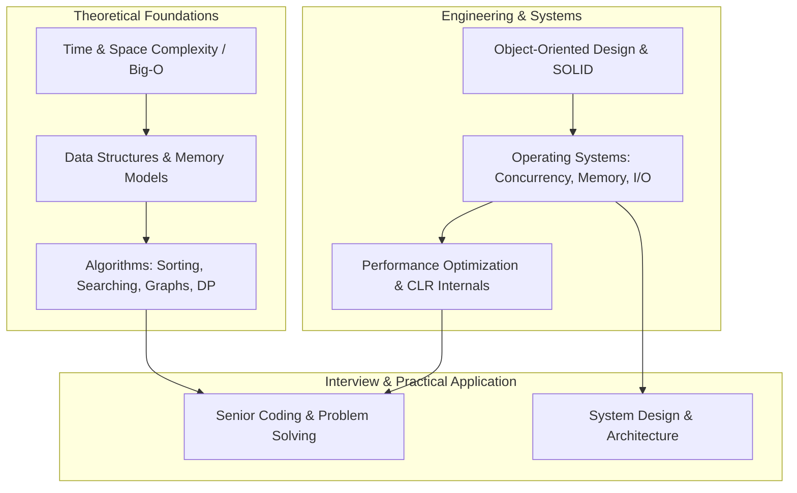

# Computer Science (CS) Fundamentals Learning Path

Welcome to the comprehensive **Computer Science (CS) Fundamentals** guide. This curriculum covers the foundational theories, algorithms, data structures, and systems concepts that underpin high-performance software engineering, large-scale system design, and technical interviews.

---

## 🏛️ CS Fundamentals Architecture & Core Pillars

---

## 📚 CS Fundamentals Curriculum Modules

1. [**01 - Big-O Notation & Complexity Analysis**](./01-big-o-notation-and-complexity-analysis.md)
   - Asymptotic notations ($O$, $\Omega$, $\Theta$), Time vs Space complexity
   - Amortized analysis & dynamic array doubling proof
   - Practical .NET collection complexity matrix & interview traps

2. [**02 - Arrays, Strings & Hash Tables**](./02-arrays-strings-and-hash-tables.md)
   - Contiguous memory, CPU cache lines (L1/L2/L3 spatial locality), `Span<T>`
   - String immutability, StringBuilder, String Interning, and UTF-16 representation
   - Hash tables, collision resolution (Chaining vs Open Addressing), load factor & Marvin32 randomized hashing

3. [**03 - Linked Lists, Stacks & Queues**](./03-linked-lists-stacks-and-queues.md)
   - Singly & Doubly Linked Lists, Floyd's Cycle Detection (Tortoise and Hare)
   - Stacks (LIFO), call stack activation records, Undo/Redo & Parentheses validation
   - Queues (FIFO), dynamic circular array buffers, BFS traversal & rate limiters

4. [**04 - Trees & Binary Search Trees (BST)**](./04-trees-and-binary-search-trees.md)
   - Tree anatomy, full/complete/perfect/balanced trees
   - DFS (Pre/In/Post) & BFS Level-Order traversals
   - BST invariant, $O(\log n)$ search/insert/delete, and AVL vs Red-Black self-balancing trees
   - Trie (Prefix Tree) architecture for typeahead and fast prefix search

5. [**05 - Heaps & Priority Queues**](./05-heaps-and-priority-queues.md)
   - Complete binary trees on flat arrays, Min-Heap vs Max-Heap invariants
   - $O(n)$ Floyd's Bottom-Up Heapify mathematical proof
   - Heap Sort, .NET `PriorityQueue<TElement, TPriority>`, Top-K elements, and two-heap running median

6. [**06 - Graphs & Graph Algorithms**](./06-graphs-and-graph-algorithms.md)
   - Graph representations: Adjacency Matrix vs Adjacency List vs Compressed Sparse Row (CSR)
   - Breadth-First Search (BFS) & Depth-First Search (DFS) with cycle detection
   - Topological Sort (Kahn's algorithm) for dependency resolution
   - Dijkstra's shortest path, Bellman-Ford, and Minimum Spanning Trees (Prim's & Kruskal's with DSU)

7. [**07 - Sorting & Searching Algorithms**](./07-sorting-and-searching-algorithms.md)
   - Comparison sorts: Bubble, Selection, Insertion, Merge Sort, Quick Sort, and Heap Sort
   - Non-comparison linear sorts: Counting Sort and Radix Sort
   - .NET IntroSort internals (`Array.Sort` / `Span.Sort`) vs Stable LINQ `OrderBy`
   - Binary Search, lower/upper boundaries, and rotated sorted array search

8. [**08 - Recursion & Dynamic Programming (DP)**](./08-recursion-and-dynamic-programming.md)
   - Call stack anatomy, activation frames, and tail recursion in RyuJIT
   - Overlapping subproblems & optimal substructure
   - Top-Down (Memoization) vs Bottom-Up (Tabulation) with space optimization
   - Classic patterns: 0/1 Knapsack, Coin Change, LCS, and Edit Distance

9. [**09 - Object-Oriented Programming (OOP) & SOLID Principles**](./09-oop-and-solid-principles.md)
   - 4 Pillars: Encapsulation, Abstraction, Inheritance, and Runtime VTable Polymorphism
   - SOLID Principles applied in Clean Architecture with MediatR & DI
   - Value Types (`struct`, `record struct`, `ref struct`) vs Reference Types (`class`, `record`) in CoreCLR
   - Classic GoF design patterns in modern C#

10. [**10 - Operating Systems (OS) Fundamentals**](./10-operating-systems-fundamentals.md)
    - Kernel vs User space, CPU privilege rings, and system calls
    - Processes, threads, context switching costs, and why `async/await` is single-threaded I/O
    - Synchronization primitives (`lock`, `Monitor`, `SemaphoreSlim`, `Interlocked`, `SpinLock`)
    - Deadlocks (Coffman conditions), Virtual Memory, Paging, Page Faults, and Windows IOCP

11. [**11 - Top 30 CS Fundamentals Interview Questions (Easy, Medium, Advanced)**](./11-top-30-cs-fundamentals-interview-questions.md)
    - 🟢 **10 Easy/Foundational Questions**: Arrays vs Lists, Hash Table collisions, BST, Big-O, Merge vs Quick Sort
    - 🟡 **10 Medium/Intermediate Questions**: Hash DoS attacks, DP vs Recursion, Topological sorting, Virtual Memory, Trie
    - 🔴 **10 Advanced/Senior Questions**: Dijkstra limitations, Coffman conditions, Knapsack DP, Cache locality, LRU Cache implementation

---

## ⚡ Data Structure Complexity Quick Reference

| Data Structure | Access | Search | Insertion | Deletion | Space Overhead |
| :--- | :---: | :---: | :---: | :---: | :---: |
| **Array (`T[]`)** | $O(1)$ | $O(n)$ | $O(n)$ | $O(n)$ | Minimal (Contiguous) |
| **Dynamic Array (`List<T>`)** | $O(1)$ | $O(n)$ | $O(1)$ amortized | $O(n)$ | Low ($2\times$ capacity) |
| **Singly Linked List** | $O(n)$ | $O(n)$ | $O(1)$ (head) | $O(1)$ (head) | High ($+8-16$B pointer/node) |
| **Doubly Linked List** | $O(n)$ | $O(n)$ | $O(1)$ | $O(1)$ | Very High ($+16-32$B pointers/node) |
| **Hash Table (`Dictionary`)** | N/A | $O(1)$ avg | $O(1)$ avg | $O(1)$ avg | Medium (Buckets + Entries) |
| **Binary Search Tree (Balanced)** | $O(\log n)$ | $O(\log n)$ | $O(\log n)$ | $O(\log n)$ | High (2 child pointers/node) |
| **Binary Heap (`PriorityQueue`)** | $O(1)$ (min/max) | $O(n)$ | $O(\log n)$ | $O(\log n)$ (extract) | Minimal (Array backed) |
| **Trie (Prefix Tree)** | N/A | $O(L)$ | $O(L)$ | $O(L)$ | Variable (Node per prefix character) |
