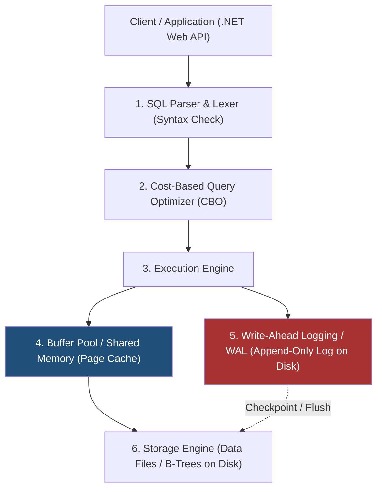
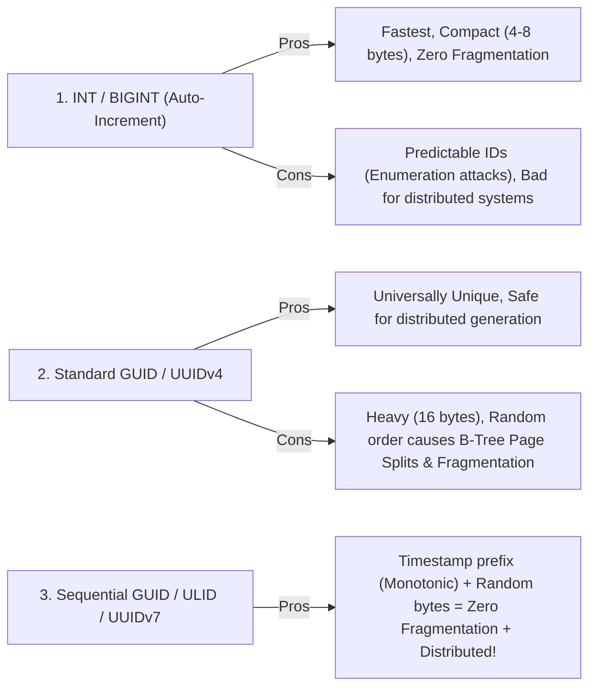
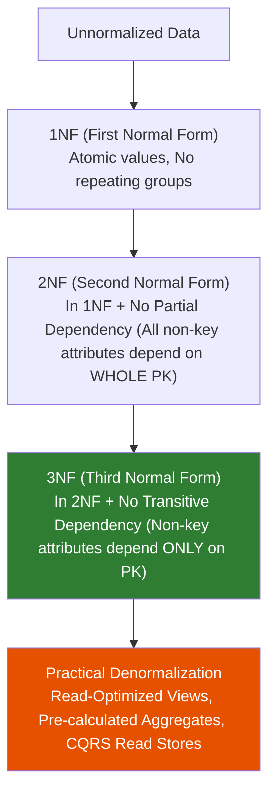

# 01 - Database Fundamentals & Relational Data Modeling

## 1. RDBMS Architecture: What Happens Under the Hood?

A Relational Database Management System (such as **PostgreSQL, Microsoft SQL Server, MySQL, or SQLite**) is a complex storage and execution engine designed for reliable, high-speed data persistence.



### Core Engine Components:

1. **Query Optimizer (CBO)**: Analyzes table statistics, available indexes, and data distribution to generate the cheapest **Execution Plan**.
2. **Buffer Pool (Cache)**: Keeps database pages (typically 8KB chunks) in memory to avoid costly physical disk reads.
3. **Write-Ahead Log (WAL / Transaction Log)**: Ensures **Durability (ACID)**. Every insert, update, or delete is written sequentially to disk in the WAL *before* modifying data pages in the buffer pool. If the server crashes or power fails, uncommitted changes are rolled back and committed changes are replayed upon restart.
4. **Storage Engine**: Organizes data on disk into pages, extents, and B+Tree structures.

---

## 2. Primary Key Strategies: INT vs GUID vs ULID

Choosing the right Primary Key (PK) strategy is a foundational architectural decision that impacts performance and index fragmentation.



| Strategy | Storage Size | Monotonic (Sequential)? | Distributed Safe? | Index Fragmentation Risk |
| :--- | :--- | :--- | :--- | :--- |
| **`INT / BIGINT Identity`** | 4 / 8 bytes | ✅ Yes | ❌ No (Single coordinator needed) | 🟢 Zero (Always appends to the right) |
| **`GUID (UUIDv4)`** | 16 bytes | ❌ No (Random) | ✅ Yes (Client can generate safely) | 🔴 High (Causes frequent B-Tree page splits) |
| **`Sequential GUID / UUIDv7 / ULID`** | 16 bytes | ✅ Yes (Time-ordered) | ✅ Yes | 🟢 Low (Time prefix maintains B-Tree ordering) |

> [!TIP]
> **Production Best Practice**: In distributed .NET / Clean Architecture systems, prefer **Sequential GUIDs (`Uuid.CreateVersion7()` in .NET 9/10)** or **ULIDs**. This allows client/application-side ID generation before database roundtrips without causing clustered index fragmentation!

---

## 3. Relational Constraints

Constraints protect data integrity at the lowest level of the storage engine:

```sql
CREATE TABLE Customers (
    Id UNIQUEIDENTIFIER PRIMARY KEY DEFAULT NEWSEQUENTIALID(),
    Email NVARCHAR(255) NOT NULL,
    Age INT NOT NULL,
    Status NVARCHAR(50) NOT NULL DEFAULT 'Active',
    CreatedAt DATETIMEOFFSET NOT NULL DEFAULT SYSDATETIMEOFFSET(),

    -- Constraints
    CONSTRAINT UQ_Customers_Email UNIQUE (Email),
    CONSTRAINT CK_Customers_Age CHECK (Age >= 18 AND Age <= 120),
    CONSTRAINT CK_Customers_Status CHECK (Status IN ('Active', 'Suspended', 'Deactivated'))
);
```

- **`PRIMARY KEY`**: Enforces uniqueness and creates a clustered index by default.
- **`FOREIGN KEY`**: Enforces referential integrity between parent and child tables (e.g. `ON DELETE CASCADE` vs `ON DELETE RESTRICT`).
- **`UNIQUE`**: Guarantees no duplicate values across rows.
- **`CHECK`**: Enforces business validation rules directly inside the engine (e.g. `Price > 0`).

---

## 4. Database Normalization (1NF ➔ 3NF) vs. Practical Denormalization

### The Normal Forms:



1. **First Normal Form (1NF)**:
   - Each column contains atomic (indivisible) values.
   - No repeating groups or arrays stored in a single comma-separated column.
2. **Second Normal Form (2NF)**:
   - Must be in 1NF.
   - Eliminates **partial dependencies**: every non-key column must depend on the *entire* composite primary key.
3. **Third Normal Form (3NF)**:
   - Must be in 2NF.
   - Eliminates **transitive dependencies**: non-key columns must not depend on other non-key columns ($A \rightarrow B \rightarrow C$).

---

### When Should You Denormalize?

While 3NF is ideal for **Write-Heavy OLTP** (Online Transaction Processing) systems to eliminate update anomalies, pure 3NF can cause **excessive multi-table JOINs** in high-throughput read operations.

**Valid Scenarios for Denormalization**:

- **E-Commerce Order Snapshots**: Copying `CustomerAddress` and `ProductPriceAtPurchase` directly into the `OrderItems` table to preserve historical integrity even if customer changes address or product price changes later.
- **Pre-Aggregated Totals**: Storing `TotalRevenue` or `ProductCount` directly on a Category row to prevent running expensive `SUM()` / `COUNT()` queries across millions of rows on every home page visit.
- **CQRS Read Databases**: Storing pre-computed JSON read models or read-replica tables tailored specifically for UI display.
