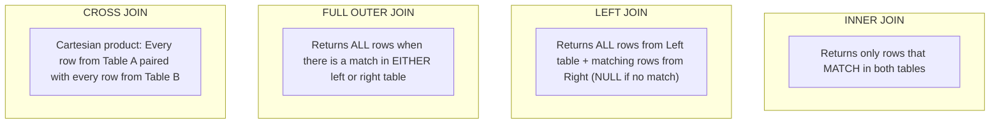

# 02 - SQL Mastery & Advanced Querying

## 1. Set-Based Thinking vs. Procedural Loops

Junior developers often think procedurally (*"Loop through customers, check their orders, calculate total"*). In relational databases, thinking in **sets of rows** allows the query optimizer to parallelize operations across CPU cores and leverage indexed memory structures.

---

## 2. The 6 Types of SQL JOINs



```sql
-- 1. INNER JOIN: Customers who have placed at least one order
SELECT c.Name, o.OrderNumber, o.TotalAmount
FROM Customers c
INNER JOIN Orders o ON c.Id = o.CustomerId;

-- 2. LEFT JOIN: All customers, including those with zero orders
SELECT c.Name, COUNT(o.Id) AS TotalOrders, COALESCE(SUM(o.TotalAmount), 0) AS TotalSpent
FROM Customers c
LEFT JOIN Orders o ON c.Id = o.CustomerId
GROUP BY c.Id, c.Name;

-- 3. ANTI-JOIN (Find customers who NEVER ordered anything)
SELECT c.Name, c.Email
FROM Customers c
LEFT JOIN Orders o ON c.Id = o.CustomerId
WHERE o.Id IS NULL; -- Highly efficient anti-join pattern!
```

---

## 3. Window Functions: The Secret Weapon for Analytics

Window functions perform calculations across a set of table rows that are related to the current row **without collapsing rows like `GROUP BY` does**.

### Key Window Functions:
- **`ROW_NUMBER()`**: Assigns a unique sequential integer (1, 2, 3...) to each row within a partition.
- **`RANK()`**: Assigns ranks with gaps on ties (1, 2, 2, 4...).
- **`DENSE_RANK()`**: Assigns ranks without gaps on ties (1, 2, 2, 3...).
- **`LAG()` / `LEAD()`**: Accesses data from a previous or subsequent row in the same result set without self-joins.

### Practical Example 1: Finding Top 3 Highest Paid Employees per Department
```sql
WITH RankedEmployees AS (
    SELECT
        DepartmentId,
        FullName,
        Salary,
        DENSE_RANK() OVER (
            PARTITION BY DepartmentId
            ORDER BY Salary DESC
        ) AS SalaryRank
    FROM Employees
)
SELECT DepartmentId, FullName, Salary, SalaryRank
FROM RankedEmployees
WHERE SalaryRank <= 3;
```

### Practical Example 2: Month-over-Month Revenue Growth Analysis with `LAG()`
```sql
SELECT
    OrderMonth,
    MonthlyRevenue,
    LAG(MonthlyRevenue, 1) OVER (ORDER BY OrderMonth) AS PreviousMonthRevenue,
    ROUND(
        (MonthlyRevenue - LAG(MonthlyRevenue, 1) OVER (ORDER BY OrderMonth))
        * 100.0 / NULLIF(LAG(MonthlyRevenue, 1) OVER (ORDER BY OrderMonth), 0),
        2
    ) AS GrowthPercentage
FROM MonthlySalesSummary;
```

---

## 4. Common Table Expressions (CTEs) & Recursive CTEs

### Standard CTE (Improving Readability & Query Structure)
```sql
WITH ActiveCustomerOrders AS (
    SELECT CustomerId, SUM(TotalAmount) AS TotalSpent
    FROM Orders
    WHERE Status = 'Completed' AND OrderDate >= '2026-01-01'
    GROUP BY CustomerId
)
SELECT c.Name, c.Email, aco.TotalSpent
FROM Customers c
INNER JOIN ActiveCustomerOrders aco ON c.Id = aco.CustomerId
WHERE aco.TotalSpent > 5000;
```

### Recursive CTE: Hierarchical Organization Chart (Parent-Child Trees)
```sql
-- Traversing an Employee management tree from CEO down to staff
WITH RECURSIVE OrgHierarchy AS (
    -- 1. Anchor Member: Top-level CEO (ManagerId is NULL)
    SELECT Id, Name, ManagerId, 1 AS Level, CAST(Name AS VARCHAR(1000)) AS HierarchyPath
    FROM Employees
    WHERE ManagerId IS NULL

    UNION ALL

    -- 2. Recursive Member: Employees reporting to the previous level
    SELECT e.Id, e.Name, e.ManagerId, o.Level + 1, CAST(o.HierarchyPath || ' -> ' || e.Name AS VARCHAR(1000))
    FROM Employees e
    INNER JOIN OrgHierarchy o ON e.ManagerId = o.Id
)
SELECT Level, HierarchyPath, Name
FROM OrgHierarchy
ORDER BY HierarchyPath;
```

---

## 5. Performance Comparison: `IN` vs. `EXISTS` vs. `JOIN`

```sql
-- Pattern A: IN Subquery (Can be slow if subquery returns NULL or millions of rows)
SELECT * FROM Customers WHERE Id IN (SELECT CustomerId FROM Orders WHERE TotalAmount > 1000);

-- Pattern B: EXISTS (Stops scanning immediately upon first match - Short-Circuiting!)
SELECT * FROM Customers c
WHERE EXISTS (
    SELECT 1 FROM Orders o
    WHERE o.CustomerId = c.Id AND o.TotalAmount > 1000
);
```

> [!TIP]
> **Performance Rule**: Use `EXISTS` when checking for existence in high-volume tables. `EXISTS` performs a **semi-join** and terminates scanning the inner table as soon as a single matching row is located.
