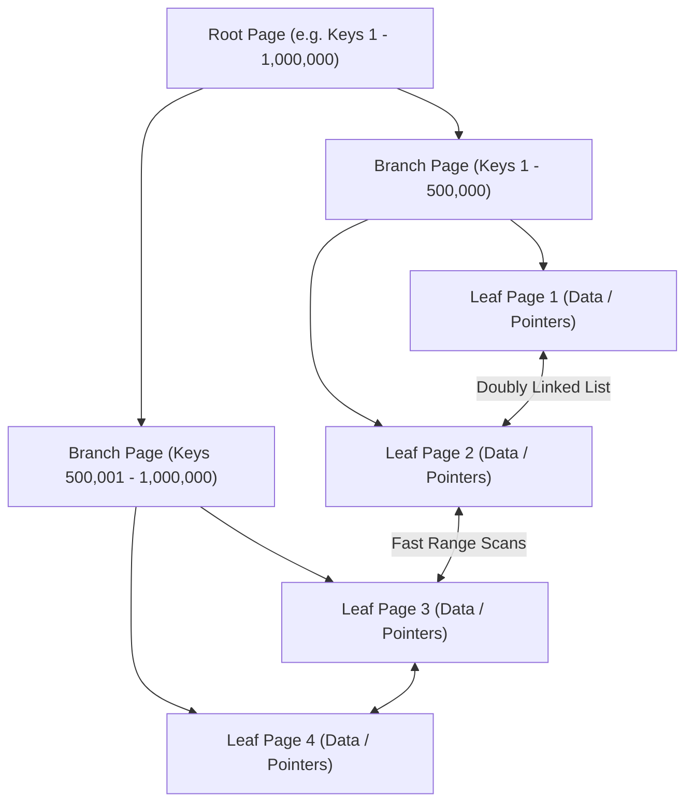
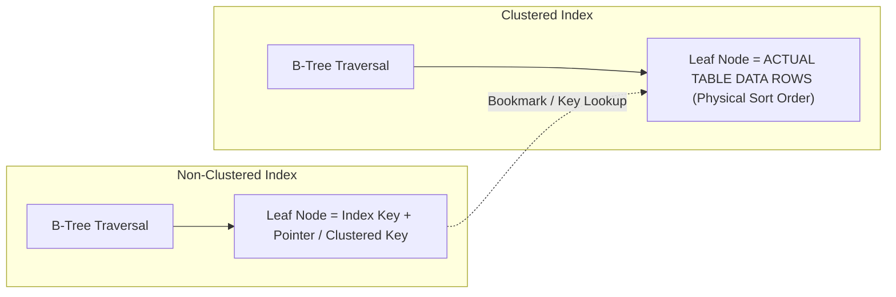
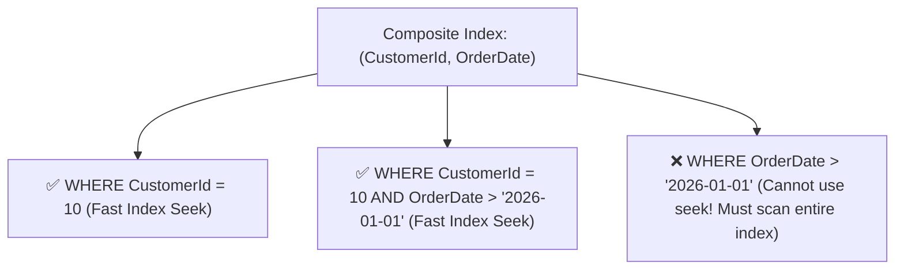

# 03 - Indexing Strategies & Query Optimization

## 1. How Indexes Work Internally: The B+Tree Structure

Most relational database indexes use a **B+Tree** (Balanced Tree) data structure. A B+Tree guarantees that finding any row in a table with 100 million rows requires only **3 to 4 page reads (I/O operations)**!



### Why B+Trees are ideal for databases:
- **Balanced Depth**: The tree is auto-balanced. Lookup time is always $O(\log N)$.
- **Doubly-Linked Leaf Nodes**: Range queries (`WHERE CreatedAt >= '2026-01-01' AND CreatedAt <= '2026-01-31'`) jump directly to the start key and traverse sequentially across leaf nodes without re-navigating the root tree!

---

## 2. Clustered vs. Non-Clustered Indexes



| Feature | Clustered Index (Primary Key) | Non-Clustered Index (Secondary Indexes) |
| :--- | :--- | :--- |
| **Physical Storage** | Dictates the physical order of table rows on disk. | Separate B+Tree structure pointing back to table rows. |
| **Max per Table** | **Only 1** per table (data can only be sorted one way physically). | **Multiple** (typically 5 to 15 per table). |
| **Leaf Node Content** | Contains the **entire data row** (all columns). | Contains only the indexed columns + row locator pointer. |
| **Lookup Speed** | Fastest (0 extra lookups). | Requires a **Key Lookup / Bookmark Lookup** if query asks for columns not in index. |

---

## 3. Composite Indexes & The Leftmost Prefix Rule

When indexing multiple columns `CREATE INDEX IX_Orders_Cust_Date ON Orders(CustomerId, OrderDate)`:



> [!IMPORTANT]
> **The Leftmost Prefix Rule**: The database engine can only use a composite index if the query filters by the **leftmost column(s)** first. If you omit the first column (`CustomerId`), the index cannot be searched via Index Seek.

---

## 4. Covering Indexes with `INCLUDE` Columns

A **Covering Index** contains **every column** requested by a `SELECT` query, completely eliminating the expensive **Key Lookup / Bookmark Lookup** back to the clustered index!

```sql
-- ❌ Without INCLUDE: Engine finds matching rows in index, then does 50,000 Key Lookups for TotalAmount!
CREATE NONCLUSTERED INDEX IX_Orders_CustomerId ON Orders(CustomerId);

SELECT CustomerId, OrderDate, TotalAmount
FROM Orders
WHERE CustomerId = 42;

-- ✅ With INCLUDE: TotalAmount is attached directly to leaf nodes without inflating B-Tree branches!
CREATE NONCLUSTERED INDEX IX_Orders_CustomerId_Covering
ON Orders(CustomerId, OrderDate)
INCLUDE (TotalAmount, Status);
```

---

## 5. Filtered / Partial Indexes (Cost-Efficient)

If a table has 50 million rows, but 98% have `Status = 'Completed'` and you only query `Status = 'Pending'`, indexing all 50 million rows wastes disk and memory.

```sql
-- Creates an index covering ONLY pending payments (tiny size, blazing speed!)
CREATE NONCLUSTERED INDEX IX_Payments_Pending
ON Payments(CreatedAt, Amount)
WHERE Status = 'Pending';
```

---

## 6. Reading Execution Plans: Seek vs Scan & Join Operators

When debugging slow queries (`EXPLAIN ANALYZE` in PostgreSQL or *Execution Plan* in SQL Server):

| Plan Operator | Performance | Meaning |
| :--- | :--- | :--- |
| **Index Seek** | 🟢 **Best** | Direct B-Tree traversal to pinpoint exact matching rows in $O(\log N)$ time. |
| **Index Scan** | 🟡 **Medium** | Reads the entire leaf level of the index (scanning all index rows). |
| **Table / Clustered Scan** | 🔴 **Slow** | Scans every single page of the physical table on disk ($O(N)$). |
| **Key Lookup / Bookmark Lookup**| 🟡 **Costly** | Jumps from non-clustered index leaf back to clustered table to fetch non-indexed columns. |
| **Nested Loops Join** | 🟢 Fast for small sets | Outer row loop looking up matching inner rows via Index Seek. |
| **Hash Match Join** | 🟡 Fast for large sets | Builds an in-memory hash table of the smaller dataset, probes with larger dataset. |
| **Merge Join** | 🟢 Ultra-fast | Both inputs are pre-sorted by join key; iterates through both streams simultaneously. |

---

## 7. Sargability: Writing Index-Friendly Queries

A query is **Sargable** (*Search Argument Able*) if the query engine can use an Index Seek.

```sql
-- ❌ NON-SARGABLE (Function wraps column -> Forces Full Table Scan!)
SELECT * FROM Users WHERE UPPER(Email) = 'ADMIN@EXAMPLE.COM';
SELECT * FROM Orders WHERE YEAR(OrderDate) = 2026;
SELECT * FROM Customers WHERE PhoneNumber LIKE '%1234';

-- ✅ SARGABLE (Column is naked -> Uses Index Seek!)
SELECT * FROM Users WHERE Email = 'admin@example.com'; -- Case-insensitive collation
SELECT * FROM Orders WHERE OrderDate >= '2026-01-01' AND OrderDate < '2027-01-01';
SELECT * FROM Customers WHERE PhoneNumber LIKE '1234%';
```
