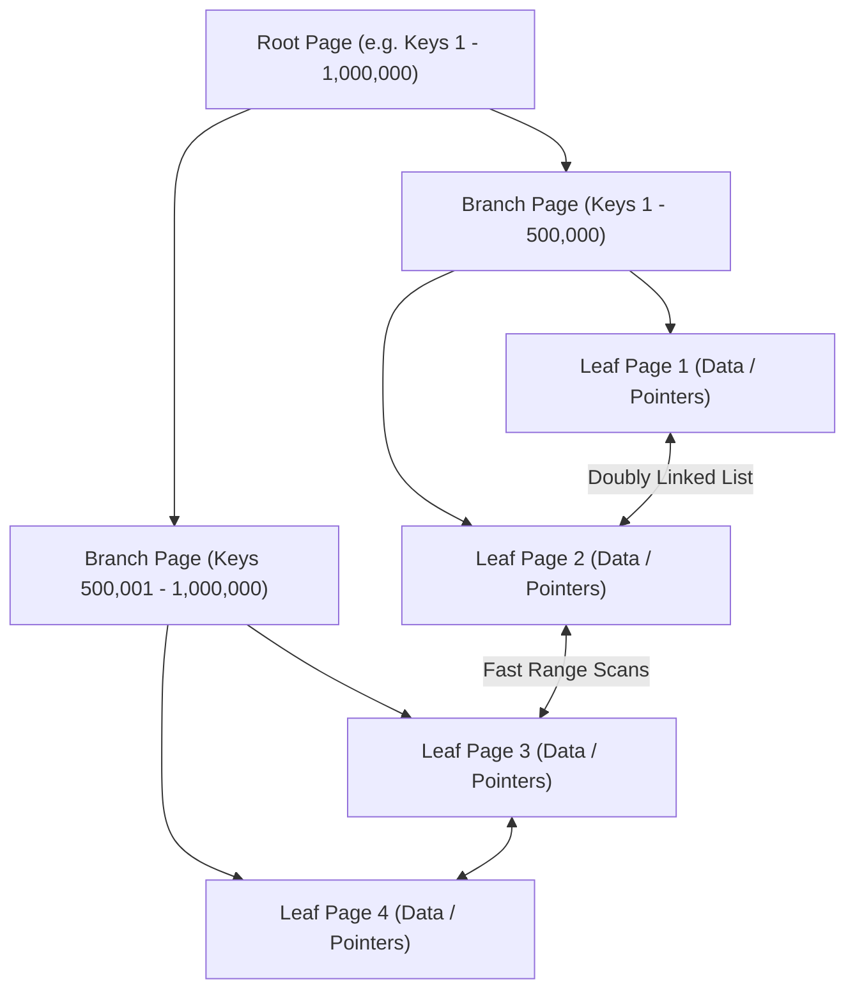
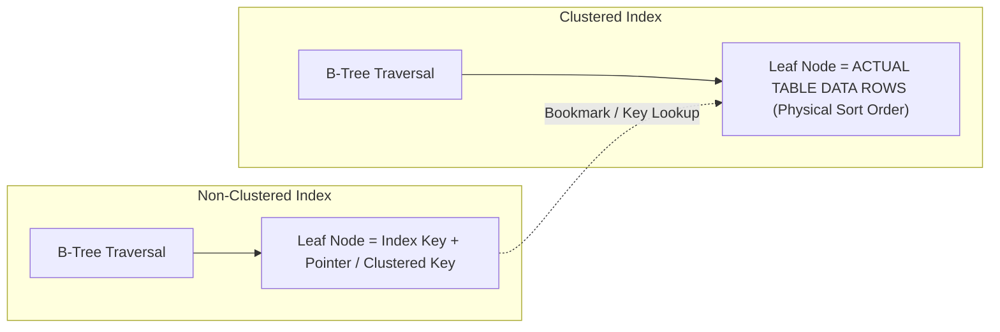
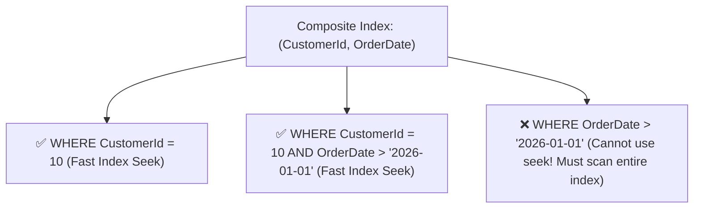
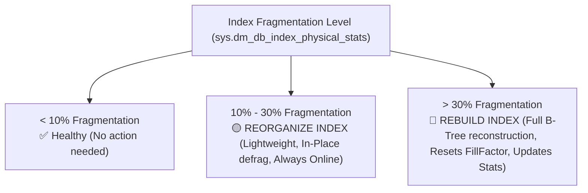
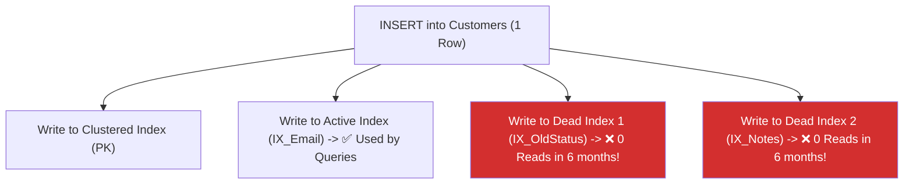

# 03 - Indexing Strategies & Query Optimization

## 1. How Indexes Work Internally: The B+Tree Structure

Most relational database indexes use a **B+Tree** (Balanced Tree) data structure. A B+Tree guarantees that finding any row in a table with 100 million rows requires only **3 to 4 page reads (I/O operations)**!



### Why B+Trees are ideal for databases:
- **Balanced Depth**: The tree is auto-balanced. Lookup time is always $O(\log N)$.
- **Doubly-Linked Leaf Nodes**: Range queries (`WHERE CreatedAt >= '2026-01-01' AND CreatedAt <= '2026-01-31'`) jump directly to the start key and traverse sequentially across leaf nodes without re-navigating the root tree!

---

## 2. Clustered vs. Non-Clustered Indexes



| Feature | Clustered Index (Primary Key) | Non-Clustered Index (Secondary Indexes) |
| :--- | :--- | :--- |
| **Physical Storage** | Dictates the physical order of table rows on disk. | Separate B+Tree structure pointing back to table rows. |
| **Max per Table** | **Only 1** per table (data can only be sorted one way physically). | **Multiple** (typically 5 to 15 per table). |
| **Leaf Node Content** | Contains the **entire data row** (all columns). | Contains only the indexed columns + row locator pointer. |
| **Lookup Speed** | Fastest (0 extra lookups). | Requires a **Key Lookup / Bookmark Lookup** if query asks for columns not in index. |

---

## 3. Composite Indexes & The Leftmost Prefix Rule

When indexing multiple columns `CREATE INDEX IX_Orders_Cust_Date ON Orders(CustomerId, OrderDate)`:



> [!IMPORTANT]
> **The Leftmost Prefix Rule**: The database engine can only use a composite index if the query filters by the **leftmost column(s)** first. If you omit the first column (`CustomerId`), the index cannot be searched via Index Seek.

---

## 4. Covering Indexes with `INCLUDE` Columns

A **Covering Index** contains **every column** requested by a `SELECT` query, completely eliminating the expensive **Key Lookup / Bookmark Lookup** back to the clustered index!

```sql
-- ❌ Without INCLUDE: Engine finds matching rows in index, then does 50,000 Key Lookups for TotalAmount!
CREATE NONCLUSTERED INDEX IX_Orders_CustomerId ON Orders(CustomerId);

SELECT CustomerId, OrderDate, TotalAmount
FROM Orders
WHERE CustomerId = 42;

-- ✅ With INCLUDE: TotalAmount is attached directly to leaf nodes without inflating B-Tree branches!
CREATE NONCLUSTERED INDEX IX_Orders_CustomerId_Covering
ON Orders(CustomerId, OrderDate)
INCLUDE (TotalAmount, Status);
```

---

## 5. Filtered / Partial Indexes (Cost-Efficient)

If a table has 50 million rows, but 98% have `Status = 'Completed'` and you only query `Status = 'Pending'`, indexing all 50 million rows wastes disk and memory.

```sql
-- Creates an index covering ONLY pending payments (tiny size, blazing speed!)
CREATE NONCLUSTERED INDEX IX_Payments_Pending
ON Payments(CreatedAt, Amount)
WHERE Status = 'Pending';
```

---

## 6. Index `FILLFACTOR` & `PAD_INDEX`: Preventing Page Splits

### What is `FILLFACTOR`?
When an index is created or rebuilt, **`FILLFACTOR`** specifies the percentage of space on each **8KB leaf-level page** that the database engine fills with data, reserving the remaining percentage as **empty headroom (free space)** for future `INSERT` and `UPDATE` operations.

```mermaid
graph LR
    subgraph Default: FILLFACTOR = 100% (No Free Space)
        P1["Page 1 (100% Full)"] -->|New mid-page insert arrives| Split["💥 B-Tree Page Split!<br/>Allocates Page 2, moves 50% rows, updates branch pointers (Heavy I/O & Fragmentation)"]
    end

    subgraph Optimized: FILLFACTOR = 80% (20% Headroom)
        P2["Page 1 (80% Data | 20% Free Space)"] -->|New mid-page insert arrives| NoSplit["✅ Fits directly into free space!<br/>Zero page splits, zero I/O spikes!"]
    end
```

### Why Default `FILLFACTOR = 0 / 100` Causes Performance Degradation on Writes:
1. When inserting a row into the middle of a **100% full leaf page** (e.g. inserting random GUIDs or non-sequential text), the page cannot accommodate the row.
2. The storage engine performs an expensive **Page Split**:
   - Allocates a brand-new 8KB page from disk.
   - Moves roughly 50% of the rows from the old page to the new page.
   - Updates the doubly-linked pointers and intermediate branch pages.
   - Writes all these physical changes to the **Write-Ahead Log (WAL)**.
3. Over time, page splits create **High Index Fragmentation** (pages are out of physical order and half-empty), slowing down range scans.

---

### ❓ What if an Old / Existing Index Did NOT Specify `FILLFACTOR`?

When an index was created in the past without specifying `FILLFACTOR`:

1. **Default Value Used**:
   - **In SQL Server**: Defaults to **`0` (which is functionally identical to `100%`)**. The leaf pages were packed 100% full with **0% free space**.
   - **In PostgreSQL**: Defaults to **`90%` for B-Trees** (leaving 10% free headroom for in-place page updates/HOT updates).
   - **In MySQL (InnoDB)**: Defaults to filling **15/16ths (~93.75%)** of each 16KB page, reserving 1/16th for future inserts.

2. **Current State of the Old Index**:
   - Over time, random inserts and updates triggered **B-Tree Page Splits**.
   - The index is now likely **heavily fragmented** (e.g. 40% - 60% fragmentation in `sys.dm_db_index_physical_stats`), meaning the pages are scattered randomly across the disk and are half-empty anyway!

3. **How to Check Current FILLFACTOR & Fragmentation of Existing Indexes**:
```sql
-- SQL Server: Check current fill factor and fragmentation percentage across all tables
SELECT
    OBJECT_NAME(i.object_id) AS TableName,
    i.name AS IndexName,
    i.fill_factor AS [Current_FillFactor], -- 0 or 100 means default 100% full
    ps.avg_fragmentation_in_percent,
    ps.page_count
FROM sys.indexes i
CROSS APPLY sys.dm_db_index_physical_stats(DB_ID(), i.object_id, i.index_id, NULL, 'LIMITED') ps
WHERE i.type > 0 AND ps.page_count > 100
ORDER BY ps.avg_fragmentation_in_percent DESC;
```

4. **How to Fix / Set FILLFACTOR on Existing Indexes (Without Dropping Them)**:
You do **not** need to drop and recreate the index. Rebuilding the index applies the new `FILLFACTOR` and resets fragmentation to **0%**:

```sql
-- SQL Server: Rebuild online with 80% FillFactor (Leaves 20% headroom and fixes fragmentation)
ALTER INDEX [IX_Orders_CustomerId]
ON [Orders] REBUILD
WITH (FILLFACTOR = 80, ONLINE = ON);

-- Rebuild ALL indexes on an entire table with 80% FillFactor:
ALTER INDEX ALL ON [Orders] REBUILD
WITH (FILLFACTOR = 80, ONLINE = ON);
```

```sql
-- PostgreSQL: Reindex with new fillfactor
ALTER INDEX idx_orders_customerid SET (fillfactor = 80);
REINDEX INDEX CONCURRENTLY idx_orders_customerid;
```

---

## 7. Index Maintenance: Reorganize vs. Rebuild & Statistics

Over time, daily `INSERT`, `UPDATE`, and `DELETE` operations cause **Index Fragmentation** (logical page ordering no longer matches physical disk ordering).



### `ALTER INDEX REORGANIZE` vs `ALTER INDEX REBUILD`:

| Feature | `ALTER INDEX REORGANIZE` | `ALTER INDEX REBUILD` |
| :--- | :--- | :--- |
| **Fragmentation Threshold**| **10% to 30%** | **> 30%** |
| **How it Works** | Defragments existing leaf pages in-place; compacts pages. | Drops and recreates the entire B+Tree from scratch. |
| **Locks & Availability** | Always fully **ONLINE** (no table locks). | Supports `ONLINE = ON` (Enterprise/Standard editions). |
| **Applies `FILLFACTOR`?** | ❌ No (Preserves existing page fills). | ✅ **Yes** (Repacks all pages to new `FILLFACTOR`). |
| **Updates Statistics?** | ❌ No (Must run `UPDATE STATISTICS` separately).| ✅ **Yes** (Automatically updates stats with FullScan).|
| **Resource & Log Impact**| Very low CPU & minimal transaction log usage. | High CPU, high I/O, substantial transaction log generation. |

### SQL Maintenance Commands:
```sql
-- 1. Reorganize index (Lightweight maintenance for 10-30% fragmentation)
ALTER INDEX IX_Orders_CustomerId ON Orders REORGANIZE;

-- 2. Rebuild index (Heavy maintenance for > 30% fragmentation)
ALTER INDEX IX_Orders_CustomerId ON Orders REBUILD WITH (FILLFACTOR = 80, ONLINE = ON);

-- 3. Always update statistics after REORGANIZE:
UPDATE STATISTICS Orders IX_Orders_CustomerId WITH FULLSCAN;
```

---

## 8. Identifying Unused, Ineffective & Duplicate Indexes

### ⚠️ Why Unused Indexes are Dangerous:
Indexes are not free! Every time an application runs an `INSERT`, `UPDATE`, or `DELETE`, the database engine must **lock, write, and maintain every single index on that table**.
- If a table has 15 indexes and 8 are never used by queries, **write throughput drops by 50%+**, disk space is wasted, and the Buffer Pool memory cache is bloated with useless index pages!



---

### 🔍 1. Query to Find Unused / Ineffective Indexes (High Writes, Zero Reads)

In **SQL Server**, `sys.dm_db_index_usage_stats` tracks every Index Seek, Scan, Lookup, and Update since the server was last restarted:

```sql
-- Finds indexes that have heavy write maintenance (updates) but ZERO or almost ZERO read usage:
SELECT
    OBJECT_SCHEMA_NAME(i.object_id) AS SchemaName,
    OBJECT_NAME(i.object_id) AS TableName,
    i.name AS IndexName,
    i.type_desc AS IndexType,
    (us.user_seeks + us.user_scans + us.user_lookups) AS TotalReads,
    us.user_updates AS TotalWrites,
    ps.page_count * 8 / 1024 AS IndexSizeMB,
    'DROP INDEX ' + QUOTENAME(i.name) + ' ON ' + QUOTENAME(OBJECT_SCHEMA_NAME(i.object_id)) + '.' + QUOTENAME(OBJECT_NAME(i.object_id)) + ';' AS DropStatement
FROM sys.indexes i
LEFT JOIN sys.dm_db_index_usage_stats us
    ON i.object_id = us.object_id
    AND i.index_id = us.index_id
    AND us.database_id = DB_ID()
CROSS APPLY sys.dm_db_index_physical_stats(DB_ID(), i.object_id, i.index_id, NULL, 'LIMITED') ps
WHERE i.type > 0 -- Exclude Heaps
  AND i.is_primary_key = 0 -- Never drop Primary Keys
  AND i.is_unique = 0 -- Never drop Unique Constraints
  AND (us.user_seeks + us.user_scans + us.user_lookups) = 0 -- Zero reads!
  AND us.user_updates > 500 -- Significant write overhead
ORDER BY us.user_updates DESC;
```

In **PostgreSQL**:
```sql
-- Find unused indexes in PostgreSQL (idx_scan = 0)
SELECT
    schemaname || '.' || relname AS table_name,
    indexrelname AS index_name,
    pg_size_pretty(pg_relation_size(i.indexrelid)) AS index_size,
    idx_scan AS number_of_scans
FROM pg_stat_user_indexes i
JOIN pg_index USING (indexrelid)
WHERE indisunique = false -- Exclude unique constraints
  AND idx_scan = 0 -- Zero scans!
ORDER BY pg_relation_size(i.indexrelid) DESC;
```

---

### 🔍 2. Finding Duplicate & Overlapping Redundant Indexes

An index is **duplicate / redundant** if another index already contains its leading columns in the same order:
- **Index A**: `(CustomerId)`
- **Index B**: `(CustomerId, OrderDate)`
- **Problem**: Index A is 100% redundant! The database engine can use **Index B** for any query filtering by `CustomerId` (via the Leftmost Prefix Rule). Index A should be dropped immediately to save disk and write I/O.

---

### 🔍 3. Finding Missing Indexes with Database DMVs

The database engine tracks every query that suffered from a missing index:

```sql
-- SQL Server: Top 10 Missing Indexes by Estimated Impact
SELECT TOP 10
    ROUND(s.avg_total_user_cost * s.avg_user_impact * (s.user_seeks + s.user_scans), 0) AS TotalImprovementScore,
    d.statement AS TableName,
    'CREATE NONCLUSTERED INDEX [IX_' + OBJECT_NAME(d.object_id) + '_' + REPLACE(REPLACE(REPLACE(ISNULL(d.equality_columns, '') + '_' + ISNULL(d.inequality_columns, ''), '[', ''), ']', ''), ', ', '_') + '] ON '
    + d.statement + ' (' + ISNULL(d.equality_columns, '')
    + CASE WHEN d.equality_columns IS NOT NULL AND d.inequality_columns IS NOT NULL THEN ', ' ELSE '' END
    + ISNULL(d.inequality_columns, '') + ')'
    + ISNULL(' INCLUDE (' + d.included_columns + ')', '') + ' WITH (ONLINE = ON);' AS SuggestedCreateIndexScript
FROM sys.dm_db_missing_index_groups g
JOIN sys.dm_db_missing_index_group_stats s ON s.group_handle = g.index_group_handle
JOIN sys.dm_db_missing_index_details d ON d.index_handle = g.index_handle
ORDER BY TotalImprovementScore DESC;
```

---

## 9. Reading Execution Plans: Seek vs Scan & Join Operators

When debugging slow queries (`EXPLAIN ANALYZE` in PostgreSQL or *Execution Plan* in SQL Server):

| Plan Operator | Performance | Meaning |
| :--- | :--- | :--- |
| **Index Seek** | 🟢 **Best** | Direct B-Tree traversal to pinpoint exact matching rows in $O(\log N)$ time. |
| **Index Scan** | 🟡 **Medium** | Reads the entire leaf level of the index (scanning all index rows). |
| **Table / Clustered Scan** | 🔴 **Slow** | Scans every single page of the physical table on disk ($O(N)$). |
| **Key Lookup / Bookmark Lookup**| 🟡 **Costly** | Jumps from non-clustered index leaf back to clustered table to fetch non-indexed columns. |
| **Nested Loops Join** | 🟢 Fast for small sets | Outer row loop looking up matching inner rows via Index Seek. |
| **Hash Match Join** | 🟡 Fast for large sets | Builds an in-memory hash table of the smaller dataset, probes with larger dataset. |
| **Merge Join** | 🟢 Ultra-fast | Both inputs are pre-sorted by join key; iterates through both streams simultaneously. |

---

## 10. Sargability: Writing Index-Friendly Queries

A query is **Sargable** (*Search Argument Able*) if the query engine can use an Index Seek.

```sql
-- ❌ NON-SARGABLE (Function wraps column -> Forces Full Table Scan!)
SELECT * FROM Users WHERE UPPER(Email) = 'ADMIN@EXAMPLE.COM';
SELECT * FROM Orders WHERE YEAR(OrderDate) = 2026;
SELECT * FROM Customers WHERE PhoneNumber LIKE '%1234';

-- ✅ SARGABLE (Column is naked -> Uses Index Seek!)
SELECT * FROM Users WHERE Email = 'admin@example.com'; -- Case-insensitive collation
SELECT * FROM Orders WHERE OrderDate >= '2026-01-01' AND OrderDate < '2027-01-01';
SELECT * FROM Customers WHERE PhoneNumber LIKE '1234%';
```
