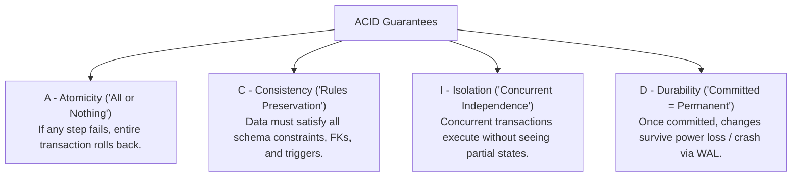
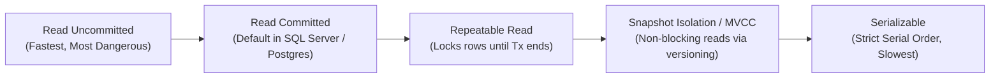
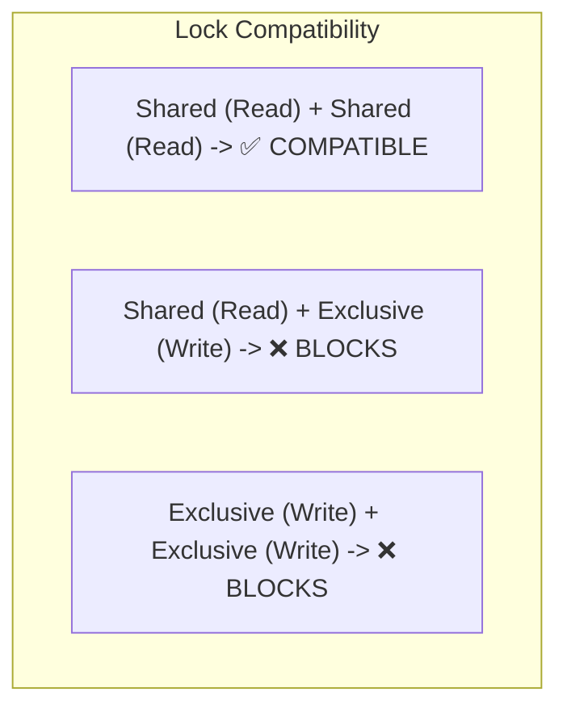

# 04 - Transactions, ACID Properties & Isolation Levels

## 1. The ACID Properties Demystified

A database **Transaction** is a logical unit of work that must satisfy four properties:



---

## 2. The 4 Concurrency Anomalies

When multiple transactions execute concurrently without proper isolation:

| Anomaly | Scenario Description |
| :--- | :--- |
| **Dirty Read** | Transaction A updates a balance from $100 to $200 (uncommitted). Transaction B reads $200. Transaction A **rolls back**. Transaction B acted on "dirty" phantom data! |
| **Non-Repeatable Read** | Transaction A reads balance = $100. Transaction B updates balance to $150 and commits. Transaction A re-reads the exact same row and sees $150! (Value changed during same transaction). |
| **Phantom Read** | Transaction A queries `WHERE Age > 30` (returns 10 rows). Transaction B inserts a new person with `Age = 35` and commits. Transaction A re-runs query and gets **11 rows**! |
| **Serialization Anomaly** | Two concurrent transactions execute valid state updates independently, but the combined result produces an impossible business state (e.g. overdrafting a joint bank account). |

---

## 3. SQL Standard Isolation Levels Matrix



| Isolation Level | Dirty Reads? | Non-Repeatable Reads? | Phantom Reads? | Mechanism |
| :--- | :---: | :---: | :---: | :--- |
| **`READ UNCOMMITTED`** | ⚠️ Yes | ⚠️ Yes | ⚠️ Yes | Reads without acquiring Shared (S) locks. |
| **`READ COMMITTED`** | 🛡️ **No** | ⚠️ Yes | ⚠️ Yes | Releases Shared (S) locks immediately after reading page. |
| **`REPEATABLE READ`** | 🛡️ **No** | 🛡️ **No** | ⚠️ Yes | Holds Shared (S) locks until transaction ends. |
| **`SNAPSHOT` (MVCC)** | 🛡️ **No** | 🛡️ **No** | 🛡️ **No** | Multi-Version Concurrency: Reads row version snapshot from `tempdb` / WAL without locking writers! |
| **`SERIALIZABLE`** | 🛡️ **No** | 🛡️ **No** | 🛡️ **No** | Uses Range Locks (`Key-Range Locks`) to prevent row insertions. |

---

## 4. Locking Mechanisms: Shared (S) vs. Exclusive (X) Locks



- **Shared Lock (S)**: Acquired when reading data. Multiple concurrent readers can hold S locks on the same row.
- **Exclusive Lock (X)**: Acquired when modifying data (`INSERT`, `UPDATE`, `DELETE`). Only 1 transaction can hold an X lock; all readers and writers are blocked.
- **Intent Locks (IS, IX)**: Placed on tables and pages to signal that a lock exists on child rows, preventing table-level lock conflicts.

### Deadlocks
A deadlock occurs when Transaction 1 holds Lock A and waits for Lock B, while Transaction 2 holds Lock B and waits for Lock A. The database engine periodically runs a **Deadlock Monitor** thread, selects the cheapest transaction as the **Deadlock Victim**, and aborts/rolls it back.

---

## 5. Optimistic Concurrency vs. Pessimistic Concurrency

```mermaid
graph LR
    subgraph Optimistic Concurrency (.NET Standard)
        O1["Read entity + RowVersion token"] --> O2["Process in memory"] --> O3["UPDATE ... WHERE Id = @Id AND Version = @OrigVersion"]
        O3 -->|Match| O_OK["Commit Success!"]
        O3 -->|Mismatch| O_FAIL["DbUpdateConcurrencyException -> Retry or Alert User!"]
    end

    subgraph Pessimistic Concurrency
        P1["SELECT ... WITH (UPDLOCK, ROWLOCK)"] --> P2["Acquires Exclusive Lock immediately"] --> P3["All other users wait until Tx completes"]
    end
```

### 1. Optimistic Concurrency in EF Core 10 (High Scalability):
```csharp
public class ProductItem
{
    public int Id { get; set; }
    public string Name { get; set; } = string.Empty;
    public decimal Price { get; set; }

    // Concurrency Token (Auto-incremented byte array on every SQL update)
    [Timestamp]
    public byte[] RowVersion { get; set; } = [];
}
```

When two users edit product #1 simultaneously:
- User A saves first: `UPDATE Products SET Price = 100 WHERE Id = 1 AND RowVersion = 0x01` (Succeeds, updates RowVersion to `0x02`).
- User B saves second: `UPDATE Products SET Price = 120 WHERE Id = 1 AND RowVersion = 0x01` (0 rows affected ➔ EF Core throws `DbUpdateConcurrencyException`).

### 2. Pessimistic Concurrency (For high-conflict financial transactions):
```sql
BEGIN TRANSACTION;
-- Locks the row so nobody else can read for update or modify until we commit
SELECT Balance FROM Accounts WITH (UPDLOCK, ROWLOCK) WHERE Id = 101;

UPDATE Accounts SET Balance = Balance - 50 WHERE Id = 101;
COMMIT TRANSACTION;
```
