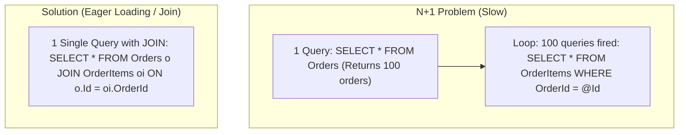

# 05 - Entity Framework Core 10 Deep-Dive & Best Practices

## 1. EF Core Architecture & Change Tracker Internals

**Entity Framework Core (EF Core 10)** is an Object-Relational Mapper (ORM). When you query data with EF Core:

```mermaid
graph TD
    Query["LINQ Query: context.Products.Where(...)"] --> Compiler["1. LINQ Expression Tree Parser"]
    Compiler --> SqlGen["2. SQL Translator & Parameterizer"]
    SqlGen --> DB["3. Database Execution (ADO.NET DbCommand)"]
    DB --> Reader["4. Data Materialization (DbDataReader -> C# Objects)"]
    Reader --> Tracker{"Tracking Enabled?"}
    Tracker -->|Yes| ChangeTracker["5. Change Tracker stores Snapshot in memory"]
    Tracker -->|No (AsNoTracking)| DirectReturn["6. Direct Return (Zero tracking overhead!)"]

    style DirectReturn fill:#2e7d32,color:#fff
```

### The Change Tracker:

When an entity is tracked, EF Core creates a **snapshot** of its original values in memory. During `context.SaveChangesAsync()`:

1. EF Core runs **DetectChanges()** comparing current properties against the original snapshot.
2. It constructs an optimized SQL `UPDATE` statement containing **only modified columns**.
3. It bundles multiple inserts/updates into a single batched database roundtrip.

---

## 2. Read Optimization: `AsNoTracking()` vs `AsNoTrackingWithIdentityResolution()`

```csharp
// ❌ SLOW for Read-Only APIs (Wastes CPU & RAM allocating tracking snapshots):
var products = await context.Products.ToListAsync();

// ✅ FAST for Read-Only APIs (Bypasses Change Tracker completely! Up to 3x faster):
var products = await context.Products.AsNoTracking().ToListAsync();

// 🌟 BEST for Graphs with duplicate references (Maintains single C# instance per DB row without tracking overhead):
var orders = await context.Orders
    .Include(o => o.Customer)
    .AsNoTrackingWithIdentityResolution()
    .ToListAsync();
```

---

## 3. The N+1 Query Problem & Loading Strategies

The **N+1 Problem** occurs when an application executes 1 initial query to fetch parent rows, then fires $N$ subsequent queries (one for each parent) to fetch child rows in a loop.



### Loading Strategies Compared:

| Strategy | Syntax | SQL Generated | Use Case |
| :--- | :--- | :--- | :--- |
| **Eager Loading** | `.Include(o => o.Items)` | Single `LEFT JOIN` | When child collection is always required. |
| **Split Queries** | `.AsSplitQuery()` | 1 query for Orders + 1 query for Items | Prevents **Cartesian Explosion** when including multiple large collections. |
| **Projection (DTO)** | `.Select(o => new Dto { ... })` | Exact columns requested | 🚀 **Highest Performance** (Fetches only required columns). |
| **Explicit Loading** | `context.Entry(order).Collection(o => o.Items).LoadAsync()` | On-demand query | Loading children conditionally after parent is loaded. |

### Code Example: Avoiding Cartesian Explosion with `AsSplitQuery()`

```csharp
// Without AsSplitQuery: 1 Order with 10 Items and 5 Tags produces 50 rows in the DB result set!
var orderDetails = await context.Orders
    .Include(o => o.Items)
    .Include(o => o.Tags)
    .AsSplitQuery() // Executes 2 clean, fast queries instead of 1 giant cartesian product join!
    .AsNoTracking()
    .FirstOrDefaultAsync(o => o.Id == orderId);
```

---

## 4. DTO Projections: The Gold Standard for Queries

```csharp
// 🌟 The Most Efficient Way to Query in Clean Architecture:
public async Task<List<ProductDto>> GetTopSellingProductsAsync(CancellationToken ct)
{
    return await context.Products
        .Where(p => p.StockQuantity > 0)
        .OrderByDescending(p => p.Price)
        .Select(p => new ProductDto(
            p.Id,
            p.Name,
            p.Category,
            p.Price,
            p.StockQuantity
        ))
        .ToListAsync(ct);
}
```

*SQL generated selects **only** `Id, Name, Category, Price, StockQuantity`—zero extra columns or tracking overhead!*

---

## 5. Global Query Filters (Soft-Delete & Multi-Tenancy)

Global Query Filters automatically inject `WHERE` clauses into every LINQ query across the application.

```csharp
public class AppDbContext : DbContext
{
    public Guid CurrentTenantId { get; set; }

    protected override void OnModelCreating(ModelBuilder modelBuilder)
    {
        // 1. Soft-Delete Filter
        modelBuilder.Entity<ProductItem>()
            .HasQueryFilter(p => !p.IsDeleted);

        // 2. Multi-Tenant Filter
        modelBuilder.Entity<Customer>()
            .HasQueryFilter(c => c.TenantId == CurrentTenantId);
    }
}
```

### Temporarily Bypassing Filters (e.g. Admin Restore / Super-Admin View):

```csharp
// Ignores soft-delete filter to show all products including deleted ones
var allProducts = await context.Products
    .IgnoreQueryFilters()
    .ToListAsync();
```

---

## 6. Value Objects & Owned Entities in EF Core 10

In Domain-Driven Design (DDD), a **Value Object** has no conceptual identity of its own (e.g. `Money`, `Address`).

```csharp
// Value Object
public record Address(string Street, string City, string ZipCode, string Country);

// Entity Configuration
public class CustomerConfiguration : IEntityTypeConfiguration<Customer>
{
    public void Configure(EntityTypeBuilder<Customer> builder)
    {
        // Maps Address properties directly into Customers table columns (Street, City, ZipCode, Country)
        builder.OwnsOne(c => c.ShippingAddress, a =>
        {
            a.Property(p => p.Street).HasMaxLength(200).HasColumnName("Shipping_Street");
            a.Property(p => p.City).HasMaxLength(100).HasColumnName("Shipping_City");
        });
    }
}
```
