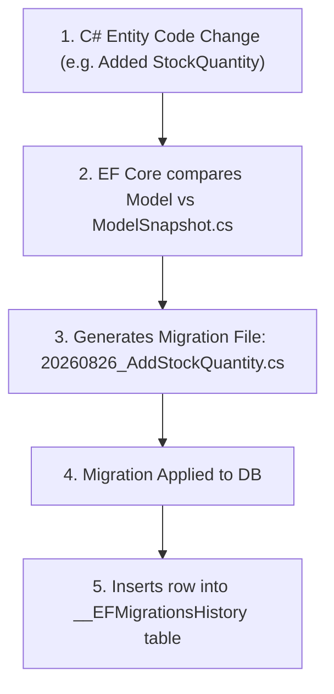

# 07 - Database Migrations, Versioning & Zero-Downtime CI/CD

## 1. EF Core Migrations Architecture

EF Core Migrations convert C# model changes into versioned, deterministic database schema changes.



- **`ModelSnapshot.cs`**: Stores the complete C# representation of the database schema as of the latest migration.
- **`__EFMigrationsHistory` table**: A metadata table inside the database that tracks which migration scripts have already executed.

---

## 2. Generating Idempotent SQL Scripts for Production CI/CD

Applying migrations on API startup using `context.Database.Migrate()` in production is **dangerous** because:
1. Multiple API instances scaling up simultaneously will create race conditions on schema locks.
2. It requires production database `DDL` (admin) permissions on the runtime application user.

### ✅ The Production CI/CD Standard:
Generate an **Idempotent SQL Script** at build time and execute it via your CI/CD pipeline (Azure DevOps / GitHub Actions):

```powershell
# Generates an idempotent SQL script containing IF NOT EXISTS checks for each migration:
dotnet ef migrations script --idempotent -o ./deploy/migrate.sql --project src/CleanArch.Infrastructure --startup-project src/CleanArch.WebApi
```

Sample generated script structure:
```sql
IF NOT EXISTS (SELECT * FROM [__EFMigrationsHistory] WHERE [MigrationId] = N'20260826_AddStockQuantity')
BEGIN
    ALTER TABLE [Products] ADD [StockQuantity] int NOT NULL DEFAULT 0;
    INSERT INTO [__EFMigrationsHistory] ([MigrationId], [ProductVersion]) VALUES (N'20260826_AddStockQuantity', N'10.0.0');
END;
```

---

## 3. Zero-Downtime Schema Evolution: The Expand & Contract Pattern

When deploying new versions of an application with database changes, the old version of the app and the new version of the app often run simultaneously for several minutes (Blue/Green or Rolling deployment).

### ❌ Breaking Change (Renaming a column directly):
If you rename `Customer.Name` to `Customer.FullName` in one migration:
- The old app immediately crashes because `Name` no longer exists!

### ✅ The Expand and Contract Solution (3-Phase Deployment):

```mermaid
graph TD
    subgraph Phase 1: Expand (Non-Breaking)
        P1["1. Add new column FullName nullable<br/>2. Add DB trigger / dual-write to populate both Name & FullName<br/>3. Deploy App Version 1.1 (reads from Name, writes to both)"]
    end

    subgraph Phase 2: Migrate
        P2["4. Backfill existing historical data from Name -> FullName<br/>5. Deploy App Version 1.2 (reads & writes exclusively to FullName)"]
    end

    subgraph Phase 3: Contract (Cleanup)
        P3["6. Remove dual-write logic<br/>7. Drop old Name column in final migration"]
    end

    Phase 1 --> Phase 2 --> Phase 3
```

---

## 4. Safe Database Migration Rules for Developers

1. **Never add a non-nullable column without a default value** on an existing table with millions of rows.
2. **Never rename columns or tables directly** in production; follow Expand & Contract.
3. **Always create indexes with `CONCURRENTLY`** (in PostgreSQL) or `ONLINE = ON` (in SQL Server) to avoid locking read/write traffic during index builds.
4. **Data Migrations vs Schema Migrations**: Do not execute long-running data backfills (updating 50 million rows) inside an EF Core schema migration transaction. Perform batch updates via background jobs.
