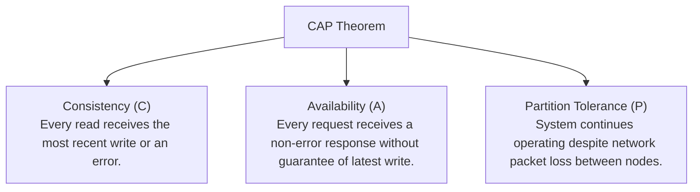
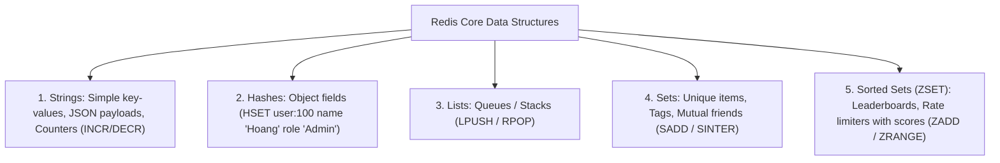
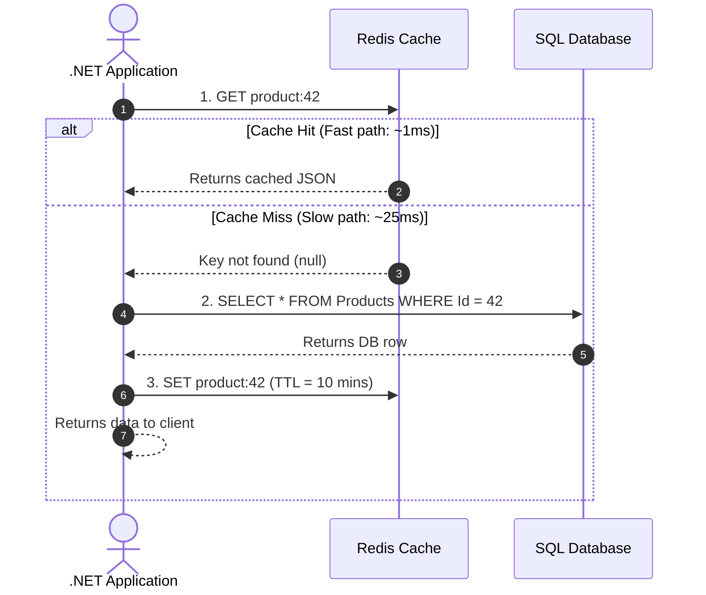

# 08 - NoSQL Databases & Distributed Caching with Redis

## 1. When to Choose SQL vs. NoSQL?

The **CAP Theorem** dictates that a distributed data store can guarantee at most two of the following three properties:



| Trait | Relational Databases (SQL / RDBMS) | NoSQL Document (MongoDB / Cosmos DB) | Distributed Cache (Redis) |
| :--- | :--- | :--- | :--- |
| **Data Structure** | Normalized tables, schemas, relations | Flexible JSON documents (BSON) | Key-Value, In-Memory Data Structures |
| **Best For** | Complex JOINs, financial transactions, ACID compliance | Dynamic schema catalogs, event payloads, CMS | Sub-millisecond reads, session storage, rate limiting |
| **Scaling** | Vertical scale-up (or Read Replicas) | Horizontal scale-out (Sharding) | Cluster Sharding & In-Memory replicas |

---

## 2. Redis Architecture & Core Data Structures

**Redis** (Remote Dictionary Server) is an open-source, in-memory key-value data structure store capable of executing over **100,000 operations per second per core**.



---

## 3. The 4 Essential Caching Patterns

### 1. Cache-Aside Pattern (Standard Web API Pattern)


### 2. Write-Through & Write-Behind (Write-Back)
- **Write-Through**: Application writes to Cache, and Cache synchronously writes to Database.
- **Write-Behind**: Application writes to Cache immediately, and a background worker batches updates asynchronously to the Database (blazing speed, risk of data loss if cache dies before sync).

---

## 4. Preventing the 3 Major Cache Traps

| Problem | Cause | Enterprise Solution |
| :--- | :--- | :--- |
| **Cache Stampede / Thundering Herd** | A popular cached key expires, and 5,000 concurrent requests all miss the cache and hit the database at the same time. | **Distributed Locking (RedLock)** or **Probabilistic Early Expiration (XFetch)** / Mutex lock. |
| **Cache Penetration** | Attackers query non-existent keys (e.g. `GET /api/products/-99999`), bypassing cache and hitting DB on every request. | **Cache NULL values** with a short TTL (e.g. 60s) or use a **Bloom Filter**. |
| **Cache Breakdown** | A single hot key (e.g. Flash sale item) expires during peak traffic. | Background task refreshes key proactively before expiration (*Refresh-Ahead*). |

### Implementing Cache-Aside with Distributed Lock in .NET:
```csharp
public async Task<ProductDto?> GetProductAsync(int id, CancellationToken ct)
{
    var cacheKey = $"product:{id}";

    // 1. Try get from Redis
    var cached = await _distributedCache.GetStringAsync(cacheKey, ct);
    if (!string.IsNullOrEmpty(cached))
    {
        return JsonSerializer.Deserialize<ProductDto>(cached);
    }

    // 2. Cache Miss -> Query Database
    var product = await _dbContext.Products
        .AsNoTracking()
        .Where(p => p.Id == id)
        .Select(p => new ProductDto(p.Id, p.Name, p.Category, p.Price, p.StockQuantity))
        .FirstOrDefaultAsync(ct);

    if (product != null)
    {
        // 3. Save to Redis with Sliding & Absolute Expiration
        var options = new DistributedCacheEntryOptions
        {
            AbsoluteExpirationRelativeToNow = TimeSpan.FromMinutes(10),
            SlidingExpiration = TimeSpan.FromMinutes(2)
        };
        await _distributedCache.SetStringAsync(cacheKey, JsonSerializer.Serialize(product), options, ct);
    }

    return product;
}
```
