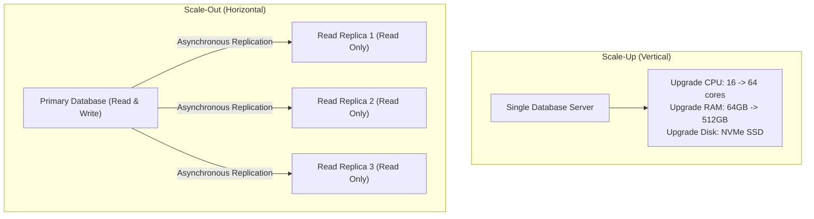
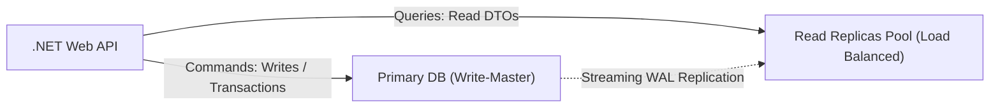
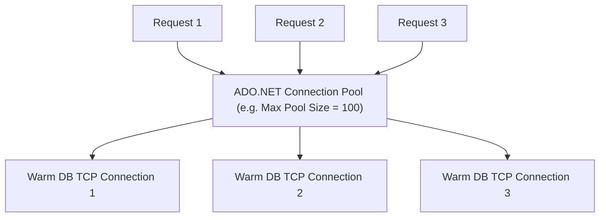

# 09 - Database Scaling, High Availability & Sharding

## 1. Vertical Scaling (Scale-Up) vs. Horizontal Scaling (Scale-Out)



---

## 2. Read Replicas & CQRS Database Architecture

In enterprise applications, **90% to 95% of database traffic consists of read queries (`SELECT`)**.

### Primary / Replica Architecture:
- **Primary Node**: Handles all write operations (`INSERT`, `UPDATE`, `DELETE`, Transactions).
- **Read Replicas**: Multiple read-only nodes synchronized via **WAL streaming replication**.
- **Replication Lag**: Writes to Primary are replicated asynchronously to replicas with slight delay (typically 5ms – 50ms). Read queries must be designed to tolerate **Eventual Consistency**.



---

## 3. Database Connection Pooling

Opening a physical TCP connection to a database requires authentication, TLS handshakes, and process memory allocation (costing 50ms to 100ms per connection).

**Connection Pooling** maintains a pool of warm, authenticated connections:



### Preventing Connection Pool Starvation:
1. **Always wrap connections in `using` statements or let EF Core manage scope** so connections return to the pool immediately upon completion.
2. **Keep transactions as short as possible**. Never perform HTTP calls or heavy CPU computations inside an open database transaction!
3. Avoid setting `Max Pool Size` excessively high; a well-tuned pool of 50 to 100 connections can comfortably handle 10,000 requests/second.

---

## 4. Database Sharding Strategies

When a table grows past hundreds of millions of rows and exceeds single-server capacity, **Sharding** partitions data across independent database servers:

```mermaid
graph TD
    App["Application / Shard Router"]
    App -->|Hash(CustomerId) % 3 == 0| S1["Database Shard 1 (Customers A-H)"]
    App -->|Hash(CustomerId) % 3 == 1| S2["Database Shard 2 (Customers I-P)"]
    App -->|Hash(CustomerId) % 3 == 2| S3["Database Shard 3 (Customers Q-Z)"]
```

| Sharding Strategy | Mechanism | Pros | Cons |
| :--- | :--- | :--- | :--- |
| **Hash-Based Sharding** | `Hash(ShardKey) % NumShards` | Uniform data distribution | Resharding requires moving data across nodes. |
| **Range-Based Sharding** | Shard by Date / ID ranges (e.g. 2025, 2026) | Easy to implement | Can cause "Hotspots" (all new writes hit the newest shard). |
| **Directory / Tenant Sharding** | Shard lookup table mapping `TenantId` to specific DB | Perfect for Multi-Tenant B2B SaaS | Requires routing lookup table lookup. |

---

## 5. High Availability & Disaster Recovery (RTO vs. RPO)

- **RTO (Recovery Time Objective)**: The maximum acceptable time the database can be down following a disaster before business recovery.
- **RPO (Recovery Point Objective)**: The maximum acceptable period of data loss (e.g. "We cannot lose more than 5 minutes of transaction data").

### Standard Backup Strategy:
1. **Full Backup**: Weekly complete snapshot of entire database.
2. **Differential Backup**: Daily snapshot of all pages changed since the last Full backup.
3. **Transaction Log / WAL Backup**: Continuous backup every 5 to 15 minutes, enabling **Point-in-Time Recovery (PITR)** to any second in history!
