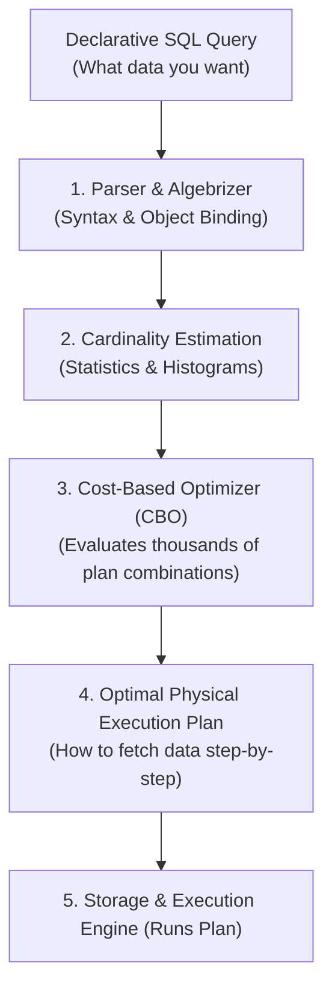
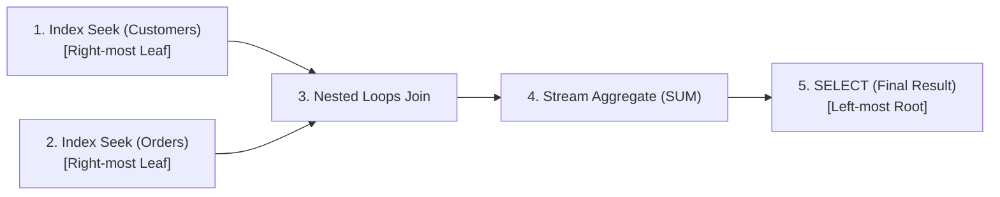
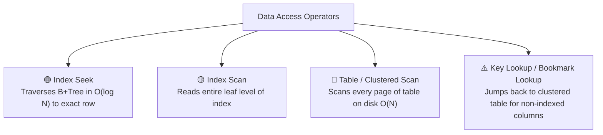
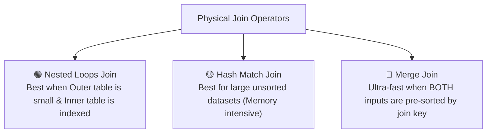
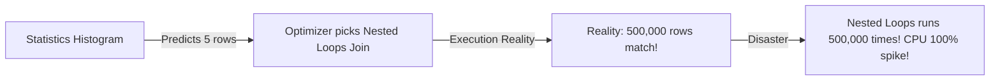
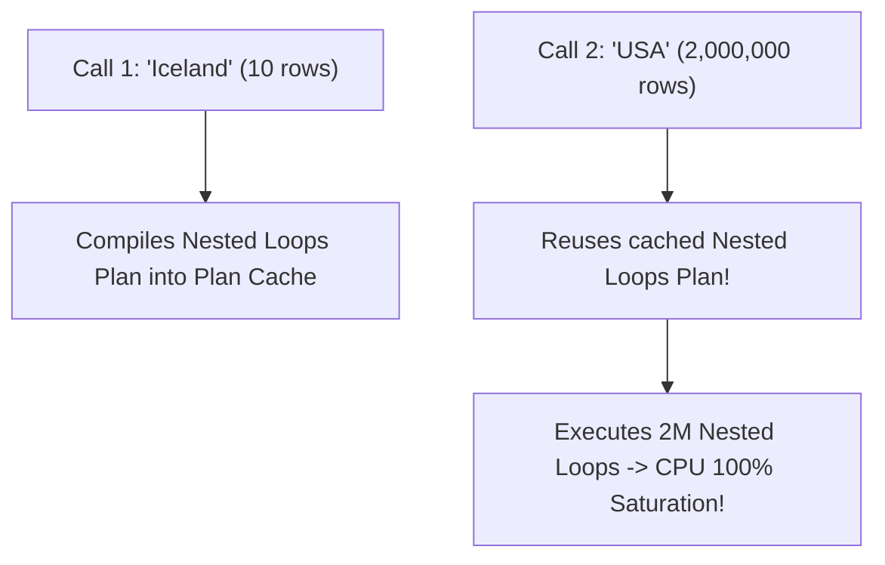

# 11 - Understanding Database Execution Plans (Deep Dive)

## 1. What is an Execution Plan?

When you submit a SQL query, relational database engines (SQL Server, PostgreSQL, MySQL, Oracle) do not execute the raw SQL text directly. Instead, the **Cost-Based Optimizer (CBO)** compiles your declarative SQL query into an **Execution Plan**—a tree of low-level physical operators instructing the storage engine exactly how to retrieve, join, filter, and sort data pages on disk and in memory.



---

## 2. Estimated vs. Actual Execution Plans

| Feature | Estimated Execution Plan | Actual Execution Plan |
| :--- | :--- | :--- |
| **Execution** | Generated **without running** the query. | Generated **after running** the query. |
| **Row Counts** | Shows only **Estimated Number of Rows** based on statistics. | Shows **Estimated vs. Actual Number of Rows** (detects estimation errors!). |
| **Runtime Metrics** | No actual CPU time, memory grant, or elapsed duration. | Contains exact **Actual Elapsed Time, Actual Memory Used, and I/O Reads**. |
| **When to Use** | Safe for analyzing dangerous/long queries in production. | Essential for deep performance diagnostics. |

---

## 3. The Golden Rule of Reading Execution Plans

> [!IMPORTANT]
> **Read Direction**: Execution plans are read **From Right to Left, and From Top to Bottom**.
>
> - **Leaf Operators (Far Right)**: Data retrieval starts here (Index Seeks, Scans).
> - **Middle Operators**: Joins, Filters, Aggregations, and Sorts.
> - **Root Operator (Far Left - `SELECT`)**: Returns final rows to client.
> - **Arrow Thickness**: Represents the **volume of rows** passing between operators. A thick arrow feeding into a thin arrow indicates an expensive late filter!



---

## 4. Deep Dive: Core Physical Operators

### 📂 A. Data Access Operators



#### 1. Index Seek (🟢 The Gold Standard)

- Uses the B+Tree root and branch pages to jump directly to matching rows in $O(\log N)$ operations.
- Typical cost: **2 to 4 logical reads**, regardless of table size (100 rows or 100 million rows).

#### 2. Clustered Index Scan / Table Scan (🔴 High Cost)

- Occurs when:
  - No matching index exists.
  - The query is non-sargable (e.g. `WHERE YEAR(OrderDate) = 2026`).
  - Table is so small that a table scan is cheaper than an index seek.
- Scans **100% of data pages on disk**. On a 50GB table, this causes massive disk I/O bottlenecks.

#### 3. Key Lookup / RID Lookup (⚠️ The Performance Killer)

- Occurs when a Non-Clustered Index satisfies the `WHERE` clause, but the `SELECT` list asks for columns **not included in the index**.
- For every matching row found, the engine must perform a separate lookup back into the Clustered Index table.
- If the query matches 50,000 rows, it performs **50,000 individual random disk/memory jumps**!
- **The Fix**: Create a **Covering Index** using `INCLUDE (ColumnA, ColumnB)`.

---

### 🔗 B. Join Operators

The Query Optimizer selects one of three physical join algorithms based on data volume and sorting:



| Operator | Algorithm Mechanism | Best Used When | Potential Risk |
| :--- | :--- | :--- | :--- |
| **Nested Loops** | For each row in Outer table, perform an **Index Seek** on Inner table. | Small outer dataset (1 – 1,000 rows) matching indexed inner table. | Catastrophic if outer dataset is unexpectedly large (millions of loops!). |
| **Hash Match** | Builds an in-memory Hash Table of the smaller input, then scans larger input and probes the hash table. | Large, unsorted, non-indexed datasets. | High memory consumption; will **Spill to TempDB** if memory grant is insufficient. |
| **Merge Join** | Simultaneously steps through both inputs like a zipper. | Both inputs are **already sorted** by the join column (e.g. indexed). | Fastest join algorithm with near-zero CPU/memory overhead. |

---

### 🔄 C. Sorting & Aggregation Operators

- **Sort Operator (⚠️ High Cost)**:
  - Occurs when `ORDER BY`, `GROUP BY`, or `DISTINCT` cannot be satisfied by an existing index order.
  - Sorting requires allocating a **Memory Grant**. If the dataset exceeds the memory grant, the engine **spills pages to TempDB disk**, causing execution time to spike from 10ms to 5,000ms!
- **Stream Aggregate (🟢 Fast)**:
  - Aggregates pre-sorted data on the fly as rows stream through.
- **Hash Aggregate (🟡 Heavy)**:
  - Uses an in-memory hash table to group unsorted values.

---

## 5. Cardinality Estimation & Outdated Statistics

### What is Cardinality Estimation?

Before compiling a query, the optimizer consults **Statistics (Histograms)** on indexed columns to predict:
*"How many rows will match `WHERE Status = 'Pending'`?"*



### How to spot Statistics Discrepancies in Execution Plans:

Hover over an operator in the plan and compare:

- **Estimated Number of Rows**: `1`
- **Actual Number of Rows**: `250,000`

If the actual count differs from estimated count by **10x or 100x**, your database statistics are stale!

### How to fix:

```sql
-- SQL Server:
UPDATE STATISTICS Products WITH FULLSCAN;

-- PostgreSQL:
ANALYZE VERBOSE Products;
```

---

## 6. Parameter Sniffing

### What is Parameter Sniffing?

When a parameterized query or Stored Procedure executes for the first time, SQL Server **"sniffs" the initial parameter value** and compiles an execution plan optimized specifically for that value.

### The Trap:

1. User 1 runs `GetOrdersByCountry('Iceland')` (matches 10 rows) ➔ Engine compiles a **Nested Loops + Index Seek** plan.
2. User 2 runs `GetOrdersByCountry('USA')` (matches 2,000,000 rows) ➔ Engine reuses the cached plan! It attempts to run 2 million Nested Loops, crashing server CPU!



### Solutions for Parameter Sniffing:

```sql
-- Solution 1: Optimize for an average representative value
SELECT * FROM Orders
WHERE Country = @Country
OPTION (OPTIMIZE FOR (@Country = 'USA'));

-- Solution 2: Force recompilation on every run (for highly volatile reporting queries)
SELECT * FROM Orders
WHERE Country = @Country
OPTION (RECOMPILE);
```

---

## 7. Real-World Case Study: Optimizing a Slow Query

### ❌ Before Optimization (High Latency)

```sql
SELECT CustomerId, OrderDate, TotalAmount
FROM Orders
WHERE CustomerId = 1042 AND OrderDate >= '2026-01-01'
ORDER BY OrderDate DESC;
```

**Execution Plan Analysis**:

- Index Seek on `IX_Orders_CustomerId` (5% cost).
- **Key Lookup** to Clustered Index for `TotalAmount` (70% cost).
- **Sort Operator** for `OrderDate DESC` (25% cost).
- **Total Metrics**: `48,000 logical reads`, `Elapsed Time: 850ms`.

---

### ✅ After Optimization: Creating a Perfect Covering Index

```sql
CREATE NONCLUSTERED INDEX IX_Orders_CustomerId_Date_Covering
ON Orders (CustomerId ASC, OrderDate DESC)
INCLUDE (TotalAmount);
```

**New Execution Plan Analysis**:

- **100% Index Seek** directly on `IX_Orders_CustomerId_Date_Covering`.
- **0 Key Lookups** (all required columns covered).
- **0 Sort Operators** (B+Tree is already sorted by `OrderDate DESC`).
- **Total Metrics**: `3 logical reads`, `Elapsed Time: 1ms` (⚡ **850x Faster**).

---

## 8. Diagnostic Commands to View Execution Plans

### PostgreSQL

```sql
EXPLAIN (ANALYZE, BUFFERS, VERBOSE, FORMAT JSON)
SELECT * FROM Products WHERE Price > 500;
```

### SQL Server (T-SQL)

```sql
SET STATISTICS IO ON;
SET STATISTICS TIME ON;

-- Turn on graphical XML execution plan
SET SHOWPLAN_XML ON;
SELECT * FROM Products WHERE Price > 500;
SET SHOWPLAN_XML OFF;
```

### SQLite

```sql
EXPLAIN QUERY PLAN
SELECT * FROM Products WHERE Price > 500;
```
