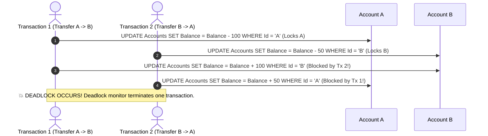
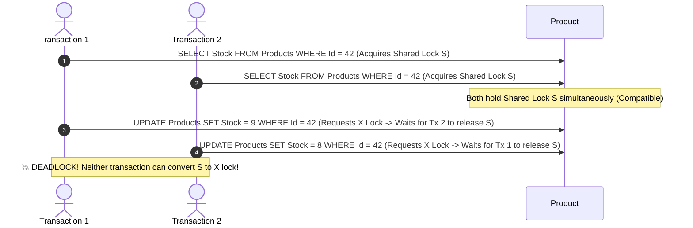

# 12 - Database Deadlocks: Identification, Analysis & Resolution (Deep Dive)

## 1. What is a Deadlock?

A **Deadlock** is a concurrency condition in a relational database where two or more independent transactions hold locks on separate resources and each transaction attempts to acquire a lock on the resource already held by the other, resulting in a **circular blocking chain** where neither transaction can proceed.

```mermaid
graph TD
    Tx1["Transaction 1<br/>(Holds Lock on Table A)"] -->|Requests Lock on Table B (Blocked)| TableB["Table B<br/>(Locked by Tx 2)"]
    Tx2["Transaction 2<br/>(Holds Lock on Table B)"] -->|Requests Lock on Table A (Blocked)| TableA["Table A<br/>(Locked by Tx 1)"]

    style TableA fill:#d32f2f,color:#fff
    style TableB fill:#d32f2f,color:#fff
```

### The 4 Necessary Conditions for a Deadlock (Coffman Conditions):
1. **Mutual Exclusion**: Resources cannot be shared simultaneously in conflicting lock modes (e.g. Exclusive `X` locks).
2. **Hold and Wait**: A transaction holds at least one lock while waiting to acquire another.
3. **No Preemption**: A lock cannot be forcibly taken away from a running transaction until it commits or rolls back.
4. **Circular Wait**: A closed chain of transactions exists where each waits for the next.

---

## 2. How the Database Deadlock Detector Works

Relational engines (SQL Server, PostgreSQL, MySQL) have an internal background thread called the **Deadlock Monitor**:


### How the Engine Picks the "Victim":
1. **Rollback Cost (Default)**: The engine evaluates the transaction log size and terminates the transaction that has written the least data to disk (cheapest CPU/IO rollback).
2. **Deadlock Priority**: Developers can assign priority explicitly:
   ```sql
   SET DEADLOCK_PRIORITY LOW;    -- Will be picked as victim first
   SET DEADLOCK_PRIORITY HIGH;   -- Protected from being chosen as victim
   ```

---

## 3. The 4 Classic Deadlock Scenarios

### ❌ Scenario 1: Reverse-Order Access Deadlock (The Most Common)
Two transactions update the same two tables or rows, but in opposite order:



---

### ❌ Scenario 2: Lock Conversion Deadlock (Read-Then-Write)
Occurs when two transactions read a row with a **Shared Lock (`S`)**, and then both attempt to update the same row with an **Exclusive Lock (`X`)**:



---

### ❌ Scenario 3: Index Lookup & Bookmark Lookup Deadlock
Occurs when a **Writer** updates a Clustered table row while holding an Exclusive lock and attempts to update a Non-Clustered index, while a concurrent **Reader** scans the Non-Clustered index and attempts a Key Lookup back to the Clustered table.

---

### ❌ Scenario 4: Lock Escalation Deadlock
When a transaction modifies more than 5,000 individual rows, the engine attempts to escalate fine-grained **Row Locks** to a coarse **Table Lock**. If another transaction already holds a single row lock on that table, lock escalation deadlocks!

---

## 4. How to Capture & Identify Deadlocks

### A. In SQL Server: Extended Events & Trace Flag 1222

#### Option 1: View Default `system_health` Session (Already running in SQL Server!)
```sql
-- Query the built-in system_health ring buffer for past deadlock graphs:
SELECT
    XEvent.query('(event/data/value/deadlock)[1]') AS DeadlockGraphXml,
    XEvent.value('(event/@timestamp)[1]', 'datetime2') AS TimestampUtc
FROM
(
    SELECT CAST(target_data AS XML) AS TargetData
    FROM sys.dm_xe_session_targets st
    JOIN sys.dm_xe_sessions s ON s.address = st.event_session_address
    WHERE s.name = 'system_health' AND st.target_name = 'ring_buffer'
) AS Data
CROSS APPLY TargetData.nodes('RingBufferTarget/event[@name="xml_deadlock_report"]') AS XEventNodes(XEvent);
```

#### Option 2: Enable Trace Flag 1222 (Writes XML graph to SQL Server Error Log):
```sql
DBCC TRACEON (1222, -1);
```

---

### B. In PostgreSQL: `deadlock_timeout` & Server Logs

In `postgresql.conf`:
```ini
log_lock_waits = on
deadlock_timeout = 1000ms # Logs deadlocks after 1 second
log_min_duration_statement = 2000
```

PostgreSQL log output on deadlock:
```
ERROR:  deadlock detected
DETAIL:  Process 14022 waits for ExclusiveLock on relation of tuple (0,2); blocked by process 14023.
Process 14023 waits for ExclusiveLock on relation of tuple (0,1); blocked by process 14022.
HINT:  See server log for query details.
```

---

## 5. How to Read an XML Deadlock Graph

An XML deadlock graph contains two critical sections:

```xml
<deadlock-list>
  <deadlock victim="process1234">
    <!-- 1. PROCESS LIST: Who was involved? -->
    <process-list>
      <process id="process1234" spid="55" lockMode="X" status="suspended" clientapp=".NET SqlClient">
        <executionStack>
          <frame procname="TransferFunds" line="45" sqlhandle="0x020000..."/>
        </executionStack>
        <inputbuf>UPDATE Accounts SET Balance = Balance + @Amount WHERE Id = @ToId</inputbuf>
      </process>
      <process id="process5678" spid="62" lockMode="X" status="running" clientapp=".NET SqlClient">
        <inputbuf>UPDATE Accounts SET Balance = Balance - @Amount WHERE Id = @FromId</inputbuf>
      </process>
    </process-list>

    <!-- 2. RESOURCE LIST: What resources were locked? -->
    <resource-list>
      <keylock objectname="dbo.Accounts" indexname="PK_Accounts" mode="X">
        <owner-list><owner id="process5678" mode="X"/></owner-list>
        <waiter-list><waiter id="process1234" mode="X" requestType="wait"/></waiter-list>
      </keylock>
    </resource-list>
  </deadlock>
</deadlock-list>
```

---

## 6. The 6 Proven Strategies to Resolve & Eliminate Deadlocks

### 🛡️ Strategy 1: Enforce Strict Chronological Object Access Order
Always access, update, and lock tables and rows in the **exact same deterministic order** across every stored procedure, command handler, and background job:

```csharp
// ✅ Prevent Account Transfer Deadlocks by sorting IDs ascending before locking!
public async Task TransferMoneyAsync(int fromAccountId, int toAccountId, decimal amount)
{
    var firstId = Math.Min(fromAccountId, toAccountId);
    var secondId = Math.Max(fromAccountId, toAccountId);

    using var tx = await _context.Database.BeginTransactionAsync();

    // Always locks in deterministic order (e.g. Account 10 first, then Account 20)!
    var firstAccount = await _context.Accounts.FindAsync(firstId);
    var secondAccount = await _context.Accounts.FindAsync(secondId);

    // Apply business logic
    // ...
    await _context.SaveChangesAsync();
    await tx.CommitAsync();
}
```

---

### 🛡️ Strategy 2: Use `UPDLOCK` to Prevent Conversion Deadlocks
When you read a row with the intention of updating it in the same transaction, do not acquire a standard Shared (`S`) lock. Acquire an **Update (`UPDLOCK`) lock immediately**:

```sql
-- ✅ Prevents two transactions from concurrently holding S locks and deadlocking on upgrade:
BEGIN TRANSACTION;
SELECT StockQuantity
FROM Products WITH (UPDLOCK, ROWLOCK)
WHERE Id = 42;

UPDATE Products SET StockQuantity = StockQuantity - 1 WHERE Id = 42;
COMMIT TRANSACTION;
```
*`UPDLOCK` is mutually exclusive with other `UPDLOCK`s, so Transaction 2 waits at line 2 instead of deadlocking on line 4!*

---

### 🛡️ Strategy 3: Enable Read-Committed Snapshot Isolation (RCSI / MVCC)
In SQL Server and PostgreSQL:
```sql
-- Enable Read-Committed Snapshot Isolation (RCSI):
ALTER DATABASE CleanArchDb SET READ_COMMITTED_SNAPSHOT ON WITH ROLLBACK IMMEDIATE;
```
- **Why this eliminates 80% of deadlocks**: Readers use row versioning in `tempdb` / WAL snapshot. **Readers NEVER take Shared (`S`) locks, and Readers NEVER block Writers!**

---

### 🛡️ Strategy 4: Keep Transactions Ultra-Short
- Never make external HTTP calls (Stripe, email, third-party APIs) inside a database transaction.
- Never execute heavy CPU loops or JSON serialization inside an open transaction.
- Prepare all data in C# memory *before* opening `BeginTransactionAsync()`.

---

### 🛡️ Strategy 5: Add Covering Indexes to Eliminate Key Lookups
Eliminate index-versus-table locking deadlocks by adding `INCLUDE` columns so readers never touch the Clustered table during index scans.

---

### 🛡️ Strategy 6: Resilient Application Retry Policies (Polly & EF Core)
Even in well-tuned systems, transient deadlocks can occasionally occur. Implement automatic retries with exponential backoff for SQL error code `1205`:

```csharp
// In DependencyInjection.cs:
builder.Services.AddDbContext<AppDbContext>(options =>
{
    options.UseSqlServer(connectionString, sqlOptions =>
    {
        // Automatically catches Deadlock Victim (Error 1205) and retries up to 3 times!
        sqlOptions.EnableRetryOnFailure(
            maxRetryCount: 3,
            maxRetryDelay: TimeSpan.FromSeconds(2),
            errorNumbersToAdd: new[] { 1205 });
    });
});
```
