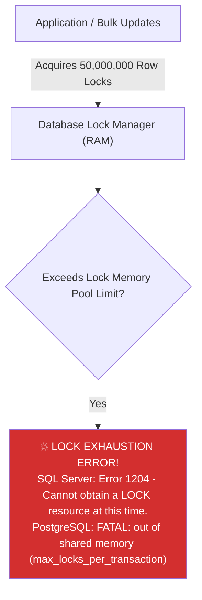
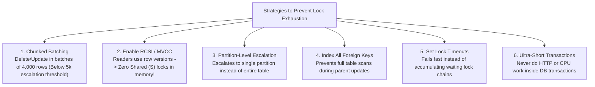

# 13 - Database Lock Exhaustion, Memory Pressure & Lock Escalation (Deep Dive)

## 1. What is Lock Exhaustion?

Every lock acquired by a database engine (Row lock, Key lock, Page lock, Table lock) is not free—it is a **physical in-memory data structure** allocated by the engine's Lock Manager in dedicated server RAM.
- In **SQL Server**, each lock structure and lock owner consumes **~64 to 128 bytes of memory**.
- In **PostgreSQL**, locks are tracked in a fixed-size shared memory hash table configured by `max_locks_per_transaction`.

**Lock Exhaustion** occurs when concurrent transactions acquire millions of fine-grained locks simultaneously, consuming the entire allocated **Lock Memory Pool** in RAM.



When lock exhaustion occurs:
- The database engine **refuses all new transactions and incoming queries**.
- Existing transactions that attempt to acquire additional locks fail and roll back immediately.
- Application servers experience cascading `500 Internal Server Errors` and connection timeouts.

---

## 2. The Granularity Hierarchy & Lock Escalation

Relational database engines support multiple levels of lock granularity to balance **Concurrency** against **Memory Overhead**:

```mermaid
graph TD
    subgraph Fine-Grained (High Concurrency, High Memory)
        Row["1. Row / Key Lock (RID / KEY)<br/>Cost: ~96 bytes per locked row. Concurrency: Maximum"]
        Page["2. Page Lock (PAGE - 8KB)<br/>Cost: ~96 bytes per locked page. Concurrency: Medium"]
    end

    subgraph Coarse-Grained (Low Concurrency, Low Memory)
        Part["3. Partition Lock (Hobt / Partition)<br/>Cost: 1 single lock per partition. Concurrency: High for other partitions"]
        Table["4. Table Lock (OBJECT / TAB)<br/>Cost: 1 single lock for entire table (~96 bytes). Concurrency: ZERO (Blocks all other users!)"]
    end

    Row -->|Escalation (> 5,000 locks)| Table
    Page -->|Escalation| Table
```

### What is Lock Escalation?
**Lock Escalation** is an internal defense mechanism designed by database architects to prevent lock exhaustion.
- In **SQL Server**, when a single SQL statement acquires **more than 5,000 row/key locks on a single table**, the Lock Manager attempts to convert all thousands of individual row locks into **one single Table Lock (`TAB-X` or `TAB-S`)**.
- **The Trade-Off**: Lock memory drops from 500MB to 96 bytes, but **concurrency drops to ZERO**—all other users attempting to read or write to that table are blocked until the transaction commits!

---

## 3. The 4 Root Causes of Lock Exhaustion in Production

### 1. Giant Unbatched `DELETE` or `UPDATE` Statements
```sql
-- ❌ Disaster: Attempts to lock 30 million rows in a single atomic transaction!
DELETE FROM AuditLogs WHERE CreatedAt < '2025-01-01';
```
- Holds millions of row locks in memory simultaneously. If lock escalation is blocked by concurrent readers, the Lock Manager exhausts all available server memory and crashes with **Error 1204**.

### 2. Unindexed Foreign Keys (Table-Wide Share Locks)
When deleting a parent row from `Customers`, the database must check the `Orders` child table to verify no orphan records exist.
- If `Orders.CustomerId` is **not indexed**, the engine must acquire a **Table-Level Shared Lock on the entire Orders table** or scan millions of rows, blowing through lock memory limits!

### 3. Application Lag Inside Open Database Transactions
```csharp
// ❌ Disaster: Open transaction holding locks while waiting on slow external network I/O!
using var tx = await context.Database.BeginTransactionAsync();
var product = await context.Products.FindAsync(productId); // Locks row

// Network call takes 4 seconds! Locks accumulate and block the entire DB!
var paymentResult = await _stripeService.ChargeAsync(...);

await context.SaveChangesAsync();
await tx.CommitAsync();
```

### 4. Disabling Lock Escalation without Batching
Running `ALTER TABLE LargeTable SET (LOCK_ESCALATION = DISABLE);` without chunking your update scripts forces the engine to maintain millions of row locks indefinitely until memory runs out.

---

## 4. How to Detect & Diagnose Lock Exhaustion

### A. Detecting Active Lock Memory in SQL Server
```sql
-- 1. Check total memory consumed by the Lock Manager in MB:
SELECT
    type,
    name,
    pages_kb / 1024 AS LockMemoryMB
FROM sys.dm_os_memory_clerks
WHERE type = 'MEMORYCLERK_SQLGENERAL' OR type = 'MEMORYCLERK_SQLBUFFERPOOL';

-- 2. Count active locks grouped by resource type and mode:
SELECT
    resource_type,
    request_mode,
    request_status,
    COUNT(*) AS ActiveLockCount
FROM sys.dm_tran_locks
GROUP BY resource_type, request_mode, request_status
ORDER BY ActiveLockCount DESC;
```

### B. Checking Lock Escalation Events in SQL Server
```sql
-- Check Lock Escalations and Lock Timeouts since instance startup:
SELECT
    cntr_value AS LockEscalationsPerSec
FROM sys.dm_os_performance_counters
WHERE counter_name = 'Lock Escalations/sec';
```

### C. Detecting Lock Memory in PostgreSQL
```sql
-- Check active locks count per relation in PostgreSQL:
SELECT
    c.relname,
    l.mode,
    l.granted,
    COUNT(*) AS lock_count
FROM pg_locks l
JOIN pg_class c ON l.relation = c.oid
GROUP BY c.relname, l.mode, l.granted
ORDER BY lock_count DESC;
```

---

## 5. The 6 Production Strategies to Prevent Lock Exhaustion



---

### 🛡️ Strategy 1: Chunked Batch Processing (The Golden Standard)
Never update or delete millions of rows in one query. Break operations into **batches of 4,000 rows** (strictly below the 5,000-row lock escalation threshold):

```sql
-- ✅ Clean, non-blocking chunked batch delete in SQL Server:
DECLARE @BatchSize INT = 4000;
DECLARE @RowsAffected INT = 1;

WHILE @RowsAffected > 0
BEGIN
    DELETE TOP (@BatchSize)
    FROM AuditLogs
    WHERE CreatedAt < '2025-01-01';

    SET @RowsAffected = @@ROWCOUNT;

    -- Optional: 100ms pause to yield CPU & let transaction logs flush
    WAITFOR DELAY '00:00:00.100';
END;
```

In **PostgreSQL**:
```sql
-- Chunked delete in PostgreSQL using CTID:
DELETE FROM audit_logs
WHERE ctid IN (
    SELECT ctid
    FROM audit_logs
    WHERE created_at < '2025-01-01'
    LIMIT 4000
);
```

---

### 🛡️ Strategy 2: Enable Read-Committed Snapshot Isolation (RCSI / MVCC)
- **Why this eliminates 90% of lock memory**: Under RCSI (SQL Server) and MVCC (PostgreSQL), `SELECT` queries **never acquire Shared (`S`) locks**.
- Instead of allocating millions of row lock structures for readers, queries read committed snapshots from the version store (`tempdb` / WAL), freeing up virtually all lock manager memory for write operations!

```sql
-- Enable RCSI in SQL Server:
ALTER DATABASE CleanArchDb SET READ_COMMITTED_SNAPSHOT ON WITH ROLLBACK IMMEDIATE;
```

---

### 🛡️ Strategy 3: Partition-Level Lock Escalation (`LOCK_ESCALATION = AUTO`)
If your table is partitioned by date/range, configure SQL Server to escalate locks to the **Partition level** instead of the entire table:

```sql
-- Escalates locks ONLY to the affected partition (e.g. Year 2025 partition), leaving other partitions unlocked!
ALTER TABLE Orders SET (LOCK_ESCALATION = AUTO);
```

---

### 🛡️ Strategy 4: Enforce Lock Timeouts
By default, SQL Server and PostgreSQL wait indefinitely for locks. Setting a **Lock Timeout** prevents runaway transactions from queuing up millions of waiting lock structures:

```sql
-- Fail and throw error if lock cannot be acquired within 5 seconds (5000ms):
SET LOCK_TIMEOUT 5000;
```

In C# EF Core:
```csharp
context.Database.SetCommandTimeout(5); // 5 seconds timeout
```

---

### 🛡️ Strategy 5: Always Index Foreign Key Columns
```sql
-- Ensure foreign key column is covered by a non-clustered index:
CREATE NONCLUSTERED INDEX IX_Orders_CustomerId ON Orders (CustomerId);
```
*Prevents table-level shared locks on child tables during parent row deletions.*
