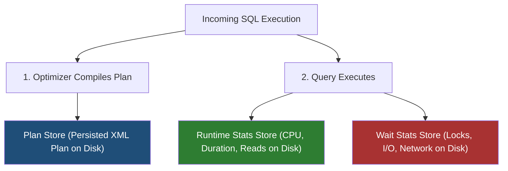
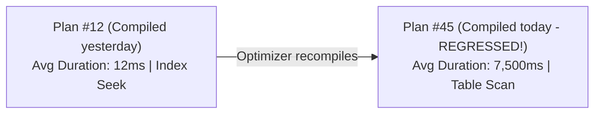

# 14 - Database Query Store & Performance Diagnostics (Deep Dive)

## 1. What is Query Store? The Database "Flight Data Recorder"

In traditional database management, performance diagnostic dynamic management views (DMVs like `sys.dm_exec_query_stats`) live **only in volatile RAM**. When the database server restarts, fails over, or clears its plan cache due to memory pressure, all historical execution performance data is lost forever.

**Query Store** is a persistent performance monitoring feature built directly into the database engine (available in **Microsoft SQL Server, Azure SQL**, and conceptually matching PostgreSQL's `pg_stat_statements` / `pg_store_plans`).
- It captures a **complete historical record** of all executed queries, their compiled execution plans, runtime statistics (CPU, duration, logical reads), and wait statistics.
- It stores this telemetry **inside the database on disk**, surviving restarts and failovers with **less than 1–2% CPU overhead**!



---

## 2. Query Store Internal Architecture

Query Store operates across three synchronized stores:

| Internal Store | What It Persists | Key Metrics Captured |
| :--- | :--- | :--- |
| **Plan Store** | Every distinct execution plan generated for each query. | Plan ID, XML Execution Plan, optimization level, compilation CPU time. |
| **Runtime Stats Store** | Aggregated execution telemetry over time intervals (e.g. 15-minute windows). | Total executions, min/max/avg **Duration, CPU time, Logical Reads/Writes, Memory Grants, Row counts**. |
| **Wait Stats Store** | Why the query spent time waiting during execution. | Lock waits, Buffer I/O waits, Memory waits, CPU scheduling (`SOS_SCHEDULER_YIELD`). |

---

## 3. How to Enable and Configure Query Store

Query Store is configured on a per-database level:

```sql
-- Enable Query Store with production best practices:
ALTER DATABASE [CleanArchDb] SET QUERY_STORE = ON (
    OPERATION_MODE = READ_WRITE,                -- Collects metrics & allows plan forcing
    CLEANUP_POLICY = (STALE_CAPTURE_POLICY_THRESHOLD = 30 DAYS), -- Retain 30 days of history
    DATA_FLUSH_INTERVAL_SECONDS = 900,          -- Flushes in-memory cache to disk every 15 mins
    INTERVAL_LENGTH_MINUTES = 60,               -- Aggregates runtime stats into 1-hour buckets
    MAX_STORAGE_SIZE_MB = 2048,                 -- Max disk space allocated (2GB)
    QUERY_CAPTURE_MODE = AUTO,                  -- Ignores one-off noisy ad-hoc queries
    SIZE_BASED_CLEANUP_MODE = AUTO,             -- Automatically purges oldest data when near 2GB
    WAIT_STATS_CAPTURE_MODE = ON                -- Captures wait statistics
);
```

---

## 4. The 4 Killer Use Cases of Query Store

### 🚀 Use Case 1: Detecting "Regressed Queries"
A query that executed in **10ms yesterday** suddenly takes **8,000ms today** because:
- Database statistics changed.
- An index was dropped or modified.
- **Parameter Sniffing** compiled a bad plan.

Query Store automatically identifies queries with multiple execution plans where average duration or CPU time worsened significantly.



---

### 🛡️ Use Case 2: Instant Plan Forcing (`sp_query_store_force_plan`)
When a production query regresses at 2:00 AM, you do not have time to rewrite C# code, redeploy services, or wait for testing.

**Plan Forcing** allows an engineer to force the database engine to **always use the known good execution plan** with a single T-SQL command!

```sql
-- Instantly force Plan ID 12 for Query ID 88:
EXEC sp_query_store_force_plan
    @query_id = 88,
    @plan_id = 12;
```
*The database engine immediately overrides the optimizer and executes Plan 12 on all subsequent requests without code changes or downtime!*

To remove the forced plan later:
```sql
EXEC sp_query_store_unforce_plan
    @query_id = 88,
    @plan_id = 12;
```

---

### 🤖 Use Case 3: Automatic Plan Correction (Self-Healing Database)
In modern SQL Server and Azure SQL, you can configure the database to **heal itself automatically**. When the engine detects that an execution plan regressed and is performing significantly worse than the previous plan, it **automatically forces the last good plan** without human intervention!

```sql
-- Enable Automatic Plan Correction (Self-Healing):
ALTER DATABASE [CleanArchDb]
SET AUTOMATIC_TUNING (FORCE_LAST_GOOD_PLAN = ON);
```

---

### 📊 Use Case 4: Identifying Top Resource-Consuming Queries
Find exactly which queries consume 80% of your database server's CPU or disk I/O over the last 24 hours.

---

## 5. Essential Diagnostic T-SQL Queries for Query Store

### 🔍 Query 1: Find Top 10 Queries by Total CPU Consumption
```sql
SELECT TOP 10
    q.query_id,
    qt.query_sql_text,
    p.plan_id,
    rs.count_executions,
    ROUND(rs.avg_cpu_time / 1000.0, 2) AS AvgCpuTimeMs,
    ROUND(rs.avg_duration / 1000.0, 2) AS AvgDurationMs,
    ROUND(rs.avg_logical_io_reads, 0) AS AvgLogicalReads,
    rs.last_execution_time
FROM sys.query_store_query q
JOIN sys.query_store_query_text qt ON q.query_text_id = qt.query_text_id
JOIN sys.query_store_plan p ON q.query_id = p.query_id
JOIN sys.query_store_runtime_stats rs ON p.plan_id = rs.plan_id
JOIN sys.query_store_runtime_stats_interval rsi ON rs.runtime_stats_interval_id = rsi.runtime_stats_interval_id
WHERE rsi.start_time >= DATEADD(HOUR, -24, GETUTCDATE())
ORDER BY rs.avg_cpu_time DESC;
```

---

### 🔍 Query 2: Find Regressed Queries (Multiple Plans with Performance Drop)
```sql
SELECT
    q.query_id,
    qt.query_sql_text,
    p.plan_id,
    p.is_forced_plan,
    rs.count_executions,
    ROUND(rs.avg_duration / 1000.0, 2) AS AvgDurationMs,
    rs.last_execution_time
FROM sys.query_store_query q
JOIN sys.query_store_query_text qt ON q.query_text_id = qt.query_text_id
JOIN sys.query_store_plan p ON q.query_id = p.query_id
JOIN sys.query_store_runtime_stats rs ON p.plan_id = rs.plan_id
WHERE q.query_id IN (
    -- Queries with 2 or more distinct execution plans:
    SELECT query_id
    FROM sys.query_store_plan
    GROUP BY query_id
    HAVING COUNT(DISTINCT plan_id) > 1
)
ORDER BY q.query_id, rs.avg_duration DESC;
```

---

### 🔍 Query 3: Identify What Queries Are Waiting On (Wait Categories)
```sql
SELECT
    ws.wait_category_desc,
    ROUND(SUM(ws.total_query_wait_time_ms), 2) AS TotalWaitTimeMs,
    ROUND(AVG(ws.avg_query_wait_time_ms), 2) AS AvgWaitTimeMs,
    COUNT(DISTINCT p.plan_id) AS DistinctPlansCount
FROM sys.query_store_wait_stats ws
JOIN sys.query_store_plan p ON ws.plan_id = p.plan_id
JOIN sys.query_store_runtime_stats_interval rsi ON ws.runtime_stats_interval_id = rsi.runtime_stats_interval_id
WHERE rsi.start_time >= DATEADD(HOUR, -24, GETUTCDATE())
GROUP BY ws.wait_category_desc
ORDER BY TotalWaitTimeMs DESC;
```
*Common wait categories: `Lock` (concurrency contention), `Buffer IO` (disk reads/missing index), `CPU` (scheduling starvation).*
